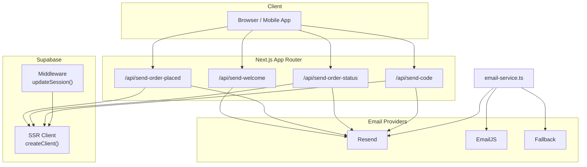
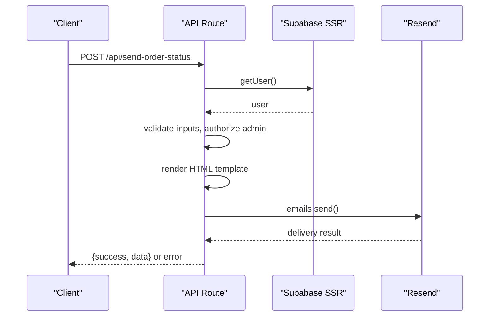
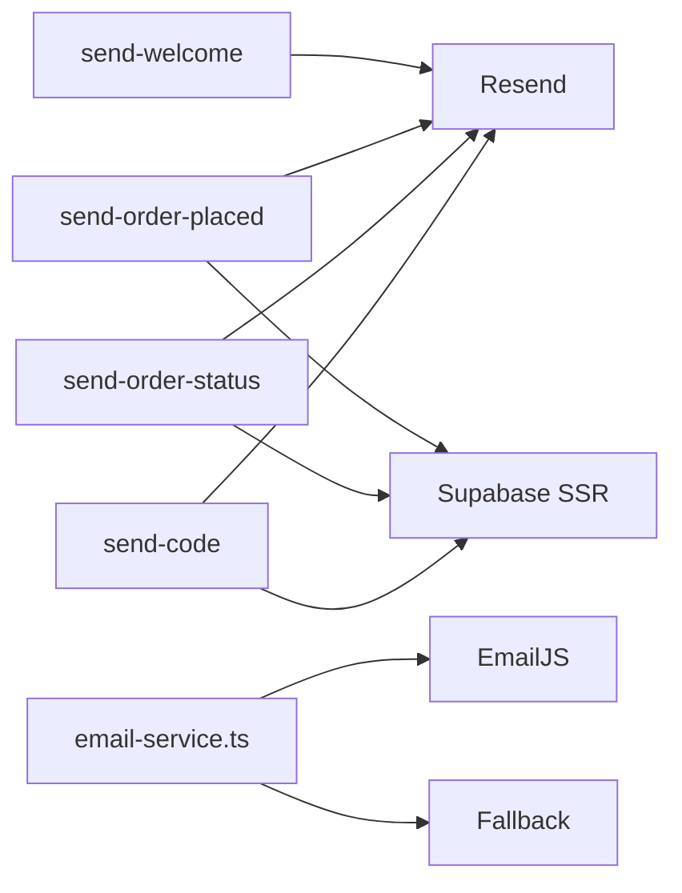
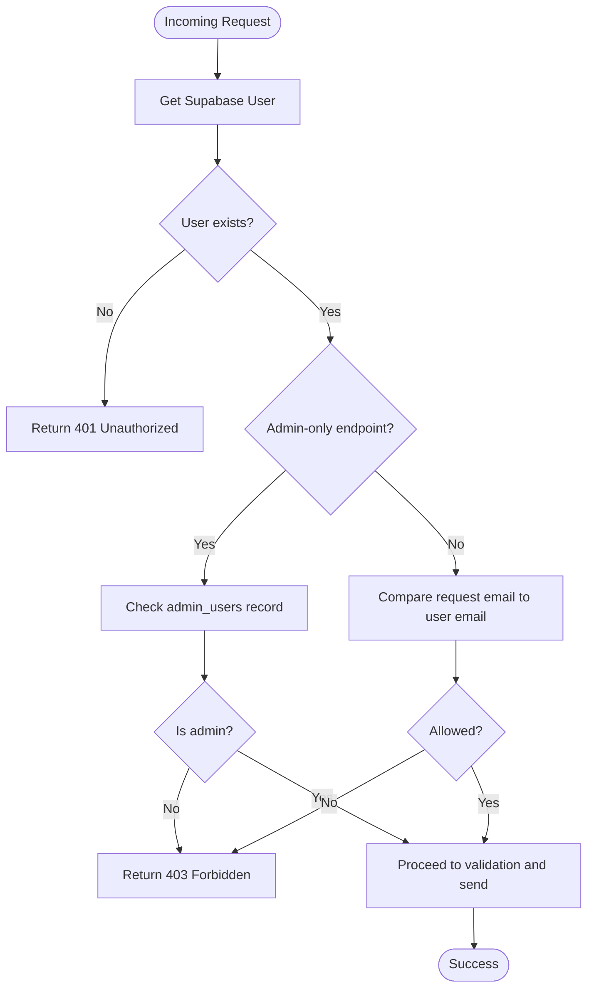

# API Endpoints

<cite>
**Referenced Files in This Document**
- [send-welcome route.ts](file://app/api/send-welcome/route.ts)
- [send-order-placed route.ts](file://app/api/send-order-placed/route.ts)
- [send-order-status route.ts](file://app/api/send-order-status/route.ts)
- [send-code route.ts](file://app/api/send-code/route.ts)
- [email-service.ts](file://lib/email-service.ts)
- [email-fallback.ts](file://lib/email-fallback.ts)
- [supabase server.ts](file://lib/supabase/server.ts)
- [middleware.ts](file://middleware.ts)
- [supabase middleware.ts](file://lib/supabase/middleware.ts)
- [package.json](file://package.json)
</cite>

## Table of Contents
1. [Introduction](#introduction)
2. [Project Structure](#project-structure)
3. [Core Components](#core-components)
4. [Architecture Overview](#architecture-overview)
5. [Detailed Component Analysis](#detailed-component-analysis)
6. [Dependency Analysis](#dependency-analysis)
7. [Performance Considerations](#performance-considerations)
8. [Troubleshooting Guide](#troubleshooting-guide)
9. [Conclusion](#conclusion)
10. [Appendices](#appendices)

## Introduction
This document describes the serverless API endpoints that power email services and contact-related functionality for Byiora. It focuses on:
- send-welcome: Registration confirmation emails
- send-order-placed: Purchase confirmation emails
- send-order-status: Order status update emails (completed/failed)
- send-code: Gift card delivery emails
- Contact form submission flow

It covers HTTP methods, URL patterns, request/response schemas, authentication, error handling, rate limiting considerations, provider integrations, template management, fallback mechanisms, security, input validation, client implementation guidelines, testing approaches, and monitoring/logging strategies.

## Project Structure
The API endpoints are implemented as Next.js App Router API routes under app/api. Email delivery is handled via Resend for most endpoints, with EmailJS and a fallback mechanism used elsewhere. Authentication relies on Supabase SSR client and middleware.

**Diagram sources**
- [send-welcome route.ts:1-69](file://app/api/send-welcome/route.ts#L1-L69)
- [send-order-placed route.ts:1-90](file://app/api/send-order-placed/route.ts#L1-L90)
- [send-order-status route.ts:1-188](file://app/api/send-order-status/route.ts#L1-L188)
- [send-code route.ts:1-91](file://app/api/send-code/route.ts#L1-L91)
- [email-service.ts:1-126](file://lib/email-service.ts#L1-L126)
- [supabase server.ts:1-36](file://lib/supabase/server.ts#L1-L36)
- [supabase middleware.ts:1-96](file://lib/supabase/middleware.ts#L1-L96)

**Section sources**
- [send-welcome route.ts:1-69](file://app/api/send-welcome/route.ts#L1-L69)
- [send-order-placed route.ts:1-90](file://app/api/send-order-placed/route.ts#L1-L90)
- [send-order-status route.ts:1-188](file://app/api/send-order-status/route.ts#L1-L188)
- [send-code route.ts:1-91](file://app/api/send-code/route.ts#L1-L91)
- [email-service.ts:1-126](file://lib/email-service.ts#L1-L126)
- [supabase server.ts:1-36](file://lib/supabase/server.ts#L1-L36)
- [supabase middleware.ts:1-96](file://lib/supabase/middleware.ts#L1-L96)

## Core Components
- Resend integration: Used by send-welcome, send-order-placed, send-order-status, and send-code for sending transactional emails.
- Supabase SSR client: Used by order-related endpoints to authenticate callers and optionally authorize admins.
- EmailJS + Fallback: Used by email-service.ts for order confirmation emails and includes a fallback mechanism for resilience.
- DOMPurify: Sanitization of dynamic content embedded into HTML templates.

Key runtime dependencies include Resend, DOMPurify, and EmailJS.

**Section sources**
- [package.json:11-39](file://package.json#L11-L39)
- [send-welcome route.ts:1-69](file://app/api/send-welcome/route.ts#L1-L69)
- [send-order-placed route.ts:1-90](file://app/api/send-order-placed/route.ts#L1-L90)
- [send-order-status route.ts:1-188](file://app/api/send-order-status/route.ts#L1-L188)
- [send-code route.ts:1-91](file://app/api/send-code/route.ts#L1-L91)
- [email-service.ts:1-126](file://lib/email-service.ts#L1-L126)
- [email-fallback.ts:1-31](file://lib/email-fallback.ts#L1-L31)

## Architecture Overview
The endpoints follow a pattern:
- Validate and sanitize inputs
- Authenticate caller (via Supabase SSR client)
- Enforce authorization rules (e.g., admin-only)
- Render HTML templates with sanitized data
- Send via Resend
- Return structured JSON responses

**Diagram sources**
- [send-order-status route.ts:8-187](file://app/api/send-order-status/route.ts#L8-L187)
- [supabase server.ts:5-35](file://lib/supabase/server.ts#L5-L35)

## Detailed Component Analysis

### send-welcome
- Method: POST
- URL: /api/send-welcome
- Purpose: Sends a welcome email to newly registered users.
- Authentication: None (open endpoint)
- Request body:
  - email: string, required
  - userName: string, optional (sanitized)
- Response:
  - On success: { success: true, data }
  - On validation error: { error: "Email is required" } (400)
  - On failure: { error: "Failed to send welcome email" } (500)
- Security:
  - Input sanitized before embedding into HTML.
  - No authentication required; consider rate limiting at ingress.
- Provider: Resend
- Template: Built-in HTML with branding and links.

Example request
- POST /api/send-welcome
- Body: {"email":"customer@example.com","userName":"Alex"}

Example response (success)
- 200 OK
- Body: {"success":true,"data":{...}}

**Section sources**
- [send-welcome route.ts:7-68](file://app/api/send-welcome/route.ts#L7-L68)

### send-order-placed
- Method: POST
- URL: /api/send-order-placed
- Purpose: Confirms order placement and provides initial status.
- Authentication: Required (user must be authenticated)
- Authorization: Caller must match the email in the request.
- Request body:
  - email: string, required
  - userName: string, optional (sanitized)
  - productName: string, optional (sanitized)
  - denomination: string, optional (sanitized)
  - transactionId: string, optional
- Response:
  - On success: { success: true, data }
  - On unauthorized: { error: "Unauthorized" } (401)
  - On forbidden: { error: "Forbidden" } (403)
  - On validation error: { error: "Email is required" } (400)
  - On failure: { error: "Failed to send placed email" } (500)
- Provider: Resend
- Template: Built-in HTML with order summary and transaction ID.

Example request
- POST /api/send-order-placed
- Body: {"email":"customer@example.com","userName":"Alex","productName":"Steam Wallet","denomination":"$50","transactionId":"txn_abc123"}

Example response (success)
- 200 OK
- Body: {"success":true,"data":{...}}

**Section sources**
- [send-order-placed route.ts:8-89](file://app/api/send-order-placed/route.ts#L8-L89)

### send-order-status
- Method: POST
- URL: /api/send-order-status
- Purpose: Notifies customer about order completion or failure.
- Authentication: Required (user must be authenticated)
- Authorization: Admin-only endpoint.
- Request body:
  - email: string, required
  - status: string, required ("Completed" or "Failed")
  - userName: string, optional (sanitized)
  - productName: string, optional (sanitized)
  - denomination: string, optional (sanitized)
  - remarks: string, optional (sanitized)
  - transactionId: string, optional
- Response:
  - On success: { success: true, data }
  - On unauthorized: { error: "Unauthorized" } (401)
  - On forbidden: { error: "Forbidden: Admins only" } (403)
  - On validation error: { error: "Email and Status are required" } (400)
  - On failure: { error: "Failed to send status email" } (500)
- Provider: Resend
- Templates: Two HTML templates (green for success, red for failure) with distinct styling and messaging.

Example request (completed)
- POST /api/send-order-status
- Body: {"email":"customer@example.com","status":"Completed","productName":"Steam Wallet","denomination":"$50","transactionId":"txn_abc123"}

Example request (failed)
- POST /api/send-order-status
- Body: {"email":"customer@example.com","status":"Failed","productName":"Steam Wallet","denomination":"$50","remarks":"Payment declined","transactionId":"txn_abc123"}

Example response (success)
- 200 OK
- Body: {"success":true,"data":{...}}

**Section sources**
- [send-order-status route.ts:8-187](file://app/api/send-order-status/route.ts#L8-L187)

### send-code
- Method: POST
- URL: /api/send-code
- Purpose: Sends gift card code to the customer (or admin-specified recipient).
- Authentication: Required (user must be authenticated)
- Authorization:
  - If sending to self: allowed
  - If sending to another email: only admins permitted
- Request body:
  - email: string, required
  - giftcardCode: string, required
  - userName: string, optional (sanitized)
  - productName: string, optional (sanitized)
  - denomination: string, optional (sanitized)
  - subject: string, optional (sanitized)
- Response:
  - On success: { success: true, data }
  - On unauthorized: { error: "Unauthorized" } (401)
  - On forbidden: { error: "Forbidden: You cannot send emails to other users." } (403)
  - On validation error: { error: "Email and Giftcard Code are required" } (400)
  - On failure: { error: "Failed to send email" } (500)
- Provider: Resend
- Template: Built-in HTML displaying the gift card code prominently.

Example request (self)
- POST /api/send-code
- Body: {"email":"customer@example.com","giftcardCode":"ABCD-EFGH-IJKL-MNOP"}

Example request (admin override)
- POST /api/send-code
- Body: {"email":"another@example.com","giftcardCode":"ABCD-EFGH-IJKL-MNOP","userName":"Sam","productName":"Steam Wallet","denomination":"$50"}

Example response (success)
- 200 OK
- Body: {"success":true,"data":{...}}

**Section sources**
- [send-code route.ts:8-90](file://app/api/send-code/route.ts#L8-L90)

### Contact Form Submission
- Current frontend behavior: The contact page constructs a mailto link and opens the user’s email client. No server-side API endpoint exists for contact submissions in the current codebase snapshot.
- Recommendation: If a server-side contact API is desired, implement a new route under app/api/contact with input validation, rate limiting, and a simple HTML template for notifications.

[No sources needed since this section summarizes observed behavior]

## Dependency Analysis
- Resend SDK is used across four endpoints for transactional emails.
- Supabase SSR client is used by order-related endpoints to:
  - Authenticate the caller
  - Enforce authorization rules (e.g., admin-only)
- DOMPurify sanitizes dynamic content injected into HTML templates.
- email-service.ts integrates EmailJS and a fallback mechanism for order confirmations outside the App Router context.

**Diagram sources**
- [send-welcome route.ts:1-69](file://app/api/send-welcome/route.ts#L1-L69)
- [send-order-placed route.ts:1-90](file://app/api/send-order-placed/route.ts#L1-L90)
- [send-order-status route.ts:1-188](file://app/api/send-order-status/route.ts#L1-L188)
- [send-code route.ts:1-91](file://app/api/send-code/route.ts#L1-L91)
- [email-service.ts:1-126](file://lib/email-service.ts#L1-L126)
- [email-fallback.ts:1-31](file://lib/email-fallback.ts#L1-L31)
- [supabase server.ts:1-36](file://lib/supabase/server.ts#L1-L36)

**Section sources**
- [package.json:11-39](file://package.json#L11-L39)
- [email-service.ts:1-126](file://lib/email-service.ts#L1-L126)

## Performance Considerations
- Asynchronous processing: All endpoints are async and return structured JSON responses.
- External calls: Each endpoint performs an external email provider call; consider timeouts and retries at the provider level.
- HTML rendering: Templates are constructed in-memory; keep payloads minimal to reduce overhead.
- Rate limiting: Implement at ingress (e.g., CDN or API gateway) to prevent abuse on open endpoints like send-welcome.
- Caching: Avoid caching email content; each request should render fresh templates.

[No sources needed since this section provides general guidance]

## Troubleshooting Guide
Common errors and remedies:
- Unauthorized (401): Ensure the caller is authenticated via Supabase session.
- Forbidden (403): For admin-only endpoints, ensure the user has admin privileges; for send-code, ensure the caller matches the requested email or is an admin.
- Validation errors (400): Verify required fields are present in the request body.
- Provider failures (500): Inspect logs for Resend errors; confirm API keys and domain configuration.

Monitoring and logging:
- Log request IDs and user IDs where applicable.
- Capture provider response metadata for diagnostics.
- Track error rates per endpoint for early detection.

**Section sources**
- [send-order-placed route.ts:13-31](file://app/api/send-order-placed/route.ts#L13-L31)
- [send-order-status route.ts:13-21](file://app/api/send-order-status/route.ts#L13-L21)
- [send-code route.ts:13-35](file://app/api/send-code/route.ts#L13-L35)
- [send-welcome route.ts:13-15](file://app/api/send-welcome/route.ts#L13-L15)

## Conclusion
The Byiora API endpoints provide robust, provider-backed email delivery for user onboarding, purchase confirmations, order status updates, and gift card distribution. Supabase authentication and authorization guard sensitive operations, while DOMPurify ensures safe HTML composition. For improved reliability, integrate rate limiting, structured logging, and health checks at ingress and within the application.

[No sources needed since this section summarizes without analyzing specific files]

## Appendices

### Authentication and Authorization Model
- Middleware refreshes sessions for SSR components.
- Endpoints using Supabase SSR client:
  - Retrieve the current user
  - Enforce ownership for self-email operations
  - Restrict admin-only endpoints to administrators

**Diagram sources**
- [supabase middleware.ts:4-95](file://lib/supabase/middleware.ts#L4-L95)
- [send-order-placed route.ts:10-31](file://app/api/send-order-placed/route.ts#L10-L31)
- [send-order-status route.ts:10-21](file://app/api/send-order-status/route.ts#L10-L21)
- [send-code route.ts:10-35](file://app/api/send-code/route.ts#L10-L35)

### Email Provider Integration Details
- Resend:
  - Used by send-welcome, send-order-placed, send-order-status, and send-code.
  - Requires RESEND_API_KEY.
- EmailJS + Fallback:
  - Used by email-service.ts for order confirmations.
  - Falls back to a local fallback logger when EmailJS is not configured.

**Section sources**
- [send-welcome route.ts:5-61](file://app/api/send-welcome/route.ts#L5-L61)
- [send-order-placed route.ts:6-82](file://app/api/send-order-placed/route.ts#L6-L82)
- [send-order-status route.ts:6-180](file://app/api/send-order-status/route.ts#L6-L180)
- [send-code route.ts:6-83](file://app/api/send-code/route.ts#L6-L83)
- [email-service.ts:5-125](file://lib/email-service.ts#L5-L125)
- [email-fallback.ts:3-30](file://lib/email-fallback.ts#L3-L30)

### Implementation Guidelines for Clients
- Use HTTPS endpoints.
- Validate request bodies before sending.
- Implement retry with exponential backoff for transient provider errors.
- For send-welcome, consider rate limiting to prevent abuse.
- For admin endpoints, ensure secure session handling and avoid exposing admin-only routes publicly.

[No sources needed since this section provides general guidance]

### Testing Approaches
- Unit tests: Mock Resend and Supabase client to validate request parsing, authorization, and response shapes.
- Integration tests: Spin up a local environment with mocked providers and verify end-to-end flows.
- Load tests: Measure throughput and latency under realistic traffic for send-welcome and send-code.

[No sources needed since this section provides general guidance]