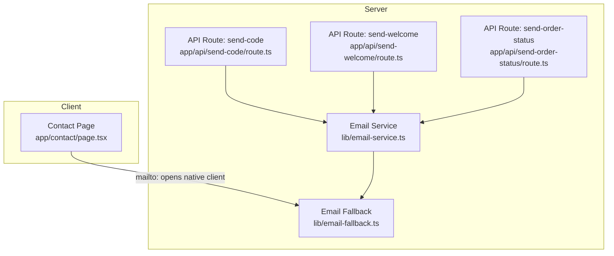
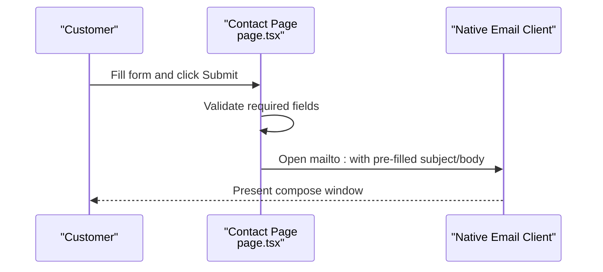
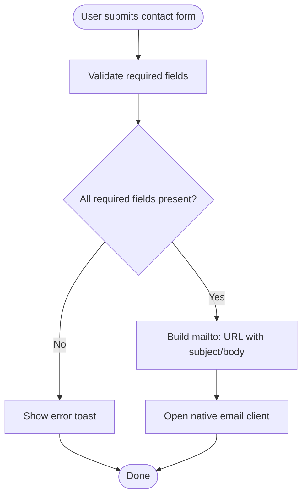
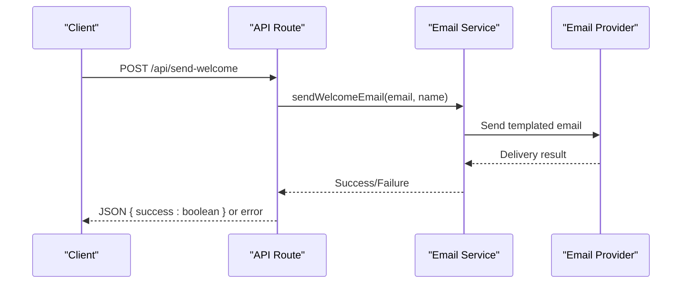
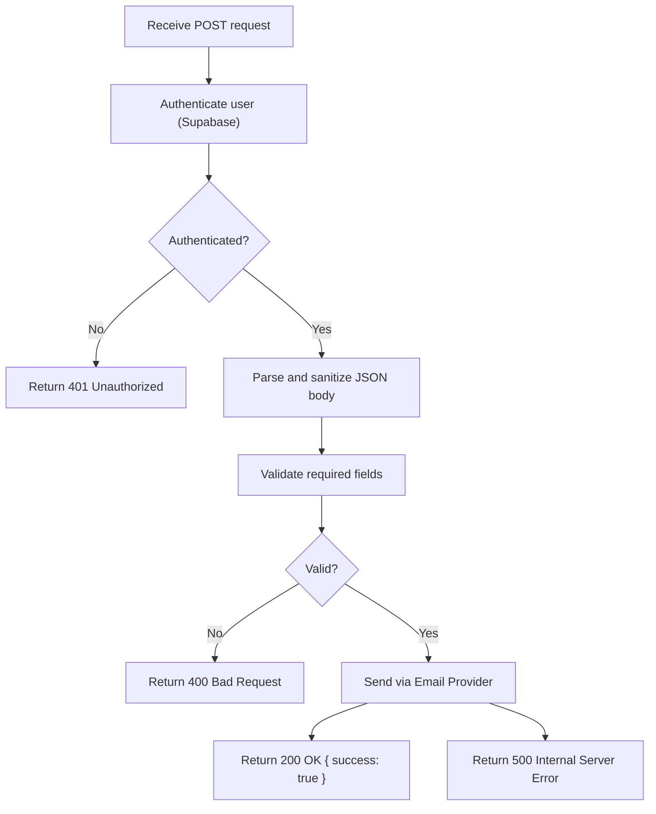
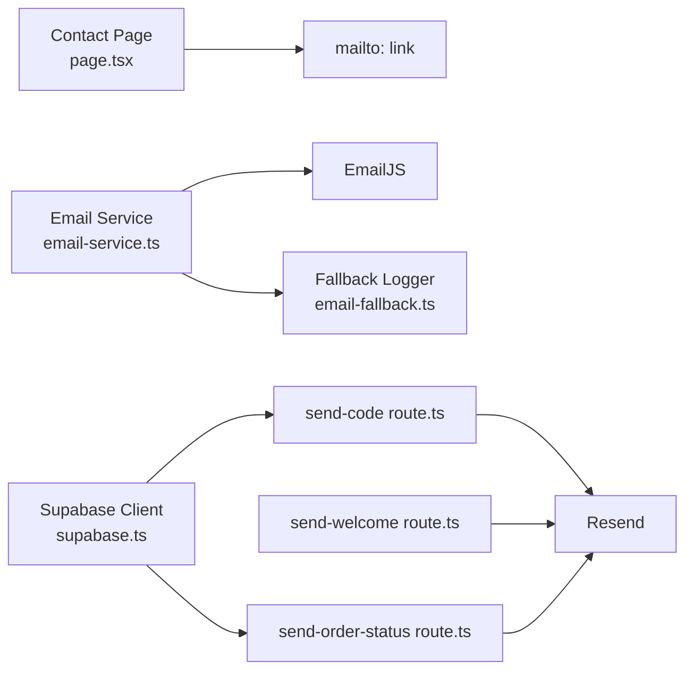

# Contact Form Endpoint

<cite>
**Referenced Files in This Document**
- [page.tsx](file://app/contact/page.tsx)
- [email-service.ts](file://lib/email-service.ts)
- [email-fallback.ts](file://lib/email-fallback.ts)
- [route.ts](file://app/api/send-code/route.ts)
- [route.ts](file://app/api/send-welcome/route.ts)
- [route.ts](file://app/api/send-order-status/route.ts)
- [supabase.ts](file://lib/supabase.ts)
- [middleware.ts](file://middleware.ts)
- [package.json](file://package.json)
</cite>

## Table of Contents
1. [Introduction](#introduction)
2. [Project Structure](#project-structure)
3. [Core Components](#core-components)
4. [Architecture Overview](#architecture-overview)
5. [Detailed Component Analysis](#detailed-component-analysis)
6. [Dependency Analysis](#dependency-analysis)
7. [Performance Considerations](#performance-considerations)
8. [Troubleshooting Guide](#troubleshooting-guide)
9. [Conclusion](#conclusion)

## Introduction
This document specifies the customer inquiry management API for the contact form. It defines the HTTP method, URL pattern, request and response schemas, validation rules, integration with email services, security considerations, rate limiting strategies, and frontend implementation guidelines. The goal is to enable reliable, secure, and scalable handling of customer inquiries.

## Project Structure
The contact form functionality is implemented as a client-side page that opens the user's native email client. There is no server-side contact form endpoint in the current codebase. Email dispatch is handled by dedicated API routes for other use cases (e.g., welcome emails, order updates), which demonstrate the email service integration pattern used across the application.

**Diagram sources**
- [page.tsx:32-50](file://app/contact/page.tsx#L32-L50)
- [route.ts:1-91](file://app/api/send-code/route.ts#L1-L91)
- [route.ts:1-69](file://app/api/send-welcome/route.ts#L1-L69)
- [route.ts:1-42](file://app/api/send-order-status/route.ts#L1-L42)
- [email-service.ts:1-126](file://lib/email-service.ts#L1-L126)
- [email-fallback.ts:1-31](file://lib/email-fallback.ts#L1-L31)

**Section sources**
- [page.tsx:1-267](file://app/contact/page.tsx#L1-L267)
- [route.ts:1-91](file://app/api/send-code/route.ts#L1-L91)
- [route.ts:1-69](file://app/api/send-welcome/route.ts#L1-L69)
- [route.ts:1-42](file://app/api/send-order-status/route.ts#L1-L42)
- [email-service.ts:1-126](file://lib/email-service.ts#L1-L126)
- [email-fallback.ts:1-31](file://lib/email-fallback.ts#L1-L31)

## Core Components
- Contact Page (Client-side): Presents the contact form and opens the user’s native email client via a mailto link. It validates required fields locally and displays feedback to the user.
- Email Service: Provides reusable helpers to send templated emails via EmailJS and a fallback mechanism when EmailJS is not configured.
- Email Fallback: Simulates email dispatch when primary email transport fails or is unavailable.
- API Routes (Examples): Demonstrate server-side email dispatch using Resend and DOMPurify-based sanitization for HTML content.

**Section sources**
- [page.tsx:23-50](file://app/contact/page.tsx#L23-L50)
- [email-service.ts:1-126](file://lib/email-service.ts#L1-L126)
- [email-fallback.ts:1-31](file://lib/email-fallback.ts#L1-L31)
- [route.ts:1-91](file://app/api/send-code/route.ts#L1-L91)
- [route.ts:1-69](file://app/api/send-welcome/route.ts#L1-L69)
- [route.ts:1-42](file://app/api/send-order-status/route.ts#L1-L42)

## Architecture Overview
The current contact form does not submit to a server endpoint. Instead, it builds a mailto link and delegates sending to the user’s native email client. Email dispatch for other features is centralized in the email service and routed through dedicated API endpoints.

**Diagram sources**
- [page.tsx:32-50](file://app/contact/page.tsx#L32-L50)

**Section sources**
- [page.tsx:23-50](file://app/contact/page.tsx#L23-L50)

## Detailed Component Analysis

### Contact Form Submission (Current Behavior)
- HTTP Method: Not applicable (no server endpoint)
- URL Pattern: Not applicable (no server endpoint)
- Request Schema: Not applicable (no server endpoint)
- Response Schema: Not applicable (no server endpoint)
- Required Fields: name, email, message
- Validation Rules:
  - Required fields enforced on the client.
  - Email format validated via HTML input type.
  - No length limits or sanitization are applied in the current implementation.
- Integration: Uses mailto: to open the native email client.

**Diagram sources**
- [page.tsx:32-50](file://app/contact/page.tsx#L32-L50)

**Section sources**
- [page.tsx:23-50](file://app/contact/page.tsx#L23-L50)

### Email Service Integration (Reference Implementation)
Although the contact form currently uses mailto:, the email service demonstrates how server-side email dispatch is implemented for other features.

**Diagram sources**
- [email-service.ts:32-73](file://lib/email-service.ts#L32-L73)
- [route.ts:7-68](file://app/api/send-welcome/route.ts#L7-L68)

**Section sources**
- [email-service.ts:1-126](file://lib/email-service.ts#L1-L126)
- [route.ts:1-69](file://app/api/send-welcome/route.ts#L1-L69)

### Example API Route (Resend-based)
This route illustrates server-side email dispatch, input sanitization, and error handling patterns that can be adapted for a future contact form endpoint.

**Diagram sources**
- [route.ts:8-90](file://app/api/send-code/route.ts#L8-L90)
- [route.ts:19-42](file://app/api/send-order-status/route.ts#L19-L42)

**Section sources**
- [route.ts:1-91](file://app/api/send-code/route.ts#L1-L91)
- [route.ts:1-42](file://app/api/send-order-status/route.ts#L1-L42)

## Dependency Analysis
- Client-side contact page depends on UI components and uses a mailto link to delegate email composition.
- Email service integrates with EmailJS and falls back to a local logging mechanism when EmailJS is not configured.
- API routes depend on Resend for email delivery and use DOMPurify for sanitization.
- Supabase is used for authentication and authorization checks in admin-only routes.

**Diagram sources**
- [page.tsx:32-50](file://app/contact/page.tsx#L32-L50)
- [email-service.ts:1-126](file://lib/email-service.ts#L1-L126)
- [email-fallback.ts:1-31](file://lib/email-fallback.ts#L1-L31)
- [route.ts:1-91](file://app/api/send-code/route.ts#L1-L91)
- [route.ts:1-69](file://app/api/send-welcome/route.ts#L1-L69)
- [route.ts:1-42](file://app/api/send-order-status/route.ts#L1-L42)
- [supabase.ts:1-188](file://lib/supabase.ts#L1-L188)

**Section sources**
- [page.tsx:1-267](file://app/contact/page.tsx#L1-L267)
- [email-service.ts:1-126](file://lib/email-service.ts#L1-L126)
- [email-fallback.ts:1-31](file://lib/email-fallback.ts#L1-L31)
- [route.ts:1-91](file://app/api/send-code/route.ts#L1-L91)
- [route.ts:1-69](file://app/api/send-welcome/route.ts#L1-L69)
- [route.ts:1-42](file://app/api/send-order-status/route.ts#L1-L42)
- [supabase.ts:1-188](file://lib/supabase.ts#L1-L188)

## Performance Considerations
- Client-side mailto: avoids server load and latency; however, it relies on the user’s native client configuration.
- For server-side email dispatch, batch operations and connection pooling should be considered to reduce overhead.
- Email provider rate limits should be respected; implement retries with exponential backoff and circuit breaker patterns.

## Troubleshooting Guide
- Contact form does not open email client:
  - Verify browser supports mailto: links.
  - Ensure required fields are filled before submission.
- Email dispatch failures:
  - Check environment variables for EmailJS or Resend keys.
  - Review fallback logs when EmailJS is not configured.
  - Inspect API route error responses for validation or provider errors.

**Section sources**
- [page.tsx:32-50](file://app/contact/page.tsx#L32-L50)
- [email-service.ts:77-125](file://lib/email-service.ts#L77-L125)
- [email-fallback.ts:1-31](file://lib/email-fallback.ts#L1-L31)

## Conclusion
The current contact form is client-driven and uses mailto: to deliver messages via the user’s native email client. For enterprise-grade customer inquiry management, consider implementing a server-side contact form endpoint with robust validation, sanitization, rate limiting, and integration with a production email provider. The existing email service and API route patterns provide a strong foundation for such an implementation.