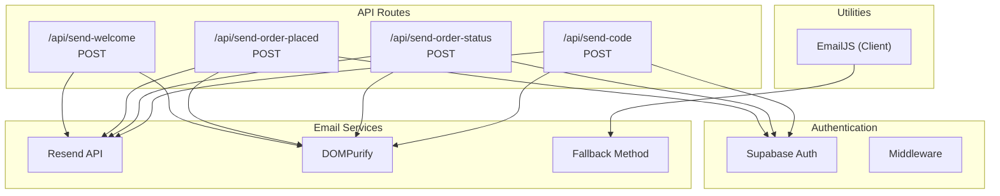
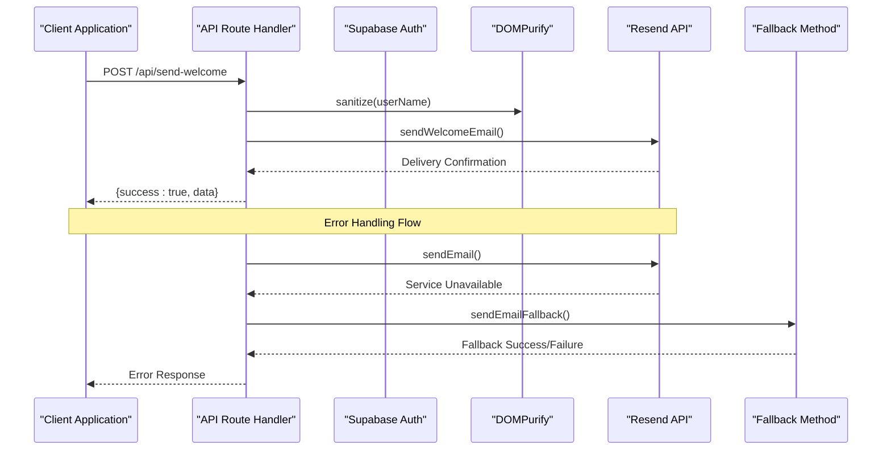
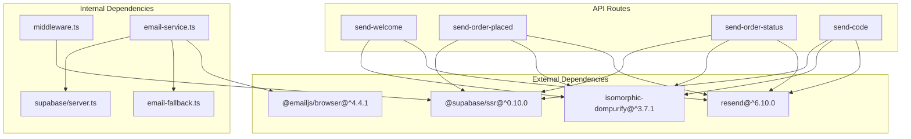

# Email Service Endpoints

<cite>
**Referenced Files in This Document**
- [send-welcome route](file://app/api/send-welcome/route.ts)
- [send-order-placed route](file://app/api/send-order-placed/route.ts)
- [send-order-status route](file://app/api/send-order-status/route.ts)
- [send-code route](file://app/api/send-code/route.ts)
- [email-service](file://lib/email-service.ts)
- [email-fallback](file://lib/email-fallback.ts)
- [middleware](file://middleware.ts)
- [supabase server client](file://lib/supabase/server.ts)
</cite>

## Table of Contents
1. [Introduction](#introduction)
2. [Project Structure](#project-structure)
3. [Core Components](#core-components)
4. [Architecture Overview](#architecture-overview)
5. [Detailed Component Analysis](#detailed-component-analysis)
6. [Dependency Analysis](#dependency-analysis)
7. [Performance Considerations](#performance-considerations)
8. [Troubleshooting Guide](#troubleshooting-guide)
9. [Conclusion](#conclusion)

## Introduction
This document provides comprehensive API documentation for the email service endpoints that power automated email delivery functionality. It covers four primary endpoints:
- send-welcome: user registration confirmation emails
- send-order-placed: purchase confirmation emails
- send-order-status: order status update emails
- send-code: gift card delivery emails

Each endpoint is documented with HTTP methods, URL patterns, request/response schemas, authentication requirements, error handling strategies, and integration details with Resend email service and DOMPurify sanitization.

## Project Structure
The email service endpoints are implemented as Next.js App Router API routes located under app/api/. Each route encapsulates a specific email workflow and integrates with Supabase for authentication and Resend for email delivery.

**Diagram sources**
- [send-welcome route:1-69](file://app/api/send-welcome/route.ts#L1-L69)
- [send-order-placed route:1-90](file://app/api/send-order-placed/route.ts#L1-L90)
- [send-order-status route:1-188](file://app/api/send-order-status/route.ts#L1-L188)
- [send-code route:1-91](file://app/api/send-code/route.ts#L1-L91)
- [email-service:1-126](file://lib/email-service.ts#L1-L126)

**Section sources**
- [send-welcome route:1-69](file://app/api/send-welcome/route.ts#L1-L69)
- [send-order-placed route:1-90](file://app/api/send-order-placed/route.ts#L1-L90)
- [send-order-status route:1-188](file://app/api/send-order-status/route.ts#L1-L188)
- [send-code route:1-91](file://app/api/send-code/route.ts#L1-L91)

## Core Components
The email service architecture consists of several key components:

### Authentication Layer
- Supabase authentication integration for user verification
- Middleware-based session management
- Role-based access control for administrative endpoints

### Email Delivery Engine
- Resend API integration for production email delivery
- DOMPurify-based content sanitization for XSS prevention
- Fallback mechanism for service unavailability scenarios

### Client-Side Email Utilities
- EmailJS integration for client-side email sending
- Automatic fallback to alternative delivery methods

**Section sources**
- [email-service:1-126](file://lib/email-service.ts#L1-L126)
- [email-fallback:1-31](file://lib/email-fallback.ts#L1-L31)
- [middleware:1-11](file://middleware.ts#L1-L11)

## Architecture Overview
The email service follows a layered architecture with clear separation of concerns:

**Diagram sources**
- [send-welcome route:7-68](file://app/api/send-welcome/route.ts#L7-L68)
- [email-service:32-73](file://lib/email-service.ts#L32-L73)
- [email-fallback:3-30](file://lib/email-fallback.ts#L3-L30)

## Detailed Component Analysis

### send-welcome Endpoint
The send-welcome endpoint handles user registration confirmation emails with comprehensive XSS protection and content sanitization.

#### Endpoint Definition
- **Method**: POST
- **URL**: /api/send-welcome
- **Purpose**: Send welcome email to newly registered users

#### Request Schema
| Field | Type | Required | Description |
|-------|------|----------|-------------|
| email | string | Yes | Recipient's email address |
| userName | string | No | User's display name (defaults to "Valued Merchant") |

#### Response Schema
| Field | Type | Description |
|-------|------|-------------|
| success | boolean | Operation status |
| data | object | Resend API response data |

#### Authentication & Security
- No authentication required
- DOMPurify sanitization prevents XSS attacks
- Basic email validation using @ presence check

#### Error Handling
- 400: Email is required
- 500: Failed to send welcome email

**Section sources**
- [send-welcome route:1-69](file://app/api/send-welcome/route.ts#L1-L69)

### send-order-placed Endpoint
The send-order-placed endpoint manages purchase confirmation emails with strict user authentication and authorization.

#### Endpoint Definition
- **Method**: POST
- **URL**: /api/send-order-placed
- **Purpose**: Send order confirmation emails after successful purchases

#### Request Schema
| Field | Type | Required | Description |
|-------|------|----------|-------------|
| email | string | Yes | Recipient's email address |
| userName | string | No | User's display name |
| productName | string | No | Product name |
| denomination | string | No | Product denomination |
| transactionId | string | No | Transaction identifier |

#### Response Schema
| Field | Type | Description |
|-------|------|-------------|
| success | boolean | Operation status |
| data | object | Resend API response data |

#### Authentication & Authorization
- Requires authenticated user session
- Validates that requesting user matches the email recipient
- Uses Supabase authentication for user verification

#### Error Handling
- 401: Unauthorized access
- 403: Forbidden (user mismatch)
- 400: Email is required
- 500: Failed to send placed email

**Section sources**
- [send-order-placed route:1-90](file://app/api/send-order-placed/route.ts#L1-L90)

### send-order-status Endpoint
The send-order-status endpoint handles order status update emails with administrative access controls and dual-template support.

#### Endpoint Definition
- **Method**: POST
- **URL**: /api/send-order-status
- **Purpose**: Send order status update emails (Completed/Failed)

#### Request Schema
| Field | Type | Required | Description |
|-------|------|----------|-------------|
| email | string | Yes | Recipient's email address |
| status | string | Yes | Order status (Completed/Failed) |
| userName | string | No | User's display name |
| productName | string | No | Product name |
| denomination | string | No | Product denomination |
| remarks | string | No | Failure reason details |
| transactionId | string | No | Transaction identifier |

#### Response Schema
| Field | Type | Description |
|-------|------|-------------|
| success | boolean | Operation status |
| data | object | Resend API response data |

#### Authentication & Authorization
- Requires authenticated user session
- Admin-only access (validates against admin_users table)
- Uses Supabase authentication for user verification

#### Template Logic
The endpoint uses different HTML templates based on status:
- **Completed Template**: Green-themed success template with gift card code display
- **Failed Template**: Red-themed failure template with refund information

#### Error Handling
- 401: Unauthorized access
- 403: Forbidden (non-admin users)
- 400: Email and Status are required
- 500: Failed to send status email

**Section sources**
- [send-order-status route:1-188](file://app/api/send-order-status/route.ts#L1-L188)

### send-code Endpoint
The send-code endpoint manages gift card delivery emails with flexible authorization and dynamic content rendering.

#### Endpoint Definition
- **Method**: POST
- **URL**: /api/send-code
- **Purpose**: Send gift card code delivery emails

#### Request Schema
| Field | Type | Required | Description |
|-------|------|----------|-------------|
| email | string | Yes | Recipient's email address |
| giftcardCode | string | Yes | Gift card redemption code |
| userName | string | No | User's display name |
| productName | string | No | Product name |
| denomination | string | No | Product denomination |
| subject | string | No | Custom email subject |

#### Response Schema
| Field | Type | Description |
|-------|------|-------------|
| success | boolean | Operation status |
| data | object | Resend API response data |

#### Authentication & Authorization
- Requires authenticated user session
- Flexible authorization:
  - Self-sending: User can send to their own email
  - Admin-only: Admins can send to other users
- Uses Supabase authentication for user verification

#### Error Handling
- 401: Unauthorized access
- 403: Forbidden (sending to other users without admin privileges)
- 400: Email and Giftcard Code are required
- 500: Failed to send email

**Section sources**
- [send-code route:1-91](file://app/api/send-code/route.ts#L1-L91)

## Dependency Analysis
The email service endpoints rely on several external dependencies and internal utilities:

**Diagram sources**
- [package.json:11-38](file://package.json#L11-L38)
- [send-welcome route:1-5](file://app/api/send-welcome/route.ts#L1-L5)
- [email-service:1-3](file://lib/email-service.ts#L1-L3)
- [middleware:1-6](file://middleware.ts#L1-L6)

### Key Dependencies
- **Resend**: Production email delivery service
- **DOMPurify**: Cross-site scripting prevention
- **EmailJS**: Client-side email fallback
- **Supabase**: Authentication and user management
- **Next.js Server Actions**: Secure server-side execution

**Section sources**
- [package.json:11-38](file://package.json#L11-L38)
- [email-service:1-126](file://lib/email-service.ts#L1-L126)

## Performance Considerations
The email service implements several performance optimizations:

### Asynchronous Processing
- All email operations are asynchronous to prevent blocking
- Non-blocking fallback mechanisms ensure service continuity

### Content Delivery Optimization
- Static HTML templates reduce runtime computation
- CDN-hosted images minimize bandwidth usage
- Minimal JavaScript in email templates for fast rendering

### Caching Strategies
- DOMPurify sanitization results cached automatically
- Environment variables loaded once during initialization

### Scalability Considerations
- Stateless endpoint design allows horizontal scaling
- External service dependencies enable load distribution
- Graceful degradation through fallback mechanisms

## Troubleshooting Guide

### Common Error Scenarios

#### Authentication Issues
- **401 Unauthorized**: User session invalid or missing
- **403 Forbidden**: Insufficient permissions or user mismatch
- **Solution**: Verify user authentication and session validity

#### Validation Errors
- **400 Bad Request**: Missing required fields (email, giftcardCode, etc.)
- **Invalid Email Format**: Email validation failures
- **Solution**: Ensure all required fields are present and properly formatted

#### Service Unavailability
- **500 Internal Server Error**: Resend API failures
- **Fallback Mechanism**: Automatic fallback to alternative delivery methods
- **Solution**: Monitor fallback logs and retry failed deliveries

#### Content Security Issues
- **XSS Prevention**: DOMPurify sanitization removes malicious content
- **HTML Rendering**: Malformed HTML corrected automatically
- **Solution**: Review sanitized content logs for debugging

### Debugging Procedures
1. **Enable Logging**: Check server logs for detailed error messages
2. **Validate Inputs**: Verify all request parameters meet validation criteria
3. **Test Authentication**: Confirm user session and permissions
4. **Monitor Dependencies**: Check Resend API status and rate limits
5. **Review Fallback**: Examine fallback delivery logs for alternative paths

### Monitoring and Alerts
- **Error Tracking**: Centralized logging for all error scenarios
- **Delivery Metrics**: Track successful vs failed email deliveries
- **Performance Monitoring**: Monitor response times and throughput
- **Security Auditing**: Log all content sanitization events

**Section sources**
- [send-welcome route:64-67](file://app/api/send-welcome/route.ts#L64-L67)
- [send-order-placed route:85-88](file://app/api/send-order-placed/route.ts#L85-L88)
- [send-order-status route:183-186](file://app/api/send-order-status/route.ts#L183-L186)
- [send-code route:86-89](file://app/api/send-code/route.ts#L86-L89)

## Conclusion
The email service endpoints provide a robust, secure, and scalable solution for automated email delivery. Key strengths include comprehensive XSS protection through DOMPurify, flexible authentication mechanisms, graceful fallback handling, and comprehensive error management. The modular architecture enables easy maintenance and future enhancements while maintaining high reliability and performance standards.

The implementation demonstrates best practices in modern web development, including proper separation of concerns, security-first design, and resilient error handling strategies that ensure reliable email delivery across various operational scenarios.