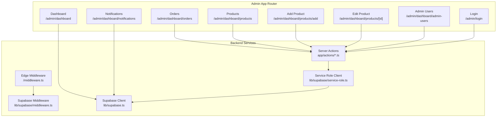
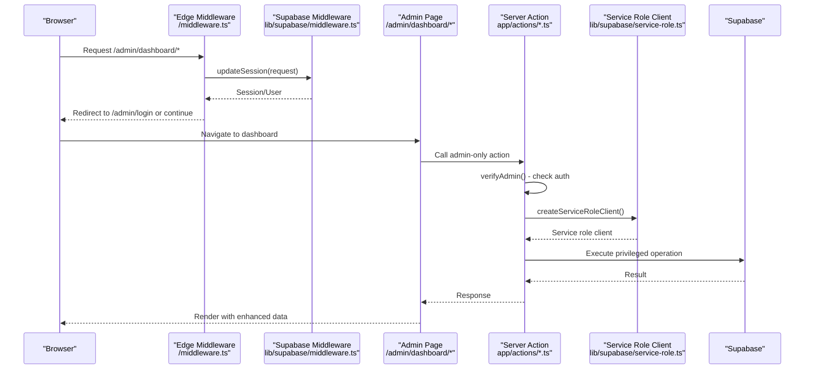
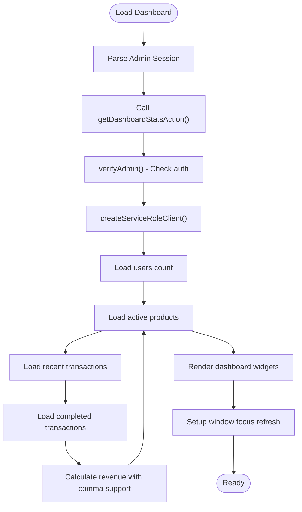
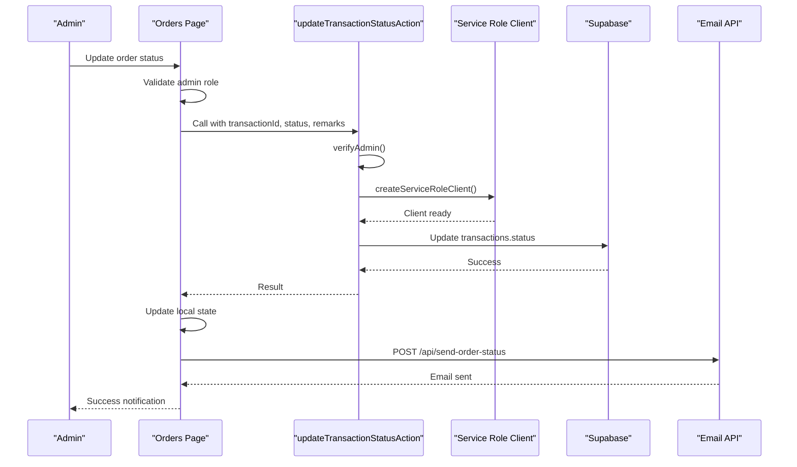
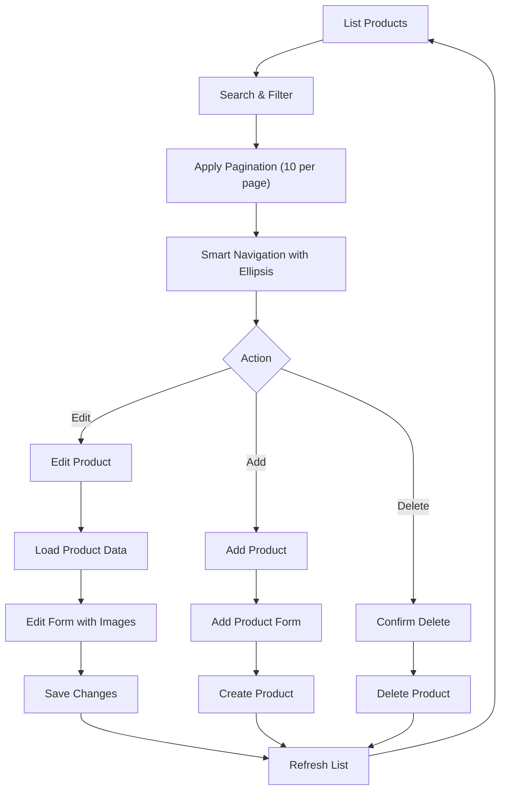
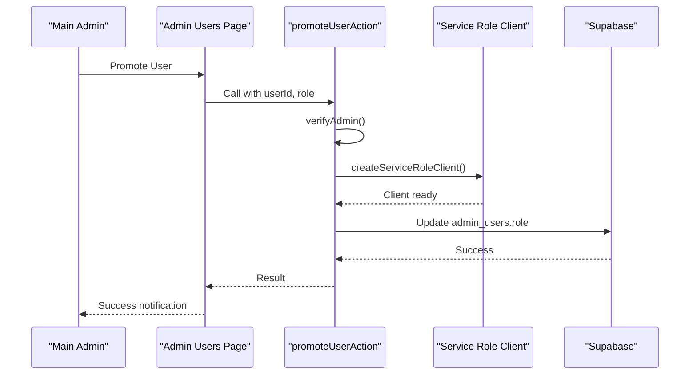
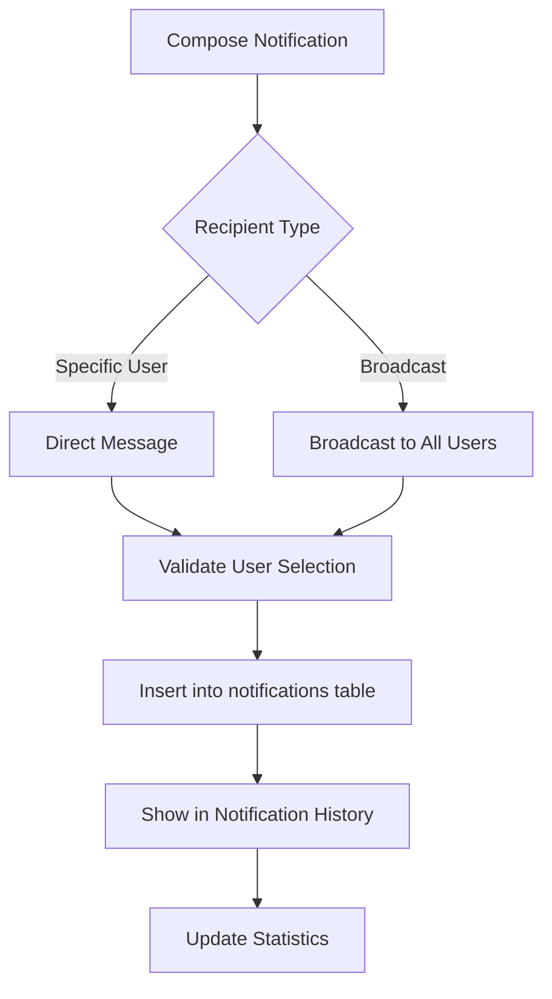
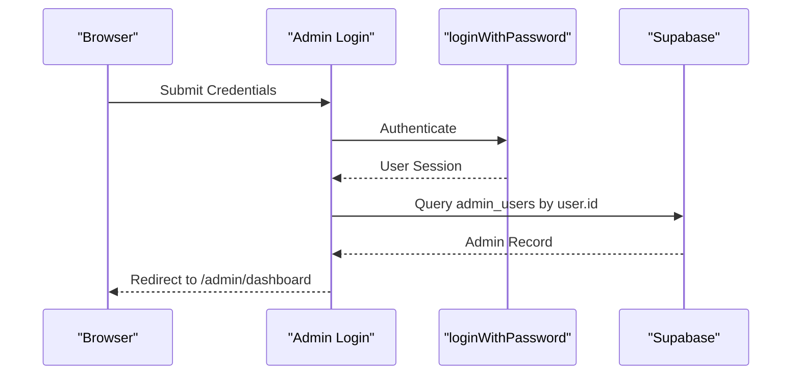
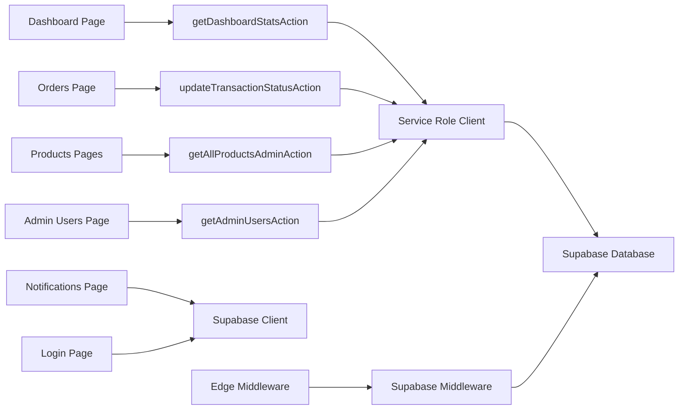

# Admin Dashboard

<cite>
**Referenced Files in This Document**
- [app/admin/layout.tsx](file://app/admin/layout.tsx)
- [app/admin/dashboard/page.tsx](file://app/admin/dashboard/page.tsx)
- [app/admin/dashboard/orders/page.tsx](file://app/admin/dashboard/orders/page.tsx)
- [app/admin/dashboard/products/page.tsx](file://app/admin/dashboard/products/page.tsx)
- [app/admin/dashboard/products/[id]/page.tsx](file://app/admin/dashboard/products/[id]/page.tsx)
- [app/admin/dashboard/products/add/page.tsx](file://app/admin/dashboard/products/add/page.tsx)
- [app/admin/dashboard/admin-users/page.tsx](file://app/admin/dashboard/admin-users/page.tsx)
- [app/admin/dashboard/notifications/page.tsx](file://app/admin/dashboard/notifications/page.tsx)
- [app/admin/login/page.tsx](file://app/admin/login/page.tsx)
- [lib/supabase.ts](file://lib/supabase.ts)
- [lib/supabase/middleware.ts](file://lib/supabase/middleware.ts)
- [lib/supabase/service-role.ts](file://lib/supabase/service-role.ts)
- [lib/product-categories.ts](file://lib/product-categories.ts)
- [lib/auth-context.tsx](file://lib/auth-context.tsx)
- [app/actions/admin.ts](file://app/actions/admin.ts)
- [app/actions/admin-users.ts](file://app/actions/admin-users.ts)
- [app/actions/dashboard.ts](file://app/actions/dashboard.ts)
- [app/actions/orders.ts](file://app/actions/orders.ts)
- [middleware.ts](file://middleware.ts)
</cite>

## Update Summary
**Changes Made**
- Enhanced with new administrative modules including comprehensive dashboard analytics, orders management, products administration, and admin users management
- Integrated service role client for bypassing RLS restrictions in all server actions
- Implemented smart pagination system with ellipsis navigation for large datasets
- Added enhanced revenue calculation supporting comma-separated numeric values
- Introduced automatic refresh capability when window gains focus
- Enhanced order management with improved responsive design and customer communication features
- Added comprehensive product administration with CRUD operations and image management
- Implemented admin user management with role assignments and access control

## Table of Contents
1. [Introduction](#introduction)
2. [Project Structure](#project-structure)
3. [Core Components](#core-components)
4. [Architecture Overview](#architecture-overview)
5. [Detailed Component Analysis](#detailed-component-analysis)
6. [Dependency Analysis](#dependency-analysis)
7. [Performance Considerations](#performance-considerations)
8. [Security Implementation](#security-implementation)
9. [Troubleshooting Guide](#troubleshooting-guide)
10. [Conclusion](#conclusion)

## Introduction
This document describes the admin dashboard system built with Next.js App Router. The system provides comprehensive administrative capabilities for managing orders, products, and users through a modern, responsive interface. It leverages server-side data fetching via Supabase, implements robust security through service role clients, and offers real-time administrative controls with enhanced analytics and reporting capabilities.

**Updated** Enhanced with comprehensive administrative modules including dashboard analytics, orders management, products administration, and admin users management. Integrated service role client for bypassing RLS restrictions and implementing secure server-side operations.

## Project Structure
The admin dashboard is organized under the Next.js app directory with dedicated pages for each functional area:

**Diagram sources**
- [app/admin/dashboard/page.tsx:1-259](file://app/admin/dashboard/page.tsx#L1-L259)
- [app/admin/dashboard/orders/page.tsx:1-647](file://app/admin/dashboard/orders/page.tsx#L1-L647)
- [app/admin/dashboard/products/page.tsx:1-365](file://app/admin/dashboard/products/page.tsx#L1-L365)
- [app/admin/dashboard/products/[id]/page.tsx:1-713](file://app/admin/dashboard/products/[id]/page.tsx#L1-L713)
- [app/admin/dashboard/products/add/page.tsx:1-632](file://app/admin/dashboard/products/add/page.tsx#L1-L632)
- [app/admin/dashboard/admin-users/page.tsx:1-610](file://app/admin/dashboard/admin-users/page.tsx#L1-L610)
- [app/admin/dashboard/notifications/page.tsx:1-359](file://app/admin/dashboard/notifications/page.tsx#L1-L359)
- [app/admin/login/page.tsx:1-145](file://app/admin/login/page.tsx#L1-L145)
- [middleware.ts:1-11](file://middleware.ts#L1-L11)
- [lib/supabase/middleware.ts:1-96](file://lib/supabase/middleware.ts#L1-L96)
- [app/actions/dashboard.ts:1-187](file://app/actions/dashboard.ts#L1-L187)
- [app/actions/admin-users.ts:1-155](file://app/actions/admin-users.ts#L1-L155)
- [lib/supabase/service-role.ts:1-39](file://lib/supabase/service-role.ts#L1-L39)
- [lib/supabase.ts:1-188](file://lib/supabase.ts#L1-L188)

**Section sources**
- [app/admin/layout.tsx:1-23](file://app/admin/layout.tsx#L1-L23)
- [middleware.ts:1-11](file://middleware.ts#L1-L11)
- [lib/supabase/middleware.ts:1-96](file://lib/supabase/middleware.ts#L1-L96)

## Core Components
- **Dashboard Analytics**: Comprehensive overview with revenue tracking, user statistics, recent orders, and active products
- **Order Management**: Advanced transaction management with filtering, status updates, customer notifications, and CSV export capabilities
- **Product Administration**: Complete product lifecycle management including creation, editing, pricing, inventory-like activation, and image management
- **Admin User Management**: Role-based access control with user promotion, status management, and security enforcement
- **Notifications System**: Targeted and broadcast messaging with delivery tracking and history management
- **Security Layer**: Service role client integration for bypassing RLS restrictions and secure server-side operations

**Updated** Enhanced with service role client integration for secure database operations, smart pagination with ellipsis navigation, and automatic refresh capabilities for improved admin efficiency.

**Section sources**
- [app/admin/dashboard/page.tsx:1-259](file://app/admin/dashboard/page.tsx#L1-L259)
- [app/admin/dashboard/orders/page.tsx:1-647](file://app/admin/dashboard/orders/page.tsx#L1-L647)
- [app/admin/dashboard/products/page.tsx:1-365](file://app/admin/dashboard/products/page.tsx#L1-L365)
- [app/admin/dashboard/products/[id]/page.tsx:1-713](file://app/admin/dashboard/products/[id]/page.tsx#L1-L713)
- [app/admin/dashboard/products/add/page.tsx:1-632](file://app/admin/dashboard/products/add/page.tsx#L1-L632)
- [app/admin/dashboard/admin-users/page.tsx:1-610](file://app/admin/dashboard/admin-users/page.tsx#L1-L610)
- [app/admin/dashboard/notifications/page.tsx:1-359](file://app/admin/dashboard/notifications/page.tsx#L1-L359)
- [app/admin/login/page.tsx:1-145](file://app/admin/login/page.tsx#L1-L145)

## Architecture Overview
The admin dashboard leverages Next.js App Router with server-side data fetching via Supabase. A sophisticated security architecture employs service role clients to bypass RLS restrictions while maintaining proper authentication and authorization. Edge middleware enforces admin access for protected routes, and administrative controls are implemented with secure server actions for sensitive operations.

**Updated** Enhanced with service role client integration that provides secure database access by bypassing RLS entirely, implemented through dedicated server actions that verify admin authentication before executing privileged operations.

**Diagram sources**
- [middleware.ts:1-11](file://middleware.ts#L1-L11)
- [lib/supabase/middleware.ts:1-96](file://lib/supabase/middleware.ts#L1-L96)
- [app/actions/dashboard.ts:9-22](file://app/actions/dashboard.ts#L9-L22)
- [lib/supabase/service-role.ts:27-38](file://lib/supabase/service-role.ts#L27-L38)

## Detailed Component Analysis

### Dashboard Analytics
The dashboard provides comprehensive business insights with automatic refresh capabilities and enhanced revenue calculation supporting comma-separated numeric values.

**Diagram sources**
- [app/admin/dashboard/page.tsx:57-77](file://app/admin/dashboard/page.tsx#L57-L77)
- [app/actions/dashboard.ts:28-99](file://app/actions/dashboard.ts#L28-L99)

**Section sources**
- [app/admin/dashboard/page.tsx:1-259](file://app/admin/dashboard/page.tsx#L1-L259)
- [app/actions/dashboard.ts:28-99](file://app/actions/dashboard.ts#L28-L99)

### Order Management System
Advanced order management with comprehensive filtering, status updates, customer communication, and export capabilities.

**Diagram sources**
- [app/admin/dashboard/orders/page.tsx:176-237](file://app/admin/dashboard/orders/page.tsx#L176-L237)
- [app/actions/orders.ts:29-60](file://app/actions/orders.ts#L29-L60)

**Section sources**
- [app/admin/dashboard/orders/page.tsx:1-647](file://app/admin/dashboard/orders/page.tsx#L1-L647)
- [app/actions/orders.ts:29-60](file://app/actions/orders.ts#L29-L60)

### Product Administration Module
Complete product lifecycle management with CRUD operations, pricing management, inventory-like activation, and comprehensive pagination.

**Diagram sources**
- [app/admin/dashboard/products/page.tsx:26-137](file://app/admin/dashboard/products/page.tsx#L26-L137)
- [app/admin/dashboard/products/[id]/page.tsx:22-312](file://app/admin/dashboard/products/[id]/page.tsx#L22-L312)
- [app/admin/dashboard/products/add/page.tsx:22-182](file://app/admin/dashboard/products/add/page.tsx#L22-L182)

**Section sources**
- [app/admin/dashboard/products/page.tsx:1-365](file://app/admin/dashboard/products/page.tsx#L1-L365)
- [app/admin/dashboard/products/[id]/page.tsx:1-713](file://app/admin/dashboard/products/[id]/page.tsx#L1-L713)
- [app/admin/dashboard/products/add/page.tsx:1-632](file://app/admin/dashboard/products/add/page.tsx#L1-L632)
- [lib/product-categories.ts:1-492](file://lib/product-categories.ts#L1-L492)

### Admin User Management
Role-based access control with user promotion, status management, and security enforcement.

**Diagram sources**
- [app/admin/dashboard/admin-users/page.tsx:124-155](file://app/admin/dashboard/admin-users/page.tsx#L124-L155)
- [app/actions/admin-users.ts:29-52](file://app/actions/admin-users.ts#L29-L52)

**Section sources**
- [app/admin/dashboard/admin-users/page.tsx:1-610](file://app/admin/dashboard/admin-users/page.tsx#L1-L610)
- [app/actions/admin-users.ts:29-52](file://app/actions/admin-users.ts#L29-L52)

### Notifications System
Targeted and broadcast messaging with delivery tracking and history management.

**Diagram sources**
- [app/admin/dashboard/notifications/page.tsx:83-127](file://app/admin/dashboard/notifications/page.tsx#L83-L127)

**Section sources**
- [app/admin/dashboard/notifications/page.tsx:1-359](file://app/admin/dashboard/notifications/page.tsx#L1-L359)

### Login and Access Control
Authentication with role verification and edge middleware protection.

**Diagram sources**
- [app/admin/login/page.tsx:23-61](file://app/admin/login/page.tsx#L23-L61)
- [lib/supabase/middleware.ts:62-76](file://lib/supabase/middleware.ts#L62-L76)

**Section sources**
- [app/admin/login/page.tsx:1-145](file://app/admin/login/page.tsx#L1-L145)
- [middleware.ts:1-11](file://middleware.ts#L1-L11)
- [lib/supabase/middleware.ts:1-96](file://lib/supabase/middleware.ts#L1-L96)

## Dependency Analysis
The admin dashboard relies on a sophisticated dependency graph with service role clients, server actions, and middleware coordination.

**Diagram sources**
- [app/admin/dashboard/page.tsx:10](file://app/admin/dashboard/page.tsx#L10)
- [app/admin/dashboard/orders/page.tsx:16](file://app/admin/dashboard/orders/page.tsx#L16)
- [app/admin/dashboard/products/page.tsx:12](file://app/admin/dashboard/products/page.tsx#L12)
- [app/admin/dashboard/admin-users/page.tsx:34](file://app/admin/dashboard/admin-users/page.tsx#L34)
- [app/actions/dashboard.ts:34](file://app/actions/dashboard.ts#L34)
- [app/actions/orders.ts:39](file://app/actions/orders.ts#L39)
- [app/actions/admin-users.ts:137](file://app/actions/admin-users.ts#L137)
- [lib/supabase/service-role.ts:27](file://lib/supabase/service-role.ts#L27)

**Section sources**
- [lib/supabase.ts:1-188](file://lib/supabase.ts#L1-L188)
- [lib/supabase/middleware.ts:1-96](file://lib/supabase/middleware.ts#L1-L96)
- [lib/supabase/service-role.ts:1-39](file://lib/supabase/service-role.ts#L1-L39)
- [app/actions/dashboard.ts:1-187](file://app/actions/dashboard.ts#L1-L187)
- [app/actions/admin-users.ts:1-155](file://app/actions/admin-users.ts#L1-L155)
- [app/actions/orders.ts:1-168](file://app/actions/orders.ts#L1-L168)

## Performance Considerations
- **Service Role Optimization**: Service role clients bypass RLS entirely, providing optimal query performance for administrative operations
- **Pagination Strategy**: Implemented 10-item pagination with smart ellipsis navigation for large datasets, reducing DOM rendering overhead
- **Automatic Refresh**: Window focus event listener triggers data refresh without manual intervention, improving data freshness
- **Comma-Separated Value Support**: Enhanced revenue calculation handles numeric values with commas, preventing data processing errors
- **Cache Optimization**: Strategic caching of product lists with short TTL reduces database load during frequent admin operations
- **Responsive Design**: Mobile-first approach using grid and flex utilities minimizes layout thrashing across device sizes
- **Batch Operations**: Server actions consolidate multiple database operations, reducing network overhead and improving response times

**Updated** Enhanced performance through service role client integration that bypasses RLS restrictions entirely, eliminating query complexity and improving database performance for administrative operations.

## Security Implementation
The admin dashboard implements a multi-layered security approach with service role clients, authentication verification, and role-based access control.

**Security Architecture**:
- **Service Role Client**: Dedicated client with SUPABASE_SERVICE_ROLE_KEY that bypasses RLS entirely for trusted server-side operations
- **Authentication Verification**: Each server action calls verifyAdmin() to ensure proper authentication before executing privileged operations
- **Role-Based Access Control**: Different admin roles (admin, sub_admin, order_management) with specific permission levels
- **Environment Variable Protection**: Service role keys are never exposed to the browser, only used in secure server-side contexts
- **Revalidation Patterns**: Automatic cache revalidation ensures data consistency across admin operations

**Security Features**:
- Never expose service role client to browser
- Only use in server actions that verify admin authentication
- Implement proper error handling and logging
- Enforce role validation for sensitive operations
- Use HTTPS and secure cookie configuration

**Section sources**
- [lib/supabase/service-role.ts:1-39](file://lib/supabase/service-role.ts#L1-L39)
- [app/actions/dashboard.ts:9-22](file://app/actions/dashboard.ts#L9-L22)
- [app/actions/admin-users.ts:10-23](file://app/actions/admin-users.ts#L10-L23)
- [app/actions/orders.ts:10-23](file://app/actions/orders.ts#L10-L23)

## Troubleshooting Guide
Common issues and resolutions:

**Authentication & Authorization Issues**:
- Verify admin credentials and ensure user exists in admin_users table with active status
- Check service role key configuration in environment variables
- Confirm edge middleware is properly deployed and configured
- Validate JWT token expiration and refresh mechanisms

**Service Role Client Issues**:
- Ensure SUPABASE_SERVICE_ROLE_KEY is properly configured in environment variables
- Verify service role client initialization in lib/supabase/service-role.ts
- Check that server actions properly call verifyAdmin() before using service role client
- Monitor for "Supabase Service Role not configured" errors

**Database & RLS Issues**:
- Verify table schemas match expected structure in lib/supabase.ts
- Check that admin_users table contains proper role assignments
- Ensure transactions table has required columns and indexes
- Validate product categories and denominations structure

**Performance Issues**:
- Monitor pagination performance with large datasets
- Check automatic refresh frequency and window focus event handling
- Verify CSV export optimization for large transaction volumes
- Monitor service role client connection pooling

**UI/UX Issues**:
- Test responsive design across different screen sizes
- Verify smart pagination ellipsis navigation works correctly
- Check toast notification positioning and timing
- Validate form validation and error handling

**Section sources**
- [app/admin/login/page.tsx:47-52](file://app/admin/login/page.tsx#L47-L52)
- [app/admin/dashboard/orders/page.tsx:184-251](file://app/admin/dashboard/orders/page.tsx#L184-L251)
- [lib/supabase/middleware.ts:62-76](file://lib/supabase/middleware.ts#L62-L76)
- [lib/supabase/service-role.ts:19-21](file://lib/supabase/service-role.ts#L19-L21)

## Conclusion
The admin dashboard provides a comprehensive, secure, and efficient administrative interface powered by Next.js App Router and Supabase. The system offers robust order management, product administration with advanced pagination capabilities, and user management with strong access control enforced by service role clients and edge middleware. 

**Updated** The enhanced system now features integrated service role client architecture that bypasses RLS restrictions entirely for secure administrative operations, comprehensive smart pagination with ellipsis navigation, automatic refresh capabilities, and enhanced revenue calculation supporting comma-separated numeric values. These improvements significantly enhance admin efficiency, data accuracy, and user experience while maintaining strict security boundaries and auditability through proper authentication verification and role-based access control.

The modular architecture ensures scalability and maintainability, with each administrative module operating independently while sharing common security infrastructure. The responsive design provides excellent user experience across all device types, and the comprehensive error handling and monitoring systems ensure reliable operation in production environments.