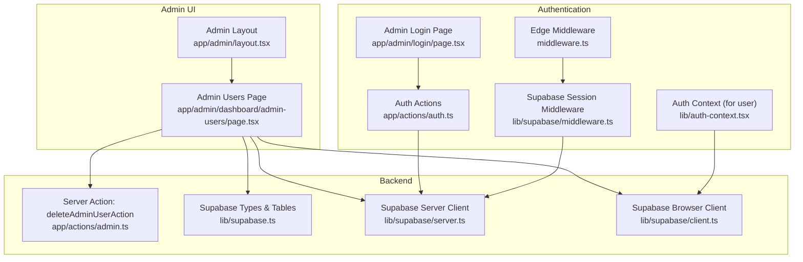
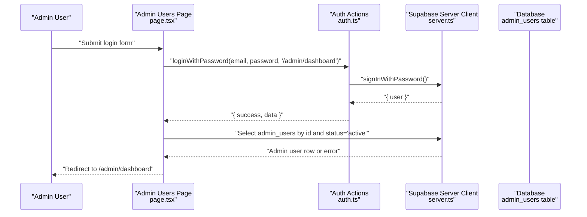
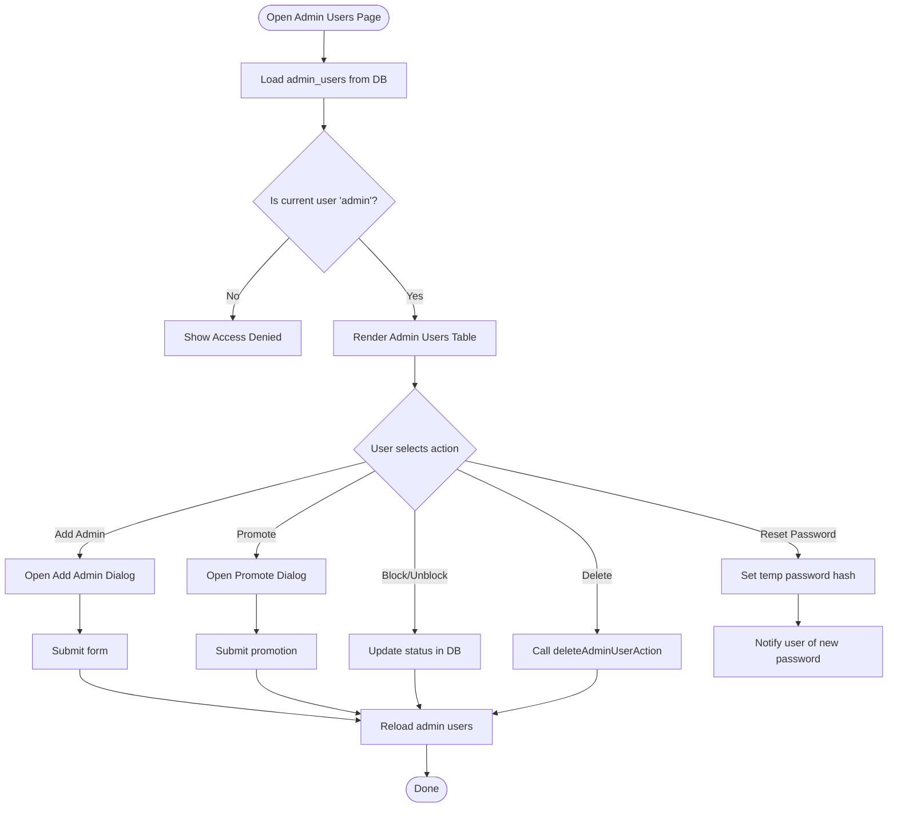
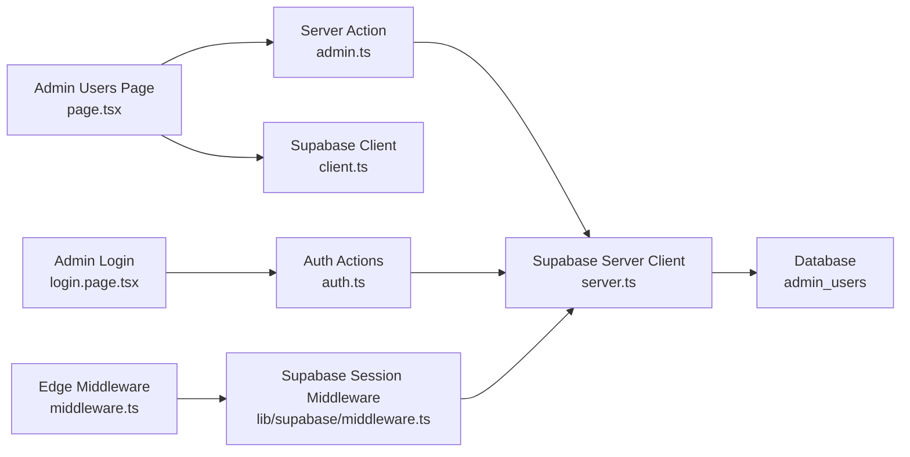

# Admin Users Management

<cite>
**Referenced Files in This Document**
- [page.tsx](file://app/admin/dashboard/admin-users/page.tsx)
- [admin.ts](file://app/actions/admin.ts)
- [supabase.ts](file://lib/supabase.ts)
- [auth.ts](file://app/actions/auth.ts)
- [login.page.tsx](file://app/admin/login/page.tsx)
- [auth-context.tsx](file://lib/auth-context.tsx)
- [middleware.ts](file://lib/supabase/middleware.ts)
- [middleware.ts](file://middleware.ts)
- [server.ts](file://lib/supabase/server.ts)
- [client.ts](file://lib/supabase/client.ts)
- [layout.tsx](file://app/admin/layout.tsx)
- [package.json](file://package.json)
</cite>

## Table of Contents
1. [Introduction](#introduction)
2. [Project Structure](#project-structure)
3. [Core Components](#core-components)
4. [Architecture Overview](#architecture-overview)
5. [Detailed Component Analysis](#detailed-component-analysis)
6. [Dependency Analysis](#dependency-analysis)
7. [Performance Considerations](#performance-considerations)
8. [Troubleshooting Guide](#troubleshooting-guide)
9. [Conclusion](#conclusion)

## Introduction
This document describes the admin users management system, focusing on the administrative interface for managing administrator accounts and access control. It explains the admin user management architecture including user listing, role assignment, permission management, and access control workflows. It documents implementation details for admin user creation, role-based access control, session management, and security considerations. Practical examples demonstrate admin user CRUD operations, role assignment workflows, and access logging. Security best practices for admin access, audit logging, and data protection are addressed throughout.

## Project Structure
The admin users management feature is implemented as a client-side Next.js page under the admin dashboard, backed by Supabase for authentication and database operations. Server actions encapsulate sensitive operations such as deletion. Authentication and session management are handled by Supabase with middleware enforcing session updates and basic route protection for admin routes.

**Diagram sources**
- [page.tsx:1-623](file://app/admin/dashboard/admin-users/page.tsx#L1-L623)
- [admin.ts:1-35](file://app/actions/admin.ts#L1-L35)
- [supabase.ts:1-188](file://lib/supabase.ts#L1-L188)
- [auth.ts:1-68](file://app/actions/auth.ts#L1-L68)
- [login.page.tsx:1-145](file://app/admin/login/page.tsx#L1-L145)
- [auth-context.tsx:1-374](file://lib/auth-context.tsx#L1-L374)
- [middleware.ts:1-11](file://middleware.ts#L1-L11)
- [middleware.ts:1-96](file://lib/supabase/middleware.ts#L1-L96)
- [server.ts:1-36](file://lib/supabase/server.ts#L1-L36)
- [client.ts:1-10](file://lib/supabase/client.ts#L1-L10)
- [layout.tsx:1-23](file://app/admin/layout.tsx#L1-L23)

**Section sources**
- [page.tsx:1-623](file://app/admin/dashboard/admin-users/page.tsx#L1-L623)
- [admin.ts:1-35](file://app/actions/admin.ts#L1-L35)
- [supabase.ts:1-188](file://lib/supabase.ts#L1-L188)
- [auth.ts:1-68](file://app/actions/auth.ts#L1-L68)
- [login.page.tsx:1-145](file://app/admin/login/page.tsx#L1-L145)
- [auth-context.tsx:1-374](file://lib/auth-context.tsx#L1-L374)
- [middleware.ts:1-11](file://middleware.ts#L1-L11)
- [middleware.ts:1-96](file://lib/supabase/middleware.ts#L1-L96)
- [server.ts:1-36](file://lib/supabase/server.ts#L1-L36)
- [client.ts:1-10](file://lib/supabase/client.ts#L1-L10)
- [layout.tsx:1-23](file://app/admin/layout.tsx#L1-L23)

## Core Components
- Admin Users Page: Implements listing, filtering, and CRUD operations for admin users, including adding, promoting, blocking/unblocking, resetting passwords, and deleting admin users. It enforces role-based access by restricting modifications to the main administrator account.
- Server Action deleteAdminUserAction: Performs safe deletion of admin users from the admin_users table and invalidates cached paths.
- Supabase Types and Tables: Defines the admin_users schema and related tables used by the admin user management system.
- Authentication Actions: Encapsulate login, signup, and logout flows using Supabase Auth.
- Admin Login Page: Handles admin authentication, verifies active admin status, and redirects to the admin dashboard upon success.
- Supabase Session Middleware: Updates sessions and enforces basic route protection for admin routes.
- Auth Context: Manages user session and profile operations for regular users (not admin users).
- Supabase Clients: Server and browser clients for interacting with Supabase from server and client contexts.

**Section sources**
- [page.tsx:35-623](file://app/admin/dashboard/admin-users/page.tsx#L35-L623)
- [admin.ts:10-34](file://app/actions/admin.ts#L10-L34)
- [supabase.ts:36-67](file://lib/supabase.ts#L36-L67)
- [auth.ts:8-67](file://app/actions/auth.ts#L8-L67)
- [login.page.tsx:23-61](file://app/admin/login/page.tsx#L23-L61)
- [middleware.ts:4-76](file://lib/supabase/middleware.ts#L4-L76)
- [auth-context.tsx:51-364](file://lib/auth-context.tsx#L51-L364)
- [server.ts:5-35](file://lib/supabase/server.ts#L5-L35)
- [client.ts:4-9](file://lib/supabase/client.ts#L4-L9)

## Architecture Overview
The admin users management system follows a layered architecture:
- Presentation Layer: Next.js client components render the admin user interface and manage local state.
- Business Logic Layer: Server actions encapsulate sensitive operations and coordinate with Supabase.
- Data Access Layer: Supabase clients (server and browser) provide typed access to the database and authentication.
- Authentication and Session Layer: Supabase Auth manages credentials, while middleware maintains session state and enforces route protection.

**Diagram sources**
- [login.page.tsx:23-61](file://app/admin/login/page.tsx#L23-L61)
- [auth.ts:8-23](file://app/actions/auth.ts#L8-L23)
- [server.ts:5-35](file://lib/supabase/server.ts#L5-L35)
- [supabase.ts:36-67](file://lib/supabase.ts#L36-L67)

**Section sources**
- [login.page.tsx:1-145](file://app/admin/login/page.tsx#L1-L145)
- [auth.ts:1-68](file://app/actions/auth.ts#L1-L68)
- [server.ts:1-36](file://lib/supabase/server.ts#L1-L36)
- [supabase.ts:1-188](file://lib/supabase.ts#L1-L188)

## Detailed Component Analysis

### Admin Users Page (Admin User Management)
Responsibilities:
- Loads and displays admin users with role and status indicators.
- Provides forms to add new admin users and promote eligible users to admin roles.
- Implements role-based access control to restrict actions on the main administrator account.
- Supports toggling account status, resetting passwords, and deleting admin users via a server action.

Key behaviors:
- Role-based access enforcement: Only users with the "admin" role can access the admin users management page and perform modifications.
- Eligibility filtering: Promotions are limited to users currently in the "order_management" role.
- Status control: Prevents modification of the main administrator’s status.
- Password reset: Generates a temporary password hash and notifies the user.
- Deletion: Uses a server action to remove the admin user from the database and refreshes the UI.

**Diagram sources**
- [page.tsx:51-623](file://app/admin/dashboard/admin-users/page.tsx#L51-L623)
- [admin.ts:10-34](file://app/actions/admin.ts#L10-L34)

**Section sources**
- [page.tsx:51-623](file://app/admin/dashboard/admin-users/page.tsx#L51-L623)
- [admin.ts:10-34](file://app/actions/admin.ts#L10-L34)

### Server Action: deleteAdminUserAction
Responsibilities:
- Deletes an admin user from the admin_users table.
- Revalidates the admin users page cache to reflect the change.

Security and reliability:
- Runs on the server to prevent client-side tampering.
- Returns structured errors for robust error handling in the UI.

**Section sources**
- [admin.ts:10-34](file://app/actions/admin.ts#L10-L34)

### Supabase Types and Tables
Responsibilities:
- Defines the admin_users table schema, including fields for id, email, password_hash, name, role, status, and timestamps.
- Provides TypeScript types for database operations.

Schema highlights:
- Roles: "admin", "sub_admin", "order_management".
- Status: "active", "blocked".

**Section sources**
- [supabase.ts:36-67](file://lib/supabase.ts#L36-L67)

### Authentication Actions (loginWithPassword, signupWithPassword, logoutUser)
Responsibilities:
- Encapsulate Supabase Auth operations for login, signup, and logout.
- Return serialized results to avoid passing raw Error objects across server boundaries.
- Support revalidation and redirect after authentication operations.

**Section sources**
- [auth.ts:8-67](file://app/actions/auth.ts#L8-L67)

### Admin Login Page
Responsibilities:
- Accepts admin credentials and authenticates via a server action.
- Verifies that the authenticated user exists in the admin_users table and is active.
- Redirects to the admin dashboard upon successful verification.

**Section sources**
- [login.page.tsx:23-61](file://app/admin/login/page.tsx#L23-L61)

### Supabase Session Middleware
Responsibilities:
- Updates Supabase sessions for incoming requests.
- Enforces basic route protection for admin routes by ensuring a valid Supabase session for paths under "/admin/dashboard".
- Rewrites admin subdomain requests to the admin prefix.

**Section sources**
- [middleware.ts:4-76](file://lib/supabase/middleware.ts#L4-L76)
- [middleware.ts:4-10](file://middleware.ts#L4-L10)

### Auth Context (for regular users)
Responsibilities:
- Manages user session and profile operations for regular users.
- Not directly involved in admin user management but demonstrates session security patterns.

**Section sources**
- [auth-context.tsx:51-364](file://lib/auth-context.tsx#L51-L364)

### Supabase Clients
Responsibilities:
- Server client: Used in server actions and middleware to interact with Supabase securely.
- Browser client: Used in client components for real-time updates and lightweight operations.

**Section sources**
- [server.ts:5-35](file://lib/supabase/server.ts#L5-L35)
- [client.ts:4-9](file://lib/supabase/client.ts#L4-L9)

### Admin Layout
Responsibilities:
- Wraps admin pages and renders notifications via a toast provider.
- Does not enforce authentication; relies on middleware for route protection.

**Section sources**
- [layout.tsx:8-22](file://app/admin/layout.tsx#L8-L22)

## Dependency Analysis
The admin users management system exhibits clear separation of concerns:
- UI depends on Supabase clients and server actions.
- Server actions depend on the Supabase server client and database schema.
- Authentication actions depend on Supabase Auth and are invoked by client components.
- Middleware depends on Supabase SSR client to maintain session state.

**Diagram sources**
- [page.tsx:1-623](file://app/admin/dashboard/admin-users/page.tsx#L1-L623)
- [admin.ts:1-35](file://app/actions/admin.ts#L1-L35)
- [client.ts:1-10](file://lib/supabase/client.ts#L1-L10)
- [server.ts:1-36](file://lib/supabase/server.ts#L1-L36)
- [login.page.tsx:1-145](file://app/admin/login/page.tsx#L1-L145)
- [auth.ts:1-68](file://app/actions/auth.ts#L1-L68)
- [middleware.ts:1-11](file://middleware.ts#L1-L11)
- [middleware.ts:1-96](file://lib/supabase/middleware.ts#L1-L96)

**Section sources**
- [page.tsx:1-623](file://app/admin/dashboard/admin-users/page.tsx#L1-L623)
- [admin.ts:1-35](file://app/actions/admin.ts#L1-L35)
- [client.ts:1-10](file://lib/supabase/client.ts#L1-L10)
- [server.ts:1-36](file://lib/supabase/server.ts#L1-L36)
- [login.page.tsx:1-145](file://app/admin/login/page.tsx#L1-L145)
- [auth.ts:1-68](file://app/actions/auth.ts#L1-L68)
- [middleware.ts:1-11](file://middleware.ts#L1-L11)
- [middleware.ts:1-96](file://lib/supabase/middleware.ts#L1-L96)

## Performance Considerations
- Minimize database queries: Batch reads/writes where possible and leverage Supabase’s optimized client APIs.
- Client-side caching: Use local state judiciously to reduce network requests; invalidate caches after mutations.
- Server actions: Keep server action logic concise and delegate heavy lifting to Supabase.
- Middleware overhead: Avoid unnecessary DB checks in middleware; rely on Supabase session updates and client-side verification for role checks.

## Troubleshooting Guide
Common issues and resolutions:
- Login failures: Verify credentials and ensure the user exists in the admin_users table with status "active". Check server action error messages returned to the UI.
- Access denied: Confirm the current user has the "admin" role; non-admin users cannot access the admin users management page.
- Deletion errors: Ensure the target user is not the main administrator; the system prevents deletion of the "admin" role user.
- Password reset failures: Confirm the database update succeeded and notify the user of the generated temporary password.
- Session issues: Ensure middleware is active and cookies are properly managed by the Supabase SSR client.

**Section sources**
- [login.page.tsx:47-52](file://app/admin/login/page.tsx#L47-L52)
- [page.tsx:214-218](file://app/admin/dashboard/admin-users/page.tsx#L214-L218)
- [page.tsx:240-245](file://app/admin/dashboard/admin-users/page.tsx#L240-L245)
- [page.tsx:263-281](file://app/admin/dashboard/admin-users/page.tsx#L263-L281)
- [middleware.ts:4-76](file://lib/supabase/middleware.ts#L4-L76)

## Conclusion
The admin users management system integrates a clear UI layer, server actions for sensitive operations, and Supabase for authentication and data persistence. Role-based access control is enforced both on the client and through database checks, while middleware ensures session security for admin routes. The design supports practical admin user CRUD operations, role assignment workflows, and access logging through UI notifications and database updates. Security best practices include server-side deletions, session updates, and role verification to protect admin access and data integrity.