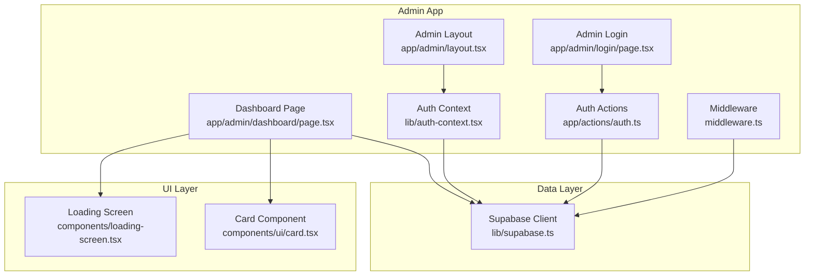
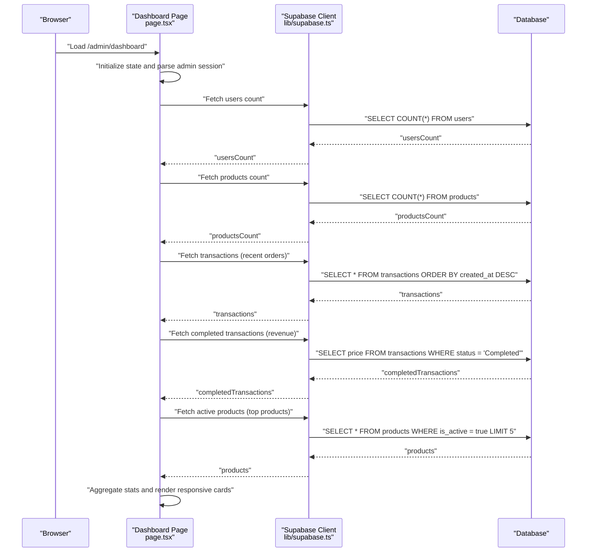
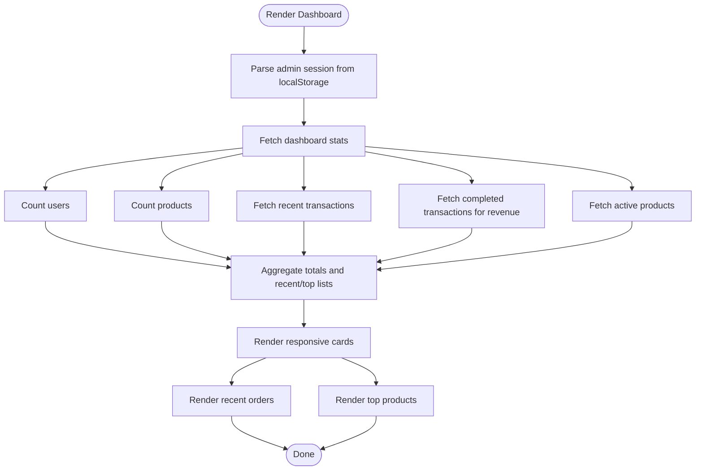
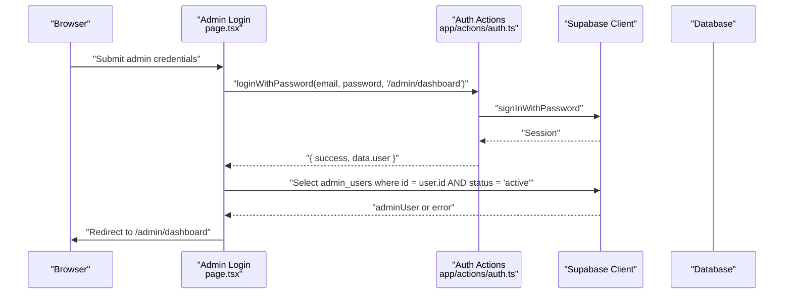
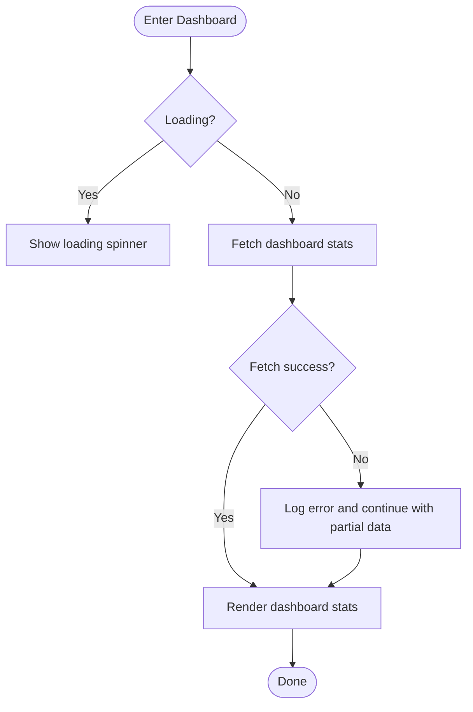
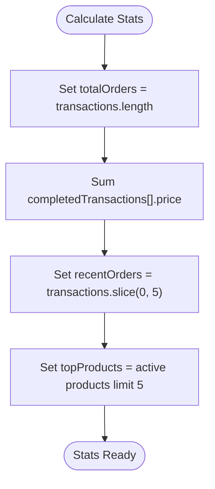
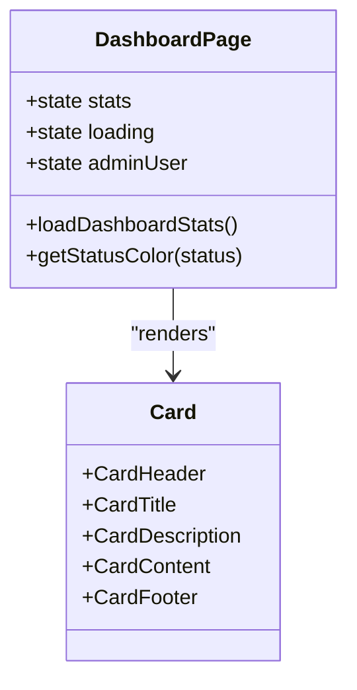
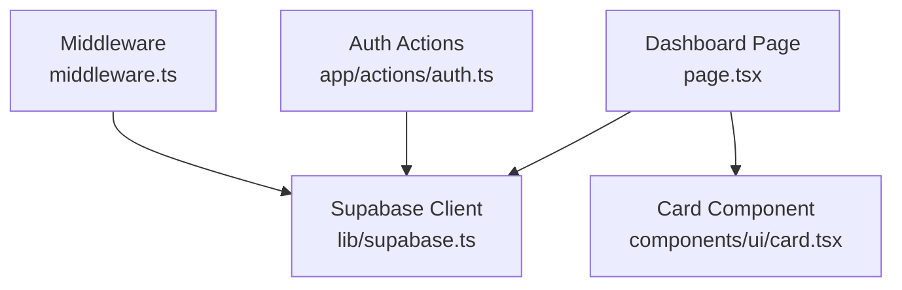

# Dashboard Overview

<cite>
**Referenced Files in This Document**
- [app/admin/dashboard/page.tsx](file://app/admin/dashboard/page.tsx)
- [app/admin/layout.tsx](file://app/admin/layout.tsx)
- [lib/supabase.ts](file://lib/supabase.ts)
- [components/ui/card.tsx](file://components/ui/card.tsx)
- [app/actions/auth.ts](file://app/actions/auth.ts)
- [app/admin/login/page.tsx](file://app/admin/login/page.tsx)
- [lib/auth-context.tsx](file://lib/auth-context.tsx)
- [middleware.ts](file://middleware.ts)
- [app/admin/dashboard/admin-users/loading.tsx](file://app/admin/dashboard/admin-users/loading.tsx)
- [lib/notification-context.tsx](file://lib/notification-context.tsx)
- [components/loading-screen.tsx](file://components/loading-screen.tsx)
</cite>

## Table of Contents
1. [Introduction](#introduction)
2. [Project Structure](#project-structure)
3. [Core Components](#core-components)
4. [Architecture Overview](#architecture-overview)
5. [Detailed Component Analysis](#detailed-component-analysis)
6. [Dependency Analysis](#dependency-analysis)
7. [Performance Considerations](#performance-considerations)
8. [Troubleshooting Guide](#troubleshooting-guide)
9. [Conclusion](#conclusion)

## Introduction
This document provides a comprehensive overview of the admin dashboard, focusing on the main dashboard interface and analytics system. It explains the dashboard architecture using Next.js client-side rendering with server-side data fetching, real-time statistics calculation, and a responsive card-based layout. It documents the implementation details of key metrics including total users, products, orders, and revenue tracking. It also covers the welcome system with admin session management, loading states, and error handling patterns. Practical examples demonstrate dashboard component structure, stat calculations, and user interface patterns, using terminology consistent with the codebase such as "dashboard stats," "admin session," and "responsive cards." Performance considerations for data loading, caching strategies, and user experience optimization are included, along with diagrams to illustrate dashboard layout and component hierarchy.

## Project Structure
The admin dashboard resides under the Next.js app directory and integrates with Supabase for data access and authentication. The dashboard page orchestrates client-side rendering and server-side data fetching via Supabase. The admin layout manages global UI elements and notifications. Authentication is handled through server actions and Supabase, with middleware ensuring session updates. UI primitives are provided by shared components, notably the card component used extensively for dashboard stats.

**Diagram sources**
- [app/admin/dashboard/page.tsx:1-286](file://app/admin/dashboard/page.tsx#L1-L286)
- [app/admin/layout.tsx:1-23](file://app/admin/layout.tsx#L1-L23)
- [app/admin/login/page.tsx:1-145](file://app/admin/login/page.tsx#L1-L145)
- [app/actions/auth.ts:1-68](file://app/actions/auth.ts#L1-L68)
- [lib/auth-context.tsx:1-374](file://lib/auth-context.tsx#L1-L374)
- [middleware.ts:1-11](file://middleware.ts#L1-L11)
- [components/ui/card.tsx:1-87](file://components/ui/card.tsx#L1-L87)
- [components/loading-screen.tsx:1-95](file://components/loading-screen.tsx#L1-L95)
- [lib/supabase.ts:1-188](file://lib/supabase.ts#L1-L188)

**Section sources**
- [app/admin/dashboard/page.tsx:1-286](file://app/admin/dashboard/page.tsx#L1-L286)
- [app/admin/layout.tsx:1-23](file://app/admin/layout.tsx#L1-L23)
- [lib/supabase.ts:1-188](file://lib/supabase.ts#L1-L188)
- [components/ui/card.tsx:1-87](file://components/ui/card.tsx#L1-L87)
- [app/actions/auth.ts:1-68](file://app/actions/auth.ts#L1-L68)
- [app/admin/login/page.tsx:1-145](file://app/admin/login/page.tsx#L1-L145)
- [lib/auth-context.tsx:1-374](file://lib/auth-context.tsx#L1-L374)
- [middleware.ts:1-11](file://middleware.ts#L1-L11)
- [components/loading-screen.tsx:1-95](file://components/loading-screen.tsx#L1-L95)

## Core Components
- Dashboard Page: Implements the main dashboard interface, fetches dashboard stats from Supabase, renders responsive cards, and displays recent activity and top products.
- Admin Layout: Provides the admin shell with global notifications and basic routing behavior.
- Supabase Client: Centralizes Supabase initialization and database types for type-safe queries.
- Card Component: Reusable UI primitive for dashboard stats and sections.
- Auth Actions: Server actions for login, signup, and logout, enforcing secure cookie handling.
- Admin Login: Client-side login form that triggers server actions and validates admin roles.
- Auth Context: Manages user session and transactions for authenticated users (used by other parts of the app).
- Middleware: Updates sessions at the edge for protected routes.
- Loading States: Skeleton-based loading components for admin users list and other pages.
- Notification Context: Real-time notifications and admin notification management (used by other parts of the app).
- Loading Screen: Animated loading screen for initial page transitions.

**Section sources**
- [app/admin/dashboard/page.tsx:11-104](file://app/admin/dashboard/page.tsx#L11-L104)
- [app/admin/layout.tsx:8-22](file://app/admin/layout.tsx#L8-L22)
- [lib/supabase.ts:1-188](file://lib/supabase.ts#L1-L188)
- [components/ui/card.tsx:1-87](file://components/ui/card.tsx#L1-L87)
- [app/actions/auth.ts:8-23](file://app/actions/auth.ts#L8-L23)
- [app/admin/login/page.tsx:23-61](file://app/admin/login/page.tsx#L23-L61)
- [lib/auth-context.tsx:51-92](file://lib/auth-context.tsx#L51-L92)
- [middleware.ts:4-6](file://middleware.ts#L4-L6)
- [app/admin/dashboard/admin-users/loading.tsx:4-51](file://app/admin/dashboard/admin-users/loading.tsx#L4-L51)
- [lib/notification-context.tsx:29-170](file://lib/notification-context.tsx#L29-L170)
- [components/loading-screen.tsx:10-47](file://components/loading-screen.tsx#L10-L47)

## Architecture Overview
The dashboard follows a hybrid architecture:
- Client-side rendering with React hooks for UI updates and state management.
- Server-side data fetching via Supabase client initialized in the backend.
- Admin session management using Supabase auth and server actions.
- Responsive layout using CSS grid for "responsive cards."
- Real-time statistics derived from database queries and client-side aggregation.

**Diagram sources**
- [app/admin/dashboard/page.tsx:47-104](file://app/admin/dashboard/page.tsx#L47-L104)
- [lib/supabase.ts:1-188](file://lib/supabase.ts#L1-L188)

**Section sources**
- [app/admin/dashboard/page.tsx:20-104](file://app/admin/dashboard/page.tsx#L20-L104)
- [lib/supabase.ts:1-188](file://lib/supabase.ts#L1-L188)

## Detailed Component Analysis

### Dashboard Page: Stats Rendering and Layout
The dashboard page defines a typed interface for dashboard stats and renders four primary "dashboard stats" cards:
- Total Users
- Total Products
- Total Orders
- Total Revenue

It also renders recent orders and top active products in responsive card sections. The layout uses CSS grid to achieve a responsive card-based design across small, medium, and large screens.

**Diagram sources**
- [app/admin/dashboard/page.tsx:11-104](file://app/admin/dashboard/page.tsx#L11-L104)

**Section sources**
- [app/admin/dashboard/page.tsx:11-191](file://app/admin/dashboard/page.tsx#L11-L191)
- [app/admin/dashboard/page.tsx:221-282](file://app/admin/dashboard/page.tsx#L221-L282)

### Admin Session Management and Welcome System
The dashboard parses an admin session from localStorage to greet the user. The login page uses server actions to authenticate and then verifies the admin role against the admin_users table. Middleware ensures session updates at the edge for protected routes.

**Diagram sources**
- [app/admin/login/page.tsx:23-61](file://app/admin/login/page.tsx#L23-L61)
- [app/actions/auth.ts:8-23](file://app/actions/auth.ts#L8-L23)
- [middleware.ts:4-6](file://middleware.ts#L4-L6)

**Section sources**
- [app/admin/dashboard/page.tsx:32-44](file://app/admin/dashboard/page.tsx#L32-L44)
- [app/admin/login/page.tsx:23-61](file://app/admin/login/page.tsx#L23-L61)
- [app/actions/auth.ts:8-23](file://app/actions/auth.ts#L8-L23)
- [middleware.ts:4-6](file://middleware.ts#L4-L6)

### Loading States and Error Handling Patterns
The dashboard implements robust loading and error handling:
- Loading state during initial data fetch.
- Error logging for transaction and completed transaction queries.
- Skeleton-based loading for admin users list.
- Toast notifications for user feedback.

**Diagram sources**
- [app/admin/dashboard/page.tsx:121-130](file://app/admin/dashboard/page.tsx#L121-L130)
- [app/admin/dashboard/page.tsx:47-104](file://app/admin/dashboard/page.tsx#L47-L104)
- [app/admin/dashboard/admin-users/loading.tsx:4-51](file://app/admin/dashboard/admin-users/loading.tsx#L4-L51)

**Section sources**
- [app/admin/dashboard/page.tsx:121-130](file://app/admin/dashboard/page.tsx#L121-L130)
- [app/admin/dashboard/page.tsx:47-104](file://app/admin/dashboard/page.tsx#L47-L104)
- [app/admin/dashboard/admin-users/loading.tsx:4-51](file://app/admin/dashboard/admin-users/loading.tsx#L4-L51)

### Real-Time Statistics Calculation
The dashboard calculates:
- Total Orders: Count of all transactions.
- Total Revenue: Sum of prices from completed transactions.
- Recent Orders: Latest transactions ordered by creation time.
- Top Active Products: Active products limited to top entries.

**Diagram sources**
- [app/admin/dashboard/page.tsx:78-98](file://app/admin/dashboard/page.tsx#L78-L98)

**Section sources**
- [app/admin/dashboard/page.tsx:78-98](file://app/admin/dashboard/page.tsx#L78-L98)

### Responsive Cards and UI Patterns
The dashboard uses the Card component to render:
- Four main stats cards with icons and labels.
- Quick action buttons for common admin tasks.
- Two-column layout for recent orders and top products on larger screens.

**Diagram sources**
- [app/admin/dashboard/page.tsx:143-191](file://app/admin/dashboard/page.tsx#L143-L191)
- [components/ui/card.tsx:1-87](file://components/ui/card.tsx#L1-L87)

**Section sources**
- [app/admin/dashboard/page.tsx:143-191](file://app/admin/dashboard/page.tsx#L143-L191)
- [components/ui/card.tsx:1-87](file://components/ui/card.tsx#L1-L87)

## Dependency Analysis
The dashboard depends on Supabase for data access and authentication, uses reusable UI components, and integrates with server actions for secure operations. The middleware ensures session updates at the edge.

**Diagram sources**
- [app/admin/dashboard/page.tsx:1-286](file://app/admin/dashboard/page.tsx#L1-L286)
- [lib/supabase.ts:1-188](file://lib/supabase.ts#L1-L188)
- [app/actions/auth.ts:1-68](file://app/actions/auth.ts#L1-L68)
- [middleware.ts:1-11](file://middleware.ts#L1-L11)
- [components/ui/card.tsx:1-87](file://components/ui/card.tsx#L1-L87)

**Section sources**
- [app/admin/dashboard/page.tsx:1-286](file://app/admin/dashboard/page.tsx#L1-L286)
- [lib/supabase.ts:1-188](file://lib/supabase.ts#L1-L188)
- [app/actions/auth.ts:1-68](file://app/actions/auth.ts#L1-L68)
- [middleware.ts:1-11](file://middleware.ts#L1-L11)
- [components/ui/card.tsx:1-87](file://components/ui/card.tsx#L1-L87)

## Performance Considerations
- Data Loading
  - Use targeted queries to minimize payload size (counts, limited lists).
  - Separate queries for recent orders and completed transactions to avoid unnecessary filtering.
  - Consider pagination for large datasets in related views.
- Caching Strategies
  - Leverage Supabase edge caching and middleware session updates for reduced latency.
  - Use client-side memoization for computed stats to avoid redundant recalculations.
- User Experience Optimization
  - Implement skeleton loaders for critical sections to maintain perceived performance.
  - Provide immediate feedback via toasts for user actions.
  - Ensure responsive layouts adapt gracefully across device sizes.

[No sources needed since this section provides general guidance]

## Troubleshooting Guide
- Authentication Failures
  - Verify server actions return proper error messages and that the admin role check passes.
  - Confirm middleware updates sessions and redirects appropriately.
- Data Fetch Errors
  - Inspect logs for transaction and completed transaction query errors.
  - Validate database permissions and table names.
- UI Issues
  - Confirm Card component props are correctly passed and responsive grid classes are applied.
  - Check loading states and fallback UI for empty datasets.

**Section sources**
- [app/admin/login/page.tsx:47-52](file://app/admin/login/page.tsx#L47-L52)
- [app/admin/dashboard/page.tsx:63-76](file://app/admin/dashboard/page.tsx#L63-L76)
- [components/ui/card.tsx:1-87](file://components/ui/card.tsx#L1-L87)

## Conclusion
The admin dashboard leverages Next.js client-side rendering with server-side data fetching to deliver a responsive, real-time analytics interface. It implements robust admin session management, loading states, and error handling patterns. The dashboard’s "dashboard stats" are calculated efficiently from Supabase queries and presented through a consistent "responsive cards" layout. By following the outlined performance and troubleshooting guidance, the dashboard maintains a smooth user experience while providing actionable insights into users, products, orders, and revenue.