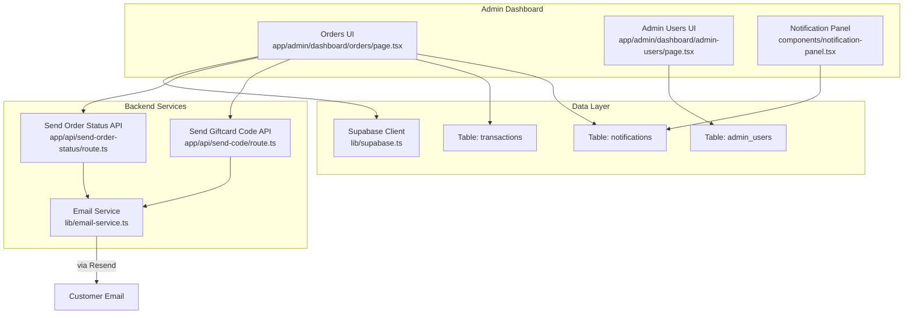
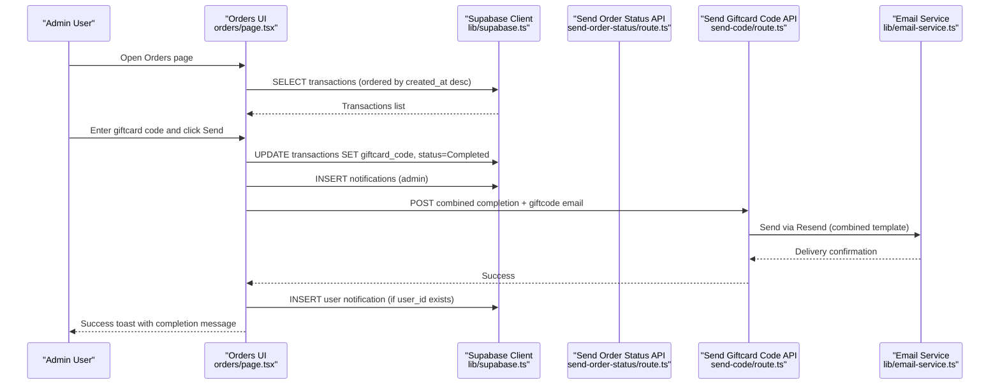
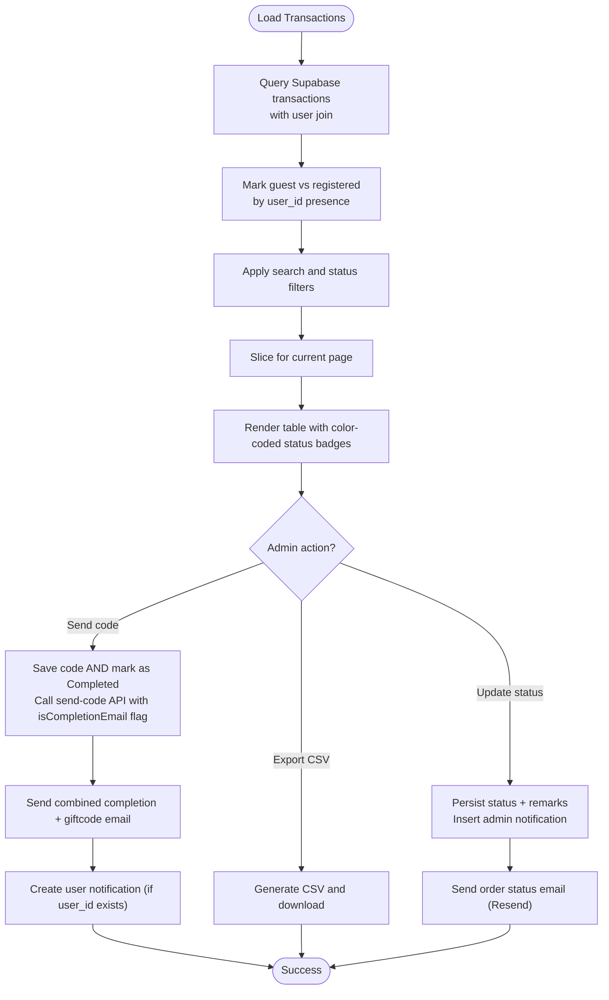
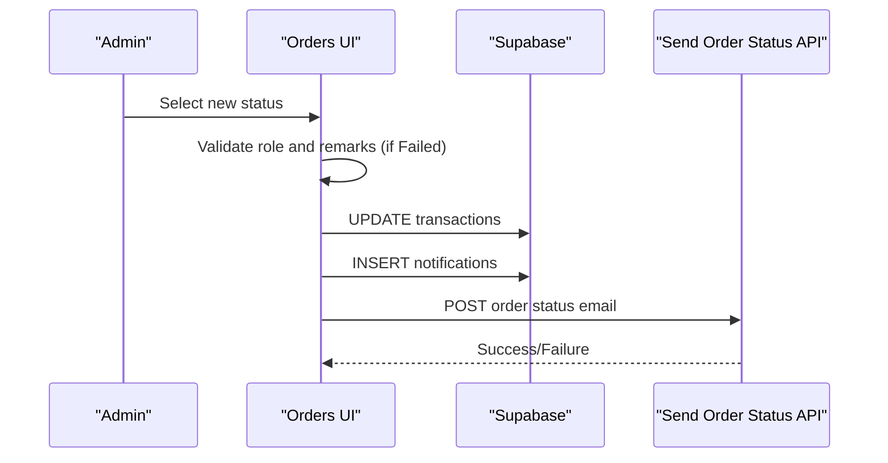
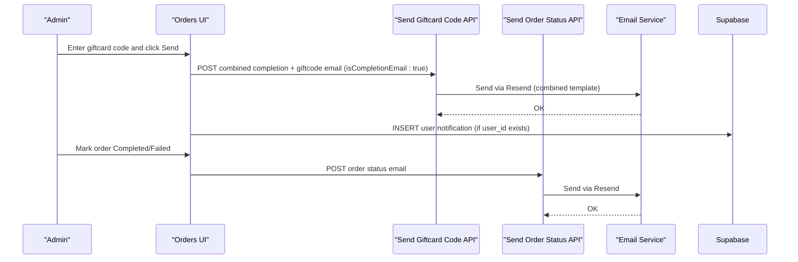
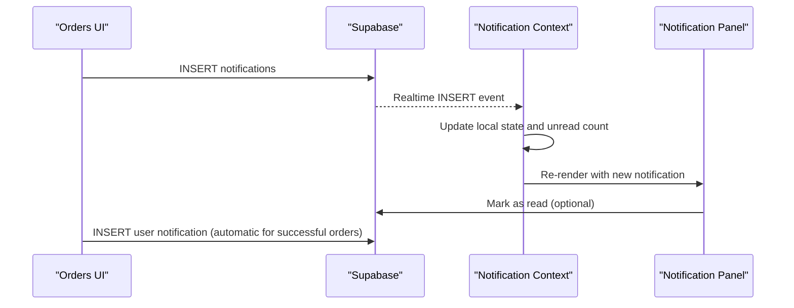
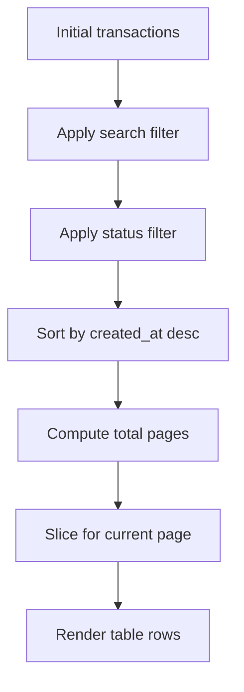
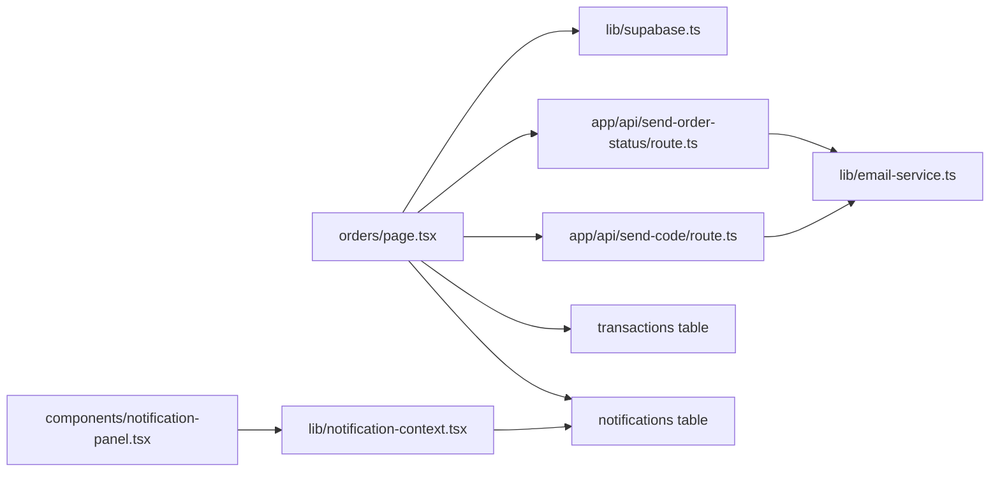

# Orders Management

<cite>
**Referenced Files in This Document**
- [orders/page.tsx](file://app/admin/dashboard/orders/page.tsx)
- [supabase.ts](file://lib/supabase.ts)
- [email-service.ts](file://lib/email-service.ts)
- [send-order-status/route.ts](file://app/api/send-order-status/route.ts)
- [send-code/route.ts](file://app/api/send-code/route.ts)
- [notification-context.tsx](file://lib/notification-context.tsx)
- [notification-panel.tsx](file://components/notification-panel.tsx)
- [auth-context.tsx](file://lib/auth-context.tsx)
- [admin-users/page.tsx](file://app/admin/dashboard/admin-users/page.tsx)
</cite>

## Update Summary
**Changes Made**
- Updated giftcard code generation workflow to mark transactions as 'Completed' during code entry
- Modified email dispatch to send combined completion and giftcode emails in a single operation
- Added automatic user notification creation for successful orders
- Enhanced order completion flow with improved error handling and user feedback

## Table of Contents
1. [Introduction](#introduction)
2. [Project Structure](#project-structure)
3. [Core Components](#core-components)
4. [Architecture Overview](#architecture-overview)
5. [Detailed Component Analysis](#detailed-component-analysis)
6. [Dependency Analysis](#dependency-analysis)
7. [Performance Considerations](#performance-considerations)
8. [Security Considerations](#security-considerations)
9. [Troubleshooting Guide](#troubleshooting-guide)
10. [Conclusion](#conclusion)

## Introduction
This document describes the orders management system used by administrators to view, update, and process customer orders. It covers order listing, filtering, sorting, pagination, status updates, refund processing, customer communication workflows, and real-time notifications. The system leverages Supabase for data persistence and real-time events, and integrates with email services for order status notifications and gift card code delivery.

**Updated** The system now features a redesigned giftcard code generation workflow that automatically marks transactions as 'Completed' during code entry, sends combined completion and giftcode emails, and creates automatic user notifications for successful orders.

## Project Structure
The orders management interface resides under the admin dashboard and interacts with Supabase tables for transactions and notifications. Key areas:
- Administrative UI: Orders listing, filtering, status updates, gift card code entry and dispatch
- Backend APIs: Email dispatch for order status and gift card code delivery
- Real-time notifications: Local notification panel and Supabase real-time channels
- Authentication and roles: Admin user roles and permissions enforced in UI and APIs

**Diagram sources**
- [orders/page.tsx:1-672](file://app/admin/dashboard/orders/page.tsx#L1-L672)
- [send-order-status/route.ts:1-199](file://app/api/send-order-status/route.ts#L1-L199)
- [send-code/route.ts:1-167](file://app/api/send-code/route.ts#L1-L167)
- [email-service.ts:1-126](file://lib/email-service.ts#L1-L126)
- [notification-context.tsx:1-242](file://lib/notification-context.tsx#L1-L242)
- [notification-panel.tsx:1-162](file://components/notification-panel.tsx#L1-L162)
- [supabase.ts:1-188](file://lib/supabase.ts#L1-L188)
- [admin-users/page.tsx:1-623](file://app/admin/dashboard/admin-users/page.tsx#L1-L623)

**Section sources**
- [orders/page.tsx:1-672](file://app/admin/dashboard/orders/page.tsx#L1-L672)
- [supabase.ts:1-188](file://lib/supabase.ts#L1-L188)

## Core Components
- Orders UI: Loads all transactions, applies search and status filters, paginates results, updates order status, sends notifications, and exports CSV.
- Supabase integration: Provides typed database access and real-time channels for notifications.
- Email APIs: Secure server-side routes to send order status and gift card code emails.
- Notification system: Real-time notifications for admins and customers, with read/unread tracking.
- Admin roles: Enforces role-based permissions for order management and user administration.

**Updated** The giftcard code generation workflow now automatically marks transactions as 'Completed' and sends combined completion/giftcode emails.

**Section sources**
- [orders/page.tsx:1-672](file://app/admin/dashboard/orders/page.tsx#L1-L672)
- [supabase.ts:1-188](file://lib/supabase.ts#L1-L188)
- [send-order-status/route.ts:1-199](file://app/api/send-order-status/route.ts#L1-L199)
- [send-code/route.ts:1-167](file://app/api/send-code/route.ts#L1-L167)
- [notification-context.tsx:1-242](file://lib/notification-context.tsx#L1-L242)
- [notification-panel.tsx:1-162](file://components/notification-panel.tsx#L1-L162)
- [admin-users/page.tsx:1-623](file://app/admin/dashboard/admin-users/page.tsx#L1-L623)

## Architecture Overview
The orders management system follows a client-driven UI with serverless backend APIs for sensitive operations. The client loads transaction data from Supabase, renders filters and pagination, and updates statuses. On status changes, the system persists updates, optionally prompts for failure remarks, inserts admin notifications, and triggers email dispatch. Real-time notifications are synchronized via Supabase PostgreSQL changes.

**Updated** The giftcard code generation workflow now performs a single atomic operation: saving the code, marking the transaction as 'Completed', sending a combined completion/giftcode email, and creating user notifications.

**Diagram sources**
- [orders/page.tsx:253-328](file://app/admin/dashboard/orders/page.tsx#L253-L328)
- [send-order-status/route.ts:19-198](file://app/api/send-order-status/route.ts#L19-L198)
- [send-code/route.ts:8-167](file://app/api/send-code/route.ts#L8-L167)
- [email-service.ts:75-126](file://lib/email-service.ts#L75-L126)
- [supabase.ts:1-7](file://lib/supabase.ts#L1-L7)

## Detailed Component Analysis

### Orders Listing and Management UI
- Data loading: Fetches all transactions with user details, marks guest vs registered users, sorts by creation time.
- Filtering: Supports search by product name, customer email, or transaction ID; status filter dropdown.
- Pagination: Fixed item count per page with navigation controls.
- Status updates: Conditional rendering of status selector based on admin role; color-coded badges by status.
- Gift card code flow: For digital goods, allows entering a code, saves to DB, marks as completed, and sends combined email with notification.
- Export: Generates CSV of filtered transactions with computed UID for top-up orders.

**Updated** The giftcard code flow now performs an atomic operation that marks transactions as 'Completed' during code entry, ensuring immediate status updates and preventing partial states.

**Diagram sources**
- [orders/page.tsx:253-328](file://app/admin/dashboard/orders/page.tsx#L253-L328)

**Section sources**
- [orders/page.tsx:1-672](file://app/admin/dashboard/orders/page.tsx#L1-L672)

### Order Status Updates and Refund Processing
- Permission enforcement: Prevents order_management role from changing status; displays error otherwise.
- Remarks for failures: Prompts for optional remarks when marking as Failed; stores in DB.
- Notification insertion: Inserts admin notifications upon status change.
- Email dispatch: Sends order status email via server route; includes product, amount, remarks, and transaction ID.
- Refund messaging: Includes standardized refund information in failed order email.

**Diagram sources**
- [orders/page.tsx:184-251](file://app/admin/dashboard/orders/page.tsx#L184-L251)
- [send-order-status/route.ts:19-198](file://app/api/send-order-status/route.ts#L19-L198)

**Section sources**
- [orders/page.tsx:184-251](file://app/admin/dashboard/orders/page.tsx#L184-L251)
- [send-order-status/route.ts:1-199](file://app/api/send-order-status/route.ts#L1-L199)

### Customer Communication Workflows
- Order status emails: Two templates (Completed and Failed) with branded HTML and dynamic content.
- Gift card code emails: Dedicated API endpoint for sending PIN-style codes with redemption instructions.
- **Updated** Combined completion and giftcode emails: Single email template that includes both completion confirmation and gift card code details.
- Fallback handling: Email service attempts EmailJS and falls back to custom implementation if configured incorrectly.
- Reply-to and branding: Uses consistent sender and reply-to addresses.

**Updated** The giftcard code email endpoint now supports a combined completion email template that includes both order completion confirmation and gift card code details in a single email operation.

**Diagram sources**
- [send-code/route.ts:8-167](file://app/api/send-code/route.ts#L8-L167)
- [send-order-status/route.ts:19-198](file://app/api/send-order-status/route.ts#L19-L198)
- [email-service.ts:75-126](file://lib/email-service.ts#L75-L126)

**Section sources**
- [send-code/route.ts:1-167](file://app/api/send-code/route.ts#L1-L167)
- [send-order-status/route.ts:1-199](file://app/api/send-order-status/route.ts#L1-L199)
- [email-service.ts:1-126](file://lib/email-service.ts#L1-L126)

### Real-Time Notifications and Audit Trails
- Supabase real-time: Subscribes to notifications table changes; adds new notifications to state and shows toast.
- Local notification panel: Displays unread count, allows mark-as-read and mark-all-read; shows type-specific styling.
- Admin notifications: On status change, inserts a notification record for admin visibility.
- Audit trail: Transaction updates include timestamps and remarks; notifications include creation time and read state.

**Updated** The system now automatically creates user notifications for successful orders, providing immediate feedback to customers without manual intervention.

**Diagram sources**
- [orders/page.tsx:169-182](file://app/admin/dashboard/orders/page.tsx#L169-L182)
- [notification-context.tsx:172-220](file://lib/notification-context.tsx#L172-L220)
- [notification-panel.tsx:1-162](file://components/notification-panel.tsx#L1-L162)

**Section sources**
- [notification-context.tsx:1-242](file://lib/notification-context.tsx#L1-L242)
- [notification-panel.tsx:1-162](file://components/notification-panel.tsx#L1-L162)
- [orders/page.tsx:154-182](file://app/admin/dashboard/orders/page.tsx#L154-L182)

### Order Filtering, Sorting, and Pagination
- Filtering: Case-insensitive substring match across product name, user email, and transaction ID; status dropdown filter.
- Sorting: Default sort by created_at descending.
- Pagination: Fixed items per page; calculates total pages and slices the dataset accordingly.

**Diagram sources**
- [orders/page.tsx:109-137](file://app/admin/dashboard/orders/page.tsx#L109-L137)

**Section sources**
- [orders/page.tsx:109-137](file://app/admin/dashboard/orders/page.tsx#L109-L137)

### Order CRUD Operations and Bulk Actions
- View: Full transaction listing with customer, product, amount, price, payment method, status, and date.
- Update: Admin selects new status; system validates role and remarks; persists to DB and sends notifications.
- Delete: Not exposed in orders UI; deletion is handled in admin users management.
- Export: Generates CSV of filtered transactions for offline analysis.

**Updated** Giftcard code operations now perform atomic updates: code entry triggers immediate transaction completion, email dispatch, and user notification creation.

Practical examples (paths):
- Update status: [updateTransactionStatus:184-251](file://app/admin/dashboard/orders/page.tsx#L184-L251)
- **Updated** Send giftcard code: [handleSendGiftcardCode:253-328](file://app/admin/dashboard/orders/page.tsx#L253-L328)
- Export CSV: [exportTransactions:353-381](file://app/admin/dashboard/orders/page.tsx#L353-L381)

**Section sources**
- [orders/page.tsx:184-381](file://app/admin/dashboard/orders/page.tsx#L184-L381)

### Order History Tracking
- Transaction history: Admins can view full order history; UI computes unique registered and guest users.
- Guest handling: For top-up orders, UID resolution considers guest_user_data fields.
- Local state sync: UI updates local transactions after successful DB writes.

**Updated** The system ensures immediate consistency between database state and UI display, with automatic user notifications for successful transactions.

**Section sources**
- [orders/page.tsx:330-345](file://app/admin/dashboard/orders/page.tsx#L330-L345)
- [orders/page.tsx:396-399](file://app/admin/dashboard/orders/page.tsx#L396-L399)

## Dependency Analysis
- Orders UI depends on Supabase client for reads/writes and on server routes for secure email dispatch.
- Email APIs depend on Resend SDK and environment configuration; fallback logic is handled by email service.
- Notification system depends on Supabase real-time channels and local context for UI state.
- Admin roles enforce access control in both UI and APIs.

**Updated** The giftcard code workflow introduces tighter coupling between UI, Supabase, and email services for atomic operations.

**Diagram sources**
- [orders/page.tsx:1-672](file://app/admin/dashboard/orders/page.tsx#L1-L672)
- [supabase.ts:1-188](file://lib/supabase.ts#L1-L188)
- [send-order-status/route.ts:1-199](file://app/api/send-order-status/route.ts#L1-L199)
- [send-code/route.ts:1-167](file://app/api/send-code/route.ts#L1-L167)
- [email-service.ts:1-126](file://lib/email-service.ts#L1-L126)
- [notification-context.tsx:1-242](file://lib/notification-context.tsx#L1-L242)
- [notification-panel.tsx:1-162](file://components/notification-panel.tsx#L1-L162)

**Section sources**
- [orders/page.tsx:1-672](file://app/admin/dashboard/orders/page.tsx#L1-L672)
- [supabase.ts:1-188](file://lib/supabase.ts#L1-L188)
- [notification-context.tsx:1-242](file://lib/notification-context.tsx#L1-L242)

## Performance Considerations
- Client-side filtering and pagination reduce server load but may impact large datasets; consider server-side pagination for very large transaction volumes.
- Real-time notifications add overhead; ensure efficient rendering and avoid excessive re-renders.
- Email dispatch occurs on the server; keep payload minimal and avoid blocking the UI thread.
- CSV export is client-side; large datasets may cause memory pressure; consider server-side generation for heavy exports.
- **Updated** Atomic giftcard operations: The combined completion and email dispatch operation reduces the number of database round-trips and email operations.

## Security Considerations
- Role-based access control: The orders UI prevents order_management users from changing statuses; APIs enforce admin-only access for sensitive operations.
- Authorization checks: Server routes verify authenticated user and admin role before sending emails.
- Data exposure: UI filters and exports should not expose sensitive fields beyond what is necessary for admin tasks.
- Auditability: Transaction updates include timestamps and remarks; admin notifications provide a trail of actions.
- Environment configuration: Email and Supabase keys must be managed securely; avoid logging secrets.
- **Updated** Atomic operation security: The combined giftcard operation ensures data consistency and prevents partial state updates.

**Section sources**
- [orders/page.tsx:184-189](file://app/admin/dashboard/orders/page.tsx#L184-L189)
- [send-order-status/route.ts:22-32](file://app/api/send-order-status/route.ts#L22-L32)
- [send-code/route.ts:10-15](file://app/api/send-code/route.ts#L10-L15)

## Troubleshooting Guide
- Failed to load transactions: Check Supabase connectivity and query permissions; verify network and CORS settings.
- Status update errors: Validate admin role and ensure remarks are provided when marking as Failed; inspect Supabase error logs.
- Email delivery failures: Verify Resend API key and template configuration; review server route error responses.
- Notification not appearing: Confirm Supabase real-time subscription and that notifications match current user or are broadcast.
- CSV export issues: Ensure filtered dataset is not empty; confirm browser supports Blob and anchor download.
- **Updated** Giftcard code errors: Verify code is entered before submission; check that transaction status is properly updated to 'Completed'; ensure user notifications are created for successful orders.

**Section sources**
- [orders/page.tsx:83-102](file://app/admin/dashboard/orders/page.tsx#L83-L102)
- [send-order-status/route.ts:194-197](file://app/api/send-order-status/route.ts#L194-L197)
- [send-code/route.ts:162-167](file://app/api/send-code/route.ts#L162-L167)
- [notification-context.tsx:172-220](file://lib/notification-context.tsx#L172-L220)

## Conclusion
The orders management system provides a robust, role-aware interface for administrators to monitor, update, and communicate about customer orders. It combines Supabase-backed data management, secure server-side email dispatch, and real-time notifications to deliver a responsive and auditable workflow. 

**Updated** The redesigned giftcard code generation workflow significantly improves user experience by providing immediate transaction completion, combined email notifications, and automatic user notifications. These enhancements streamline the order processing workflow while maintaining security and auditability standards. Extending the system with server-side pagination and enhanced analytics would further improve scalability and insights.