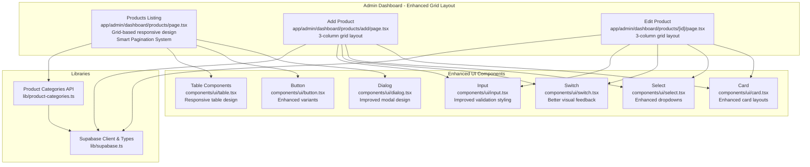
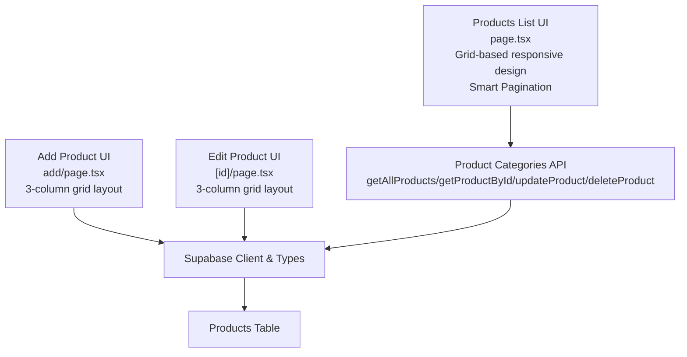
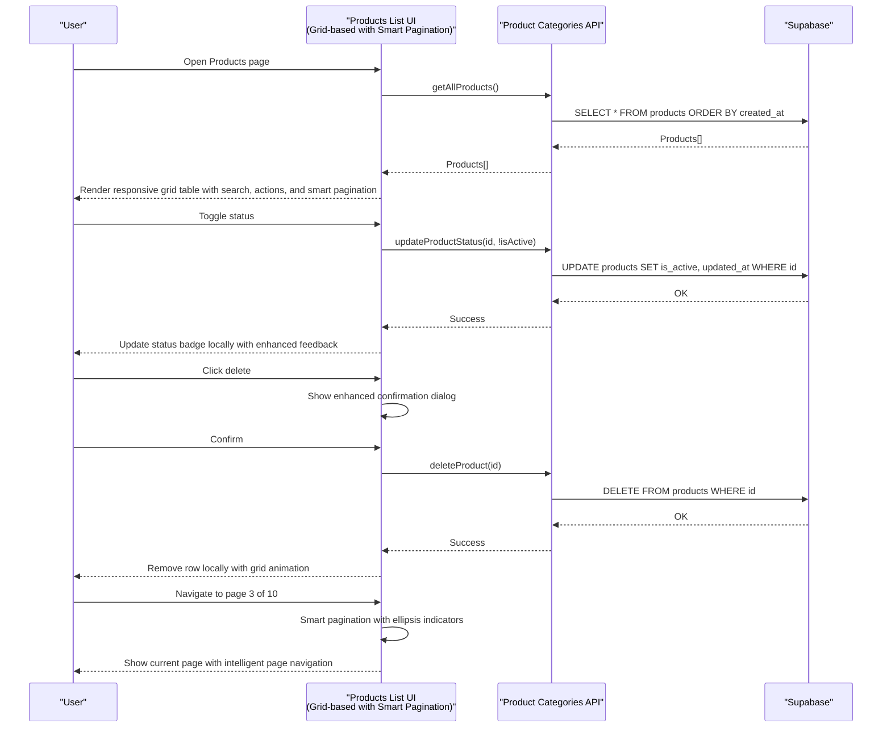
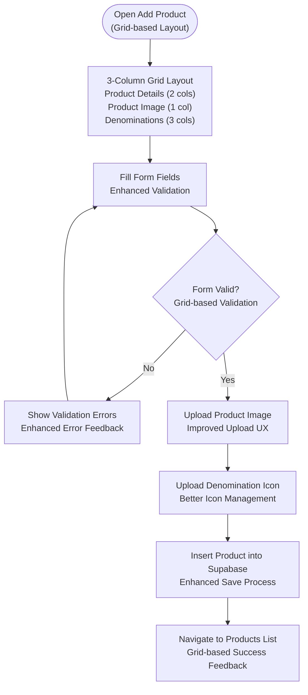
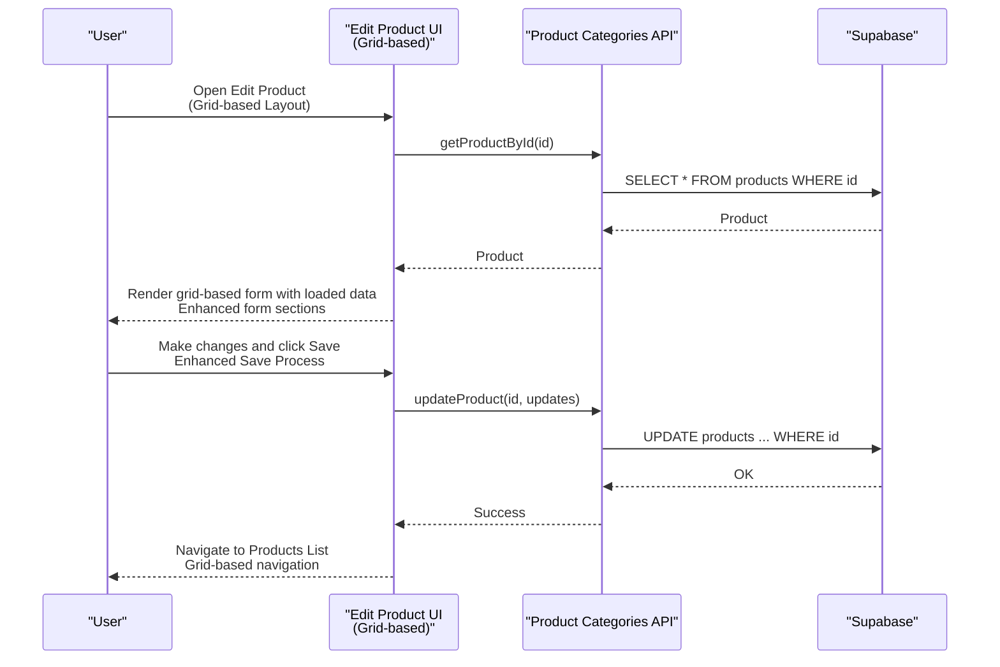
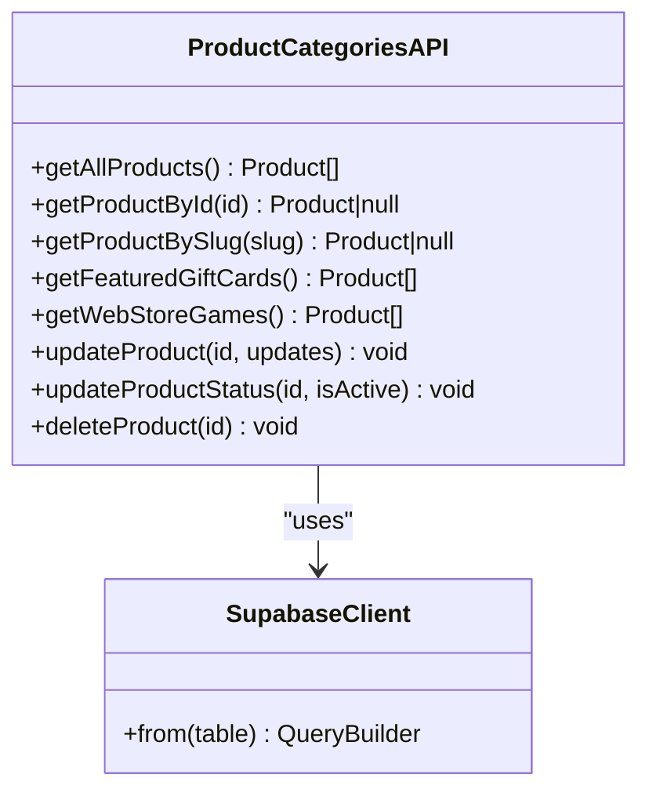
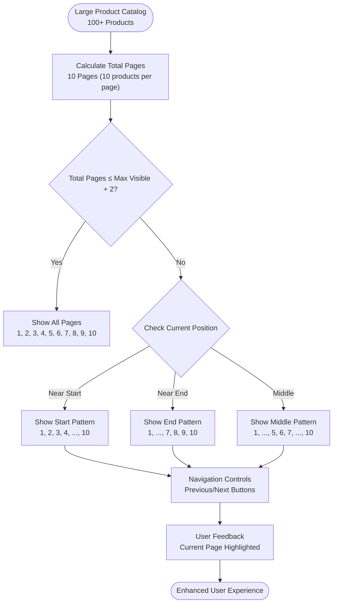
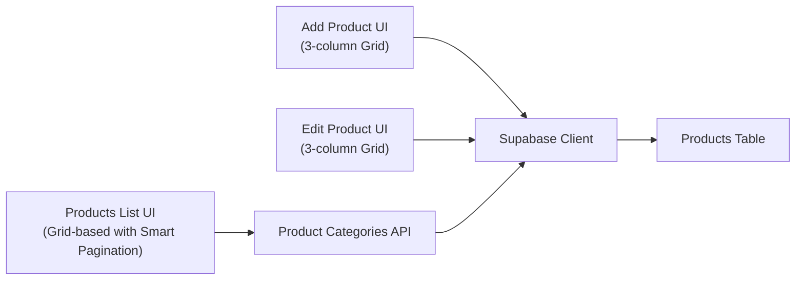

# Products Administration

<cite>
**Referenced Files in This Document**
- [README.md](file://README.md)
- [app/admin/dashboard/products/page.tsx](file://app/admin/dashboard/products/page.tsx)
- [app/admin/dashboard/products/add/page.tsx](file://app/admin/dashboard/products/add/page.tsx)
- [app/admin/dashboard/products/[id]/page.tsx](file://app/admin/dashboard/products/[id]/page.tsx)
- [lib/product-categories.ts](file://lib/product-categories.ts)
- [lib/supabase.ts](file://lib/supabase.ts)
- [components/ui/table.tsx](file://components/ui/table.tsx)
- [components/ui/button.tsx](file://components/ui/button.tsx)
- [components/ui/input.tsx](file://components/ui/input.tsx)
- [components/ui/switch.tsx](file://components/ui/switch.tsx)
- [components/ui/select.tsx](file://components/ui/select.tsx)
- [components/ui/dialog.tsx](file://components/ui/dialog.tsx)
- [components/ui/card.tsx](file://components/ui/card.tsx)
- [styles/globals.css](file://styles/globals.css)
- [app/globals.css](file://app/globals.css)
</cite>

## Update Summary
**Changes Made**
- Implemented smart pagination system with ellipsis indicators for large product catalogs
- Enhanced user experience for administrators managing extensive product lists
- Added intelligent pagination logic that adapts to different screen sizes and product counts
- Improved pagination performance and accessibility for large datasets

## Table of Contents
1. [Introduction](#introduction)
2. [Project Structure](#project-structure)
3. [Core Components](#core-components)
4. [Architecture Overview](#architecture-overview)
5. [Detailed Component Analysis](#detailed-component-analysis)
6. [Enhanced Grid-Based Interface](#enhanced-grid-based-interface)
7. [Improved Responsive Design](#improved-responsive-design)
8. [Smart Pagination System](#smart-pagination-system)
9. [Dependency Analysis](#dependency-analysis)
10. [Performance Considerations](#performance-considerations)
11. [Troubleshooting Guide](#troubleshooting-guide)
12. [Conclusion](#conclusion)

## Introduction
This document describes the product administration system for managing gift card products and gaming vouchers. It focuses on the administrative interface for product administration, including product listing, creation, editing, and deletion workflows. The system has been enhanced with a modern grid-based interface that provides improved responsive design and better user experience for admin users. It documents product categorization, pricing management via denomination management, inventory control, and active/inactive status toggles. It also covers product creation forms with validation, image upload handling, category selection, and practical examples for CRUD operations, bulk actions, and product search functionality.

## Project Structure
The product administration feature is organized under the admin dashboard with dedicated pages for listing, adding, and editing products. The interface has been enhanced with grid-based layouts that provide better organization and responsive behavior across different screen sizes. Supporting libraries encapsulate product data access and Supabase integration. UI primitives are reused to build consistent forms and tables with improved responsive design.



**Diagram sources**
- [app/admin/dashboard/products/page.tsx:1-341](file://app/admin/dashboard/products/page.tsx#L1-L341)
- [app/admin/dashboard/products/add/page.tsx:270-637](file://app/admin/dashboard/products/add/page.tsx#L270-L637)
- [app/admin/dashboard/products/[id]/page.tsx:348-713](file://app/admin/dashboard/products/[id]/page.tsx#L348-L713)
- [lib/product-categories.ts:1-492](file://lib/product-categories.ts#L1-L492)
- [lib/supabase.ts:1-188](file://lib/supabase.ts#L1-L188)
- [components/ui/table.tsx:1-118](file://components/ui/table.tsx#L1-L118)
- [components/ui/button.tsx:1-57](file://components/ui/button.tsx#L1-L57)
- [components/ui/input.tsx:1-26](file://components/ui/input.tsx#L1-L26)
- [components/ui/switch.tsx:1-30](file://components/ui/switch.tsx#L1-L30)
- [components/ui/select.tsx:1-161](file://components/ui/select.tsx#L1-L161)
- [components/ui/dialog.tsx:1-123](file://components/ui/dialog.tsx#L1-L123)
- [components/ui/card.tsx:1-87](file://components/ui/card.tsx#L1-L87)

**Section sources**
- [README.md:1-18](file://README.md#L1-L18)
- [app/admin/dashboard/products/page.tsx:1-341](file://app/admin/dashboard/products/page.tsx#L1-L341)
- [app/admin/dashboard/products/add/page.tsx:1-637](file://app/admin/dashboard/products/add/page.tsx#L1-L637)
- [app/admin/dashboard/products/[id]/page.tsx](file://app/admin/dashboard/products/[id]/page.tsx#L1-L713)
- [lib/product-categories.ts:1-492](file://lib/product-categories.ts#L1-L492)
- [lib/supabase.ts:1-188](file://lib/supabase.ts#L1-L188)
- [components/ui/table.tsx:1-118](file://components/ui/table.tsx#L1-L118)
- [components/ui/button.tsx:1-57](file://components/ui/button.tsx#L1-L57)
- [components/ui/input.tsx:1-26](file://components/ui/input.tsx#L1-L26)
- [components/ui/switch.tsx:1-30](file://components/ui/switch.tsx#L1-L30)
- [components/ui/select.tsx:1-161](file://components/ui/select.tsx#L1-L161)
- [components/ui/dialog.tsx:1-123](file://components/ui/dialog.tsx#L1-L123)
- [components/ui/card.tsx:1-87](file://components/ui/card.tsx#L1-L87)

## Core Components
- **Enhanced Product listing page**: Displays all products in a responsive grid layout with improved search, status toggling, deletion confirmation, and smart pagination with ellipsis indicators.
- **Grid-based Add product page**: Provides a comprehensive 3-column form layout for creating new products with validation, image upload, denomination management, and FAQs.
- **Responsive Edit product page**: Loads existing product data in a grid-based layout allowing updates with improved image and denomination management.
- **Product categories API**: Centralizes product data access, caching, and fallback behavior when Supabase is unavailable.
- **Supabase integration**: Provides database client and table definitions for product storage.

Key responsibilities:
- **Product administration**: CRUD operations, search, and status toggling with enhanced UI.
- **Denomination management**: Adding, editing, removing, and applying a shared icon to denominations with improved validation.
- **Inventory control**: Controlled via active/inactive status and product visibility with better visual feedback.
- **Smart pagination**: Intelligent pagination system with ellipsis indicators for large product catalogs.
- **Validation and integrity**: Client-side validation and server-side persistence through Supabase with enhanced error handling.
- **Responsive design**: Modern grid layouts that adapt to different screen sizes for optimal admin experience.

**Updated** Enhanced with grid-based layouts, improved responsive design, smart pagination system, and better user interface components.

**Section sources**
- [app/admin/dashboard/products/page.tsx:25-341](file://app/admin/dashboard/products/page.tsx#L25-L341)
- [app/admin/dashboard/products/add/page.tsx:21-637](file://app/admin/dashboard/products/add/page.tsx#L21-L637)
- [app/admin/dashboard/products/[id]/page.tsx](file://app/admin/dashboard/products/[id]/page.tsx#L22-L713)
- [lib/product-categories.ts:200-464](file://lib/product-categories.ts#L200-L464)
- [lib/supabase.ts:68-111](file://lib/supabase.ts#L68-L111)

## Architecture Overview
The product administration system follows a layered architecture with enhanced UI components:
- **UI Layer**: Next.js client components with grid-based layouts for listing, adding, and editing products.
- **Domain Layer**: Product categories API orchestrates data access and transformations with improved caching.
- **Persistence Layer**: Supabase client and database tables for product storage.



**Diagram sources**
- [app/admin/dashboard/products/page.tsx:1-341](file://app/admin/dashboard/products/page.tsx#L1-L341)
- [app/admin/dashboard/products/add/page.tsx:1-637](file://app/admin/dashboard/products/add/page.tsx#L1-L637)
- [app/admin/dashboard/products/[id]/page.tsx](file://app/admin/dashboard/products/[id]/page.tsx#L1-L713)
- [lib/product-categories.ts:1-492](file://lib/product-categories.ts#L1-L492)
- [lib/supabase.ts:1-188](file://lib/supabase.ts#L1-L188)

## Detailed Component Analysis

### Enhanced Product Listing Page
The listing page renders a responsive grid-based table of products with improved search capabilities, status toggling, deletion confirmation, and smart pagination. It loads data via the product categories API and displays product images, categories, and status badges in a modern grid layout.

Key behaviors:
- **Responsive grid layout**: Adapts to different screen sizes with proper spacing and alignment.
- **Enhanced search**: Filters by product name or category with improved user feedback.
- **Improved status toggle**: Updates product active state with better visual feedback and local state updates.
- **Streamlined deletion**: Confirms deletion with enhanced dialog design and removes the product from the UI.
- **Smart pagination**: Implements intelligent pagination with ellipsis indicators for large product catalogs.



**Diagram sources**
- [app/admin/dashboard/products/page.tsx:34-101](file://app/admin/dashboard/products/page.tsx#L34-L101)
- [app/admin/dashboard/products/page.tsx:258-301](file://app/admin/dashboard/products/page.tsx#L258-L301)
- [lib/product-categories.ts:365-419](file://lib/product-categories.ts#L365-L419)

**Section sources**
- [app/admin/dashboard/products/page.tsx:25-341](file://app/admin/dashboard/products/page.tsx#L25-L341)
- [lib/product-categories.ts:200-264](file://lib/product-categories.ts#L200-L264)

### Grid-Based Add Product Page
The add product page provides a comprehensive 3-column grid-based form for creating new products. The interface is organized into three main sections: Product Details (spanning 2 columns on large screens), Product Image (standalone column), and Denominations (spanning all 3 columns). This layout provides optimal space utilization and improved user experience.

Key enhancements:
- **3-column grid layout**: `lg:grid-cols-3` provides desktop-optimized layout with proper column spans.
- **Enhanced Product Details section**: Includes product name, slug, category, description, status, and ribbon text in a single column.
- **Dedicated Product Image section**: Standalone column for image upload with preview functionality.
- **Full-width Denominations section**: Spans all 3 columns for better denomination management.
- **Improved FAQ section**: Full-width layout for comprehensive FAQ management.

Validation and UX improvements:
- **Enhanced client-side validation**: Better error messaging and visual feedback.
- **Improved slug generation**: More reliable automatic slug creation from product name.
- **Enhanced toast notifications**: Better success/error feedback with improved styling.
- **Optimized loading states**: Better user feedback during uploads and saves.



**Diagram sources**
- [app/admin/dashboard/products/add/page.tsx:270-469](file://app/admin/dashboard/products/add/page.tsx#L270-L469)
- [app/admin/dashboard/products/add/page.tsx:502-547](file://app/admin/dashboard/products/add/page.tsx#L502-L547)
- [app/admin/dashboard/products/add/page.tsx:138-187](file://app/admin/dashboard/products/add/page.tsx#L138-L187)

**Section sources**
- [app/admin/dashboard/products/add/page.tsx:21-637](file://app/admin/dashboard/products/add/page.tsx#L21-L637)

### Responsive Edit Product Page
The edit product page loads existing product data in a responsive grid-based layout and allows updates with enhanced user experience. The interface maintains the same 3-column grid structure as the add page for consistency.

Key enhancements:
- **Consistent grid layout**: Maintains the same 3-column structure for familiar user experience.
- **Enhanced form sections**: Each section uses the same grid-based approach as the add page.
- **Improved image upload**: Better upload experience with enhanced validation and feedback.
- **Optimized denomination management**: Streamlined interface for managing product denominations.
- **Enhanced FAQ management**: Improved layout for adding and managing frequently asked questions.



**Diagram sources**
- [app/admin/dashboard/products/[id]/page.tsx](file://app/admin/dashboard/products/[id]/page.tsx#L57-L96)
- [app/admin/dashboard/products/[id]/page.tsx](file://app/admin/dashboard/products/[id]/page.tsx#L222-L257)
- [lib/product-categories.ts:421-464](file://lib/product-categories.ts#L421-L464)

**Section sources**
- [app/admin/dashboard/products/[id]/page.tsx](file://app/admin/dashboard/products/[id]/page.tsx#L22-L713)
- [lib/product-categories.ts:285-323](file://lib/product-categories.ts#L285-L323)

### Product Categories API
The product categories API centralizes product data access and includes:
- Caching mechanism to reduce database calls.
- Fallback data when Supabase is unavailable.
- CRUD operations for products and status updates.
- Helper functions to filter featured and web store products.



**Diagram sources**
- [lib/product-categories.ts:200-464](file://lib/product-categories.ts#L200-L464)
- [lib/supabase.ts:1-188](file://lib/supabase.ts#L1-L188)

**Section sources**
- [lib/product-categories.ts:1-492](file://lib/product-categories.ts#L1-L492)
- [lib/supabase.ts:1-188](file://lib/supabase.ts#L1-L188)

### Enhanced UI Components Used
The product administration pages rely on enhanced reusable UI components with improved responsive design:
- **Enhanced Table**: For displaying product lists with responsive scrolling and improved styling.
- **Improved Button**: For primary actions with better variants and enhanced styling for grid layouts.
- **Enhanced Input**: For text fields including name, slug, description, logo URL with improved validation styling.
- **Better Switch**: For toggling product status with enhanced visual feedback.
- **Enhanced Select**: For choosing product categories with improved dropdown design.
- **Improved Dialog**: For confirming deletions with better modal design.
- **Enhanced Card**: For organizing form sections with improved grid-based layouts.

These components ensure consistent styling, responsive behavior, and optimal user experience across different screen sizes in the admin interface.

**Section sources**
- [components/ui/table.tsx:1-118](file://components/ui/table.tsx#L1-L118)
- [components/ui/button.tsx:1-57](file://components/ui/button.tsx#L1-L57)
- [components/ui/input.tsx:1-26](file://components/ui/input.tsx#L1-L26)
- [components/ui/switch.tsx:1-30](file://components/ui/switch.tsx#L1-L30)
- [components/ui/select.tsx:1-161](file://components/ui/select.tsx#L1-L161)
- [components/ui/dialog.tsx:1-123](file://components/ui/dialog.tsx#L1-L123)
- [components/ui/card.tsx:1-87](file://components/ui/card.tsx#L1-L87)

## Enhanced Grid-Based Interface
The product administration system now features a comprehensive grid-based interface that provides improved organization and responsive behavior:

### Grid Layout Structure
- **Desktop Layout**: Uses `lg:grid-cols-3` for optimal 3-column organization
- **Tablet Responsiveness**: Adapts to `md:grid-cols-2` for medium screens
- **Mobile Optimization**: Stacks columns vertically on small screens for mobile usability

### Section Organization
- **Product Details Section**: `lg:col-span-2` spans two columns on large screens
- **Product Image Section**: Standalone column for focused image management
- **Denominations Section**: `lg:col-span-3` spans all columns for comprehensive denomination management
- **FAQs Section**: `lg:col-span-3` spans all columns for complete FAQ management

### Responsive Breakpoints
- **Extra Small (xs)**: Single column layout for maximum mobile usability
- **Small (sm)**: Single column layout optimized for mobile devices
- **Medium (md)**: Two-column layout for tablets and smaller laptops
- **Large (lg)**: Three-column layout for desktop computers and larger screens

**Section sources**
- [app/admin/dashboard/products/add/page.tsx:270-469](file://app/admin/dashboard/products/add/page.tsx#L270-L469)
- [app/admin/dashboard/products/[id]/page.tsx:348-547](file://app/admin/dashboard/products/[id]/page.tsx#L348-L547)

## Improved Responsive Design
The product administration interface has been enhanced with comprehensive responsive design improvements:

### Color Scheme Enhancements
- **Primary Colors**: Amber (#F59E0B) and Purple (#7E3AF2) for brand consistency
- **Background Variants**: Light amber backgrounds (#FEF7E0) for form sections
- **Border Colors**: Subtle amber borders (#F59E0B/20) for visual separation
- **Text Colors**: Dark gray (#1F2937) for headings and light gray (#4B5563) for descriptions

### Typography Improvements
- **Font Family**: Consistent Arial/Helvetica/Sans-serif for web compatibility
- **Heading Hierarchy**: Clear visual hierarchy with proper font weights
- **Text Sizing**: Responsive text sizing with appropriate line heights

### Component Styling Enhancements
- **Card Components**: Soft amber borders with subtle shadows for depth
- **Button Variants**: Enhanced hover states with improved color transitions
- **Input Fields**: Consistent styling with proper focus states
- **Table Components**: Responsive tables with proper overflow handling

### Animation and Interactions
- **Hover Effects**: Smooth transitions for buttons and interactive elements
- **Loading States**: Animated spinners with brand-specific colors
- **Success/Error Feedback**: Toast notifications with appropriate styling

**Section sources**
- [styles/globals.css:1-95](file://styles/globals.css#L1-L95)
- [app/globals.css:1-118](file://app/globals.css#L1-L118)

## Smart Pagination System
The product administration system now includes a sophisticated smart pagination system designed to handle large product catalogs efficiently. This system provides an enhanced user experience for administrators managing extensive product lists.

### Pagination Implementation
The smart pagination system is implemented in the products listing page with the following key features:

#### Intelligent Page Calculation
- **Dynamic Page Generation**: Pages are generated dynamically based on current page position and total pages
- **Ellipsis Indicators**: Intelligent use of ellipsis (...) to indicate skipped pages in large catalogs
- **Adaptive Visibility**: Shows all pages when the catalog is small, otherwise uses ellipsis for large catalogs

#### Pagination Logic
The system uses a maximum visible page count of 5 with the following algorithm:

```javascript
// Smart pagination with ellipsis
if (totalPages <= maxVisible + 2) {
  // Show all pages if not too many
  for (let i = 1; i <= totalPages; i++) pages.push(i)
} else {
  // Always show first page
  pages.push(1)
  
  if (currentPage <= 3) {
    // Near start: show 2, 3, 4, ..., last
    pages.push(2, 3, 4, '...', totalPages)
  } else if (currentPage >= totalPages - 2) {
    // Near end: show ..., last-3, last-2, last-1, last
    pages.push('...', totalPages - 3, totalPages - 2, totalPages - 1, totalPages)
  } else {
    // Middle: show ..., current-1, current, current+1, ..., last
    pages.push('...', currentPage - 1, currentPage, currentPage + 1, '...', totalPages)
  }
}
```

#### User Experience Features
- **Current Page Highlighting**: The active page is prominently highlighted with amber background
- **Navigation Buttons**: Previous/Next buttons with chevron icons for easy navigation
- **Accessibility**: Proper disabled states for edge pages (first/last)
- **Visual Feedback**: Hover effects and smooth transitions for interactive elements

#### Performance Benefits
- **Memory Efficiency**: Only generates visible pages, reducing DOM complexity for large catalogs
- **Rendering Optimization**: Uses React's key-based rendering for efficient page updates
- **Responsive Behavior**: Adapts to different screen sizes while maintaining usability



**Diagram sources**
- [app/admin/dashboard/products/page.tsx:258-301](file://app/admin/dashboard/products/page.tsx#L258-L301)

**Section sources**
- [app/admin/dashboard/products/page.tsx:241-314](file://app/admin/dashboard/products/page.tsx#L241-L314)

## Dependency Analysis
The product administration feature depends on:
- Supabase client for database operations.
- Product categories API for data access and caching.
- Enhanced UI primitives for consistent rendering and interactions with improved responsive design.



**Diagram sources**
- [app/admin/dashboard/products/page.tsx:1-341](file://app/admin/dashboard/products/page.tsx#L1-L341)
- [app/admin/dashboard/products/add/page.tsx:1-637](file://app/admin/dashboard/products/add/page.tsx#L1-L637)
- [app/admin/dashboard/products/[id]/page.tsx](file://app/admin/dashboard/products/[id]/page.tsx#L1-L713)
- [lib/product-categories.ts:1-492](file://lib/product-categories.ts#L1-L492)
- [lib/supabase.ts:1-188](file://lib/supabase.ts#L1-L188)

**Section sources**
- [lib/product-categories.ts:1-492](file://lib/product-categories.ts#L1-L492)
- [lib/supabase.ts:1-188](file://lib/supabase.ts#L1-L188)

## Performance Considerations
- **Enhanced caching**: The product categories API caches product data and invalidates the cache on updates/deletes to balance freshness and performance.
- **Optimized grid layouts**: CSS Grid provides better performance than traditional float-based layouts for complex forms.
- **Lazy loading**: Images are rendered with Next.js Image for efficient loading with improved responsive behavior.
- **Minimal re-renders**: Local state updates reflect UI changes immediately while server sync occurs asynchronously.
- **Responsive optimization**: Grid-based layouts adapt to screen size changes without full page reloads.
- **Enhanced user feedback**: Optimized loading states and animations improve perceived performance.
- **Smart pagination performance**: Dynamic page generation reduces DOM complexity for large catalogs, improving rendering performance.

## Troubleshooting Guide
Common issues and resolutions:
- **Supabase not configured**: The product categories API falls back to predefined data and logs warnings. Ensure environment variables are set for production.
- **Network errors**: On fetch failures, the API returns cached data if available; otherwise, fallback data is used.
- **Enhanced upload errors**: Image upload validates type and size with improved error messages. Verify storage permissions and bucket configuration.
- **Grid layout issues**: If grid layouts appear broken, check Tailwind CSS configuration and ensure proper grid classes are applied.
- **Responsive design problems**: Verify media query breakpoints and ensure CSS Grid support in target browsers.
- **Deletion confirmation**: The listing page requires explicit confirmation before deleting a product to prevent accidental removal.
- **Pagination issues**: If pagination appears broken, check that the current page is within valid bounds and that total pages calculation is correct.

**Section sources**
- [lib/product-categories.ts:200-264](file://lib/product-categories.ts#L200-L264)
- [lib/product-categories.ts:365-419](file://lib/product-categories.ts#L365-L419)
- [app/admin/dashboard/products/add/page.tsx:51-99](file://app/admin/dashboard/products/add/page.tsx#L51-L99)
- [app/admin/dashboard/products/[id]/page.tsx](file://app/admin/dashboard/products/[id]/page.tsx#L98-L157)
- [app/admin/dashboard/products/page.tsx:258-301](file://app/admin/dashboard/products/page.tsx#L258-L301)

## Conclusion
The product administration system provides a robust, user-friendly interface for managing gift card products and gaming vouchers with enhanced grid-based layouts, smart pagination system, and improved responsive design. The system emphasizes product administration workflows, denomination management, and inventory control via active/inactive toggles. The enhanced interface features modern grid-based layouts that adapt to different screen sizes, improved user experience with better validation and feedback, comprehensive responsive design improvements, and a sophisticated smart pagination system with ellipsis indicators for large product catalogs. The system integrates Supabase for persistence, includes caching for performance, offers enhanced validation and UX feedback through improved UI components, and provides intelligent pagination that enhances user experience when managing extensive product lists. The modular design and reusable UI components support maintainability and scalability with optimal user experience across all device types.