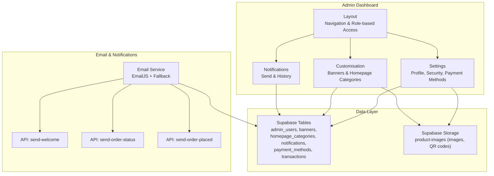
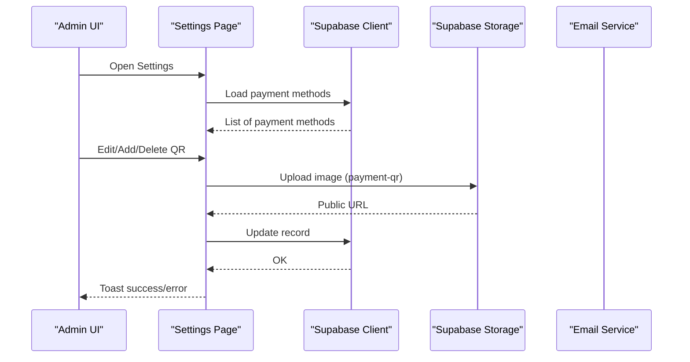
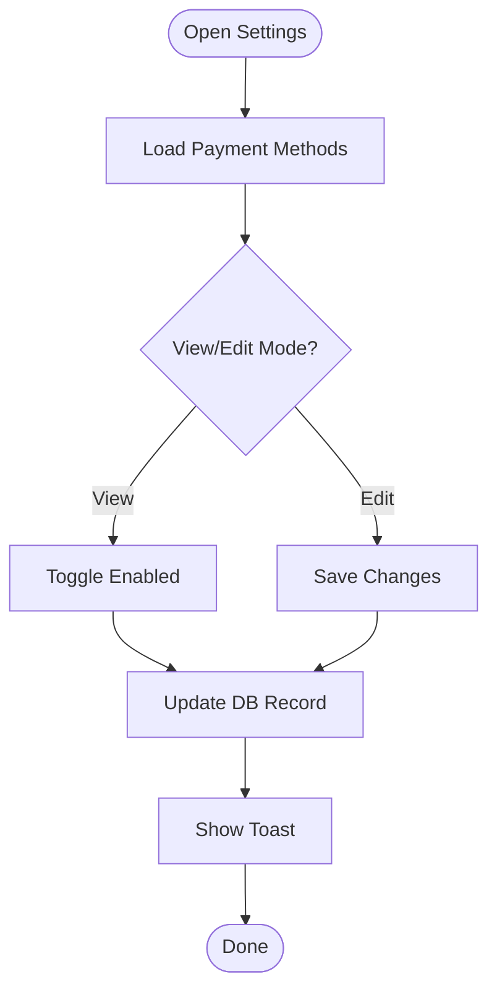
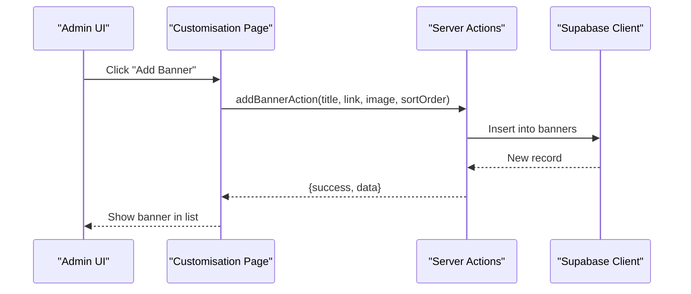
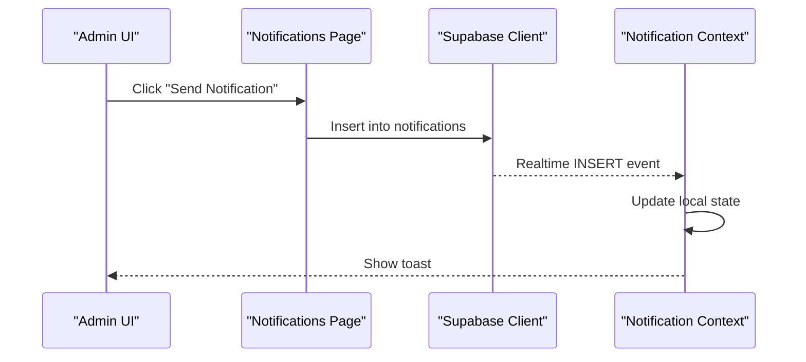
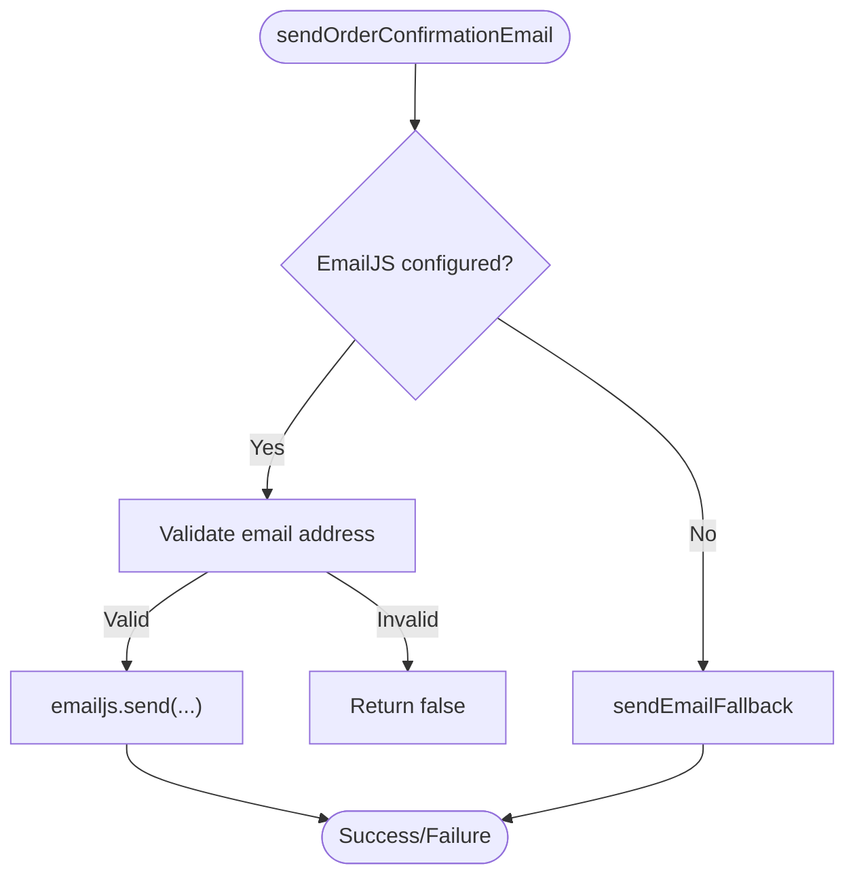
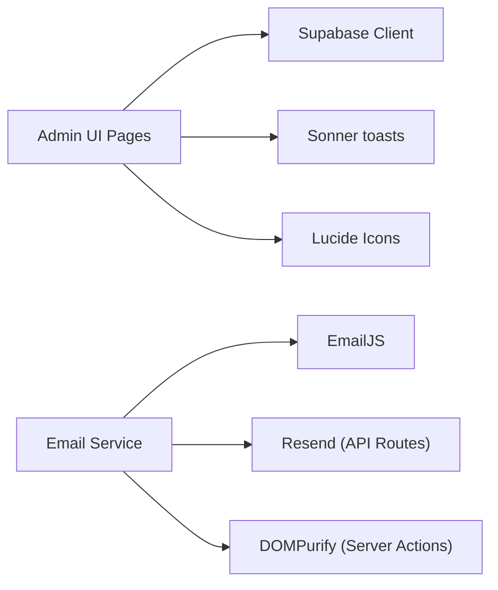

# Settings & Configuration

<cite>
**Referenced Files in This Document**
- [app/admin/dashboard/settings/page.tsx](file://app/admin/dashboard/settings/page.tsx)
- [app/admin/dashboard/customisation/page.tsx](file://app/admin/dashboard/customisation/page.tsx)
- [app/admin/dashboard/notifications/page.tsx](file://app/admin/dashboard/notifications/page.tsx)
- [app/actions/customisation.ts](file://app/actions/customisation.ts)
- [lib/email-service.ts](file://lib/email-service.ts)
- [lib/email-fallback.ts](file://lib/email-fallback.ts)
- [lib/notification-context.tsx](file://lib/notification-context.tsx)
- [lib/supabase.ts](file://lib/supabase.ts)
- [app/admin/dashboard/layout.tsx](file://app/admin/dashboard/layout.tsx)
- [app/api/send-welcome/route.ts](file://app/api/send-welcome/route.ts)
- [app/api/send-order-placed/route.ts](file://app/api/send-order-placed/route.ts)
- [app/api/send-order-status/route.ts](file://app/api/send-order-status/route.ts)
- [package.json](file://package.json)
</cite>

## Table of Contents
1. [Introduction](#introduction)
2. [Project Structure](#project-structure)
3. [Core Components](#core-components)
4. [Architecture Overview](#architecture-overview)
5. [Detailed Component Analysis](#detailed-component-analysis)
6. [Dependency Analysis](#dependency-analysis)
7. [Performance Considerations](#performance-considerations)
8. [Troubleshooting Guide](#troubleshooting-guide)
9. [Conclusion](#conclusion)

## Introduction
This document explains the settings and configuration system for the administrative interface, focusing on platform-wide configuration and customization. It covers:
- Platform configuration categories: branding settings, operational parameters, and email configuration
- Administrative workflows for managing banners, homepage categories, payment methods, and notifications
- Real-time updates, validation, and security considerations
- Practical examples and diagrams illustrating the settings interface and configuration workflows

## Project Structure
The administrative settings surface is organized under the admin dashboard with dedicated pages for:
- Settings (account and payment methods)
- Store Customisation (banners and homepage categories)
- Notifications (sending and history)

**Diagram sources**
- [app/admin/dashboard/layout.tsx:103-126](file://app/admin/dashboard/layout.tsx#L103-L126)
- [app/admin/dashboard/settings/page.tsx:28-76](file://app/admin/dashboard/settings/page.tsx#L28-L76)
- [app/admin/dashboard/customisation/page.tsx:39-63](file://app/admin/dashboard/customisation/page.tsx#L39-L63)
- [app/admin/dashboard/notifications/page.tsx:30-42](file://app/admin/dashboard/notifications/page.tsx#L30-L42)
- [lib/supabase.ts:10-187](file://lib/supabase.ts#L10-L187)
- [lib/email-service.ts:1-126](file://lib/email-service.ts#L1-L126)
- [app/api/send-welcome/route.ts:1-80](file://app/api/send-welcome/route.ts#L1-L80)
- [app/api/send-order-placed/route.ts:1-101](file://app/api/send-order-placed/route.ts#L1-L101)
- [app/api/send-order-status/route.ts:1-199](file://app/api/send-order-status/route.ts#L1-L199)

**Section sources**
- [app/admin/dashboard/layout.tsx:103-126](file://app/admin/dashboard/layout.tsx#L103-L126)
- [lib/supabase.ts:10-187](file://lib/supabase.ts#L10-L187)

## Core Components
- Settings page: Account profile management, password change, and payment method administration (enable/disable, edit, add/delete, QR upload).
- Customisation page: Manage homepage banners and homepage categories, including product selection and ordering.
- Notifications page: Send targeted or broadcast notifications and review history.
- Email service: Unified email dispatch with EmailJS and fallback mechanism.
- Supabase integration: Strongly typed database access and real-time channels for notifications.

**Section sources**
- [app/admin/dashboard/settings/page.tsx:28-737](file://app/admin/dashboard/settings/page.tsx#L28-L737)
- [app/admin/dashboard/customisation/page.tsx:39-486](file://app/admin/dashboard/customisation/page.tsx#L39-L486)
- [app/admin/dashboard/notifications/page.tsx:30-359](file://app/admin/dashboard/notifications/page.tsx#L30-L359)
- [lib/email-service.ts:1-126](file://lib/email-service.ts#L1-L126)
- [lib/supabase.ts:10-187](file://lib/supabase.ts#L10-L187)

## Architecture Overview
The settings system is a client-side admin UI backed by Supabase for persistence and real-time updates. Email operations are handled via a hybrid client/server approach with a fallback when EmailJS is not configured.

**Diagram sources**
- [app/admin/dashboard/settings/page.tsx:78-97](file://app/admin/dashboard/settings/page.tsx#L78-L97)
- [app/admin/dashboard/settings/page.tsx:270-305](file://app/admin/dashboard/settings/page.tsx#L270-L305)
- [app/admin/dashboard/settings/page.tsx:193-217](file://app/admin/dashboard/settings/page.tsx#L193-L217)

**Section sources**
- [app/admin/dashboard/settings/page.tsx:78-97](file://app/admin/dashboard/settings/page.tsx#L78-L97)
- [app/admin/dashboard/settings/page.tsx:270-305](file://app/admin/dashboard/settings/page.tsx#L270-L305)
- [app/admin/dashboard/settings/page.tsx:193-217](file://app/admin/dashboard/settings/page.tsx#L193-L217)

## Detailed Component Analysis

### Settings: Profile, Security, and Payment Methods
- Profile tab: Update admin name; email and role are displayed read-only.
- Security tab: Change password with client-side validation (match and length).
- Payment Methods tab (super admin only):
  - CRUD operations on payment methods
  - Enable/disable toggle
  - Inline editing with validation
  - QR upload to Supabase storage with image type check
  - Real-time UX feedback via toasts

**Diagram sources**
- [app/admin/dashboard/settings/page.tsx:166-181](file://app/admin/dashboard/settings/page.tsx#L166-L181)
- [app/admin/dashboard/settings/page.tsx:193-217](file://app/admin/dashboard/settings/page.tsx#L193-L217)

**Section sources**
- [app/admin/dashboard/settings/page.tsx:28-737](file://app/admin/dashboard/settings/page.tsx#L28-L737)

### Store Customisation: Banners and Homepage Categories
- Banners:
  - Add/edit/delete banners with image upload to Supabase storage
  - Toggle activation and re-order via drag-and-drop controls
  - Uses server actions for sanitization and insertion/update
- Homepage Categories:
  - Add/remove categories and toggle activation
  - Assign products to categories and reorder
  - Uses server actions for category management

**Diagram sources**
- [app/admin/dashboard/customisation/page.tsx:99-119](file://app/admin/dashboard/customisation/page.tsx#L99-L119)
- [app/actions/customisation.ts:15-33](file://app/actions/customisation.ts#L15-L33)

**Section sources**
- [app/admin/dashboard/customisation/page.tsx:39-486](file://app/admin/dashboard/customisation/page.tsx#L39-L486)
- [app/actions/customisation.ts:15-81](file://app/actions/customisation.ts#L15-L81)

### Notifications: Management and Real-time Delivery
- Send notifications:
  - Choose recipient (broadcast or specific user)
  - Select type (info, success, warning, error)
  - Submit and persist to notifications table
- Notification history:
  - View recent notifications with recipient and type badges
  - Delete individual notifications
- Real-time updates:
  - Supabase real-time channel listens for INSERT events
  - Local state updates and toast notifications dispatched

**Diagram sources**
- [app/admin/dashboard/notifications/page.tsx:83-127](file://app/admin/dashboard/notifications/page.tsx#L83-L127)
- [lib/notification-context.tsx:172-220](file://lib/notification-context.tsx#L172-L220)

**Section sources**
- [app/admin/dashboard/notifications/page.tsx:30-359](file://app/admin/dashboard/notifications/page.tsx#L30-L359)
- [lib/notification-context.tsx:172-220](file://lib/notification-context.tsx#L172-L220)

### Email Configuration and Operational Parameters
- EmailJS configuration:
  - Environment variables for service ID, template ID, and public key
  - Validation checks before sending; fallback to local fallback method when missing
- Operational parameters:
  - Welcome emails via API route using Resend
  - Order placement and status emails via separate API routes
  - Fallback logging for order confirmation emails

**Diagram sources**
- [lib/email-service.ts:75-125](file://lib/email-service.ts#L75-L125)
- [lib/email-fallback.ts:3-30](file://lib/email-fallback.ts#L3-L30)

**Section sources**
- [lib/email-service.ts:1-126](file://lib/email-service.ts#L1-L126)
- [lib/email-fallback.ts:1-31](file://lib/email-fallback.ts#L1-L31)
- [app/api/send-welcome/route.ts:1-80](file://app/api/send-welcome/route.ts#L1-L80)
- [app/api/send-order-placed/route.ts:1-101](file://app/api/send-order-placed/route.ts#L1-L101)
- [app/api/send-order-status/route.ts:1-199](file://app/api/send-order-status/route.ts#L1-L199)

## Dependency Analysis
- UI dependencies:
  - Radix UI primitives (Switch, Tabs, Select)
  - Sonner for toast notifications
  - Lucide icons for UI affordances
- Backend/data dependencies:
  - Supabase client for database and storage
  - EmailJS for browser-side email dispatch
  - Resend for server-side email sending
- Security and validation:
  - DOMPurify used in server actions for input sanitization
  - Client-side validation for password and QR uploads
  - Role-based navigation filtering

**Diagram sources**
- [package.json:11-38](file://package.json#L11-L38)
- [lib/email-service.ts:1-126](file://lib/email-service.ts#L1-L126)
- [app/actions/customisation.ts:4-4](file://app/actions/customisation.ts#L4-L4)

**Section sources**
- [package.json:11-38](file://package.json#L11-L38)
- [app/actions/customisation.ts:4-4](file://app/actions/customisation.ts#L4-L4)

## Performance Considerations
- Minimize network requests:
  - Batch updates where possible (e.g., category reordering uses atomic swaps and concurrent updates)
- Optimize rendering:
  - Use controlled components and avoid unnecessary re-renders
  - Debounce or throttle frequent updates (e.g., toggles)
- Storage uploads:
  - Validate file type early to prevent wasted uploads
  - Use cache-control headers for stored assets

## Troubleshooting Guide
- EmailJS not configured:
  - Symptom: Emails fall back to local fallback method
  - Resolution: Set NEXT_PUBLIC_EMAILJS_* environment variables and ensure template parameters are correct
- Invalid email address:
  - Symptom: Email functions return false and log errors
  - Resolution: Ensure valid email format before invoking email functions
- Supabase storage upload failures:
  - Symptom: Toast indicates upload failure
  - Resolution: Verify storage bucket permissions and file type constraints
- Unauthorized access to admin pages:
  - Symptom: Redirect to login or restricted navigation
  - Resolution: Confirm session validity and admin role in Supabase

**Section sources**
- [lib/email-service.ts:77-80](file://lib/email-service.ts#L77-L80)
- [lib/email-service.ts:82-86](file://lib/email-service.ts#L82-L86)
- [app/admin/dashboard/settings/page.tsx:277-280](file://app/admin/dashboard/settings/page.tsx#L277-L280)
- [app/admin/dashboard/layout.tsx:25-59](file://app/admin/dashboard/layout.tsx#L25-L59)

## Conclusion
The settings and configuration system provides a comprehensive administrative interface for platform-wide customization and operational controls. It integrates Supabase for persistence and real-time updates, EmailJS with a robust fallback for email operations, and a clear separation of concerns between UI, server actions, and API routes. Administrators can manage branding assets, operational parameters, and communication preferences with built-in validation and real-time feedback.