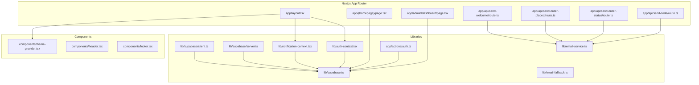
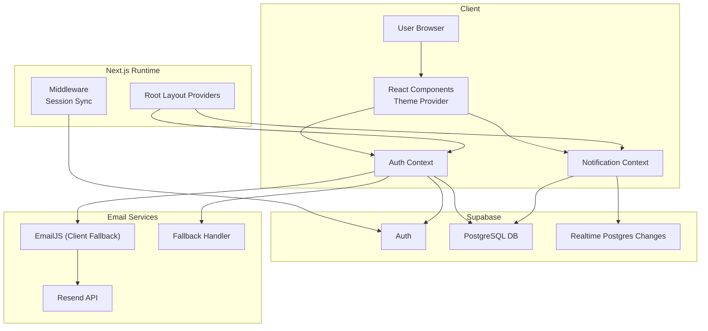
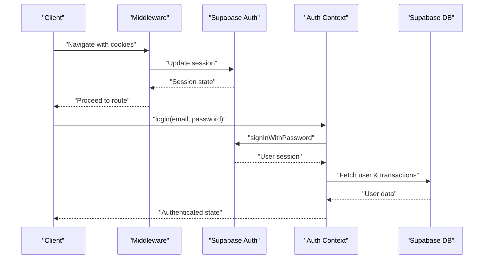
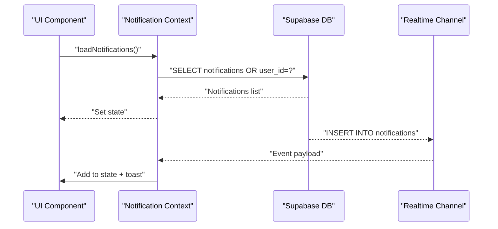
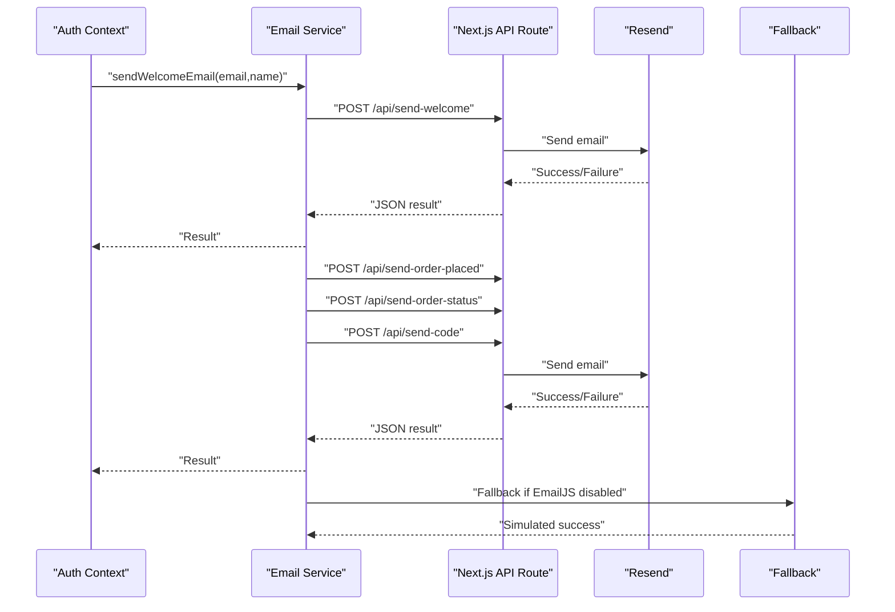
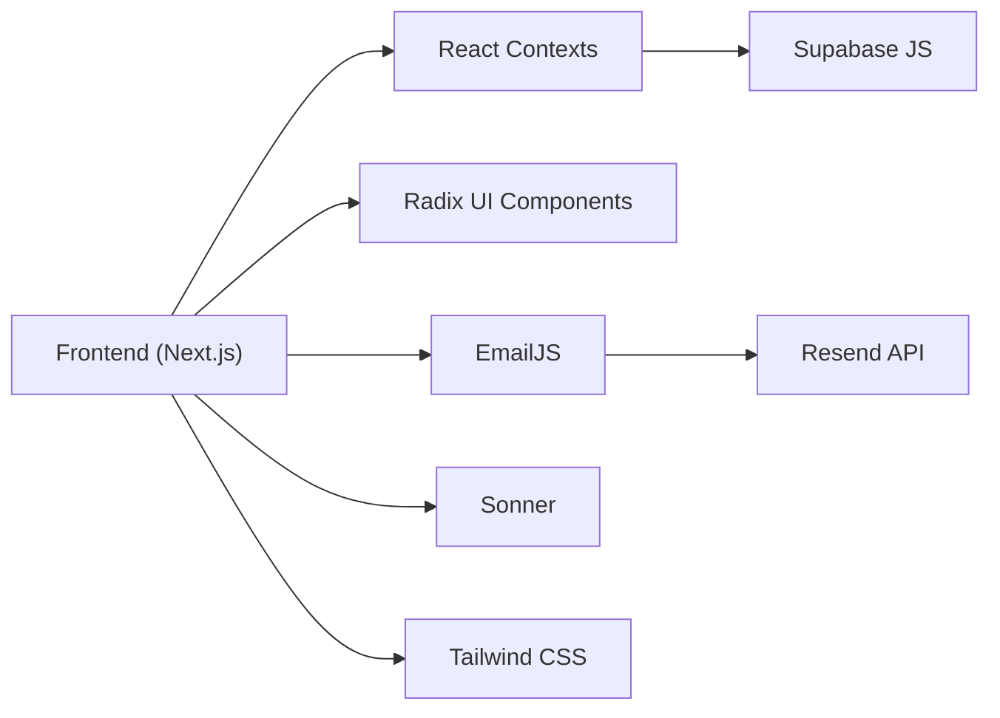

# Architecture Overview

<cite>
**Referenced Files in This Document**
- [README.md](file://README.md)
- [package.json](file://package.json)
- [app/layout.tsx](file://app/layout.tsx)
- [middleware.ts](file://middleware.ts)
- [lib/supabase.ts](file://lib/supabase.ts)
- [lib/supabase/client.ts](file://lib/supabase/client.ts)
- [lib/supabase/server.ts](file://lib/supabase/server.ts)
- [lib/auth-context.tsx](file://lib/auth-context.tsx)
- [lib/notification-context.tsx](file://lib/notification-context.tsx)
- [lib/email-service.ts](file://lib/email-service.ts)
- [lib/email-fallback.ts](file://lib/email-fallback.ts)
- [app/actions/auth.ts](file://app/actions/auth.ts)
- [app/api/send-welcome/route.ts](file://app/api/send-welcome/route.ts)
- [app/api/send-order-placed/route.ts](file://app/api/send-order-placed/route.ts)
- [app/api/send-order-status/route.ts](file://app/api/send-order-status/route.ts)
- [app/api/send-code/route.ts](file://app/api/send-code/route.ts)
- [components/theme-provider.tsx](file://components/theme-provider.tsx)
</cite>

## Table of Contents
1. [Introduction](#introduction)
2. [Project Structure](#project-structure)
3. [Core Components](#core-components)
4. [Architecture Overview](#architecture-overview)
5. [Detailed Component Analysis](#detailed-component-analysis)
6. [Dependency Analysis](#dependency-analysis)
7. [Performance Considerations](#performance-considerations)
8. [Troubleshooting Guide](#troubleshooting-guide)
9. [Conclusion](#conclusion)

## Introduction
Byiora is a digital game top-up and gift card platform for Nepal, emphasizing instant delivery, secure processing, and a modern TypeScript-based stack. The system leverages Next.js App Router with server-side rendering, React context providers for state management, and Supabase for authentication, database, and real-time capabilities. Email notifications are handled via serverless API endpoints using Resend, with graceful fallbacks.

High-level goals:
- Secure, instant delivery of digital goods
- Minimal friction checkout without mandatory registration
- Real-time user notifications and transaction status updates
- Scalable, serverless deployment on Vercel

**Section sources**
- [README.md:1-18](file://README.md#L1-L18)

## Project Structure
The project follows a feature-based structure under the Next.js App Router. Key areas:
- app/: Route handlers, pages, and API endpoints
- components/: Shared UI components and providers
- lib/: Utility libraries for Supabase clients, contexts, email, and helpers
- middleware.ts: Session synchronization for SSR
- app/layout.tsx: Root layout wrapping providers for auth and notifications



**Diagram sources**
- [app/layout.tsx:25-42](file://app/layout.tsx#L25-L42)
- [lib/supabase.ts:1-188](file://lib/supabase.ts#L1-L188)
- [lib/supabase/client.ts:1-10](file://lib/supabase/client.ts#L1-L10)
- [lib/supabase/server.ts:1-36](file://lib/supabase/server.ts#L1-L36)
- [lib/auth-context.tsx:1-374](file://lib/auth-context.tsx#L1-L374)
- [lib/notification-context.tsx:1-242](file://lib/notification-context.tsx#L1-L242)
- [lib/email-service.ts:1-126](file://lib/email-service.ts#L1-L126)
- [lib/email-fallback.ts:1-31](file://lib/email-fallback.ts#L1-L31)
- [app/actions/auth.ts:1-68](file://app/actions/auth.ts#L1-L68)
- [app/api/send-welcome/route.ts:1-69](file://app/api/send-welcome/route.ts#L1-L69)
- [app/api/send-order-placed/route.ts:1-90](file://app/api/send-order-placed/route.ts#L1-L90)
- [app/api/send-order-status/route.ts:1-188](file://app/api/send-order-status/route.ts#L1-L188)
- [app/api/send-code/route.ts:1-91](file://app/api/send-code/route.ts#L1-L91)

**Section sources**
- [package.json:1-51](file://package.json#L1-L51)
- [app/layout.tsx:25-42](file://app/layout.tsx#L25-L42)

## Core Components
- Authentication and session management via Supabase with server actions and SSR middleware
- React context providers for user state and notifications
- Supabase client abstractions for browser and server environments
- Email service with serverless API endpoints and fallback handling
- Theme provider for UI consistency

Key implementation references:
- Auth provider and hooks: [lib/auth-context.tsx:1-374](file://lib/auth-context.tsx#L1-L374)
- Notifications with real-time: [lib/notification-context.tsx:1-242](file://lib/notification-context.tsx#L1-L242)
- Supabase client creation: [lib/supabase/client.ts:1-10](file://lib/supabase/client.ts#L1-L10), [lib/supabase/server.ts:1-36](file://lib/supabase/server.ts#L1-L36)
- Email service and fallbacks: [lib/email-service.ts:1-126](file://lib/email-service.ts#L1-L126), [lib/email-fallback.ts:1-31](file://lib/email-fallback.ts#L1-L31)
- Root layout providers: [app/layout.tsx:25-42](file://app/layout.tsx#L25-L42)

**Section sources**
- [lib/auth-context.tsx:1-374](file://lib/auth-context.tsx#L1-L374)
- [lib/notification-context.tsx:1-242](file://lib/notification-context.tsx#L1-L242)
- [lib/supabase/client.ts:1-10](file://lib/supabase/client.ts#L1-L10)
- [lib/supabase/server.ts:1-36](file://lib/supabase/server.ts#L1-L36)
- [lib/email-service.ts:1-126](file://lib/email-service.ts#L1-L126)
- [lib/email-fallback.ts:1-31](file://lib/email-fallback.ts#L1-L31)
- [app/layout.tsx:25-42](file://app/layout.tsx#L25-L42)

## Architecture Overview
The system integrates the frontend, backend services, and external APIs as follows:



**Diagram sources**
- [app/layout.tsx:25-42](file://app/layout.tsx#L25-L42)
- [middleware.ts:1-11](file://middleware.ts#L1-L11)
- [lib/auth-context.tsx:1-374](file://lib/auth-context.tsx#L1-L374)
- [lib/notification-context.tsx:1-242](file://lib/notification-context.tsx#L1-L242)
- [lib/supabase.ts:1-188](file://lib/supabase.ts#L1-L188)
- [lib/email-service.ts:1-126](file://lib/email-service.ts#L1-L126)
- [lib/email-fallback.ts:1-31](file://lib/email-fallback.ts#L1-L31)
- [app/api/send-welcome/route.ts:1-69](file://app/api/send-welcome/route.ts#L1-L69)
- [app/api/send-order-placed/route.ts:1-90](file://app/api/send-order-placed/route.ts#L1-L90)
- [app/api/send-order-status/route.ts:1-188](file://app/api/send-order-status/route.ts#L1-L188)
- [app/api/send-code/route.ts:1-91](file://app/api/send-code/route.ts#L1-L91)

## Detailed Component Analysis

### Authentication and Session Management
- Server actions handle login, signup, and logout securely on the server
- Middleware synchronizes sessions across requests
- Auth context manages user state, transactions, and profile operations
- Supabase client abstractions enable safe browser/server usage



**Diagram sources**
- [middleware.ts:1-11](file://middleware.ts#L1-L11)
- [app/actions/auth.ts:1-68](file://app/actions/auth.ts#L1-L68)
- [lib/auth-context.tsx:129-163](file://lib/auth-context.tsx#L129-L163)
- [lib/supabase/client.ts:1-10](file://lib/supabase/client.ts#L1-L10)

**Section sources**
- [middleware.ts:1-11](file://middleware.ts#L1-L11)
- [app/actions/auth.ts:1-68](file://app/actions/auth.ts#L1-L68)
- [lib/auth-context.tsx:1-374](file://lib/auth-context.tsx#L1-L374)
- [lib/supabase/client.ts:1-10](file://lib/supabase/client.ts#L1-L10)
- [lib/supabase/server.ts:1-36](file://lib/supabase/server.ts#L1-L36)

### Notifications and Real-Time Updates
- Notification context loads and persists notifications
- Real-time listener subscribes to Supabase postgres_changes for live updates
- Toast notifications integrate with Sonner



**Diagram sources**
- [lib/notification-context.tsx:36-66](file://lib/notification-context.tsx#L36-L66)
- [lib/notification-context.tsx:172-220](file://lib/notification-context.tsx#L172-L220)

**Section sources**
- [lib/notification-context.tsx:1-242](file://lib/notification-context.tsx#L1-L242)

### Email Service Integration
- Client-side email service supports both EmailJS and serverless Resend fallback
- Serverless API endpoints handle welcome, order placed, order status, and gift card code delivery
- Sanitization and validation protect against injection and malformed data



**Diagram sources**
- [lib/email-service.ts:32-73](file://lib/email-service.ts#L32-L73)
- [lib/email-service.ts:75-125](file://lib/email-service.ts#L75-L125)
- [app/api/send-welcome/route.ts:1-69](file://app/api/send-welcome/route.ts#L1-L69)
- [app/api/send-order-placed/route.ts:1-90](file://app/api/send-order-placed/route.ts#L1-L90)
- [app/api/send-order-status/route.ts:1-188](file://app/api/send-order-status/route.ts#L1-L188)
- [app/api/send-code/route.ts:1-91](file://app/api/send-code/route.ts#L1-L91)
- [lib/email-fallback.ts:1-31](file://lib/email-fallback.ts#L1-L31)

**Section sources**
- [lib/email-service.ts:1-126](file://lib/email-service.ts#L1-L126)
- [lib/email-fallback.ts:1-31](file://lib/email-fallback.ts#L1-L31)
- [app/api/send-welcome/route.ts:1-69](file://app/api/send-welcome/route.ts#L1-L69)
- [app/api/send-order-placed/route.ts:1-90](file://app/api/send-order-placed/route.ts#L1-L90)
- [app/api/send-order-status/route.ts:1-188](file://app/api/send-order-status/route.ts#L1-L188)
- [app/api/send-code/route.ts:1-91](file://app/api/send-code/route.ts#L1-L91)

### Data Model Overview
The system relies on Supabase tables for users, admin users, products, payment settings, transactions, and notifications.

```mermaid
erDiagram
USERS {
string id PK
string email
string name
string created_at
string updated_at
}
ADMIN_USERS {
string id PK
string email
string password_hash
string name
enum role
enum status
string created_at
string updated_at
}
PRODUCTS {
string id PK
string name
string slug
string logo
enum category
string|text description
boolean is_active
boolean is_new
boolean has_update
json denominations
string created_at
string updated_at
}
PAYMENT_SETTINGS {
string id PK
string instructions
string esewa_qr
string khalti_qr
string imepay_qr
string mobile_banking_qr
string created_at
}
TRANSACTIONS {
string id PK
string user_id FK
string product_id FK
string product_name
string amount
string price
enum status
string payment_method
string transaction_id
string user_email
string created_at
string updated_at
}
NOTIFICATIONS {
string id PK
string title
string message
enum type
boolean is_read
string user_id FK
string created_at
}
USERS ||--o{ TRANSACTIONS : "has"
ADMIN_USERS ||--|| TRANSACTIONS : "admin"
PRODUCTS ||--o{ TRANSACTIONS : "referenced_by"
```

**Diagram sources**
- [lib/supabase.ts:10-187](file://lib/supabase.ts#L10-L187)

**Section sources**
- [lib/supabase.ts:1-188](file://lib/supabase.ts#L1-L188)

## Dependency Analysis
- Frontend runtime depends on React, Next.js, and Radix UI primitives
- Supabase SDKs for client/server and SSR utilities
- EmailJS for client-side templated emails with Resend as serverless fallback
- Tailwind CSS for styling and Sonner for toast notifications



**Diagram sources**
- [package.json:11-39](file://package.json#L11-L39)
- [lib/email-service.ts:1-126](file://lib/email-service.ts#L1-L126)
- [lib/notification-context.tsx:1-242](file://lib/notification-context.tsx#L1-L242)

**Section sources**
- [package.json:1-51](file://package.json#L1-L51)

## Performance Considerations
- Server-side rendering and static generation where appropriate reduce initial load times
- Supabase client abstractions minimize redundant network calls
- Real-time subscriptions are scoped to relevant channels and filtered on the client
- Email operations are offloaded to serverless endpoints to keep the client responsive
- Environment-specific configurations (URLs, keys) prevent unnecessary client-side secrets exposure

[No sources needed since this section provides general guidance]

## Troubleshooting Guide
Common issues and mitigations:
- Authentication failures: Verify Supabase credentials and environment variables; confirm middleware is active
- Email delivery errors: Check Resend API key and templates; fallback logs indicate EmailJS misconfiguration
- Real-time notifications not appearing: Confirm Supabase realtime channel subscription and table permissions
- Transaction status mismatches: Inspect server action flows and database triggers for status updates

**Section sources**
- [lib/email-service.ts:77-80](file://lib/email-service.ts#L77-L80)
- [lib/notification-context.tsx:172-220](file://lib/notification-context.tsx#L172-L220)
- [app/actions/auth.ts:16-22](file://app/actions/auth.ts#L16-L22)

## Conclusion
Byiora’s architecture balances modern frontend UX with robust backend services through Supabase and serverless APIs. TypeScript ensures type safety, Supabase provides authentication, database, and real-time features, while serverless email endpoints deliver timely notifications. The design is scalable on Vercel, with clear separation of concerns and strong cross-cutting security via Supabase Row Level Security and server-side validations.

[No sources needed since this section summarizes without analyzing specific files]