# Backend Services

<cite>
**Referenced Files in This Document**
- [supabase.ts](file://lib/supabase.ts)
- [email-service.ts](file://lib/email-service.ts)
- [email-fallback.ts](file://lib/email-fallback.ts)
- [middleware.ts](file://middleware.ts)
- [send-welcome route.ts](file://app/api/send-welcome/route.ts)
- [send-order-placed route.ts](file://app/api/send-order-placed/route.ts)
- [send-order-status route.ts](file://app/api/send-order-status/route.ts)
- [send-code route.ts](file://app/api/send-code/route.ts)
- [database-init.ts](file://lib/database-init.ts)
- [package.json](file://package.json)
</cite>

## Table of Contents
1. [Introduction](#introduction)
2. [Project Structure](#project-structure)
3. [Core Components](#core-components)
4. [Architecture Overview](#architecture-overview)
5. [Detailed Component Analysis](#detailed-component-analysis)
6. [Dependency Analysis](#dependency-analysis)
7. [Performance Considerations](#performance-considerations)
8. [Security Implementation](#security-implementation)
9. [Error Handling and Monitoring](#error-handling-and-monitoring)
10. [Troubleshooting Guide](#troubleshooting-guide)
11. [Conclusion](#conclusion)

## Introduction
This document describes the backend services architecture integrating Supabase and external email providers. It covers Supabase client configuration and database typing, dual-email service implementation using EmailJS and Resend with automatic fallback, middleware-based authentication guards, serverless API endpoints for email services and contact forms, and security measures including Row Level Security, JWT token handling, and CORS configuration. It also documents error handling strategies, retry mechanisms, and monitoring approaches.

## Project Structure
The backend is organized around:
- Supabase client and typed database models
- Email service utilities with fallback
- Next.js middleware for session management
- Serverless API routes for email operations
- Database initialization and health checks

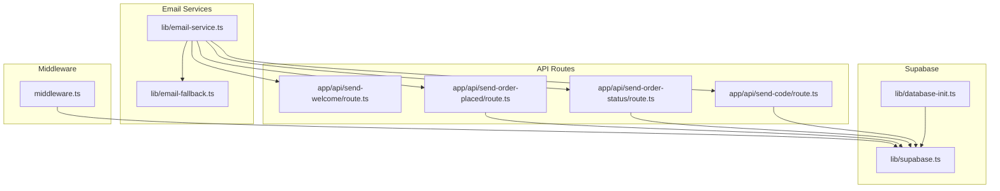

**Diagram sources**
- [middleware.ts:1-11](file://middleware.ts#L1-L11)
- [supabase.ts:1-188](file://lib/supabase.ts#L1-L188)
- [database-init.ts:1-164](file://lib/database-init.ts#L1-L164)
- [email-service.ts:1-126](file://lib/email-service.ts#L1-L126)
- [email-fallback.ts:1-31](file://lib/email-fallback.ts#L1-L31)
- [send-welcome route.ts:1-80](file://app/api/send-welcome/route.ts#L1-L80)
- [send-order-placed route.ts:1-101](file://app/api/send-order-placed/route.ts#L1-L101)
- [send-order-status route.ts:1-199](file://app/api/send-order-status/route.ts#L1-L199)
- [send-code route.ts:1-102](file://app/api/send-code/route.ts#L1-L102)

**Section sources**
- [supabase.ts:1-188](file://lib/supabase.ts#L1-L188)
- [email-service.ts:1-126](file://lib/email-service.ts#L1-L126)
- [email-fallback.ts:1-31](file://lib/email-fallback.ts#L1-L31)
- [middleware.ts:1-11](file://middleware.ts#L1-L11)
- [send-welcome route.ts:1-80](file://app/api/send-welcome/route.ts#L1-L80)
- [send-order-placed route.ts:1-101](file://app/api/send-order-placed/route.ts#L1-L101)
- [send-order-status route.ts:1-199](file://app/api/send-order-status/route.ts#L1-L199)
- [send-code route.ts:1-102](file://app/api/send-code/route.ts#L1-L102)
- [database-init.ts:1-164](file://lib/database-init.ts#L1-L164)
- [package.json:1-51](file://package.json#L1-L51)

## Core Components
- Supabase client and typed database models for type-safe database operations
- Email service orchestrating EmailJS and a fallback mechanism
- Middleware enforcing session-based authentication
- Serverless API routes for welcome emails, order notifications, and gift card delivery
- Database initialization and health-check utilities

**Section sources**
- [supabase.ts:1-188](file://lib/supabase.ts#L1-L188)
- [email-service.ts:1-126](file://lib/email-service.ts#L1-L126)
- [email-fallback.ts:1-31](file://lib/email-fallback.ts#L1-L31)
- [middleware.ts:1-11](file://middleware.ts#L1-L11)
- [send-welcome route.ts:1-80](file://app/api/send-welcome/route.ts#L1-L80)
- [send-order-placed route.ts:1-101](file://app/api/send-order-placed/route.ts#L1-L101)
- [send-order-status route.ts:1-199](file://app/api/send-order-status/route.ts#L1-L199)
- [send-code route.ts:1-102](file://app/api/send-code/route.ts#L1-L102)
- [database-init.ts:1-164](file://lib/database-init.ts#L1-L164)

## Architecture Overview
The backend integrates Supabase for authentication and data persistence, and external email providers (EmailJS and Resend) for transactional emails. Middleware ensures authenticated sessions for protected routes. Serverless API routes encapsulate email operations and enforce authorization policies.

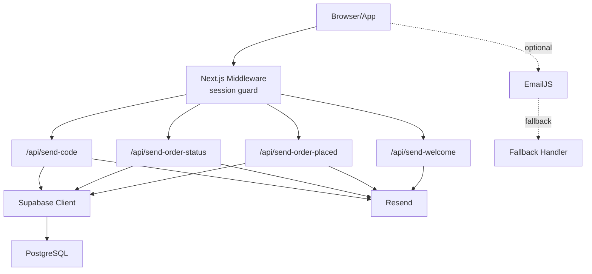

**Diagram sources**
- [middleware.ts:1-11](file://middleware.ts#L1-L11)
- [send-welcome route.ts:1-80](file://app/api/send-welcome/route.ts#L1-L80)
- [send-order-placed route.ts:1-101](file://app/api/send-order-placed/route.ts#L1-L101)
- [send-order-status route.ts:1-199](file://app/api/send-order-status/route.ts#L1-L199)
- [send-code route.ts:1-102](file://app/api/send-code/route.ts#L1-L102)
- [supabase.ts:1-188](file://lib/supabase.ts#L1-L188)
- [email-service.ts:1-126](file://lib/email-service.ts#L1-L126)
- [email-fallback.ts:1-31](file://lib/email-fallback.ts#L1-L31)

## Detailed Component Analysis

### Supabase Client and Typed Database Models
- Initializes a Supabase client using environment variables for URL and keys.
- Provides TypeScript interfaces for database tables to enable compile-time safety for reads, inserts, and updates.

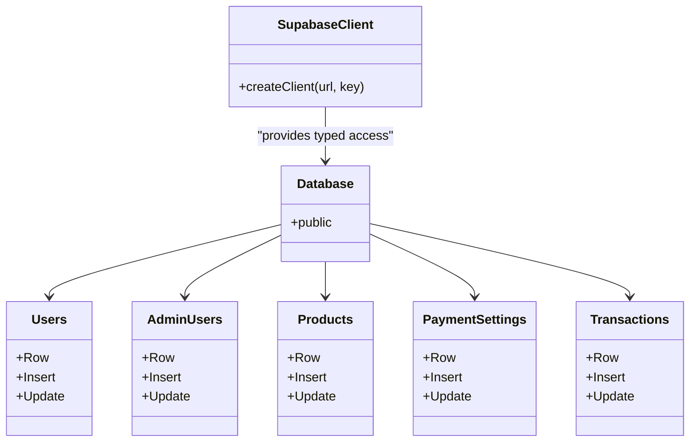

**Diagram sources**
- [supabase.ts:1-188](file://lib/supabase.ts#L1-L188)

**Section sources**
- [supabase.ts:1-188](file://lib/supabase.ts#L1-L188)

### Email Service Orchestration (EmailJS + Resend Fallback)
- Determines execution context (server vs client) to construct absolute URLs for API calls.
- Sends welcome emails via a dedicated API route.
- Attempts EmailJS first; falls back to a local fallback handler when EmailJS is not configured or fails.
- Validates email addresses and sanitizes HTML inputs to prevent injection.

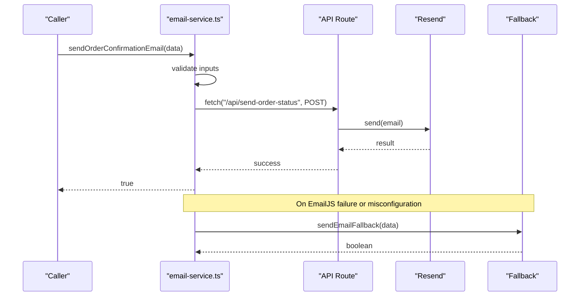

**Diagram sources**
- [email-service.ts:1-126](file://lib/email-service.ts#L1-L126)
- [email-fallback.ts:1-31](file://lib/email-fallback.ts#L1-L31)
- [send-order-status route.ts:1-199](file://app/api/send-order-status/route.ts#L1-L199)

**Section sources**
- [email-service.ts:1-126](file://lib/email-service.ts#L1-L126)
- [email-fallback.ts:1-31](file://lib/email-fallback.ts#L1-L31)

### Middleware Authentication Guard
- Wraps incoming requests to update session state.
- Applies a matcher excluding static assets and API routes, ensuring session hydration for pages.

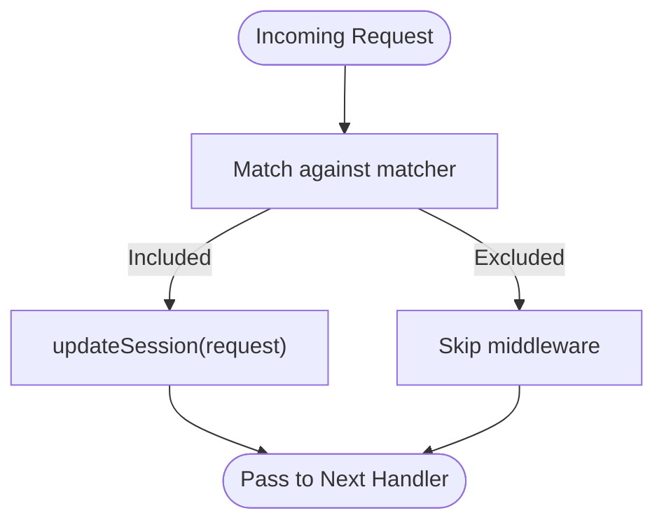

**Diagram sources**
- [middleware.ts:1-11](file://middleware.ts#L1-L11)

**Section sources**
- [middleware.ts:1-11](file://middleware.ts#L1-L11)

### Serverless API Endpoints

#### Welcome Email Endpoint
- Validates presence of email.
- Sanitizes user-provided name.
- Sends HTML email via Resend.

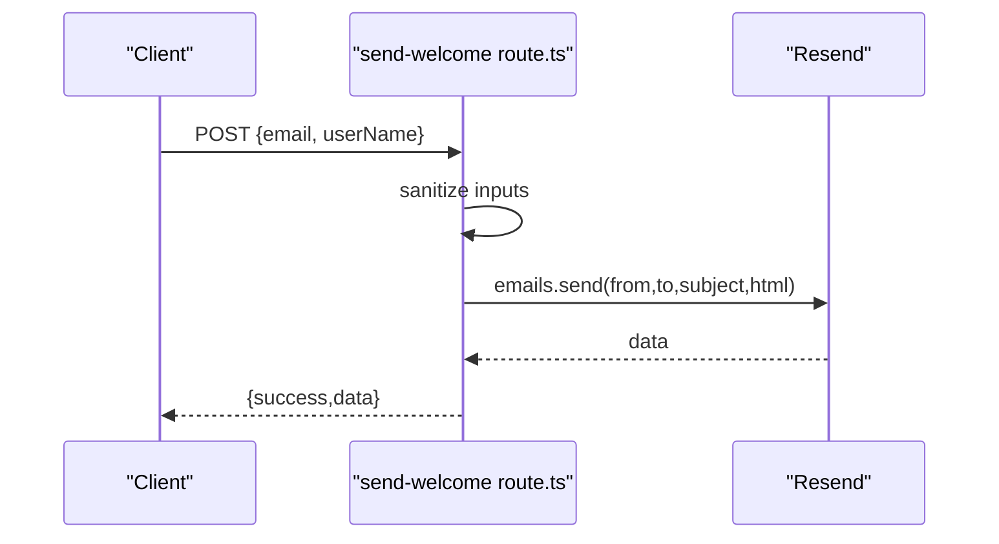

**Diagram sources**
- [send-welcome route.ts:1-80](file://app/api/send-welcome/route.ts#L1-L80)

**Section sources**
- [send-welcome route.ts:1-80](file://app/api/send-welcome/route.ts#L1-L80)

#### Order Placed Notification
- Authenticates user via Supabase.
- Enforces ownership: requestor must match email.
- Builds HTML email and sends via Resend.

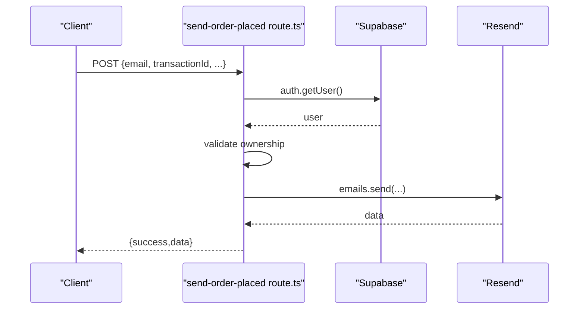

**Diagram sources**
- [send-order-placed route.ts:1-101](file://app/api/send-order-placed/route.ts#L1-L101)
- [supabase.ts:1-188](file://lib/supabase.ts#L1-L188)

**Section sources**
- [send-order-placed route.ts:1-101](file://app/api/send-order-placed/route.ts#L1-L101)

#### Order Status Notification (Admin-Only)
- Requires authenticated user.
- Confirms admin role via admin_users lookup.
- Sends either success or failure templates based on status.

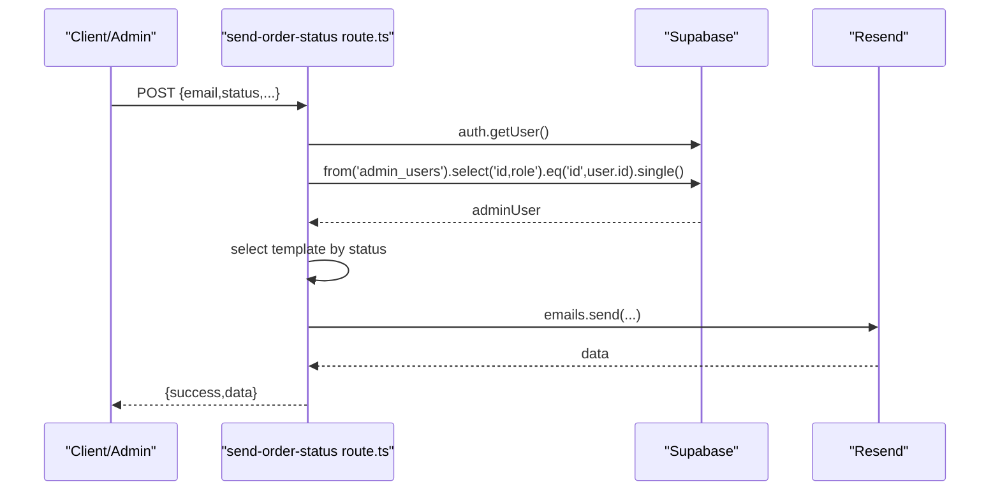

**Diagram sources**
- [send-order-status route.ts:1-199](file://app/api/send-order-status/route.ts#L1-L199)
- [supabase.ts:1-188](file://lib/supabase.ts#L1-L188)

**Section sources**
- [send-order-status route.ts:1-199](file://app/api/send-order-status/route.ts#L1-L199)

#### Gift Card Code Delivery
- Authenticates user.
- Enforces ownership or admin privileges to send on behalf of others.
- Sends HTML email containing gift card code.

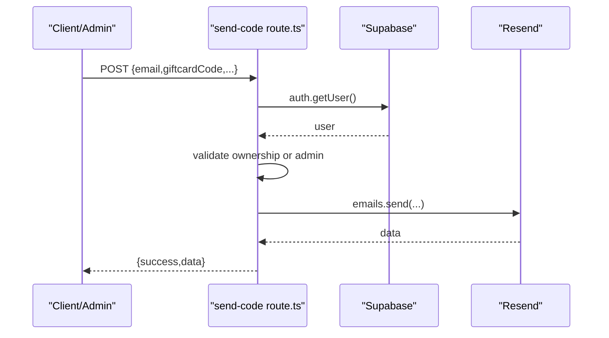

**Diagram sources**
- [send-code route.ts:1-102](file://app/api/send-code/route.ts#L1-L102)
- [supabase.ts:1-188](file://lib/supabase.ts#L1-L188)

**Section sources**
- [send-code route.ts:1-102](file://app/api/send-code/route.ts#L1-L102)

### Database Initialization and Health Checks
- Validates environment configuration for Supabase.
- Tests connectivity and table existence.
- Reports whether tables exist and whether data is present.
- Provides operation tests across key tables.

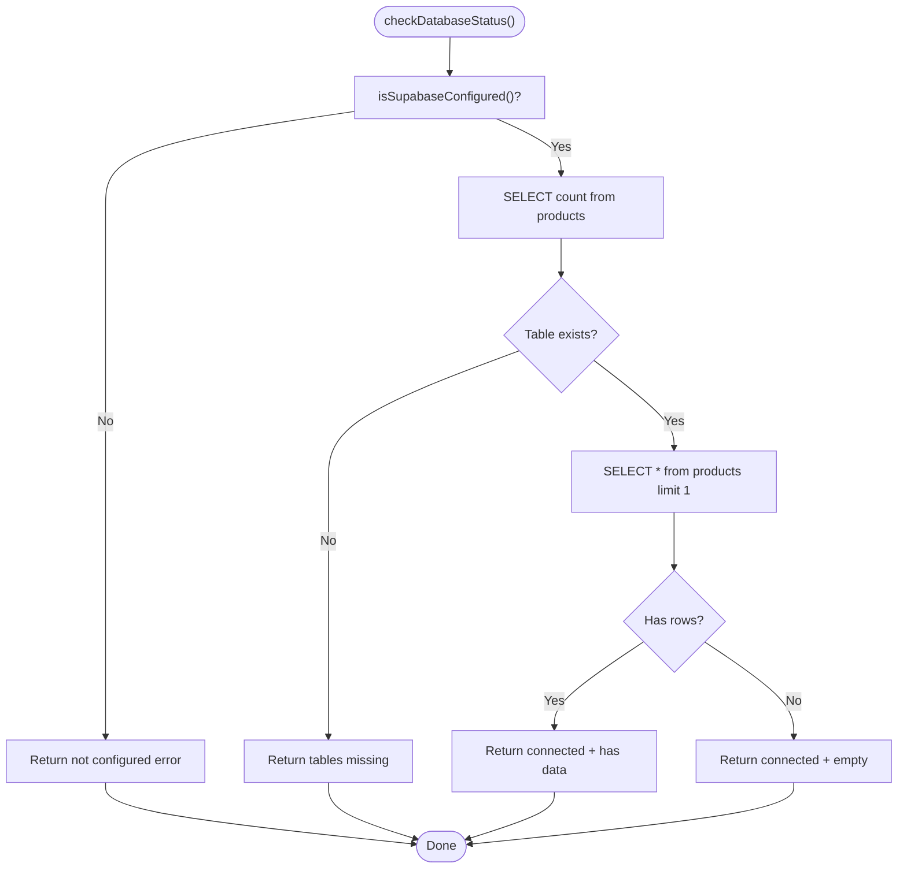

**Diagram sources**
- [database-init.ts:1-164](file://lib/database-init.ts#L1-L164)

**Section sources**
- [database-init.ts:1-164](file://lib/database-init.ts#L1-L164)

## Dependency Analysis
External dependencies relevant to backend services:
- Supabase client and server-side utilities for authentication and database access
- Resend SDK for transactional emails
- EmailJS browser library for client-side email orchestration with fallback

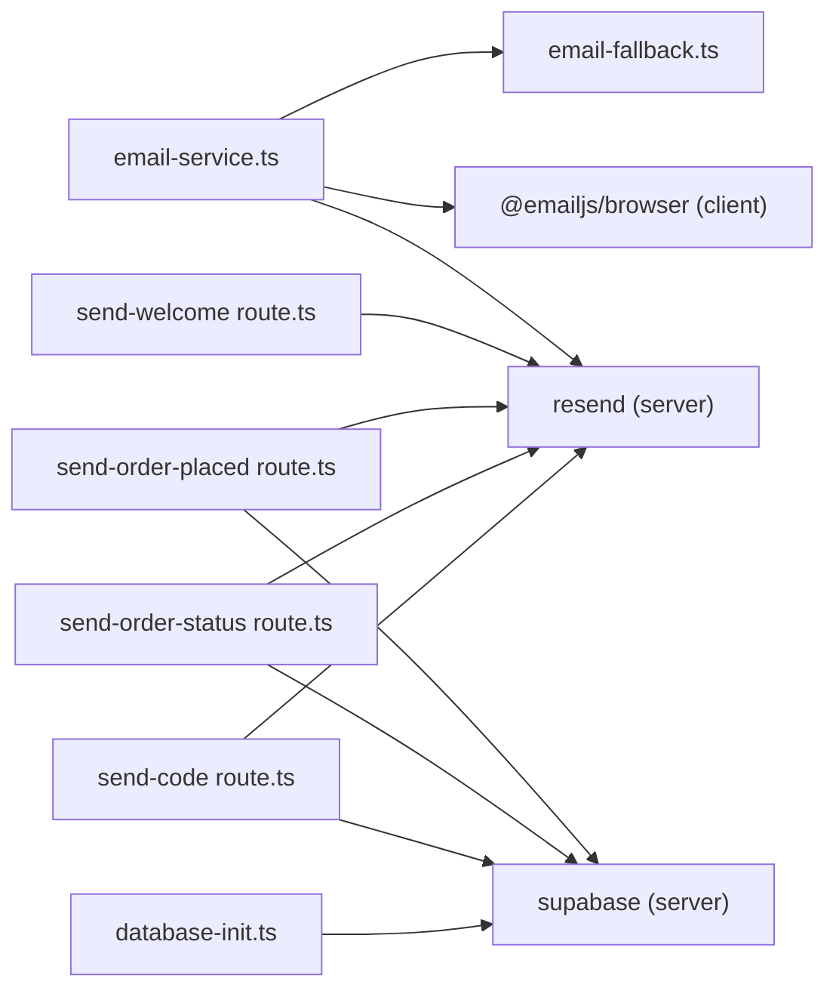

**Diagram sources**
- [email-service.ts:1-126](file://lib/email-service.ts#L1-L126)
- [email-fallback.ts:1-31](file://lib/email-fallback.ts#L1-L31)
- [send-welcome route.ts:1-80](file://app/api/send-welcome/route.ts#L1-L80)
- [send-order-placed route.ts:1-101](file://app/api/send-order-placed/route.ts#L1-L101)
- [send-order-status route.ts:1-199](file://app/api/send-order-status/route.ts#L1-L199)
- [send-code route.ts:1-102](file://app/api/send-code/route.ts#L1-L102)
- [supabase.ts:1-188](file://lib/supabase.ts#L1-L188)
- [database-init.ts:1-164](file://lib/database-init.ts#L1-L164)

**Section sources**
- [package.json:1-51](file://package.json#L1-L51)
- [email-service.ts:1-126](file://lib/email-service.ts#L1-L126)
- [email-fallback.ts:1-31](file://lib/email-fallback.ts#L1-L31)
- [send-welcome route.ts:1-80](file://app/api/send-welcome/route.ts#L1-L80)
- [send-order-placed route.ts:1-101](file://app/api/send-order-placed/route.ts#L1-L101)
- [send-order-status route.ts:1-199](file://app/api/send-order-status/route.ts#L1-L199)
- [send-code route.ts:1-102](file://app/api/send-code/route.ts#L1-L102)
- [supabase.ts:1-188](file://lib/supabase.ts#L1-L188)
- [database-init.ts:1-164](file://lib/database-init.ts#L1-L164)

## Performance Considerations
- Minimize synchronous work in API routes; rely on external providers for heavy lifting.
- Cache frequently accessed configuration values (e.g., environment variables) at module load time.
- Use streaming or pagination for large dataset reads; avoid unnecessary SELECT * queries.
- Offload email sending to Resend to reduce server latency.
- Consider rate limiting for email endpoints to prevent abuse.

## Security Implementation
- Authentication Guards:
  - Middleware enforces session updates for non-API routes.
  - API routes authenticate users via Supabase and enforce ownership/admin checks.
- Authorization:
  - Order status endpoint restricts access to admin users.
  - Gift card code endpoint allows sending on behalf of others only for admins.
- Data Integrity:
  - Sanitize HTML inputs to mitigate injection risks.
- Secrets Management:
  - Environment variables for Supabase keys, EmailJS credentials, and Resend API key are loaded from process environment.
- CORS:
  - Configure CORS at the platform level (e.g., Vercel) to allow only trusted origins for API routes.

**Section sources**
- [middleware.ts:1-11](file://middleware.ts#L1-L11)
- [send-order-placed route.ts:1-101](file://app/api/send-order-placed/route.ts#L1-L101)
- [send-order-status route.ts:1-199](file://app/api/send-order-status/route.ts#L1-L199)
- [send-code route.ts:1-102](file://app/api/send-code/route.ts#L1-L102)

## Error Handling and Monitoring
- Centralized error logging:
  - API routes log errors and return structured JSON responses with appropriate HTTP status codes.
  - Email service logs failures and attempts fallback mechanisms.
- Retry and Fallback:
  - EmailJS failures trigger immediate fallback to local handler.
- Health Monitoring:
  - Use database initialization utilities to report connectivity and table status.
  - Monitor API response times and error rates via platform analytics.

**Section sources**
- [send-welcome route.ts:1-80](file://app/api/send-welcome/route.ts#L1-L80)
- [send-order-placed route.ts:1-101](file://app/api/send-order-placed/route.ts#L1-L101)
- [send-order-status route.ts:1-199](file://app/api/send-order-status/route.ts#L1-L199)
- [send-code route.ts:1-102](file://app/api/send-code/route.ts#L1-L102)
- [email-service.ts:1-126](file://lib/email-service.ts#L1-L126)
- [email-fallback.ts:1-31](file://lib/email-fallback.ts#L1-L31)
- [database-init.ts:1-164](file://lib/database-init.ts#L1-L164)

## Troubleshooting Guide
- Supabase Not Configured:
  - Verify environment variables for Supabase URL and keys are set.
  - Use database status checks to confirm connectivity and table existence.
- Unauthorized Access:
  - Ensure users are authenticated and that ownership/admin checks pass in protected routes.
- Email Delivery Issues:
  - Confirm EmailJS environment variables are set; otherwise, fallback will be used.
  - Review API route error logs for Resend failures.
- Database Initialization:
  - Run seed scripts if tables are missing; initialize database only when tables exist and data is empty.

**Section sources**
- [database-init.ts:1-164](file://lib/database-init.ts#L1-L164)
- [send-order-placed route.ts:1-101](file://app/api/send-order-placed/route.ts#L1-L101)
- [send-order-status route.ts:1-199](file://app/api/send-order-status/route.ts#L1-L199)
- [send-code route.ts:1-102](file://app/api/send-code/route.ts#L1-L102)
- [email-service.ts:1-126](file://lib/email-service.ts#L1-L126)

## Conclusion
The backend leverages Supabase for robust authentication and data operations, integrates Resend for reliable email delivery, and implements a fallback strategy for resilience. Middleware-based session guards protect routes, while strict authorization rules govern sensitive operations. Health checks and centralized error logging support ongoing reliability and monitoring.