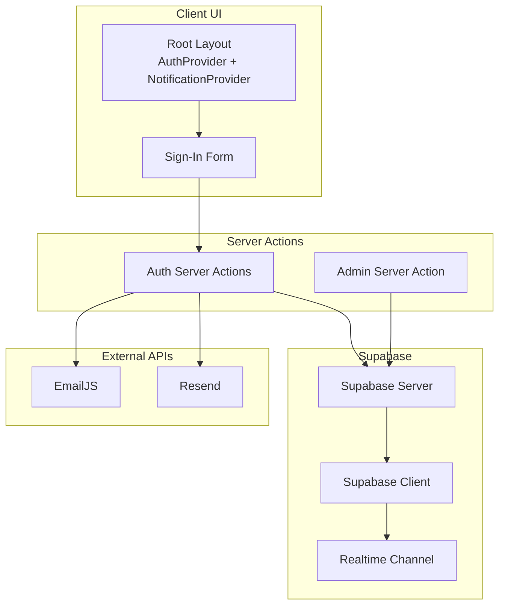
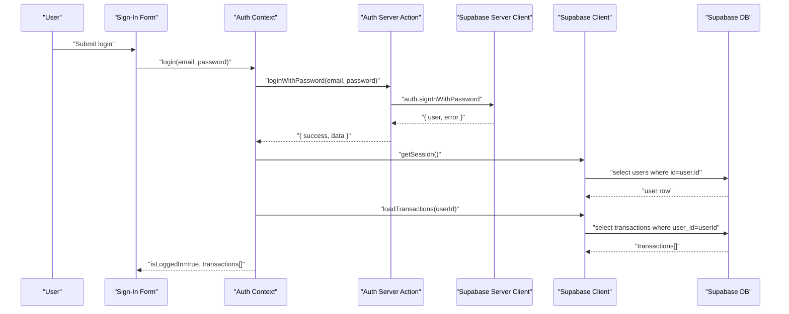
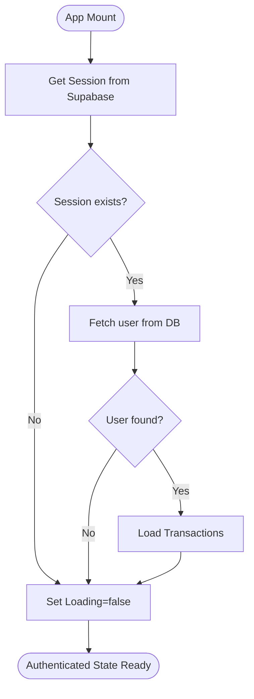
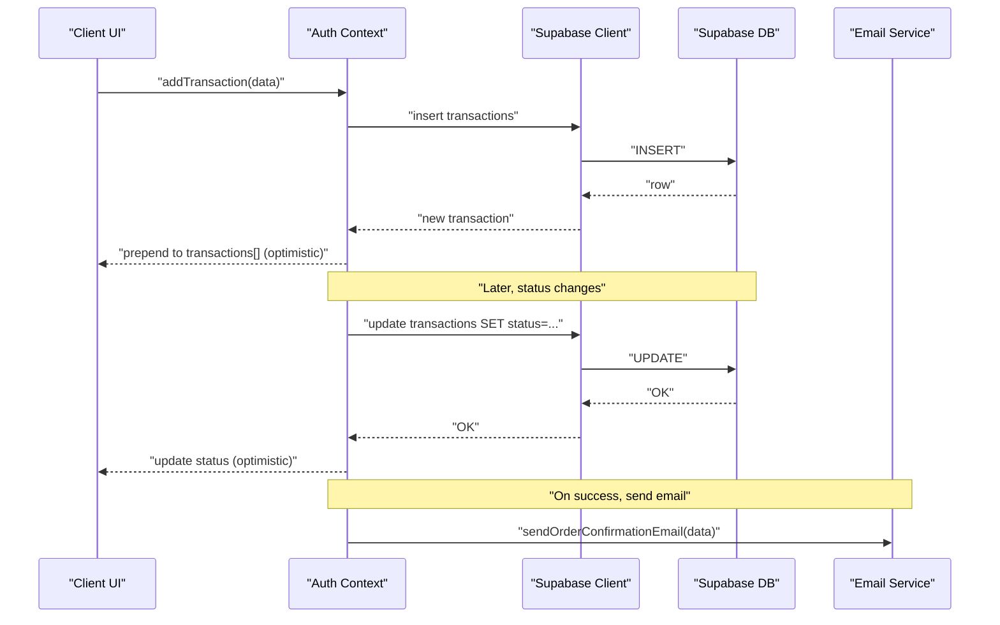
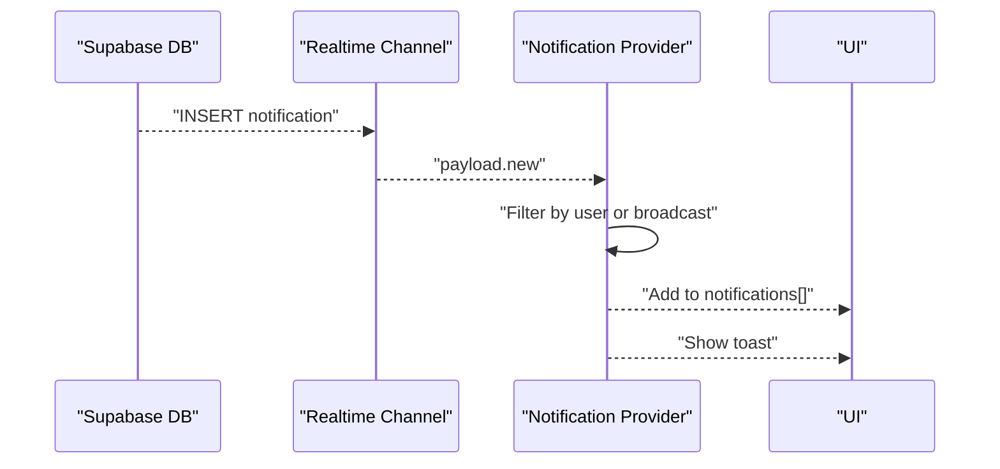
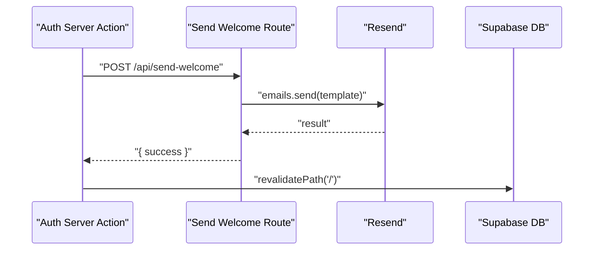
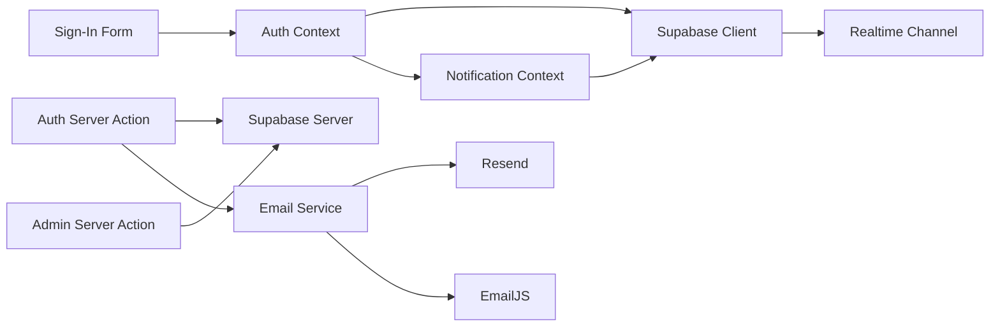

# Data Flow Patterns

<cite>
**Referenced Files in This Document**
- [auth-context.tsx](file://lib/auth-context.tsx)
- [supabase.ts](file://lib/supabase.ts)
- [notification-context.tsx](file://lib/notification-context.tsx)
- [auth.ts](file://app/actions/auth.ts)
- [admin.ts](file://app/actions/admin.ts)
- [middleware.ts](file://middleware.ts)
- [email-service.ts](file://lib/email-service.ts)
- [send-welcome route.ts](file://app/api/send-welcome/route.ts)
- [send-order-placed route.ts](file://app/api/send-order-placed/route.ts)
- [sign-in-form.tsx](file://components/sign-in-form.tsx)
- [layout.tsx](file://app/layout.tsx)
- [client.ts](file://lib/supabase/client.ts)
- [server.ts](file://lib/supabase/server.ts)
</cite>

## Table of Contents
1. [Introduction](#introduction)
2. [Project Structure](#project-structure)
3. [Core Components](#core-components)
4. [Architecture Overview](#architecture-overview)
5. [Detailed Component Analysis](#detailed-component-analysis)
6. [Dependency Analysis](#dependency-analysis)
7. [Performance Considerations](#performance-considerations)
8. [Troubleshooting Guide](#troubleshooting-guide)
9. [Conclusion](#conclusion)

## Introduction
This document explains the data flow patterns across the Byiora application. It focuses on:
- Unidirectional data flow from user interactions through context providers to database operations and external API calls
- Authentication data flow: login state propagation, session management, and protected route access
- Transaction data flow: from purchase initiation through payment processing to email notifications
- Real-time data synchronization with Supabase, optimistic updates, and conflict resolution strategies
- Validation pipelines, error propagation, and caching strategies

## Project Structure
The application is a Next.js app with a client-side React UI and server actions. Supabase provides authentication, real-time, and database capabilities. Email notifications are handled via EmailJS and Resend, with graceful fallbacks.

**Diagram sources**
- [layout.tsx:25-42](file://app/layout.tsx#L25-L42)
- [sign-in-form.tsx:18-82](file://components/sign-in-form.tsx#L18-L82)
- [auth.ts:8-67](file://app/actions/auth.ts#L8-L67)
- [admin.ts:10-34](file://app/actions/admin.ts#L10-L34)
- [client.ts:4-9](file://lib/supabase/client.ts#L4-L9)
- [server.ts:5-35](file://lib/supabase/server.ts#L5-L35)
- [email-service.ts:32-73](file://lib/email-service.ts#L32-L73)
- [send-welcome route.ts:18-79](file://app/api/send-welcome/route.ts#L18-L79)
- [send-order-placed route.ts:19-100](file://app/api/send-order-placed/route.ts#L19-L100)

**Section sources**
- [layout.tsx:25-42](file://app/layout.tsx#L25-L42)
- [middleware.ts:4-10](file://middleware.ts#L4-L10)

## Core Components
- Authentication Context: Provides user state, transactions, login/signup/logout, profile updates, and transaction CRUD with optimistic UI updates.
- Notification Context: Manages notifications, real-time updates, and persistence via Supabase.
- Supabase Clients: Browser and server clients for database and auth operations.
- Server Actions: Encapsulate server-side auth and admin operations, with revalidation and redirects.
- Email Services: Unified client/server-friendly email dispatch with fallbacks.

**Section sources**
- [auth-context.tsx:51-365](file://lib/auth-context.tsx#L51-L365)
- [notification-context.tsx:29-233](file://lib/notification-context.tsx#L29-L233)
- [supabase.ts:10-187](file://lib/supabase.ts#L10-L187)
- [auth.ts:8-67](file://app/actions/auth.ts#L8-L67)
- [email-service.ts:32-125](file://lib/email-service.ts#L32-L125)

## Architecture Overview
The system follows a unidirectional data flow:
- UI triggers actions via client components
- Client invokes server actions for sensitive operations
- Server actions use Supabase server client for auth and DB
- Client context providers update local state and persist to Supabase
- Real-time channels keep UI synchronized
- External APIs (EmailJS/Resend) are invoked from server actions or client helpers

**Diagram sources**
- [sign-in-form.tsx:27-45](file://components/sign-in-form.tsx#L27-L45)
- [auth-context.tsx:129-163](file://lib/auth-context.tsx#L129-L163)
- [auth.ts:8-23](file://app/actions/auth.ts#L8-L23)
- [client.ts:4-9](file://lib/supabase/client.ts#L4-L9)
- [server.ts:5-35](file://lib/supabase/server.ts#L5-L35)

## Detailed Component Analysis

### Authentication Data Flow
- Initialization: On mount, the Auth Provider retrieves the session, verifies the user in the DB, loads transactions, and sets loading state.
- Login: Client calls server action to authenticate; on success, it fetches user and transactions from Supabase and updates context.
- Signup: Server action creates the Supabase auth user, inserts a profile, optionally sends a welcome email, then logs the user in.
- Logout: Clears context state and signs out via server action.
- Protected routes: Middleware updates sessions for all requests except static assets and API routes.

**Diagram sources**
- [auth-context.tsx:56-92](file://lib/auth-context.tsx#L56-L92)
- [auth.ts:8-23](file://app/actions/auth.ts#L8-L23)

**Section sources**
- [auth-context.tsx:56-92](file://lib/auth-context.tsx#L56-L92)
- [auth.ts:8-67](file://app/actions/auth.ts#L8-L67)
- [middleware.ts:4-10](file://middleware.ts#L4-L10)

### Transaction Data Flow
- Purchase initiation: Client collects product/payment info and calls context addTransaction. It generates a transactionId and inserts into the transactions table.
- Optimistic update: The UI immediately prepends the new transaction to the list while the DB operation completes.
- Status updates: Server action updates transaction status in DB; context updates local state optimistically.
- Conflict resolution: If a DB constraint occurs (e.g., missing optional field), the context retries without that field and updates state accordingly.
- Email notifications: Server action sends order emails via EmailJS/Resend; client helper supports fallback.

**Diagram sources**
- [auth-context.tsx:240-323](file://lib/auth-context.tsx#L240-L323)
- [auth-context.tsx:325-344](file://lib/auth-context.tsx#L325-L344)
- [email-service.ts:75-125](file://lib/email-service.ts#L75-L125)

**Section sources**
- [auth-context.tsx:240-344](file://lib/auth-context.tsx#L240-L344)
- [email-service.ts:75-125](file://lib/email-service.ts#L75-L125)

### Real-Time Data Synchronization and Notifications
- Real-time channel: The Notification Provider subscribes to INSERT events on the notifications table and adds matching notifications to local state.
- Local state management: Notifications are stored in context, with read/unread toggles persisted to DB and reflected locally.
- Broadcast vs user-specific: Queries and subscriptions filter by user or broadcast targets.

**Diagram sources**
- [notification-context.tsx:172-220](file://lib/notification-context.tsx#L172-L220)

**Section sources**
- [notification-context.tsx:36-118](file://lib/notification-context.tsx#L36-L118)
- [notification-context.tsx:172-220](file://lib/notification-context.tsx#L172-L220)

### Email Delivery Pipeline
- Welcome email: Sent from server action after successful signup; uses Resend with sanitized HTML templates.
- Order confirmation: Client helper posts to a server route that validates user and sends an email via Resend.
- Fallback: If EmailJS is not configured, the helper attempts a fallback transport.

**Diagram sources**
- [auth.ts:47-55](file://app/actions/auth.ts#L47-L55)
- [send-welcome route.ts:18-79](file://app/api/send-welcome/route.ts#L18-L79)

**Section sources**
- [auth.ts:47-55](file://app/actions/auth.ts#L47-L55)
- [send-welcome route.ts:18-79](file://app/api/send-welcome/route.ts#L18-L79)
- [email-service.ts:32-73](file://lib/email-service.ts#L32-L73)

### Admin Operations
- Deletion: Server action deletes an admin user from the admin_users table and revalidates the admin dashboard path.

**Section sources**
- [admin.ts:10-34](file://app/actions/admin.ts#L10-L34)

## Dependency Analysis
- Context-to-Supabase: Auth and Notification contexts use browser client for DB queries and real-time.
- Server Actions-to-Supabase: Use server client with cookie store for session-aware operations.
- UI-to-Context: Components depend on context hooks for state and mutations.
- External APIs: Email dispatch depends on EmailJS and Resend; fallback ensures resilience.

**Diagram sources**
- [sign-in-form.tsx:25-25](file://components/sign-in-form.tsx#L25-L25)
- [auth-context.tsx:347-364](file://lib/auth-context.tsx#L347-L364)
- [notification-context.tsx:222-230](file://lib/notification-context.tsx#L222-L230)
- [auth.ts:8-67](file://app/actions/auth.ts#L8-L67)
- [admin.ts:10-34](file://app/actions/admin.ts#L10-L34)
- [client.ts:4-9](file://lib/supabase/client.ts#L4-L9)
- [server.ts:5-35](file://lib/supabase/server.ts#L5-L35)
- [email-service.ts:32-125](file://lib/email-service.ts#L32-L125)

**Section sources**
- [supabase.ts:10-187](file://lib/supabase.ts#L10-L187)
- [client.ts:4-9](file://lib/supabase/client.ts#L4-L9)
- [server.ts:5-35](file://lib/supabase/server.ts#L5-L35)

## Performance Considerations
- Optimistic UI updates: Prepend new transactions and mark notifications as read immediately to reduce perceived latency.
- Minimal re-renders: Use callbacks and memoization in context providers to avoid unnecessary updates.
- Selective revalidation: Server actions revalidate only affected paths to minimize cache invalidation overhead.
- Real-time efficiency: Subscribe to targeted tables and rows; filter in queries to limit payload.
- Email batching: Consolidate email operations where feasible; rely on fallback to prevent single points of failure.

## Troubleshooting Guide
- Authentication failures:
  - Verify Supabase credentials and session cookie handling.
  - Check server action error serialization and toast feedback.
- Transaction insertion errors:
  - Inspect constraint handling and retry logic for optional fields.
  - Confirm transactionId uniqueness and status transitions.
- Real-time notifications:
  - Ensure channel subscription is active and filtered by user or broadcast.
  - Validate payload presence and deduplication logic.
- Email delivery:
  - Confirm EmailJS/Resend keys and template IDs.
  - Review fallback behavior and error logging.
- Protected routes:
  - Confirm middleware matcher excludes static assets and API routes.
  - Validate session updates and redirect paths.

**Section sources**
- [auth-context.tsx:282-292](file://lib/auth-context.tsx#L282-L292)
- [notification-context.tsx:172-220](file://lib/notification-context.tsx#L172-L220)
- [email-service.ts:77-124](file://lib/email-service.ts#L77-L124)
- [middleware.ts:8-10](file://middleware.ts#L8-L10)

## Conclusion
Byiora’s data flow emphasizes unidirectional updates, resilient external integrations, and real-time synchronization. Authentication, transactions, and notifications are coordinated through context providers and server actions, ensuring predictable state transitions and robust user experiences.