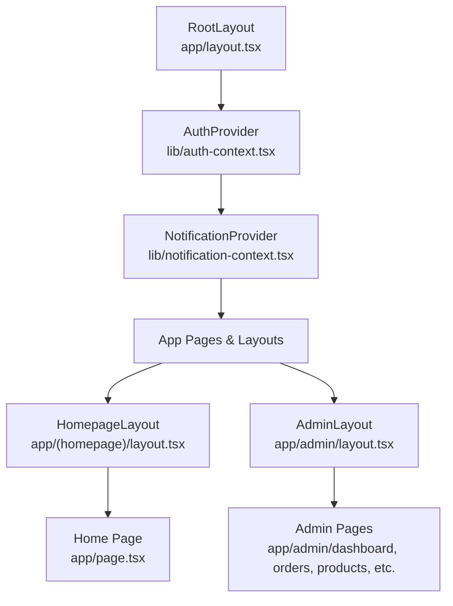
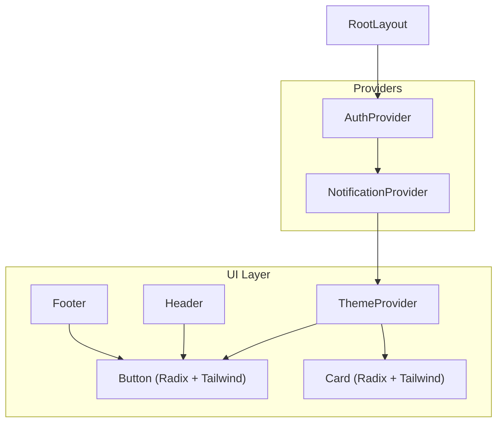
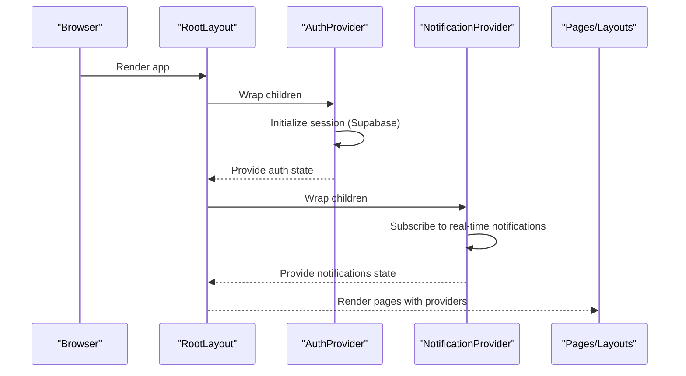
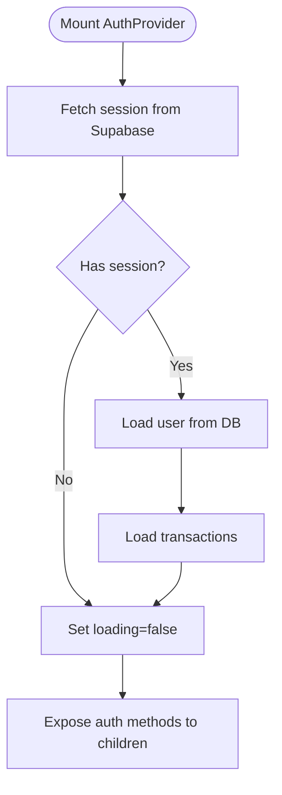
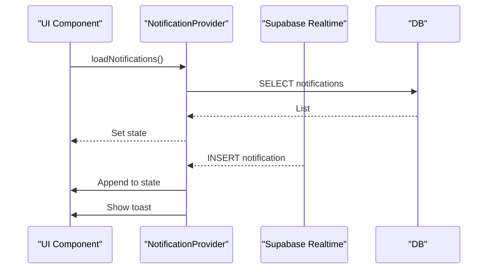
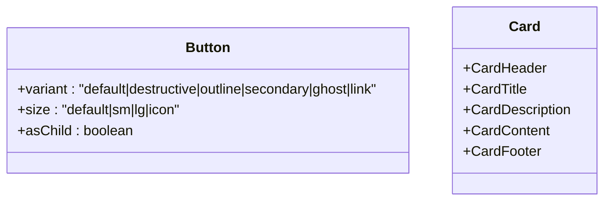
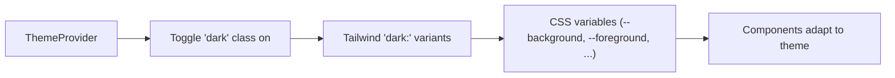
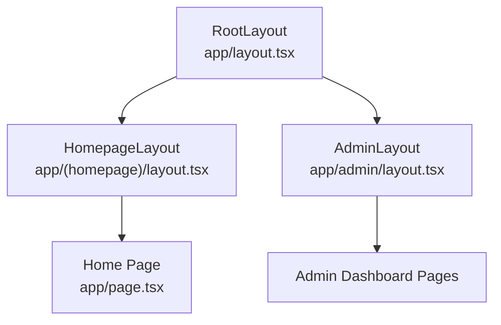
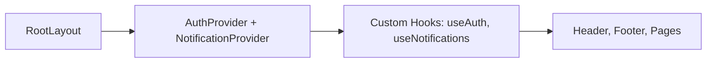
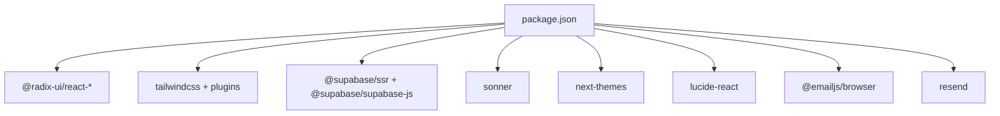

# Frontend Architecture

<cite>
**Referenced Files in This Document**
- [app/layout.tsx](file://app/layout.tsx)
- [app/page.tsx](file://app/page.tsx)
- [app/(homepage)/layout.tsx](file://app/(homepage)/layout.tsx)
- [app/admin/layout.tsx](file://app/admin/layout.tsx)
- [components/theme-provider.tsx](file://components/theme-provider.tsx)
- [components/ui/button.tsx](file://components/ui/button.tsx)
- [components/ui/card.tsx](file://components/ui/card.tsx)
- [components/header.tsx](file://components/header.tsx)
- [components/footer.tsx](file://components/footer.tsx)
- [lib/auth-context.tsx](file://lib/auth-context.tsx)
- [lib/notification-context.tsx](file://lib/notification-context.tsx)
- [app/globals.css](file://app/globals.css)
- [tailwind.config.ts](file://tailwind.config.ts)
- [postcss.config.js](file://postcss.config.js)
- [package.json](file://package.json)
</cite>

## Table of Contents
1. [Introduction](#introduction)
2. [Project Structure](#project-structure)
3. [Core Components](#core-components)
4. [Architecture Overview](#architecture-overview)
5. [Detailed Component Analysis](#detailed-component-analysis)
6. [Dependency Analysis](#dependency-analysis)
7. [Performance Considerations](#performance-considerations)
8. [Troubleshooting Guide](#troubleshooting-guide)
9. [Conclusion](#conclusion)

## Introduction
This document explains the frontend architecture of Byiora’s Next.js application. It covers the app router structure with pages, layouts, and nested routing patterns; the component hierarchy starting from RootLayout with AuthProvider and NotificationProvider wrappers; the UI component library built with Radix UI primitives and Tailwind CSS; theme provider implementation for dark/light mode and responsive design; the font system configuration with Nunito typography and global styling approach; component composition patterns and context-based prop drilling prevention; and performance optimization strategies such as code splitting and image optimization.

## Project Structure
Byiora follows Next.js App Router conventions with a strict file-system-based routing model. Pages are grouped under the app directory, with optional grouping folders for nested routing. Global styles and fonts are configured at the root layout level, while reusable UI components live under components/ui. Providers wrap the application tree to supply authentication and notification state.

Key structural highlights:
- Root layout defines metadata, font loading, and provider wrappers around all pages.
- Nested layouts encapsulate shared UI scaffolding for homepage and admin sections.
- UI primitives are built with Radix UI and styled via Tailwind CSS.
- Global CSS and Tailwind configuration define theme tokens, animations, and responsive breakpoints.

**Diagram sources**
- [app/layout.tsx:25-42](file://app/layout.tsx#L25-L42)
- [lib/auth-context.tsx:51-365](file://lib/auth-context.tsx#L51-L365)
- [lib/notification-context.tsx:29-233](file://lib/notification-context.tsx#L29-L233)
- [app/(homepage)/layout.tsx:5-17](file://app/(homepage)/layout.tsx#L5-L17)
- [app/admin/layout.tsx:8-22](file://app/admin/layout.tsx#L8-L22)
- [app/page.tsx:19-85](file://app/page.tsx#L19-L85)

**Section sources**
- [app/layout.tsx:1-43](file://app/layout.tsx#L1-L43)
- [app/(homepage)/layout.tsx:1-18](file://app/(homepage)/layout.tsx#L1-L18)
- [app/admin/layout.tsx:1-23](file://app/admin/layout.tsx#L1-L23)
- [app/page.tsx:1-169](file://app/page.tsx#L1-L169)

## Core Components
This section outlines the foundational building blocks of the frontend:

- RootLayout: Sets metadata, loads Nunito font, and wraps children with AuthProvider and NotificationProvider. It also renders a global Toaster for toast notifications.
- AuthProvider: Centralizes authentication state, user profile, transactions, and actions (login, signup, logout, profile updates, account deletion). Integrates with Supabase for session and user data.
- NotificationProvider: Manages user-specific and broadcast notifications, supports real-time updates via Supabase, and exposes methods to add, mark as read, and send notifications.
- UI Library: Built with Radix UI primitives and styled with Tailwind CSS. Includes components like Button, Card, Dialog, Sheet, Tabs, and others.
- Theme Provider: Thin wrapper around next-themes to enable light/dark mode switching and class-based toggling.
- Global Styles and Fonts: Tailwind directives and CSS layers define theme tokens, component-level styles, and responsive utilities. Nunito is configured as the primary font family.

**Section sources**
- [app/layout.tsx:6-7](file://app/layout.tsx#L6-L7)
- [lib/auth-context.tsx:30-47](file://lib/auth-context.tsx#L30-L47)
- [lib/notification-context.tsx:17-25](file://lib/notification-context.tsx#L17-L25)
- [components/theme-provider.tsx:9-11](file://components/theme-provider.tsx#L9-L11)
- [app/globals.css:1-118](file://app/globals.css#L1-L118)
- [tailwind.config.ts:11-112](file://tailwind.config.ts#L11-L112)

## Architecture Overview
The frontend architecture centers on a provider-first design:
- RootLayout initializes providers and global font.
- AuthProvider hydrates user session and transactions on mount.
- NotificationProvider subscribes to real-time notifications and exposes a simple API.
- UI components are composed using Radix UI slots and Tailwind utilities.
- Dark/light mode is controlled via next-themes with class-based switching.

**Diagram sources**
- [app/layout.tsx:25-42](file://app/layout.tsx#L25-L42)
- [lib/auth-context.tsx:51-365](file://lib/auth-context.tsx#L51-L365)
- [lib/notification-context.tsx:29-233](file://lib/notification-context.tsx#L29-L233)
- [components/theme-provider.tsx:9-11](file://components/theme-provider.tsx#L9-L11)
- [components/ui/button.tsx:42-53](file://components/ui/button.tsx#L42-L53)
- [components/ui/card.tsx:5-17](file://components/ui/card.tsx#L5-L17)
- [components/header.tsx:19-70](file://components/header.tsx#L19-L70)
- [components/footer.tsx:5-173](file://components/footer.tsx#L5-L173)

## Detailed Component Analysis

### RootLayout and Provider Chain
RootLayout composes three layers:
- AuthProvider: Initializes session and user data, exposes authentication APIs, and manages transactions.
- NotificationProvider: Loads and subscribes to notifications, exposes CRUD-like methods, and integrates with Supabase.
- Toaster: Renders toast notifications globally.

**Diagram sources**
- [app/layout.tsx:25-42](file://app/layout.tsx#L25-L42)
- [lib/auth-context.tsx:56-92](file://lib/auth-context.tsx#L56-L92)
- [lib/notification-context.tsx:172-220](file://lib/notification-context.tsx#L172-L220)

**Section sources**
- [app/layout.tsx:25-42](file://app/layout.tsx#L25-L42)
- [lib/auth-context.tsx:51-365](file://lib/auth-context.tsx#L51-L365)
- [lib/notification-context.tsx:29-233](file://lib/notification-context.tsx#L29-L233)

### Authentication Context (AuthProvider)
AuthProvider encapsulates:
- Session hydration on mount using Supabase.
- User profile CRUD operations.
- Transaction lifecycle management (add, status update).
- Account deletion with anonymization.

**Diagram sources**
- [lib/auth-context.tsx:56-92](file://lib/auth-context.tsx#L56-L92)
- [lib/auth-context.tsx:94-127](file://lib/auth-context.tsx#L94-L127)

**Section sources**
- [lib/auth-context.tsx:30-47](file://lib/auth-context.tsx#L30-L47)
- [lib/auth-context.tsx:51-365](file://lib/auth-context.tsx#L51-L365)

### Notifications Context (NotificationProvider)
NotificationProvider:
- Loads user-specific and broadcast notifications.
- Subscribes to real-time inserts via Supabase.
- Provides methods to mark as read, mark all as read, and send notifications.

**Diagram sources**
- [lib/notification-context.tsx:36-66](file://lib/notification-context.tsx#L36-L66)
- [lib/notification-context.tsx:172-220](file://lib/notification-context.tsx#L172-L220)

**Section sources**
- [lib/notification-context.tsx:17-25](file://lib/notification-context.tsx#L17-L25)
- [lib/notification-context.tsx:29-233](file://lib/notification-context.tsx#L29-L233)

### UI Component Library: Button and Card
The UI library leverages Radix UI primitives and Tailwind CSS:
- Button: Variants and sizes via class-variance-authority, supporting slot composition.
- Card: Semantic sections (header, title, description, content, footer) with consistent spacing and typography.

**Diagram sources**
- [components/ui/button.tsx:36-57](file://components/ui/button.tsx#L36-L57)
- [components/ui/card.tsx:5-87](file://components/ui/card.tsx#L5-L87)

**Section sources**
- [components/ui/button.tsx:1-57](file://components/ui/button.tsx#L1-L57)
- [components/ui/card.tsx:1-87](file://components/ui/card.tsx#L1-L87)

### Theme Provider and Responsive Design
ThemeProvider is a thin wrapper around next-themes enabling light/dark mode switching. Tailwind is configured for class-based dark mode and includes:
- Custom brand color palette mapped to CSS variables.
- Font family extension for Nunito.
- Animations and gradients for interactive elements.
- Responsive utilities and component-level styles.

**Diagram sources**
- [components/theme-provider.tsx:9-11](file://components/theme-provider.tsx#L9-L11)
- [tailwind.config.ts:4](file://tailwind.config.ts#L4)
- [tailwind.config.ts:11-112](file://tailwind.config.ts#L11-L112)
- [app/globals.css:5-44](file://app/globals.css#L5-L44)

**Section sources**
- [components/theme-provider.tsx:1-12](file://components/theme-provider.tsx#L1-L12)
- [tailwind.config.ts:1-113](file://tailwind.config.ts#L1-L113)
- [app/globals.css:1-118](file://app/globals.css#L1-L118)

### Routing Patterns and Nested Layouts
Byiora uses nested layouts to share common UI scaffolding:
- Root layout: Providers and global font.
- Homepage layout: Wraps pages with Header and Footer.
- Admin layout: Minimal wrapper for admin routes.

**Diagram sources**
- [app/layout.tsx:25-42](file://app/layout.tsx#L25-L42)
- [app/(homepage)/layout.tsx:5-17](file://app/(homepage)/layout.tsx#L5-L17)
- [app/admin/layout.tsx:8-22](file://app/admin/layout.tsx#L8-L22)
- [app/page.tsx:19-85](file://app/page.tsx#L19-L85)

**Section sources**
- [app/(homepage)/layout.tsx:1-18](file://app/(homepage)/layout.tsx#L1-L18)
- [app/admin/layout.tsx:1-23](file://app/admin/layout.tsx#L1-L23)
- [app/page.tsx:1-169](file://app/page.tsx#L1-L169)

### Component Composition and Prop Drilling Prevention
Byiora prevents prop drilling by:
- Wrapping the app with AuthProvider and NotificationProvider at the root.
- Consuming context via custom hooks (useAuth, useNotifications) deep in the component tree.
- Composing UI with Radix primitives and Tailwind utilities to keep components declarative and reusable.

**Diagram sources**
- [app/layout.tsx:25-42](file://app/layout.tsx#L25-L42)
- [lib/auth-context.tsx:367-373](file://lib/auth-context.tsx#L367-L373)
- [lib/notification-context.tsx:235-241](file://lib/notification-context.tsx#L235-L241)
- [components/header.tsx:13-14](file://components/header.tsx#L13-L14)

**Section sources**
- [lib/auth-context.tsx:367-373](file://lib/auth-context.tsx#L367-L373)
- [lib/notification-context.tsx:235-241](file://lib/notification-context.tsx#L235-L241)
- [components/header.tsx:19-70](file://components/header.tsx#L19-L70)

## Dependency Analysis
External libraries and integrations:
- UI primitives: @radix-ui/react-* packages.
- Styling: Tailwind CSS, class-variance-authority, clsx, tailwind-merge.
- State and auth: @supabase/ssr, @supabase/supabase-js.
- Notifications: sonner for toast notifications.
- Theming: next-themes for theme switching.
- Icons: lucide-react.
- Email/SMS: resend, @emailjs/browser.

**Diagram sources**
- [package.json:11-38](file://package.json#L11-L38)

**Section sources**
- [package.json:1-51](file://package.json#L1-L51)

## Performance Considerations
- Code splitting: Next.js automatically splits routes and pages; nested layouts reduce duplication and improve caching.
- Image optimization: Next.js Image component is used across Header/Footer for logos and assets.
- Lazy loading: Suspense boundaries can be introduced around heavy sections if needed.
- CSS optimization: Tailwind purges unused styles; CSS variables and layers minimize repaints.
- Context granularity: Splitting concerns into separate contexts reduces unnecessary re-renders.
- Real-time subscriptions: NotificationProvider uses Supabase channels; ensure cleanup on unmount.

[No sources needed since this section provides general guidance]

## Troubleshooting Guide
Common areas to inspect:
- Authentication initialization errors: Check Supabase session retrieval and user lookup.
- Notification subscription failures: Verify Supabase realtime channel and permissions.
- Theme not applying: Confirm dark mode class is toggled and Tailwind darkMode is set to class.
- Font rendering issues: Ensure Nunito is loaded and fallbacks are configured.

**Section sources**
- [lib/auth-context.tsx:56-92](file://lib/auth-context.tsx#L56-L92)
- [lib/notification-context.tsx:172-220](file://lib/notification-context.tsx#L172-L220)
- [tailwind.config.ts:4](file://tailwind.config.ts#L4)
- [app/layout.tsx:9-14](file://app/layout.tsx#L9-L14)

## Conclusion
Byiora’s frontend architecture embraces Next.js App Router conventions with a provider-first design. RootLayout composes AuthProvider and NotificationProvider to centralize state and integrate with Supabase. The UI library, built with Radix UI and Tailwind CSS, ensures consistent, accessible components. ThemeProvider and Tailwind configuration deliver robust dark/light mode and responsive behavior. Global fonts and CSS layers unify the visual language. Context-based composition minimizes prop drilling, while Next.js routing and nested layouts streamline navigation and code splitting.