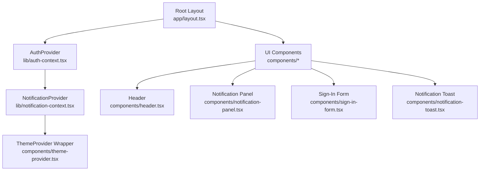
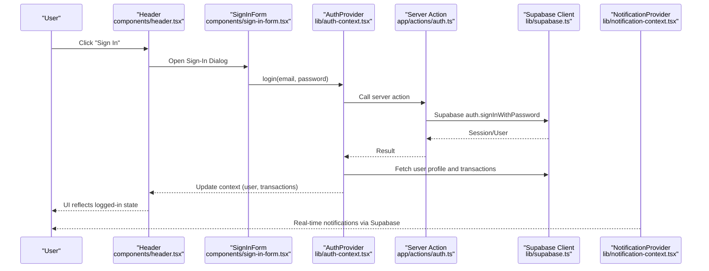
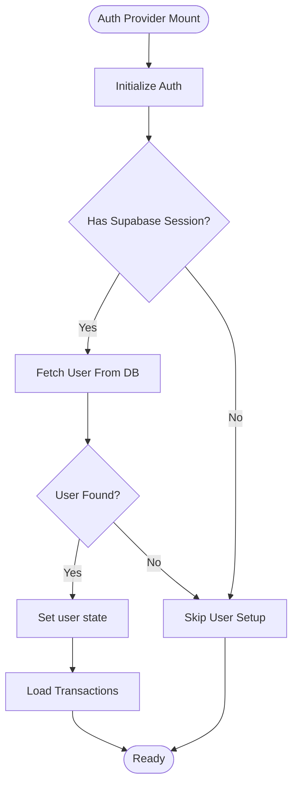
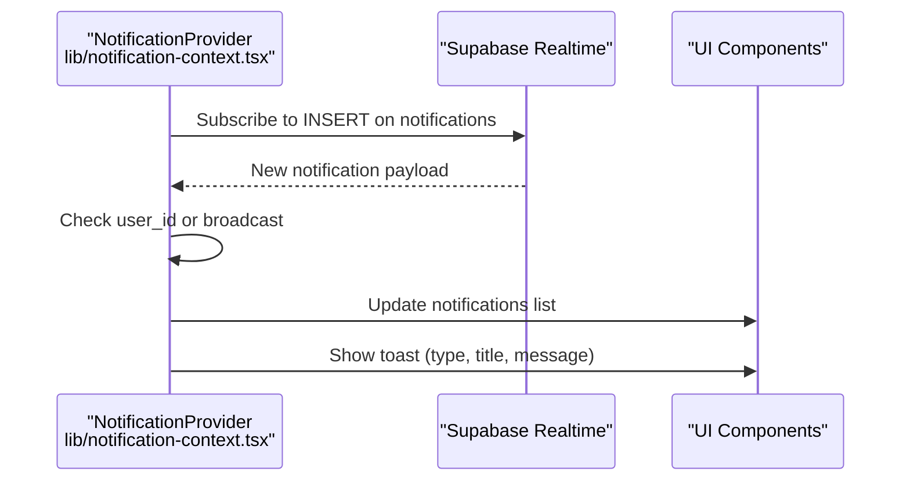
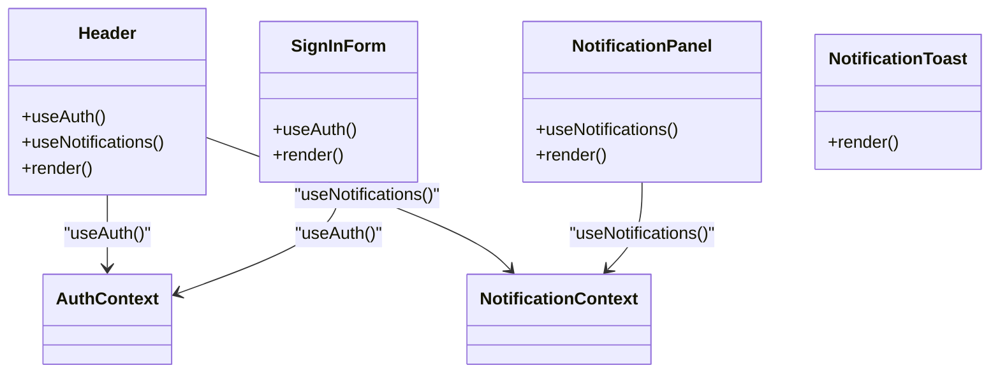
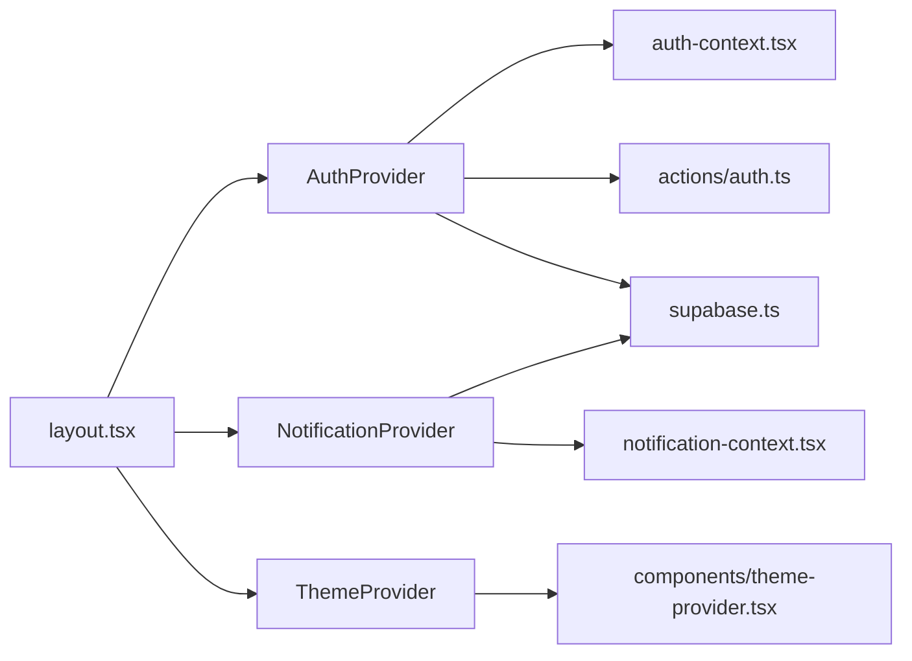

# State Management

<cite>
**Referenced Files in This Document**
- [auth-context.tsx](file://lib/auth-context.tsx)
- [notification-context.tsx](file://lib/notification-context.tsx)
- [theme-provider.tsx](file://components/theme-provider.tsx)
- [supabase.ts](file://lib/supabase.ts)
- [layout.tsx](file://app/layout.tsx)
- [auth.ts](file://app/actions/auth.ts)
- [header.tsx](file://components/header.tsx)
- [notification-panel.tsx](file://components/notification-panel.tsx)
- [notification-toast.tsx](file://components/notification-toast.tsx)
- [sign-in-form.tsx](file://components/sign-in-form.tsx)
- [middleware.ts](file://middleware.ts)
</cite>

## Table of Contents
1. [Introduction](#introduction)
2. [Project Structure](#project-structure)
3. [Core Components](#core-components)
4. [Architecture Overview](#architecture-overview)
5. [Detailed Component Analysis](#detailed-component-analysis)
6. [Dependency Analysis](#dependency-analysis)
7. [Performance Considerations](#performance-considerations)
8. [Persistence and Real-time](#persistence-and-real-time)
9. [Error Handling and Debugging](#error-handling-and-debugging)
10. [Troubleshooting Guide](#troubleshooting-guide)
11. [Conclusion](#conclusion)

## Introduction
This document explains the state management architecture built on React Context API in the application. It focuses on three primary providers:
- AuthProvider: manages authentication state, user profile, and transaction history
- NotificationProvider: manages toast notifications, real-time updates, and read/unread counts
- ThemeProvider: wraps the UI theme provider from next-themes

It documents the provider pattern, context value structures, dispatch-like functions, state update mechanisms, and how user interactions flow through the providers to update components. It also covers performance considerations, persistence strategies, error boundary integration, and debugging approaches for context-based state management.

## Project Structure
The state management is initialized at the root layout level and consumed by UI components across the app. Providers are layered to ensure global availability of state and UI theme.

**Diagram sources**
- [layout.tsx:25-42](file://app/layout.tsx#L25-L42)
- [auth-context.tsx:51-365](file://lib/auth-context.tsx#L51-L365)
- [notification-context.tsx:29-233](file://lib/notification-context.tsx#L29-L233)
- [theme-provider.tsx:9-11](file://components/theme-provider.tsx#L9-L11)
- [header.tsx:19-416](file://components/header.tsx#L19-L416)
- [notification-panel.tsx:13-161](file://components/notification-panel.tsx#L13-L161)
- [sign-in-form.tsx:18-209](file://components/sign-in-form.tsx#L18-L209)
- [notification-toast.tsx:11-50](file://components/notification-toast.tsx#L11-L50)

**Section sources**
- [layout.tsx:25-42](file://app/layout.tsx#L25-L42)

## Core Components
- AuthProvider: Provides authentication state, user profile, transaction history, and actions (login, signup, logout, update profile, delete account, add transaction, update transaction status). It initializes from Supabase session and loads user transactions.
- NotificationProvider: Provides notifications list, unread count, and actions (add notification, mark as read, mark all as read, load notifications, send notification). It integrates with Supabase real-time to receive live notifications and shows toast messages.
- ThemeProvider: Thin wrapper around next-themes ThemeProvider to manage UI theme state.

**Section sources**
- [auth-context.tsx:30-47](file://lib/auth-context.tsx#L30-L47)
- [notification-context.tsx:17-25](file://lib/notification-context.tsx#L17-L25)
- [theme-provider.tsx:9-11](file://components/theme-provider.tsx#L9-L11)

## Architecture Overview
The application initializes providers at the root and exposes context values to components. User interactions trigger actions that update state and persist to Supabase. Real-time subscriptions keep notifications synchronized.

**Diagram sources**
- [header.tsx:72-416](file://components/header.tsx#L72-L416)
- [sign-in-form.tsx:18-209](file://components/sign-in-form.tsx#L18-L209)
- [auth-context.tsx:129-163](file://lib/auth-context.tsx#L129-L163)
- [auth.ts:8-23](file://app/actions/auth.ts#L8-L23)
- [supabase.ts:7](file://lib/supabase.ts#L7)
- [notification-context.tsx:172-220](file://lib/notification-context.tsx#L172-L220)

## Detailed Component Analysis

### AuthProvider
- Purpose: Centralizes authentication and transaction state.
- Context value structure:
  - user: User | null
  - transactions: Transaction[]
  - isLoggedIn: boolean
  - login(email, password): Promise<boolean>
  - signup(email, password, name): Promise<boolean>
  - logout(): void
  - updateProfile(name): Promise<boolean>
  - deleteAccount(): Promise<boolean>
  - addTransaction(transactionData): Promise<string>
  - updateTransactionStatus(transactionId, status): Promise<void>
  - isLoading: boolean
- Initialization: On mount, reads Supabase session, verifies user existence, sets user, and loads transactions.
- State updates:
  - login: Calls server action, validates user, sets user state, loads transactions.
  - signup: Calls server action, then calls login internally.
  - updateProfile: Updates user name in Supabase and context.
  - deleteAccount: Anonymizes user data and logs out.
  - addTransaction: Inserts transaction into Supabase and updates local list.
  - updateTransactionStatus: Updates status in Supabase and context.
- Error handling: Uses console.error and toast for feedback.

**Diagram sources**
- [auth-context.tsx:56-92](file://lib/auth-context.tsx#L56-L92)
- [auth-context.tsx:94-127](file://lib/auth-context.tsx#L94-L127)

**Section sources**
- [auth-context.tsx:51-365](file://lib/auth-context.tsx#L51-L365)

### NotificationProvider
- Purpose: Manages notifications, unread counts, and real-time updates.
- Context value structure:
  - notifications: Notification[]
  - unreadCount: number
  - addNotification(notification): void
  - markAsRead(id): Promise<void>
  - markAllAsRead(): Promise<void>
  - loadNotifications(): Promise<void>
  - sendNotification(notification): Promise<void>
- Real-time: Subscribes to Supabase postgres_changes to receive new notifications and updates local state and toast.
- State updates:
  - loadNotifications: Queries notifications for current user and broadcasts.
  - addNotification: Adds locally for immediate UI feedback.
  - markAsRead/markAllAsRead: Updates DB and local state.
  - sendNotification: Inserts into DB and conditionally adds to local state.
- Error handling: Logs errors and throws for upstream handling.

**Diagram sources**
- [notification-context.tsx:172-220](file://lib/notification-context.tsx#L172-L220)

**Section sources**
- [notification-context.tsx:29-233](file://lib/notification-context.tsx#L29-L233)

### ThemeProvider
- Purpose: Wraps the application with next-themes ThemeProvider to manage UI theme state.
- Integration: Used inside the root layout alongside AuthProvider and NotificationProvider.

**Section sources**
- [theme-provider.tsx:9-11](file://components/theme-provider.tsx#L9-L11)
- [layout.tsx:33-38](file://app/layout.tsx#L33-L38)

### Consumer Components
- Header: Consumes useAuth and useNotifications to render user menu, unread badges, and open dialogs/panels.
- NotificationPanel: Consumes useNotifications to display and manage notifications.
- SignInForm: Consumes useAuth to perform login/signup and show toasts.
- NotificationToast: Demonstrates a lightweight toast UI component.

**Diagram sources**
- [header.tsx:72-416](file://components/header.tsx#L72-L416)
- [notification-panel.tsx:13-161](file://components/notification-panel.tsx#L13-L161)
- [sign-in-form.tsx:18-209](file://components/sign-in-form.tsx#L18-L209)
- [notification-toast.tsx:11-50](file://components/notification-toast.tsx#L11-L50)

**Section sources**
- [header.tsx:72-416](file://components/header.tsx#L72-L416)
- [notification-panel.tsx:13-161](file://components/notification-panel.tsx#L13-L161)
- [sign-in-form.tsx:18-209](file://components/sign-in-form.tsx#L18-L209)
- [notification-toast.tsx:11-50](file://components/notification-toast.tsx#L11-L50)

## Dependency Analysis
- Providers are layered in the root layout to ensure global availability.
- AuthProvider depends on Supabase client and server actions for authentication.
- NotificationProvider depends on Supabase client and real-time channels.
- ThemeProvider is independent and composes with the other providers.

**Diagram sources**
- [layout.tsx:25-42](file://app/layout.tsx#L25-L42)
- [auth-context.tsx:51-365](file://lib/auth-context.tsx#L51-L365)
- [auth.ts:8-67](file://app/actions/auth.ts#L8-L67)
- [supabase.ts:7](file://lib/supabase.ts#L7)
- [notification-context.tsx:29-233](file://lib/notification-context.tsx#L29-L233)
- [theme-provider.tsx:9-11](file://components/theme-provider.tsx#L9-L11)

**Section sources**
- [layout.tsx:25-42](file://app/layout.tsx#L25-L42)
- [auth.ts:8-67](file://app/actions/auth.ts#L8-L67)
- [supabase.ts:7](file://lib/supabase.ts#L7)

## Performance Considerations
- Context splitting: The current implementation nests providers but does not split contexts. To reduce unnecessary re-renders:
  - Split AuthContext and NotificationContext consumers into separate subtrees where possible.
  - Wrap heavy consumers (e.g., NotificationPanel) in their own subtree to minimize AuthProvider re-renders.
  - Use memoization for callbacks (already partially used with useCallback in NotificationProvider).
- Avoid redundant re-renders:
  - Keep context values granular; avoid passing large objects if only small parts are needed.
  - Use shallow comparisons in downstream components to prevent re-renders.
- Real-time updates:
  - NotificationProvider already uses Supabase real-time efficiently; ensure listeners are cleaned up on unmount.
- Loading states:
  - AuthProvider’s isLoading flag prevents premature rendering while initializing.

[No sources needed since this section provides general guidance]

## Persistence and Real-time
- Authentication persistence:
  - Supabase session is used to hydrate user state on mount.
  - Middleware ensures session updates across requests.
- Transaction persistence:
  - Transactions are inserted and updated in Supabase; local state mirrors DB changes.
- Notification persistence:
  - Notifications are stored in Supabase and synced via real-time channels.
  - Local state maintains unread counts and lists; toast notifications are shown immediately upon receipt.

**Section sources**
- [auth-context.tsx:56-92](file://lib/auth-context.tsx#L56-L92)
- [auth.ts:8-23](file://app/actions/auth.ts#L8-L23)
- [notification-context.tsx:172-220](file://lib/notification-context.tsx#L172-L220)
- [middleware.ts:4-10](file://middleware.ts#L4-L10)

## Error Handling and Debugging
- Error boundaries:
  - Not implemented in the current codebase. Consider wrapping critical provider subtrees with an error boundary to gracefully handle provider failures and display fallback UI.
- Debugging approaches:
  - Use React DevTools Profiler to inspect re-renders and identify hotspots.
  - Add logging around context updates (e.g., console.log in provider setters) during development.
  - Verify Supabase connection and permissions in browser dev tools network tab.
  - For notifications, confirm real-time subscription events and payload correctness.
- Validation:
  - Validate server action responses and handle serialization of errors.
  - Ensure transaction inserts handle schema mismatches (retry without optional fields).

**Section sources**
- [auth-context.tsx:80-88](file://lib/auth-context.tsx#L80-L88)
- [notification-context.tsx:47-66](file://lib/notification-context.tsx#L47-L66)
- [notification-context.tsx:155-159](file://lib/notification-context.tsx#L155-L159)

## Troubleshooting Guide
- Authentication not persisting:
  - Verify Supabase session retrieval and user verification steps.
  - Check server action response and redirect behavior.
- Notifications not appearing:
  - Confirm Supabase real-time channel subscription and payload filtering by user_id or broadcast.
  - Ensure toast library is configured globally.
- Excessive re-renders:
  - Review consumer components for unnecessary prop passing.
  - Consider splitting contexts to isolate state domains.
- Transaction status not updating:
  - Verify updateTransactionStatus calls and DB permissions.
  - Ensure transactionId uniqueness and matching logic.

**Section sources**
- [auth-context.tsx:129-163](file://lib/auth-context.tsx#L129-L163)
- [notification-context.tsx:172-220](file://lib/notification-context.tsx#L172-L220)
- [notification-context.tsx:325-344](file://lib/notification-context.tsx#L325-L344)

## Conclusion
The application employs a robust React Context-based state management architecture with three primary providers. AuthProvider centralizes authentication and transaction state, NotificationProvider handles real-time notifications and toasts, and ThemeProvider manages UI theme. The providers are layered at the root for global accessibility, and consumers throughout the app leverage hooks to subscribe to state updates. For production readiness, consider context splitting, error boundaries, and enhanced debugging practices to improve performance and reliability.