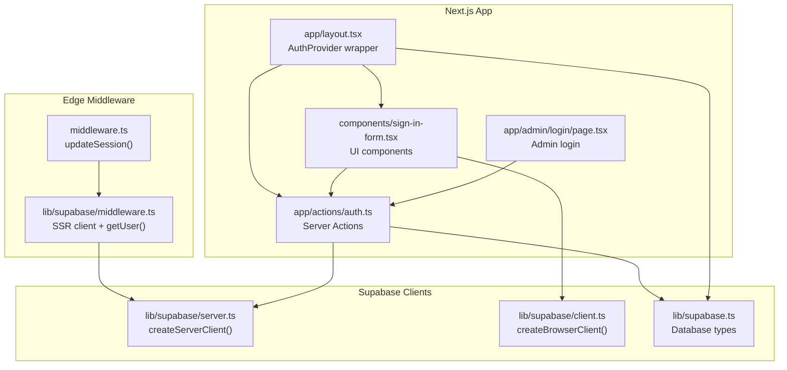
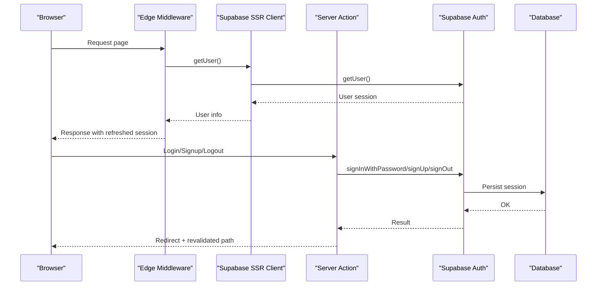
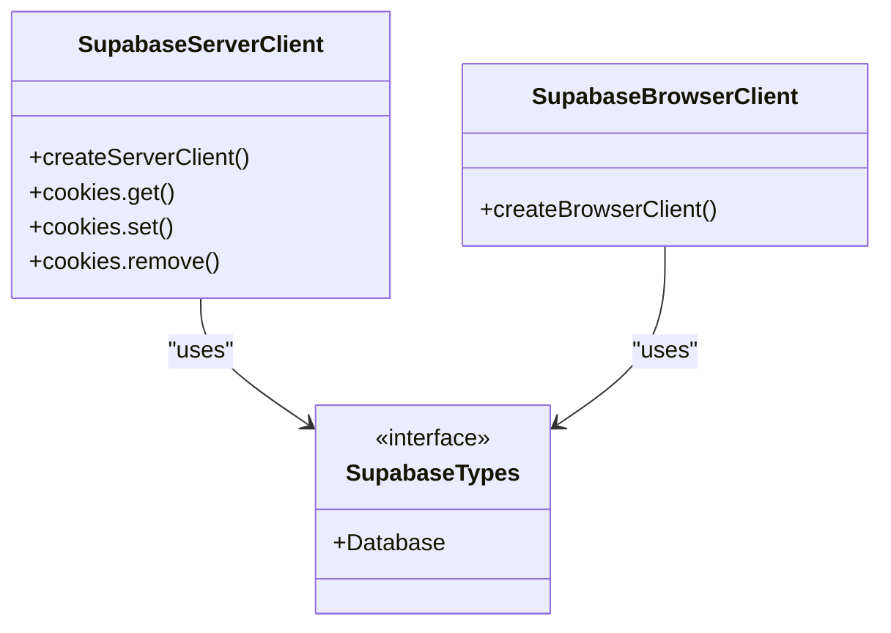
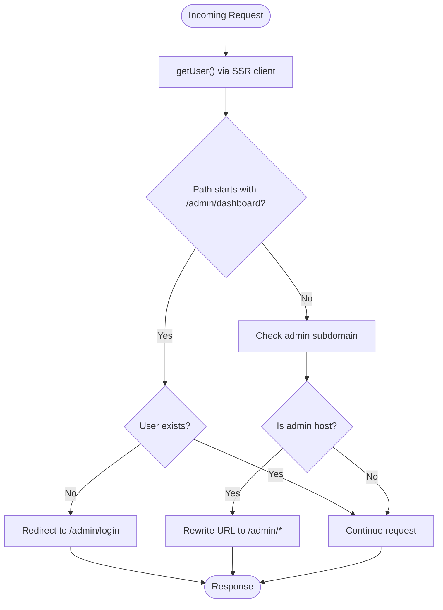
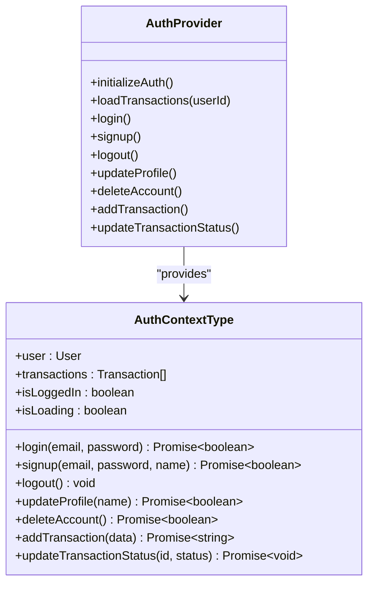
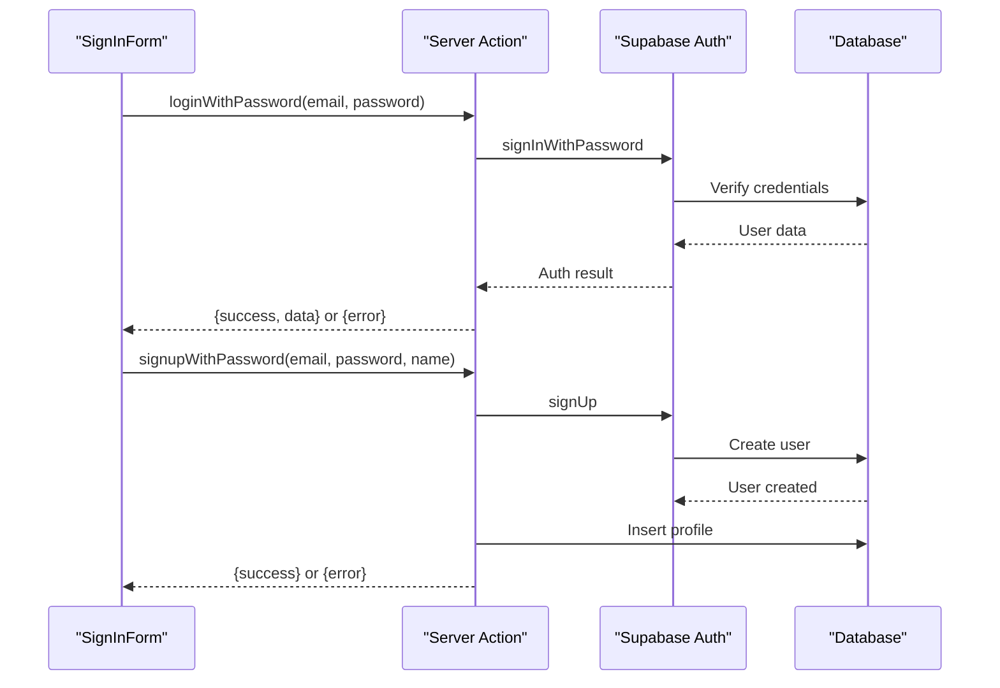
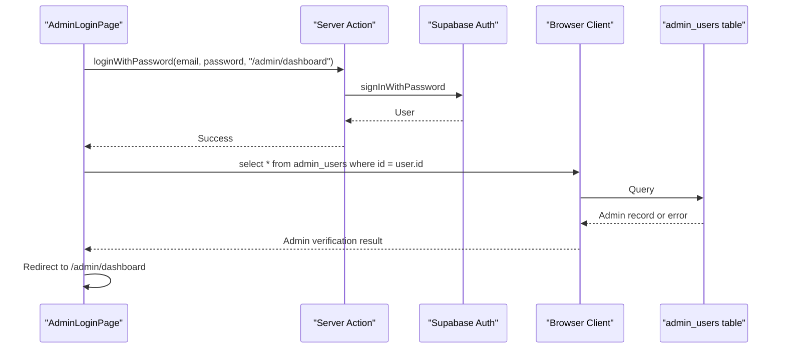
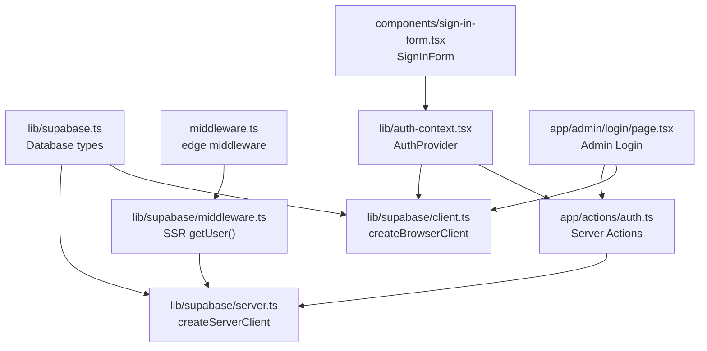

# Authentication Architecture

<cite>
**Referenced Files in This Document**
- [supabase.ts](file://lib/supabase.ts)
- [auth-context.tsx](file://lib/auth-context.tsx)
- [middleware.ts](file://middleware.ts)
- [supabase/middleware.ts](file://lib/supabase/middleware.ts)
- [supabase/server.ts](file://lib/supabase/server.ts)
- [supabase/client.ts](file://lib/supabase/client.ts)
- [actions/auth.ts](file://app/actions/auth.ts)
- [layout.tsx](file://app/layout.tsx)
- [sign-in-form.tsx](file://components/sign-in-form.tsx)
- [admin/login/page.tsx](file://app/admin/login/page.tsx)
- [notification-context.tsx](file://lib/notification-context.tsx)
- [package.json](file://package.json)
</cite>

## Table of Contents
1. [Introduction](#introduction)
2. [Project Structure](#project-structure)
3. [Core Components](#core-components)
4. [Architecture Overview](#architecture-overview)
5. [Detailed Component Analysis](#detailed-component-analysis)
6. [Dependency Analysis](#dependency-analysis)
7. [Performance Considerations](#performance-considerations)
8. [Security Considerations](#security-considerations)
9. [Troubleshooting Guide](#troubleshooting-guide)
10. [Conclusion](#conclusion)

## Introduction
This document explains the authentication architecture for a Supabase-based Next.js application. It covers the overall design, including React Context API for state management, Supabase client configuration, middleware protection patterns, and the complete authentication flow from login to session management. The AuthProvider wraps the application to centralize authentication state, integrating Supabase Auth with custom React context for a clean separation of concerns between authentication logic, state management, and UI components.

## Project Structure
The authentication system spans several layers:
- Supabase client configuration for server, browser, and SSR environments
- Edge middleware for session refresh and route protection
- Server Actions for secure authentication operations
- React Context Provider for global state management
- UI components that consume the authentication context

**Diagram sources**
- [middleware.ts:1-11](file://middleware.ts#L1-L11)
- [supabase/middleware.ts:1-96](file://lib/supabase/middleware.ts#L1-L96)
- [supabase/server.ts:1-36](file://lib/supabase/server.ts#L1-L36)
- [supabase/client.ts:1-10](file://lib/supabase/client.ts#L1-L10)
- [supabase.ts:1-188](file://lib/supabase.ts#L1-L188)
- [layout.tsx:1-43](file://app/layout.tsx#L1-L43)
- [actions/auth.ts:1-68](file://app/actions/auth.ts#L1-L68)
- [sign-in-form.tsx:1-210](file://components/sign-in-form.tsx#L1-L210)
- [admin/login/page.tsx:1-145](file://app/admin/login/page.tsx#L1-L145)

**Section sources**
- [middleware.ts:1-11](file://middleware.ts#L1-L11)
- [supabase/middleware.ts:1-96](file://lib/supabase/middleware.ts#L1-L96)
- [supabase/server.ts:1-36](file://lib/supabase/server.ts#L1-L36)
- [supabase/client.ts:1-10](file://lib/supabase/client.ts#L1-L10)
- [supabase.ts:1-188](file://lib/supabase.ts#L1-L188)
- [layout.tsx:1-43](file://app/layout.tsx#L1-L43)
- [actions/auth.ts:1-68](file://app/actions/auth.ts#L1-L68)
- [sign-in-form.tsx:1-210](file://components/sign-in-form.tsx#L1-L210)
- [admin/login/page.tsx:1-145](file://app/admin/login/page.tsx#L1-L145)

## Core Components
- Supabase client configuration:
  - Server client for SSR and server actions
  - Browser client for client-side operations
  - Shared database types definition
- Edge middleware for session refresh and admin route protection
- AuthProvider with React Context for centralized state management
- Server Actions for secure authentication operations
- UI components that consume the authentication context

Key responsibilities:
- Supabase clients: encapsulate environment-specific client creation and cookie handling
- Edge middleware: maintain session validity and protect admin routes
- AuthProvider: manage user session, transactions, and expose authentication methods
- Server Actions: perform authentication operations with HTTP-only cookies
- UI components: trigger authentication flows and render state

**Section sources**
- [supabase.ts:1-188](file://lib/supabase.ts#L1-L188)
- [supabase/server.ts:1-36](file://lib/supabase/server.ts#L1-L36)
- [supabase/client.ts:1-10](file://lib/supabase/client.ts#L1-L10)
- [supabase/middleware.ts:1-96](file://lib/supabase/middleware.ts#L1-L96)
- [auth-context.tsx:1-374](file://lib/auth-context.tsx#L1-L374)
- [actions/auth.ts:1-68](file://app/actions/auth.ts#L1-L68)
- [layout.tsx:1-43](file://app/layout.tsx#L1-L43)

## Architecture Overview
The system follows a layered pattern:
- Edge middleware layer validates sessions and enforces route protection
- Supabase client layer abstracts server/browser differences
- Server Actions layer performs secure authentication operations
- React Context layer manages global authentication state
- UI components layer consumes context and triggers actions

**Diagram sources**
- [middleware.ts:1-11](file://middleware.ts#L1-L11)
- [supabase/middleware.ts:1-96](file://lib/supabase/middleware.ts#L1-L96)
- [supabase/server.ts:1-36](file://lib/supabase/server.ts#L1-L36)
- [actions/auth.ts:1-68](file://app/actions/auth.ts#L1-L68)

## Detailed Component Analysis

### Supabase Client Configuration
The application defines three client configurations:
- Server client for SSR and server actions with cookie handling
- Browser client for client-side operations
- Shared database types for type safety

Implementation highlights:
- Environment variables for Supabase URL and keys
- Cookie store integration for server client
- Separate browser client for client-side operations
- Database interface for type-safe database operations

**Diagram sources**
- [supabase/server.ts:1-36](file://lib/supabase/server.ts#L1-L36)
- [supabase/client.ts:1-10](file://lib/supabase/client.ts#L1-L10)
- [supabase.ts:1-188](file://lib/supabase.ts#L1-L188)

**Section sources**
- [supabase.ts:1-188](file://lib/supabase.ts#L1-L188)
- [supabase/server.ts:1-36](file://lib/supabase/server.ts#L1-L36)
- [supabase/client.ts:1-10](file://lib/supabase/client.ts#L1-L10)

### Edge Middleware and Session Management
The edge middleware:
- Refreshes sessions for server components
- Protects admin dashboard routes by redirecting unauthenticated users
- Handles admin subdomain rewriting
- Manages cookie synchronization between requests and responses

Key behaviors:
- Uses Supabase SSR client to fetch user
- Redirects to admin login for protected routes
- Rewrites URLs for admin subdomain
- Maintains cookie consistency across requests

**Diagram sources**
- [supabase/middleware.ts:1-96](file://lib/supabase/middleware.ts#L1-L96)
- [middleware.ts:1-11](file://middleware.ts#L1-L11)

**Section sources**
- [supabase/middleware.ts:1-96](file://lib/supabase/middleware.ts#L1-L96)
- [middleware.ts:1-11](file://middleware.ts#L1-L11)

### AuthProvider and React Context
The AuthProvider manages global authentication state:
- Initializes from existing session
- Loads user profile and transaction history
- Exposes authentication methods (login, signup, logout, updateProfile, deleteAccount)
- Manages transaction CRUD operations
- Provides loading state and user presence detection

State management:
- User object with id, email, name
- Transactions array with formatted data
- Loading state during initialization
- Computed isLoggedIn flag

Authentication methods:
- login: delegates to server action, verifies user existence, loads transactions
- signup: creates account via server action, then logs in
- logout: clears state and invokes server action
- updateProfile: updates user name in database
- deleteAccount: anonymizes user data and signs out

Transaction management:
- addTransaction: inserts transaction with automatic ID generation
- updateTransactionStatus: updates transaction status and local state
- loadTransactions: fetches user's transaction history

**Diagram sources**
- [auth-context.tsx:1-374](file://lib/auth-context.tsx#L1-L374)

**Section sources**
- [auth-context.tsx:1-374](file://lib/auth-context.tsx#L1-L374)

### Server Actions for Authentication
Server Actions encapsulate secure authentication operations:
- loginWithPassword: authenticates user with password, returns serialized error messages
- signupWithPassword: creates user account, inserts profile, sends welcome email
- logoutUser: signs out user and redirects

Security considerations:
- All operations occur on server
- HTTP-only cookies managed by Supabase
- Error messages are serialized for safe transport
- Profile insertion occurs after successful signup
- Welcome email sent asynchronously to avoid blocking signup

**Diagram sources**
- [actions/auth.ts:1-68](file://app/actions/auth.ts#L1-L68)
- [sign-in-form.tsx:1-210](file://components/sign-in-form.tsx#L1-L210)

**Section sources**
- [actions/auth.ts:1-68](file://app/actions/auth.ts#L1-L68)
- [sign-in-form.tsx:1-210](file://components/sign-in-form.tsx#L1-L210)

### Admin Authentication Flow
The admin login page implements a hybrid approach:
- Uses server action for authentication to leverage HTTP-only cookies
- Validates admin role by querying admin_users table
- Redirects authenticated admins to dashboard

Flow:
1. User submits credentials
2. Server action authenticates via Supabase
3. Browser client queries admin_users table for role verification
4. On success, redirects to admin dashboard

**Diagram sources**
- [admin/login/page.tsx:1-145](file://app/admin/login/page.tsx#L1-L145)
- [actions/auth.ts:1-68](file://app/actions/auth.ts#L1-L68)
- [supabase/client.ts:1-10](file://lib/supabase/client.ts#L1-L10)

**Section sources**
- [admin/login/page.tsx:1-145](file://app/admin/login/page.tsx#L1-L145)
- [actions/auth.ts:1-68](file://app/actions/auth.ts#L1-L68)

### Application Layout and Context Provider
The application layout wraps the entire app with AuthProvider and NotificationProvider, ensuring authentication state is available globally. The layout also sets up the application metadata and font configuration.

Integration points:
- AuthProvider wraps all pages and components
- NotificationProvider manages notifications alongside authentication
- Toaster component provides user feedback for authentication events

**Section sources**
- [layout.tsx:1-43](file://app/layout.tsx#L1-L43)
- [notification-context.tsx:1-242](file://lib/notification-context.tsx#L1-L242)

## Dependency Analysis
The authentication system exhibits clear separation of concerns:
- Supabase clients depend on environment variables and cookie stores
- Edge middleware depends on Supabase SSR client
- Server Actions depend on Supabase server client
- AuthProvider depends on both Supabase browser client and server Actions
- UI components depend on AuthProvider context

**Diagram sources**
- [supabase.ts:1-188](file://lib/supabase.ts#L1-L188)
- [supabase/server.ts:1-36](file://lib/supabase/server.ts#L1-L36)
- [supabase/client.ts:1-10](file://lib/supabase/client.ts#L1-L10)
- [middleware.ts:1-11](file://middleware.ts#L1-L11)
- [supabase/middleware.ts:1-96](file://lib/supabase/middleware.ts#L1-L96)
- [actions/auth.ts:1-68](file://app/actions/auth.ts#L1-L68)
- [auth-context.tsx:1-374](file://lib/auth-context.tsx#L1-L374)
- [sign-in-form.tsx:1-210](file://components/sign-in-form.tsx#L1-L210)
- [admin/login/page.tsx:1-145](file://app/admin/login/page.tsx#L1-L145)

**Section sources**
- [package.json:1-51](file://package.json#L1-L51)
- [supabase.ts:1-188](file://lib/supabase.ts#L1-L188)
- [supabase/server.ts:1-36](file://lib/supabase/server.ts#L1-L36)
- [supabase/client.ts:1-10](file://lib/supabase/client.ts#L1-L10)
- [middleware.ts:1-11](file://middleware.ts#L1-L11)
- [supabase/middleware.ts:1-96](file://lib/supabase/middleware.ts#L1-L96)
- [actions/auth.ts:1-68](file://app/actions/auth.ts#L1-L68)
- [auth-context.tsx:1-374](file://lib/auth-context.tsx#L1-L374)
- [sign-in-form.tsx:1-210](file://components/sign-in-form.tsx#L1-L210)
- [admin/login/page.tsx:1-145](file://app/admin/login/page.tsx#L1-L145)

## Performance Considerations
- Session initialization runs once on app load, minimizing repeated network calls
- Server Actions batch authentication operations server-side
- Edge middleware leverages Supabase's getUser() to avoid redundant database queries
- Browser client is used selectively for operations requiring client-side access
- Transaction loading is optimized with single query per session

## Security Considerations
- HTTP-only cookies for authentication tokens
- Server Actions prevent client-side exposure of sensitive operations
- Edge middleware protects admin routes and refreshes sessions
- Admin role verification performed after initial authentication
- Error messages are serialized to avoid exposing internal errors
- Profile anonymization on account deletion preserves referential integrity

## Troubleshooting Guide
Common issues and resolutions:
- Authentication not persisting: verify cookie configuration and middleware setup
- Session expiration: check edge middleware getUser() calls and cookie handling
- Admin access denied: ensure admin_users table contains verified admin records
- Server Action errors: inspect serialized error messages returned by server actions
- Transaction failures: verify database permissions and table schema alignment

Debugging tips:
- Enable console logging in AuthProvider for initialization flow
- Check Supabase dashboard for authentication events and errors
- Verify environment variables for Supabase URL and keys
- Monitor edge middleware response headers for cookie updates

**Section sources**
- [auth-context.tsx:1-374](file://lib/auth-context.tsx#L1-L374)
- [supabase/middleware.ts:1-96](file://lib/supabase/middleware.ts#L1-L96)
- [actions/auth.ts:1-68](file://app/actions/auth.ts#L1-L68)

## Conclusion
The authentication architecture combines Supabase's robust authentication service with React Context for centralized state management. The edge middleware ensures session validity and route protection, while Server Actions handle secure authentication operations. The AuthProvider encapsulates authentication logic and state, providing a clean separation between authentication concerns, state management, and UI components. This design enables scalable, secure, and maintainable authentication for the application.