# Authentication System

<cite>
**Referenced Files in This Document**
- [supabase.ts](file://lib/supabase.ts)
- [auth-context.tsx](file://lib/auth-context.tsx)
- [middleware.ts](file://middleware.ts)
- [supabase/middleware.ts](file://lib/supabase/middleware.ts)
- [auth.ts](file://app/actions/auth.ts)
- [sign-in-form.tsx](file://components/sign-in-form.tsx)
- [admin-login/page.tsx](file://app/admin/login/page.tsx)
- [admin/layout.tsx](file://app/admin/layout.tsx)
- [admin-dashboard/page.tsx](file://app/admin/dashboard/page.tsx)
- [admin-users/page.tsx](file://app/admin/dashboard/admin-users/page.tsx)
- [layout.tsx](file://app/layout.tsx)
- [header.tsx](file://components/header.tsx)
- [admin.ts](file://app/actions/admin.ts)
- [service-role.ts](file://lib/supabase/service-role.ts)
- [admin-users.ts](file://app/actions/admin-users.ts)
- [transactions.ts](file://app/actions/transactions.ts)
</cite>

## Update Summary
**Changes Made**
- Added comprehensive documentation for Service Role Client integration
- Enhanced admin authentication flows with role-based access control
- Updated security model documentation for administrative operations
- Added service role client implementation details and security considerations
- Expanded admin user management with proper role verification

## Table of Contents
1. [Introduction](#introduction)
2. [Project Structure](#project-structure)
3. [Core Components](#core-components)
4. [Architecture Overview](#architecture-overview)
5. [Detailed Component Analysis](#detailed-component-analysis)
6. [Service Role Client Integration](#service-role-client-integration)
7. [Enhanced Admin Authentication Flows](#enhanced-admin-authentication-flows)
8. [Dependency Analysis](#dependency-analysis)
9. [Performance Considerations](#performance-considerations)
10. [Security Model and Best Practices](#security-model-and-best-practices)
11. [Troubleshooting Guide](#troubleshooting-guide)
12. [Conclusion](#conclusion)

## Introduction
This document explains the authentication system built on Supabase Auth within a Next.js application. The system has been enhanced with Service Role Client integration for administrative operations that require bypassing Row-Level Security (RLS). It covers session management using Supabase, React Context API for state management, middleware protection for admin routes, and comprehensive role-based access control for administrators. The guide details user login/logout flows, session persistence, admin verification processes, and secure administrative operations with proper security boundaries.

## Project Structure
The authentication system spans several layers with enhanced security architecture:
- Supabase client initialization and database types
- Server actions for authentication operations
- Client-side auth context provider and hooks
- Middleware for session synchronization and admin route protection
- Service Role Client for administrative operations bypassing RLS
- Admin login page and admin-only pages with role verification
- UI components integrating with the auth context

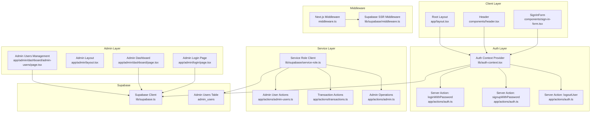

**Diagram sources**
- [layout.tsx:33-38](file://app/layout.tsx#L33-L38)
- [auth-context.tsx:51-92](file://lib/auth-context.tsx#L51-L92)
- [auth.ts:8-67](file://app/actions/auth.ts#L8-L67)
- [middleware.ts:4-6](file://middleware.ts#L4-L6)
- [supabase/middleware.ts:4-95](file://lib/supabase/middleware.ts#L4-L95)
- [admin-login/page.tsx:23-61](file://app/admin/login/page.tsx#L23-L61)
- [admin-dashboard/page.tsx:47-104](file://app/admin/dashboard/page.tsx#L47-L104)
- [admin-users/page.tsx:91-108](file://app/admin/dashboard/admin-users/page.tsx#L91-L108)
- [supabase.ts:1-188](file://lib/supabase.ts#L1-L188)
- [service-role.ts:1-39](file://lib/supabase/service-role.ts#L1-L39)
- [admin-users.ts:1-155](file://app/actions/admin-users.ts#L1-L155)
- [transactions.ts:1-82](file://app/actions/transactions.ts#L1-L82)

**Section sources**
- [layout.tsx:33-38](file://app/layout.tsx#L33-L38)
- [auth-context.tsx:51-92](file://lib/auth-context.tsx#L51-L92)
- [auth.ts:8-67](file://app/actions/auth.ts#L8-L67)
- [middleware.ts:4-6](file://middleware.ts#L4-L6)
- [supabase/middleware.ts:4-95](file://lib/supabase/middleware.ts#L4-L95)
- [admin-login/page.tsx:23-61](file://app/admin/login/page.tsx#L23-L61)
- [admin-dashboard/page.tsx:47-104](file://app/admin/dashboard/page.tsx#L47-L104)
- [admin-users/page.tsx:91-108](file://app/admin/dashboard/admin-users/page.tsx#L91-L108)
- [supabase.ts:1-188](file://lib/supabase.ts#L1-L188)
- [service-role.ts:1-39](file://lib/supabase/service-role.ts#L1-L39)
- [admin-users.ts:1-155](file://app/actions/admin-users.ts#L1-L155)
- [transactions.ts:1-82](file://app/actions/transactions.ts#L1-L82)

## Core Components
- Supabase client and database types: Provides typed access to Supabase tables and initializes the client with environment variables.
- Auth Context: Centralizes session state, exposes login/signup/logout/update/delete operations, and loads user transactions.
- Server Actions: Encapsulate Supabase Auth operations for login, signup, and logout, returning serializable results.
- Middleware: Synchronizes Supabase session cookies and enforces basic admin route protection.
- Service Role Client: Provides administrative operations that bypass Row-Level Security for trusted server-side operations.
- Admin Authentication: Handles admin verification against the admin_users table with role-based access control.
- Admin User Management: Manages admin user creation, promotion, status toggling, and deletion with proper security checks.
- Transaction Management: Processes transactions with service role client for bypassing RLS constraints.

**Section sources**
- [supabase.ts:1-188](file://lib/supabase.ts#L1-L188)
- [auth-context.tsx:30-47](file://lib/auth-context.tsx#L30-L47)
- [auth.ts:8-67](file://app/actions/auth.ts#L8-L67)
- [middleware.ts:4-6](file://middleware.ts#L4-L6)
- [supabase/middleware.ts:4-95](file://lib/supabase/middleware.ts#L4-L95)
- [service-role.ts:1-39](file://lib/supabase/service-role.ts#L1-L39)
- [admin-login/page.tsx:23-61](file://app/admin/login/page.tsx#L23-L61)
- [admin-users.ts:1-155](file://app/actions/admin-users.ts#L1-L155)
- [transactions.ts:1-82](file://app/actions/transactions.ts#L1-L82)

## Architecture Overview
The system uses Supabase Auth for identity and session management, React Context for state propagation, and Next.js middleware for edge-level protection. Server actions ensure secure cookie handling and server-side operations. Administrative operations utilize Service Role Client to bypass Row-Level Security for trusted operations. Admin routes are protected at the edge and reinforced by client/server role verification checks.

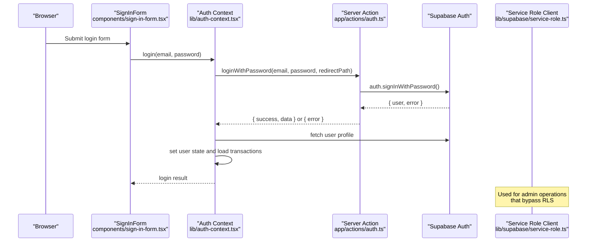

**Diagram sources**
- [sign-in-form.tsx:32](file://components/sign-in-form.tsx#L32)
- [auth-context.tsx:129-163](file://lib/auth-context.tsx#L129-L163)
- [auth.ts:8-23](file://app/actions/auth.ts#L8-L23)
- [service-role.ts:27-38](file://lib/supabase/service-role.ts#L27-L38)

**Section sources**
- [auth-context.tsx:129-163](file://lib/auth-context.tsx#L129-L163)
- [auth.ts:8-23](file://app/actions/auth.ts#L8-L23)
- [sign-in-form.tsx:32](file://components/sign-in-form.tsx#L32)
- [service-role.ts:27-38](file://lib/supabase/service-role.ts#L27-L38)

## Detailed Component Analysis

### Auth Context Provider
The auth context manages:
- Session initialization by fetching the current Supabase session and validating the user record
- User profile updates and account deletion (with anonymization)
- Transaction loading and status updates
- Login, signup, and logout flows orchestrated via server actions
- Service role client integration for administrative operations

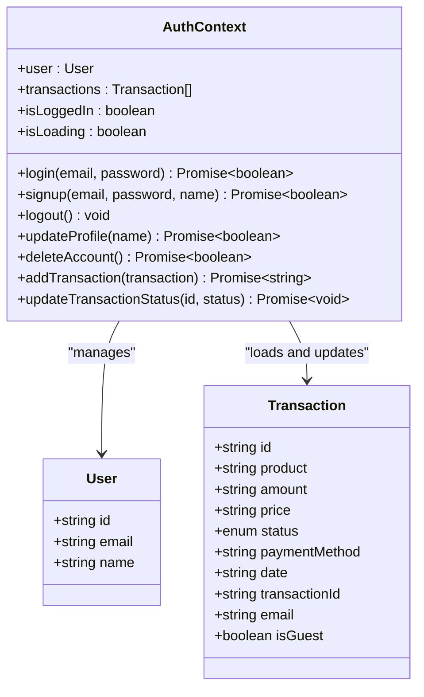

**Diagram sources**
- [auth-context.tsx:30-47](file://lib/auth-context.tsx#L30-L47)
- [auth-context.tsx:8-28](file://lib/auth-context.tsx#L8-L28)

**Section sources**
- [auth-context.tsx:51-92](file://lib/auth-context.tsx#L51-L92)
- [auth-context.tsx:129-163](file://lib/auth-context.tsx#L129-L163)
- [auth-context.tsx:165-181](file://lib/auth-context.tsx#L165-L181)
- [auth-context.tsx:204-208](file://lib/auth-context.tsx#L204-L208)
- [auth-context.tsx:94-127](file://lib/auth-context.tsx#L94-L127)
- [auth-context.tsx:240-344](file://lib/auth-context.tsx#L240-L344)

### Server Actions for Auth Operations
Server actions encapsulate Supabase Auth operations:
- loginWithPassword: Signs in with email/password and returns serializable results
- signupWithPassword: Creates a new user, inserts profile, and sends a welcome email
- logoutUser: Signs out and redirects

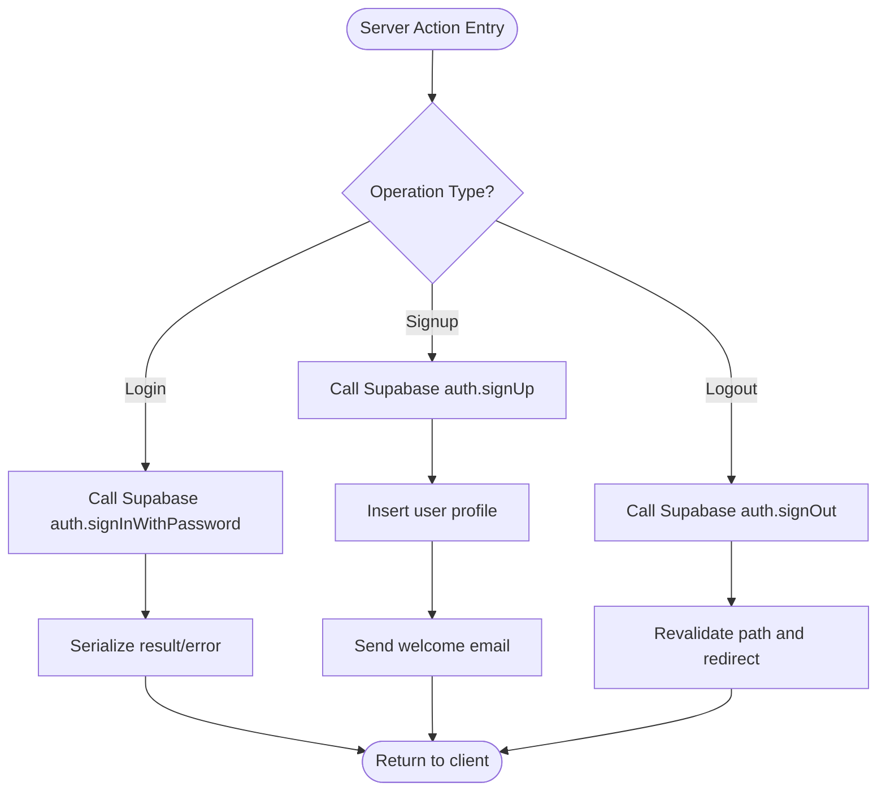

**Diagram sources**
- [auth.ts:8-67](file://app/actions/auth.ts#L8-L67)

**Section sources**
- [auth.ts:8-23](file://app/actions/auth.ts#L8-L23)
- [auth.ts:25-59](file://app/actions/auth.ts#L25-L59)
- [auth.ts:61-67](file://app/actions/auth.ts#L61-L67)

### Middleware Protection for Admin Routes
The middleware synchronizes Supabase session cookies and enforces basic protection for admin routes:
- updateSession refreshes session cookies for SSR
- Redirects unauthenticated users to the admin login page for /admin/dashboard routes
- Rewrites admin subdomain requests to the admin path

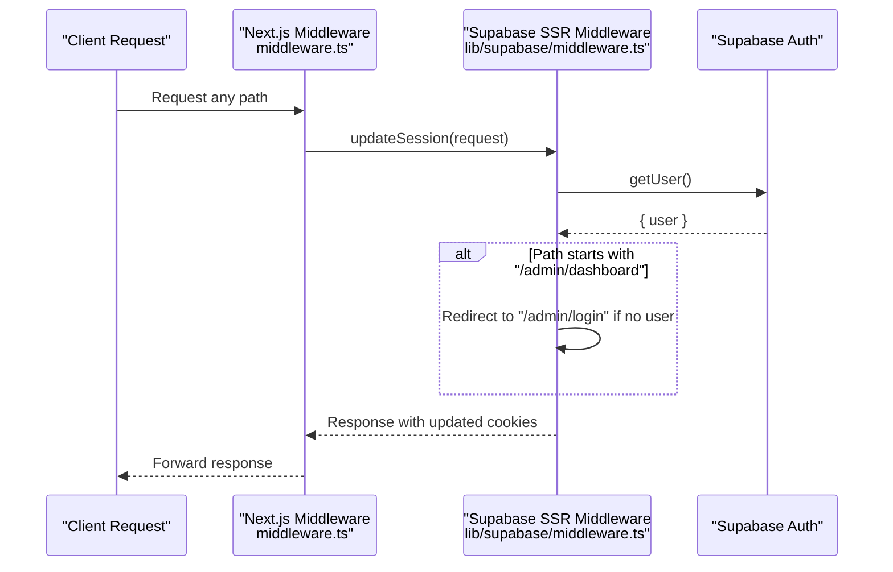

**Diagram sources**
- [middleware.ts:4-6](file://middleware.ts#L4-L6)
- [supabase/middleware.ts:4-95](file://lib/supabase/middleware.ts#L4-L95)

**Section sources**
- [middleware.ts:4-6](file://middleware.ts#L4-L6)
- [supabase/middleware.ts:4-95](file://lib/supabase/middleware.ts#L4-L95)

### Admin Login Flow
The admin login page performs:
- Secure login via server action
- Verifies admin role by querying the admin_users table
- Redirects to the admin dashboard upon successful verification

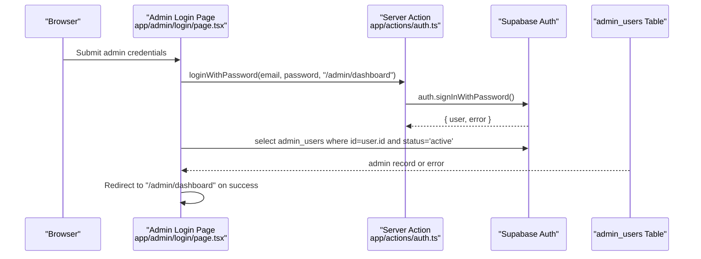

**Diagram sources**
- [admin-login/page.tsx:23-61](file://app/admin/login/page.tsx#L23-L61)
- [auth.ts:8-23](file://app/actions/auth.ts#L8-L23)

**Section sources**
- [admin-login/page.tsx:23-61](file://app/admin/login/page.tsx#L23-L61)
- [auth.ts:8-23](file://app/actions/auth.ts#L8-L23)

### Protected Admin Pages and Role-Based Access Control
- Admin layout does not perform client-side redirects; edge middleware provides initial protection.
- Admin dashboard and admin users page rely on Supabase session presence and role verification.
- Service role client ensures administrative operations bypass Row-Level Security.
- Client-side role checks prevent modifications to main admin accounts.

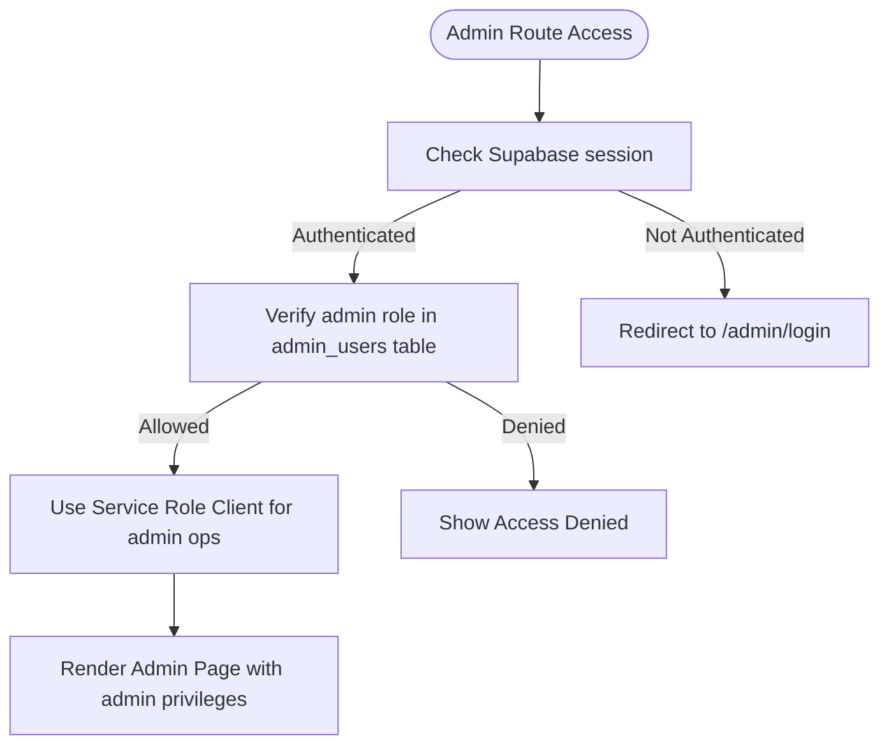

**Diagram sources**
- [supabase/middleware.ts:62-76](file://lib/supabase/middleware.ts#L62-L76)
- [admin-dashboard/page.tsx:32-45](file://app/admin/dashboard/page.tsx#L32-L45)
- [admin-users/page.tsx:283-295](file://app/admin/dashboard/admin-users/page.tsx#L283-L295)
- [service-role.ts:27-38](file://lib/supabase/service-role.ts#L27-L38)

**Section sources**
- [admin/layout.tsx:13-14](file://app/admin/layout.tsx#L13-L14)
- [admin-dashboard/page.tsx:32-45](file://app/admin/dashboard/page.tsx#L32-L45)
- [admin-users/page.tsx:283-295](file://app/admin/dashboard/admin-users/page.tsx#L283-L295)
- [service-role.ts:27-38](file://lib/supabase/service-role.ts#L27-L38)

### Sign-In Form Component
The sign-in form integrates with the auth context:
- Handles login and signup submissions
- Validates passwords and triggers toast feedback
- Resets form state on success and closes dialogs

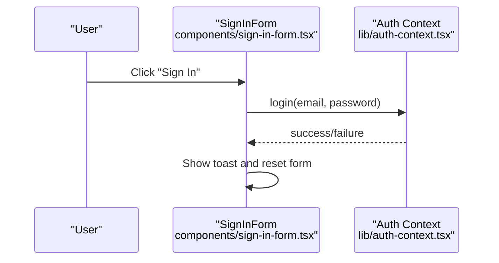

**Diagram sources**
- [sign-in-form.tsx:27-45](file://components/sign-in-form.tsx#L27-L45)
- [auth-context.tsx:129-163](file://lib/auth-context.tsx#L129-L163)

**Section sources**
- [sign-in-form.tsx:18-80](file://components/sign-in-form.tsx#L18-L80)
- [auth-context.tsx:129-163](file://lib/auth-context.tsx#L129-L163)

### Session Persistence and Initialization
- On initial load, the auth context retrieves the current Supabase session and validates the user record.
- Transactions are loaded for authenticated users.
- Middleware ensures session cookies are synchronized for SSR.

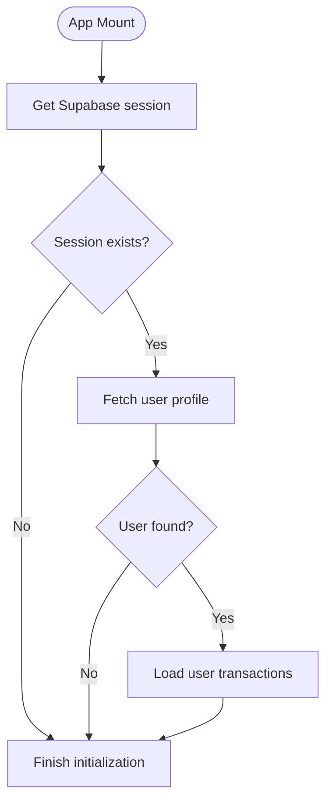

**Diagram sources**
- [auth-context.tsx:56-92](file://lib/auth-context.tsx#L56-L92)
- [auth-context.tsx:94-127](file://lib/auth-context.tsx#L94-L127)
- [supabase/middleware.ts:55-58](file://lib/supabase/middleware.ts#L55-L58)

**Section sources**
- [auth-context.tsx:56-92](file://lib/auth-context.tsx#L56-L92)
- [auth-context.tsx:94-127](file://lib/auth-context.tsx#L94-L127)
- [supabase/middleware.ts:55-58](file://lib/supabase/middleware.ts#L55-L58)

## Service Role Client Integration

### Service Role Client Implementation
The Service Role Client provides administrative operations that bypass Row-Level Security entirely. It uses the SUPABASE_SERVICE_ROLE_KEY environment variable to create a client with full database access privileges.

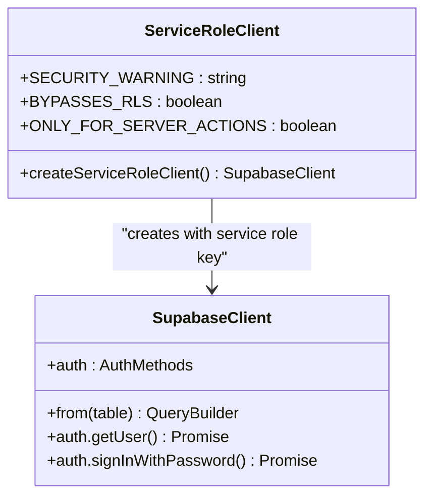

**Diagram sources**
- [service-role.ts:27-38](file://lib/supabase/service-role.ts#L27-L38)

**Section sources**
- [service-role.ts:1-39](file://lib/supabase/service-role.ts#L1-L39)

### Security Model and Best Practices
The Service Role Client operates under strict security guidelines:
- **Never exposed to browsers** - Only used in server-side operations
- **Bypasses RLS entirely** - Full database access for administrative tasks
- **Treat as root password** - Handle with extreme security precautions
- **Used only for trusted operations** - Admin user management, statistics, and critical operations

**Section sources**
- [service-role.ts:10-14](file://lib/supabase/service-role.ts#L10-L14)
- [service-role.ts:27-38](file://lib/supabase/service-role.ts#L27-L38)

### Administrative Operations Using Service Role
Administrative operations that require bypassing RLS include:
- Admin user creation and management
- Role-based access control enforcement
- Statistics and analytics queries
- Transaction processing for guest users
- Bulk administrative operations

**Section sources**
- [admin-users.ts:29-53](file://app/actions/admin-users.ts#L29-L53)
- [admin-users.ts:59-93](file://app/actions/admin-users.ts#L59-L93)
- [admin-users.ts:99-125](file://app/actions/admin-users.ts#L99-L125)
- [admin-users.ts:131-154](file://app/actions/admin-users.ts#L131-L154)
- [transactions.ts:22-81](file://app/actions/transactions.ts#L22-L81)

## Enhanced Admin Authentication Flows

### Multi-Layered Admin Verification
The enhanced admin authentication system implements multiple verification layers:
1. **Edge Middleware Protection** - Basic session validation for admin routes
2. **Server Action Authentication** - Secure login with HTTP-only cookies
3. **Database Role Verification** - Admin role validation in admin_users table
4. **Service Role Authorization** - Administrative operation authorization

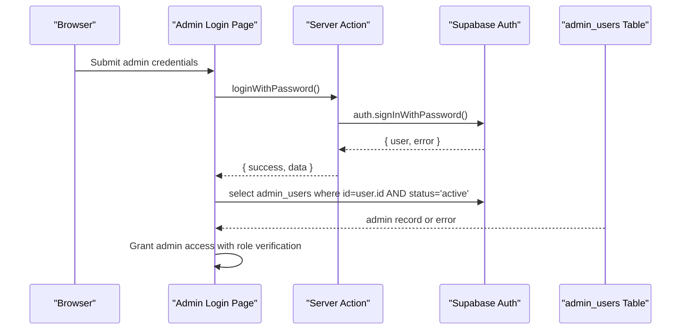

**Diagram sources**
- [admin-login/page.tsx:23-61](file://app/admin/login/page.tsx#L23-L61)
- [auth.ts:8-23](file://app/actions/auth.ts#L8-L23)

**Section sources**
- [admin-login/page.tsx:23-61](file://app/admin/login/page.tsx#L23-L61)
- [auth.ts:8-23](file://app/actions/auth.ts#L8-L23)

### Role-Based Access Control Implementation
The system implements hierarchical role-based access control:
- **Admin**: Full system access, can manage other admins
- **Sub-admin**: Limited administrative functions
- **Order Management**: Restricted to order processing functions
- **Status Management**: Active/Blocked status control

**Section sources**
- [supabase.ts:36-67](file://lib/supabase.ts#L36-L67)
- [admin-users.ts:29-53](file://app/actions/admin-users.ts#L29-L53)

### Admin User Management Operations
Administrative operations include:
- **User Promotion/Demotion**: Role changes with service role client
- **User Status Toggle**: Activate/deactivate admin accounts
- **User Deletion**: Complete removal from admin system
- **User Creation**: New admin registration with role assignment

**Section sources**
- [admin-users.ts:29-53](file://app/actions/admin-users.ts#L29-L53)
- [admin-users.ts:99-125](file://app/actions/admin-users.ts#L99-L125)
- [admin.ts:11-35](file://app/actions/admin.ts#L11-L35)

## Dependency Analysis
The authentication system exhibits clear separation of concerns with enhanced security boundaries:
- UI components depend on the auth context for state and operations
- Auth context depends on server actions for server-side auth operations
- Server actions depend on Supabase client for Auth operations
- Service role client depends on environment variables for security
- Admin actions depend on service role client for bypassing RLS
- Middleware depends on Supabase SSR client for session synchronization
- Admin pages depend on Supabase client and server actions for role verification

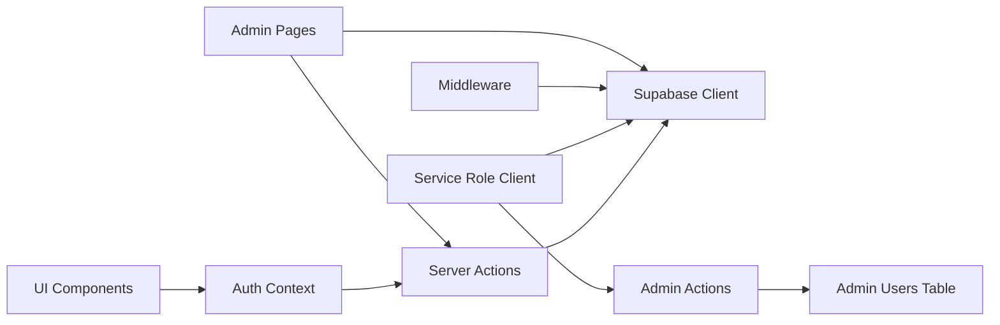

**Diagram sources**
- [auth-context.tsx:51-92](file://lib/auth-context.tsx#L51-L92)
- [auth.ts:8-67](file://app/actions/auth.ts#L8-L67)
- [supabase.ts:1-7](file://lib/supabase.ts#L1-L7)
- [middleware.ts:4-6](file://middleware.ts#L4-L6)
- [supabase/middleware.ts:4-95](file://lib/supabase/middleware.ts#L4-L95)
- [admin-login/page.tsx:23-61](file://app/admin/login/page.tsx#L23-L61)
- [service-role.ts:27-38](file://lib/supabase/service-role.ts#L27-L38)
- [admin-users.ts:1-155](file://app/actions/admin-users.ts#L1-L155)

**Section sources**
- [auth-context.tsx:51-92](file://lib/auth-context.tsx#L51-L92)
- [auth.ts:8-67](file://app/actions/auth.ts#L8-L67)
- [supabase.ts:1-7](file://lib/supabase.ts#L1-L7)
- [middleware.ts:4-6](file://middleware.ts#L4-L6)
- [supabase/middleware.ts:4-95](file://lib/supabase/middleware.ts#L4-L95)
- [admin-login/page.tsx:23-61](file://app/admin/login/page.tsx#L23-L61)
- [service-role.ts:27-38](file://lib/supabase/service-role.ts#L27-L38)
- [admin-users.ts:1-155](file://app/actions/admin-users.ts#L1-L155)

## Performance Considerations
- Prefer server actions for sensitive operations to leverage HTTP-only cookies and SSR benefits.
- Minimize repeated Supabase queries by caching user data in the auth context and using targeted selects.
- Use middleware to avoid unnecessary client-side redirects and to centralize session synchronization.
- Batch database operations where possible to reduce round-trips.
- Service role client operations should be optimized for administrative tasks that bypass RLS.
- Cache frequently accessed admin data to reduce database load during peak hours.

## Security Model and Best Practices

### Service Role Security Guidelines
The Service Role Client operates under strict security guidelines:
- **Environment Variable Protection** - SUPABASE_SERVICE_ROLE_KEY must be properly secured
- **Server-Side Only Usage** - Never expose to client-side code
- **Minimal Privilege Principle** - Use only when RLS bypass is absolutely necessary
- **Audit Logging** - Monitor all service role operations
- **Access Control** - Verify admin authentication before using service role client

### Administrative Operation Security
Administrative operations implement multiple security layers:
- **Admin Verification** - Verify user is in admin_users table with active status
- **Role Validation** - Check specific admin roles for sensitive operations
- **Operation Auditing** - Log all administrative actions
- **Input Validation** - Sanitize all inputs for administrative operations
- **Error Handling** - Graceful error handling without exposing system internals

**Section sources**
- [service-role.ts:10-14](file://lib/supabase/service-role.ts#L10-L14)
- [admin-users.ts:10-23](file://app/actions/admin-users.ts#L10-L23)
- [admin-users.ts:131-154](file://app/actions/admin-users.ts#L131-L154)

## Troubleshooting Guide
Common issues and resolutions:
- Login failures: Verify server action returns serialized errors and confirm Supabase credentials and network connectivity.
- Session not persisting: Ensure middleware is configured and cookies are being set/updated correctly.
- Admin access denied: Confirm the user exists in the admin_users table with active status and appropriate role.
- Transaction loading errors: Check database permissions and query correctness for transaction retrieval.
- Service role client errors: Verify SUPABASE_SERVICE_ROLE_KEY environment variable is properly configured.
- Administrative operation failures: Check admin verification process and role-based access controls.
- RLS bypass issues: Ensure service role client is used appropriately for administrative operations only.

**Section sources**
- [auth.ts:16-22](file://app/actions/auth.ts#L16-L22)
- [supabase/middleware.ts:13-53](file://lib/supabase/middleware.ts#L13-L53)
- [admin-login/page.tsx:47-52](file://app/admin/login/page.tsx#L47-L52)
- [auth-context.tsx:94-127](file://lib/auth-context.tsx#L94-L127)
- [service-role.ts:19-21](file://lib/supabase/service-role.ts#L19-L21)
- [admin-users.ts:42-45](file://app/actions/admin-users.ts#L42-L45)

## Conclusion
The enhanced authentication system combines Supabase Auth, React Context, Next.js middleware, and Service Role Client to deliver robust session management, secure server actions, admin route protection, and comprehensive role-based access control. The addition of Service Role Client integration enables administrative operations that require bypassing Row-Level Security while maintaining strict security boundaries. The design emphasizes separation of concerns, scalability, security best practices, and developer ergonomics, enabling straightforward extension for additional features such as advanced role-based navigation guards, real-time notifications, and comprehensive audit logging.