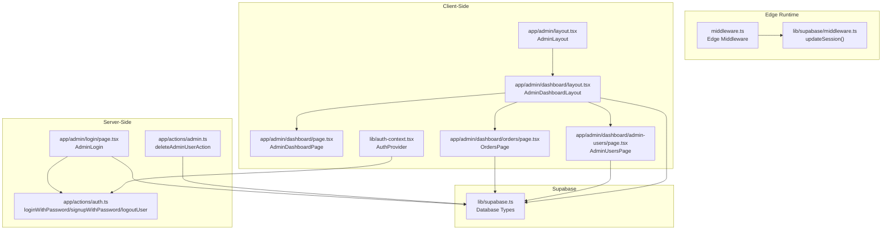
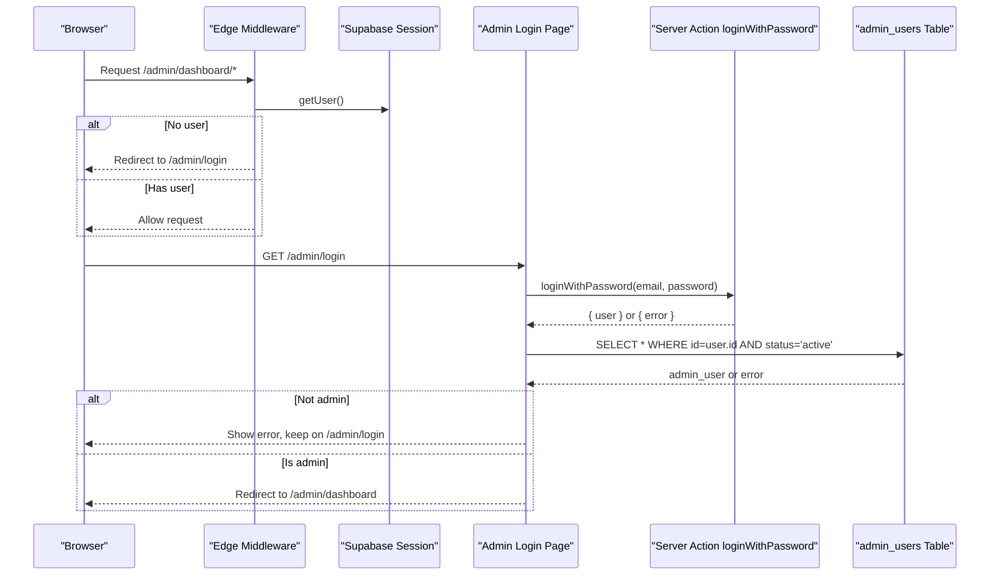
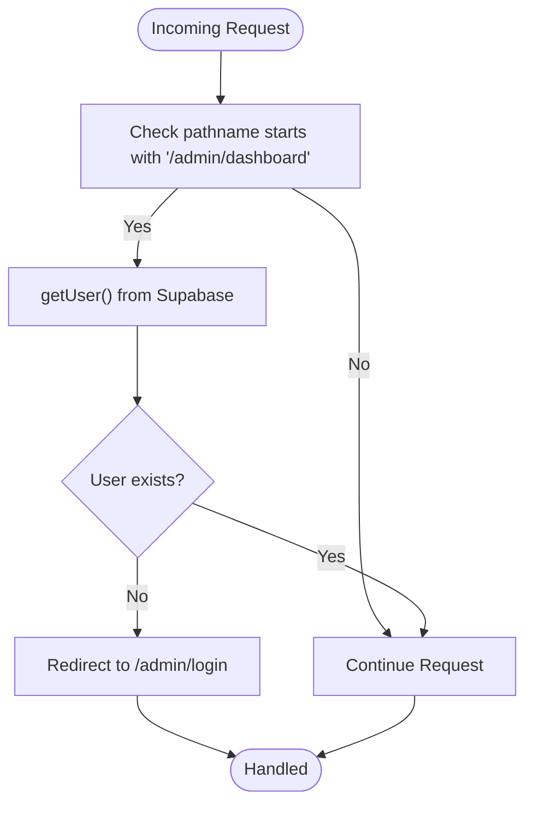
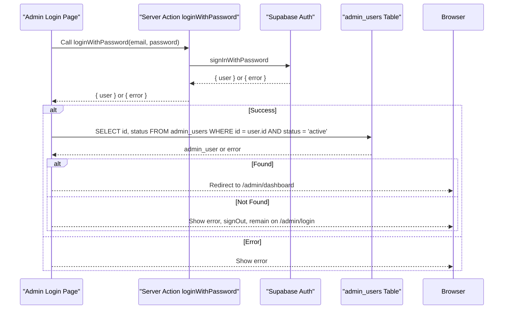
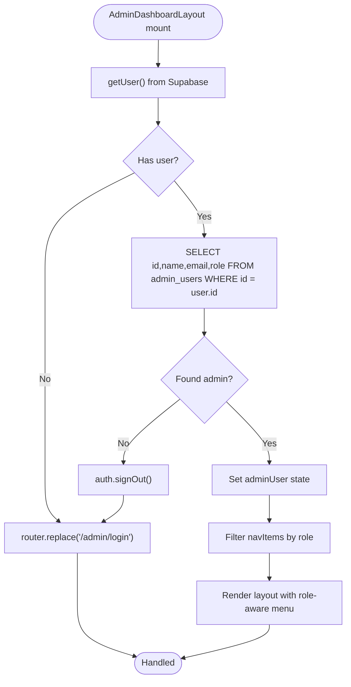
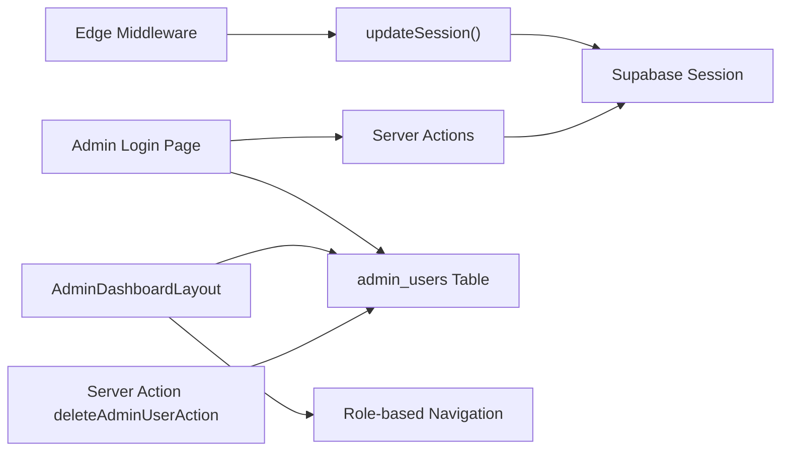

# Role-Based Access Control

<cite>
**Referenced Files in This Document**
- [middleware.ts](file://middleware.ts)
- [lib/supabase/middleware.ts](file://lib/supabase/middleware.ts)
- [lib/auth-context.tsx](file://lib/auth-context.tsx)
- [app/actions/auth.ts](file://app/actions/auth.ts)
- [app/admin/layout.tsx](file://app/admin/layout.tsx)
- [app/admin/login/page.tsx](file://app/admin/login/page.tsx)
- [app/admin/dashboard/layout.tsx](file://app/admin/dashboard/layout.tsx)
- [app/admin/dashboard/page.tsx](file://app/admin/dashboard/page.tsx)
- [app/admin/dashboard/admin-users/page.tsx](file://app/admin/dashboard/admin-users/page.tsx)
- [app/admin/dashboard/orders/page.tsx](file://app/admin/dashboard/orders/page.tsx)
- [lib/supabase.ts](file://lib/supabase.ts)
- [app/actions/admin.ts](file://app/actions/admin.ts)
</cite>

## Table of Contents
1. [Introduction](#introduction)
2. [Project Structure](#project-structure)
3. [Core Components](#core-components)
4. [Architecture Overview](#architecture-overview)
5. [Detailed Component Analysis](#detailed-component-analysis)
6. [Dependency Analysis](#dependency-analysis)
7. [Performance Considerations](#performance-considerations)
8. [Troubleshooting Guide](#troubleshooting-guide)
9. [Conclusion](#conclusion)

## Introduction
This document explains the role-based access control (RBAC) implementation for the administration portal. It covers how middleware enforces session-based protection for admin routes, how the admin login flow validates administrative privileges, how role verification occurs in server and client contexts, and how permission-based navigation is enforced. It also provides guidance for extending the system to additional user types and custom permission systems.

## Project Structure
The RBAC system spans middleware, authentication actions, admin pages, and Supabase types. Key areas:
- Edge middleware enforces session presence for admin routes.
- Admin login page authenticates users and verifies admin status against the admin_users table.
- Admin dashboard layout validates admin sessions and role-based navigation.
- Supabase types define the admin_users table schema and roles.
- Server actions encapsulate admin-specific operations.

**Diagram sources**
- [middleware.ts:1-11](file://middleware.ts#L1-L11)
- [lib/supabase/middleware.ts:1-96](file://lib/supabase/middleware.ts#L1-L96)
- [app/admin/layout.tsx:1-23](file://app/admin/layout.tsx#L1-L23)
- [app/admin/dashboard/layout.tsx:1-236](file://app/admin/dashboard/layout.tsx#L1-L236)
- [app/admin/dashboard/page.tsx:1-286](file://app/admin/dashboard/page.tsx#L1-L286)
- [app/admin/dashboard/admin-users/page.tsx:1-623](file://app/admin/dashboard/admin-users/page.tsx#L1-L623)
- [app/admin/dashboard/orders/page.tsx:1-643](file://app/admin/dashboard/orders/page.tsx#L1-L643)
- [lib/auth-context.tsx:1-374](file://lib/auth-context.tsx#L1-L374)
- [app/admin/login/page.tsx:1-145](file://app/admin/login/page.tsx#L1-L145)
- [app/actions/auth.ts:1-68](file://app/actions/auth.ts#L1-L68)
- [app/actions/admin.ts:1-35](file://app/actions/admin.ts#L1-L35)
- [lib/supabase.ts:1-188](file://lib/supabase.ts#L1-L188)

**Section sources**
- [middleware.ts:1-11](file://middleware.ts#L1-L11)
- [lib/supabase/middleware.ts:1-96](file://lib/supabase/middleware.ts#L1-L96)
- [app/admin/layout.tsx:1-23](file://app/admin/layout.tsx#L1-L23)
- [app/admin/dashboard/layout.tsx:1-236](file://app/admin/dashboard/layout.tsx#L1-L236)
- [app/admin/dashboard/page.tsx:1-286](file://app/admin/dashboard/page.tsx#L1-L286)
- [app/admin/dashboard/admin-users/page.tsx:1-623](file://app/admin/dashboard/admin-users/page.tsx#L1-L623)
- [app/admin/dashboard/orders/page.tsx:1-643](file://app/admin/dashboard/orders/page.tsx#L1-L643)
- [lib/auth-context.tsx:1-374](file://lib/auth-context.tsx#L1-L374)
- [app/admin/login/page.tsx:1-145](file://app/admin/login/page.tsx#L1-L145)
- [app/actions/auth.ts:1-68](file://app/actions/auth.ts#L1-L68)
- [app/actions/admin.ts:1-35](file://app/actions/admin.ts#L1-L35)
- [lib/supabase.ts:1-188](file://lib/supabase.ts#L1-L188)

## Core Components
- Edge middleware: Ensures session presence for admin routes and optionally redirects unauthenticated users to the admin login page.
- Admin login page: Uses server actions for authentication and checks admin status against the admin_users table.
- Admin dashboard layout: Validates admin session and role, controls navigation menu visibility per role, and handles logout.
- Supabase types: Define admin_users table structure and role enumeration.
- Server actions: Encapsulate admin operations such as deletion of admin users.

**Section sources**
- [lib/supabase/middleware.ts:62-76](file://lib/supabase/middleware.ts#L62-L76)
- [app/admin/login/page.tsx:23-61](file://app/admin/login/page.tsx#L23-L61)
- [app/admin/dashboard/layout.tsx:25-59](file://app/admin/dashboard/layout.tsx#L25-L59)
- [lib/supabase.ts:36-67](file://lib/supabase.ts#L36-L67)
- [app/actions/admin.ts:10-34](file://app/actions/admin.ts#L10-L34)

## Architecture Overview
The RBAC architecture combines edge middleware enforcement, client-side session validation, and role-based UI filtering. Admin routes under /admin/dashboard require a valid Supabase session. The admin login flow additionally verifies administrative role by querying the admin_users table. Once authenticated, the dashboard layout enforces role-based navigation and restricts sensitive operations.

**Diagram sources**
- [lib/supabase/middleware.ts:62-76](file://lib/supabase/middleware.ts#L62-L76)
- [app/admin/login/page.tsx:23-61](file://app/admin/login/page.tsx#L23-L61)
- [app/actions/auth.ts:8-23](file://app/actions/auth.ts#L8-L23)

## Detailed Component Analysis

### Edge Middleware Protection
- Purpose: Enforce session presence for admin routes and optionally guard against unauthorized access.
- Behavior:
  - Checks if the current pathname starts with /admin/dashboard.
  - If no Supabase user is present, redirects to /admin/login.
  - Notes indicate that additional role checks can be deferred to client/server components to reduce latency in edge middleware.

**Diagram sources**
- [lib/supabase/middleware.ts:62-76](file://lib/supabase/middleware.ts#L62-L76)

**Section sources**
- [lib/supabase/middleware.ts:62-76](file://lib/supabase/middleware.ts#L62-L76)
- [middleware.ts:4-10](file://middleware.ts#L4-L10)

### Admin Authentication Flow and Role Verification
- Client-side login:
  - Uses server action loginWithPassword to authenticate with Supabase.
  - On success, queries the admin_users table to confirm the user is an active admin.
  - Redirects to /admin/dashboard upon successful admin verification.
- Server action:
  - Performs Supabase authentication and returns structured results for client handling.

**Diagram sources**
- [app/admin/login/page.tsx:23-61](file://app/admin/login/page.tsx#L23-L61)
- [app/actions/auth.ts:8-23](file://app/actions/auth.ts#L8-L23)

**Section sources**
- [app/admin/login/page.tsx:23-61](file://app/admin/login/page.tsx#L23-L61)
- [app/actions/auth.ts:8-23](file://app/actions/auth.ts#L8-L23)

### Role Verification and Permission-Based Routing
- Admin dashboard layout:
  - Validates session via Supabase getUser().
  - Confirms admin role by querying admin_users and stores admin metadata.
  - Filters navigation items based on role (admin, sub_admin, order_management).
  - Provides role display names and handles logout.
- Admin users page:
  - Restricts access to main admin users only (role === "admin").
  - Allows promotions and deletions for non-main admin accounts.
- Orders page:
  - Applies role-based UI controls; order_management users cannot update statuses directly.

**Diagram sources**
- [app/admin/dashboard/layout.tsx:25-59](file://app/admin/dashboard/layout.tsx#L25-L59)
- [app/admin/dashboard/admin-users/page.tsx:283-295](file://app/admin/dashboard/admin-users/page.tsx#L283-L295)
- [app/admin/dashboard/orders/page.tsx:184-189](file://app/admin/dashboard/orders/page.tsx#L184-L189)

**Section sources**
- [app/admin/dashboard/layout.tsx:25-59](file://app/admin/dashboard/layout.tsx#L25-L59)
- [app/admin/dashboard/layout.tsx:103-126](file://app/admin/dashboard/layout.tsx#L103-L126)
- [app/admin/dashboard/admin-users/page.tsx:283-295](file://app/admin/dashboard/admin-users/page.tsx#L283-L295)
- [app/admin/dashboard/orders/page.tsx:184-189](file://app/admin/dashboard/orders/page.tsx#L184-L189)

### Protected Route Handling and Admin-Only Pages
- Admin login page:
  - Immediate client-side rendering; relies on middleware for auth detection.
- Admin users page:
  - Renders access denied if current user role is not "admin".
- Orders page:
  - Role-aware controls; order_management users see read-only status badges.

**Section sources**
- [app/admin/layout.tsx:13-14](file://app/admin/layout.tsx#L13-L14)
- [app/admin/dashboard/admin-users/page.tsx:283-295](file://app/admin/dashboard/admin-users/page.tsx#L283-L295)
- [app/admin/dashboard/orders/page.tsx:494-512](file://app/admin/dashboard/orders/page.tsx#L494-L512)

### Integration Between Authentication State and Route Protection
- Supabase session management:
  - Edge middleware refreshes and propagates session cookies.
  - Client-side AuthProvider initializes user state from Supabase session.
- Admin dashboard layout:
  - Performs secondary role verification using Supabase client to ensure session integrity and role validity.

**Section sources**
- [lib/supabase/middleware.ts:4-53](file://lib/supabase/middleware.ts#L4-L53)
- [lib/auth-context.tsx:56-92](file://lib/auth-context.tsx#L56-L92)
- [app/admin/dashboard/layout.tsx:25-59](file://app/admin/dashboard/layout.tsx#L25-L59)

### Admin User Detection and Session Validation
- Admin detection:
  - Admin login page queries admin_users table for active admin status.
  - Admin dashboard layout queries admin_users to populate role-aware UI.
- Session validation:
  - Admin dashboard layout validates session presence and clears invalid sessions.

**Section sources**
- [app/admin/login/page.tsx:37-52](file://app/admin/login/page.tsx#L37-L52)
- [app/admin/dashboard/layout.tsx:25-59](file://app/admin/dashboard/layout.tsx#L25-L59)

### Graceful Handling of Unauthorized Access Attempts
- Edge middleware:
  - Redirects unauthenticated users attempting to access admin routes.
- Admin login page:
  - Displays errors for invalid credentials or non-admin users, then signs out and remains on login.
- Admin dashboard layout:
  - Redirects invalid sessions to login and displays loading states during validation.

**Section sources**
- [lib/supabase/middleware.ts:62-76](file://lib/supabase/middleware.ts#L62-L76)
- [app/admin/login/page.tsx:31-52](file://app/admin/login/page.tsx#L31-L52)
- [app/admin/dashboard/layout.tsx:32-59](file://app/admin/dashboard/layout.tsx#L32-L59)

### Implementation Guidance for Extending RBAC
- Extend roles:
  - Add new role values to the admin_users role enum in Supabase types.
  - Update navigation filtering logic to include new roles.
- Custom permissions:
  - Introduce a permissions table and join with admin_users.
  - Enforce granular permissions per route or component using role-to-permission mappings.
- Additional user types:
  - Create separate tables for other user types (e.g., staff, auditors).
  - Add type-specific checks in middleware and client-side validators.
- Audit trail:
  - Log admin actions with timestamps and roles for compliance.

**Section sources**
- [lib/supabase.ts:42-42](file://lib/supabase.ts#L42-L42)
- [app/admin/dashboard/layout.tsx:103-126](file://app/admin/dashboard/layout.tsx#L103-L126)

## Dependency Analysis
The RBAC system depends on:
- Supabase for session management and role data.
- Server actions for authentication and admin operations.
- Client-side components for UI-driven role enforcement.

**Diagram sources**
- [lib/supabase/middleware.ts:4-96](file://lib/supabase/middleware.ts#L4-L96)
- [app/admin/login/page.tsx:23-61](file://app/admin/login/page.tsx#L23-L61)
- [app/actions/auth.ts:8-23](file://app/actions/auth.ts#L8-L23)
- [app/admin/dashboard/layout.tsx:25-59](file://app/admin/dashboard/layout.tsx#L25-L59)
- [app/actions/admin.ts:10-34](file://app/actions/admin.ts#L10-L34)

**Section sources**
- [lib/supabase/middleware.ts:4-96](file://lib/supabase/middleware.ts#L4-L96)
- [app/admin/login/page.tsx:23-61](file://app/admin/login/page.tsx#L23-L61)
- [app/actions/auth.ts:8-23](file://app/actions/auth.ts#L8-L23)
- [app/admin/dashboard/layout.tsx:25-59](file://app/admin/dashboard/layout.tsx#L25-L59)
- [app/actions/admin.ts:10-34](file://app/actions/admin.ts#L10-L34)

## Performance Considerations
- Minimize database queries in edge middleware to reduce latency; defer role checks to client/server components.
- Cache role and navigation data on the client after initial validation to avoid repeated queries.
- Use efficient filtering for role-based navigation to keep UI responsive.

## Troubleshooting Guide
- Users redirected to admin login unexpectedly:
  - Verify Supabase session cookie propagation and middleware matcher configuration.
- Admin login succeeds but redirect does not occur:
  - Ensure admin_users table contains an active record for the authenticated user.
- Role-based navigation missing items:
  - Confirm admin user role is correctly stored and matches expected values.
- Access denied on admin users page:
  - Only users with role "admin" can access this page; verify current user role.

**Section sources**
- [lib/supabase/middleware.ts:62-76](file://lib/supabase/middleware.ts#L62-L76)
- [app/admin/login/page.tsx:37-52](file://app/admin/login/page.tsx#L37-L52)
- [app/admin/dashboard/layout.tsx:103-126](file://app/admin/dashboard/layout.tsx#L103-L126)
- [app/admin/dashboard/admin-users/page.tsx:283-295](file://app/admin/dashboard/admin-users/page.tsx#L283-L295)

## Conclusion
The system enforces RBAC through a layered approach: edge middleware ensures session presence for admin routes, the admin login flow validates administrative role, and client-side components enforce role-based navigation and UI controls. Extending the system involves updating role enums, navigation filtering, and introducing granular permissions as needed.