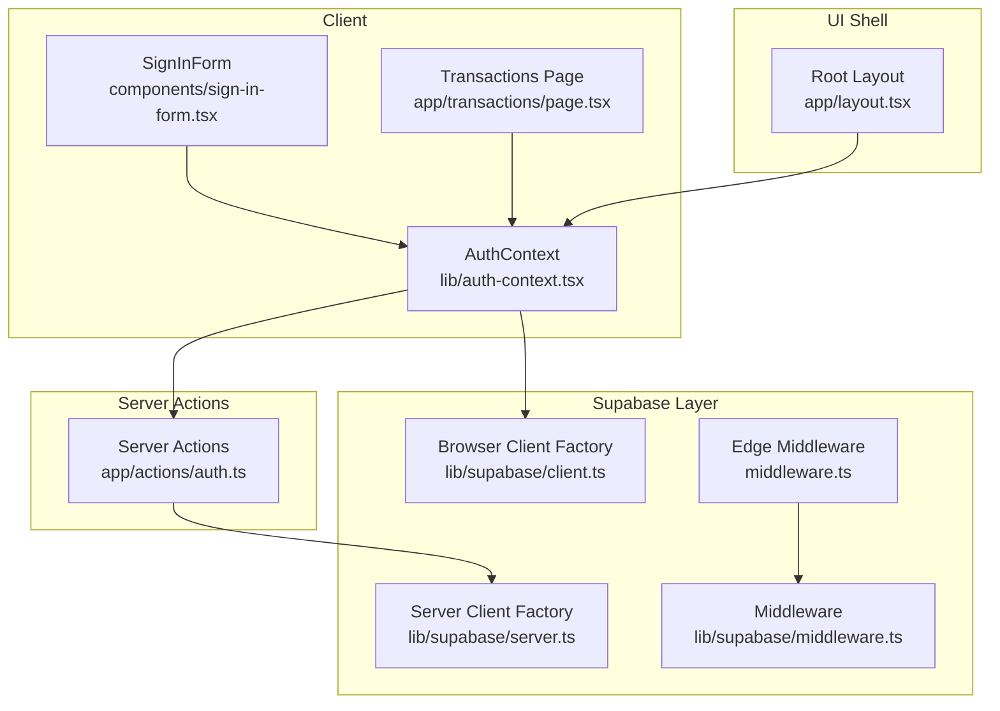
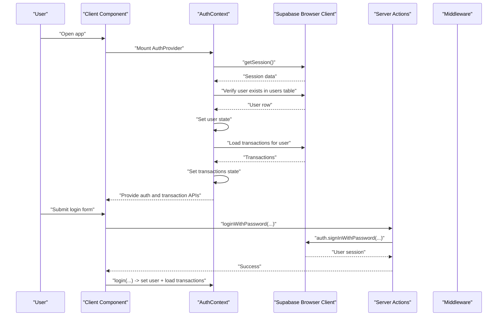
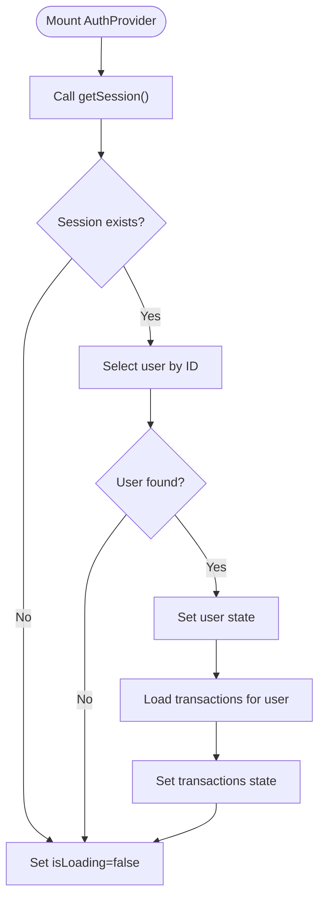
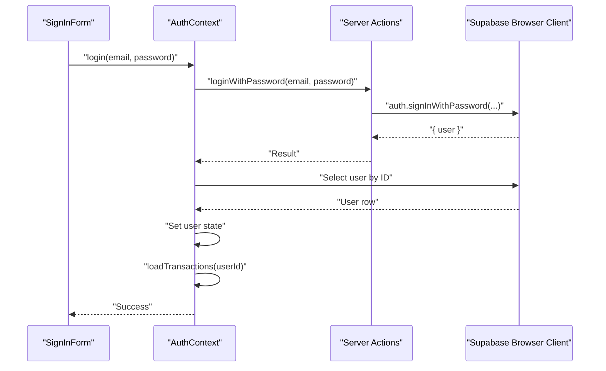
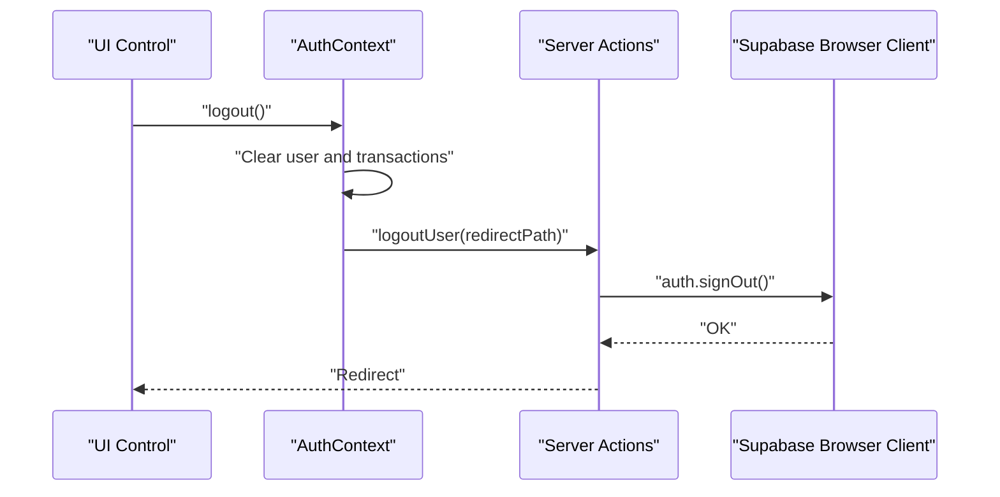
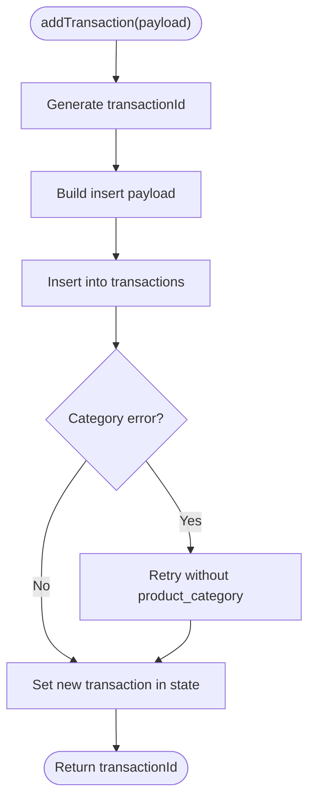
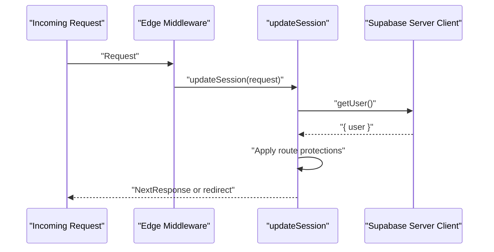
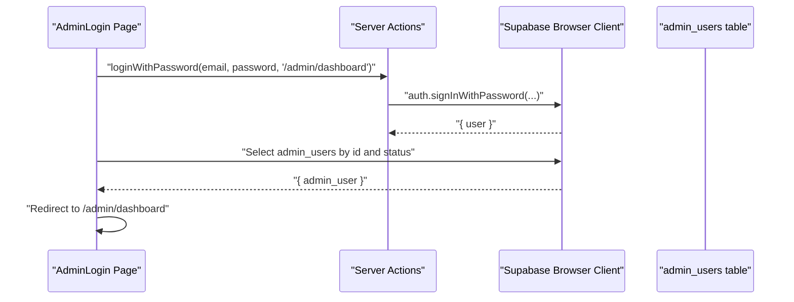
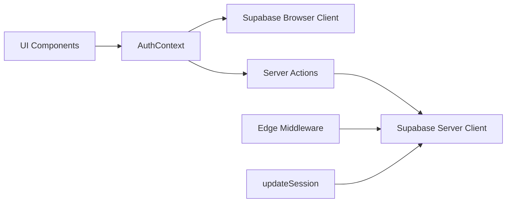

# Session Management

<cite>
**Referenced Files in This Document**
- [auth-context.tsx](file://lib/auth-context.tsx)
- [auth.ts](file://app/actions/auth.ts)
- [client.ts](file://lib/supabase/client.ts)
- [server.ts](file://lib/supabase/server.ts)
- [middleware.ts](file://lib/supabase/middleware.ts)
- [middleware.ts](file://middleware.ts)
- [layout.tsx](file://app/layout.tsx)
- [sign-in-form.tsx](file://components/sign-in-form.tsx)
- [admin-login.page.tsx](file://app/admin/login/page.tsx)
- [admin-orders.page.tsx](file://app/admin/dashboard/orders/page.tsx)
- [transactions.page.tsx](file://app/transactions/page.tsx)
- [supabase.ts](file://lib/supabase.ts)
</cite>

## Table of Contents
1. [Introduction](#introduction)
2. [Project Structure](#project-structure)
3. [Core Components](#core-components)
4. [Architecture Overview](#architecture-overview)
5. [Detailed Component Analysis](#detailed-component-analysis)
6. [Dependency Analysis](#dependency-analysis)
7. [Performance Considerations](#performance-considerations)
8. [Troubleshooting Guide](#troubleshooting-guide)
9. [Conclusion](#conclusion)

## Introduction
This document explains the session management implementation in the authentication system. It covers how user sessions are initialized, maintained, and destroyed across the application lifecycle. It documents the getSession() usage pattern, session verification processes, and automatic session restoration on page reload. It also describes how Supabase session management integrates with custom transaction state management, including loading and synchronizing user transactions during authentication initialization. Finally, it addresses session persistence, timeout handling, error recovery mechanisms, loading state management, and troubleshooting common session-related issues.

## Project Structure
The authentication and session management system spans client-side React context, server actions, Supabase clients, middleware, and UI components:
- Client context initializes and manages user and transaction state, and performs initial session restoration.
- Server actions handle login, signup, and logout with Supabase to ensure secure cookies.
- Supabase clients provide browser and server-side access to Supabase services.
- Middleware refreshes sessions for server components and enforces basic route protection.
- UI components consume the context and drive user interactions.

**Diagram sources**
- [auth-context.tsx:51-92](file://lib/auth-context.tsx#L51-L92)
- [sign-in-form.tsx:18-82](file://components/sign-in-form.tsx#L18-L82)
- [transactions.page.tsx:213-247](file://app/transactions/page.tsx#L213-L247)
- [auth.ts:8-67](file://app/actions/auth.ts#L8-L67)
- [client.ts:4-9](file://lib/supabase/client.ts#L4-L9)
- [server.ts:5-35](file://lib/supabase/server.ts#L5-L35)
- [middleware.ts:4-95](file://lib/supabase/middleware.ts#L4-L95)
- [middleware.ts:4-6](file://middleware.ts#L4-L6)
- [layout.tsx:32-38](file://app/layout.tsx#L32-L38)

**Section sources**
- [layout.tsx:32-38](file://app/layout.tsx#L32-L38)
- [auth-context.tsx:51-92](file://lib/auth-context.tsx#L51-L92)
- [auth.ts:8-67](file://app/actions/auth.ts#L8-L67)
- [client.ts:4-9](file://lib/supabase/client.ts#L4-L9)
- [server.ts:5-35](file://lib/supabase/server.ts#L5-L35)
- [middleware.ts:4-95](file://lib/supabase/middleware.ts#L4-L95)
- [middleware.ts:4-6](file://middleware.ts#L4-L6)

## Core Components
- AuthContext: Initializes session on mount, verifies user existence, loads transactions, and exposes login/signup/logout/update/delete plus transaction CRUD.
- Server Actions: Perform login, signup, and logout using Supabase auth to manage secure cookies.
- Supabase Clients: Browser client for client-side operations; server client for SSR and middleware.
- Middleware: Refreshes sessions for server components and enforces basic admin route protection.
- UI Integration: SignInForm triggers login/signup; Transactions page conditionally renders based on auth state; Admin login validates admin roles.

Key responsibilities:
- getSession(): Called during initialization to restore session state.
- Session verification: Confirms user exists in the users table after retrieving session.
- Automatic restoration: Runs once on app mount and sets loading state until completion.
- Transaction synchronization: Loads user transactions upon successful session restoration or login.

**Section sources**
- [auth-context.tsx:56-92](file://lib/auth-context.tsx#L56-L92)
- [auth-context.tsx:94-127](file://lib/auth-context.tsx#L94-L127)
- [auth.ts:8-67](file://app/actions/auth.ts#L8-L67)
- [client.ts:4-9](file://lib/supabase/client.ts#L4-L9)
- [server.ts:5-35](file://lib/supabase/server.ts#L5-L35)
- [middleware.ts:4-95](file://lib/supabase/middleware.ts#L4-L95)

## Architecture Overview
The session lifecycle is orchestrated by the AuthContext provider, which:
- On mount, retrieves the current session via Supabase browser client.
- Verifies the user exists in the users table and updates local user state.
- Loads transactions for the user and stores them in context.
- Exposes methods to login, signup, logout, update profile, delete account, and manage transactions.
- Server actions ensure secure cookies are set during login/signup/logout.
- Middleware refreshes sessions for server components and redirects unauthenticated users from protected routes.

**Diagram sources**
- [auth-context.tsx:56-92](file://lib/auth-context.tsx#L56-L92)
- [auth-context.tsx:94-127](file://lib/auth-context.tsx#L94-L127)
- [auth.ts:8-23](file://app/actions/auth.ts#L8-L23)
- [client.ts:4-9](file://lib/supabase/client.ts#L4-L9)
- [server.ts:5-35](file://lib/supabase/server.ts#L5-L35)

## Detailed Component Analysis

### AuthContext Initialization and getSession() Usage
- Initialization runs once on mount and sets isLoading true until completion.
- Retrieves session via Supabase browser client getSession().
- If a session exists, verifies the user record and updates local user state.
- Loads transactions for the user and sets the transactions array.
- Sets isLoading false regardless of success or error.

**Diagram sources**
- [auth-context.tsx:56-92](file://lib/auth-context.tsx#L56-L92)
- [auth-context.tsx:94-127](file://lib/auth-context.tsx#L94-L127)

**Section sources**
- [auth-context.tsx:56-92](file://lib/auth-context.tsx#L56-L92)
- [auth-context.tsx:94-127](file://lib/auth-context.tsx#L94-L127)

### Login and Signup Workflows
- Login:
  - Calls server action loginWithPassword to authenticate with Supabase.
  - On success, fetches user profile from users table and sets user state.
  - Loads transactions and returns success.
- Signup:
  - Calls server action signupWithPassword to create a new user.
  - Inserts a profile row into users table.
  - Invokes login with the newly created credentials.

**Diagram sources**
- [sign-in-form.tsx:27-45](file://components/sign-in-form.tsx#L27-L45)
- [auth-context.tsx:129-163](file://lib/auth-context.tsx#L129-L163)
- [auth.ts:8-23](file://app/actions/auth.ts#L8-L23)
- [client.ts:4-9](file://lib/supabase/client.ts#L4-L9)

**Section sources**
- [sign-in-form.tsx:27-45](file://components/sign-in-form.tsx#L27-L45)
- [auth-context.tsx:129-163](file://lib/auth-context.tsx#L129-L163)
- [auth.ts:8-23](file://app/actions/auth.ts#L8-L23)

### Logout and Account Deletion
- Logout:
  - Clears user and transactions state locally.
  - Calls server action logoutUser to sign out and redirect.
- Delete Account:
  - Anonymizes user data instead of deleting to preserve referential integrity.
  - Signs out the user afterward.

**Diagram sources**
- [auth-context.tsx:204-208](file://lib/auth-context.tsx#L204-L208)
- [auth.ts:61-67](file://app/actions/auth.ts#L61-L67)

**Section sources**
- [auth-context.tsx:204-208](file://lib/auth-context.tsx#L204-L208)
- [auth.ts:61-67](file://app/actions/auth.ts#L61-L67)

### Transaction State Management and Synchronization
- loadTransactions(userId):
  - Queries transactions for the given user, ordered by creation time.
  - Formats rows into the internal Transaction model and sets state.
- addTransaction():
  - Generates a unique transactionId.
  - Inserts a transaction row, handling optional product_category field.
  - Updates local state if a user is present.
- updateTransactionStatus():
  - Updates status in the database and synchronizes local state.

**Diagram sources**
- [auth-context.tsx:240-323](file://lib/auth-context.tsx#L240-L323)

**Section sources**
- [auth-context.tsx:94-127](file://lib/auth-context.tsx#L94-L127)
- [auth-context.tsx:240-323](file://lib/auth-context.tsx#L240-L323)
- [auth-context.tsx:325-344](file://lib/auth-context.tsx#L325-L344)

### Supabase Session Management and Middleware
- Browser client:
  - Provides createClient() returning a Supabase client configured with public env vars.
- Server client:
  - Provides createClient() for server actions and middleware using cookie store helpers.
- Middleware:
  - Creates a server client and refreshes session for server components.
  - Redirects unauthenticated users attempting to access admin routes.
  - Rewrites admin subdomain requests to admin paths.

**Diagram sources**
- [middleware.ts:4-6](file://middleware.ts#L4-L6)
- [middleware.ts:4-95](file://lib/supabase/middleware.ts#L4-L95)
- [server.ts:5-35](file://lib/supabase/server.ts#L5-L35)

**Section sources**
- [client.ts:4-9](file://lib/supabase/client.ts#L4-L9)
- [server.ts:5-35](file://lib/supabase/server.ts#L5-L35)
- [middleware.ts:4-95](file://lib/supabase/middleware.ts#L4-L95)
- [middleware.ts:4-6](file://middleware.ts#L4-L6)

### Admin Session Restoration and Role Verification
- Admin login page:
  - Uses server action for secure login.
  - After login, queries admin_users table to verify active admin role.
  - Redirects to admin dashboard on success.
- Admin orders page:
  - Demonstrates local storage usage for admin session restoration (distinct from Supabase session).
  - Loads all transactions from Supabase for admin review.

**Diagram sources**
- [admin-login.page.tsx:23-61](file://app/admin/login/page.tsx#L23-L61)

**Section sources**
- [admin-login.page.tsx:23-61](file://app/admin/login/page.tsx#L23-L61)
- [admin-orders.page.tsx:52-104](file://app/admin/dashboard/orders/page.tsx#L52-L104)

### UI Integration and Loading States
- Root layout wraps the app with AuthProvider and NotificationProvider.
- Transactions page shows a loading spinner while isLoading is true and redirects to home if not logged in.
- SignInForm triggers login/signup and displays feedback via toasts.

**Section sources**
- [layout.tsx:32-38](file://app/layout.tsx#L32-L38)
- [transactions.page.tsx:213-247](file://app/transactions/page.tsx#L213-L247)
- [sign-in-form.tsx:27-82](file://components/sign-in-form.tsx#L27-L82)

## Dependency Analysis
- AuthContext depends on:
  - Supabase browser client for session retrieval and user/transaction queries.
  - Server actions for secure authentication and logout.
- Server actions depend on:
  - Supabase server client to manage auth and insert user profiles.
- Middleware depends on:
  - Supabase server client to refresh sessions and protect routes.
- UI components depend on:
  - AuthContext for user and transaction state, and for invoking login/signup/logout.

**Diagram sources**
- [auth-context.tsx:56-92](file://lib/auth-context.tsx#L56-L92)
- [auth.ts:8-67](file://app/actions/auth.ts#L8-L67)
- [client.ts:4-9](file://lib/supabase/client.ts#L4-L9)
- [server.ts:5-35](file://lib/supabase/server.ts#L5-L35)
- [middleware.ts:4-6](file://middleware.ts#L4-L6)
- [middleware.ts:4-95](file://lib/supabase/middleware.ts#L4-L95)

**Section sources**
- [auth-context.tsx:56-92](file://lib/auth-context.tsx#L56-L92)
- [auth.ts:8-67](file://app/actions/auth.ts#L8-L67)
- [client.ts:4-9](file://lib/supabase/client.ts#L4-L9)
- [server.ts:5-35](file://lib/supabase/server.ts#L5-L35)
- [middleware.ts:4-95](file://lib/supabase/middleware.ts#L4-L95)
- [middleware.ts:4-6](file://middleware.ts#L4-L6)

## Performance Considerations
- Initial session check occurs once per page load; avoid redundant checks by relying on the single initialization in AuthProvider.
- Transaction loading uses a single query per user; consider pagination for large histories.
- Middleware getUser() is lightweight but should not be used for heavy DB queries; keep route protection logic minimal.
- Avoid unnecessary re-renders by memoizing callbacks in providers where appropriate.

## Troubleshooting Guide
Common issues and resolutions:
- Session not restored on reload:
  - Ensure AuthProvider is mounted at the root and getSession() is called during initialization.
  - Verify Supabase browser client is configured with correct environment variables.
- Login succeeds but user not set:
  - Confirm the users table contains a row for the returned user ID.
  - Check for errors during user verification and transaction load.
- Transactions not loading:
  - Verify the transactions query filters by user_id and ordering is correct.
  - Inspect network tab for query errors.
- Admin login fails:
  - Ensure admin_users table has an active record for the user ID.
  - Confirm server action returns success and the client proceeds to role check.
- Middleware redirect loops:
  - Review admin route protection logic and ensure redirect targets are correct.
- Logout does not clear state:
  - Confirm logout clears local user and transactions state and invokes server action.

**Section sources**
- [auth-context.tsx:56-92](file://lib/auth-context.tsx#L56-L92)
- [auth-context.tsx:94-127](file://lib/auth-context.tsx#L94-L127)
- [auth.ts:8-67](file://app/actions/auth.ts#L8-L67)
- [admin-login.page.tsx:23-61](file://app/admin/login/page.tsx#L23-L61)
- [middleware.ts:4-95](file://lib/supabase/middleware.ts#L4-L95)

## Conclusion
The session management system combines Supabase’s secure cookie-based authentication with a React context that maintains user and transaction state. Initialization restores sessions automatically, login/signup flows securely update state and data, and middleware ensures server components have refreshed sessions. Transaction state remains synchronized with the database, and UI components react to loading and authentication states. Proper configuration of Supabase clients and environment variables, along with careful handling of edge cases, ensures robust session behavior across the application lifecycle.