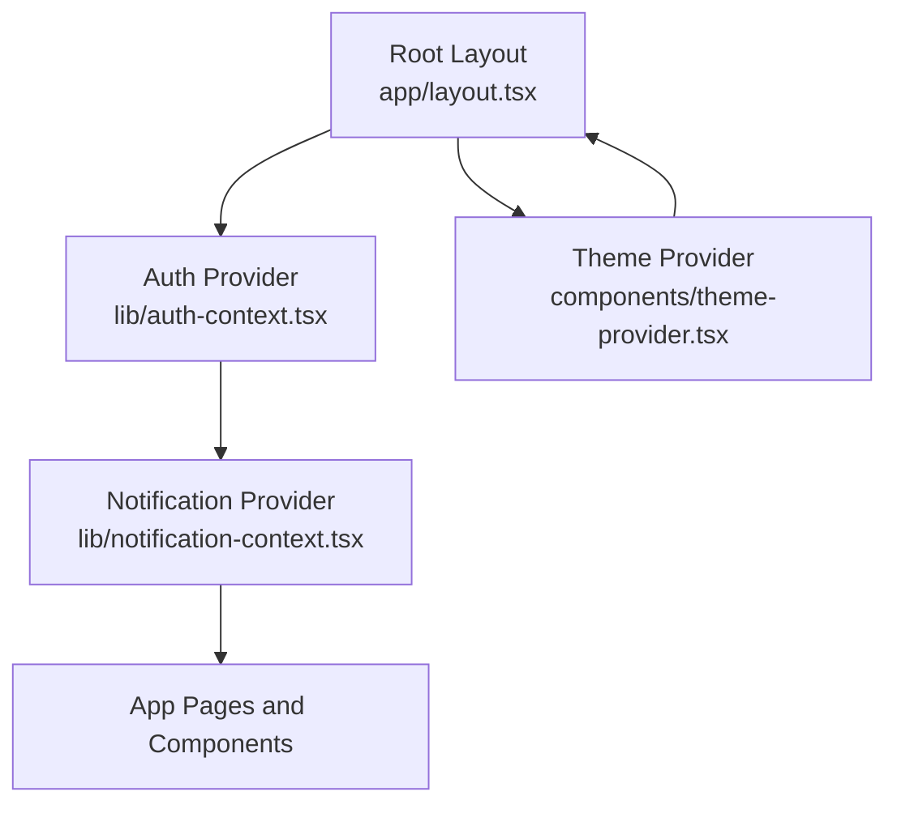
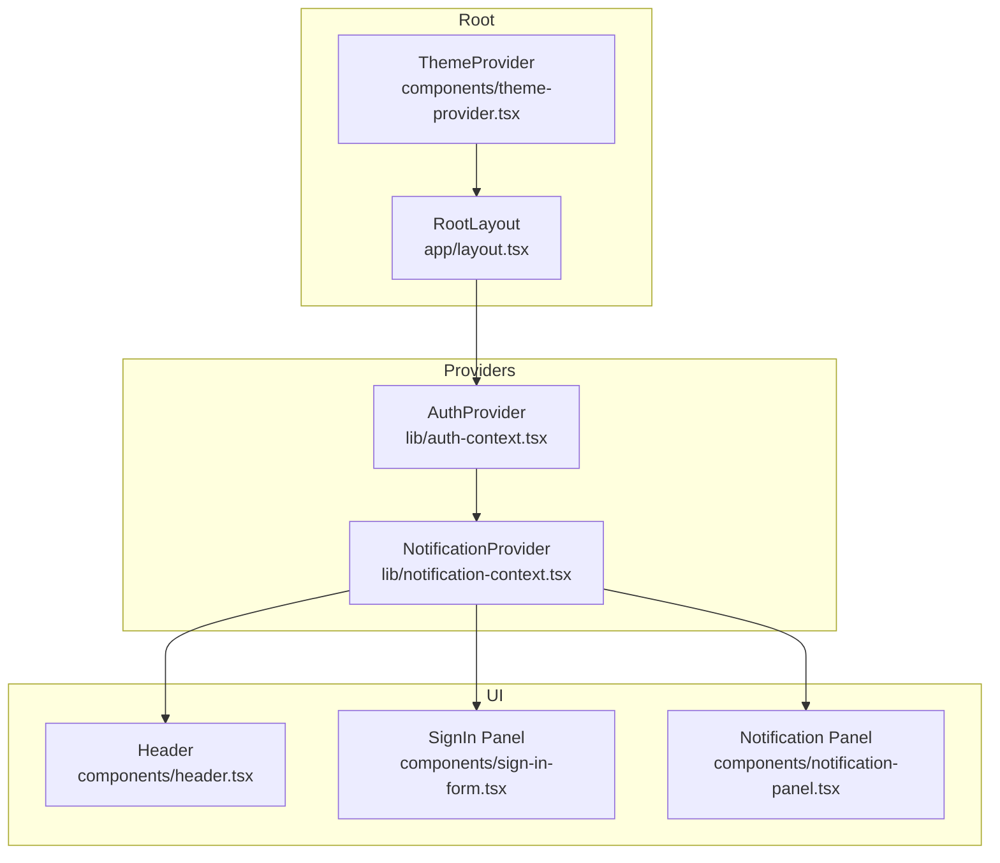
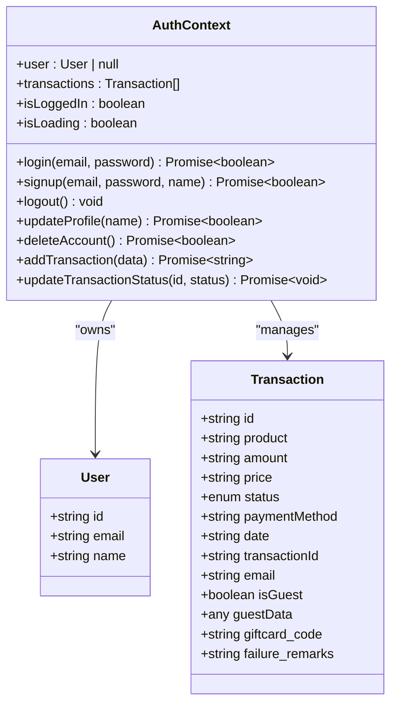
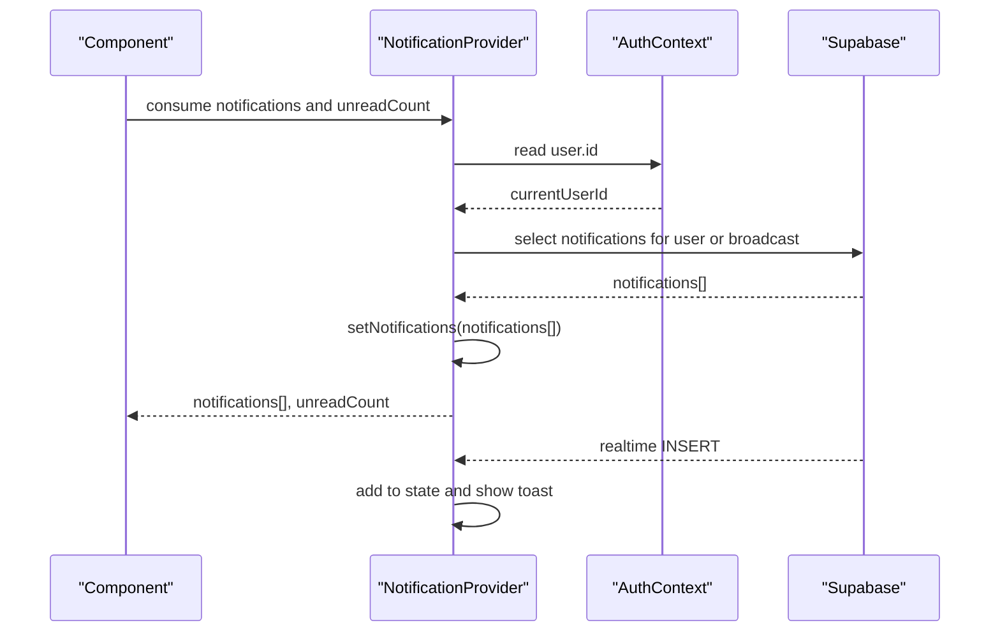
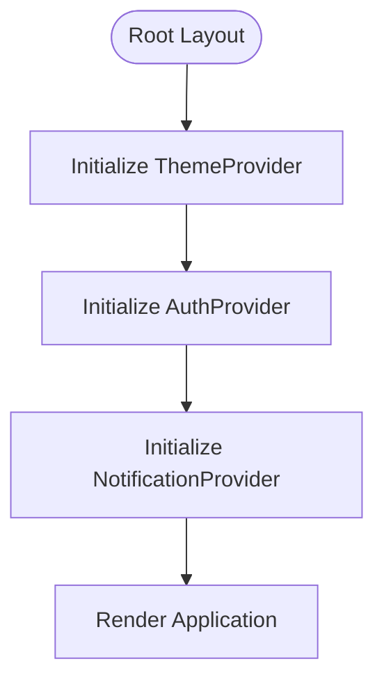
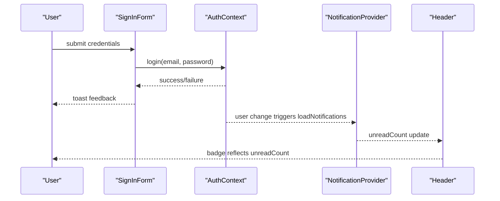
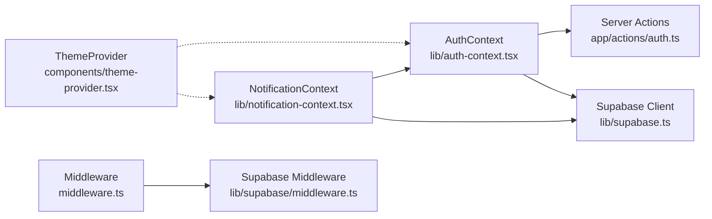

# State Management Integration

<cite>
**Referenced Files in This Document**
- [auth-context.tsx](file://lib/auth-context.tsx)
- [notification-context.tsx](file://lib/notification-context.tsx)
- [theme-provider.tsx](file://components/theme-provider.tsx)
- [layout.tsx](file://app/layout.tsx)
- [header.tsx](file://components/header.tsx)
- [notification-panel.tsx](file://components/notification-panel.tsx)
- [sign-in-form.tsx](file://components/sign-in-form.tsx)
- [auth.ts](file://app/actions/auth.ts)
- [middleware.ts](file://middleware.ts)
- [supabase/middleware.ts](file://lib/supabase/middleware.ts)
- [supabase.ts](file://lib/supabase.ts)
- [settings/page.tsx](file://app/settings/page.tsx)
</cite>

## Table of Contents
1. [Introduction](#introduction)
2. [Project Structure](#project-structure)
3. [Core Components](#core-components)
4. [Architecture Overview](#architecture-overview)
5. [Detailed Component Analysis](#detailed-component-analysis)
6. [Dependency Analysis](#dependency-analysis)
7. [Performance Considerations](#performance-considerations)
8. [Troubleshooting Guide](#troubleshooting-guide)
9. [Conclusion](#conclusion)

## Introduction
This document explains how authentication state management integrates with other system contexts to deliver a cohesive user experience. It focuses on the AuthContext provider hierarchy, how authentication state synchronizes with NotificationContext and ThemeProvider, and the global state management patterns used across the application. It also documents the useAuth hook, context consumption patterns, and state update propagation through the component tree. Finally, it addresses performance considerations for context providers, state normalization, and avoiding unnecessary re-renders.

## Project Structure
The application initializes global contexts at the root layout level and composes them to provide authentication, notifications, and theming to the entire UI tree. Authentication and notifications are tightly coupled to user identity, while theming is independent but integrated at the root.

**Diagram sources**
- [layout.tsx:33-38](file://app/layout.tsx#L33-L38)
- [auth-context.tsx:51-365](file://lib/auth-context.tsx#L51-L365)
- [notification-context.tsx:29-233](file://lib/notification-context.tsx#L29-L233)
- [theme-provider.tsx:9-11](file://components/theme-provider.tsx#L9-L11)

**Section sources**
- [layout.tsx:33-38](file://app/layout.tsx#L33-L38)

## Core Components
- AuthContext: Manages user session, transactions, and authentication lifecycle. Exposes useAuth hook for consuming context.
- NotificationContext: Manages user-specific notifications, real-time updates, and read/unread state. Depends on AuthContext for user identity.
- ThemeProvider: Provides theme switching capabilities via next-themes. Independent of auth and notifications but initialized at the root.

Key integration points:
- AuthContext loads user and transactions on initialization and exposes isLoggedIn, user, and transaction state.
- NotificationContext reads current user ID from AuthContext to filter and load user-specific notifications and real-time events.
- ThemeProvider wraps the root layout and is unaffected by authentication state changes.

**Section sources**
- [auth-context.tsx:30-47](file://lib/auth-context.tsx#L30-L47)
- [auth-context.tsx:51-365](file://lib/auth-context.tsx#L51-L365)
- [notification-context.tsx:17-25](file://lib/notification-context.tsx#L17-L25)
- [notification-context.tsx:29-233](file://lib/notification-context.tsx#L29-L233)
- [theme-provider.tsx:9-11](file://components/theme-provider.tsx#L9-L11)

## Architecture Overview
The provider hierarchy ensures that AuthContext is the foundation, followed by NotificationContext, and ThemeProvider wraps everything. This guarantees that:
- Authentication state is available to all components.
- Notifications are scoped to the current user.
- Theming is globally available and independent of user state.

**Diagram sources**
- [layout.tsx:33-38](file://app/layout.tsx#L33-L38)
- [auth-context.tsx:51-365](file://lib/auth-context.tsx#L51-L365)
- [notification-context.tsx:29-233](file://lib/notification-context.tsx#L29-L233)
- [header.tsx:73-74](file://components/header.tsx#L73-L74)
- [sign-in-form.tsx:25](file://components/sign-in-form.tsx#L25)
- [notification-panel.tsx:14](file://components/notification-panel.tsx#L14)

## Detailed Component Analysis

### AuthContext Provider and useAuth Hook
AuthContext centralizes authentication state and operations:
- Initializes session on mount by fetching the current Supabase session and verifying the user record.
- Loads user transactions and normalizes them into a consistent shape.
- Exposes login, signup, logout, updateProfile, deleteAccount, addTransaction, and updateTransactionStatus.
- Provides isLoading to coordinate UI loading states and isLoggedIn convenience flag.

**Diagram sources**
- [auth-context.tsx:8-47](file://lib/auth-context.tsx#L8-L47)
- [auth-context.tsx:51-365](file://lib/auth-context.tsx#L51-L365)

**Section sources**
- [auth-context.tsx:56-92](file://lib/auth-context.tsx#L56-L92)
- [auth-context.tsx:129-163](file://lib/auth-context.tsx#L129-L163)
- [auth-context.tsx:165-181](file://lib/auth-context.tsx#L165-L181)
- [auth-context.tsx:204-208](file://lib/auth-context.tsx#L204-L208)
- [auth-context.tsx:183-202](file://lib/auth-context.tsx#L183-L202)
- [auth-context.tsx:210-238](file://lib/auth-context.tsx#L210-L238)
- [auth-context.tsx:240-344](file://lib/auth-context.tsx#L240-L344)

### NotificationContext Provider and Integration with AuthContext
NotificationContext depends on AuthContext to:
- Determine the current user ID.
- Load user-specific notifications and broadcast notifications.
- Update read/unread state locally and in the database.
- Subscribe to real-time notifications via Supabase and show toast notifications.

**Diagram sources**
- [notification-context.tsx:36-66](file://lib/notification-context.tsx#L36-L66)
- [notification-context.tsx:164-170](file://lib/notification-context.tsx#L164-L170)
- [notification-context.tsx:173-220](file://lib/notification-context.tsx#L173-L220)
- [auth-context.tsx:31-32](file://lib/auth-context.tsx#L31-L32)

**Section sources**
- [notification-context.tsx:29-233](file://lib/notification-context.tsx#L29-L233)
- [notification-context.tsx:36-66](file://lib/notification-context.tsx#L36-L66)
- [notification-context.tsx:164-170](file://lib/notification-context.tsx#L164-L170)
- [notification-context.tsx:173-220](file://lib/notification-context.tsx#L173-L220)

### ThemeProvider Integration
ThemeProvider is a thin wrapper around next-themes and is initialized at the root. It does not depend on authentication state and remains stable across user sessions. It is placed outside the provider chain to avoid unnecessary re-renders when authentication state changes.

**Diagram sources**
- [layout.tsx:33-38](file://app/layout.tsx#L33-L38)
- [theme-provider.tsx:9-11](file://components/theme-provider.tsx#L9-L11)

**Section sources**
- [theme-provider.tsx:9-11](file://components/theme-provider.tsx#L9-L11)
- [layout.tsx:33-38](file://app/layout.tsx#L33-L38)

### Context Consumption Patterns and State Propagation
- Header consumes both AuthContext (user, isLoggedIn, logout) and NotificationContext (unreadCount) to render user menu and notification badge.
- SignInForm consumes AuthContext to perform login/signup and propagate state changes to downstream components.
- NotificationPanel consumes NotificationContext to display and manage notifications.
- Settings page consumes AuthContext to protect routes and update profile.

**Diagram sources**
- [sign-in-form.tsx:25](file://components/sign-in-form.tsx#L25)
- [auth-context.tsx:129-163](file://lib/auth-context.tsx#L129-L163)
- [notification-context.tsx:164-170](file://lib/notification-context.tsx#L164-L170)
- [header.tsx:73-74](file://components/header.tsx#L73-L74)

**Section sources**
- [header.tsx:73-74](file://components/header.tsx#L73-L74)
- [sign-in-form.tsx:25](file://components/sign-in-form.tsx#L25)
- [notification-panel.tsx:14](file://components/notification-panel.tsx#L14)
- [settings/page.tsx:31](file://app/settings/page.tsx#L31)

### Examples of Authentication State Affecting Other Contexts
- Notification unread count: When a user logs in, NotificationProvider detects the user change and loads notifications, updating unreadCount for the Header badge.
- User-specific UI behaviors: Header shows different menus depending on isLoggedIn and displays user initials/profile actions.
- Transaction history visibility: Protected pages like Settings rely on AuthContext.isLoggedIn to redirect unauthenticated users.

**Section sources**
- [notification-context.tsx:164-170](file://lib/notification-context.tsx#L164-L170)
- [header.tsx:190-250](file://components/header.tsx#L190-L250)
- [settings/page.tsx:42-45](file://app/settings/page.tsx#L42-L45)

## Dependency Analysis
- AuthContext depends on Supabase client and server actions for authentication operations.
- NotificationContext depends on AuthContext for user identity and Supabase for persistence and real-time.
- ThemeProvider is independent and does not depend on either AuthContext or NotificationContext.
- Middleware coordinates session updates and enforces access control for admin routes.

**Diagram sources**
- [auth-context.tsx:6](file://lib/auth-context.tsx#L6)
- [auth.ts:8-67](file://app/actions/auth.ts#L8-L67)
- [supabase.ts:1-7](file://lib/supabase.ts#L1-L7)
- [notification-context.tsx:4](file://lib/notification-context.tsx#L4)
- [theme-provider.tsx:9-11](file://components/theme-provider.tsx#L9-L11)
- [middleware.ts:4-6](file://middleware.ts#L4-L6)
- [supabase/middleware.ts:4-95](file://lib/supabase/middleware.ts#L4-L95)

**Section sources**
- [auth.ts:8-67](file://app/actions/auth.ts#L8-L67)
- [supabase.ts:1-7](file://lib/supabase.ts#L1-L7)
- [notification-context.tsx:4](file://lib/notification-context.tsx#L4)
- [middleware.ts:4-6](file://middleware.ts#L4-L6)
- [supabase/middleware.ts:4-95](file://lib/supabase/middleware.ts#L4-L95)

## Performance Considerations
- Provider hierarchy minimizes re-renders: AuthProvider is at the root; NotificationProvider is a sibling under AuthProvider; ThemeProvider wraps the whole tree. This avoids unnecessary re-renders when only notification state changes.
- State normalization: AuthContext normalizes transaction data upon load to a stable shape, reducing downstream computation overhead.
- Memoization: NotificationProvider uses useCallback for methods and filters unread notifications efficiently.
- Real-time updates: NotificationProvider subscribes to Supabase real-time events and deduplicates by ID to prevent duplicate entries.
- Avoiding redundant queries: NotificationProvider clears notifications when user logs out to prevent stale data.
- Loading states: AuthContext exposes isLoading to coordinate UI loading states and prevent premature renders.

[No sources needed since this section provides general guidance]

## Troubleshooting Guide
Common issues and resolutions:
- Authentication not persisting across reloads: Ensure middleware is configured to refresh sessions and maintain cookies.
- Notifications not appearing: Verify currentUserId is populated and NotificationProvider is mounted under AuthProvider.
- Toasts not showing: Confirm Toaster is rendered in the root layout and NotificationProvider’s real-time subscription is active.
- Admin access control: Middleware enforces session presence for admin routes; ensure Supabase user exists and admin_users table verification occurs on the client/server as needed.

**Section sources**
- [middleware.ts:4-6](file://middleware.ts#L4-L6)
- [supabase/middleware.ts:62-76](file://lib/supabase/middleware.ts#L62-L76)
- [notification-context.tsx:173-220](file://lib/notification-context.tsx#L173-L220)
- [layout.tsx:36](file://app/layout.tsx#L36)

## Conclusion
The integration of AuthContext, NotificationContext, and ThemeProvider creates a cohesive user experience by:
- Establishing a clear provider hierarchy with AuthContext at the root.
- Synchronizing authentication state with notifications through user-scoped loading and real-time updates.
- Keeping theming independent and globally available.
- Enforcing access control via middleware and protecting sensitive routes.

This design enables predictable state updates, efficient rendering, and a responsive UI that reacts to user authentication and notification events.