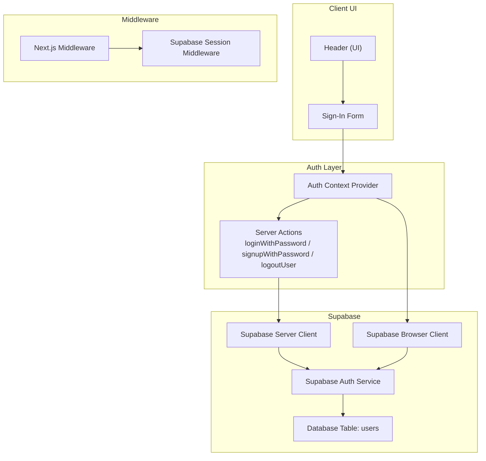
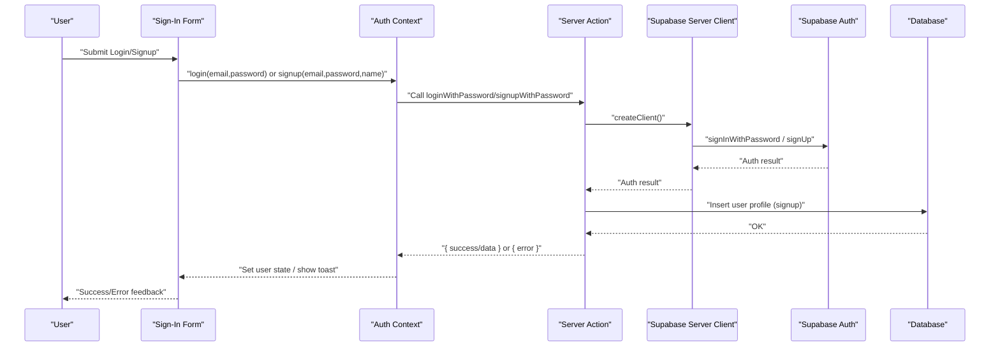
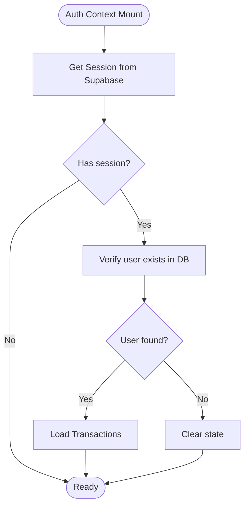
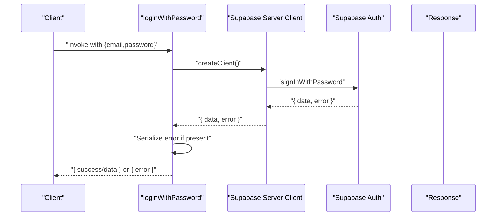
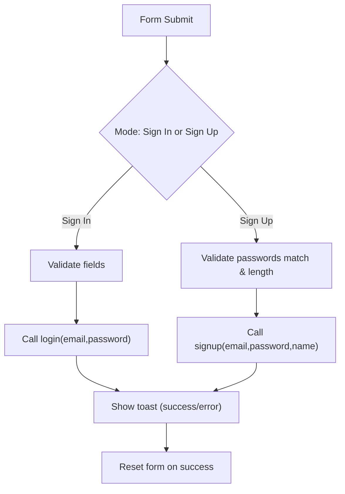
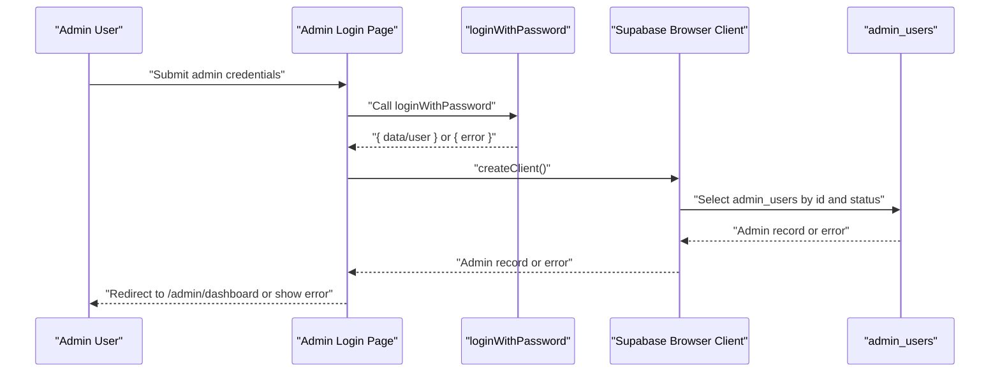
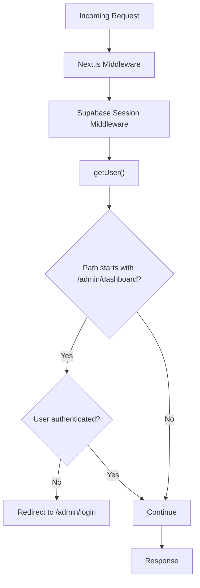
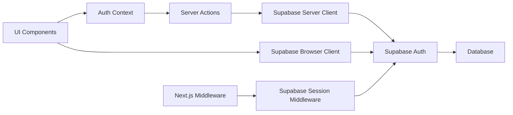

# User Authentication Flows

<cite>
**Referenced Files in This Document**
- [supabase.ts](file://lib/supabase.ts)
- [client.ts](file://lib/supabase/client.ts)
- [server.ts](file://lib/supabase/server.ts)
- [auth-context.tsx](file://lib/auth-context.tsx)
- [auth.ts](file://app/actions/auth.ts)
- [sign-in-form.tsx](file://components/sign-in-form.tsx)
- [header.tsx](file://components/header.tsx)
- [admin-login-page.tsx](file://app/admin/login/page.tsx)
- [middleware.ts](file://middleware.ts)
- [supabase-middleware.ts](file://lib/supabase/middleware.ts)
- [README.md](file://README.md)
</cite>

## Table of Contents
1. [Introduction](#introduction)
2. [Project Structure](#project-structure)
3. [Core Components](#core-components)
4. [Architecture Overview](#architecture-overview)
5. [Detailed Component Analysis](#detailed-component-analysis)
6. [Dependency Analysis](#dependency-analysis)
7. [Performance Considerations](#performance-considerations)
8. [Security Considerations](#security-considerations)
9. [Troubleshooting Guide](#troubleshooting-guide)
10. [Conclusion](#conclusion)

## Introduction
This document explains the user authentication flows for login, signup, and logout in the application. It focuses on password-based authentication using the loginWithPassword and signupWithPassword server actions, the sign-in form component integration, validation, and error handling. It also documents authentication state transitions, success/error handling, and user feedback mechanisms. Security considerations, input sanitization, and protections against common authentication vulnerabilities are addressed.

## Project Structure
Authentication spans client-side UI components, a React context provider, server actions, and Supabase integration. Key areas:
- Supabase client/server wrappers for SSR/SSG sessions
- Auth context managing user state and transactions
- Server actions implementing login/signup/logout
- Sign-in form component with validation and feedback
- Admin login page with role verification
- Middleware for session management and edge protection

**Diagram sources**
- [header.tsx](file://components/header.tsx)
- [sign-in-form.tsx](file://components/sign-in-form.tsx)
- [auth-context.tsx](file://lib/auth-context.tsx)
- [auth.ts](file://app/actions/auth.ts)
- [client.ts](file://lib/supabase/client.ts)
- [server.ts](file://lib/supabase/server.ts)
- [supabase.ts](file://lib/supabase.ts)
- [middleware.ts](file://middleware.ts)
- [supabase-middleware.ts](file://lib/supabase/middleware.ts)

**Section sources**
- [README.md](file://README.md)
- [supabase.ts](file://lib/supabase.ts)
- [client.ts](file://lib/supabase/client.ts)
- [server.ts](file://lib/supabase/server.ts)
- [auth-context.tsx](file://lib/auth-context.tsx)
- [auth.ts](file://app/actions/auth.ts)
- [sign-in-form.tsx](file://components/sign-in-form.tsx)
- [header.tsx](file://components/header.tsx)
- [admin-login-page.tsx](file://app/admin/login/page.tsx)
- [middleware.ts](file://middleware.ts)
- [supabase-middleware.ts](file://lib/supabase/middleware.ts)

## Core Components
- Supabase clients:
  - Browser client for client-side operations
  - Server client for server actions and middleware
- Auth context:
  - Provides login, signup, logout, and profile operations
  - Manages user session and transaction history
- Server actions:
  - Implement password-based login and signup
  - Insert user profiles and send welcome emails
  - Sign out and redirect
- Sign-in form:
  - Tabs for sign-in and sign-up
  - Client-side validation and feedback
- Admin login:
  - Enforces secure login and admin role checks
- Middleware:
  - Updates session and enforces edge protection for admin routes

**Section sources**
- [supabase.ts](file://lib/supabase.ts)
- [client.ts](file://lib/supabase/client.ts)
- [server.ts](file://lib/supabase/server.ts)
- [auth-context.tsx](file://lib/auth-context.tsx)
- [auth.ts](file://app/actions/auth.ts)
- [sign-in-form.tsx](file://components/sign-in-form.tsx)
- [admin-login-page.tsx](file://app/admin/login/page.tsx)
- [middleware.ts](file://middleware.ts)
- [supabase-middleware.ts](file://lib/supabase/middleware.ts)

## Architecture Overview
The authentication architecture separates concerns:
- UI triggers actions via the Auth Context
- Server actions call Supabase Auth APIs
- Supabase persists sessions and user data
- Middleware maintains session state across requests
- Client components reflect state changes and show feedback

**Diagram sources**
- [sign-in-form.tsx](file://components/sign-in-form.tsx)
- [auth-context.tsx](file://lib/auth-context.tsx)
- [auth.ts](file://app/actions/auth.ts)
- [server.ts](file://lib/supabase/server.ts)
- [supabase.ts](file://lib/supabase.ts)

## Detailed Component Analysis

### Auth Context Provider
The Auth Context manages:
- User session initialization and persistence
- Login, signup, logout, and profile update operations
- Transaction history loading and updates
- Error handling and user feedback via toasts

Key behaviors:
- On mount, fetches current session and verifies user existence
- Login:
  - Calls server action loginWithPassword
  - Validates returned user and loads profile
  - Loads transactions and sets state
- Signup:
  - Calls server action signupWithPassword
  - On success, automatically logs in via login
- Logout:
  - Clears local state and calls server action logoutUser

**Diagram sources**
- [auth-context.tsx](file://lib/auth-context.tsx)
- [server.ts](file://lib/supabase/server.ts)
- [supabase.ts](file://lib/supabase.ts)

**Section sources**
- [auth-context.tsx](file://lib/auth-context.tsx)

### Server Actions: loginWithPassword, signupWithPassword, logoutUser
- loginWithPassword:
  - Uses server client to call Supabase auth.signInWithPassword
  - Serializes errors for safe return
  - Revalidates path and returns success with user data
- signupWithPassword:
  - Uses server client to call Supabase auth.signUp
  - Inserts user profile into users table
  - Sends welcome email (best-effort)
  - Revalidates path and returns success
- logoutUser:
  - Signs out via Supabase auth
  - Revalidates path and redirects

**Diagram sources**
- [auth.ts](file://app/actions/auth.ts)
- [server.ts](file://lib/supabase/server.ts)
- [supabase.ts](file://lib/supabase.ts)

**Section sources**
- [auth.ts](file://app/actions/auth.ts)

### Sign-In Form Component
The sign-in form integrates with the Auth Context:
- Tabs for Sign In and Sign Up
- Client-side validation:
  - Password confirmation match
  - Minimum length validation
- Submission handling:
  - Calls login or signup from Auth Context
  - Shows success/error toasts
  - Resets form on success

**Diagram sources**
- [sign-in-form.tsx](file://components/sign-in-form.tsx)
- [auth-context.tsx](file://lib/auth-context.tsx)

**Section sources**
- [sign-in-form.tsx](file://components/sign-in-form.tsx)

### Admin Login Flow
The admin login page:
- Uses dynamic import to call loginWithPassword server action
- Verifies admin role and status using Supabase browser client
- Redirects to admin dashboard on success

**Diagram sources**
- [admin-login-page.tsx](file://app/admin/login/page.tsx)
- [auth.ts](file://app/actions/auth.ts)
- [client.ts](file://lib/supabase/client.ts)

**Section sources**
- [admin-login-page.tsx](file://app/admin/login/page.tsx)

### Middleware and Session Management
- Next.js middleware delegates session updates to Supabase middleware
- Supabase middleware:
  - Maintains session cookies
  - Enforces edge protection for admin routes
  - Rewrites admin subdomain paths

**Diagram sources**
- [middleware.ts](file://middleware.ts)
- [supabase-middleware.ts](file://lib/supabase/middleware.ts)

**Section sources**
- [middleware.ts](file://middleware.ts)
- [supabase-middleware.ts](file://lib/supabase/middleware.ts)

## Dependency Analysis
Authentication dependencies and interactions:
- UI depends on Auth Context
- Auth Context depends on server actions
- Server actions depend on Supabase server client and Supabase Auth
- Supabase server client depends on environment variables
- Client components depend on Supabase browser client for supplemental queries
- Middleware depends on Supabase session middleware

**Diagram sources**
- [header.tsx](file://components/header.tsx)
- [auth-context.tsx](file://lib/auth-context.tsx)
- [auth.ts](file://app/actions/auth.ts)
- [server.ts](file://lib/supabase/server.ts)
- [client.ts](file://lib/supabase/client.ts)
- [supabase.ts](file://lib/supabase.ts)
- [middleware.ts](file://middleware.ts)
- [supabase-middleware.ts](file://lib/supabase/middleware.ts)

**Section sources**
- [header.tsx](file://components/header.tsx)
- [auth-context.tsx](file://lib/auth-context.tsx)
- [auth.ts](file://app/actions/auth.ts)
- [server.ts](file://lib/supabase/server.ts)
- [client.ts](file://lib/supabase/client.ts)
- [supabase.ts](file://lib/supabase.ts)
- [middleware.ts](file://middleware.ts)
- [supabase-middleware.ts](file://lib/supabase/middleware.ts)

## Performance Considerations
- Minimize redundant DB reads:
  - Auth Context verifies user existence once per session initialization
  - Avoid repeated profile queries by caching user data in context
- Batch operations:
  - Server actions consolidate DB writes (e.g., user profile insertion)
- Network efficiency:
  - Use Supabase server client for server actions to avoid exposing keys
- UI responsiveness:
  - Disable submit buttons during async operations
  - Debounce or throttle form submissions where appropriate

## Security Considerations
- Input sanitization and validation:
  - Client-side validation prevents trivial submissions
  - Server actions enforce minimum password length and confirmation
- Secure storage:
  - Supabase handles session cookies securely; avoid logging sensitive data
- Least privilege:
  - Admin role verification occurs after login
- Error handling:
  - Serialize errors safely for return from server actions
  - Avoid leaking internal error details to users
- CSRF and session fixation:
  - Supabase manages secure cookies; rely on Supabase auth for session lifecycle
- Rate limiting and monitoring:
  - Consider adding rate limits at the server action level for login/signup endpoints
- Email delivery:
  - Welcome emails are sent server-side; failures are logged but do not block signup

## Troubleshooting Guide
Common issues and resolutions:
- Login fails with invalid credentials:
  - Server action returns serialized error message; Auth Context displays toast
  - Verify email/password and network connectivity
- Signup succeeds but login fails:
  - Auth Context attempts automatic login after signup; check server action response
- No account found with email:
  - Auth Context validates user existence in DB; ensure profile insertion succeeded
- Admin login denied:
  - Ensure user exists in admin_users table with active status
- Session not persisting:
  - Check middleware configuration and cookie settings
- Toasts not appearing:
  - Ensure Sonner is configured globally and toasts are enabled

**Section sources**
- [auth-context.tsx](file://lib/auth-context.tsx)
- [auth.ts](file://app/actions/auth.ts)
- [admin-login-page.tsx](file://app/admin/login/page.tsx)
- [supabase-middleware.ts](file://lib/supabase/middleware.ts)

## Conclusion
The authentication system combines a robust client-side UI with server actions and Supabase Auth to deliver secure, responsive login, signup, and logout experiences. The Auth Context centralizes state management and user feedback, while server actions encapsulate Supabase interactions and database updates. Middleware ensures session continuity and admin route protection. Adhering to the outlined security and performance practices will help maintain a reliable and trustworthy authentication flow.