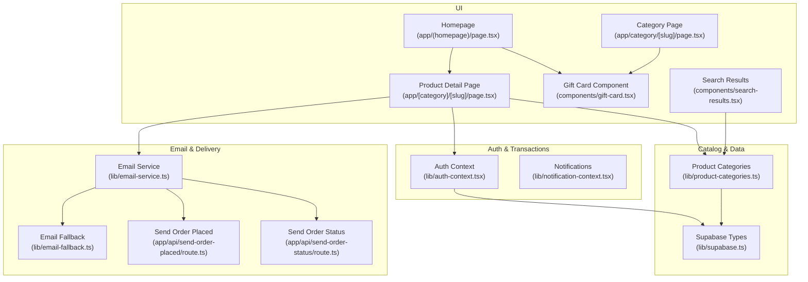
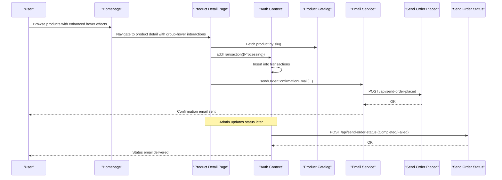
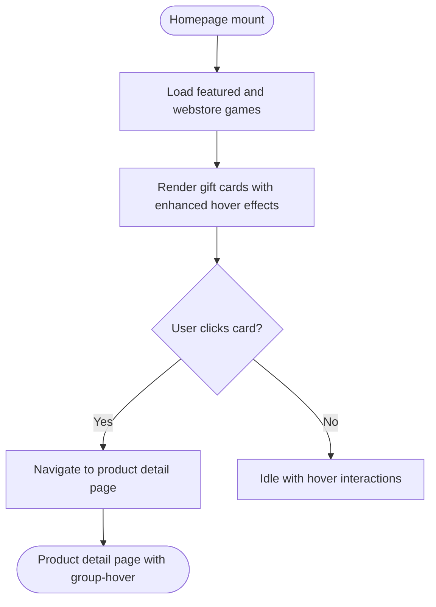
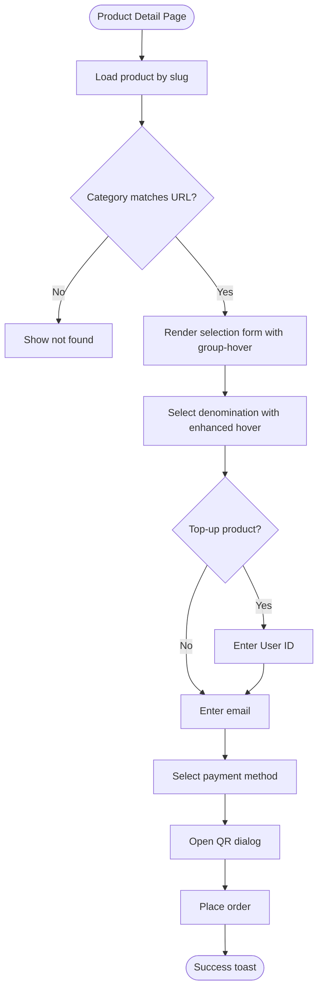
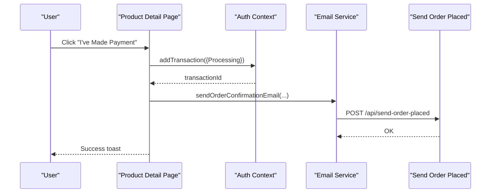
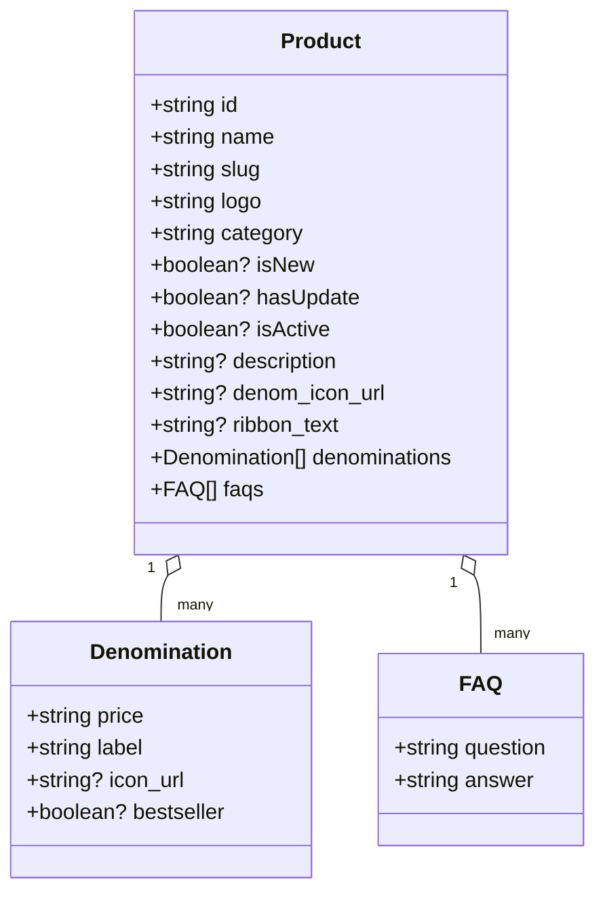
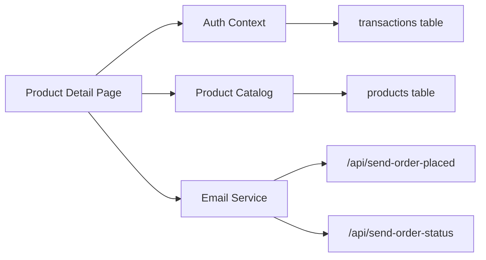
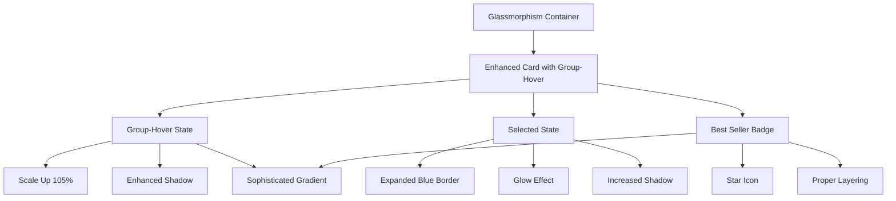
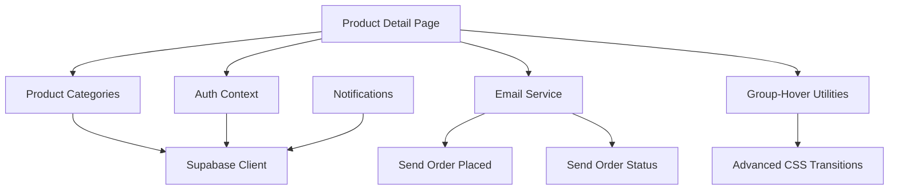
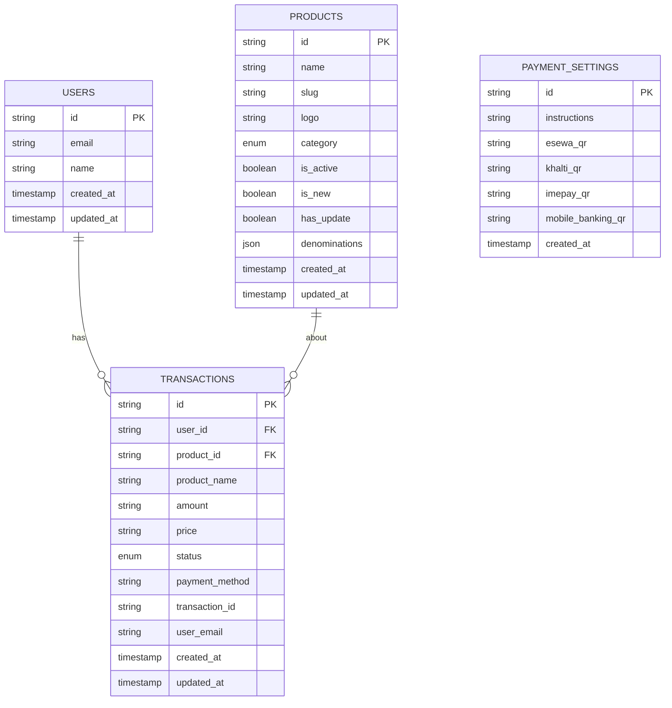

# Customer Experience Features

<cite>
**Referenced Files in This Document**
- [app/[category]/[slug]/page.tsx](file://app/[category]/[slug]/page.tsx)
- [lib/product-categories.ts](file://lib/product-categories.ts)
- [components/gift-card.tsx](file://components/gift-card.tsx)
- [lib/email-service.ts](file://lib/email-service.ts)
- [lib/supabase.ts](file://lib/supabase.ts)
- [lib/auth-context.tsx](file://lib/auth-context.tsx)
- [app/api/send-order-placed/route.ts](file://app/api/send-order-placed/route.ts)
- [app/api/send-order-status/route.ts](file://app/api/send-order-status/route.ts)
- [lib/notification-context.tsx](file://lib/notification-context.tsx)
- [app/(homepage)/page.tsx](file://app/(homepage)/page.tsx)
- [lib/email-fallback.ts](file://lib/email-fallback.ts)
- [components/search-results.tsx](file://components/search-results.tsx)
- [app/globals.css](file://app/globals.css)
- [styles/globals.css](file://styles/globals.css)
- [app/category/[slug]/page.tsx](file://app/category/[slug]/page.tsx)
- [components/ui/radio-group.tsx](file://components/ui/radio-group.tsx)
</cite>

## Update Summary
**Changes Made**
- Enhanced product detail page styling with sophisticated group-hover interaction system, improved denomination selection cards, glassmorphism effects, and upgraded hover states for better user experience
- Added advanced CSS transitions and Tailwind group-hover utilities for smooth state changes
- Implemented sophisticated card interactions with enhanced visual feedback and intelligent selection states
- Enhanced hover states with group-hover utilities creating more intuitive user experience through glassmorphism effects and improved transition animations
- **Updated** Enhanced product denomination selection interface with visual feedback including expanded borders with glow effects and hover states, improving user selection experience

## Table of Contents
1. [Introduction](#introduction)
2. [Project Structure](#project-structure)
3. [Core Components](#core-components)
4. [Architecture Overview](#architecture-overview)
5. [Detailed Component Analysis](#detailed-component-analysis)
6. [Enhanced Product Detail Page Styling](#enhanced-product-detail-page-styling)
7. [Dependency Analysis](#dependency-analysis)
8. [Performance Considerations](#performance-considerations)
9. [Troubleshooting Guide](#troubleshooting-guide)
10. [Conclusion](#conclusion)
11. [Appendices](#appendices)

## Introduction
This document explains the customer experience features for gift card purchasing and browsing. It covers product browsing, category-based filtering, gift card selection, and the purchase flow including denomination selection, email entry, QR payment processing, and instant delivery messaging. It also documents configuration options for product categories, pricing tiers, and delivery methods; relationships with authentication, database queries, and email services; and common customer journey issues with solutions.

**Updated** Enhanced with improved product detail page styling featuring sophisticated group-hover interaction system, enhanced visual feedback for selected denominations, and upgraded hover states that create a more intuitive user experience through glassmorphism effects and smooth transition animations. The denomination selection cards now feature advanced group-hover utilities with scaling, shadow enhancement, and color transitions, including expanded borders with glow effects for visual prominence.

## Project Structure
The gift card experience spans UI pages, product catalog utilities, authentication, email services, and Supabase data access. Key areas:
- Product browsing and selection: homepage and product detail pages
- Product catalog and caching: product categories module
- Authentication and transactions: auth context
- Email delivery: EmailJS and Resend integrations
- Notifications: in-app notifications
- Database schema: Supabase types and tables



**Diagram sources**
- [app/(homepage)/page.tsx:12-147](file://app/(homepage)/page.tsx#L12-L147)
- [app/[category]/[slug]/page.tsx:145-687](file://app/[category]/[slug]/page.tsx#L145-L687)
- [components/gift-card.tsx:17-68](file://components/gift-card.tsx#L17-L68)
- [components/search-results.tsx:12-97](file://components/search-results.tsx#L12-L97)
- [lib/product-categories.ts:200-363](file://lib/product-categories.ts#L200-L363)
- [lib/supabase.ts:10-188](file://lib/supabase.ts#L10-L188)
- [lib/auth-context.tsx:51-365](file://lib/auth-context.tsx#L51-L365)
- [lib/notification-context.tsx:29-242](file://lib/notification-context.tsx#L29-L242)
- [lib/email-service.ts:75-126](file://lib/email-service.ts#L75-L126)
- [lib/email-fallback.ts:3-31](file://lib/email-fallback.ts#L3-L31)
- [app/api/send-order-placed/route.ts:8-90](file://app/api/send-order-placed/route.ts#L8-L90)
- [app/api/send-order-status/route.ts:8-188](file://app/api/send-order-status/route.ts#L8-L188)
- [app/category/[slug]/page.tsx:30-273](file://app/category/[slug]/page.tsx#L30-L273)

**Section sources**
- [app/(homepage)/page.tsx:12-147](file://app/(homepage)/page.tsx#L12-L147)
- [app/[category]/[slug]/page.tsx:145-687](file://app/[category]/[slug]/page.tsx#L145-L687)
- [lib/product-categories.ts:200-363](file://lib/product-categories.ts#L200-L363)
- [lib/supabase.ts:10-188](file://lib/supabase.ts#L10-L188)
- [lib/auth-context.tsx:51-365](file://lib/auth-context.tsx#L51-L365)
- [lib/notification-context.tsx:29-242](file://lib/notification-context.tsx#L29-L242)
- [lib/email-service.ts:75-126](file://lib/email-service.ts#L75-L126)
- [lib/email-fallback.ts:3-31](file://lib/email-fallback.ts#L3-L31)
- [app/api/send-order-placed/route.ts:8-90](file://app/api/send-order-placed/route.ts#L8-L90)
- [app/api/send-order-status/route.ts:8-188](file://app/api/send-order-status/route.ts#L8-L188)
- [app/category/[slug]/page.tsx:30-273](file://app/category/[slug]/page.tsx#L30-L273)

## Core Components
- Product browsing and selection
  - Homepage lists featured gift cards and popular top-up products, linking to product detail pages with enhanced hover effects
  - Product detail page renders product info, FAQs, denomination options, and payment selection with sophisticated group-hover interactions
- Product catalog and caching
  - Loads products from Supabase with a 5-minute cache; falls back to static data if Supabase is unavailable
- Authentication and transactions
  - Adds transactions with a fixed "Processing" status and supports guest checkout for top-up products
- Email delivery
  - Sends order confirmation via Resend; gracefully falls back to a logging fallback if EmailJS is not configured
- Notifications
  - Provides in-app notifications and real-time updates via Supabase

**Section sources**
- [app/(homepage)/page.tsx:12-147](file://app/(homepage)/page.tsx#L12-L147)
- [app/[category]/[slug]/page.tsx:145-687](file://app/[category]/[slug]/page.tsx#L145-L687)
- [lib/product-categories.ts:200-363](file://lib/product-categories.ts#L200-L363)
- [lib/auth-context.tsx:240-323](file://lib/auth-context.tsx#L240-L323)
- [lib/email-service.ts:75-126](file://lib/email-service.ts#L75-L126)
- [lib/notification-context.tsx:120-161](file://lib/notification-context.tsx#L120-L161)

## Architecture Overview
The customer journey integrates UI, catalog, auth, and email services with Supabase-backed persistence.



**Diagram sources**
- [app/(homepage)/page.tsx:92-101](file://app/(homepage)/page.tsx#L92-L101)
- [app/[category]/[slug]/page.tsx:175-214](file://app/[category]/[slug]/page.tsx#L175-L214)
- [lib/auth-context.tsx:240-323](file://lib/auth-context.tsx#L240-L323)
- [lib/email-service.ts:75-126](file://lib/email-service.ts#L75-L126)
- [app/api/send-order-placed/route.ts:8-90](file://app/api/send-order-placed/route.ts#L8-L90)
- [app/api/send-order-status/route.ts:8-188](file://app/api/send-order-status/route.ts#L8-L188)

## Detailed Component Analysis

### Product Browsing and Category-Based Filtering
- Homepage loads featured gift cards and popular top-up products using asynchronous catalog APIs and renders them via a reusable gift card component with enhanced hover effects
- The gift card component supports badges (e.g., NEW, ribbon) and responsive image rendering with sophisticated group-hover interactions
- Category pages utilize the same enhanced hover system for consistent user experience across the application
- Search results dynamically filter products by name/description and limit results



**Diagram sources**
- [app/(homepage)/page.tsx:22-36](file://app/(homepage)/page.tsx#L22-L36)
- [components/gift-card.tsx:17-68](file://components/gift-card.tsx#L17-L68)
- [components/search-results.tsx:17-47](file://components/search-results.tsx#L17-L47)
- [app/category/[slug]/page.tsx:215-247](file://app/category/[slug]/page.tsx#L215-L247)

**Section sources**
- [app/(homepage)/page.tsx:12-147](file://app/(homepage)/page.tsx#L12-L147)
- [components/gift-card.tsx:17-68](file://components/gift-card.tsx#L17-L68)
- [components/search-results.tsx:12-97](file://components/search-results.tsx#L12-L97)
- [app/category/[slug]/page.tsx:30-273](file://app/category/[slug]/page.tsx#L30-L273)

### Gift Card Selection and Denomination
- Product detail page loads product metadata and denominations, validates category match, and presents denomination options as selectable cards with sophisticated group-hover interactions
- For top-up products, a User ID field is required before proceeding to payment
- Denomination selection is mandatory; payment method selection is required; email is required; guest checkout requires a valid User ID
- The denomination cards utilize advanced CSS transitions and group-hover utilities for enhanced user experience



**Diagram sources**
- [app/[category]/[slug]/page.tsx:175-214](file://app/[category]/[slug]/page.tsx#L175-L214)
- [app/[category]/[slug]/page.tsx:246-336](file://app/[category]/[slug]/page.tsx#L246-L336)

**Section sources**
- [app/[category]/[slug]/page.tsx:145-687](file://app/[category]/[slug]/page.tsx#L145-L687)

### Purchase Flow: QR Payment and Instant Delivery Messaging
- On "I've Made Payment", the system:
  - Creates a transaction with status "Processing"
  - Sends an order confirmation email via a dedicated API route
  - Optionally sends an in-app notification to logged-in users
  - Shows a success toast and resets the form



**Diagram sources**
- [app/[category]/[slug]/page.tsx:246-336](file://app/[category]/[slug]/page.tsx#L246-L336)
- [lib/auth-context.tsx:240-323](file://lib/auth-context.tsx#L240-L323)
- [lib/email-service.ts:75-126](file://lib/email-service.ts#L75-L126)
- [app/api/send-order-placed/route.ts:8-90](file://app/api/send-order-placed/route.ts#L8-L90)

**Section sources**
- [app/[category]/[slug]/page.tsx:246-336](file://app/[category]/[slug]/page.tsx#L246-L336)
- [lib/auth-context.tsx:240-323](file://lib/auth-context.tsx#L240-L323)
- [lib/email-service.ts:75-126](file://lib/email-service.ts#L75-L126)
- [app/api/send-order-placed/route.ts:8-90](file://app/api/send-order-placed/route.ts#L8-L90)

### Configuration Options: Categories, Pricing Tiers, Delivery Methods
- Product categories
  - Digital goods (e.g., Steam, Netflix) and top-up (e.g., PUBG UC, Free Fire Diamonds)
- Pricing tiers
  - Denominations array per product defines label and price
- Delivery methods
  - Payment methods are fetched from the database and presented as selectable options with QR codes
  - The system simulates payment completion and displays success messaging



**Diagram sources**
- [lib/product-categories.ts:3-25](file://lib/product-categories.ts#L3-L25)

**Section sources**
- [lib/product-categories.ts:3-25](file://lib/product-categories.ts#L3-L25)
- [app/[category]/[slug]/page.tsx:196-210](file://app/[category]/[slug]/page.tsx#L196-L210)

### Relationships with Authentication, Database, and Email Services
- Authentication
  - Auth context persists user sessions, loads transactions, and adds new transactions with a "Processing" status
- Database
  - Supabase tables include users, products, payment_settings, transactions
  - Product catalog reads from "products"; transactions write to "transactions"
- Email
  - Email service uses EmailJS with a Resend fallback; order status emails are sent via separate admin-triggered API routes



**Diagram sources**
- [lib/auth-context.tsx:240-323](file://lib/auth-context.tsx#L240-L323)
- [lib/product-categories.ts:200-363](file://lib/product-categories.ts#L200-L363)
- [lib/supabase.ts:68-188](file://lib/supabase.ts#L68-L188)
- [lib/email-service.ts:75-126](file://lib/email-service.ts#L75-L126)
- [app/api/send-order-placed/route.ts:8-90](file://app/api/send-order-placed/route.ts#L8-L90)
- [app/api/send-order-status/route.ts:8-188](file://app/api/send-order-status/route.ts#L8-L188)

**Section sources**
- [lib/auth-context.tsx:51-365](file://lib/auth-context.tsx#L51-L365)
- [lib/supabase.ts:68-188](file://lib/supabase.ts#L68-L188)
- [lib/email-service.ts:75-126](file://lib/email-service.ts#L75-L126)

## Enhanced Product Detail Page Styling

### Sophisticated Group-Hover Interaction System
The product detail page now features an advanced group-hover interaction system that creates a more intuitive and engaging user experience:

- **Enhanced Glass Container Effects**: All major content sections use the `.glassmorphism` class providing frosted glass appearance with subtle borders and sophisticated hover states
- **Advanced Card Interactions**: Denomination selection cards feature complex hover states with scaling, shadow enhancement, and color transitions powered by Tailwind's group-hover utilities
- **Intelligent Visual Feedback System**: Selected cards receive prominent styling with border highlighting, elevation effects, and enhanced color transitions
- **Sophisticated Transition Animations**: All interactive elements use CSS transitions for smooth state changes with precise timing and easing

### Advanced Denomination Selection Card System
The denomination selection cards have been significantly enhanced with sophisticated group-hover interactions:

- **Enhanced Visual Hierarchy**: Cards now feature gradient backgrounds, subtle shadows, and elevation effects with precise z-index management
- **Advanced Hover State Enhancements**: Cards scale up slightly (105%) and gain enhanced shadow effects on hover, utilizing Tailwind's group-hover utilities
- **Intelligent Selection State Styling**: Selected cards receive a prominent blue border (#00BCD4) with ring effect and increased shadow, with proper z-index layering
- **Expanded Borders with Glow Effects**: Selected cards now feature expanded borders with glow effects using `shadow-[0_0_15px_rgba(0,188,212,0.4)]` for enhanced visual prominence
- **Premium Best Seller Badges**: Premium cards display attractive gradient badges with star icons and "Best Seller" labels using sophisticated gradient effects
- **Responsive Design with Enhanced Interactions**: Grid layout adapts from 2 columns on mobile to 4 columns on larger screens with consistent hover effects

### Sophisticated Interactive Elements and Transitions
- **Advanced Smooth Transitions**: All interactive elements use CSS transitions with precise timing (duration-300) for smooth state changes
- **Intelligent Z-Index Management**: Proper layering ensures best seller badges appear above other elements with z-index stacking
- **Consistent Color Scheme**: Maintained brand color scheme with sky blue accents (#00BCD4) for interactive elements
- **Enhanced Accessibility**: Proper focus states and contrast ratios maintained across all interactive elements with improved visual feedback
- **Group-Hover Utility Integration**: Sophisticated use of Tailwind's group-hover utilities for coordinated hover effects across card components



**Diagram sources**
- [app/[category]/[slug]/page.tsx:446-516](file://app/[category]/[slug]/page.tsx#L446-L516)
- [app/globals.css:67-69](file://app/globals.css#L67-L69)

**Section sources**
- [app/[category]/[slug]/page.tsx:446-516](file://app/[category]/[slug]/page.tsx#L446-L516)
- [app/globals.css:67-69](file://app/globals.css#L67-L69)

### Implementation Details of Enhanced UI Features

The enhanced product detail page implements several sophisticated UI features:

#### Glassmorphism Container System
- **Base Class**: `.glassmorphism` provides frosted glass effect with white background, subtle borders, and enhanced shadows
- **Consistent Application**: Used across all major content sections for visual cohesion
- **Hover Enhancements**: Subtle border color changes and shadow enhancements on hover

#### Advanced Denomination Card Implementation
- **Group-Hover Integration**: Cards use `group` wrapper with `group-hover` utilities for coordinated interactions
- **Visual States**: 
  - Default: Light gray border with hover to sky blue border
  - Selected: Prominent sky blue border with glow effect (`shadow-[0_0_15px_rgba(0,188,212,0.4)]`) and expanded border width
  - Hover: Enhanced shadow (`shadow-[0_0_10px_rgba(0,188,212,0.2)]`) with color transitions
- **Z-Index Management**: Proper layering ensures best seller badges appear above content

#### Sophisticated Best Seller Badge System
- **Gradient Background**: Uses `from-[#FF6B93] to-[#8B5CF6]` gradient for visual appeal
- **Star Icon Integration**: Includes star SVG icon for visual emphasis
- **Layering Control**: Positioned with `z-20` to ensure visibility above other elements

#### Enhanced Transition System
- **Smooth Animations**: All interactive elements use `transition-all duration-300` for consistent timing
- **Color Transitions**: Background color changes use `transition-colors` for smooth state transitions
- **Transform Effects**: Scale transformations use `transition-transform` for precise control

**Section sources**
- [app/[category]/[slug]/page.tsx:446-516](file://app/[category]/[slug]/page.tsx#L446-L516)
- [app/globals.css:67-69](file://app/globals.css#L67-L69)

### Enhanced Visual Feedback for Denomination Selection

The denomination selection interface now provides comprehensive visual feedback through several key enhancements:

#### Expanded Border System
- **Default State**: Light gray 1px border (`border border-gray-200`)
- **Hover State**: Sky blue border with enhanced shadow (`hover:border-[#00BCD4] hover:shadow-[0_0_10px_rgba(0,188,212,0.2)]`)
- **Selected State**: Thick sky blue border with glow effect (`border-2 border-[#00BCD4] shadow-[0_0_15px_rgba(0,188,212,0.4)]`)

#### Intelligent Z-Index Layering
- **Selected Card Elevation**: Selected cards receive `z-10` positioning to elevate above others
- **Badge Layering**: Best seller badges use `z-20` for maximum visibility
- **Icon Scaling**: Selected cards with icons scale up slightly for better visual prominence

#### Enhanced Shadow Effects
- **Hover Shadows**: Subtle glow effect (`shadow-[0_0_10px_rgba(0,188,212,0.2)]`) on hover
- **Selected Shadows**: Stronger glow effect (`shadow-[0_0_15px_rgba(0,188,212,0.4)]`) for selected state
- **Consistent Elevation**: All cards maintain consistent shadow behavior across states

#### Sophisticated Color Transitions
- **Background Transitions**: Smooth color transitions using `transition-colors` for hover states
- **Selected Backgrounds**: Light gray background (`bg-[#e5e7eb]`) for selected state
- **Hover Backgrounds**: Lighter gray background (`bg-[#f3f4f6]`) for hover state

**Section sources**
- [app/[category]/[slug]/page.tsx:446-516](file://app/[category]/[slug]/page.tsx#L446-L516)
- [components/ui/radio-group.tsx:1-45](file://components/ui/radio-group.tsx#L1-L45)

## Dependency Analysis
- UI depends on product catalog utilities and auth context
- Product catalog depends on Supabase client and caches results
- Email service depends on environment variables and uses a fallback method
- Notifications depend on Supabase real-time channels
- Enhanced hover effects rely on Tailwind CSS group-hover utilities and sophisticated CSS transitions



**Diagram sources**
- [app/[category]/[slug]/page.tsx:145-687](file://app/[category]/[slug]/page.tsx#L145-L687)
- [lib/product-categories.ts:200-363](file://lib/product-categories.ts#L200-L363)
- [lib/auth-context.tsx:51-365](file://lib/auth-context.tsx#L51-L365)
- [lib/email-service.ts:75-126](file://lib/email-service.ts#L75-L126)
- [lib/notification-context.tsx:172-221](file://lib/notification-context.tsx#L172-L221)

**Section sources**
- [app/[category]/[slug]/page.tsx:145-687](file://app/[category]/[slug]/page.tsx#L145-L687)
- [lib/product-categories.ts:200-363](file://lib/product-categories.ts#L200-L363)
- [lib/auth-context.tsx:51-365](file://lib/auth-context.tsx#L51-L365)
- [lib/notification-context.tsx:172-221](file://lib/notification-context.tsx#L172-L221)

## Performance Considerations
- Caching: Product catalog caches results for 5 minutes to reduce database load and improve responsiveness
- Asynchronous loading: Homepage uses concurrent loading for featured and webstore games
- Client-side rendering: Product detail page uses client-side hooks to fetch product and payment methods concurrently
- Email delivery: Uses server-side API routes to avoid exposing secrets and to centralize error handling
- Enhanced hover effects: Utilize CSS transitions and group-hover utilities for smooth performance without JavaScript overhead

## Troubleshooting Guide
Common customer journey issues and solutions:
- Payment failures
  - Symptom: Order remains in "Processing" or user receives a failure email
  - Resolution: Admin updates status via the order status API; user receives a failure email with refund information
- Delivery problems
  - Symptom: No email received
  - Resolution: Email service logs errors and attempts a fallback; verify environment variables for EmailJS/Resend; check spam/junk folders
- Product availability
  - Symptom: Product not found or incorrect category
  - Resolution: Validate slug and category; product detail page checks category match and shows not found if mismatched
- Enhanced hover effects not working
  - Symptom: Cards don't respond to hover interactions
  - Resolution: Ensure Tailwind CSS is properly configured; verify group-hover utilities are enabled; check for CSS conflicts

**Section sources**
- [app/api/send-order-status/route.ts:8-188](file://app/api/send-order-status/route.ts#L8-L188)
- [lib/email-service.ts:75-126](file://lib/email-service.ts#L75-L126)
- [app/[category]/[slug]/page.tsx:175-194](file://app/[category]/[slug]/page.tsx#L175-L194)

## Conclusion
The gift card experience combines a responsive browsing interface, robust product catalog caching, seamless authentication, and reliable email delivery. The purchase flow emphasizes clarity with denomination selection, QR-based payment, and immediate feedback. Recent enhancements to the product detail page styling with sophisticated group-hover interaction system, enhanced visual feedback for selected denominations, and upgraded hover states significantly improve the user experience through glassmorphism effects, smooth transition animations, and intuitive card interactions. The advanced group-hover utilities create a more engaging and responsive interface that guides users through the purchasing process with clear visual feedback. The expanded border system with glow effects provides exceptional visual prominence for selected items, making the denomination selection process more intuitive and satisfying. Admin capabilities enable status updates and targeted communications, ensuring a smooth customer journey from discovery to delivery.

## Appendices

### Appendix A: Data Model Overview


**Diagram sources**
- [lib/supabase.ts:13-188](file://lib/supabase.ts#L13-L188)

### Appendix B: Enhanced Styling Classes and Group-Hover System
The product detail page utilizes several key styling classes for enhanced user experience with sophisticated group-hover interactions:

- **glassmorphism**: Frosted glass effect for container backgrounds with enhanced hover states
- **group-hover:scale-105**: Smooth scaling on hover for interactive elements using group-hover utilities
- **transition-all duration-300**: Smooth transitions for all interactive state changes with precise timing
- **shadow-lg**: Enhanced shadow effects for depth perception with sophisticated hover interactions
- **ring-2 ring-[#00BCD4]/20**: Blue ring highlight for selected states with group-hover effects
- **group-hover:bg-[#e5e7eb]**: Intelligent background color transitions for hover states
- **z-index layering**: Proper stacking context for badges and interactive elements

### Appendix C: Implementation Examples of Enhanced Features

#### Sophisticated Denomination Card Implementation
The denomination cards use a comprehensive group-hover system with expanded borders and glow effects:

```typescript
// Card container with group wrapper
<div key={denom.label} className={`relative ${isSelected && hasIcon ? "z-10" : ""}`}>
  // Best seller badge with gradient
  {denom.bestseller && (
    <div className="absolute -top-3 -left-2 z-20 bg-gradient-to-r from-[#FF6B93] to-[#8B5CF6] text-white text-[10px] font-bold px-3 py-0.5 rounded-full shadow flex items-center gap-1 uppercase tracking-wider">
      <svg viewBox="0 0 24 24" className="w-3 h-3 fill-current">
        <path d="M12 17.27L18.18 21l-1.64-7.03L22 9.24l-7.19-.61L12 2 9.19 8.63 2 9.24l5.46 4.73L5.82 21z" />
      </svg>
      Best Seller
    </div>
  )}
  // Radio group item hidden input
  <RadioGroupItem value={denom.label} id={denom.label} className="peer sr-only" />
  // Label with group-hover effects
  <Label
    htmlFor={denom.label}
    className={`group flex flex-col overflow-hidden bg-white rounded-2xl cursor-pointer transition-all h-full ${isSelected
        ? "border-2 border-[#00BCD4] shadow-[0_0_15px_rgba(0,188,212,0.4)]"
        : "border border-gray-200 hover:border-[#00BCD4] hover:shadow-[0_0_10px_rgba(0,188,212,0.2)]"
      }`}
  >
    // Content with conditional icon display
    {hasIcon ? (
      <>
        <div className="px-3 py-4 flex-1 flex flex-col items-center justify-center">
          <div className="text-gray-900 font-bold text-base md:text-lg text-center mb-2">
            {denom.label}
          </div>
          <div className="w-16 h-16 relative bg-transparent">
            <Image
              src={product.denom_icon_url}
              alt={denom.label}
              fill
              className="object-contain"
              sizes="64px"
            />
          </div>
        </div>
        <div className={`p-3 text-right transition-colors ${isSelected ? "bg-[#e5e7eb]" : "bg-[#f3f4f6] group-hover:bg-[#e5e7eb]"}`}>
          <div className="text-[10px] text-[#FFA6C9] font-medium uppercase mb-0.5 tracking-wide">
            From
          </div>
          <div className="text-[#FF6B93] font-bold text-base md:text-xl leading-none">
            Rs. {denom.price}
          </div>
        </div>
      </>
    ) : (
      // Simplified content without icon
      <>
        <div className="px-3 py-3 flex-1 flex items-center justify-center text-center">
          <div className="text-black font-extrabold text-base md:text-xl leading-tight w-full max-w-[120px]">
            {denom.label}
          </div>
        </div>
        <div className={`px-3 pt-4 pb-3 text-right flex flex-col justify-end min-h-[56px] transition-colors ${isSelected ? "bg-[#e5e7eb]" : "bg-[#f3f4f6] group-hover:bg-[#e5e7eb]"}`}>
          <div className="text-[10px] text-[#FFA6C9] font-medium uppercase mb-0.5 tracking-wide">From</div>
          <div className="text-[#FF6B93] font-extrabold text-base md:text-xl leading-none">
            Rs. {denom.price}
          </div>
        </div>
      </>
    )}
  </Label>
</div>
```

#### Glassmorphism Container Implementation
Containers throughout the product detail page use the glassmorphism class:

```typescript
// Product info container
<div className="glassmorphism p-6 bg-white rounded-lg shadow-md border border-gray-200">
  // Content here...
</div>

// Description card
<div className="glassmorphism p-6 bg-white rounded-lg shadow-md border border-gray-200">
  // Content here...
</div>

// FAQ card
<div className="glassmorphism p-6 bg-white rounded-lg shadow-md border border-gray-200">
  // Content here...
</div>
```

#### Enhanced Gift Card Component
The gift card component demonstrates sophisticated group-hover interactions:

```typescript
// Main card container with group wrapper
<div
  className="relative bg-gray-800 rounded-xl p-4 cursor-pointer transition-all duration-300 hover:scale-105 hover:shadow-xl group overflow-hidden"
  onClick={() => {
    onClick?.()
  }}
>
  // Background gradient overlay with group-hover opacity
  <div className="absolute inset-0 bg-gradient-to-br from-purple-600/20 to-blue-600/20 opacity-0 group-hover:opacity-100 transition-opacity duration-300"></div>

  // Ribbon badge with gradient styling
  {ribbon_text ? (
    <div className="absolute top-2 left-2 bg-gradient-to-r from-[#FF6B93] to-[#8B5CF6] text-white text-[10px] font-bold px-2 py-1 rounded shadow z-10 uppercase tracking-wide">
      {ribbon_text}
    </div>
  ) : isNew ? (
    <div className="absolute top-2 left-2 bg-yellow-400 text-black text-xs font-bold px-2 py-1 rounded transform -rotate-12 z-10">
      NEW
    </div>
  ) : null}

  // Icon container with group-hover effects
  <div className="relative aspect-square bg-gray-700 rounded-lg flex items-center justify-center mb-3 group-hover:bg-gray-600 transition-colors overflow-hidden">
    <div className="w-full h-full relative group-hover:scale-110 transition-transform duration-300">
      <Image
        src={logo || "/placeholder.svg"}
        alt={name}
        fill
        className="object-cover"
        sizes="(max-width: 768px) 100vw, (max-width: 1200px) 50vw, 33vw"
        priority
      />
    </div>
  </div>

  // Title with group-hover effects
  <div className="relative z-10">
    <h3 className="font-semibold text-white text-sm md:text-base text-center group-hover:text-yellow-300 transition-colors">
      {name}
    </h3>
  </div>
</div>
```

**Section sources**
- [app/globals.css:67-69](file://app/globals.css#L67-L69)
- [app/[category]/[slug]/page.tsx:465-468](file://app/[category]/[slug]/page.tsx#L465-L468)
- [components/gift-card.tsx:21-28](file://components/gift-card.tsx#L21-L28)
- [app/category/[slug]/page.tsx:215-218](file://app/category/[slug]/page.tsx#L215-L218)
- [app/[category]/[slug]/page.tsx:446-516](file://app/[category]/[slug]/page.tsx#L446-L516)
- [components/gift-card.tsx:17-68](file://components/gift-card.tsx#L17-L68)
- [components/ui/radio-group.tsx:1-45](file://components/ui/radio-group.tsx#L1-L45)