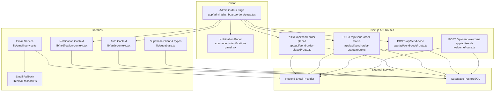
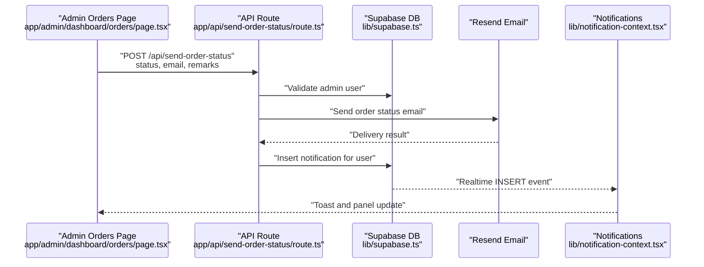
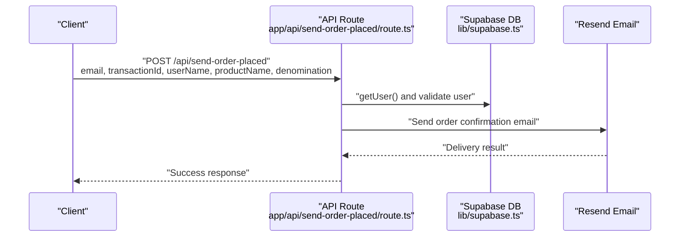
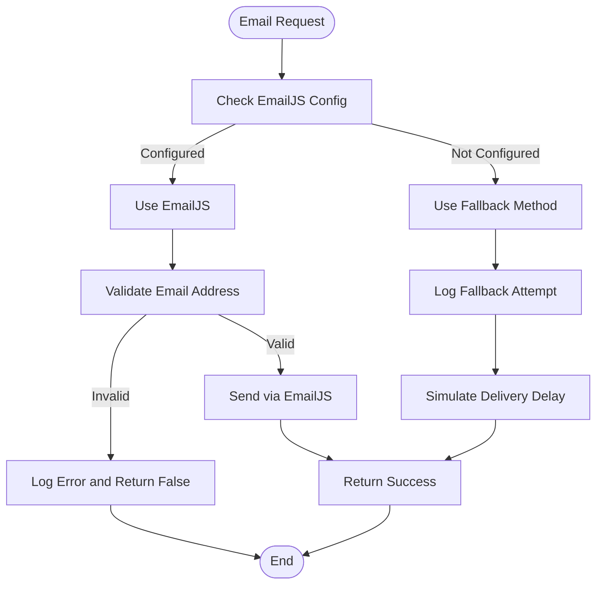
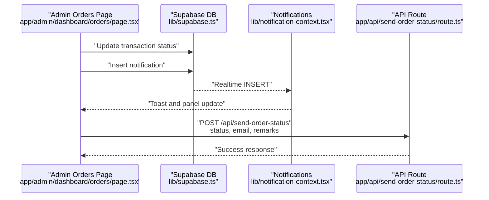
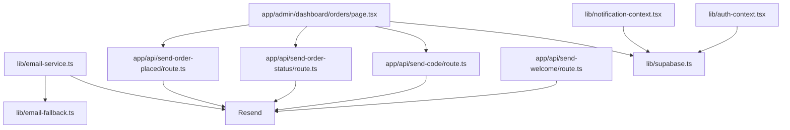

# Order Management and Delivery

<cite>
**Referenced Files in This Document**
- [app/api/send-order-placed/route.ts](file://app/api/send-order-placed/route.ts)
- [app/api/send-order-status/route.ts](file://app/api/send-order-status/route.ts)
- [app/api/send-code/route.ts](file://app/api/send-code/route.ts)
- [app/api/send-welcome/route.ts](file://app/api/send-welcome/route.ts)
- [lib/email-service.ts](file://lib/email-service.ts)
- [lib/email-fallback.ts](file://lib/email-fallback.ts)
- [lib/notification-context.tsx](file://lib/notification-context.tsx)
- [lib/auth-context.tsx](file://lib/auth-context.tsx)
- [lib/supabase.ts](file://lib/supabase.ts)
- [app/admin/dashboard/orders/page.tsx](file://app/admin/dashboard/orders/page.tsx)
- [components/notification-panel.tsx](file://components/notification-panel.tsx)
- [components/notification-toast.tsx](file://components/notification-toast.tsx)
- [middleware.ts](file://middleware.ts)
- [package.json](file://package.json)
- [README.md](file://README.md)
</cite>

## Table of Contents
1. [Introduction](#introduction)
2. [Project Structure](#project-structure)
3. [Core Components](#core-components)
4. [Architecture Overview](#architecture-overview)
5. [Detailed Component Analysis](#detailed-component-analysis)
6. [Dependency Analysis](#dependency-analysis)
7. [Performance Considerations](#performance-considerations)
8. [Troubleshooting Guide](#troubleshooting-guide)
9. [Conclusion](#conclusion)
10. [Appendices](#appendices)

## Introduction
This document explains the order management and delivery system with a focus on order confirmation, automated email delivery, and user notifications. It covers the end-to-end order placement workflow, transaction creation, email service integration, notification triggers, and delivery status tracking. It also documents configuration options for email templates, notification types, and delivery preferences, and outlines relationships with authentication context, database transactions, and external email services. Practical troubleshooting guidance is included for common issues such as email delivery failures, notification timing, and order status synchronization.

## Project Structure
The system is a Next.js application with a Supabase backend. Key areas relevant to order management and delivery include:
- API routes for sending order emails and managing order status
- Email service abstraction supporting primary and fallback providers
- Authentication and transaction contexts
- Admin dashboard for order management and status updates
- Real-time notification system backed by Supabase

**Diagram sources**
- [app/admin/dashboard/orders/page.tsx:1-643](file://app/admin/dashboard/orders/page.tsx#L1-L643)
- [app/api/send-order-placed/route.ts:1-101](file://app/api/send-order-placed/route.ts#L1-L101)
- [app/api/send-order-status/route.ts:1-199](file://app/api/send-order-status/route.ts#L1-L199)
- [app/api/send-code/route.ts:1-102](file://app/api/send-code/route.ts#L1-L102)
- [app/api/send-welcome/route.ts:1-80](file://app/api/send-welcome/route.ts#L1-L80)
- [lib/email-service.ts:1-126](file://lib/email-service.ts#L1-L126)
- [lib/email-fallback.ts:1-31](file://lib/email-fallback.ts#L1-L31)
- [lib/notification-context.tsx:1-242](file://lib/notification-context.tsx#L1-L242)
- [lib/auth-context.tsx:1-374](file://lib/auth-context.tsx#L1-L374)
- [lib/supabase.ts:1-188](file://lib/supabase.ts#L1-L188)

**Section sources**
- [README.md:1-18](file://README.md#L1-L18)
- [package.json:1-51](file://package.json#L1-L51)

## Core Components
- Order confirmation email endpoint: Creates a transaction, sends an order confirmation email, and notifies the user.
- Order status email endpoint: Sends completion or failure emails to customers and optionally records remarks.
- Gift card code email endpoint: Sends the PIN/code to the customer upon admin entry.
- Welcome email endpoint: Sends a welcome email to new users.
- Email service abstraction: Supports primary provider (EmailJS) with a fallback method.
- Notification system: Loads, displays, and persists notifications with real-time updates.
- Authentication and transaction contexts: Manage user sessions, transactions, and status updates.
- Admin orders dashboard: Filters, paginates, and updates order statuses; triggers notifications and emails.

**Section sources**
- [app/api/send-order-placed/route.ts:19-101](file://app/api/send-order-placed/route.ts#L19-L101)
- [app/api/send-order-status/route.ts:19-199](file://app/api/send-order-status/route.ts#L19-L199)
- [app/api/send-code/route.ts:19-102](file://app/api/send-code/route.ts#L19-L102)
- [app/api/send-welcome/route.ts:18-80](file://app/api/send-welcome/route.ts#L18-L80)
- [lib/email-service.ts:75-126](file://lib/email-service.ts#L75-L126)
- [lib/notification-context.tsx:29-242](file://lib/notification-context.tsx#L29-L242)
- [lib/auth-context.tsx:240-344](file://lib/auth-context.tsx#L240-L344)
- [app/admin/dashboard/orders/page.tsx:67-251](file://app/admin/dashboard/orders/page.tsx#L67-L251)

## Architecture Overview
The system integrates client-side UI with Next.js API routes and external services:
- Client actions trigger API endpoints for order confirmation, status updates, and gift card code delivery.
- API routes validate authentication, enforce permissions, and interact with Supabase for transactions and notifications.
- Email delivery is handled via Resend, with optional fallback logic in the email service abstraction.
- Notifications are persisted to Supabase and surfaced in real-time to users.

**Diagram sources**
- [app/admin/dashboard/orders/page.tsx:225-244](file://app/admin/dashboard/orders/page.tsx#L225-L244)
- [app/api/send-order-status/route.ts:19-199](file://app/api/send-order-status/route.ts#L19-L199)
- [lib/notification-context.tsx:172-220](file://lib/notification-context.tsx#L172-L220)

## Detailed Component Analysis

### Order Placement Workflow and Transaction Creation
- The order placement workflow creates a transaction record in the database and sends an order confirmation email.
- The confirmation email is sent via Resend with a subject and HTML content tailored to the order.
- The admin orders page can trigger the order status email after a status change.

**Diagram sources**
- [app/api/send-order-placed/route.ts:19-101](file://app/api/send-order-placed/route.ts#L19-L101)

**Section sources**
- [app/api/send-order-placed/route.ts:19-101](file://app/api/send-order-placed/route.ts#L19-L101)
- [lib/auth-context.tsx:240-323](file://lib/auth-context.tsx#L240-L323)

### Automated Email Delivery System
- EmailJS is the primary provider for order confirmation emails; if not configured, a fallback method logs and simulates delivery.
- Resend is used for order status and gift card code emails.
- The email service supports both server and client environments and constructs absolute URLs on the server.

**Diagram sources**
- [lib/email-service.ts:75-126](file://lib/email-service.ts#L75-L126)
- [lib/email-fallback.ts:3-31](file://lib/email-fallback.ts#L3-L31)

**Section sources**
- [lib/email-service.ts:75-126](file://lib/email-service.ts#L75-L126)
- [lib/email-fallback.ts:3-31](file://lib/email-fallback.ts#L3-L31)

### Order Confirmation Emails and Delivery Preferences
- Order confirmation emails are sent immediately after transaction creation.
- Delivery preferences include Reply-To and sender identity; recipients receive a branded HTML email with order details and a link to transaction history.

**Section sources**
- [app/api/send-order-placed/route.ts:46-93](file://app/api/send-order-placed/route.ts#L46-L93)

### Order Status Tracking and User Notifications
- Admins update order status via the orders page, which triggers:
  - Database update of the transaction status
  - Insertion of a notification for the user
  - Optional email to the customer with completion or failure details and remarks
- The notification system loads, displays, and persists notifications with real-time updates.

**Diagram sources**
- [app/admin/dashboard/orders/page.tsx:184-251](file://app/admin/dashboard/orders/page.tsx#L184-L251)
- [lib/notification-context.tsx:172-220](file://lib/notification-context.tsx#L172-L220)
- [app/api/send-order-status/route.ts:19-199](file://app/api/send-order-status/route.ts#L19-L199)

**Section sources**
- [app/admin/dashboard/orders/page.tsx:154-251](file://app/admin/dashboard/orders/page.tsx#L154-L251)
- [lib/notification-context.tsx:29-242](file://lib/notification-context.tsx#L29-L242)

### Gift Card Code Delivery
- Admins enter gift card codes in the orders page and send them to customers.
- The system saves the code to the database and sends an email containing the PIN/code.

**Section sources**
- [app/admin/dashboard/orders/page.tsx:253-299](file://app/admin/dashboard/orders/page.tsx#L253-L299)
- [app/api/send-code/route.ts:19-102](file://app/api/send-code/route.ts#L19-L102)

### Authentication Context and Database Transactions
- Authentication context manages user sessions, loads transactions, and exposes methods to add and update transactions.
- Database types define the structure of transactions and related tables.

**Section sources**
- [lib/auth-context.tsx:51-365](file://lib/auth-context.tsx#L51-L365)
- [lib/supabase.ts:141-184](file://lib/supabase.ts#L141-L184)
- [middleware.ts:1-11](file://middleware.ts#L1-L11)

### Notification Triggers and Real-Time Updates
- Notifications are inserted into the database and streamed in real-time to clients.
- The notification panel displays unread counts, allows marking as read, and shows toast messages.

**Section sources**
- [lib/notification-context.tsx:29-242](file://lib/notification-context.tsx#L29-L242)
- [components/notification-panel.tsx:13-162](file://components/notification-panel.tsx#L13-L162)
- [components/notification-toast.tsx:11-51](file://components/notification-toast.tsx#L11-L51)

## Dependency Analysis
- Email delivery depends on Resend and optionally EmailJS with a fallback.
- Order management relies on Supabase for authentication, transactions, and notifications.
- The admin orders page orchestrates UI interactions, API calls, and real-time updates.

**Diagram sources**
- [lib/email-service.ts:1-126](file://lib/email-service.ts#L1-L126)
- [lib/email-fallback.ts:1-31](file://lib/email-fallback.ts#L1-L31)
- [app/api/send-order-placed/route.ts:1-101](file://app/api/send-order-placed/route.ts#L1-L101)
- [app/api/send-order-status/route.ts:1-199](file://app/api/send-order-status/route.ts#L1-L199)
- [app/api/send-code/route.ts:1-102](file://app/api/send-code/route.ts#L1-L102)
- [app/api/send-welcome/route.ts:1-80](file://app/api/send-welcome/route.ts#L1-L80)
- [app/admin/dashboard/orders/page.tsx:1-643](file://app/admin/dashboard/orders/page.tsx#L1-L643)
- [lib/notification-context.tsx:1-242](file://lib/notification-context.tsx#L1-L242)
- [lib/auth-context.tsx:1-374](file://lib/auth-context.tsx#L1-L374)
- [lib/supabase.ts:1-188](file://lib/supabase.ts#L1-L188)

**Section sources**
- [package.json:11-39](file://package.json#L11-L39)

## Performance Considerations
- Email delivery latency: Prefer Resend for production; monitor delivery receipts and implement retries for transient failures.
- Database writes: Batch updates where possible; ensure indexes on frequently queried columns (e.g., transaction_id, user_id).
- Real-time notifications: Leverage Supabase realtime channels to minimize polling overhead.
- Client-side rendering: Paginate and filter order lists to reduce DOM size and improve responsiveness.

## Troubleshooting Guide
Common issues and resolutions:
- Email delivery failures
  - Verify Resend API key and domain configuration.
  - Check email service configuration and fallback behavior.
  - Review API route error responses and console logs.
- Notification timing
  - Ensure realtime subscriptions are active and not blocked by network policies.
  - Confirm database inserts succeed and events propagate.
- Order status synchronization
  - Validate admin permissions and user ownership checks in API routes.
  - Confirm transaction updates occur before sending status emails.

**Section sources**
- [app/api/send-order-placed/route.ts:96-100](file://app/api/send-order-placed/route.ts#L96-L100)
- [app/api/send-order-status/route.ts:194-198](file://app/api/send-order-status/route.ts#L194-L198)
- [lib/email-service.ts:77-80](file://lib/email-service.ts#L77-L80)
- [lib/notification-context.tsx:172-220](file://lib/notification-context.tsx#L172-L220)

## Conclusion
The order management and delivery system integrates Supabase-backed transactions, robust email delivery via Resend and EmailJS, and real-time user notifications. The admin dashboard centralizes order oversight, enabling timely status updates, customer communication, and code delivery. Following the configuration and troubleshooting guidance ensures reliable order fulfillment and excellent customer experience.

## Appendices

### Configuration Options
- Environment variables
  - RESEND_API_KEY: API key for Resend email service.
  - NEXT_PUBLIC_EMAILJS_SERVICE_ID: EmailJS service identifier.
  - NEXT_PUBLIC_EMAILJS_TEMPLATE_ID: EmailJS template identifier.
  - NEXT_PUBLIC_EMAILJS_PUBLIC_KEY: EmailJS public key.
  - NEXT_PUBLIC_SUPABASE_URL: Supabase project URL.
  - NEXT_PUBLIC_SUPABASE_ANON_KEY: Supabase anonymous key.
- Email templates
  - Order confirmation, order status (completed/failed), gift card code, and welcome emails are implemented as HTML payloads in API routes.
- Notification types
  - Notifications support info, success, warning, and error types; displayed with distinct icons and borders.

**Section sources**
- [app/api/send-order-placed/route.ts:5](file://app/api/send-order-placed/route.ts#L5)
- [lib/email-service.ts:5-7](file://lib/email-service.ts#L5-L7)
- [lib/supabase.ts:3-7](file://lib/supabase.ts#L3-L7)
- [components/notification-panel.tsx:29-53](file://components/notification-panel.tsx#L29-L53)