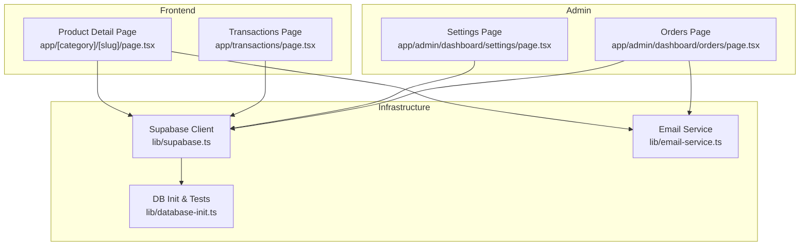
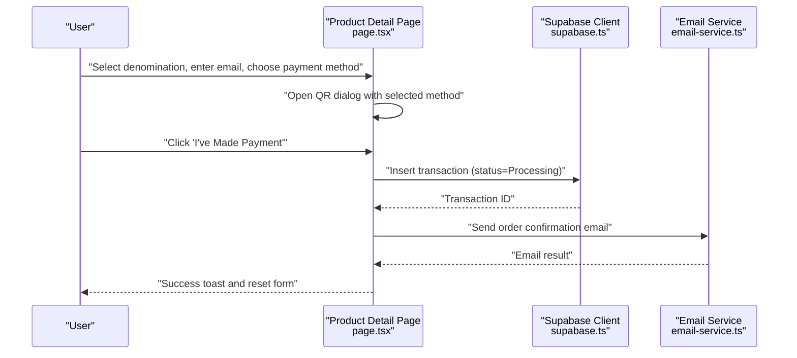
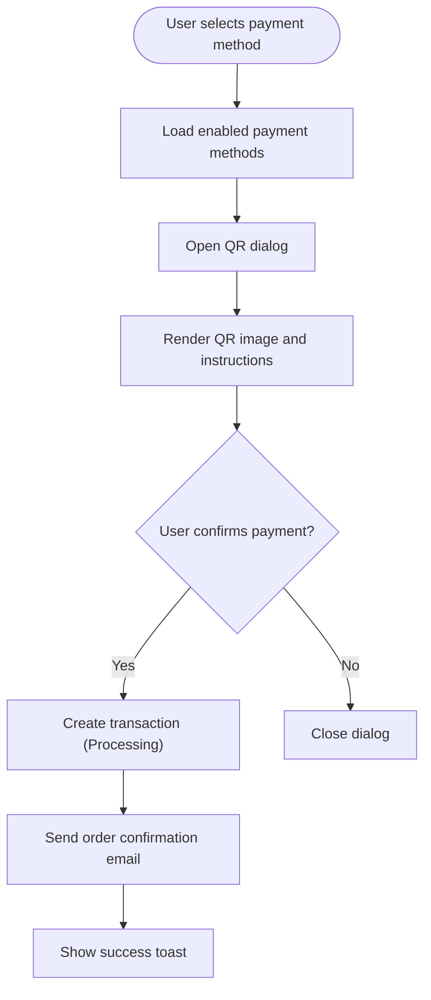
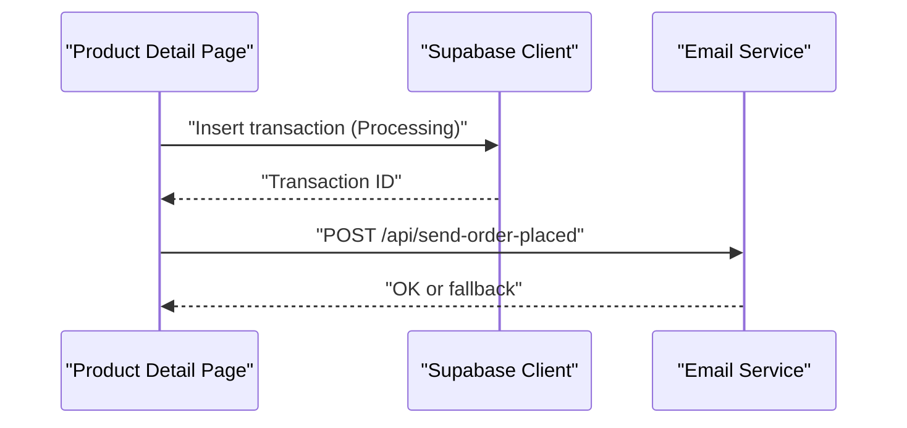
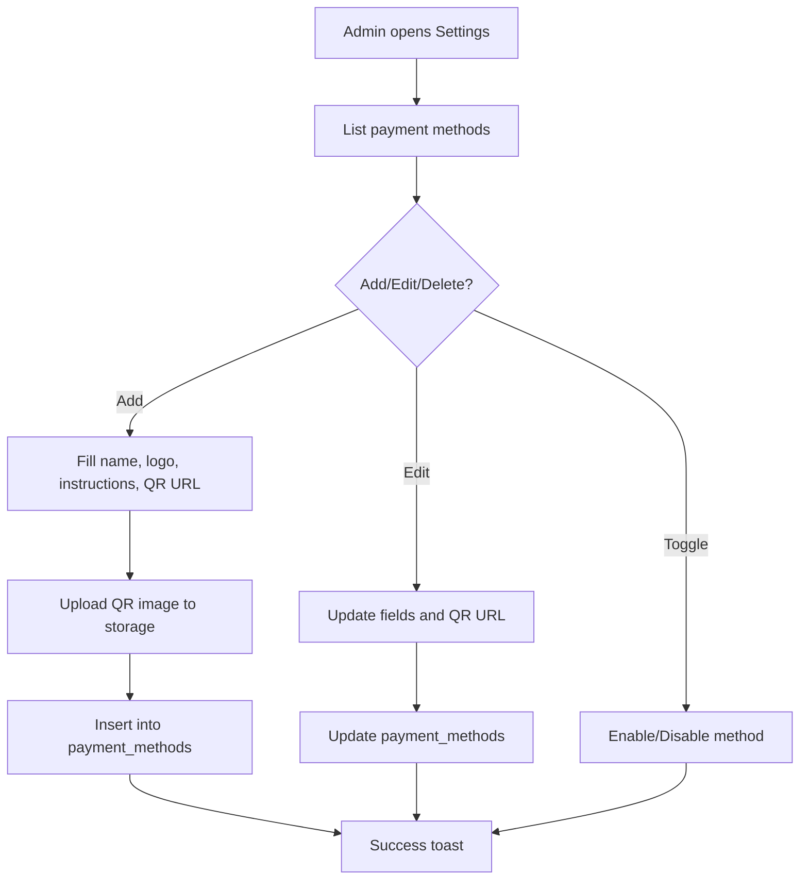
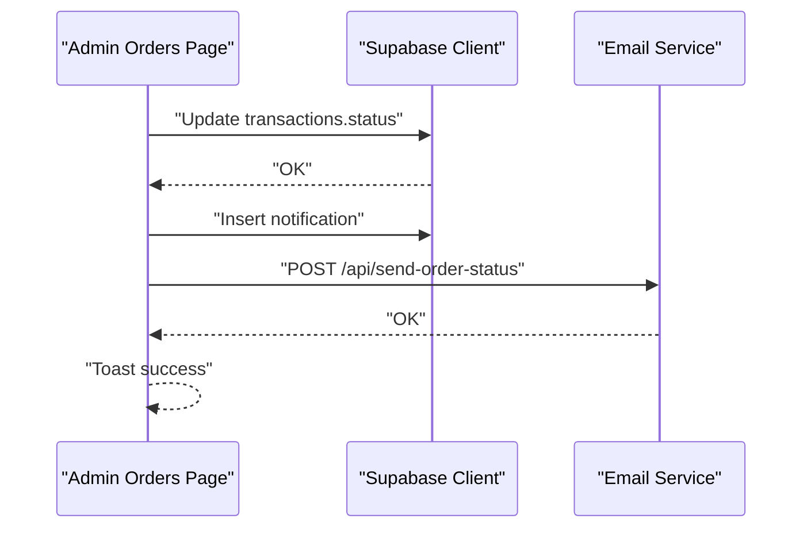
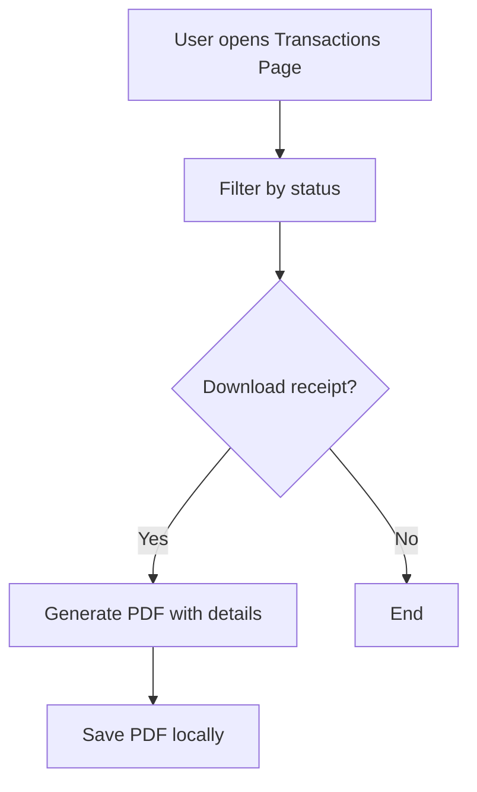
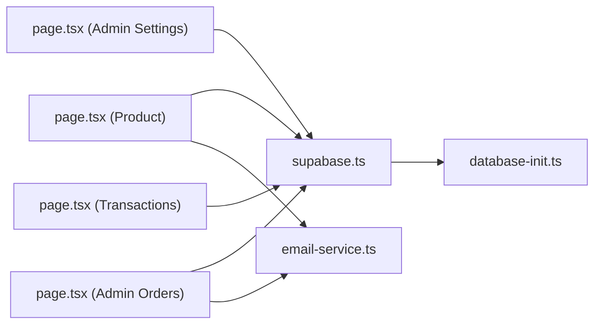

# Payment Processing and QR Integration

<cite>
**Referenced Files in This Document**
- [page.tsx](file://app/[category]/[slug]/page.tsx)
- [page.tsx](file://app/admin/dashboard/settings/page.tsx)
- [page.tsx](file://app/admin/dashboard/orders/page.tsx)
- [page.tsx](file://app/transactions/page.tsx)
- [supabase.ts](file://lib/supabase.ts)
- [email-service.ts](file://lib/email-service.ts)
- [database-init.ts](file://lib/database-init.ts)
</cite>

## Table of Contents
1. [Introduction](#introduction)
2. [Project Structure](#project-structure)
3. [Core Components](#core-components)
4. [Architecture Overview](#architecture-overview)
5. [Detailed Component Analysis](#detailed-component-analysis)
6. [Dependency Analysis](#dependency-analysis)
7. [Performance Considerations](#performance-considerations)
8. [Troubleshooting Guide](#troubleshooting-guide)
9. [Conclusion](#conclusion)

## Introduction
This document explains the payment processing system with QR code integration and transaction management. It covers how users select payment methods, how QR codes are presented and validated, and how transactions are created and tracked. It also documents configuration options for payment providers, QR instructions, and validation rules, and describes relationships with Supabase database operations, email notifications, and admin workflows.

## Project Structure
The payment flow spans three primary areas:
- Frontend product pages where users select denominations, enter details, choose payment methods, and confirm QR payments
- Admin settings for configuring payment methods, uploading QR images, and managing instructions
- Admin orders for updating transaction statuses and notifying users

**Diagram sources**
- [page.tsx:145-687](file://app/[category]/[slug]/page.tsx#L145-L687)
- [page.tsx:14-398](file://app/transactions/page.tsx#L14-L398)
- [page.tsx:28-738](file://app/admin/dashboard/settings/page.tsx#L28-L738)
- [page.tsx:154-544](file://app/admin/dashboard/orders/page.tsx#L154-L544)
- [supabase.ts:1-188](file://lib/supabase.ts#L1-L188)
- [email-service.ts:1-126](file://lib/email-service.ts#L1-L126)
- [database-init.ts:1-164](file://lib/database-init.ts#L1-L164)

**Section sources**
- [page.tsx:145-687](file://app/[category]/[slug]/page.tsx#L145-L687)
- [page.tsx:28-738](file://app/admin/dashboard/settings/page.tsx#L28-L738)
- [page.tsx:154-544](file://app/admin/dashboard/orders/page.tsx#L154-L544)
- [page.tsx:14-398](file://app/transactions/page.tsx#L14-L398)
- [supabase.ts:1-188](file://lib/supabase.ts#L1-L188)
- [email-service.ts:1-126](file://lib/email-service.ts#L1-L126)
- [database-init.ts:1-164](file://lib/database-init.ts#L1-L164)

## Core Components
- Payment method selection and QR dialog:
  - Users choose a payment method and see the associated QR code and instructions before confirming payment.
  - The dialog displays the QR image, payment details, and a confirmation button.
- Transaction creation and persistence:
  - On confirmation, a transaction record is inserted with status set to Processing and minimal metadata.
  - An order-confirmation email is sent asynchronously.
- Admin configuration and management:
  - Admins configure payment methods, upload QR images, and set instructions.
  - Admins update transaction statuses and trigger notifications and emails.

**Section sources**
- [page.tsx:196-214](file://app/[category]/[slug]/page.tsx#L196-L214)
- [page.tsx:246-336](file://app/[category]/[slug]/page.tsx#L246-L336)
- [page.tsx:78-97](file://app/admin/dashboard/settings/page.tsx#L78-L97)
- [page.tsx:233-268](file://app/admin/dashboard/settings/page.tsx#L233-L268)
- [page.tsx:184-251](file://app/admin/dashboard/orders/page.tsx#L184-L251)

## Architecture Overview
The payment flow integrates frontend UI, Supabase storage and database, and email services. The sequence below maps the actual code paths.

**Diagram sources**
- [page.tsx:246-336](file://app/[category]/[slug]/page.tsx#L246-L336)
- [supabase.ts:1-188](file://lib/supabase.ts#L1-L188)
- [email-service.ts:75-126](file://lib/email-service.ts#L75-L126)

## Detailed Component Analysis

### Payment Method Selection and QR Dialog
- Payment methods are loaded from the database and filtered by enabled status.
- The user selects a payment method and opens a dialog displaying the QR image and instructions.
- The dialog shows product, amount, and price details before confirmation.

**Diagram sources**
- [page.tsx:196-214](file://app/[category]/[slug]/page.tsx#L196-L214)
- [page.tsx:609-681](file://app/[category]/[slug]/page.tsx#L609-L681)
- [page.tsx:246-336](file://app/[category]/[slug]/page.tsx#L246-L336)

**Section sources**
- [page.tsx:196-214](file://app/[category]/[slug]/page.tsx#L196-L214)
- [page.tsx:609-681](file://app/[category]/[slug]/page.tsx#L609-L681)
- [page.tsx:246-336](file://app/[category]/[slug]/page.tsx#L246-L336)

### Transaction Creation and Persistence
- The transaction is inserted with:
  - Minimal metadata (product, amount, price, payment method, email)
  - Status set to Processing
  - Guest data for top-up products when applicable
- After insertion, an order-confirmation email is sent via a server-side API route.

**Diagram sources**
- [page.tsx:268-296](file://app/[category]/[slug]/page.tsx#L268-L296)
- [email-service.ts:75-126](file://lib/email-service.ts#L75-L126)

**Section sources**
- [page.tsx:268-296](file://app/[category]/[slug]/page.tsx#L268-L296)
- [supabase.ts:141-184](file://lib/supabase.ts#L141-L184)

### Admin Settings: Payment Providers, QR Instructions, and Validation
- Admins can add, edit, enable/disable, and delete payment methods.
- QR images can be uploaded to Supabase Storage and linked via URLs.
- Validation includes ensuring a name is provided and that uploaded files are images.

**Diagram sources**
- [page.tsx:78-97](file://app/admin/dashboard/settings/page.tsx#L78-L97)
- [page.tsx:233-268](file://app/admin/dashboard/settings/page.tsx#L233-L268)
- [page.tsx:270-305](file://app/admin/dashboard/settings/page.tsx#L270-L305)

**Section sources**
- [page.tsx:78-97](file://app/admin/dashboard/settings/page.tsx#L78-L97)
- [page.tsx:233-268](file://app/admin/dashboard/settings/page.tsx#L233-L268)
- [page.tsx:270-305](file://app/admin/dashboard/settings/page.tsx#L270-L305)

### Transaction Status Management and Notifications
- Admins update transaction status and optionally add failure remarks.
- On status change to Completed or Failed, a notification is inserted for the user and an order-status email is sent.

**Diagram sources**
- [page.tsx:184-251](file://app/admin/dashboard/orders/page.tsx#L184-L251)
- [email-service.ts:75-126](file://lib/email-service.ts#L75-L126)

**Section sources**
- [page.tsx:184-251](file://app/admin/dashboard/orders/page.tsx#L184-L251)

### Transaction History and Receipts
- Users can view transaction history, filter by status, reveal gift card codes, and download receipts as PDFs.
- The receipts include product details, payment method, total amount, and gift card code if applicable.

**Diagram sources**
- [page.tsx:14-398](file://app/transactions/page.tsx#L14-L398)

**Section sources**
- [page.tsx:14-398](file://app/transactions/page.tsx#L14-L398)

## Dependency Analysis
- Supabase client and types define the schema for payment methods, transactions, and admin users.
- Email service supports both EmailJS and a fallback mechanism for order confirmations and status updates.
- Database initialization utilities validate configuration and table presence.

**Diagram sources**
- [page.tsx:145-687](file://app/[category]/[slug]/page.tsx#L145-L687)
- [page.tsx:28-738](file://app/admin/dashboard/settings/page.tsx#L28-L738)
- [page.tsx:154-544](file://app/admin/dashboard/orders/page.tsx#L154-L544)
- [page.tsx:14-398](file://app/transactions/page.tsx#L14-L398)
- [supabase.ts:1-188](file://lib/supabase.ts#L1-L188)
- [email-service.ts:1-126](file://lib/email-service.ts#L1-L126)
- [database-init.ts:1-164](file://lib/database-init.ts#L1-L164)

**Section sources**
- [supabase.ts:1-188](file://lib/supabase.ts#L1-L188)
- [email-service.ts:1-126](file://lib/email-service.ts#L1-L126)
- [database-init.ts:1-164](file://lib/database-init.ts#L1-L164)

## Performance Considerations
- QR image rendering: Ensure QR images are optimized and served from Supabase Storage to minimize latency.
- Asynchronous email sending: Order confirmation and status emails are sent after transaction creation to avoid blocking the UI.
- Transaction filtering: Client-side filtering on the transactions page avoids unnecessary network requests.

## Troubleshooting Guide
Common issues and resolutions:
- Payment method not visible:
  - Verify the payment method is enabled and ordered by sort_order.
  - Check that the QR URL is valid and accessible.
- QR generation problems:
  - Confirm the QR image is uploaded as an image file and stored in the correct bucket.
  - Ensure the public URL is returned and accessible.
- Transaction status synchronization:
  - Admins should update status from the Orders page and add remarks for failures.
  - Notifications and emails are triggered automatically upon status changes.
- Database connectivity:
  - Use database initialization utilities to check configuration and table existence.
  - Validate environment variables for Supabase URL and keys.

**Section sources**
- [page.tsx:270-305](file://app/admin/dashboard/settings/page.tsx#L270-L305)
- [page.tsx:184-251](file://app/admin/dashboard/orders/page.tsx#L184-L251)
- [database-init.ts:27-87](file://lib/database-init.ts#L27-L87)

## Conclusion
The payment system integrates user-friendly QR-based payment selection with robust backend persistence and admin controls. Payment providers are configured centrally, QR instructions are customizable, and transactions are tracked with status updates and notifications. The architecture leverages Supabase for data and storage, and email services for user communication, providing a scalable foundation for similar integrations.