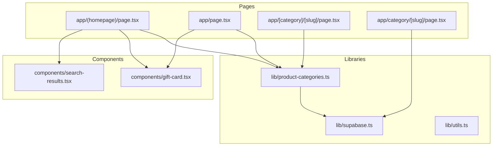
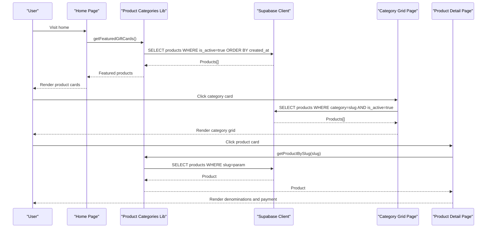
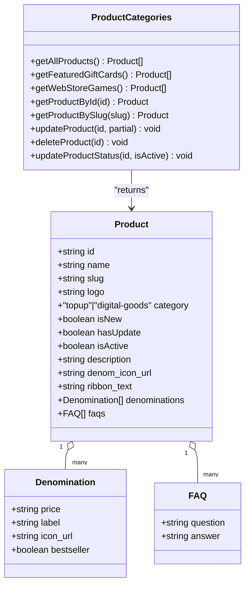
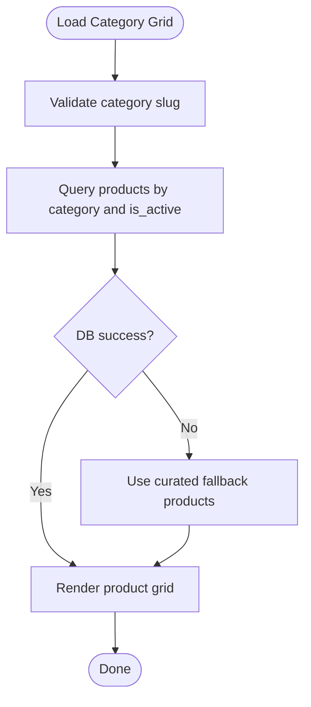
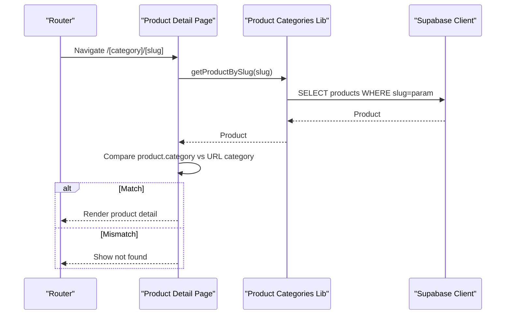
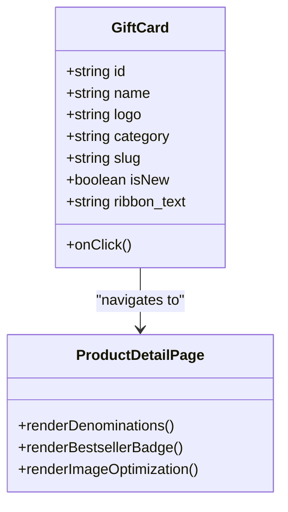
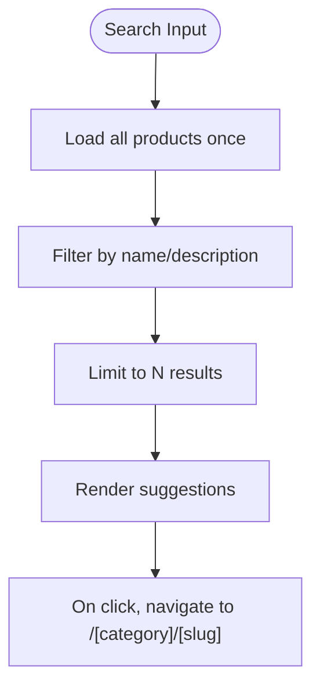
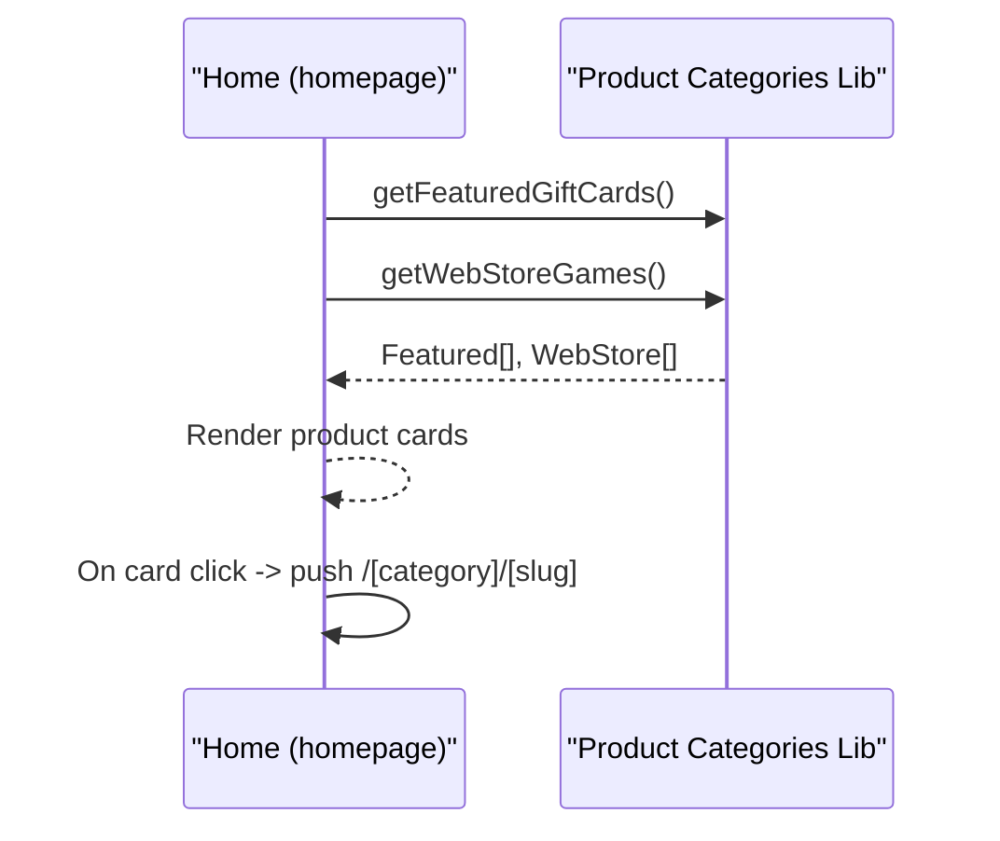
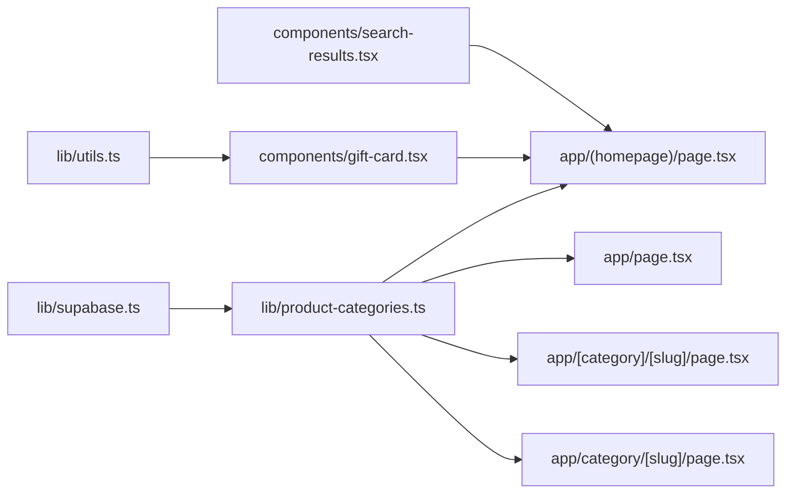

# Product Browsing and Discovery

<cite>
**Referenced Files in This Document**
- [app/(homepage)/page.tsx](file://app/(homepage)/page.tsx)
- [app/[category]/[slug]/page.tsx](file://app/[category]/[slug]/page.tsx)
- [app/category/[slug]/page.tsx](file://app/category/[slug]/page.tsx)
- [app/page.tsx](file://app/page.tsx)
- [lib/product-categories.ts](file://lib/product-categories.ts)
- [lib/supabase.ts](file://lib/supabase.ts)
- [components/gift-card.tsx](file://components/gift-card.tsx)
- [components/search-results.tsx](file://components/search-results.tsx)
- [lib/utils.ts](file://lib/utils.ts)
</cite>

## Table of Contents
1. [Introduction](#introduction)
2. [Project Structure](#project-structure)
3. [Core Components](#core-components)
4. [Architecture Overview](#architecture-overview)
5. [Detailed Component Analysis](#detailed-component-analysis)
6. [Dependency Analysis](#dependency-analysis)
7. [Performance Considerations](#performance-considerations)
8. [Troubleshooting Guide](#troubleshooting-guide)
9. [Conclusion](#conclusion)
10. [Appendices](#appendices)

## Introduction
This document explains the product browsing and discovery system with a focus on category-based navigation, product filtering, and metadata-driven presentation. It covers how product listings are structured, how category slugs route to category pages, and how product metadata (including denominations and bestseller indicators) is managed and rendered. It also documents product detail routing, dynamic content loading, configuration options for categories and display preferences, and the relationship with database queries, image optimization, and responsive design patterns. Practical troubleshooting guidance is included for common issues such as missing products, category mismatches, and performance bottlenecks.

## Project Structure
The browsing system spans several Next.js app router pages and shared libraries:
- Home and category landing pages fetch and present product lists.
- Category pages filter by category slug and render product grids.
- Product detail pages resolve by slug, validate category correctness, and present denominations and payment options.
- Shared library functions abstract Supabase access and provide caching and fallbacks.
- UI components encapsulate reusable product cards and search results.

**Diagram sources**
- [app/(homepage)/page.tsx:12-77](file://app/(homepage)/page.tsx#L12-L77)
- [app/page.tsx:19-85](file://app/page.tsx#L19-L85)
- [app/[category]/[slug]/page.tsx:145-687](file://app/[category]/[slug]/page.tsx#L145-L687)
- [app/category/[slug]/page.tsx:47-82](file://app/category/[slug]/page.tsx#L47-L82)
- [lib/product-categories.ts:1-485](file://lib/product-categories.ts#L1-L485)
- [lib/supabase.ts:1-188](file://lib/supabase.ts#L1-L188)
- [components/gift-card.tsx:1-68](file://components/gift-card.tsx#L1-L68)
- [components/search-results.tsx:1-97](file://components/search-results.tsx#L1-L97)

**Section sources**
- [app/(homepage)/page.tsx:12-77](file://app/(homepage)/page.tsx#L12-L77)
- [app/page.tsx:19-85](file://app/page.tsx#L19-L85)
- [app/[category]/[slug]/page.tsx:145-687](file://app/[category]/[slug]/page.tsx#L145-L687)
- [app/category/[slug]/page.tsx:47-82](file://app/category/[slug]/page.tsx#L47-L82)
- [lib/product-categories.ts:1-485](file://lib/product-categories.ts#L1-L485)
- [lib/supabase.ts:1-188](file://lib/supabase.ts#L1-L188)
- [components/gift-card.tsx:1-68](file://components/gift-card.tsx#L1-L68)
- [components/search-results.tsx:1-97](file://components/search-results.tsx#L1-L97)

## Core Components
- Product metadata model and caching/fallback:
  - Defines the Product interface and exposes functions to fetch all products, featured gift cards, web store games, and individual products by ID or slug. Includes caching with a TTL and robust fallbacks to static data when Supabase is unavailable.
- Category pages:
  - The category grid page filters products by category slug and renders a responsive grid of product cards with badges and pricing hints.
- Product detail page:
  - Resolves product by slug, validates category match against URL, and renders denomination selection with bestseller indicators and payment options.
- Product cards:
  - Reusable card component rendering logos, badges (NEW or custom ribbon), and hover effects; integrates with routing to product detail.
- Search results:
  - Dynamic search results component that loads all products once, filters by name/description, and presents clickable suggestions.

**Section sources**
- [lib/product-categories.ts:3-26](file://lib/product-categories.ts#L3-L26)
- [lib/product-categories.ts:200-264](file://lib/product-categories.ts#L200-L264)
- [lib/product-categories.ts:266-283](file://lib/product-categories.ts#L266-L283)
- [lib/product-categories.ts:285-363](file://lib/product-categories.ts#L285-L363)
- [app/category/[slug]/page.tsx:47-82](file://app/category/[slug]/page.tsx#L47-L82)
- [app/[category]/[slug]/page.tsx:145-687](file://app/[category]/[slug]/page.tsx#L145-L687)
- [components/gift-card.tsx:17-67](file://components/gift-card.tsx#L17-L67)
- [components/search-results.tsx:12-47](file://components/search-results.tsx#L12-L47)

## Architecture Overview
The browsing architecture centers on:
- Data access via a typed Supabase client and a product abstraction layer.
- Category-based routing with dynamic segments for category and slug.
- Responsive product grids and cards optimized for Next.js Image and Tailwind classes.
- Caching and fallback strategies to maintain availability during network errors.

**Diagram sources**
- [app/(homepage)/page.tsx:22-36](file://app/(homepage)/page.tsx#L22-L36)
- [lib/product-categories.ts:200-264](file://lib/product-categories.ts#L200-L264)
- [lib/supabase.ts:68-82](file://lib/supabase.ts#L68-L82)
- [app/category/[slug]/page.tsx:56-71](file://app/category/[slug]/page.tsx#L56-L71)
- [lib/product-categories.ts:325-363](file://lib/product-categories.ts#L325-L363)
- [app/[category]/[slug]/page.tsx:175-214](file://app/[category]/[slug]/page.tsx#L175-L214)

## Detailed Component Analysis

### Product Metadata Model and Data Access
- Product interface includes identifiers, category, flags (isNew, hasUpdate), activity flag, description, optional denomination icon, ribbon text, and arrays for denominations and FAQs.
- getAllProducts caches results for a fixed duration and falls back to curated static data when Supabase is unavailable or errors occur.
- Helper getters:
  - getFeaturedGiftCards: selects digital-goods products marked active and limits to a small set.
  - getWebStoreGames: selects topup or remaining digital-goods products marked active and limits to a small set.
  - getProductById/getProductBySlug: fetch single product with fallback to static data.
- Update/delete helpers support admin workflows and invalidate cache upon changes.

**Diagram sources**
- [lib/product-categories.ts:3-26](file://lib/product-categories.ts#L3-L26)
- [lib/product-categories.ts:200-264](file://lib/product-categories.ts#L200-L264)

**Section sources**
- [lib/product-categories.ts:3-26](file://lib/product-categories.ts#L3-L26)
- [lib/product-categories.ts:200-264](file://lib/product-categories.ts#L200-L264)
- [lib/product-categories.ts:266-283](file://lib/product-categories.ts#L266-L283)
- [lib/product-categories.ts:285-363](file://lib/product-categories.ts#L285-L363)

### Category Grid Routing and Rendering
- The category grid page accepts a slug segment and:
  - Sets a human-readable category name.
  - Queries products by category and active status, ordering by creation date.
  - Falls back to curated static data if the database query fails.
  - Renders a responsive grid of product cards with ribbons, hover scaling, and “From” price hints derived from the first denomination.

**Diagram sources**
- [app/category/[slug]/page.tsx:47-82](file://app/category/[slug]/page.tsx#L47-L82)
- [app/category/[slug]/page.tsx:194-272](file://app/category/[slug]/page.tsx#L194-L272)

**Section sources**
- [app/category/[slug]/page.tsx:47-82](file://app/category/[slug]/page.tsx#L47-L82)
- [app/category/[slug]/page.tsx:194-272](file://app/category/[slug]/page.tsx#L194-L272)

### Product Detail Routing and Validation
- The product detail page resolves category and slug from dynamic routes and:
  - Loads product metadata by slug.
  - Validates that the returned product’s category matches the URL category; mismatch sets a not-found state.
  - Merges product metadata with curated gift card defaults for display.
  - Presents denomination options with bestseller indicators and payment selection.
  - Uses Next.js Image for optimized rendering and graceful fallbacks.

**Diagram sources**
- [app/[category]/[slug]/page.tsx:175-214](file://app/[category]/[slug]/page.tsx#L175-L214)
- [lib/product-categories.ts:325-363](file://lib/product-categories.ts#L325-L363)

**Section sources**
- [app/[category]/[slug]/page.tsx:175-214](file://app/[category]/[slug]/page.tsx#L175-L214)
- [app/[category]/[slug]/page.tsx:454-461](file://app/[category]/[slug]/page.tsx#L454-L461)

### Product Cards and Denomination Displays
- GiftCard component:
  - Renders product logo with Next.js Image, hover scaling, and gradient overlays.
  - Displays a ribbon badge if ribbon_text exists, otherwise shows “NEW” if isNew is true.
  - Integrates with routing to product detail pages.
- Denomination display:
  - Product detail page renders denomination options as selectable cards with optional denomination icons.
  - Bestseller indicators are shown when bestseller flags are present in the product metadata.
  - Pricing is presented with “From” price hints and prominent currency labels.

**Diagram sources**
- [components/gift-card.tsx:17-67](file://components/gift-card.tsx#L17-L67)
- [app/[category]/[slug]/page.tsx:446-515](file://app/[category]/[slug]/page.tsx#L446-L515)
- [app/[category]/[slug]/page.tsx:454-461](file://app/[category]/[slug]/page.tsx#L454-L461)

**Section sources**
- [components/gift-card.tsx:17-67](file://components/gift-card.tsx#L17-L67)
- [app/[category]/[slug]/page.tsx:446-515](file://app/[category]/[slug]/page.tsx#L446-L515)
- [app/[category]/[slug]/page.tsx:454-461](file://app/[category]/[slug]/page.tsx#L454-L461)

### Search Functionality and Dynamic Content Loading
- SearchResults component:
  - Loads all products once and stores them locally.
  - Filters by product name or description and limits results to a small number.
  - Renders clickable suggestions that navigate to product detail pages using category and slug.

**Diagram sources**
- [components/search-results.tsx:12-47](file://components/search-results.tsx#L12-L47)
- [components/search-results.tsx:64-95](file://components/search-results.tsx#L64-L95)

**Section sources**
- [components/search-results.tsx:12-47](file://components/search-results.tsx#L12-L47)
- [components/search-results.tsx:64-95](file://components/search-results.tsx#L64-L95)

### Home Page and Category-Based Landing
- Home page (homepage layout):
  - Loads featured gift cards and web store games concurrently.
  - Renders product cards with “NEW” badges and “NEW UPDATE” badges where applicable.
  - Navigates to product detail pages using category and slug.
- Home page (root layout):
  - Loads homepage categories and maps product IDs to actual products.
  - Renders multiple category sections with expandable views.

**Diagram sources**
- [app/(homepage)/page.tsx:22-36](file://app/(homepage)/page.tsx#L22-L36)
- [app/(homepage)/page.tsx:92-101](file://app/(homepage)/page.tsx#L92-L101)
- [app/page.tsx:26-58](file://app/page.tsx#L26-L58)

**Section sources**
- [app/(homepage)/page.tsx:22-36](file://app/(homepage)/page.tsx#L22-L36)
- [app/(homepage)/page.tsx:92-101](file://app/(homepage)/page.tsx#L92-L101)
- [app/page.tsx:26-58](file://app/page.tsx#L26-L58)

## Dependency Analysis
- Supabase client and typed database schema define the canonical product table and related entities.
- Product categories library depends on Supabase for live data and provides caching and fallbacks.
- Pages depend on product categories for data and on UI components for rendering.
- Utilities (cn) integrate Tailwind classes consistently across components.

**Diagram sources**
- [lib/supabase.ts:68-187](file://lib/supabase.ts#L68-L187)
- [lib/product-categories.ts:1-5](file://lib/product-categories.ts#L1-L5)
- [app/(homepage)/page.tsx:9-9](file://app/(homepage)/page.tsx#L9-L9)
- [app/page.tsx:10-10](file://app/page.tsx#L10-L10)
- [app/[category]/[slug]/page.tsx:17-L19](file://app/[category]/[slug]/page.tsx#L17-L19)
- [app/category/[slug]/page.tsx:56-L62](file://app/category/[slug]/page.tsx#L56-L62)
- [components/gift-card.tsx:3-3](file://components/gift-card.tsx#L3-L3)
- [components/search-results.tsx:4-4](file://components/search-results.tsx#L4-L4)
- [lib/utils.ts:4-6](file://lib/utils.ts#L4-L6)

**Section sources**
- [lib/supabase.ts:68-187](file://lib/supabase.ts#L68-L187)
- [lib/product-categories.ts:1-5](file://lib/product-categories.ts#L1-L5)
- [app/(homepage)/page.tsx:9-9](file://app/(homepage)/page.tsx#L9-L9)
- [app/page.tsx:10-10](file://app/page.tsx#L10-L10)
- [app/[category]/[slug]/page.tsx:17-L19](file://app/[category]/[slug]/page.tsx#L17-L19)
- [app/category/[slug]/page.tsx:56-L62](file://app/category/[slug]/page.tsx#L56-L62)
- [components/gift-card.tsx:3-3](file://components/gift-card.tsx#L3-L3)
- [components/search-results.tsx:4-4](file://components/search-results.tsx#L4-L4)
- [lib/utils.ts:4-6](file://lib/utils.ts#L4-L6)

## Performance Considerations
- Caching:
  - getAllProducts caches results for a fixed duration and returns cached data on subsequent calls within the window, reducing database load and improving responsiveness.
- Fallbacks:
  - When Supabase is unavailable or returns errors, the system falls back to curated static data to prevent blank screens and maintain UX continuity.
- Concurrent loading:
  - Home page loads featured and web store games concurrently to minimize initial load time.
- Image optimization:
  - Next.js Image is used across product cards and detail pages with appropriate sizes and fallbacks to avoid broken assets.
- Responsive design:
  - Tailwind-based responsive grids ensure efficient rendering across device sizes.

**Section sources**
- [lib/product-categories.ts:190-264](file://lib/product-categories.ts#L190-L264)
- [app/(homepage)/page.tsx:22-36](file://app/(homepage)/page.tsx#L22-L36)
- [components/gift-card.tsx:44-56](file://components/gift-card.tsx#L44-L56)
- [app/[category]/[slug]/page.tsx:352-364](file://app/[category]/[slug]/page.tsx#L352-L364)

## Troubleshooting Guide
- Missing products on category pages:
  - Verify that the category slug matches the product category stored in the database and that the product is marked active.
  - Confirm that the database query executes successfully; if not, the system falls back to curated static data.
- Product detail not found or category mismatch:
  - When the product’s category does not match the URL category, the detail page sets a not-found state. Ensure the slug corresponds to a product in the intended category.
- Slow or failed product loading:
  - Check network connectivity and Supabase credentials; the product categories library includes fallbacks to static data and caching to mitigate outages.
- Broken images:
  - Next.js Image includes an error handler to replace broken images with a placeholder; ensure logo URLs are valid and accessible.
- Search results not appearing:
  - The search component loads all products once and filters locally; ensure the query is trimmed and that products have searchable names or descriptions.

**Section sources**
- [app/category/[slug]/page.tsx:56-71](file://app/category/[slug]/page.tsx#L56-L71)
- [app/[category]/[slug]/page.tsx:180-187](file://app/[category]/[slug]/page.tsx#L180-L187)
- [lib/product-categories.ts:200-264](file://lib/product-categories.ts#L200-L264)
- [components/search-results.tsx:32-47](file://components/search-results.tsx#L32-L47)

## Conclusion
The product browsing and discovery system leverages a clean separation of concerns: a typed data access layer with caching and fallbacks, category-based routing, and reusable UI components. It balances performance with reliability using concurrent loading, responsive design, and optimized image rendering. Administrators can manage product metadata, categories, and display preferences through the admin interfaces, while end users benefit from fast, resilient browsing and intuitive product discovery.

## Appendices

### Configuration Options and Display Preferences
- Product metadata fields:
  - isNew, hasUpdate, ribbon_text, and denominations influence how products appear in lists and detail pages.
- Category display:
  - Category grid pages render “From” pricing and badges based on product metadata.
- Search behavior:
  - SearchResults filters by name/description and limits results to a small number for quick selection.

**Section sources**
- [lib/product-categories.ts:15-24](file://lib/product-categories.ts#L15-L24)
- [app/category/[slug]/page.tsx:252-261](file://app/category/[slug]/page.tsx#L252-L261)
- [components/search-results.tsx:38-47](file://components/search-results.tsx#L38-L47)