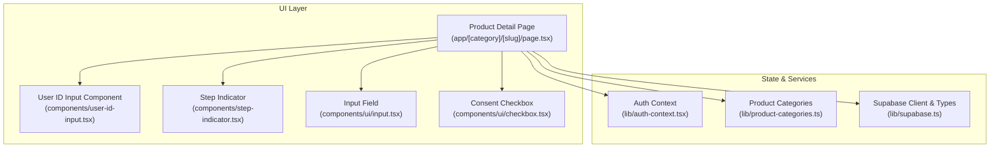
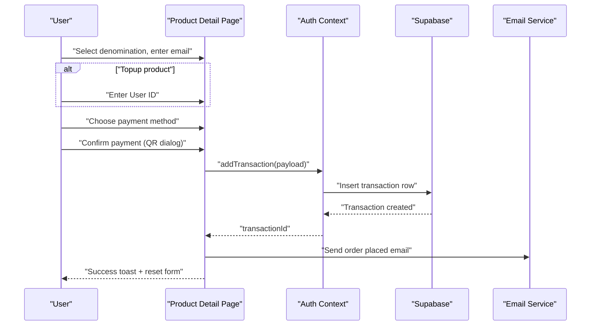
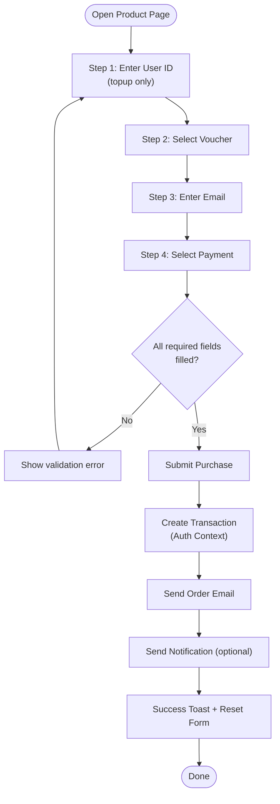
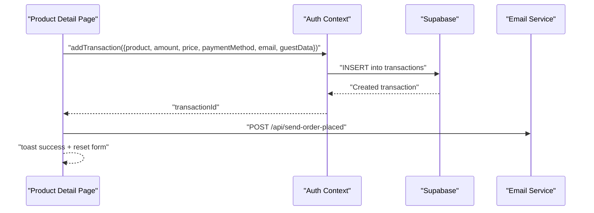
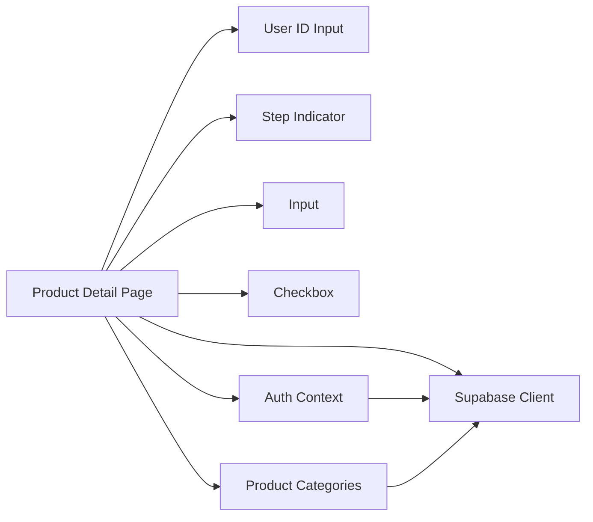

# Purchase Flow and Checkout Process

<cite>
**Referenced Files in This Document**
- [app/[category]/[slug]/page.tsx](file://app/[category]/[slug]/page.tsx)
- [components/user-id-input.tsx](file://components/user-id-input.tsx)
- [components/step-indicator.tsx](file://components/step-indicator.tsx)
- [lib/auth-context.tsx](file://lib/auth-context.tsx)
- [lib/supabase.ts](file://lib/supabase.ts)
- [lib/product-categories.ts](file://lib/product-categories.ts)
- [app/actions/auth.ts](file://app/actions/auth.ts)
- [components/ui/input.tsx](file://components/ui/input.tsx)
- [components/ui/checkbox.tsx](file://components/ui/checkbox.tsx)
</cite>

## Table of Contents
1. [Introduction](#introduction)
2. [Project Structure](#project-structure)
3. [Core Components](#core-components)
4. [Architecture Overview](#architecture-overview)
5. [Detailed Component Analysis](#detailed-component-analysis)
6. [Dependency Analysis](#dependency-analysis)
7. [Performance Considerations](#performance-considerations)
8. [Troubleshooting Guide](#troubleshooting-guide)
9. [Conclusion](#conclusion)

## Introduction
This document explains the multi-step purchase flow and checkout process implemented in the application. It covers the step-by-step workflow for selecting a product, entering a user ID (for topup products), choosing a denomination, providing an email address, and selecting a payment method. It documents form validation, state management, user progress tracking, configuration options for required fields and consent checkboxes, and the integration with authentication and transaction management. Real-time updates and common checkout issues are also addressed to help both business stakeholders and developers implement or maintain similar checkout experiences.

## Project Structure
The purchase flow is primarily implemented in a single product detail page that orchestrates:
- Product metadata and denominations
- Multi-step form UI with progress indicators
- Validation and state management
- Transaction creation and persistence
- Payment method selection and QR-based confirmation
- Notifications and email confirmations

**Diagram sources**
- [app/[category]/[slug]/page.tsx](file://app/[category]/[slug]/page.tsx)
- [components/user-id-input.tsx](file://components/user-id-input.tsx)
- [components/step-indicator.tsx](file://components/step-indicator.tsx)
- [components/ui/input.tsx](file://components/ui/input.tsx)
- [components/ui/checkbox.tsx](file://components/ui/checkbox.tsx)
- [lib/auth-context.tsx](file://lib/auth-context.tsx)
- [lib/product-categories.ts](file://lib/product-categories.ts)
- [lib/supabase.ts](file://lib/supabase.ts)

**Section sources**
- [app/[category]/[slug]/page.tsx](file://app/[category]/[slug]/page.tsx)
- [lib/product-categories.ts](file://lib/product-categories.ts)

## Core Components
- Product Detail Page: Renders product info, denominations, and the multi-step purchase form. Manages state for denomination, payment method, email, user ID (topup), and consent preferences. Handles purchase submission and transaction creation.
- User ID Input Component: Dedicated input for topup products with basic validation and loading states.
- Step Indicator: Visual indicator for current step in the checkout flow.
- Input and Checkbox UI: Reusable form controls used across the purchase form.
- Auth Context: Provides authentication state, user profile, and transaction lifecycle functions (create and update status).
- Product Categories: Loads product metadata, denominations, FAQs, and fallbacks.
- Supabase Client and Types: Database client and strongly typed tables for products, transactions, and payment methods.

**Section sources**
- [app/[category]/[slug]/page.tsx](file://app/[category]/[slug]/page.tsx)
- [components/user-id-input.tsx](file://components/user-id-input.tsx)
- [components/step-indicator.tsx](file://components/step-indicator.tsx)
- [components/ui/input.tsx](file://components/ui/input.tsx)
- [components/ui/checkbox.tsx](file://components/ui/checkbox.tsx)
- [lib/auth-context.tsx](file://lib/auth-context.tsx)
- [lib/product-categories.ts](file://lib/product-categories.ts)
- [lib/supabase.ts](file://lib/supabase.ts)

## Architecture Overview
The checkout flow integrates UI components, state management, and backend services:
- UI captures user selections and validates required fields.
- Auth Context persists and manages user identity and transactions.
- Supabase stores product and transaction data.
- Server actions handle authentication and email dispatch.
- Real-time updates occur via local state and toast notifications.

**Diagram sources**
- [app/[category]/[slug]/page.tsx](file://app/[category]/[slug]/page.tsx)
- [lib/auth-context.tsx](file://lib/auth-context.tsx)
- [lib/supabase.ts](file://lib/supabase.ts)

## Detailed Component Analysis

### Multi-Step Purchase Workflow
The checkout is structured as a guided form with steps:
1. Enter User ID (topup products only)
2. Select Voucher Denomination
3. Enter Email Address
4. Select Payment Method and Confirm

Progress is tracked visually and programmatically to enable step completion checks and button enabling/disabling.

**Diagram sources**
- [app/[category]/[slug]/page.tsx](file://app/[category]/[slug]/page.tsx)
- [lib/auth-context.tsx](file://lib/auth-context.tsx)

**Section sources**
- [app/[category]/[slug]/page.tsx](file://app/[category]/[slug]/page.tsx)

### Step-by-Step Breakdown

#### Step 1: User ID Entry (Topup Products)
- Conditionally rendered only when the product category is topup.
- Uses a dedicated component with client-side validation and loading state.
- On submit, passes the validated user ID to the parent form.

Validation highlights:
- Empty or whitespace-only entries trigger an error message.
- The form remains disabled during processing.

State management:
- Controlled input bound to component state.
- Passed upward to the main purchase form on success.

**Section sources**
- [components/user-id-input.tsx](file://components/user-id-input.tsx)
- [app/[category]/[slug]/page.tsx](file://app/[category]/[slug]/page.tsx)

#### Step 2: Denomination Selection
- Displays available denominations for the selected product.
- Supports bestseller badges and optional denomination icons.
- Selected denomination is stored in component state.

Validation highlights:
- Denomination must be chosen before proceeding.

**Section sources**
- [app/[category]/[slug]/page.tsx](file://app/[category]/[slug]/page.tsx)

#### Step 3: Email Input
- Email field is required for all products.
- Prefilled with the logged-in user’s email if available.
- Controlled input with standard input styling.

Validation highlights:
- Required field enforced at purchase time.

**Section sources**
- [app/[category]/[slug]/page.tsx](file://app/[category]/[slug]/page.tsx)
- [components/ui/input.tsx](file://components/ui/input.tsx)

#### Step 4: Payment Method Choice and Confirmation
- Loads enabled payment methods from the database.
- Presents selectable payment options with logos and instructions.
- Opens a QR dialog with payment instructions and total cost.
- Confirms payment and triggers purchase submission.

Validation highlights:
- Payment method must be selected.
- Proceed button is disabled until all required fields are filled.

**Section sources**
- [app/[category]/[slug]/page.tsx](file://app/[category]/[slug]/page.tsx)
- [lib/supabase.ts](file://lib/supabase.ts)

### Form Validation and State Management
- Validation occurs on purchase initiation:
  - Denomination must be selected.
  - Email must be present.
  - For topup products, User ID is required.
- UI disables buttons and shows a toast error when validation fails.
- Local state tracks selections and processing status.
- Consent checkboxes for marketing and SMS are supported but not required for purchase.

Real-time feedback:
- Toast notifications inform users of success or errors.
- Form resets after successful submission.

**Section sources**
- [app/[category]/[slug]/page.tsx](file://app/[category]/[slug]/page.tsx)
- [components/ui/checkbox.tsx](file://components/ui/checkbox.tsx)

### Transaction Creation and Persistence
- Purchase submission calls the Auth Context function to create a transaction.
- Payload includes product, amount, price, payment method, email, and optional guest data for topup.
- Transaction status is initialized as Processing and stored in the database.
- On success, an order confirmation email is sent via a server endpoint.
- Optional in-app notification is sent to logged-in users.

**Diagram sources**
- [app/[category]/[slug]/page.tsx](file://app/[category]/[slug]/page.tsx)
- [lib/auth-context.tsx](file://lib/auth-context.tsx)
- [lib/supabase.ts](file://lib/supabase.ts)

**Section sources**
- [lib/auth-context.tsx](file://lib/auth-context.tsx)
- [lib/supabase.ts](file://lib/supabase.ts)

### Configuration Options and Product Metadata
- Products are loaded from Supabase with categories, denominations, FAQs, and optional icons.
- Fallback data is used when Supabase is unavailable.
- Payment methods are fetched from the database and ordered by sort order.

Key configuration points:
- Product category determines whether the User ID step is shown.
- Denominations define available choices and pricing.
- Payment methods define selectable options and QR instructions.

**Section sources**
- [lib/product-categories.ts](file://lib/product-categories.ts)
- [lib/supabase.ts](file://lib/supabase.ts)

### Authentication Context and Real-Time Updates
- Auth Context provides login, signup, logout, and transaction management functions.
- Transactions are loaded on login and appended on successful purchases.
- Status updates are persisted to the database and reflected in local state.

Integration points:
- Login/signup actions are server actions that revalidate paths and redirect.
- Notifications are sent to logged-in users upon purchase.

**Section sources**
- [lib/auth-context.tsx](file://lib/auth-context.tsx)
- [app/actions/auth.ts](file://app/actions/auth.ts)

## Dependency Analysis
The checkout flow depends on:
- UI components for inputs, radios, and dialogs
- Auth Context for user and transaction state
- Supabase for product and transaction data
- Server actions for authentication and email dispatch

**Diagram sources**
- [app/[category]/[slug]/page.tsx](file://app/[category]/[slug]/page.tsx)
- [components/user-id-input.tsx](file://components/user-id-input.tsx)
- [components/step-indicator.tsx](file://components/step-indicator.tsx)
- [components/ui/input.tsx](file://components/ui/input.tsx)
- [components/ui/checkbox.tsx](file://components/ui/checkbox.tsx)
- [lib/auth-context.tsx](file://lib/auth-context.tsx)
- [lib/product-categories.ts](file://lib/product-categories.ts)
- [lib/supabase.ts](file://lib/supabase.ts)

**Section sources**
- [app/[category]/[slug]/page.tsx](file://app/[category]/[slug]/page.tsx)
- [lib/auth-context.tsx](file://lib/auth-context.tsx)
- [lib/product-categories.ts](file://lib/product-categories.ts)
- [lib/supabase.ts](file://lib/supabase.ts)

## Performance Considerations
- Product data is cached to reduce repeated database queries.
- Loading states and overlays improve perceived performance during navigation and initial loads.
- QR dialog and toast notifications provide immediate feedback without full page reloads.
- Recommendations:
  - Keep denomination lists concise to avoid rendering overhead.
  - Debounce input changes where appropriate.
  - Use server actions for sensitive operations to minimize client-side logic.

[No sources needed since this section provides general guidance]

## Troubleshooting Guide
Common issues and resolutions:
- Incomplete forms:
  - Symptom: Purchase button disabled or error toast appears.
  - Cause: Missing denomination, email, or user ID for topup products.
  - Resolution: Ensure all required fields are selected and validated before submission.
- Validation errors:
  - Symptom: Error messages appear near invalid fields.
  - Cause: Empty or invalid inputs.
  - Resolution: Correct inputs and retry submission.
- State persistence:
  - Symptom: Fields reset after submission.
  - Cause: Form reset after successful purchase.
  - Resolution: Re-enter details if resubmitting; note that a new transaction is created each time.
- Email failures:
  - Symptom: Order succeeds but email not received.
  - Cause: External email service failure.
  - Resolution: Retry later; order remains in Processing status for admin review.
- Authentication issues:
  - Symptom: Login/signup errors.
  - Cause: Invalid credentials or server action failures.
  - Resolution: Verify credentials and check server logs; welcome emails are best-effort.

**Section sources**
- [app/[category]/[slug]/page.tsx](file://app/[category]/[slug]/page.tsx)
- [lib/auth-context.tsx](file://lib/auth-context.tsx)
- [app/actions/auth.ts](file://app/actions/auth.ts)

## Conclusion
The checkout process is a well-structured, multi-step form that enforces required fields, manages state locally, and persists transactions through the Auth Context and Supabase. It supports topup-specific user ID entry, flexible denomination selection, and QR-based payment confirmation. Real-time feedback via toasts and notifications ensures a smooth user experience. By leveraging the provided components and context, teams can implement or extend similar checkout flows with confidence.