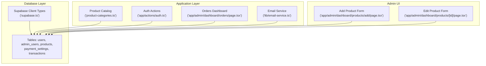
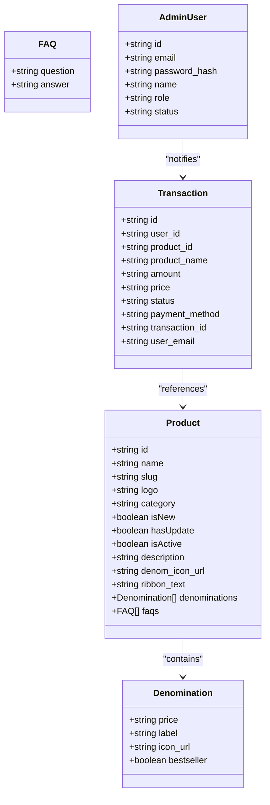
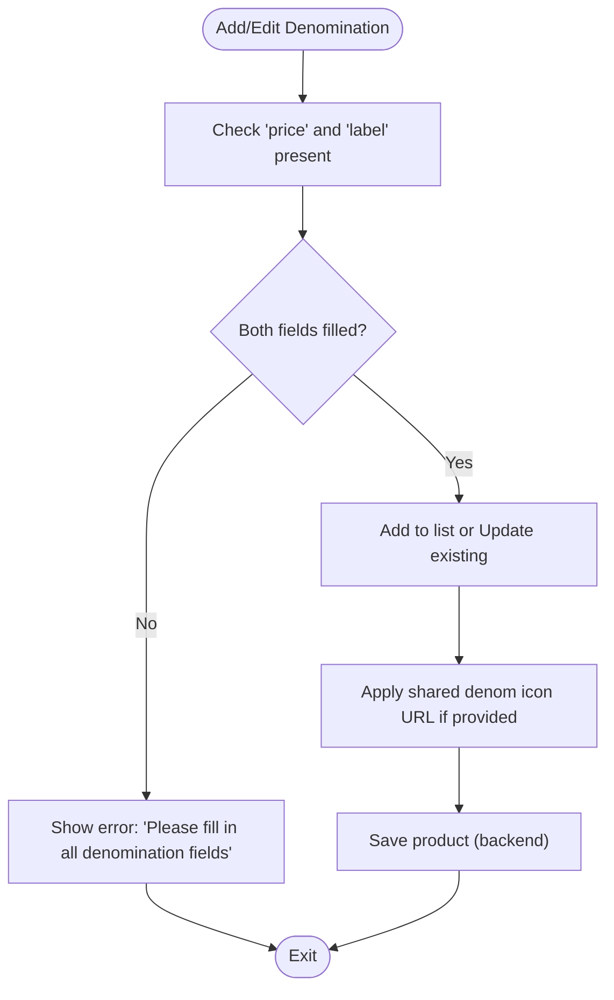
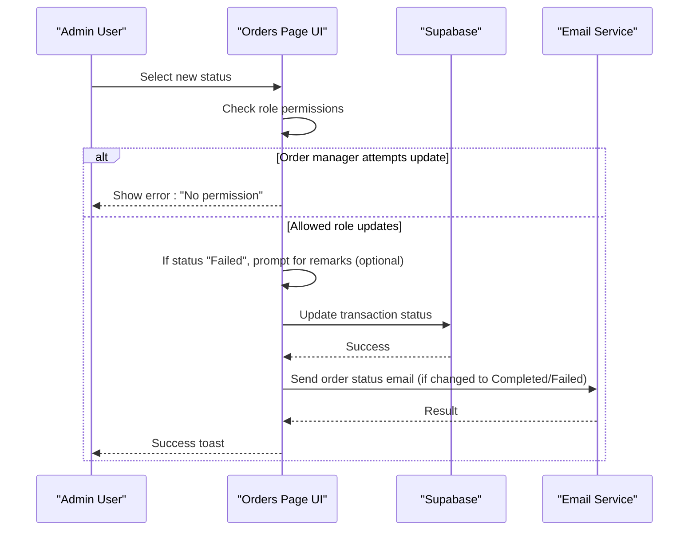
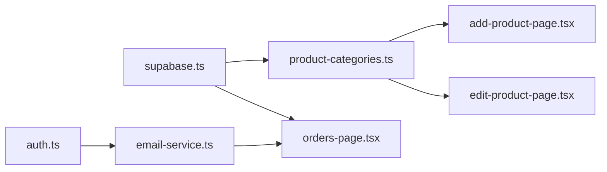

# Data Types and Validation

<cite>
**Referenced Files in This Document**
- [supabase.ts](file://lib/supabase.ts)
- [product-categories.ts](file://lib/product-categories.ts)
- [database-init.ts](file://lib/database-init.ts)
- [email-service.ts](file://lib/email-service.ts)
- [auth.ts](file://app/actions/auth.ts)
- [add-product-page.tsx](file://app/admin/dashboard/products/add/page.tsx)
- [edit-product-page.tsx](file://app/admin/dashboard/products/[id]/page.tsx)
- [orders-page.tsx](file://app/admin/dashboard/orders/page.tsx)
- [send-order-status-route.ts](file://app/api/send-order-status/route.ts)
- [send-welcome-route.ts](file://app/api/send-welcome/route.ts)
- [rs-lines.txt](file://rs-lines.txt)
</cite>

## Table of Contents
1. [Introduction](#introduction)
2. [Project Structure](#project-structure)
3. [Core Components](#core-components)
4. [Architecture Overview](#architecture-overview)
5. [Detailed Component Analysis](#detailed-component-analysis)
6. [Dependency Analysis](#dependency-analysis)
7. [Performance Considerations](#performance-considerations)
8. [Troubleshooting Guide](#troubleshooting-guide)
9. [Conclusion](#conclusion)

## Introduction
This document explains the data type system and validation rules used throughout the Byiora database and application. It focuses on:
- Enum-like string types for status, roles, and categories
- String validation for emails, product names, and descriptions
- Numeric validation for amounts and prices (including decimal precision and ranges)
- Array data types for product denominations and how they are validated
- Examples of validation failures and recommended resolutions

## Project Structure
The data model and validation logic span several layers:
- Database schema and TypeScript types in the Supabase client definition
- Product catalog and denominated pricing logic
- Admin product creation/editing forms with client-side validation
- Transaction status management with controlled state transitions
- Email service with basic email format checks

**Diagram sources**
- [supabase.ts:9-187](file://lib/supabase.ts#L9-L187)
- [product-categories.ts:3-25](file://lib/product-categories.ts#L3-L25)
- [auth.ts:8-59](file://app/actions/auth.ts#L8-L59)
- [orders-page.tsx:17-37](file://app/admin/dashboard/orders/page.tsx#L17-L37)
- [email-service.ts:14-25](file://lib/email-service.ts#L14-L25)
- [add-product-page.tsx:28-49](file://app/admin/dashboard/products/add/page.tsx#L28-L49)
- [edit-product-page.tsx:33-56](file://app/admin/dashboard/products/[id]/page.tsx#L33-L56)

**Section sources**
- [supabase.ts:9-187](file://lib/supabase.ts#L9-L187)
- [product-categories.ts:3-25](file://lib/product-categories.ts#L3-L25)
- [auth.ts:8-59](file://app/actions/auth.ts#L8-L59)
- [orders-page.tsx:17-37](file://app/admin/dashboard/orders/page.tsx#L17-L37)
- [email-service.ts:14-25](file://lib/email-service.ts#L14-L25)
- [add-product-page.tsx:28-49](file://app/admin/dashboard/products/add/page.tsx#L28-L49)
- [edit-product-page.tsx:33-56](file://app/admin/dashboard/products/[id]/page.tsx#L33-L56)

## Core Components
- Database types and enums:
  - Status: "Completed", "Failed", "Processing", "Cancelled"
  - Roles: "admin", "sub_admin", "order_management"
  - Categories: "topup", "digital-goods"
- Product entity with:
  - String fields: id, name, slug, logo, description
  - Boolean flags: is_active, is_new, has_update
  - Array field: denominations (each item contains price, label, optional icon_url, optional bestseller)
  - Optional fields: denom_icon_url, ribbon_text, faqs
- Numeric fields:
  - amount and price are stored as strings in transactions
  - denominations.price is a string in the product catalog
- Email validation:
  - Basic presence and "@" check in email service
  - Auth actions normalize email to lowercase and trim whitespace

**Section sources**
- [supabase.ts:42-43](file://lib/supabase.ts#L42-L43)
- [supabase.ts:74-74](file://lib/supabase.ts#L74-L74)
- [supabase.ts:149-149](file://lib/supabase.ts#L149-L149)
- [product-categories.ts:3-25](file://lib/product-categories.ts#L3-L25)
- [email-service.ts:34-37](file://lib/email-service.ts#L34-L37)
- [email-service.ts:82-86](file://lib/email-service.ts#L82-L86)
- [auth.ts:39-41](file://app/actions/auth.ts#L39-L41)

## Architecture Overview
The data model enforces strong typing at compile-time while allowing flexible runtime validation in forms and services.

**Diagram sources**
- [product-categories.ts:3-25](file://lib/product-categories.ts#L3-L25)
- [supabase.ts:68-111](file://lib/supabase.ts#L68-L111)
- [supabase.ts:141-184](file://lib/supabase.ts#L141-L184)
- [supabase.ts:36-66](file://lib/supabase.ts#L36-L66)

## Detailed Component Analysis

### Enum Types and Controlled Values
- Status enum for transactions: "Completed", "Failed", "Processing", "Cancelled"
- Role enum for admin users: "admin", "sub_admin", "order_management"
- Category enum for products: "topup", "digital-goods"

Validation approach:
- Compile-time enforcement via TypeScript literal unions
- Runtime checks in UI and APIs to restrict values to allowed sets

**Section sources**
- [supabase.ts:42-43](file://lib/supabase.ts#L42-L43)
- [supabase.ts:74-74](file://lib/supabase.ts#L74-L74)
- [supabase.ts:149-149](file://lib/supabase.ts#L149-L149)

### String Validation Rules
- Emails:
  - Presence check and "@" inclusion in email service
  - Auth actions normalize email to lowercase and trim
- Product name:
  - Required in admin forms; trimmed before save
- Descriptions:
  - Optional; trimmed before save
- Slugs:
  - Generated from name automatically unless manually edited
  - Admin forms enforce presence and uniqueness expectations via backend constraints

**Section sources**
- [email-service.ts:34-37](file://lib/email-service.ts#L34-L37)
- [email-service.ts:82-86](file://lib/email-service.ts#L82-L86)
- [auth.ts:39-41](file://app/actions/auth.ts#L39-L41)
- [add-product-page.tsx:118-136](file://app/admin/dashboard/products/add/page.tsx#L118-L136)
- [add-product-page.tsx:138-142](file://app/admin/dashboard/products/add/page.tsx#L138-L142)

### Numeric Validation for Amounts and Prices
- Stored as strings in transactions (amount, price)
- Denominations price is a string in product catalog
- No explicit decimal precision or range validation in the codebase
- UI displays currency formatting consistently (e.g., "Rs. X")

Recommendations for robust validation:
- Enforce minimum and maximum numeric bounds for price and amount
- Validate decimal places (e.g., two decimal places for currency)
- Reject negative values and non-numeric inputs

Evidence from UI:
- Currency formatting references indicate numeric values are handled as strings with "Rs." prefixes

**Section sources**
- [supabase.ts:147-148](file://lib/supabase.ts#L147-L148)
- [product-categories.ts:15-20](file://lib/product-categories.ts#L15-L20)
- [rs-lines.txt:1-32](file://rs-lines.txt#L1-L32)

### Array Data Types: Product Denominations
- Type: Array of objects with keys: price (string), label (string), optional icon_url (string), optional bestseller (boolean)
- Validation in forms:
  - Both add and edit forms require both price and label for each denomination
  - Optional shared icon URL applied to all denominations during save
- Backend persistence:
  - Products table stores denominations as JSON; no strict schema validation enforced in code

**Diagram sources**
- [add-product-page.tsx:189-200](file://app/admin/dashboard/products/add/page.tsx#L189-L200)
- [add-product-page.tsx:147-151](file://app/admin/dashboard/products/add/page.tsx#L147-L151)
- [edit-product-page.tsx:189-200](file://app/admin/dashboard/products/[id]/page.tsx#L189-L200)
- [edit-product-page.tsx:147-151](file://app/admin/dashboard/products/[id]/page.tsx#L147-L151)

**Section sources**
- [product-categories.ts:15-20](file://lib/product-categories.ts#L15-L20)
- [add-product-page.tsx:189-200](file://app/admin/dashboard/products/add/page.tsx#L189-L200)
- [edit-product-page.tsx:189-200](file://app/admin/dashboard/products/[id]/page.tsx#L189-L200)

### Transaction Status Control Flow
- Allowed transitions are constrained by UI and logic
- Order managers cannot update status directly
- Marking as "Failed" requires remarks (optional in UI but persisted when provided)

**Diagram sources**
- [orders-page.tsx:184-251](file://app/admin/dashboard/orders/page.tsx#L184-L251)
- [orders-page.tsx:225-244](file://app/admin/dashboard/orders/page.tsx#L225-L244)
- [send-order-status-route.ts:141-156](file://app/api/send-order-status/route.ts#L141-L156)

**Section sources**
- [orders-page.tsx:184-251](file://app/admin/dashboard/orders/page.tsx#L184-L251)
- [orders-page.tsx:225-244](file://app/admin/dashboard/orders/page.tsx#L225-L244)

### Database Initialization and Connectivity Checks
- Environment variables validated before connecting
- Tables existence and data presence checked
- Graceful fallback to cached or static data when database is unavailable

**Section sources**
- [database-init.ts:10-24](file://lib/database-init.ts#L10-L24)
- [database-init.ts:26-87](file://lib/database-init.ts#L26-L87)
- [database-init.ts:89-111](file://lib/database-init.ts#L89-L111)
- [database-init.ts:113-163](file://lib/database-init.ts#L113-L163)

## Dependency Analysis
- Product catalog depends on Supabase client types for shape and enums
- Admin forms depend on product catalog types and enforce required fields
- Orders dashboard depends on transaction types and enforces status transitions
- Email service depends on environment configuration and performs minimal email validation

**Diagram sources**
- [supabase.ts:9-187](file://lib/supabase.ts#L9-L187)
- [product-categories.ts:3-25](file://lib/product-categories.ts#L3-L25)
- [orders-page.tsx:17-37](file://app/admin/dashboard/orders/page.tsx#L17-L37)
- [add-product-page.tsx:28-49](file://app/admin/dashboard/products/add/page.tsx#L28-L49)
- [edit-product-page.tsx:33-56](file://app/admin/dashboard/products/[id]/page.tsx#L33-L56)
- [email-service.ts:14-25](file://lib/email-service.ts#L14-L25)
- [auth.ts:8-59](file://app/actions/auth.ts#L8-L59)

**Section sources**
- [supabase.ts:9-187](file://lib/supabase.ts#L9-L187)
- [product-categories.ts:3-25](file://lib/product-categories.ts#L3-L25)
- [orders-page.tsx:17-37](file://app/admin/dashboard/orders/page.tsx#L17-L37)
- [email-service.ts:14-25](file://lib/email-service.ts#L14-L25)
- [auth.ts:8-59](file://app/actions/auth.ts#L8-L59)

## Performance Considerations
- Caching: Product catalog caches results for a fixed duration to reduce database load
- Minimal validation in forms reduces server round trips
- Email sending falls back gracefully if external services are unavailable

**Section sources**
- [product-categories.ts:190-198](file://lib/product-categories.ts#L190-L198)
- [email-service.ts:77-80](file://lib/email-service.ts#L77-L80)

## Troubleshooting Guide
Common validation failures and resolutions:
- Missing product name:
  - Symptom: Save blocked with error
  - Resolution: Enter a product name; form trims input before saving
  - Evidence: [add-product-page.tsx:138-142](file://app/admin/dashboard/products/add/page.tsx#L138-L142)
- Missing denomination fields:
  - Symptom: Error prompting to fill "price" and "label"
  - Resolution: Ensure both fields are provided for each denomination
  - Evidence: [add-product-page.tsx:189-193](file://app/admin/dashboard/products/add/page.tsx#L189-L193)
- Invalid email:
  - Symptom: Email service rejects missing or malformed email
  - Resolution: Ensure email contains "@" and is provided
  - Evidence: [email-service.ts:34-37](file://lib/email-service.ts#L34-L37), [email-service.ts:82-86](file://lib/email-service.ts#L82-L86)
- Transaction status update denied:
  - Symptom: Permission error for order management role
  - Resolution: Use an allowed role or provide remarks for "Failed" status
  - Evidence: [orders-page.tsx:184-196](file://app/admin/dashboard/orders/page.tsx#L184-L196)
- Database not configured:
  - Symptom: Fallback to cached/static data
  - Resolution: Set environment variables and run setup scripts
  - Evidence: [database-init.ts:10-24](file://lib/database-init.ts#L10-L24), [database-init.ts:26-87](file://lib/database-init.ts#L26-L87)

## Conclusion
Byiora enforces strong data typing via TypeScript literal unions for enums and structured product entities. Client-side forms apply practical validations for required fields and basic constraints. Numeric fields are currently stored as strings with UI-level formatting; adding explicit decimal precision and range checks would improve robustness. Transaction status transitions are role-restricted and include optional remarks for failures. Email validation is minimal but functional, with graceful fallbacks. Extending backend schema validation and adding stricter numeric checks would further strengthen the system.