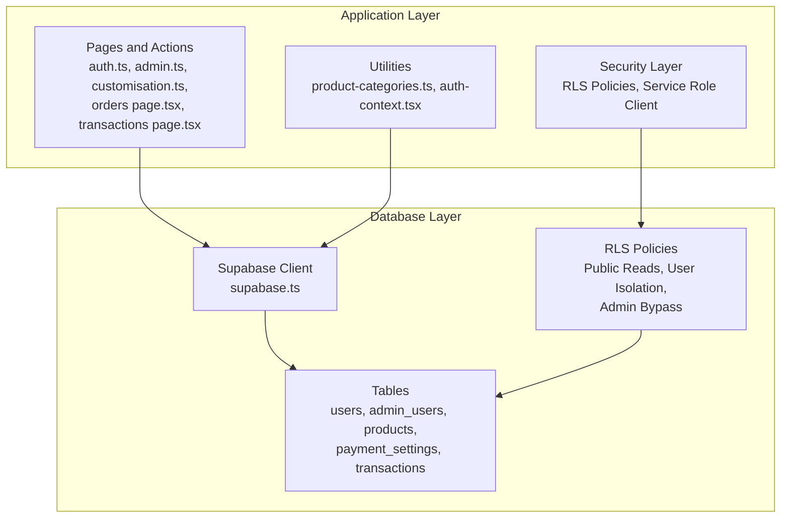
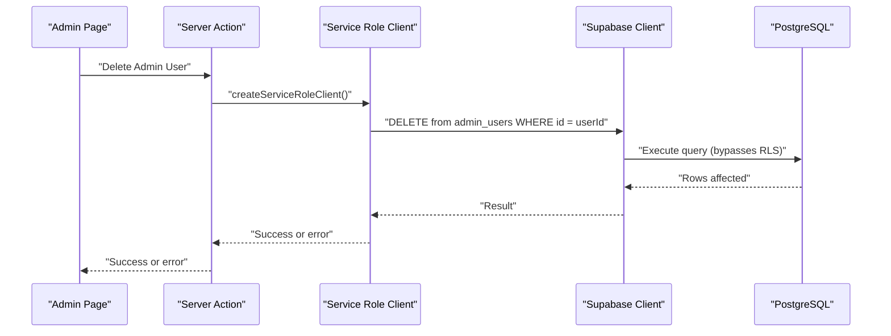
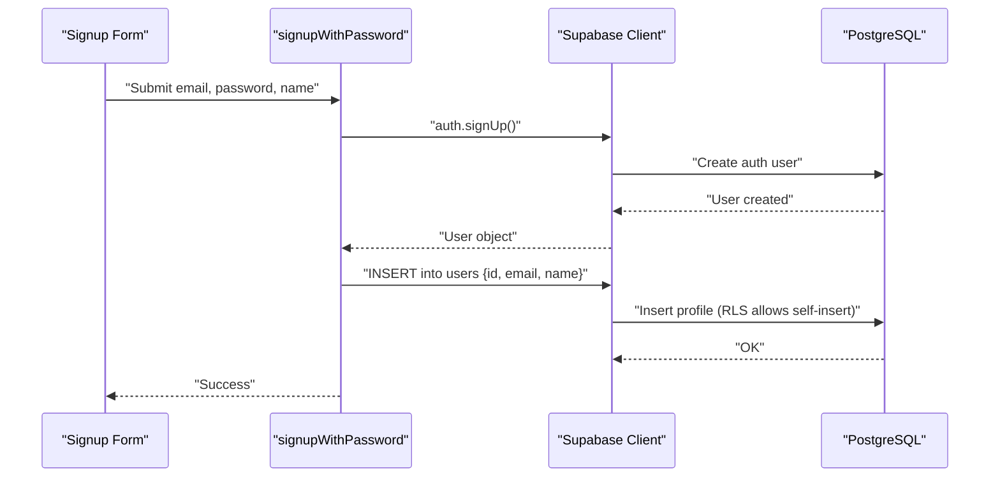
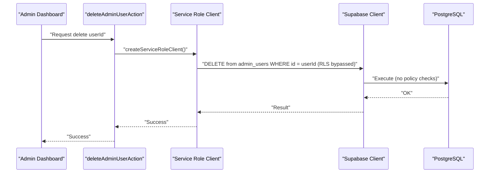
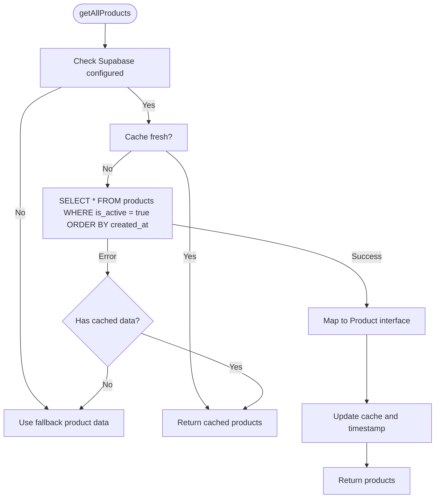
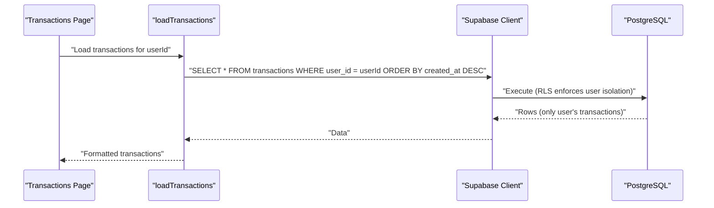
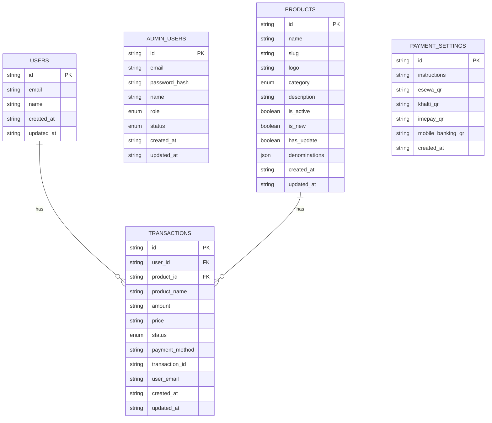
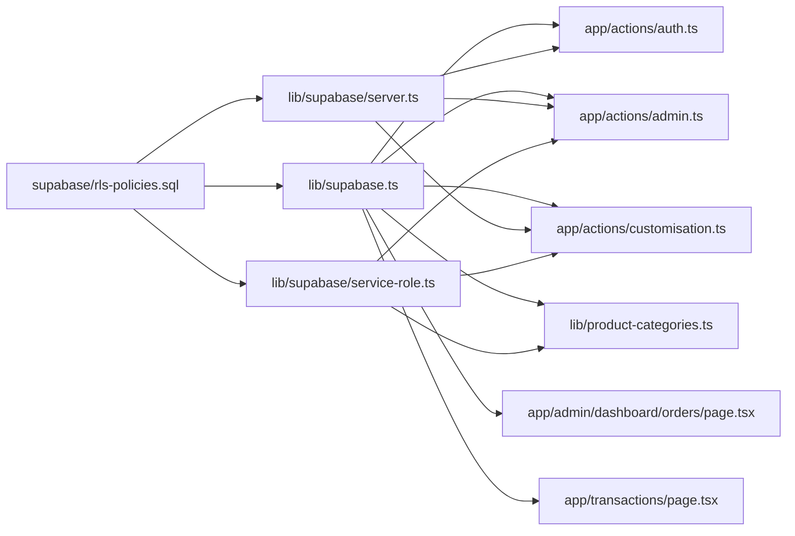

# Database Design

<cite>
**Referenced Files in This Document**
- [supabase.ts](file://lib/supabase.ts)
- [server.ts](file://lib/supabase/server.ts)
- [service-role.ts](file://lib/supabase/service-role.ts)
- [database-init.ts](file://lib/database-init.ts)
- [auth.ts](file://app/actions/auth.ts)
- [admin.ts](file://app/actions/admin.ts)
- [customisation.ts](file://app/actions/customisation.ts)
- [product-categories.ts](file://lib/product-categories.ts)
- [rls-policies.sql](file://supabase/rls-policies.sql)
- [RLS-MIGRATION-GUIDE.md](file://RLS-MIGRATION-GUIDE.md)
- [orders page.tsx](file://app/admin/dashboard/orders/page.tsx)
- [admin-users page.tsx](file://app/admin/dashboard/admin-users/page.tsx)
- [customisation page.tsx](file://app/admin/dashboard/customisation/page.tsx)
- [category product page.tsx](file://app/[category]/[slug]/page.tsx)
- [transactions page.tsx](file://app/transactions/page.tsx)
- [auth-context.tsx](file://lib/auth-context.tsx)
</cite>

## Update Summary
**Changes Made**
- Enhanced security framework documentation with comprehensive RLS policies implementation
- Added Service Role client integration for administrative bypass mechanisms
- Updated security architecture to include administrative bypass patterns
- Expanded access control documentation with policy enforcement details
- Added security considerations for guest checkout and user isolation

## Table of Contents
1. [Introduction](#introduction)
2. [Project Structure](#project-structure)
3. [Core Components](#core-components)
4. [Architecture Overview](#architecture-overview)
5. [Enhanced Security Framework](#enhanced-security-framework)
6. [Detailed Component Analysis](#detailed-component-analysis)
7. [Dependency Analysis](#dependency-analysis)
8. [Performance Considerations](#performance-considerations)
9. [Troubleshooting Guide](#troubleshooting-guide)
10. [Conclusion](#conclusion)
11. [Appendices](#appendices)

## Introduction
This document describes the Byiora database schema and data model as implemented in the codebase. It focuses on the entities users, admin_users, products, payment_settings, and transactions, detailing their fields, data types, constraints, and relationships. The schema now includes a comprehensive security framework with Row Level Security (RLS) policies and Service Role client integration for administrative bypass mechanisms. It also documents data access patterns via the Supabase client, caching strategies for product listings, validation rules, lifecycle considerations, and enhanced security posture through Supabase RLS and access controls.

## Project Structure
The database schema is defined in TypeScript interfaces and consumed by Supabase client utilities. The application interacts with the database through:
- Supabase client initialization and typing
- Server-side client for secure server actions
- Service Role client for administrative bypass operations
- Frontend pages and actions that perform CRUD operations
- Utility modules for product listings and caching
- Comprehensive RLS policy enforcement

**Diagram sources**
- [supabase.ts:10-187](file://lib/supabase.ts#L10-L187)
- [server.ts:5-35](file://lib/supabase/server.ts#L5-L35)
- [service-role.ts:1-39](file://lib/supabase/service-role.ts#L1-L39)
- [rls-policies.sql:1-223](file://supabase/rls-policies.sql#L1-L223)
- [auth.ts:8-59](file://app/actions/auth.ts#L8-L59)
- [admin.ts:10-34](file://app/actions/admin.ts#L10-L34)
- [customisation.ts:15-80](file://app/actions/customisation.ts#L15-L80)
- [product-categories.ts:200-264](file://lib/product-categories.ts#L200-L264)
- [auth-context.tsx:94-127](file://lib/auth-context.tsx#L94-L127)

**Section sources**
- [supabase.ts:10-187](file://lib/supabase.ts#L10-L187)
- [server.ts:5-35](file://lib/supabase/server.ts#L5-L35)
- [service-role.ts:1-39](file://lib/supabase/service-role.ts#L1-L39)
- [database-init.ts:27-87](file://lib/database-init.ts#L27-L87)

## Core Components
This section defines the core database entities and their fields, types, and constraints inferred from the Supabase client typings and usage across the application, now enhanced with security framework considerations.

- users
  - Purpose: Stores customer profiles linked to Supabase Auth.
  - Fields:
    - id: string (primary key)
    - email: string
    - name: string
    - created_at: string (timestamp)
    - updated_at: string (timestamp)
  - Constraints:
    - Primary key: id
    - Unique constraints are enforced by Supabase Auth (email uniqueness).
  - Security:
    - RLS Policy: users_owner_read, users_owner_update, users_insert_self
    - Users can only access their own data via auth.uid()

- admin_users
  - Purpose: Stores administrative staff with roles and status.
  - Fields:
    - id: string (primary key)
    - email: string
    - password_hash: string
    - name: string
    - role: "admin" | "sub_admin" | "order_management"
    - status: "active" | "blocked"
    - created_at: string
    - updated_at: string
  - Constraints:
    - Primary key: id
    - Enum-like constraints enforced by union types for role and status.
  - Security:
    - RLS Policy: None (access controlled via Service Role bypass)
    - All operations require Service Role client for security

- products
  - Purpose: Product catalog with categories, metadata, and pricing denominations.
  - Fields:
    - id: string (primary key)
    - name: string
    - slug: string
    - logo: string
    - category: "topup" | "digital-goods"
    - description: string | null
    - is_active: boolean
    - is_new: boolean
    - has_update: boolean
    - denominations: any (JSON)
    - created_at: string
    - updated_at: string
  - Constraints:
    - Primary key: id
    - Unique constraints: slug (implied by usage patterns and typical schema design)
    - Enum-like constraint for category.
  - Security:
    - RLS Policy: products_public_read
    - Public can view active products, admin operations via Service Role

- payment_settings
  - Purpose: Stores payment method QR codes and instructions.
  - Fields:
    - id: string (primary key)
    - instructions: string | null
    - esewa_qr: string | null
    - khalti_qr: string | null
    - imepay_qr: string | null
    - mobile_banking_qr: string | null
    - created_at: string
  - Constraints:
    - Primary key: id

- transactions
  - Purpose: Records payment events and order outcomes.
  - Fields:
    - id: string (primary key)
    - user_id: string | null (foreign key to users.id)
    - product_id: string | null (foreign key to products.id)
    - product_name: string
    - amount: string
    - price: string
    - status: "Completed" | "Failed" | "Processing" | "Cancelled"
    - payment_method: string
    - transaction_id: string
    - user_email: string
    - created_at: string
    - updated_at: string
  - Constraints:
    - Primary key: id
    - Enum-like constraint for status
    - Optional foreign keys (nullable) to support guest transactions.
  - Security:
    - RLS Policies: transactions_anon_insert, transactions_owner_read, transactions_owner_update
    - Supports guest checkout via anonymous INSERT
    - User isolation via auth.uid() matching user_id

Notes on indexes and RLS:
- No explicit indexes are declared in the codebase. Typical indexes to consider:
  - products(slug) for fast slug lookups
  - transactions(user_id), transactions(product_id), transactions(transaction_id) for filtering and joins
  - users(email) for auth lookups
- RLS policies are managed in Supabase with comprehensive coverage for all tables
- Service Role client provides administrative bypass for privileged operations

**Section sources**
- [supabase.ts:13-184](file://lib/supabase.ts#L13-L184)
- [rls-policies.sql:66-147](file://supabase/rls-policies.sql#L66-L147)
- [service-role.ts:1-39](file://lib/supabase/service-role.ts#L1-L39)
- [auth.ts:38-45](file://app/actions/auth.ts#L38-L45)
- [auth-context.tsx:94-127](file://lib/auth-context.tsx#L94-L127)
- [orders page.tsx:17-37](file://app/admin/dashboard/orders/page.tsx#L17-L37)
- [transactions page.tsx:316-334](file://app/transactions/page.tsx#L316-L334)

## Architecture Overview
The application uses Supabase as the backend database and authentication provider with a comprehensive security framework. The Supabase client is initialized with typed interfaces, server actions use a server-side client for secure access, and administrative operations utilize a Service Role client that bypasses RLS entirely. Pages and utilities query and mutate data through these clients with appropriate security contexts.

**Diagram sources**
- [admin.ts:10-34](file://app/actions/admin.ts#L10-L34)
- [server.ts:5-35](file://lib/supabase/server.ts#L5-L35)
- [service-role.ts:27-38](file://lib/supabase/service-role.ts#L27-L38)

**Section sources**
- [supabase.ts:1-7](file://lib/supabase.ts#L1-L7)
- [server.ts:5-35](file://lib/supabase/server.ts#L5-L35)
- [service-role.ts:1-39](file://lib/supabase/service-role.ts#L1-L39)
- [database-init.ts:27-87](file://lib/database-init.ts#L27-L87)

## Enhanced Security Framework

### Row Level Security (RLS) Implementation
The database now implements comprehensive RLS policies across all tables with strategic design principles:

**Architectural Principles:**
1. **Admin operations use Service Role key** (bypasses RLS entirely)
2. **Guest checkout allows anonymous INSERT** on transactions
3. **Registered users can only access their own data**
4. **Public reads allowed for product catalog**

**Policy Categories:**

**Public Read Policies:**
- products_public_read: Public can view active products
- banners_public_read: Public can view active banners  
- homepage_categories_public_read: Public can view active categories

**User Isolation Policies:**
- users_owner_read: Users can view their own profile
- users_owner_update: Users can update their own profile
- transactions_owner_read: Users can view their own transactions
- transactions_owner_update: Users can update their own transactions
- notifications_owner_read: Users can view their own notifications

**Administrative Bypass Mechanisms:**
- admin_users: No policies - all access via Service Role only
- transactions_anon_insert: Anonymous users can create transactions (guest checkout)
- Force RLS: Even table owners must use policies

**Service Role Client Integration:**
- Dedicated client for administrative operations
- Bypasses RLS entirely for privileged operations
- Used exclusively in server-side admin actions
- Never exposed to browser context

**Section sources**
- [rls-policies.sql:1-223](file://supabase/rls-policies.sql#L1-L223)
- [service-role.ts:1-39](file://lib/supabase/service-role.ts#L1-L39)
- [RLS-MIGRATION-GUIDE.md:1-248](file://RLS-MIGRATION-GUIDE.md#L1-L248)

## Detailed Component Analysis

### Users Entity
- Purpose: Customer profiles synchronized with Supabase Auth.
- Key operations:
  - Insert on signup
  - Load transactions filtered by user_id
  - Account deletion via anonymization (not full deletion) to preserve referential integrity
- Data validation:
  - Email normalization and trimming during signup
  - Name trimming during signup
- Access control:
  - RLS policies govern visibility and modification permissions
  - users_owner_read: SELECT with USING (id = auth.uid())
  - users_owner_update: UPDATE with USING and WITH CHECK both set to (id = auth.uid())

**Diagram sources**
- [auth.ts:25-59](file://app/actions/auth.ts#L25-L59)
- [supabase.ts:13-35](file://lib/supabase.ts#L13-L35)

**Section sources**
- [auth.ts:25-59](file://app/actions/auth.ts#L25-L59)
- [auth-context.tsx:94-127](file://lib/auth-context.tsx#L94-L127)
- [auth-context.tsx:210-238](file://lib/auth-context.tsx#L210-L238)
- [rls-policies.sql:116-139](file://supabase/rls-policies.sql#L116-L139)

### Admin Users Entity
- Purpose: Administrative staff with role-based access.
- Key operations:
  - Delete admin user from both admin_users and users tables
  - Password reset for admin accounts
- Access control:
  - Admin-only actions require verification against admin_users table
  - **Updated**: All operations now use Service Role client that bypasses RLS entirely
  - Administrative bypass ensures only server-side verified admin actions can access

**Diagram sources**
- [admin.ts:10-34](file://app/actions/admin.ts#L10-L34)
- [service-role.ts:27-38](file://lib/supabase/service-role.ts#L27-L38)
- [admin-users page.tsx:247-261](file://app/admin/dashboard/admin-users/page.tsx#L247-L261)

**Section sources**
- [admin.ts:10-34](file://app/actions/admin.ts#L10-L34)
- [service-role.ts:1-39](file://lib/supabase/service-role.ts#L1-L39)
- [admin-users page.tsx:247-261](file://app/admin/dashboard/admin-users/page.tsx#L247-L261)
- [rls-policies.sql:141-147](file://supabase/rls-policies.sql#L141-L147)

### Products Entity
- Purpose: Product catalog with categories and denominations.
- Key operations:
  - Fetch all products with caching
  - Fetch by id or slug
  - Update product status and metadata
  - Delete product
- Caching strategy:
  - In-memory cache with TTL (5 minutes)
  - Fallback to static data when Supabase is unavailable
- Validation rules:
  - Category constrained to union type
  - Denominations stored as JSON
  - isActive flag controls visibility
- Security:
  - RLS Policy: products_public_read allows public read of active products
  - Admin operations require Service Role client for modifications

**Diagram sources**
- [product-categories.ts:200-264](file://lib/product-categories.ts#L200-L264)

**Section sources**
- [product-categories.ts:200-264](file://lib/product-categories.ts#L200-L264)
- [product-categories.ts:285-323](file://lib/product-categories.ts#L285-L323)
- [product-categories.ts:325-363](file://lib/product-categories.ts#L325-L363)
- [product-categories.ts:366-388](file://lib/product-categories.ts#L366-L388)
- [product-categories.ts:390-419](file://lib/product-categories.ts#L390-L419)
- [product-categories.ts:421-464](file://lib/product-categories.ts#L421-L464)
- [rls-policies.sql:66-78](file://supabase/rls-policies.sql#L66-L78)

### Transactions Entity
- Purpose: Payment and order lifecycle tracking.
- Key operations:
  - Load transactions by user_id
  - Insert new transaction with generated transaction_id
  - Update giftcard_code and failure remarks
- Validation rules:
  - Status constrained to union type
  - Amount and price stored as strings (monetary values)
  - Optional foreign keys to support guest purchases
- Security:
  - RLS Policies: transactions_anon_insert, transactions_owner_read, transactions_owner_update
  - Guest checkout supported via anonymous INSERT
  - User isolation via auth.uid() matching user_id

**Diagram sources**
- [auth-context.tsx:94-127](file://lib/auth-context.tsx#L94-L127)
- [transactions page.tsx:316-334](file://app/transactions/page.tsx#L316-L334)

**Section sources**
- [auth-context.tsx:94-127](file://lib/auth-context.tsx#L94-L127)
- [orders page.tsx:241-278](file://app/admin/dashboard/orders/page.tsx#L241-L278)
- [transactions page.tsx:316-334](file://app/transactions/page.tsx#L316-L334)
- [rls-policies.sql:80-111](file://supabase/rls-policies.sql#L80-L111)

### Payment Settings Entity
- Purpose: Centralized payment instructions and QR assets.
- Usage:
  - Accessed via client to render payment instructions and QR codes
- Constraints:
  - Single-row pattern via id primary key

**Section sources**
- [supabase.ts:112-140](file://lib/supabase.ts#L112-L140)

### Data Model Relationships

**Diagram sources**
- [supabase.ts:13-184](file://lib/supabase.ts#L13-L184)

**Section sources**
- [supabase.ts:13-184](file://lib/supabase.ts#L13-L184)

## Dependency Analysis
- Supabase client typing and runtime:
  - The Database interface in [supabase.ts:10-187](file://lib/supabase.ts#L10-L187) defines all table schemas and is used across the app.
  - The server-side client in [server.ts:5-35](file://lib/supabase/server.ts#L5-L35) is used in server actions for secure operations.
  - The Service Role client in [service-role.ts:1-39](file://lib/supabase/service-role.ts#L1-L39) provides administrative bypass for privileged operations.
- Application dependencies:
  - Authentication actions depend on Supabase Auth and the users table.
  - Admin actions depend on admin_users table and Service Role client for security.
  - Product utilities depend on products table and implement caching.
  - Transaction utilities depend on transactions table and optional users join.
  - All administrative operations now require Service Role client integration.

**Diagram sources**
- [supabase.ts:10-187](file://lib/supabase.ts#L10-L187)
- [server.ts:5-35](file://lib/supabase/server.ts#L5-L35)
- [service-role.ts:1-39](file://lib/supabase/service-role.ts#L1-L39)
- [rls-policies.sql:1-223](file://supabase/rls-policies.sql#L1-L223)
- [auth.ts:8-59](file://app/actions/auth.ts#L8-L59)
- [admin.ts:10-34](file://app/actions/admin.ts#L10-L34)
- [customisation.ts:15-80](file://app/actions/customisation.ts#L15-L80)
- [product-categories.ts:200-264](file://lib/product-categories.ts#L200-L264)
- [orders page.tsx:17-37](file://app/admin/dashboard/orders/page.tsx#L17-L37)
- [transactions page.tsx:316-334](file://app/transactions/page.tsx#L316-L334)

**Section sources**
- [supabase.ts:10-187](file://lib/supabase.ts#L10-L187)
- [server.ts:5-35](file://lib/supabase/server.ts#L5-L35)
- [service-role.ts:1-39](file://lib/supabase/service-role.ts#L1-L39)
- [rls-policies.sql:1-223](file://supabase/rls-policies.sql#L1-L223)
- [auth.ts:8-59](file://app/actions/auth.ts#L8-L59)
- [admin.ts:10-34](file://app/actions/admin.ts#L10-L34)
- [customisation.ts:15-80](file://app/actions/customisation.ts#L15-L80)
- [product-categories.ts:200-264](file://lib/product-categories.ts#L200-L264)
- [orders page.tsx:17-37](file://app/admin/dashboard/orders/page.tsx#L17-L37)
- [transactions page.tsx:316-334](file://app/transactions/page.tsx#L316-L334)

## Performance Considerations
- Caching for product listings:
  - In-memory cache with 5-minute TTL to reduce database load and improve responsiveness.
  - Fallback to static data when Supabase is unavailable.
- Batch operations:
  - Admin pages perform batch updates (e.g., sorting banners/categories) using concurrent requests to minimize latency.
- Real-time updates:
  - The codebase does not implement Supabase Realtime subscriptions. Consider adding subscriptions for live transaction updates and admin dashboards.
- Indexes:
  - Recommended indexes for improved query performance:
    - products(slug)
    - transactions(user_id), transactions(product_id), transactions(transaction_id)
    - users(email)
- **Updated**: Security overhead considerations:
  - RLS evaluation adds minimal overhead for user isolation
  - Service Role client bypasses RLS for administrative operations
  - Guest checkout via anonymous INSERT has negligible performance impact

**Section sources**
- [product-categories.ts:190-194](file://lib/product-categories.ts#L190-L194)
- [product-categories.ts:200-264](file://lib/product-categories.ts#L200-L264)
- [customisation page.tsx:169-173](file://app/admin/dashboard/customisation/page.tsx#L169-L173)

## Troubleshooting Guide
- Database connectivity checks:
  - The initialization module tests connectivity and verifies table existence and data presence.
- Common issues:
  - Missing environment variables for Supabase URL and keys cause configuration warnings.
  - Table not found errors indicate missing schema setup.
  - Network errors trigger fallback behavior for product queries.
  - **Updated**: RLS policy violations indicate incorrect client usage
  - **Updated**: Missing SUPABASE_SERVICE_ROLE_KEY prevents admin operations
- Actions:
  - Admin deletion action logs errors and returns structured messages for UI feedback.
  - Transaction insertion retries without optional fields if schema changes occur.
  - **Updated**: Service Role client configuration errors require environment variable setup

**Section sources**
- [database-init.ts:11-24](file://lib/database-init.ts#L11-L24)
- [database-init.ts:27-87](file://lib/database-init.ts#L27-L87)
- [database-init.ts:114-163](file://lib/database-init.ts#L114-L163)
- [admin.ts:23-26](file://app/actions/admin.ts#L23-L26)
- [auth-context.tsx:282-292](file://lib/auth-context.tsx#L282-L292)
- [RLS-MIGRATION-GUIDE.md:193-210](file://RLS-MIGRATION-GUIDE.md#L193-L210)

## Conclusion
The Byiora database schema centers on users, admin_users, products, payment_settings, and transactions, with Supabase providing typed client access and comprehensive RLS for security. The enhanced security framework now includes strategic RLS policies with administrative bypass mechanisms through Service Role client integration. The application implements practical caching for product listings, robust server-side actions for admin tasks with proper security contexts, and clear validation rules enforced by TypeScript enums and JSON fields. The new Service Role client ensures that administrative operations bypass RLS while maintaining strict user isolation for regular operations. To enhance performance and user experience, consider adding recommended indexes and Supabase Realtime subscriptions for live updates.

## Appendices

### Data Lifecycle
- User sessions:
  - Managed by Supabase Auth; profile rows are inserted on signup and anonymized on account deletion.
- Transaction records:
  - Created with a generated transaction_id; updated with giftcard_code and status transitions.
  - **Updated**: Guest checkout supported via anonymous INSERT with user isolation.
- Product inventory:
  - Controlled via is_active flags and caching; deletions clear cache to force refresh.
  - **Updated**: Admin operations now use Service Role client for modifications.

**Section sources**
- [auth.ts:38-45](file://app/actions/auth.ts#L38-L45)
- [auth-context.tsx:210-238](file://lib/auth-context.tsx#L210-L238)
- [auth-context.tsx:240-292](file://lib/auth-context.tsx#L240-L292)
- [product-categories.ts:390-419](file://lib/product-categories.ts#L390-L419)
- [product-categories.ts:366-388](file://lib/product-categories.ts#L366-L388)

### Data Validation Rules
- Enum constraints:
  - role, status (admin_users)
  - category (products)
  - status (transactions)
- Data types:
  - Monetary values stored as strings
  - Denominations stored as JSON
- Input sanitization:
  - Admin actions sanitize titles and links before persistence.
- **Updated**: RLS validation ensures data isolation and access control.

**Section sources**
- [supabase.ts:42-43](file://lib/supabase.ts#L42-L43)
- [supabase.ts:74-75](file://lib/supabase.ts#L74-L75)
- [supabase.ts:149](file://lib/supabase.ts#L149)
- [customisation.ts:19-21](file://app/actions/customisation.ts#L19-L21)
- [customisation.ts:39-41](file://app/actions/customisation.ts#L39-L41)

### Security and Access Control
- Supabase Row Level Security:
  - Policies are configured in Supabase to restrict row access based on user identity and roles.
  - **Updated**: Comprehensive policy coverage across all tables with strategic design.
- Role-based access:
  - Admin-only actions verify admin_users membership before executing privileged operations.
  - **Updated**: Service Role client provides administrative bypass for security-critical operations.
- Privacy:
  - User data anonymization on deletion preserves referential integrity while removing personal identifiers.
  - **Updated**: User isolation via auth.uid() ensures data privacy.
- **Updated**: Administrative bypass security:
  - Service Role key bypasses RLS entirely for privileged operations
  - Never exposed to browser context
  - Used exclusively in server-side admin actions

**Section sources**
- [customisation.ts:6-13](file://app/actions/customisation.ts#L6-L13)
- [admin-users page.tsx:283-295](file://app/admin/dashboard/admin-users/page.tsx#L283-L295)
- [auth-context.tsx:210-238](file://lib/auth-context.tsx#L210-L238)
- [rls-policies.sql:1-223](file://supabase/rls-policies.sql#L1-L223)
- [service-role.ts:1-39](file://lib/supabase/service-role.ts#L1-L39)
- [RLS-MIGRATION-GUIDE.md:228-248](file://RLS-MIGRATION-GUIDE.md#L228-L248)

### Sample Data
- Representative product entries:
  - Featured gift cards and web store games are included as fallback data for development and offline scenarios.
- Notes:
  - These are illustrative entries and not part of the production database.

**Section sources**
- [product-categories.ts:28-121](file://lib/product-categories.ts#L28-L121)
- [product-categories.ts:123-188](file://lib/product-categories.ts#L123-L188)

### Service Role Client Integration
- Purpose: Provides administrative bypass for privileged operations
- Security:
  - Uses SUPABASE_SERVICE_ROLE_KEY which bypasses RLS entirely
  - Never exposed to browser context
  - Used exclusively in server-side admin actions
- Usage patterns:
  - Admin user deletion operations
  - Product management operations
  - Banner and category management
  - Transaction status updates
- Configuration:
  - Requires SUPABASE_SERVICE_ROLE_KEY environment variable
  - Client configured with autoRefreshToken and persistSession disabled

**Section sources**
- [service-role.ts:1-39](file://lib/supabase/service-role.ts#L1-L39)
- [admin.ts:10-34](file://app/actions/admin.ts#L10-L34)
- [customisation.ts:16-34](file://app/actions/customisation.ts#L16-L34)
- [RLS-MIGRATION-GUIDE.md:38-100](file://RLS-MIGRATION-GUIDE.md#L38-L100)