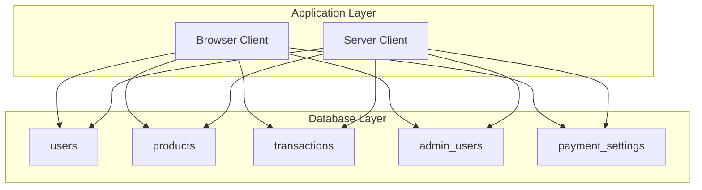
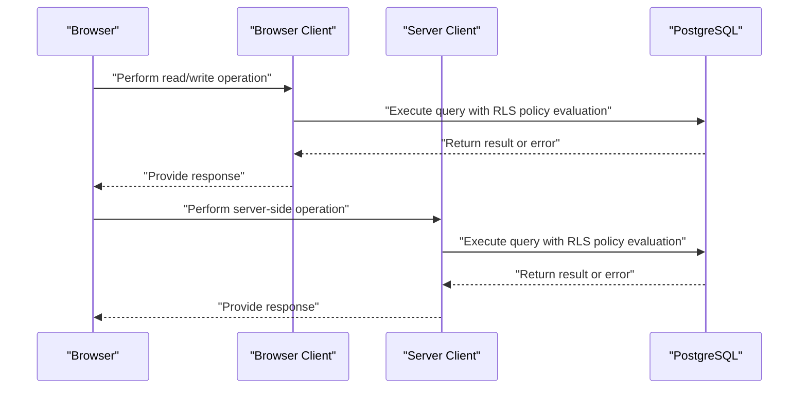
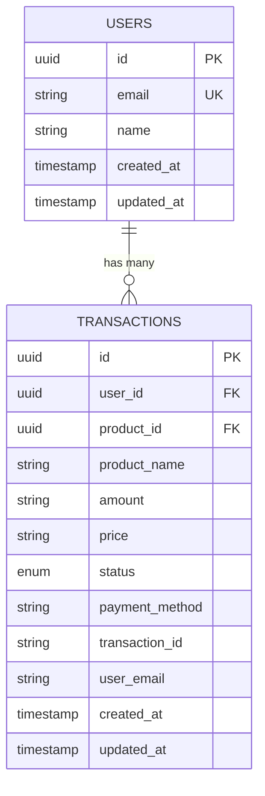
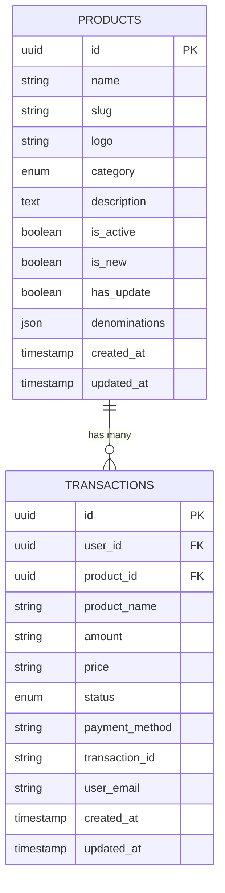
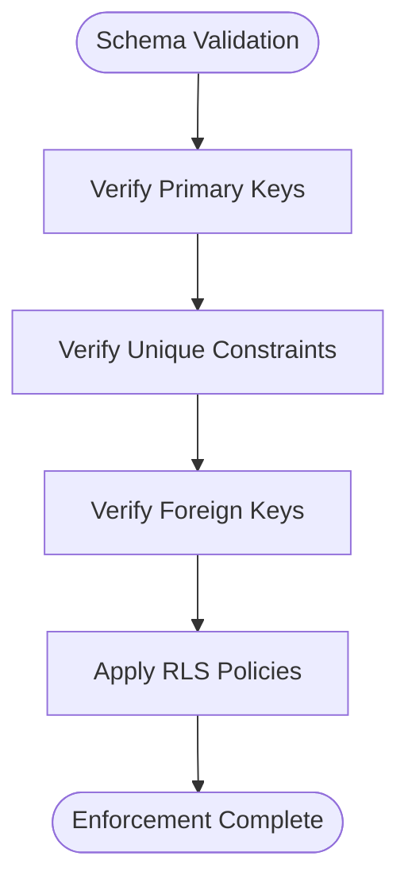
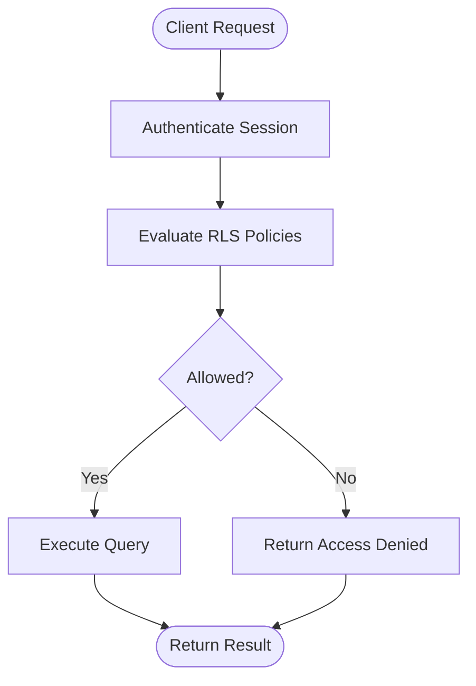
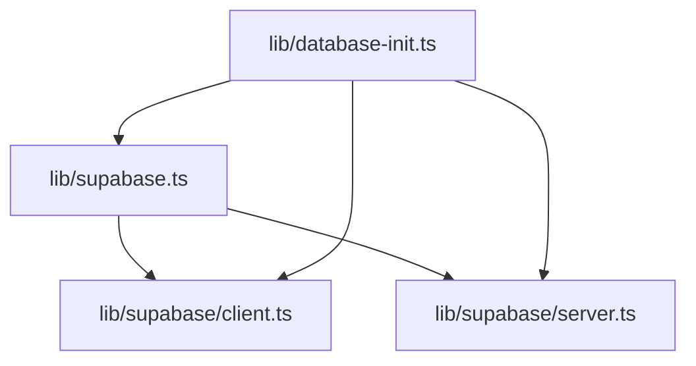

# Relationships and Constraints

<cite>
**Referenced Files in This Document**
- [supabase.ts](file://lib/supabase.ts)
- [database-init.ts](file://lib/database-init.ts)
- [client.ts](file://lib/supabase/client.ts)
- [server.ts](file://lib/supabase/server.ts)
- [README.md](file://README.md)
</cite>

## Table of Contents
1. [Introduction](#introduction)
2. [Project Structure](#project-structure)
3. [Core Components](#core-components)
4. [Architecture Overview](#architecture-overview)
5. [Detailed Component Analysis](#detailed-component-analysis)
6. [Dependency Analysis](#dependency-analysis)
7. [Performance Considerations](#performance-considerations)
8. [Troubleshooting Guide](#troubleshooting-guide)
9. [Conclusion](#conclusion)

## Introduction
This document explains the database relationships and constraints in Byiora, focusing on how the application models data through Supabase and PostgreSQL. It details:
- Primary keys and unique constraints
- Foreign key relationships between users and transactions, and products and transactions
- Referential integrity enforcement
- Row Level Security (RLS) policies and their impact on access control
- How business rules are enforced via constraints rather than application logic
- Examples of constraint violations and prevention strategies

The project’s backend is powered by Supabase and PostgreSQL, with explicit TypeScript types generated from the database schema. The frontend communicates with the database through typed Supabase clients configured in the application.

## Project Structure
The database schema is defined in a strongly-typed interface exported by the Supabase client library. The relevant tables and their relationships are declared in the database type definition. Clients for browser and server environments are created using the same type interface.

**Diagram sources**
- [supabase.ts:10-187](file://lib/supabase.ts#L10-L187)
- [client.ts:4-9](file://lib/supabase/client.ts#L4-L9)
- [server.ts:8-34](file://lib/supabase/server.ts#L8-L34)

**Section sources**
- [supabase.ts:10-187](file://lib/supabase.ts#L10-L187)
- [client.ts:1-10](file://lib/supabase/client.ts#L1-L10)
- [server.ts:1-36](file://lib/supabase/server.ts#L1-L36)

## Core Components
This section outlines the database schema and constraints inferred from the Supabase type definitions. It also describes how the application initializes and validates database connectivity.

- Database type definitions
  - The application defines a comprehensive set of tables and their row/insert/update shapes. These types act as the single source of truth for database structure and are used by both browser and server clients.
  - Key tables include users, products, transactions, admin_users, and payment_settings.

- Primary keys and unique constraints
  - Primary keys: Each table’s Row shape includes an id field of type string, indicating a UUID primary key for each record.
  - Unique constraints: The users table declares an email field, and the admin_users table declares an email field. While the type definitions do not explicitly mark them as unique, the presence of an email field in both tables suggests uniqueness is intended. The README mentions “Secure Processing supported by Supabase, RLS, and server-side validations,” implying constraints and policies are enforced at the database level.

- Foreign key relationships
  - users → transactions: The transactions table includes a nullable user_id field, establishing a relationship to users.id.
  - products → transactions: The transactions table includes a nullable product_id field, establishing a relationship to products.id.
  - These relationships enforce referential integrity when constraints are applied at the database level.

- Referential integrity
  - The nullable foreign keys in transactions imply optional associations. To prevent orphaned records and maintain referential integrity, the database should enforce foreign key constraints with appropriate ON DELETE behavior (e.g., SET NULL or CASCADE) depending on business requirements.

- Row Level Security (RLS)
  - The README explicitly mentions RLS support. RLS policies govern who can access rows and under what conditions. Policies are typically defined per-table and can restrict reads/writes based on user identity, roles, or row ownership.

- Business rule enforcement via constraints
  - Status enums and required fields (e.g., product_name, amount, price, payment_method, transaction_id, user_email) indicate that the database schema enforces correctness at rest. Application logic should complement these constraints to ensure robustness.

- Initialization and connectivity checks
  - The database initialization module tests connectivity and verifies table existence. It surfaces errors for missing environment variables, missing tables, and general connection failures.

**Section sources**
- [supabase.ts:10-187](file://lib/supabase.ts#L10-L187)
- [database-init.ts:11-87](file://lib/database-init.ts#L11-L87)
- [README.md:8-10](file://README.md#L8-L10)

## Architecture Overview
The application uses typed Supabase clients to interact with the database. The clients are configured with the same Database type, ensuring consistency across the browser and server environments.

**Diagram sources**
- [client.ts:4-9](file://lib/supabase/client.ts#L4-L9)
- [server.ts:8-34](file://lib/supabase/server.ts#L8-L34)
- [supabase.ts:10-187](file://lib/supabase.ts#L10-L187)

**Section sources**
- [client.ts:1-10](file://lib/supabase/client.ts#L1-L10)
- [server.ts:1-36](file://lib/supabase/server.ts#L1-L36)
- [supabase.ts:10-187](file://lib/supabase.ts#L10-L187)

## Detailed Component Analysis

### Users and Transactions Relationship
- Relationship: One-to-many (users → transactions)
- Foreign key: transactions.user_id references users.id
- Behavior: The foreign key is nullable in the type definitions, allowing anonymous transactions. Enforcing referential integrity depends on database constraints.

**Diagram sources**
- [supabase.ts:14-35](file://lib/supabase.ts#L14-L35)
- [supabase.ts:141-184](file://lib/supabase.ts#L141-L184)

**Section sources**
- [supabase.ts:14-35](file://lib/supabase.ts#L14-L35)
- [supabase.ts:141-184](file://lib/supabase.ts#L141-L184)

### Products and Transactions Relationship
- Relationship: One-to-many (products → transactions)
- Foreign key: transactions.product_id references products.id
- Behavior: The foreign key is nullable in the type definitions, enabling transactions without a linked product. Enforcing referential integrity depends on database constraints.

**Diagram sources**
- [supabase.ts:68-111](file://lib/supabase.ts#L68-L111)
- [supabase.ts:141-184](file://lib/supabase.ts#L141-L184)

**Section sources**
- [supabase.ts:68-111](file://lib/supabase.ts#L68-L111)
- [supabase.ts:141-184](file://lib/supabase.ts#L141-L184)

### Primary Keys and Unique Constraints
- Primary keys
  - All tables define an id field as the primary key. The type definitions specify id as a string, aligning with UUIDs commonly used in Supabase projects.
- Unique constraints
  - users.email and admin_users.email are present in the type definitions. While not explicitly marked unique in the type definitions, their presence implies uniqueness. The README’s mention of “server-side validations” supports the expectation that uniqueness is enforced at the database level.

**Diagram sources**
- [supabase.ts:14-35](file://lib/supabase.ts#L14-L35)
- [supabase.ts:68-111](file://lib/supabase.ts#L68-L111)
- [supabase.ts:141-184](file://lib/supabase.ts#L141-L184)

**Section sources**
- [supabase.ts:14-35](file://lib/supabase.ts#L14-L35)
- [supabase.ts:68-111](file://lib/supabase.ts#L68-L111)
- [supabase.ts:141-184](file://lib/supabase.ts#L141-L184)

### Row Level Security (RLS) Policies
- Purpose: RLS controls access to rows based on policies defined in the database. The README explicitly mentions RLS support, indicating that access control is enforced at the database level.
- Impact: Policies can restrict reads/writes to rows owned by the current user, restricted to specific roles (e.g., admin, sub_admin, order_management), or governed by business rules encoded in the policies.
- Implementation: Policies are typically defined per-table and evaluated on every query. The Supabase clients operate under the authenticated session, and RLS policies are enforced server-side.

**Diagram sources**
- [README.md:8-10](file://README.md#L8-L10)

**Section sources**
- [README.md:8-10](file://README.md#L8-L10)

### Constraint Violations and Prevention Strategies
- Violation scenarios
  - Inserting a transaction with a non-existent user_id or product_id when foreign key constraints are enabled.
  - Attempting to insert duplicate emails in users or admin_users if uniqueness constraints are enforced.
  - Updating a transaction to reference a deleted product or user without cascading updates.
- Prevention strategies
  - Enforce foreign key constraints with appropriate ON DELETE behavior (e.g., SET NULL for optional relationships, CASCADE for mandatory relationships).
  - Enforce unique constraints on email fields in users and admin_users.
  - Use RLS policies to limit access to sensitive data and ensure only authorized users can modify specific rows.
  - Validate inputs on the application side to reduce invalid requests, while relying on database constraints for ultimate enforcement.

**Section sources**
- [supabase.ts:141-184](file://lib/supabase.ts#L141-L184)
- [supabase.ts:14-35](file://lib/supabase.ts#L14-L35)
- [supabase.ts:68-111](file://lib/supabase.ts#L68-L111)
- [README.md:8-10](file://README.md#L8-L10)

## Dependency Analysis
The application’s database dependencies center around the typed Supabase client and the database schema definitions.

**Diagram sources**
- [supabase.ts:10-187](file://lib/supabase.ts#L10-L187)
- [client.ts:1-10](file://lib/supabase/client.ts#L1-L10)
- [server.ts:1-36](file://lib/supabase/server.ts#L1-L36)
- [database-init.ts:1-163](file://lib/database-init.ts#L1-L163)

**Section sources**
- [supabase.ts:10-187](file://lib/supabase.ts#L10-L187)
- [client.ts:1-10](file://lib/supabase/client.ts#L1-L10)
- [server.ts:1-36](file://lib/supabase/server.ts#L1-L36)
- [database-init.ts:1-163](file://lib/database-init.ts#L1-L163)

## Performance Considerations
- Indexes: Ensure appropriate indexes exist on foreign key columns (user_id, product_id) and frequently filtered columns (status, created_at) to optimize join and filter performance.
- RLS overhead: RLS evaluation occurs server-side; keep policies efficient and avoid overly complex expressions to minimize query latency.
- Batch operations: Prefer batch inserts/updates for bulk data to reduce round trips and improve throughput.

## Troubleshooting Guide
- Environment variables not configured
  - Symptom: Database status reports missing environment variables.
  - Action: Verify NEXT_PUBLIC_SUPABASE_URL and NEXT_PUBLIC_SUPABASE_ANON_KEY are set.
- Tables do not exist
  - Symptom: Database tables do not exist error.
  - Action: Run the setup scripts to create tables and constraints.
- Connection failures
  - Symptom: Database connection failed error.
  - Action: Check network connectivity, Supabase service health, and credentials.
- Data validation errors
  - Symptom: Errors related to unique constraints or foreign keys.
  - Action: Ensure uniqueness on email fields and validity of foreign keys before inserts/updates.

**Section sources**
- [database-init.ts:27-87](file://lib/database-init.ts#L27-L87)

## Conclusion
Byiora’s database model is defined through a typed Supabase interface that captures primary keys, foreign keys, and business-critical fields. The nullable foreign keys in transactions indicate optional relationships with users and products. Enforcing referential integrity, unique constraints on email fields, and RLS policies ensures robust data governance. The README confirms RLS support, reinforcing that access control is enforced at the database level. Adhering to these constraints and policies prevents common violations and maintains data consistency across the platform.