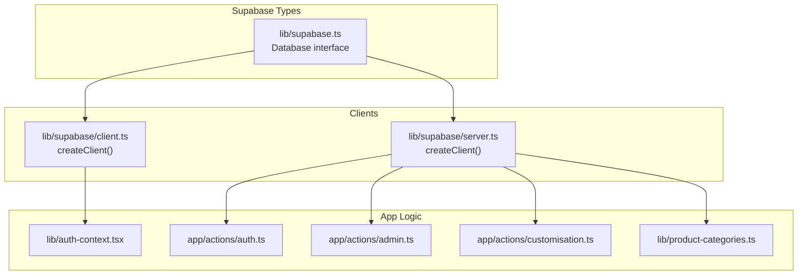
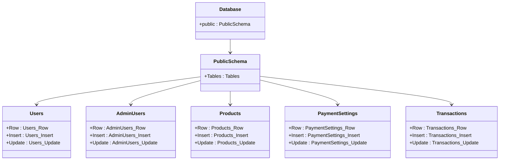
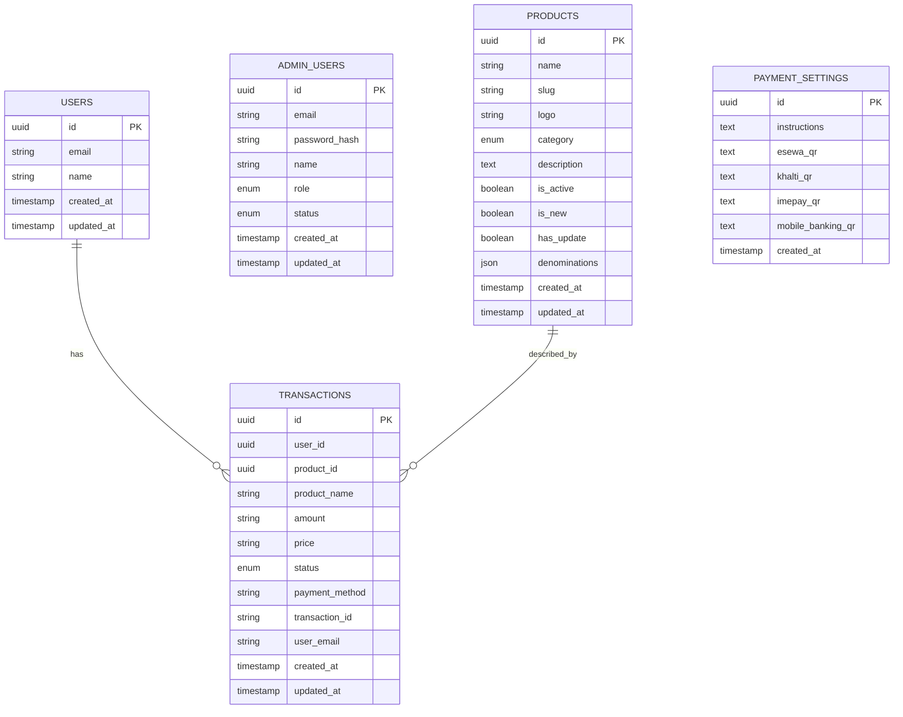
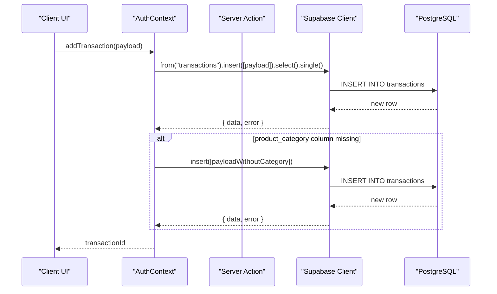
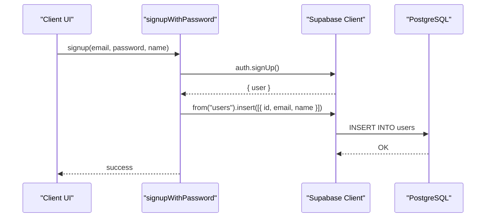
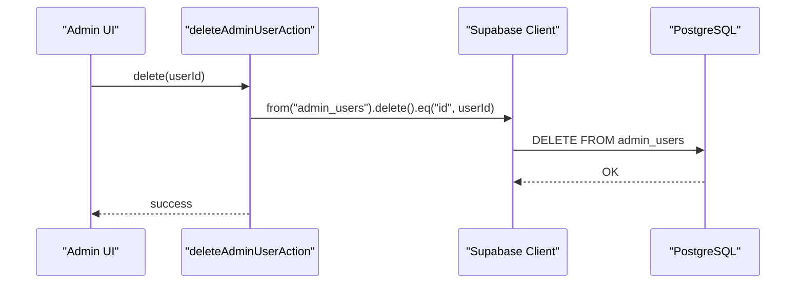
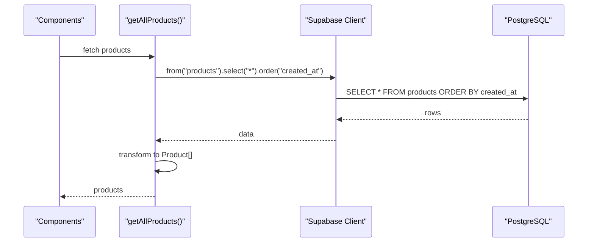
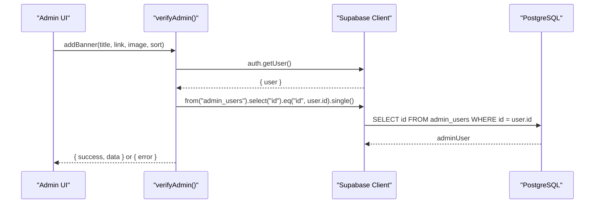
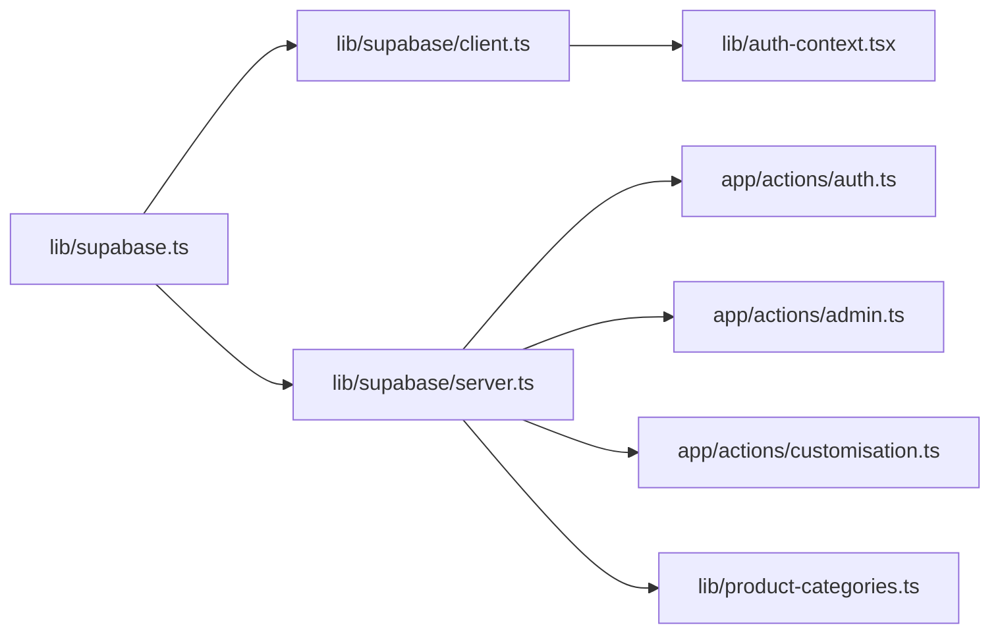

# Schema Overview

<cite>
**Referenced Files in This Document**
- [supabase.ts](file://lib/supabase.ts)
- [client.ts](file://lib/supabase/client.ts)
- [server.ts](file://lib/supabase/server.ts)
- [database-init.ts](file://lib/database-init.ts)
- [auth.ts](file://app/actions/auth.ts)
- [auth-context.tsx](file://lib/auth-context.tsx)
- [product-categories.ts](file://lib/product-categories.ts)
- [admin.ts](file://app/actions/admin.ts)
- [customisation.ts](file://app/actions/customisation.ts)
- [README.md](file://README.md)
</cite>

## Table of Contents
1. [Introduction](#introduction)
2. [Project Structure](#project-structure)
3. [Core Components](#core-components)
4. [Architecture Overview](#architecture-overview)
5. [Detailed Component Analysis](#detailed-component-analysis)
6. [Dependency Analysis](#dependency-analysis)
7. [Performance Considerations](#performance-considerations)
8. [Troubleshooting Guide](#troubleshooting-guide)
9. [Conclusion](#conclusion)

## Introduction
This document provides a comprehensive schema overview for the Byiora e-commerce database built on Supabase and PostgreSQL. It focuses on the main tables used for e-commerce functionality: users, admin_users, products, payment_settings, and transactions. It explains the Supabase TypeScript interface system that enforces type safety across the frontend and backend, outlines naming conventions and field organization patterns, and illustrates how the schema supports instant checkout, guest transactions, and order management.

Byiora is a digital game top-up platform optimized for Nepal, enabling instant delivery of game credits and vouchers with secure processing powered by Supabase, Role-Based Security (RLS), and server-side validations.

**Section sources**
- [README.md:1-18](file://README.md#L1-L18)

## Project Structure
The database schema is defined centrally in a TypeScript interface that mirrors Supabase’s Postgres tables. The Supabase client is created with this interface to enable compile-time and runtime type safety. Application logic interacts with the database through server actions and shared libraries, ensuring consistent typing and predictable data flows.

**Diagram sources**
- [supabase.ts:10-187](file://lib/supabase.ts#L10-L187)
- [client.ts:1-10](file://lib/supabase/client.ts#L1-L10)
- [server.ts:1-36](file://lib/supabase/server.ts#L1-L36)
- [auth.ts:1-68](file://app/actions/auth.ts#L1-L68)
- [auth-context.tsx:1-374](file://lib/auth-context.tsx#L1-L374)
- [product-categories.ts:1-485](file://lib/product-categories.ts#L1-L485)
- [admin.ts:1-35](file://app/actions/admin.ts#L1-L35)
- [customisation.ts:1-81](file://app/actions/customisation.ts#L1-L81)

**Section sources**
- [supabase.ts:10-187](file://lib/supabase.ts#L10-L187)
- [client.ts:1-10](file://lib/supabase/client.ts#L1-L10)
- [server.ts:1-36](file://lib/supabase/server.ts#L1-L36)

## Core Components
This section documents the five core tables and their roles in the e-commerce system.

- users
  - Purpose: Stores customer profiles for authenticated users.
  - Key fields: id (UUID), email, name, timestamps.
  - Usage: Created during sign-up; referenced by transactions for authenticated buyers.

- admin_users
  - Purpose: Stores administrative staff with roles and statuses.
  - Key fields: id, email, password_hash, name, role, status, timestamps.
  - Usage: Authorization checks for admin actions.

- products
  - Purpose: Defines available digital goods and top-ups with metadata.
  - Key fields: id, name, slug, logo, category ("topup" | "digital-goods"), flags (is_active, is_new, has_update), denominations array, timestamps.
  - Usage: Product catalog retrieval, filtering, updates, and deletions.

- payment_settings
  - Purpose: Centralizes payment instructions and QR assets for Nepali payment methods.
  - Key fields: id, instructions, and optional QR URLs for various providers.
  - Usage: Presentation layer displays payment instructions and QR codes.

- transactions
  - Purpose: Tracks all purchase attempts and outcomes, supporting both guest and authenticated users.
  - Key fields: id, user_id (nullable), product_id (nullable), product_name, amount, price, status enum, payment_method, transaction_id (unique), user_email, timestamps.
  - Usage: Order history, status updates, and PDF generation.

Naming conventions and field organization patterns:
- Table names are pluralized and lowercase (e.g., users, admin_users, products, payment_settings, transactions).
- Enum-like fields use union literal types in TypeScript (e.g., category, status).
- Denominations and FAQs are stored as JSON arrays for flexibility.
- Timestamps follow created_at and updated_at patterns.

**Section sources**
- [supabase.ts:14-35](file://lib/supabase.ts#L14-L35)
- [supabase.ts:36-67](file://lib/supabase.ts#L36-L67)
- [supabase.ts:68-111](file://lib/supabase.ts#L68-L111)
- [supabase.ts:112-140](file://lib/supabase.ts#L112-L140)
- [supabase.ts:141-184](file://lib/supabase.ts#L141-L184)

## Architecture Overview
The architecture leverages Supabase’s TypeScript interface system to maintain type-safe database operations across the frontend and backend. The interface defines Row, Insert, and Update shapes for each table, enabling precise typing for selects, inserts, and updates. Clients are created with this interface for both browser and server environments.

**Diagram sources**
- [supabase.ts:10-187](file://lib/supabase.ts#L10-L187)

**Section sources**
- [supabase.ts:10-187](file://lib/supabase.ts#L10-L187)

## Detailed Component Analysis

### Entity-Relationship Diagram
The relationships among the core tables underpin the e-commerce flow. Users can place transactions; products define the items being purchased; admin_users manage content and settings; payment_settings provide payment details; and transactions optionally reference products and users.

**Diagram sources**
- [supabase.ts:14-35](file://lib/supabase.ts#L14-L35)
- [supabase.ts:36-67](file://lib/supabase.ts#L36-L67)
- [supabase.ts:68-111](file://lib/supabase.ts#L68-L111)
- [supabase.ts:112-140](file://lib/supabase.ts#L112-L140)
- [supabase.ts:141-184](file://lib/supabase.ts#L141-L184)

### Data Flow: Add Transaction (Guest and Authenticated)
This sequence shows how transactions are inserted, including guest mode handling and optional product_category normalization.

**Diagram sources**
- [auth-context.tsx:240-323](file://lib/auth-context.tsx#L240-L323)

**Section sources**
- [auth-context.tsx:240-323](file://lib/auth-context.tsx#L240-L323)

### Data Flow: User Registration and Profile Creation
This sequence demonstrates how a new user is registered and their profile is created in the users table.

**Diagram sources**
- [auth.ts:25-59](file://app/actions/auth.ts#L25-L59)

**Section sources**
- [auth.ts:25-59](file://app/actions/auth.ts#L25-L59)

### Data Flow: Admin User Deletion
This sequence shows deletion of an admin user from the admin_users table.

**Diagram sources**
- [admin.ts:10-34](file://app/actions/admin.ts#L10-L34)

**Section sources**
- [admin.ts:10-34](file://app/actions/admin.ts#L10-L34)

### Data Flow: Product Catalog Management
This sequence shows how product data is fetched, transformed, and cached.

**Diagram sources**
- [product-categories.ts:200-264](file://lib/product-categories.ts#L200-L264)

**Section sources**
- [product-categories.ts:200-264](file://lib/product-categories.ts#L200-L264)

### Data Flow: Admin Customization Actions
This sequence shows how admin actions verify admin status and update banners/homepage categories.

**Diagram sources**
- [customisation.ts:6-13](file://app/actions/customisation.ts#L6-L13)

**Section sources**
- [customisation.ts:6-13](file://app/actions/customisation.ts#L6-L13)

## Dependency Analysis
The following diagram highlights how application logic depends on the Supabase client and the central Database interface.

**Diagram sources**
- [supabase.ts:10-187](file://lib/supabase.ts#L10-L187)
- [client.ts:1-10](file://lib/supabase/client.ts#L1-L10)
- [server.ts:1-36](file://lib/supabase/server.ts#L1-L36)
- [auth-context.tsx:1-374](file://lib/auth-context.tsx#L1-L374)
- [auth.ts:1-68](file://app/actions/auth.ts#L1-L68)
- [admin.ts:1-35](file://app/actions/admin.ts#L1-L35)
- [customisation.ts:1-81](file://app/actions/customisation.ts#L1-L81)
- [product-categories.ts:1-485](file://lib/product-categories.ts#L1-L485)

**Section sources**
- [supabase.ts:10-187](file://lib/supabase.ts#L10-L187)
- [client.ts:1-10](file://lib/supabase/client.ts#L1-L10)
- [server.ts:1-36](file://lib/supabase/server.ts#L1-L36)

## Performance Considerations
- Use of enums and union literal types reduces storage overhead and improves query predictability.
- JSON fields (e.g., denominations) offer flexibility but may increase payload sizes; consider indexing strategies if frequently filtered.
- Caching in product retrieval libraries minimizes repeated database calls and improves responsiveness.
- Prefer selective field queries and appropriate ordering to reduce network and compute costs.

[No sources needed since this section provides general guidance]

## Troubleshooting Guide
Common issues and resolutions:
- Environment variables not configured
  - Symptom: Database status reports missing Supabase configuration.
  - Resolution: Ensure NEXT_PUBLIC_SUPABASE_URL and NEXT_PUBLIC_SUPABASE_ANON_KEY are set.
  - Section sources
    - [database-init.ts:11-24](file://lib/database-init.ts#L11-L24)

- Tables do not exist
  - Symptom: Connection succeeds but table not found error occurs.
  - Resolution: Run the database setup scripts to create tables.
  - Section sources
    - [database-init.ts:27-87](file://lib/database-init.ts#L27-L87)

- Empty database on first run
  - Symptom: Initialization indicates empty dataset.
  - Resolution: Run the seed script to populate initial data.
  - Section sources
    - [database-init.ts:89-111](file://lib/database-init.ts#L89-L111)

- Transaction insert fails due to schema mismatch
  - Symptom: Insertion error mentioning product_category column.
  - Resolution: Retry insert without product_category; the application handles this fallback.
  - Section sources
    - [auth-context.tsx:282-292](file://lib/auth-context.tsx#L282-L292)

- Admin verification failures
  - Symptom: Unauthorized responses when performing admin actions.
  - Resolution: Confirm admin user exists in admin_users and session is valid.
  - Section sources
    - [customisation.ts:6-13](file://app/actions/customisation.ts#L6-L13)

## Conclusion
Byiora’s database schema is designed around a clear set of tables that support instant digital top-ups and guest checkout while maintaining strong type safety through Supabase’s TypeScript interface system. The schema’s naming conventions and field organization promote clarity and scalability. The client-side and server-side Supabase clients enforce type correctness across the application, ensuring reliable data flows for users, admins, products, payments, and transactions.

[No sources needed since this section summarizes without analyzing specific files]