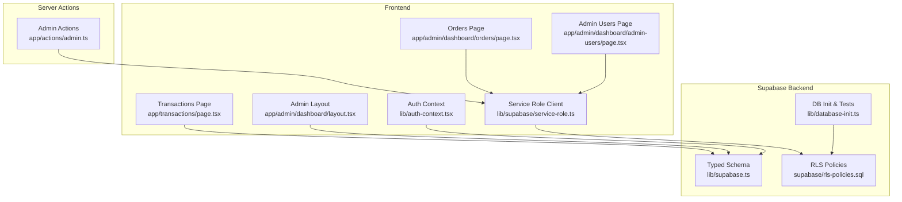
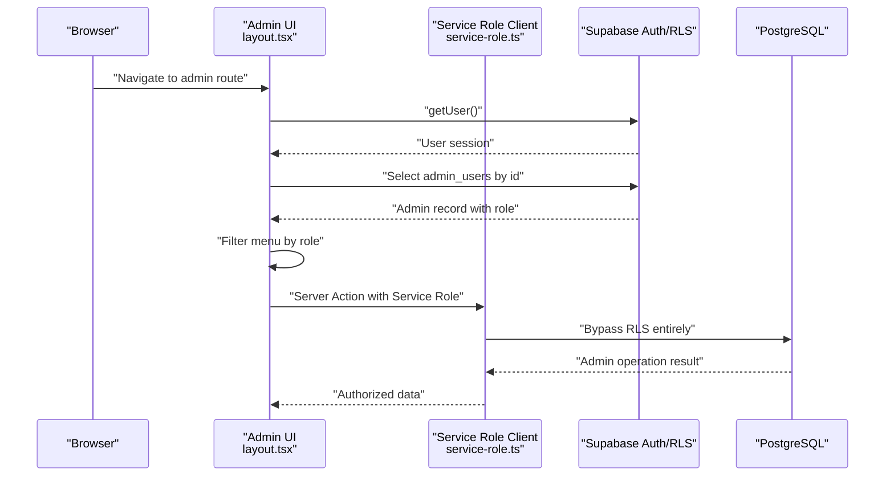
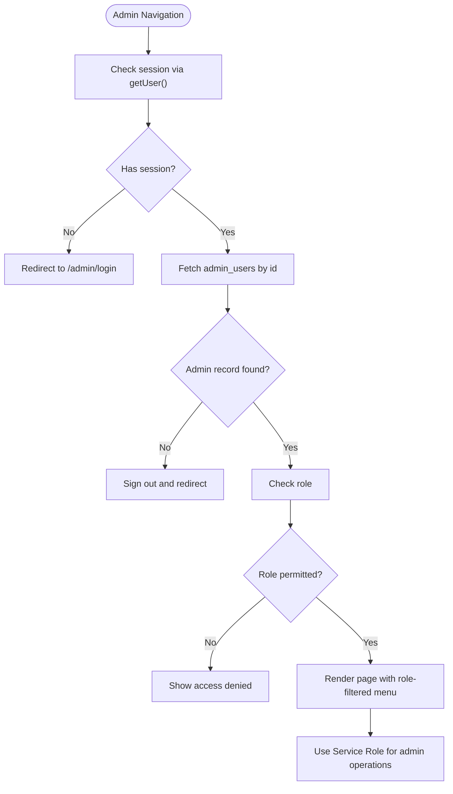
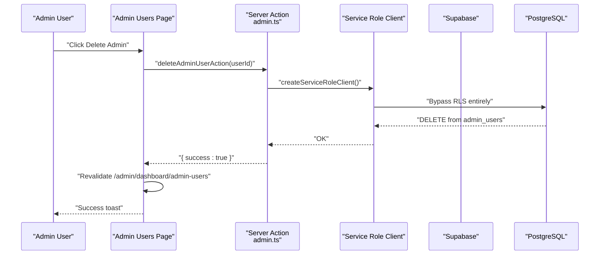
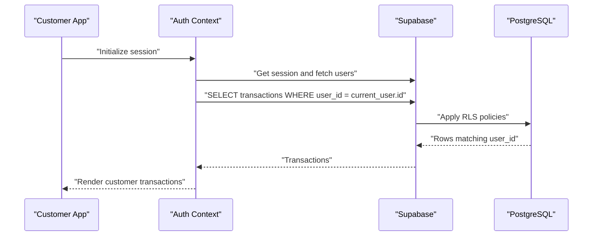
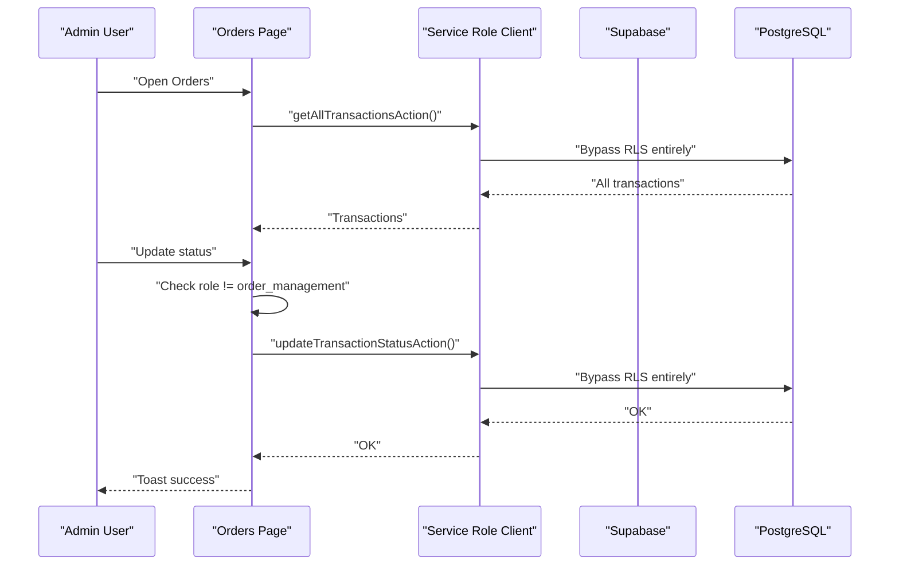
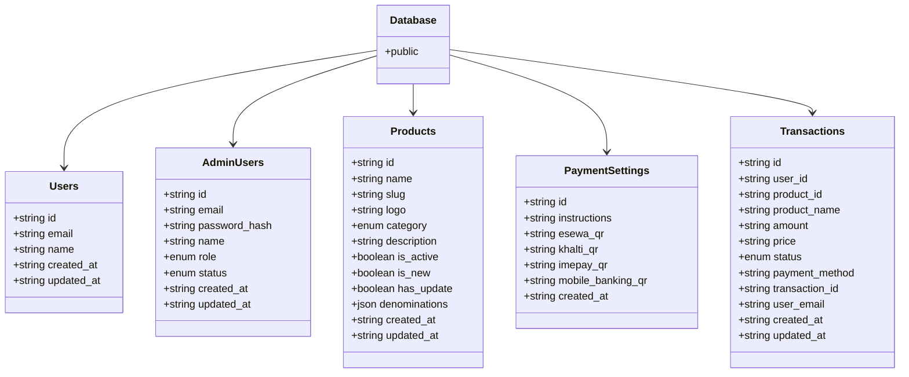
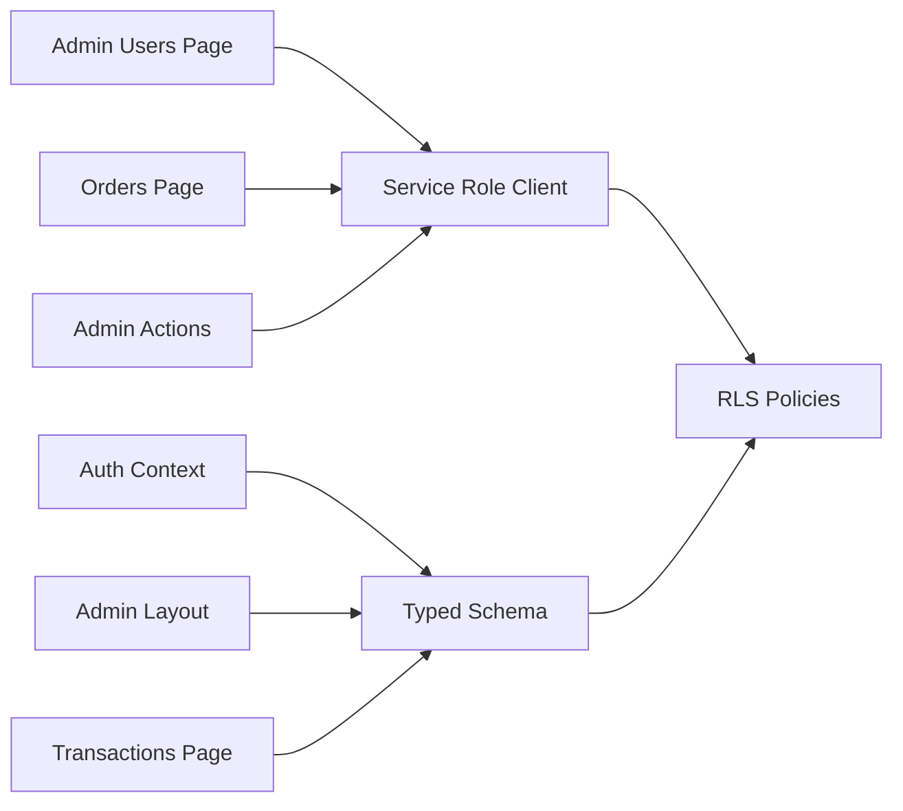

# Security Policies

<cite>
**Referenced Files in This Document**
- [README.md](file://README.md)
- [RLS-MIGRATION-GUIDE.md](file://RLS-MIGRATION-GUIDE.md)
- [rls-policies.sql](file://supabase/rls-policies.sql)
- [service-role.ts](file://lib/supabase/service-role.ts)
- [supabase.ts](file://lib/supabase.ts)
- [database-init.ts](file://lib/database-init.ts)
- [auth-context.tsx](file://lib/auth-context.tsx)
- [admin.ts](file://app/actions/admin.ts)
- [admin-users page.tsx](file://app/admin/dashboard/admin-users/page.tsx)
- [admin dashboard layout.tsx](file://app/admin/dashboard/layout.tsx)
- [admin dashboard page.tsx](file://app/admin/dashboard/page.tsx)
- [admin login page.tsx](file://app/admin/login/page.tsx)
- [orders page.tsx](file://app/admin/dashboard/orders/page.tsx)
- [transactions page.tsx](file://app/transactions/page.tsx)
</cite>

## Update Summary
**Changes Made**
- Added comprehensive Row Level Security (RLS) implementation with 222 lines of security policies
- Introduced Service Role Client system for admin operations that bypass RLS
- Updated migration guide with step-by-step RLS implementation process
- Enhanced database security framework with force RLS enforcement
- Added administrative bypass mechanisms for critical operations

## Table of Contents
1. [Introduction](#introduction)
2. [Project Structure](#project-structure)
3. [Core Components](#core-components)
4. [Architecture Overview](#architecture-overview)
5. [Detailed Component Analysis](#detailed-component-analysis)
6. [RLS Implementation Framework](#rls-implementation-framework)
7. [Service Role Client System](#service-role-client-system)
8. [Migration and Deployment Guide](#migration-and-deployment-guide)
9. [Dependency Analysis](#dependency-analysis)
10. [Performance Considerations](#performance-considerations)
11. [Troubleshooting Guide](#troubleshooting-guide)
12. [Conclusion](#conclusion)

## Introduction
This document defines the comprehensive security policy for the Byiora database using Supabase's Row Level Security (RLS) features. The implementation includes 222 lines of security policies that provide granular access control for customer users, admin users, and sub-admins. The system enforces data isolation to prevent unauthorized access to transaction records while enabling secure admin operations through a service role client system that bypasses RLS for trusted server-side operations.

## Project Structure
The security model spans frontend clients, server actions, service role clients, and Supabase backend resources:
- Supabase client initialization with typed database schema
- Service Role Client for admin operations that bypass RLS
- Authentication and session validation for admin users
- Admin-only operations via server actions with service role
- Client-side queries constrained by RLS policies
- Public-facing customer transaction history with user isolation

**Diagram sources**
- [supabase.ts:10-187](file://lib/supabase.ts#L10-L187)
- [database-init.ts:1-164](file://lib/database-init.ts#L1-L164)
- [auth-context.tsx:1-374](file://lib/auth-context.tsx#L1-L374)
- [admin dashboard layout.tsx:1-236](file://app/admin/dashboard/layout.tsx#L1-L236)
- [admin dashboard page.tsx:1-286](file://app/admin/dashboard/page.tsx#L1-L286)
- [admin login page.tsx:1-145](file://app/admin/login/page.tsx#L1-L145)
- [admin-users page.tsx:212-622](file://app/admin/dashboard/admin-users/page.tsx#L212-L622)
- [orders page.tsx:67-217](file://app/admin/dashboard/orders/page.tsx#L67-L217)
- [transactions page.tsx](file://app/transactions/page.tsx)
- [service-role.ts:1-39](file://lib/supabase/service-role.ts#L1-L39)
- [rls-policies.sql:1-223](file://supabase/rls-policies.sql#L1-L223)

**Section sources**
- [README.md:1-18](file://README.md#L1-L18)
- [supabase.ts:10-187](file://lib/supabase.ts#L10-L187)
- [database-init.ts:1-164](file://lib/database-init.ts#L1-L164)
- [service-role.ts:1-39](file://lib/supabase/service-role.ts#L1-L39)
- [rls-policies.sql:1-223](file://supabase/rls-policies.sql#L1-L223)

## Core Components
- **Supabase Client**: Standard client with typed database schema for public operations
- **Service Role Client**: Special client using SUPABASE_SERVICE_ROLE_KEY that bypasses RLS entirely
- **RLS Policies**: Comprehensive security policies enabling row-level access control on all tables
- **Admin Authentication**: Session validation and role-based navigation for admin users
- **Admin-Only Operations**: Server actions executed via service role for sensitive operations
- **Customer Transaction Isolation**: User-specific data access via user_id filtering

**Section sources**
- [supabase.ts:10-187](file://lib/supabase.ts#L10-L187)
- [service-role.ts:1-39](file://lib/supabase/service-role.ts#L1-L39)
- [rls-policies.sql:1-223](file://supabase/rls-policies.sql#L1-L223)
- [admin dashboard layout.tsx:103-126](file://app/admin/dashboard/layout.tsx#L103-L126)
- [admin login page.tsx:23-61](file://app/admin/login/page.tsx#L23-L61)
- [auth-context.tsx:94-127](file://lib/auth-context.tsx#L94-L127)

## Architecture Overview
The security architecture relies on:
- **RLS Policies**: Enforce row-level access controls on all database tables
- **Force RLS Enforcement**: Prevents table owners from bypassing security policies
- **Service Role Client**: Provides administrative bypass for trusted server-side operations
- **Admin Session Validation**: Ensures only authorized admin users can access admin-only pages
- **Server Actions**: Execute sensitive operations with service role bypass
- **Client-Side Queries**: Filtered by user identity through RLS policies

**Diagram sources**
- [admin dashboard layout.tsx:25-77](file://app/admin/dashboard/layout.tsx#L25-L77)
- [admin dashboard layout.tsx:103-126](file://app/admin/dashboard/layout.tsx#L103-L126)
- [admin login page.tsx:23-61](file://app/admin/login/page.tsx#L23-L61)
- [service-role.ts:27-38](file://lib/supabase/service-role.ts#L27-L38)

## Detailed Component Analysis

### Role-Based Access Control (RBAC) Model
- **Roles**: admin, sub_admin, order_management
- **Admin-Only Pages**: Require valid admin session and role verification
- **Service Role Bypass**: Admin operations use service role client to bypass RLS

**Diagram sources**
- [admin dashboard layout.tsx:25-77](file://app/admin/dashboard/layout.tsx#L25-L77)
- [admin dashboard layout.tsx:103-126](file://app/admin/dashboard/layout.tsx#L103-L126)
- [admin login page.tsx:23-61](file://app/admin/login/page.tsx#L23-L61)

**Section sources**
- [admin dashboard layout.tsx:103-126](file://app/admin/dashboard/layout.tsx#L103-L126)
- [admin dashboard layout.tsx:25-77](file://app/admin/dashboard/layout.tsx#L25-L77)
- [admin login page.tsx:23-61](file://app/admin/login/page.tsx#L23-L61)

### Admin-Only Operations with Service Role Bypass
- **Service Role Client**: Uses SUPABASE_SERVICE_ROLE_KEY to bypass RLS entirely
- **Admin User Deletion**: Performed via server action with service role
- **Administrative Operations**: All sensitive operations use service role client

**Diagram sources**
- [admin-users page.tsx:239-261](file://app/admin/dashboard/admin-users/page.tsx#L239-L261)
- [admin.ts:10-34](file://app/actions/admin.ts#L10-L34)
- [service-role.ts:27-38](file://lib/supabase/service-role.ts#L27-L38)

**Section sources**
- [admin-users page.tsx:239-261](file://app/admin/dashboard/admin-users/page.tsx#L239-L261)
- [admin.ts:10-34](file://app/actions/admin.ts#L10-L34)
- [service-role.ts:1-39](file://lib/supabase/service-role.ts#L1-L39)

### Customer Transaction Isolation
- **User-Specific Access**: Customer transaction history filtered by user_id
- **RLS Policy Enforcement**: Registered users can only access their own transactions
- **Guest Checkout Support**: Anonymous users can create transactions via RLS policy

**Diagram sources**
- [auth-context.tsx:56-127](file://lib/auth-context.tsx#L56-L127)
- [auth-context.tsx:94-127](file://lib/auth-context.tsx#L94-L127)

**Section sources**
- [auth-context.tsx:94-127](file://lib/auth-context.tsx#L94-L127)
- [transactions page.tsx](file://app/transactions/page.tsx)

### Admin Order Management and Status Updates
- **Order Management Roles**: Different permissions based on role level
- **Service Role for Updates**: Status updates use service role client
- **Role-Based Restrictions**: order_management role cannot update order status

**Diagram sources**
- [orders page.tsx:67-103](file://app/admin/dashboard/orders/page.tsx#L67-L103)
- [orders page.tsx:184-217](file://app/admin/dashboard/orders/page.tsx#L184-L217)

**Section sources**
- [orders page.tsx:67-103](file://app/admin/dashboard/orders/page.tsx#L67-L103)
- [orders page.tsx:184-217](file://app/admin/dashboard/orders/page.tsx#L184-L217)

### Typed Database Schema and Tables
The typed schema defines the tables and row/column shapes used across the app. This informs RLS policy design and client-side typing.

**Diagram sources**
- [supabase.ts:10-187](file://lib/supabase.ts#L10-L187)

**Section sources**
- [supabase.ts:10-187](file://lib/supabase.ts#L10-L187)

## RLS Implementation Framework

### Comprehensive Security Policies
The RLS implementation includes 222 lines of security policies that provide granular access control across all database tables:

**Products Table Policies**:
- `products_public_read`: Public can view active products
- No admin policies needed - handled via service role

**Transactions Table Policies**:
- `transactions_anon_insert`: Allows anonymous/guest checkout
- `transactions_owner_read`: Registered users access their own transactions
- `transactions_owner_update`: Users can update their own transactions

**Users Table Policies**:
- `users_owner_read`: Users can view their own profile
- `users_owner_update`: Users can update their own profile
- `users_insert_self`: New user registration

**Admin Users Table**:
- Locked down - all access via service role only

**Additional Tables**:
- `banners_public_read`: Active banners for public
- `homepage_categories_public_read`: Active categories
- `notifications_owner_read`: User notifications + broadcasts

**Force RLS Enforcement**:
- All tables forced to use RLS even for table owners
- Prevents bypass of security policies

**Section sources**
- [rls-policies.sql:66-207](file://supabase/rls-policies.sql#L66-L207)

### Guest Checkout Support
The system maintains guest checkout functionality while preserving security:
- Anonymous users can insert transactions via `transactions_anon_insert` policy
- Registered users have full access to their own transaction data
- Guest receipts use service role server actions for security

**Section sources**
- [rls-policies.sql:84-111](file://supabase/rls-policies.sql#L84-L111)
- [RLS-MIGRATION-GUIDE.md:139-158](file://RLS-MIGRATION-GUIDE.md#L139-L158)

## Service Role Client System

### Secure Administrative Operations
The service role client provides administrative bypass for trusted operations:

**Security Features**:
- Uses SUPABASE_SERVICE_ROLE_KEY environment variable
- Bypasses RLS entirely for administrative operations
- Never exposed to browser - only used in server-side contexts
- Treat like root password - highly sensitive credential

**Implementation Details**:
- Validates environment variables at runtime
- Creates client with autoRefreshToken disabled
- Used exclusively for server actions and API routes
- Requires admin authentication verification

**Section sources**
- [service-role.ts:1-39](file://lib/supabase/service-role.ts#L1-L39)
- [RLS-MIGRATION-GUIDE.md:228-247](file://RLS-MIGRATION-GUIDE.md#L228-L247)

### Server Action Integration
Multiple server actions use the service role client for administrative operations:

**Admin Operations**:
- `deleteAdminUserAction`: Removes admin users from database
- `updateTransactionStatusAction`: Updates order status
- `sendGiftcardCodeAction`: Processes giftcard codes
- Customization operations: Banner and category management

**Section sources**
- [admin.ts:10-34](file://app/actions/admin.ts#L10-L34)
- [orders page.tsx:176-237](file://app/admin/dashboard/orders/page.tsx#L176-L237)

## Migration and Deployment Guide

### Step-by-Step Implementation Process
The RLS migration follows a structured approach to ensure safety:

**Step 1: Apply SQL Policies**
- Enable RLS on all tables
- Drop existing policies for clean slate
- Create comprehensive security policies

**Step 2: Update Server Actions**
- Replace regular client with service role client
- Update all admin-only operations
- Maintain public read operations for non-admin users

**Step 3: Error Handling Audit**
- Implement comprehensive error handling patterns
- Test all database operations with proper error handling
- Verify RLS rejection scenarios

**Step 4: Guest Checkout Verification**
- Verify anonymous insert policy works
- Test guest transaction creation
- Ensure admin can access guest data via service role

**Step 5: Testing and Validation**
- Guest checkout flow testing
- Registered user transaction isolation
- Admin operation validation
- Error handling verification

**Section sources**
- [RLS-MIGRATION-GUIDE.md:20-190](file://RLS-MIGRATION-GUIDE.md#L20-L190)

### Environment Configuration
Critical environment variables for RLS implementation:

**Required Variables**:
- `NEXT_PUBLIC_SUPABASE_URL`: Supabase project URL
- `NEXT_PUBLIC_SUPABASE_ANON_KEY`: Public anonymous key
- `SUPABASE_SERVICE_ROLE_KEY`: Service role key (never expose to browser)

**Security Notes**:
- Service role key has full database access
- Never commit to version control
- Only use in server-side contexts
- Treat as root password equivalent

**Section sources**
- [RLS-MIGRATION-GUIDE.md:8-16](file://RLS-MIGRATION-GUIDE.md#L8-L16)

## Dependency Analysis
- **Admin UI**: Depends on Supabase client and typed schema for authenticated queries
- **Service Role Client**: Used exclusively by server actions and API routes
- **RLS Policies**: Govern all client-side database access through Supabase
- **Admin Operations**: Depend on server actions with service role bypass
- **Client-Side Access**: Restricted by user_id filtering and RLS policies

**Diagram sources**
- [supabase.ts:10-187](file://lib/supabase.ts#L10-L187)
- [auth-context.tsx:1-374](file://lib/auth-context.tsx#L1-L374)
- [admin dashboard layout.tsx:1-236](file://app/admin/dashboard/layout.tsx#L1-L236)
- [admin dashboard admin-users page.tsx:212-622](file://app/admin/dashboard/admin-users/page.tsx#L212-L622)
- [admin dashboard orders page.tsx:67-217](file://app/admin/dashboard/orders/page.tsx#L67-L217)
- [admin.ts:10-34](file://app/actions/admin.ts#L10-L34)
- [service-role.ts:1-39](file://lib/supabase/service-role.ts#L1-L39)
- [rls-policies.sql:1-223](file://supabase/rls-policies.sql#L1-L223)

**Section sources**
- [supabase.ts:10-187](file://lib/supabase.ts#L10-L187)
- [auth-context.tsx:1-374](file://lib/auth-context.tsx#L1-L374)
- [admin dashboard layout.tsx:1-236](file://app/admin/dashboard/layout.tsx#L1-L236)
- [admin dashboard admin-users page.tsx:212-622](file://app/admin/dashboard/admin-users/page.tsx#L212-L622)
- [admin dashboard orders page.tsx:67-217](file://app/admin/dashboard/orders/page.tsx#L67-L217)
- [admin.ts:10-34](file://app/actions/admin.ts#L10-L34)
- [service-role.ts:1-39](file://lib/supabase/service-role.ts#L1-L39)
- [rls-policies.sql:1-223](file://supabase/rls-policies.sql#L1-L223)

## Performance Considerations
- **RLS Policy Optimization**: Prefer indexed columns (user_id, id) in RLS policies to reduce query cost
- **Service Role Efficiency**: Service role bypass eliminates RLS overhead for administrative operations
- **Targeted Queries**: Use specific SELECT lists and LIMIT clauses to minimize payload size
- **Batch Operations**: Batch updates for status changes when feasible to reduce round-trips
- **Policy Complexity**: Monitor RLS policy complexity as it affects query performance

## Troubleshooting Guide
- **RLS Policy Violations**: Check if operation uses service role client instead of regular client
- **Service Role Key Issues**: Verify SUPABASE_SERVICE_ROLE_KEY environment variable is set
- **Guest Checkout Problems**: Confirm `transactions_anon_insert` policy exists and is functioning
- **User Access Issues**: Verify `transactions_owner_read` policy and user_id matching
- **Database Connectivity**: Use database initialization checks for configuration issues
- **Migration Issues**: Follow step-by-step migration guide for safe implementation

**Section sources**
- [database-init.ts:27-87](file://lib/database-init.ts#L27-L87)
- [orders page.tsx:184-217](file://app/admin/dashboard/orders/page.tsx#L184-L217)
- [admin.ts:10-34](file://app/actions/admin.ts#L10-L34)
- [RLS-MIGRATION-GUIDE.md:193-224](file://RLS-MIGRATION-GUIDE.md#L193-L224)

## Conclusion
Byiora implements a comprehensive security framework using Supabase Row Level Security with 222 lines of security policies and a service role client system. The system enforces robust access control through RLS policies, validated admin sessions, and role-based UI routing. Customer data isolation is achieved via user_id filtering, while admin-only operations are protected by server actions using service role bypass. The migration guide ensures safe implementation without breaking existing functionality. To maintain security posture, ensure RLS policies align with the typed schema, service role keys are properly secured, and all admin operations remain server-side with proper authentication verification.