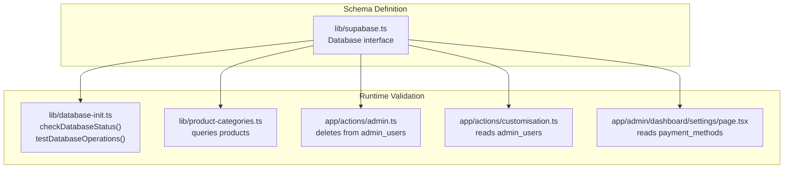
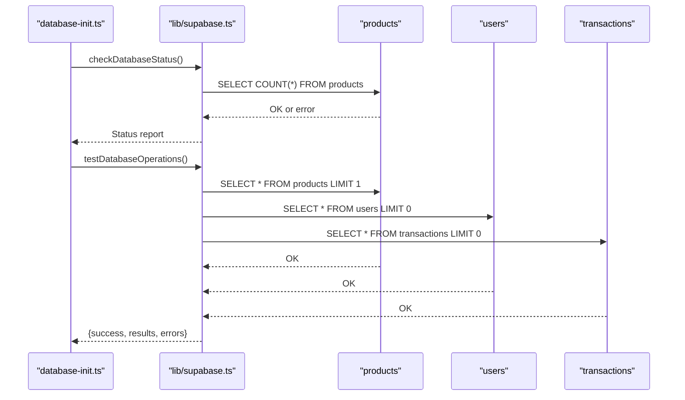
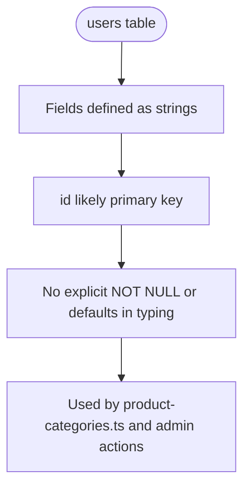
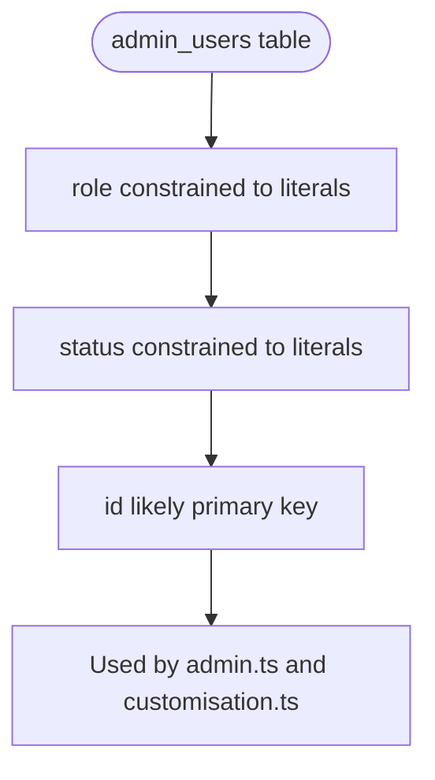
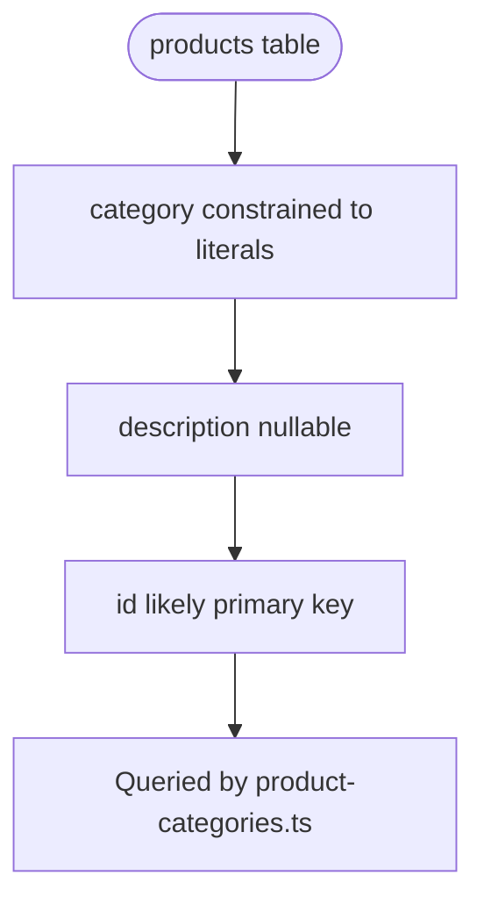
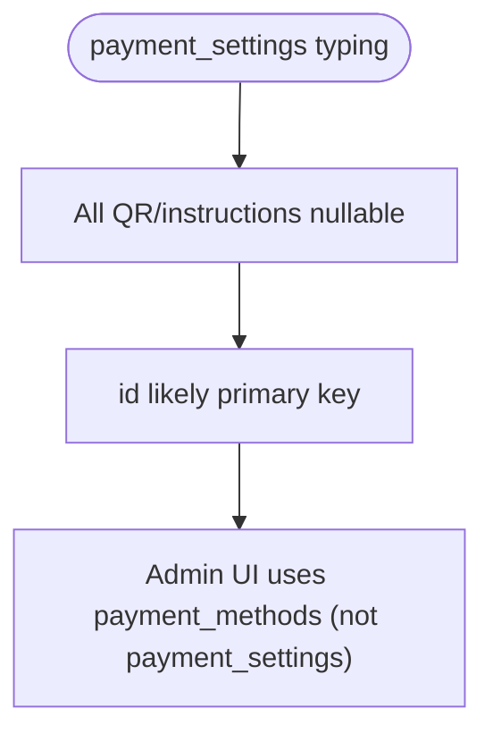
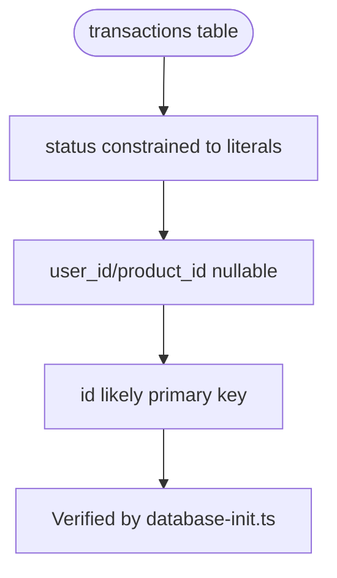
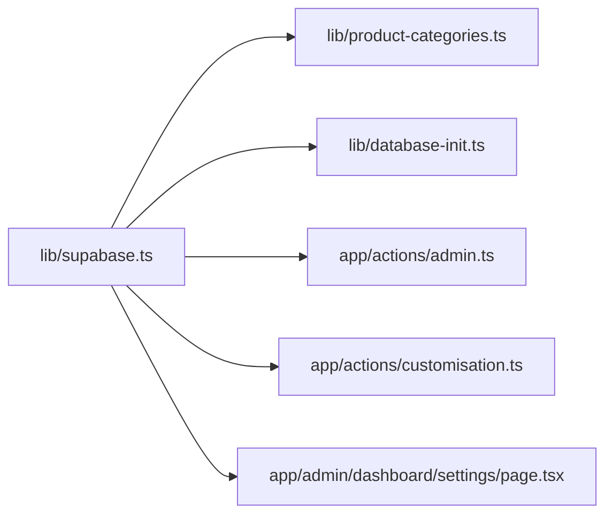

# Table Definitions

<cite>
**Referenced Files in This Document**
- [supabase.ts](file://lib/supabase.ts)
- [database-init.ts](file://lib/database-init.ts)
- [product-categories.ts](file://lib/product-categories.ts)
- [admin.ts](file://app/actions/admin.ts)
- [customisation.ts](file://app/actions/customisation.ts)
- [page.tsx](file://app/admin/dashboard/settings/page.tsx)
</cite>

## Table of Contents
1. [Introduction](#introduction)
2. [Project Structure](#project-structure)
3. [Core Components](#core-components)
4. [Architecture Overview](#architecture-overview)
5. [Detailed Component Analysis](#detailed-component-analysis)
6. [Dependency Analysis](#dependency-analysis)
7. [Performance Considerations](#performance-considerations)
8. [Troubleshooting Guide](#troubleshooting-guide)
9. [Conclusion](#conclusion)

## Introduction
This document provides authoritative table definition documentation for the core database tables used by Byiora. It consolidates schema information directly from the Supabase client typing interface and verifies operational usage across the codebase. Where the repository does not define explicit constraints, defaults, or validation rules, this document clearly indicates that such details are not present in the codebase and therefore cannot be guaranteed.

## Project Structure
The database schema is primarily defined in a single typed interface that describes row, insert, and update shapes for each table. Operational usage of these tables is validated by database initialization checks and runtime queries executed by library and action modules.

**Diagram sources**
- [supabase.ts:9-187](file://lib/supabase.ts#L9-L187)
- [database-init.ts:27-87](file://lib/database-init.ts#L27-L87)
- [database-init.ts:114-163](file://lib/database-init.ts#L114-L163)
- [product-categories.ts:218-230](file://lib/product-categories.ts#L218-L230)
- [admin.ts:10-34](file://app/actions/admin.ts#L10-L34)
- [customisation.ts:6-13](file://app/actions/customisation.ts#L6-L13)
- [page.tsx:81-96](file://app/admin/dashboard/settings/page.tsx#L81-L96)

**Section sources**
- [supabase.ts:9-187](file://lib/supabase.ts#L9-L187)
- [database-init.ts:27-87](file://lib/database-init.ts#L27-L87)
- [database-init.ts:114-163](file://lib/database-init.ts#L114-L163)

## Core Components
This section documents the core database tables used by Byiora, focusing on field names, data types, and constraints as defined in the Supabase client typing interface. Where the codebase does not specify defaults or validation rules, this is explicitly noted.

- users
  - Purpose: Stores customer accounts.
  - Fields:
    - id: string
    - email: string
    - name: string
    - created_at: string
    - updated_at: string
  - Notes:
    - No explicit primary key declaration is present in the typing interface; however, the presence of an id field strongly implies it serves as the primary key in the underlying database.
    - No default values or NOT NULL constraints are declared in the typing interface.

- admin_users
  - Purpose: Stores administrative user accounts with role-based access control.
  - Fields:
    - id: string
    - email: string
    - password_hash: string
    - name: string
    - role: "admin" | "sub_admin" | "order_management"
    - status: "active" | "blocked"
    - created_at: string
    - updated_at: string
  - Notes:
    - The role and status fields are constrained to enumerated literal types in the typing interface.
    - No explicit primary key declaration is present in the typing interface; id likely serves as the primary key.
    - No default values or NOT NULL constraints are declared in the typing interface.

- products
  - Purpose: Stores product catalog entries for digital goods and top-ups.
  - Fields:
    - id: string
    - name: string
    - slug: string
    - logo: string
    - category: "topup" | "digital-goods"
    - description: string | null
    - is_active: boolean
    - is_new: boolean
    - has_update: boolean
    - denominations: any
    - created_at: string
    - updated_at: string
  - Notes:
    - The category field is constrained to enumerated literal types in the typing interface.
    - description is nullable according to the typing interface.
    - No explicit primary key declaration is present in the typing interface; id likely serves as the primary key.
    - No default values or NOT NULL constraints are declared in the typing interface.

- payment_settings
  - Purpose: Stores QR code configurations and payment instructions.
  - Fields:
    - id: string
    - instructions: string | null
    - esewa_qr: string | null
    - khalti_qr: string | null
    - imepay_qr: string | null
    - mobile_banking_qr: string | null
    - created_at: string
  - Notes:
    - All QR and instructions fields are nullable according to the typing interface.
    - No explicit primary key declaration is present in the typing interface; id likely serves as the primary key.
    - No default values or NOT NULL constraints are declared in the typing interface.

- transactions
  - Purpose: Records purchase transactions with status tracking and payment metadata.
  - Fields:
    - id: string
    - user_id: string | null
    - product_id: string | null
    - product_name: string
    - amount: string
    - price: string
    - status: "Completed" | "Failed" | "Processing" | "Cancelled"
    - payment_method: string
    - transaction_id: string
    - user_email: string
    - created_at: string
    - updated_at: string
  - Notes:
    - The status field is constrained to enumerated literal types in the typing interface.
    - user_id and product_id are nullable, indicating optional association with users/products.
    - No explicit primary key declaration is present in the typing interface; id likely serves as the primary key.
    - No default values or NOT NULL constraints are declared in the typing interface.

Field validation rules, defaults, and data type specifications are derived from the typing interface. Where the typing interface does not declare constraints, the codebase does not enforce them at the client level.

**Section sources**
- [supabase.ts:13-35](file://lib/supabase.ts#L13-L35)
- [supabase.ts:36-67](file://lib/supabase.ts#L36-L67)
- [supabase.ts:68-111](file://lib/supabase.ts#L68-L111)
- [supabase.ts:112-140](file://lib/supabase.ts#L112-L140)
- [supabase.ts:141-184](file://lib/supabase.ts#L141-L184)

## Architecture Overview
The schema is consumed by multiple modules that perform reads, writes, and administrative operations against the tables. Runtime checks confirm table availability and basic structure.

**Diagram sources**
- [database-init.ts:27-87](file://lib/database-init.ts#L27-L87)
- [database-init.ts:114-163](file://lib/database-init.ts#L114-L163)
- [supabase.ts:9-187](file://lib/supabase.ts#L9-L187)

**Section sources**
- [database-init.ts:27-87](file://lib/database-init.ts#L27-L87)
- [database-init.ts:114-163](file://lib/database-init.ts#L114-L163)

## Detailed Component Analysis

### users table
- Data types and constraints (from typing interface):
  - id: string
  - email: string
  - name: string
  - created_at: string
  - updated_at: string
- Defaults and validation:
  - Not specified in the typing interface.
- Operational usage:
  - Verified by runtime checks that the users table exists and can be queried.

**Diagram sources**
- [supabase.ts:13-35](file://lib/supabase.ts#L13-L35)
- [database-init.ts:133-141](file://lib/database-init.ts#L133-L141)
- [product-categories.ts:218-230](file://lib/product-categories.ts#L218-L230)

**Section sources**
- [supabase.ts:13-35](file://lib/supabase.ts#L13-L35)
- [database-init.ts:133-141](file://lib/database-init.ts#L133-L141)
- [product-categories.ts:218-230](file://lib/product-categories.ts#L218-L230)

### admin_users table
- Data types and constraints (from typing interface):
  - id: string
  - email: string
  - password_hash: string
  - name: string
  - role: "admin" | "sub_admin" | "order_management"
  - status: "active" | "blocked"
  - created_at: string
  - updated_at: string
- Defaults and validation:
  - Role and status are constrained to enumerated literal types.
  - No explicit primary key, NOT NULL, or default values in the typing interface.
- Operational usage:
  - Used by admin actions to delete admin users.
  - Used by customisation actions to verify admin privileges.

**Diagram sources**
- [supabase.ts:36-67](file://lib/supabase.ts#L36-L67)
- [admin.ts:10-34](file://app/actions/admin.ts#L10-L34)
- [customisation.ts:6-13](file://app/actions/customisation.ts#L6-L13)

**Section sources**
- [supabase.ts:36-67](file://lib/supabase.ts#L36-L67)
- [admin.ts:10-34](file://app/actions/admin.ts#L10-L34)
- [customisation.ts:6-13](file://app/actions/customisation.ts#L6-L13)

### products table
- Data types and constraints (from typing interface):
  - id: string
  - name: string
  - slug: string
  - logo: string
  - category: "topup" | "digital-goods"
  - description: string | null
  - is_active: boolean
  - is_new: boolean
  - has_update: boolean
  - denominations: any
  - created_at: string
  - updated_at: string
- Defaults and validation:
  - description is nullable.
  - category is constrained to enumerated literal types.
  - No explicit primary key, NOT NULL, or default values in the typing interface.
- Operational usage:
  - Heavily used by product-categories.ts for listing, filtering, and updating product records.

**Diagram sources**
- [supabase.ts:68-111](file://lib/supabase.ts#L68-L111)
- [product-categories.ts:218-230](file://lib/product-categories.ts#L218-L230)

**Section sources**
- [supabase.ts:68-111](file://lib/supabase.ts#L68-L111)
- [product-categories.ts:218-230](file://lib/product-categories.ts#L218-L230)

### payment_settings table
- Data types and constraints (from typing interface):
  - id: string
  - instructions: string | null
  - esewa_qr: string | null
  - khalti_qr: string | null
  - imepay_qr: string | null
  - mobile_banking_qr: string | null
  - created_at: string
- Defaults and validation:
  - All QR and instructions fields are nullable.
  - No explicit primary key, NOT NULL, or default values in the typing interface.
- Operational usage:
  - The admin settings page reads and manages a table named payment_methods, not payment_settings. This indicates a potential mismatch between the typing interface and runtime usage.

**Diagram sources**
- [supabase.ts:112-140](file://lib/supabase.ts#L112-L140)
- [page.tsx:81-96](file://app/admin/dashboard/settings/page.tsx#L81-L96)

**Section sources**
- [supabase.ts:112-140](file://lib/supabase.ts#L112-L140)
- [page.tsx:81-96](file://app/admin/dashboard/settings/page.tsx#L81-L96)

### transactions table
- Data types and constraints (from typing interface):
  - id: string
  - user_id: string | null
  - product_id: string | null
  - product_name: string
  - amount: string
  - price: string
  - status: "Completed" | "Failed" | "Processing" | "Cancelled"
  - payment_method: string
  - transaction_id: string
  - user_email: string
  - created_at: string
  - updated_at: string
- Defaults and validation:
  - status is constrained to enumerated literal types.
  - user_id and product_id are nullable.
  - No explicit primary key, NOT NULL, or default values in the typing interface.
- Operational usage:
  - Verified by runtime checks that the transactions table exists and can be queried.

**Diagram sources**
- [supabase.ts:141-184](file://lib/supabase.ts#L141-L184)
- [database-init.ts:143-151](file://lib/database-init.ts#L143-L151)

**Section sources**
- [supabase.ts:141-184](file://lib/supabase.ts#L141-L184)
- [database-init.ts:143-151](file://lib/database-init.ts#L143-L151)

## Dependency Analysis
The schema typing interface is consumed by multiple modules. Runtime checks confirm table existence and basic structure. Administrative actions rely on admin_users for privilege verification.

**Diagram sources**
- [supabase.ts:9-187](file://lib/supabase.ts#L9-L187)
- [product-categories.ts:218-230](file://lib/product-categories.ts#L218-L230)
- [database-init.ts:114-163](file://lib/database-init.ts#L114-L163)
- [admin.ts:10-34](file://app/actions/admin.ts#L10-L34)
- [customisation.ts:6-13](file://app/actions/customisation.ts#L6-L13)
- [page.tsx:81-96](file://app/admin/dashboard/settings/page.tsx#L81-L96)

**Section sources**
- [supabase.ts:9-187](file://lib/supabase.ts#L9-L187)
- [product-categories.ts:218-230](file://lib/product-categories.ts#L218-L230)
- [database-init.ts:114-163](file://lib/database-init.ts#L114-L163)
- [admin.ts:10-34](file://app/actions/admin.ts#L10-L34)
- [customisation.ts:6-13](file://app/actions/customisation.ts#L6-L13)
- [page.tsx:81-96](file://app/admin/dashboard/settings/page.tsx#L81-L96)

## Performance Considerations
- The typing interface does not specify indexes or constraints. Any performance characteristics depend on the underlying database configuration managed outside this codebase.
- The product-categories module caches product data to reduce repeated queries; this reduces client-side overhead but does not alter database schema or constraints.

[No sources needed since this section provides general guidance]

## Troubleshooting Guide
- If database connectivity fails or tables are missing, runtime checks return structured errors. Use these messages to diagnose environment configuration or missing setup scripts.
- The admin settings page interacts with a table named payment_methods, while the typing interface defines payment_settings. Verify table names and migrations to align schema and code.

**Section sources**
- [database-init.ts:27-87](file://lib/database-init.ts#L27-L87)
- [database-init.ts:114-163](file://lib/database-init.ts#L114-L163)
- [page.tsx:81-96](file://app/admin/dashboard/settings/page.tsx#L81-L96)

## Conclusion
The core database schema for Byiora is defined in the Supabase client typing interface. Field types and enumerated constraints are explicitly declared for several tables, while primary keys, defaults, and NOT NULL constraints are not specified in the code and therefore cannot be assumed. Operational usage confirms the existence and basic structure of key tables, and administrative actions rely on admin_users for privilege checks. Where discrepancies exist between the typing interface and runtime usage (such as payment_settings vs. payment_methods), further alignment of schema and code is recommended.