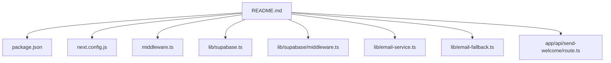
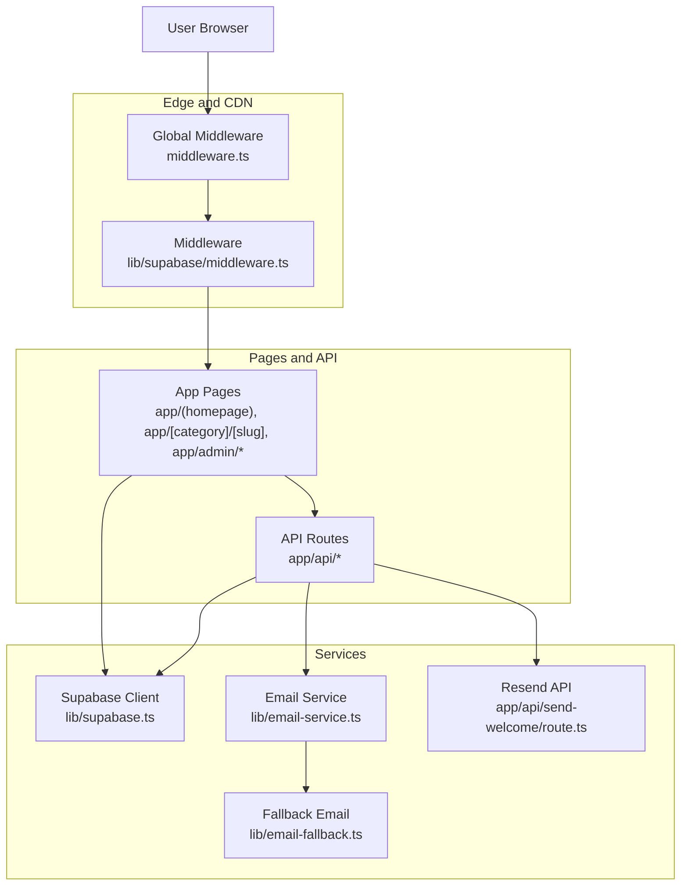
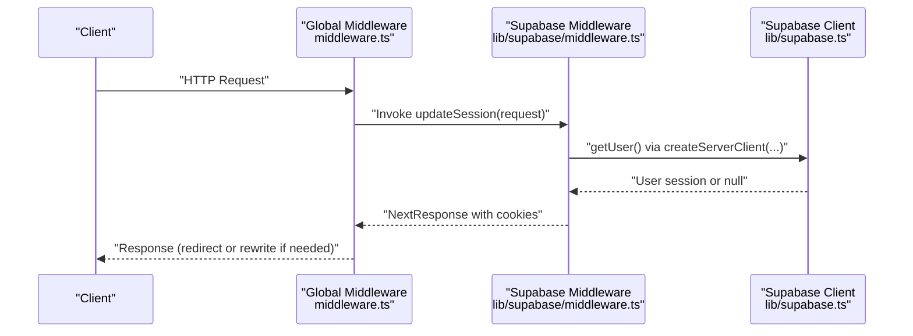
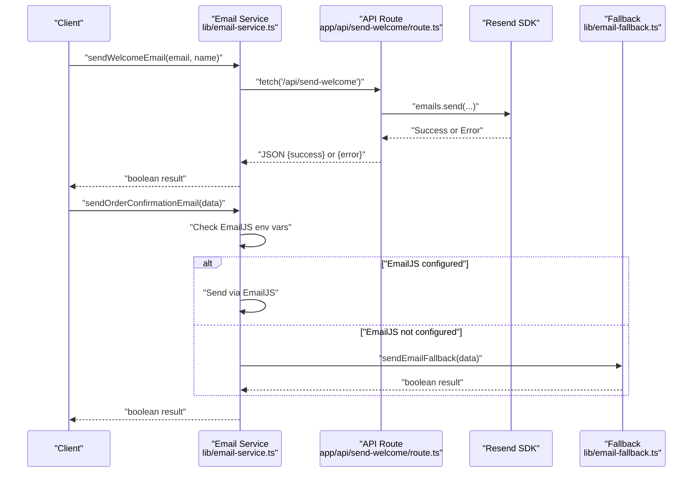
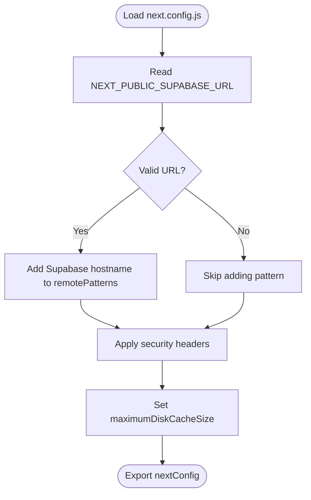
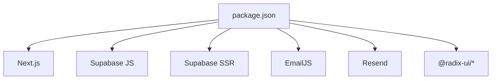

# Deployment and DevOps

<cite>
**Referenced Files in This Document**
- [README.md](file://README.md)
- [package.json](file://package.json)
- [next.config.js](file://next.config.js)
- [middleware.ts](file://middleware.ts)
- [lib/supabase/middleware.ts](file://lib/supabase/middleware.ts)
- [lib/supabase.ts](file://lib/supabase.ts)
- [lib/email-service.ts](file://lib/email-service.ts)
- [lib/email-fallback.ts](file://lib/email-fallback.ts)
- [app/api/send-welcome/route.ts](file://app/api/send-welcome/route.ts)
</cite>

## Table of Contents
1. [Introduction](#introduction)
2. [Project Structure](#project-structure)
3. [Core Components](#core-components)
4. [Architecture Overview](#architecture-overview)
5. [Detailed Component Analysis](#detailed-component-analysis)
6. [Dependency Analysis](#dependency-analysis)
7. [Performance Considerations](#performance-considerations)
8. [Troubleshooting Guide](#troubleshooting-guide)
9. [Conclusion](#conclusion)
10. [Appendices](#appendices)

## Introduction
This document provides a comprehensive guide to deploying and operating the Byiora platform in production using Vercel deployment. It explains the deployment architecture leveraging Next.js static generation, serverless functions, and Vercel’s edge network distribution. It documents environment variables for Supabase credentials, email service keys, and application settings, and offers practical examples for deployment workflows, environment setup, and monitoring configuration. It also covers CI/CD pipeline concepts, automated deployments, rollback strategies, and best practices for monitoring, logging, and maintaining production systems.

## Project Structure
Byiora is a Next.js application configured for Vercel deployment. The repository includes:
- Application pages and API routes under app/
- Shared libraries for Supabase integration and email services under lib/
- Global middleware for session management under middleware.ts and lib/supabase/middleware.ts
- Build-time configuration under next.config.js
- Package and runtime metadata under package.json
- Project overview under README.md

**Diagram sources**
- [README.md:1-18](file://README.md#L1-L18)
- [package.json:1-51](file://package.json#L1-L51)
- [next.config.js:1-68](file://next.config.js#L1-L68)
- [middleware.ts:1-11](file://middleware.ts#L1-L11)
- [lib/supabase.ts:1-188](file://lib/supabase.ts#L1-L188)
- [lib/supabase/middleware.ts:1-96](file://lib/supabase/middleware.ts#L1-L96)
- [lib/email-service.ts:1-126](file://lib/email-service.ts#L1-L126)
- [lib/email-fallback.ts:1-31](file://lib/email-fallback.ts#L1-L31)
- [app/api/send-welcome/route.ts:1-69](file://app/api/send-welcome/route.ts#L1-L69)

**Section sources**
- [README.md:1-18](file://README.md#L1-L18)
- [package.json:1-51](file://package.json#L1-L51)
- [next.config.js:1-68](file://next.config.js#L1-L68)
- [middleware.ts:1-11](file://middleware.ts#L1-L11)
- [lib/supabase.ts:1-188](file://lib/supabase.ts#L1-L188)
- [lib/supabase/middleware.ts:1-96](file://lib/supabase/middleware.ts#L1-L96)
- [lib/email-service.ts:1-126](file://lib/email-service.ts#L1-L126)
- [lib/email-fallback.ts:1-31](file://lib/email-fallback.ts#L1-L31)
- [app/api/send-welcome/route.ts:1-69](file://app/api/send-welcome/route.ts#L1-L69)

## Core Components
- Vercel deployment: The project README confirms deployment on Vercel, aligning with Next.js serverless and edge capabilities.
- Environment variables: Supabase client initialization reads public keys from environment variables. Email services rely on EmailJS and Resend environment variables.
- Middleware: Session management and admin subdomain routing are handled by middleware.ts and lib/supabase/middleware.ts.
- API routes: Serverless functions under app/api handle email delivery and other backend tasks.
- Build configuration: next.config.js defines image remote patterns, security headers, and build-time settings.

**Section sources**
- [README.md:16-16](file://README.md#L16-L16)
- [lib/supabase.ts:3-7](file://lib/supabase.ts#L3-L7)
- [lib/email-service.ts:5-7](file://lib/email-service.ts#L5-L7)
- [app/api/send-welcome/route.ts:5-5](file://app/api/send-welcome/route.ts#L5-L5)
- [middleware.ts:1-11](file://middleware.ts#L1-L11)
- [lib/supabase/middleware.ts:9-11](file://lib/supabase/middleware.ts#L9-L11)
- [next.config.js:10-20](file://next.config.js#L10-L20)
- [next.config.js:32-64](file://next.config.js#L32-L64)

## Architecture Overview
Byiora leverages Next.js App Router with serverless functions and edge middleware. Pages are statically generated where possible, while dynamic routes and API endpoints run as serverless functions. Supabase handles authentication and data access, and email delivery is performed via serverless functions using Resend and EmailJS with a fallback mechanism.

**Diagram sources**
- [lib/supabase/middleware.ts:1-96](file://lib/supabase/middleware.ts#L1-L96)
- [middleware.ts:1-11](file://middleware.ts#L1-L11)
- [lib/supabase.ts:1-188](file://lib/supabase.ts#L1-L188)
- [lib/email-service.ts:1-126](file://lib/email-service.ts#L1-L126)
- [lib/email-fallback.ts:1-31](file://lib/email-fallback.ts#L1-L31)
- [app/api/send-welcome/route.ts:1-69](file://app/api/send-welcome/route.ts#L1-L69)

## Detailed Component Analysis

### Supabase Integration and Authentication
Supabase client initialization reads public keys from environment variables. The edge middleware manages sessions, enforces login for admin routes, and rewrites admin subdomains. This ensures secure access to admin dashboards and maintains user sessions across requests.

**Diagram sources**
- [middleware.ts:4-6](file://middleware.ts#L4-L6)
- [lib/supabase/middleware.ts:4-94](file://lib/supabase/middleware.ts#L4-L94)
- [lib/supabase.ts:3-7](file://lib/supabase.ts#L3-L7)

**Section sources**
- [lib/supabase.ts:3-7](file://lib/supabase.ts#L3-L7)
- [lib/supabase/middleware.ts:9-58](file://lib/supabase/middleware.ts#L9-L58)
- [lib/supabase/middleware.ts:62-92](file://lib/supabase/middleware.ts#L62-L92)

### Email Delivery Pipeline
Email delivery uses a hybrid approach:
- EmailJS is preferred when configured via environment variables.
- If EmailJS is not configured, the system falls back to a local fallback method that logs data and simulates success.
- Welcome emails are sent via a serverless function using Resend.

**Diagram sources**
- [lib/email-service.ts:32-73](file://lib/email-service.ts#L32-L73)
- [app/api/send-welcome/route.ts:7-68](file://app/api/send-welcome/route.ts#L7-L68)
- [lib/email-service.ts:75-125](file://lib/email-service.ts#L75-L125)
- [lib/email-fallback.ts:3-30](file://lib/email-fallback.ts#L3-L30)

**Section sources**
- [lib/email-service.ts:5-7](file://lib/email-service.ts#L5-L7)
- [lib/email-service.ts:32-73](file://lib/email-service.ts#L32-L73)
- [app/api/send-welcome/route.ts:5-68](file://app/api/send-welcome/route.ts#L5-L68)
- [lib/email-service.ts:75-125](file://lib/email-service.ts#L75-L125)
- [lib/email-fallback.ts:3-30](file://lib/email-fallback.ts#L3-L30)

### Image Optimization and Security Headers
The build configuration defines remote image patterns dynamically based on Supabase URL and sets security headers for hardened transport and content policies. It also limits the Next.js image cache size to mitigate disk usage.

**Diagram sources**
- [next.config.js:10-20](file://next.config.js#L10-L20)
- [next.config.js:22-64](file://next.config.js#L22-L64)

**Section sources**
- [next.config.js:10-20](file://next.config.js#L10-L20)
- [next.config.js:22-64](file://next.config.js#L22-L64)

## Dependency Analysis
- Runtime dependencies include Next.js, Supabase client libraries, email providers, and UI primitives.
- Development dependencies include TypeScript, Tailwind, and PostCSS tooling.
- The project relies on environment variables for Supabase and email services.

**Diagram sources**
- [package.json:11-38](file://package.json#L11-L38)

**Section sources**
- [package.json:11-38](file://package.json#L11-L38)

## Performance Considerations
- Use Vercel’s edge network to reduce latency for global users.
- Keep serverless functions small and stateless; offload heavy work to background jobs or external services.
- Enable caching and leverage Next.js static generation for content that does not require server-side rendering.
- Monitor image cache size and adjust as needed to avoid disk pressure.
- Harden security headers to protect against common web vulnerabilities.

[No sources needed since this section provides general guidance]

## Troubleshooting Guide
Common deployment issues and resolutions:
- Build failures due to invalid Supabase URL in environment variables:
  - Ensure NEXT_PUBLIC_SUPABASE_URL is set and valid; the build script dynamically adds the Supabase hostname to remote image patterns.
- Environment configuration errors for Supabase:
  - Verify NEXT_PUBLIC_SUPABASE_URL and NEXT_PUBLIC_SUPABASE_ANON_KEY are present; the Supabase client requires these for initialization.
- Email service misconfiguration:
  - If EmailJS environment variables are missing, the system falls back to a local fallback method; confirm RESEND_API_KEY is set for Resend-based welcome emails.
- Performance optimization:
  - Review security headers and image cache settings in next.config.js to balance security and performance.

**Section sources**
- [next.config.js:10-20](file://next.config.js#L10-L20)
- [lib/supabase.ts:3-7](file://lib/supabase.ts#L3-L7)
- [lib/email-service.ts:5-7](file://lib/email-service.ts#L5-L7)
- [app/api/send-welcome/route.ts:5-5](file://app/api/send-welcome/route.ts#L5-L5)

## Conclusion
Byiora’s production configuration centers on Vercel deployment with Next.js static generation and serverless functions. Supabase provides authentication and data access, while email delivery is handled via Resend and EmailJS with a robust fallback. Proper environment variable management, middleware-driven session handling, and hardened build configuration are essential for a reliable production setup. Adopting CI/CD pipelines, monitoring, and logging practices will further strengthen operational excellence.

[No sources needed since this section summarizes without analyzing specific files]

## Appendices

### Environment Variables Reference
- Supabase
  - NEXT_PUBLIC_SUPABASE_URL: Supabase project URL
  - NEXT_PUBLIC_SUPABASE_ANON_KEY: Supabase anonymous key
- Email Services
  - NEXT_PUBLIC_EMAILJS_SERVICE_ID: EmailJS service identifier
  - NEXT_PUBLIC_EMAILJS_TEMPLATE_ID: EmailJS template identifier
  - NEXT_PUBLIC_EMAILJS_PUBLIC_KEY: EmailJS public key
  - RESEND_API_KEY: Resend API key for serverless email delivery
- Application Settings
  - NEXT_PUBLIC_SUPABASE_PUBLISHABLE_DEFAULT_KEY: Optional fallback publishable key

**Section sources**
- [lib/supabase.ts:3-7](file://lib/supabase.ts#L3-L7)
- [lib/email-service.ts:5-7](file://lib/email-service.ts#L5-L7)
- [app/api/send-welcome/route.ts:5-5](file://app/api/send-welcome/route.ts#L5-L5)

### Production Configuration Checklist
- Confirm Vercel deployment target and build settings align with Next.js configuration.
- Set environment variables for Supabase and email services in Vercel project settings.
- Validate middleware behavior for admin subdomain routing and session enforcement.
- Test email delivery paths (EmailJS and Resend) and fallback mechanisms.
- Review security headers and image optimization settings in next.config.js.
- Establish monitoring and logging for serverless functions and middleware.

**Section sources**
- [README.md:16-16](file://README.md#L16-L16)
- [next.config.js:32-64](file://next.config.js#L32-L64)
- [lib/supabase/middleware.ts:62-92](file://lib/supabase/middleware.ts#L62-L92)
- [lib/email-service.ts:75-125](file://lib/email-service.ts#L75-L125)