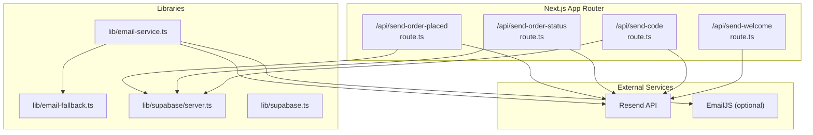
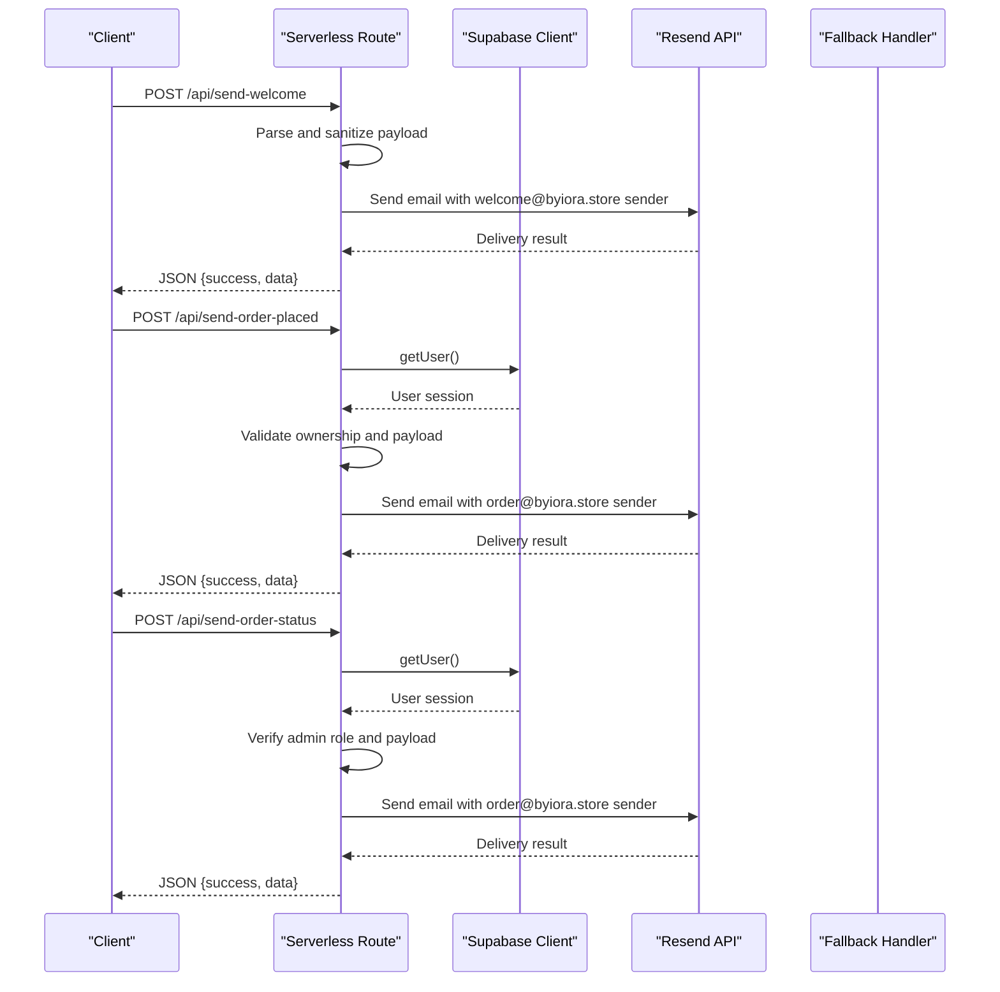
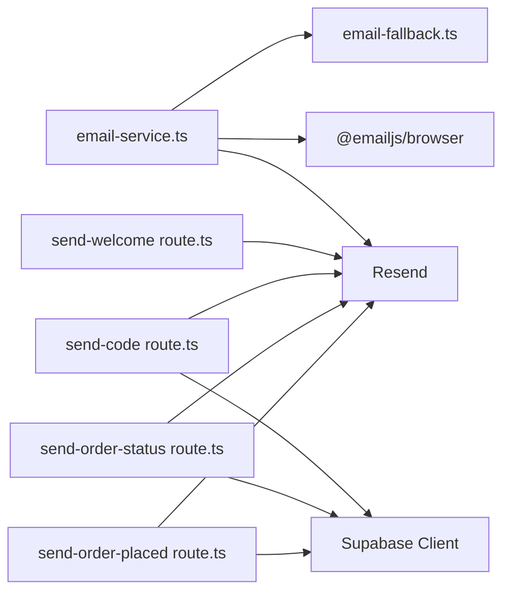

# Email API Endpoints

<cite>
**Referenced Files in This Document**
- [email-service.ts](file://lib/email-service.ts)
- [email-fallback.ts](file://lib/email-fallback.ts)
- [send-welcome route.ts](file://app/api/send-welcome/route.ts)
- [send-order-placed route.ts](file://app/api/send-order-placed/route.ts)
- [send-order-status route.ts](file://app/api/send-order-status/route.ts)
- [send-code route.ts](file://app/api/send-code/route.ts)
- [server.ts](file://lib/supabase/server.ts)
- [supabase.ts](file://lib/supabase.ts)
- [middleware.ts](file://middleware.ts)
- [package.json](file://package.json)
- [README.md](file://README.md)
</cite>

## Update Summary
**Changes Made**
- Updated welcome email sender configuration from `support@byiora.store` to `welcome@byiora.store`
- Added clarification that welcome emails use dedicated sender address for better email delivery routing
- Updated troubleshooting section to include sender address verification

## Table of Contents
1. [Introduction](#introduction)
2. [Project Structure](#project-structure)
3. [Core Components](#core-components)
4. [Architecture Overview](#architecture-overview)
5. [Detailed Component Analysis](#detailed-component-analysis)
6. [Dependency Analysis](#dependency-analysis)
7. [Performance Considerations](#performance-considerations)
8. [Troubleshooting Guide](#troubleshooting-guide)
9. [Conclusion](#conclusion)

## Introduction
This document provides comprehensive API documentation for the email service endpoints focused on automated email delivery in a Next.js serverless API. It covers the HTTP methods, URL patterns, request/response schemas, authentication requirements, security considerations, and operational guidance for extending email functionality.

The email service integrates with Resend for production email delivery and includes a graceful fallback mechanism using a local logging approach when external services are unavailable. Authentication is enforced via Supabase session tokens for protected endpoints.

**Updated** The welcome email endpoint now uses a dedicated sender address (`welcome@byiora.store`) to improve email delivery routing and deliverability compared to the generic support address used by other email templates.

## Project Structure
The email API endpoints are implemented as Next.js App Router serverless routes under the `/app/api` directory. Supporting libraries handle email delivery, sanitization, and Supabase authentication.

**Diagram sources**
- [send-welcome route.ts:1-80](file://app/api/send-welcome/route.ts#L1-L80)
- [send-order-placed route.ts:1-101](file://app/api/send-order-placed/route.ts#L1-L101)
- [send-order-status route.ts:1-199](file://app/api/send-order-status/route.ts#L1-L199)
- [send-code route.ts:1-167](file://app/api/send-code/route.ts#L1-L167)
- [email-service.ts:1-126](file://lib/email-service.ts#L1-L126)
- [email-fallback.ts:1-31](file://lib/email-fallback.ts#L1-L31)
- [server.ts:1-36](file://lib/supabase/server.ts#L1-L36)
- [supabase.ts:1-188](file://lib/supabase.ts#L1-L188)

**Section sources**
- [README.md:1-18](file://README.md#L1-L18)
- [package.json:1-51](file://package.json#L1-L51)

## Core Components
- Email service library: Provides client-side and server-side helpers for sending welcome emails and order confirmation emails, with fallback to a local logging mechanism.
- Fallback email handler: Logs order confirmation data and simulates successful delivery when external services are unavailable.
- Serverless routes: Implement Resend-based email delivery with Supabase authentication checks and HTML email templates.

Key responsibilities:
- Validate request payloads and sanitize inputs.
- Authenticate requests using Supabase session tokens.
- Enforce authorization policies (user vs admin).
- Deliver templated HTML emails via Resend.
- Return structured JSON responses and handle errors gracefully.

**Section sources**
- [email-service.ts:1-126](file://lib/email-service.ts#L1-L126)
- [email-fallback.ts:1-31](file://lib/email-fallback.ts#L1-L31)
- [send-welcome route.ts:1-80](file://app/api/send-welcome/route.ts#L1-L80)
- [send-order-placed route.ts:1-101](file://app/api/send-order-placed/route.ts#L1-L101)
- [send-order-status route.ts:1-199](file://app/api/send-order-status/route.ts#L1-L199)
- [send-code route.ts:1-167](file://app/api/send-code/route.ts#L1-L167)

## Architecture Overview
The email endpoints follow a layered architecture:
- Presentation layer: Next.js serverless routes handle HTTP requests and responses.
- Domain layer: Email service library encapsulates email delivery logic and fallback behavior.
- Infrastructure layer: Supabase client manages session-based authentication; Resend client handles email transport.

**Diagram sources**
- [send-welcome route.ts:1-80](file://app/api/send-welcome/route.ts#L1-L80)
- [send-order-placed route.ts:1-101](file://app/api/send-order-placed/route.ts#L1-L101)
- [send-order-status route.ts:1-199](file://app/api/send-order-status/route.ts#L1-L199)
- [server.ts:1-36](file://lib/supabase/server.ts#L1-L36)

## Detailed Component Analysis

### Endpoint: POST /api/send-welcome
- Purpose: Sends a welcome email to a newly registered user.
- Method: POST
- URL: /api/send-welcome
- Authentication: None (public endpoint)
- Security: Input sanitized; minimal validation.

Request schema:
- email: string (required)
- userName: string (optional; defaults to a friendly placeholder)

Response schema:
- success: boolean
- data: object (delivery metadata from Resend)

Status codes:
- 200 OK: Email sent successfully
- 400 Bad Request: Missing email
- 500 Internal Server Error: Delivery failure

Example request payload:
- email: "customer@example.com"
- userName: "Alex"

Example response:
- success: true
- data: { id: "...", to: ["customer@example.com"] }

Notes:
- Uses Resend to send HTML email with branding and links.
- No Supabase authentication is required.
- **Updated** Uses dedicated sender address `welcome@byiora.store` for improved email delivery routing and deliverability.

**Section sources**
- [send-welcome route.ts:1-80](file://app/api/send-welcome/route.ts#L1-L80)

### Endpoint: POST /api/send-order-placed
- Purpose: Confirms order placement and notifies the customer.
- Method: POST
- URL: /api/send-order-placed
- Authentication: Required (user session)
- Authorization: Must match the email in the request to the authenticated user's email.
- Security: Input sanitized; validates presence of required fields.

Request schema:
- email: string (required; must match authenticated user)
- transactionId: string (recommended)
- userName: string (optional)
- productName: string (optional)
- denomination: string (optional)

Response schema:
- success: boolean
- data: object (delivery metadata from Resend)

Status codes:
- 200 OK: Email sent successfully
- 400 Bad Request: Missing email
- 401 Unauthorized: No active session
- 403 Forbidden: Attempting to send to another user's email

Example request payload:
- email: "customer@example.com"
- transactionId: "txn_abc123"
- userName: "Alex"
- productName: "Steam Wallet"
- denomination: "$25"

Example response:
- success: true
- data: { id: "...", to: ["customer@example.com"] }

Notes:
- Uses Resend to send an HTML email with order details and a pending status indicator.
- Requires Supabase session to verify identity.
- Uses `order@byiora.store` as sender address for order-related communications.

**Section sources**
- [send-order-placed route.ts:1-101](file://app/api/send-order-placed/route.ts#L1-L101)
- [server.ts:1-36](file://lib/supabase/server.ts#L1-L36)

### Endpoint: POST /api/send-order-status
- Purpose: Notifies customers about order completion or failure.
- Method: POST
- URL: /api/send-order-status
- Authentication: Required (admin session)
- Authorization: Only admin users can trigger this endpoint.
- Security: Input sanitized; validates presence of required fields.

Request schema:
- email: string (required)
- status: string (required; "Completed" or "Failed")
- transactionId: string (optional)
- userName: string (optional)
- productName: string (optional)
- denomination: string (optional)
- remarks: string (optional; used for failure reasons)

Response schema:
- success: boolean
- data: object (delivery metadata from Resend)

Status codes:
- 200 OK: Email sent successfully
- 400 Bad Request: Missing email or status
- 401 Unauthorized: No active session
- 403 Forbidden: Non-admin user attempted to send status update

Example request payload (completed):
- email: "customer@example.com"
- status: "Completed"
- transactionId: "txn_abc123"
- productName: "Steam Wallet"
- denomination: "$25"

Example request payload (failed):
- email: "customer@example.com"
- status: "Failed"
- remarks: "Payment declined by provider"

Example response:
- success: true
- data: { id: "...", to: ["customer@example.com"] }

Notes:
- Uses Resend to send either a success or failure template based on status.
- Requires admin privileges to prevent misuse.
- Uses `order@byiora.store` as sender address for order-related communications.

**Section sources**
- [send-order-status route.ts:1-199](file://app/api/send-order-status/route.ts#L1-L199)
- [server.ts:1-36](file://lib/supabase/server.ts#L1-L36)

### Endpoint: POST /api/send-code
- Purpose: Sends the gift card code to the customer.
- Method: POST
- URL: /api/send-code
- Authentication: Required (user session)
- Authorization: If attempting to send to another user's email, only admins are permitted.
- Security: Input sanitized; validates presence of required fields.

Request schema:
- email: string (required)
- giftcardCode: string (required)
- userName: string (optional)
- productName: string (optional)
- denomination: string (optional)
- subject: string (optional; custom subject overrides default)

Response schema:
- success: boolean
- data: object (delivery metadata from Resend)

Status codes:
- 200 OK: Email sent successfully
- 400 Bad Request: Missing email or giftcardCode
- 401 Unauthorized: No active session
- 403 Forbidden: Non-admin user attempted to send to another user's email

Example request payload:
- email: "customer@example.com"
- giftcardCode: "ABCD-EFGH-IJKL-MNOP"
- productName: "Steam Wallet"
- denomination: "$25"

Example response:
- success: true
- data: { id: "...", to: ["customer@example.com"] }

Notes:
- Uses Resend to send an HTML email containing the gift card code prominently displayed.
- Enforces strict authorization to protect user privacy.
- Uses `order@byiora.store` as sender address for order-related communications.

**Section sources**
- [send-code route.ts:1-167](file://app/api/send-code/route.ts#L1-L167)
- [server.ts:1-36](file://lib/supabase/server.ts#L1-L36)

### Client-Side Email Helpers
The email service library provides client-side helpers for automated email delivery:

- sendWelcomeEmail(email, name): Sends a welcome email via the /api/send-welcome endpoint. Works on both client and server by dynamically constructing the absolute URL on the server.
- sendOrderConfirmationEmail(orderData): Attempts to send via EmailJS if configured; falls back to a local logging mechanism otherwise.

OrderEmailData schema (used by sendOrderConfirmationEmail):
- to_email: string (required)
- to_name: string (optional)
- product_name: string (optional)
- product_image_url: string (optional)
- logo_url: string (optional)
- order_amount: string (optional)
- order_price: string (optional)
- transaction_id: string (optional)
- order_date: string (optional)
- payment_method: string (optional)

Behavior:
- Validates email format.
- Uses EmailJS if credentials are present; otherwise logs and simulates success via fallback.

**Section sources**
- [email-service.ts:1-126](file://lib/email-service.ts#L1-L126)
- [email-fallback.ts:1-31](file://lib/email-fallback.ts#L1-L31)

## Dependency Analysis
External dependencies and their roles:
- Resend: Production email delivery for all serverless routes.
- Supabase: Session-based authentication and user identity verification for protected endpoints.
- DOMPurify: Sanitizes user-provided input to mitigate XSS risks.
- EmailJS: Optional client-side email delivery with fallback to local logging.

**Diagram sources**
- [email-service.ts:1-126](file://lib/email-service.ts#L1-L126)
- [email-fallback.ts:1-31](file://lib/email-fallback.ts#L1-L31)
- [send-welcome route.ts:1-80](file://app/api/send-welcome/route.ts#L1-L80)
- [send-order-placed route.ts:1-101](file://app/api/send-order-placed/route.ts#L1-L101)
- [send-order-status route.ts:1-199](file://app/api/send-order-status/route.ts#L1-L199)
- [send-code route.ts:1-167](file://app/api/send-code/route.ts#L1-L167)
- [server.ts:1-36](file://lib/supabase/server.ts#L1-L36)

**Section sources**
- [package.json:1-51](file://package.json#L1-L51)

## Performance Considerations
- Asynchronous delivery: All endpoints return immediately upon initiating email delivery, deferring processing to Resend.
- Input sanitization: DOMPurify reduces overhead while preventing XSS; keep payloads minimal to minimize sanitization cost.
- Rate limiting: Resend enforces rate limits; implement client-side throttling and retry with exponential backoff for bulk operations.
- Monitoring: Log delivery attempts and outcomes; track latency and failure rates for proactive intervention.
- Caching: Avoid caching sensitive user data; cache only non-sensitive assets (e.g., static images) and ensure CDN configuration is secure.

## Troubleshooting Guide
Common issues and resolutions:
- Authentication failures:
  - Symptom: 401 Unauthorized on protected endpoints.
  - Resolution: Ensure the client sends a valid Supabase session cookie; verify middleware is active.
- Authorization failures:
  - Symptom: 403 Forbidden when sending emails to other users.
  - Resolution: Only admins can send to arbitrary emails; confirm admin role in Supabase.
- Missing or invalid payload:
  - Symptom: 400 Bad Request.
  - Resolution: Validate required fields (email, status for status updates, giftcardCode for code delivery).
- Delivery failures:
  - Symptom: 500 Internal Server Error.
  - Resolution: Check Resend API key and configuration; review logs for detailed error messages.
- Fallback behavior:
  - Symptom: Emails not delivered via external service.
  - Resolution: Confirm EmailJS credentials; if absent, fallback logs data locally and returns success.
- **Updated** Sender address issues:
  - Symptom: Welcome emails failing to deliver or being marked as spam.
  - Resolution: Verify that `welcome@byiora.store` is properly configured in DNS records and Resend settings; ensure dedicated sender address is approved for sending.

Debugging steps:
- Enable verbose logging for email attempts and responses.
- Use Resend dashboard to inspect message status and bounce reports.
- Monitor Supabase authentication events and session validity.
- Implement circuit breaker logic to temporarily disable email delivery during outages.
- **Updated** Verify sender address configuration in email service settings and DNS records.

**Section sources**
- [send-order-placed route.ts:1-101](file://app/api/send-order-placed/route.ts#L1-L101)
- [send-order-status route.ts:1-199](file://app/api/send-order-status/route.ts#L1-L199)
- [send-code route.ts:1-167](file://app/api/send-code/route.ts#L1-L167)
- [email-service.ts:1-126](file://lib/email-service.ts#L1-L126)

## Conclusion
The email API endpoints provide a robust foundation for automated email delivery with strong security controls, input sanitization, and fallback mechanisms. Protected endpoints enforce user and admin authorization, while public endpoints enable welcome emails without authentication. Extending functionality involves adding new templates, integrating additional providers, and maintaining consistent error handling and logging practices.

**Updated** The welcome email endpoint now uses a dedicated sender address (`welcome@byiora.store`) specifically configured for better email delivery routing and improved deliverability compared to the generic support address used by other email templates. This separation of sender addresses helps optimize email deliverability across different types of communications while maintaining consistent branding and user experience.