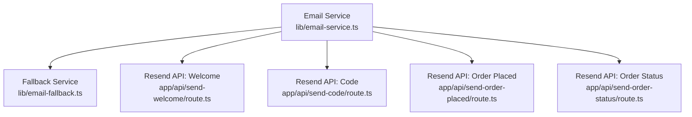
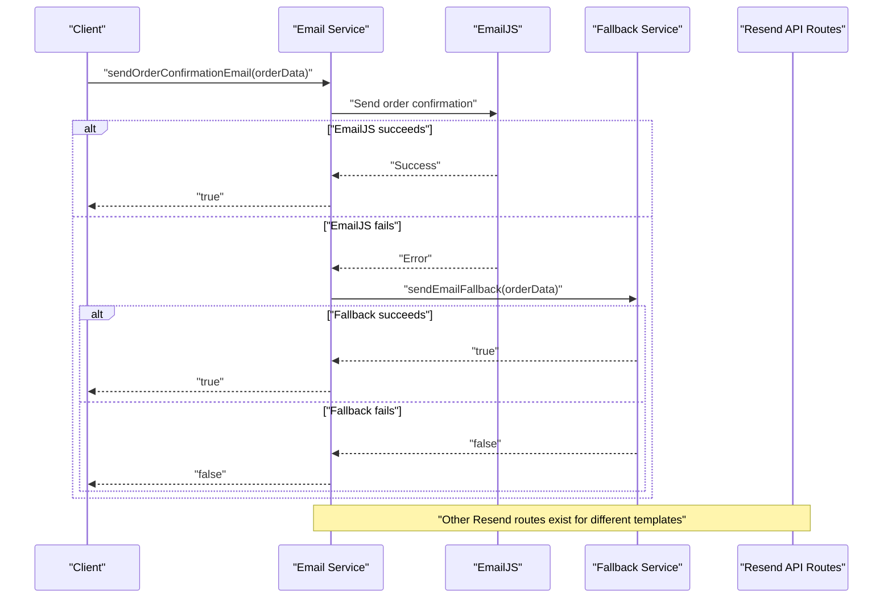
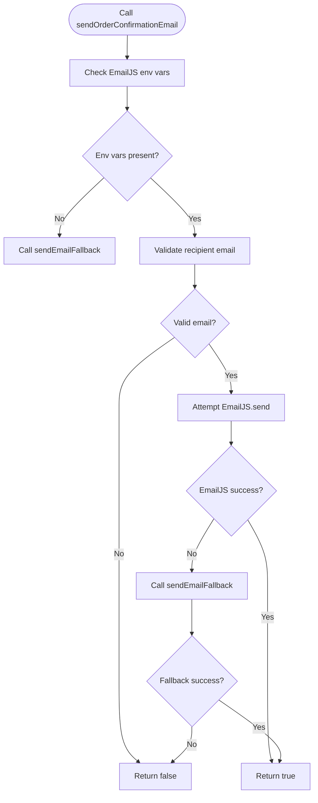
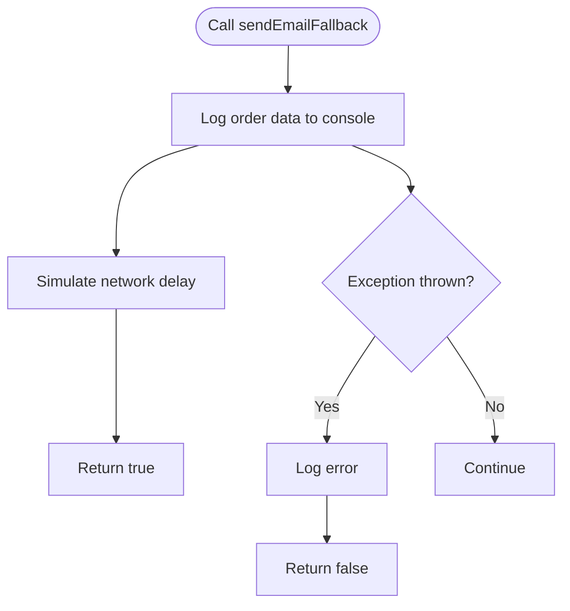
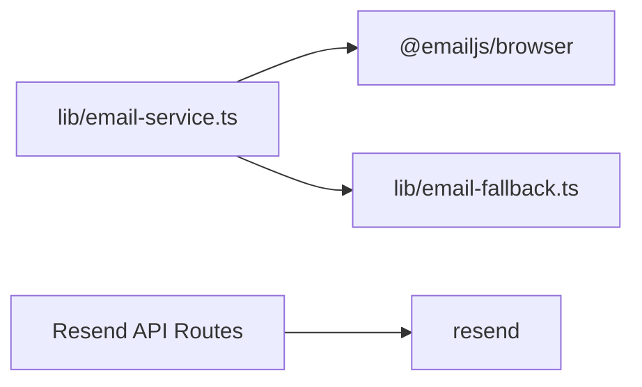

# Email Fallback Mechanism

<cite>
**Referenced Files in This Document**
- [email-service.ts](file://lib/email-service.ts)
- [email-fallback.ts](file://lib/email-fallback.ts)
- [send-order-placed/route.ts](file://app/api/send-order-placed/route.ts)
- [send-code/route.ts](file://app/api/send-code/route.ts)
- [send-order-status/route.ts](file://app/api/send-order-status/route.ts)
- [send-welcome/route.ts](file://app/api/send-welcome/route.ts)
- [package.json](file://package.json)
</cite>

## Table of Contents
1. [Introduction](#introduction)
2. [Project Structure](#project-structure)
3. [Core Components](#core-components)
4. [Architecture Overview](#architecture-overview)
5. [Detailed Component Analysis](#detailed-component-analysis)
6. [Dependency Analysis](#dependency-analysis)
7. [Performance Considerations](#performance-considerations)
8. [Troubleshooting Guide](#troubleshooting-guide)
9. [Conclusion](#conclusion)

## Introduction
This document explains the email fallback mechanism implemented in the project, focusing on the integration with Resend as a backup email delivery system. It covers the fallback logic, error detection patterns, automatic failover behavior, and the current implementation of the `sendEmailFallback` function. It also provides configuration guidelines, monitoring suggestions, and troubleshooting approaches to maintain reliability and improve deliverability.

## Project Structure
The email system consists of:
- A primary email service that attempts to send via EmailJS
- A fallback service that logs order data and simulates success
- Multiple Resend-based API routes for different email templates

**Diagram sources**
- [email-service.ts:75-125](file://lib/email-service.ts#L75-L125)
- [email-fallback.ts:3-30](file://lib/email-fallback.ts#L3-L30)
- [send-welcome/route.ts:1-80](file://app/api/send-welcome/route.ts#L1-L80)
- [send-code/route.ts:1-102](file://app/api/send-code/route.ts#L1-L102)
- [send-order-placed/route.ts:1-101](file://app/api/send-order-placed/route.ts#L1-L101)
- [send-order-status/route.ts:1-199](file://app/api/send-order-status/route.ts#L1-L199)

**Section sources**
- [email-service.ts:1-126](file://lib/email-service.ts#L1-L126)
- [email-fallback.ts:1-31](file://lib/email-fallback.ts#L1-L31)
- [send-welcome/route.ts:1-80](file://app/api/send-welcome/route.ts#L1-L80)
- [send-code/route.ts:1-102](file://app/api/send-code/route.ts#L1-L102)
- [send-order-placed/route.ts:1-101](file://app/api/send-order-placed/route.ts#L1-L101)
- [send-order-status/route.ts:1-199](file://app/api/send-order-status/route.ts#L1-L199)

## Core Components
- Email Service (`lib/email-service.ts`):
  - Provides `sendOrderConfirmationEmail` that attempts EmailJS delivery and falls back to the fallback service on failure.
  - Validates input and handles environment configuration for EmailJS.
- Fallback Service (`lib/email-fallback.ts`):
  - Implements `sendEmailFallback` to log order data and simulate success.
  - Returns a boolean indicating success/failure for integration with the email service.

Key responsibilities:
- Primary delivery via EmailJS with graceful degradation to fallback
- Centralized error logging and failover orchestration
- Input validation and environment checks

**Section sources**
- [email-service.ts:75-125](file://lib/email-service.ts#L75-L125)
- [email-fallback.ts:3-30](file://lib/email-fallback.ts#L3-L30)

## Architecture Overview
The email architecture implements a primary-backup pattern:
- Primary: EmailJS for order confirmation emails
- Backup: Local fallback that logs data and returns success
- Additional Resend-based APIs handle other email templates (welcome, code, order status, order placed)

**Diagram sources**
- [email-service.ts:75-125](file://lib/email-service.ts#L75-L125)
- [email-fallback.ts:3-30](file://lib/email-fallback.ts#L3-L30)
- [send-welcome/route.ts:1-80](file://app/api/send-welcome/route.ts#L1-L80)
- [send-code/route.ts:1-102](file://app/api/send-code/route.ts#L1-L102)
- [send-order-placed/route.ts:1-101](file://app/api/send-order-placed/route.ts#L1-L101)
- [send-order-status/route.ts:1-199](file://app/api/send-order-status/route.ts#L1-L199)

## Detailed Component Analysis

### Email Service: sendOrderConfirmationEmail
- Purpose: Attempt primary EmailJS delivery; on failure, invoke fallback and return boolean outcome.
- Error detection:
  - Environment variables missing: triggers immediate fallback.
  - Runtime errors during EmailJS.send: triggers fallback retry.
- Validation:
  - Checks email validity before attempting delivery.
- Integration:
  - Imports and uses `sendEmailFallback` for backup delivery.

**Diagram sources**
- [email-service.ts:75-125](file://lib/email-service.ts#L75-L125)

**Section sources**
- [email-service.ts:75-125](file://lib/email-service.ts#L75-L125)

### Fallback Service: sendEmailFallback
- Purpose: Provide a resilient backup that logs order data and simulates success.
- Behavior:
  - Logs the order payload with essential fields.
  - Introduces a small delay to simulate network latency.
  - Returns true on successful logging; false on exceptions.
- Integration:
  - Consumed by the email service during failover.

**Diagram sources**
- [email-fallback.ts:3-30](file://lib/email-fallback.ts#L3-L30)

**Section sources**
- [email-fallback.ts:3-30](file://lib/email-fallback.ts#L3-L30)

### Resend-Based Email Templates
While the fallback focuses on EmailJS failover, the project includes several Resend-backed API routes for other email scenarios:
- Welcome email
- Gift card code delivery
- Order placed notification
- Order status updates

These routes demonstrate the project’s email infrastructure and can serve as references for implementing a production-ready fallback using Resend.

**Section sources**
- [send-welcome/route.ts:1-80](file://app/api/send-welcome/route.ts#L1-L80)
- [send-code/route.ts:1-102](file://app/api/send-code/route.ts#L1-L102)
- [send-order-placed/route.ts:1-101](file://app/api/send-order-placed/route.ts#L1-L101)
- [send-order-status/route.ts:1-199](file://app/api/send-order-status/route.ts#L1-L199)

## Dependency Analysis
- Email Service depends on:
  - EmailJS library for primary delivery
  - Fallback service for degraded operation
- Fallback service depends on:
  - Logging infrastructure (console)
- Resend routes depend on:
  - Resend SDK and environment configuration

**Diagram sources**
- [email-service.ts:1-3](file://lib/email-service.ts#L1-L3)
- [email-fallback.ts:1-2](file://lib/email-fallback.ts#L1-L2)
- [package.json:11-38](file://package.json#L11-L38)

**Section sources**
- [email-service.ts:1-3](file://lib/email-service.ts#L1-L3)
- [email-fallback.ts:1-2](file://lib/email-fallback.ts#L1-L2)
- [package.json:11-38](file://package.json#L11-L38)

## Performance Considerations
- Current fallback introduces a fixed delay to simulate network latency. In production, consider:
  - Asynchronous logging without blocking
  - Configurable timeout thresholds
  - Circuit breaker patterns to prevent cascading failures
- EmailJS requests:
  - Monitor response times and error rates
  - Implement exponential backoff on transient failures
- Resend routes:
  - Validate rate limits and adjust retry policies accordingly

[No sources needed since this section provides general guidance]

## Troubleshooting Guide
Common issues and resolutions:
- EmailJS not configured:
  - Symptom: Immediate fallback invoked with warnings.
  - Action: Set required environment variables for EmailJS and verify keys.
- Invalid recipient email:
  - Symptom: Early exit with error logs.
  - Action: Validate input before calling the email service.
- Network or service failures:
  - Symptom: EmailJS throws error; fallback invoked.
  - Action: Inspect fallback logs; ensure fallback remains operational.
- Resend route errors:
  - Symptom: API route catches and logs errors.
  - Action: Review route-specific error handling and environment configuration.

Operational checks:
- Verify environment variables for EmailJS and Resend
- Confirm API routes are reachable and authenticated
- Monitor console logs for error traces

**Section sources**
- [email-service.ts:77-80](file://lib/email-service.ts#L77-L80)
- [email-service.ts:82-86](file://lib/email-service.ts#L82-L86)
- [email-service.ts:114-124](file://lib/email-service.ts#L114-L124)
- [send-welcome/route.ts:75-78](file://app/api/send-welcome/route.ts#L75-L78)
- [send-code/route.ts:97-100](file://app/api/send-code/route.ts#L97-L100)
- [send-order-placed/route.ts:96-99](file://app/api/send-order-placed/route.ts#L96-L99)
- [send-order-status/route.ts:194-197](file://app/api/send-order-status/route.ts#L194-L197)

## Conclusion
The project implements a robust email fallback mechanism centered on EmailJS with a resilient backup path. The current fallback logs order data and simulates success, enabling graceful degradation when primary delivery fails. The presence of multiple Resend-backed API routes demonstrates a broader email infrastructure that can guide future enhancements, such as integrating a production-grade fallback email service for improved deliverability, reduced single points of failure, and enhanced system resilience.

[No sources needed since this section summarizes without analyzing specific files]