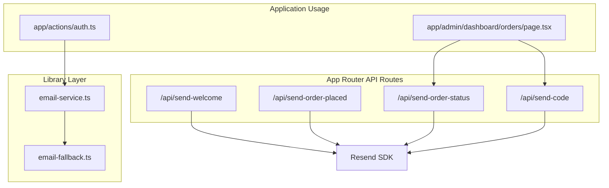
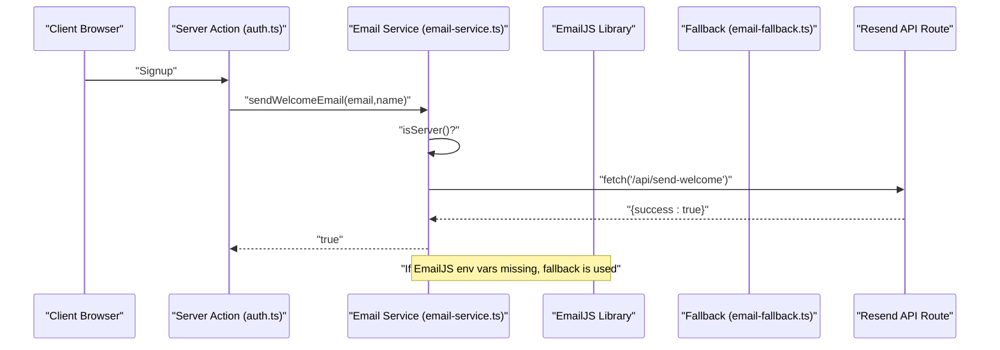
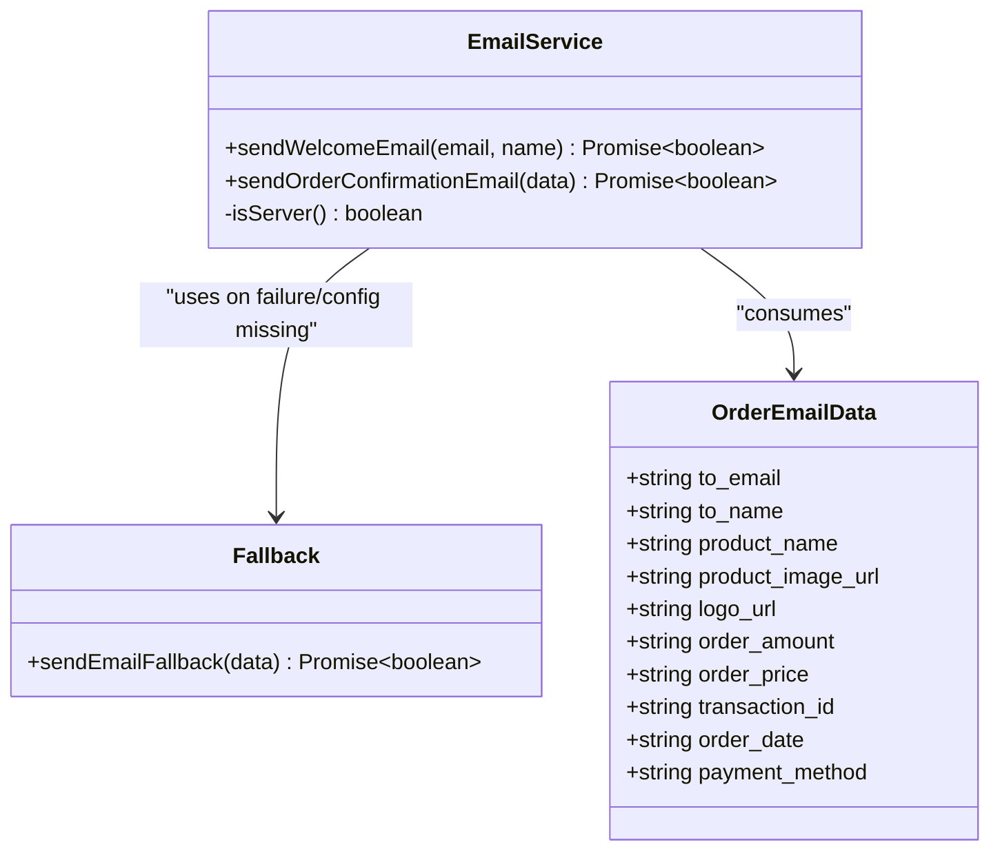
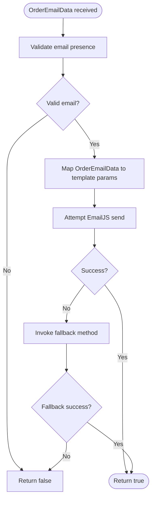
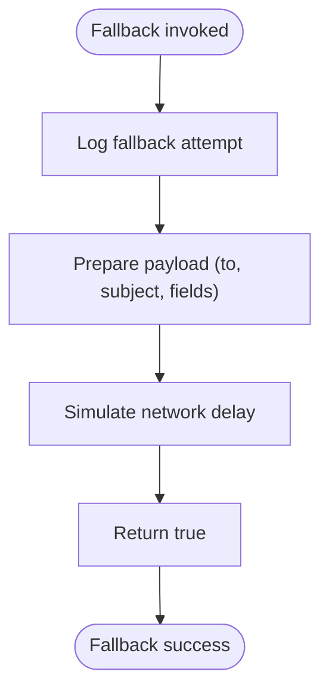
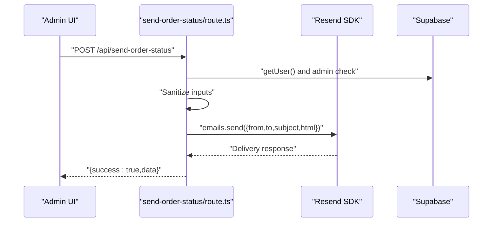
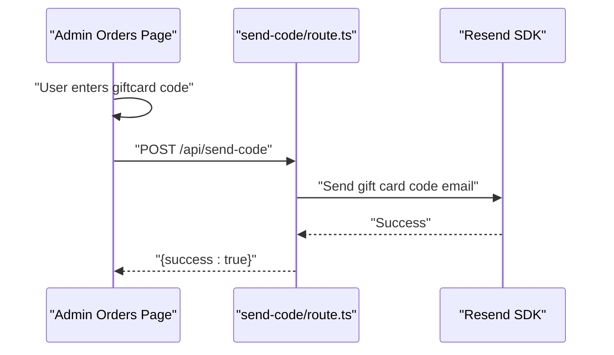
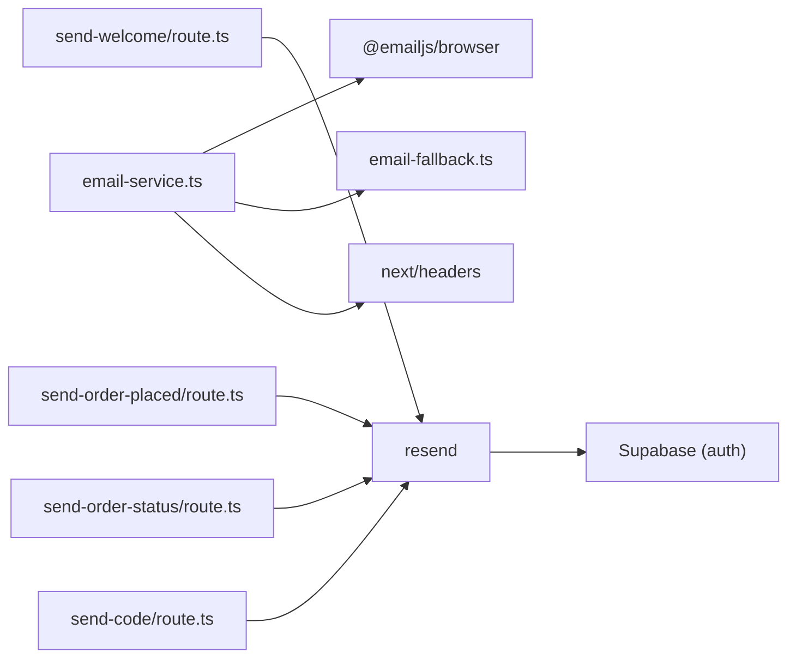

# Email Service Architecture

<cite>
**Referenced Files in This Document**
- [email-service.ts](file://lib/email-service.ts)
- [email-fallback.ts](file://lib/email-fallback.ts)
- [send-order-placed/route.ts](file://app/api/send-order-placed/route.ts)
- [send-order-status/route.ts](file://app/api/send-order-status/route.ts)
- [send-welcome/route.ts](file://app/api/send-welcome/route.ts)
- [send-code/route.ts](file://app/api/send-code/route.ts)
- [auth.ts](file://app/actions/auth.ts)
- [orders/page.tsx](file://app/admin/dashboard/orders/page.tsx)
- [package.json](file://package.json)
- [README.md](file://README.md)
</cite>

## Table of Contents
1. [Introduction](#introduction)
2. [Project Structure](#project-structure)
3. [Core Components](#core-components)
4. [Architecture Overview](#architecture-overview)
5. [Detailed Component Analysis](#detailed-component-analysis)
6. [Dependency Analysis](#dependency-analysis)
7. [Performance Considerations](#performance-considerations)
8. [Troubleshooting Guide](#troubleshooting-guide)
9. [Conclusion](#conclusion)

## Introduction
This document explains the email service architecture with a dual-email service implementation using EmailJS and a Resend fallback mechanism. It covers the service abstraction layer, environment variable configuration, runtime detection for server/client contexts, the email service interface design, error handling strategies, and fallback logic. It also documents the OrderEmailData interface, template parameter mapping, and service initialization patterns. Practical examples demonstrate configuration, client-side and server-side usage patterns, and integration with the Next.js App Router.

## Project Structure
The email architecture spans a small library module and several Next.js App Router API routes:
- A client/server abstraction layer in the email service library
- Fallback implementation for environments where EmailJS is unavailable
- Dedicated API routes for Resend-based email delivery
- Usage in server actions and admin UI flows

**Diagram sources**
- [email-service.ts:1-126](file://lib/email-service.ts#L1-L126)
- [email-fallback.ts:1-31](file://lib/email-fallback.ts#L1-L31)
- [send-welcome/route.ts:1-69](file://app/api/send-welcome/route.ts#L1-L69)
- [send-order-placed/route.ts:1-90](file://app/api/send-order-placed/route.ts#L1-L90)
- [send-order-status/route.ts:1-188](file://app/api/send-order-status/route.ts#L1-L188)
- [send-code/route.ts:1-91](file://app/api/send-code/route.ts#L1-L91)
- [auth.ts:1-68](file://app/actions/auth.ts#L1-L68)
- [orders/page.tsx:1-581](file://app/admin/dashboard/orders/page.tsx#L1-L581)

**Section sources**
- [README.md:1-18](file://README.md#L1-L18)
- [package.json:1-51](file://package.json#L1-L51)

## Core Components
- Dual-email service abstraction:
  - Primary EmailJS client-side sending with fallback to Resend via a fallback function
  - Environment variables for EmailJS configuration
  - Runtime server/client detection for constructing absolute URLs
- Order email confirmation flow:
  - OrderEmailData interface mapping template parameters
  - Fallback invoked when EmailJS is not configured
- Resend-based API routes:
  - Welcome email, order placed, order status, and gift card code delivery
  - Server-side validation and sanitization
- Application integration:
  - Server actions trigger welcome emails
  - Admin UI triggers order status and code emails

**Section sources**
- [email-service.ts:14-126](file://lib/email-service.ts#L14-L126)
- [email-fallback.ts:1-31](file://lib/email-fallback.ts#L1-L31)
- [send-welcome/route.ts:1-69](file://app/api/send-welcome/route.ts#L1-L69)
- [send-order-placed/route.ts:1-90](file://app/api/send-order-placed/route.ts#L1-L90)
- [send-order-status/route.ts:1-188](file://app/api/send-order-status/route.ts#L1-L188)
- [send-code/route.ts:1-91](file://app/api/send-code/route.ts#L1-L91)
- [auth.ts:25-68](file://app/actions/auth.ts#L25-L68)
- [orders/page.tsx:213-239](file://app/admin/dashboard/orders/page.tsx#L213-L239)

## Architecture Overview
The architecture separates concerns across layers:
- Abstraction layer: email-service.ts encapsulates EmailJS and fallback logic
- Transport layer: Resend API routes handle server-side email delivery
- Application layer: server actions and admin UI trigger email flows
- Environment configuration: EmailJS variables and Resend API key

**Diagram sources**
- [auth.ts:25-68](file://app/actions/auth.ts#L25-L68)
- [email-service.ts:32-73](file://lib/email-service.ts#L32-L73)
- [send-welcome/route.ts:1-69](file://app/api/send-welcome/route.ts#L1-L69)

## Detailed Component Analysis

### Email Service Abstraction Layer
The abstraction layer centralizes email sending logic and provides a unified interface for both client and server contexts.

Key design elements:
- Environment variable configuration for EmailJS
- Runtime server detection to construct absolute URLs on the server
- OrderEmailData interface for parameter mapping
- Fallback logic when EmailJS is not configured

**Diagram sources**
- [email-service.ts:14-126](file://lib/email-service.ts#L14-L126)
- [email-fallback.ts:1-31](file://lib/email-fallback.ts#L1-L31)

Implementation highlights:
- EmailJS environment variables are loaded at module import time
- sendWelcomeEmail constructs absolute URLs on the server using headers and relative URLs on the client
- sendOrderConfirmationEmail validates inputs, maps OrderEmailData to EmailJS template parameters, and falls back to Resend via fallback function when EmailJS is not configured

**Section sources**
- [email-service.ts:5-126](file://lib/email-service.ts#L5-L126)
- [email-fallback.ts:1-31](file://lib/email-fallback.ts#L1-L31)

### OrderEmailData Interface and Template Parameter Mapping
The OrderEmailData interface defines the contract for order confirmation emails. The service maps these fields to EmailJS template parameters to ensure compatibility with templates expecting specific keys.

Template parameter mapping:
- Recipient and sender fields
- Product and order metadata
- Branding assets (logo, images)

**Diagram sources**
- [email-service.ts:75-125](file://lib/email-service.ts#L75-L125)

**Section sources**
- [email-service.ts:14-106](file://lib/email-service.ts#L14-L106)

### Fallback Mechanism Implementation
The fallback function logs the intended email payload and simulates sending. In a production environment, this function should integrate with a robust email transport (e.g., Resend) to guarantee delivery.

**Diagram sources**
- [email-fallback.ts:1-31](file://lib/email-fallback.ts#L1-L31)

**Section sources**
- [email-fallback.ts:1-31](file://lib/email-fallback.ts#L1-L31)

### Resend API Routes
Resend-based routes provide server-side email delivery with strict validation and sanitization. They are used by the email service when EmailJS is unavailable and by the admin UI for order status and gift card code delivery.

Key characteristics:
- Authentication and authorization checks
- Input sanitization using DOMPurify
- HTML email templating with branded styling
- Error handling returning structured JSON responses

**Diagram sources**
- [send-order-status/route.ts:1-188](file://app/api/send-order-status/route.ts#L1-L188)

**Section sources**
- [send-welcome/route.ts:1-69](file://app/api/send-welcome/route.ts#L1-L69)
- [send-order-placed/route.ts:1-90](file://app/api/send-order-placed/route.ts#L1-L90)
- [send-order-status/route.ts:1-188](file://app/api/send-order-status/route.ts#L1-L188)
- [send-code/route.ts:1-91](file://app/api/send-code/route.ts#L1-L91)

### Application Integration Patterns
- Server actions:
  - Welcome emails are triggered during user signup
  - Email failures are caught to avoid blocking the signup flow
- Admin UI:
  - Order status updates trigger order status emails
  - Gift card code entries trigger code delivery emails

**Diagram sources**
- [orders/page.tsx:241-287](file://app/admin/dashboard/orders/page.tsx#L241-L287)
- [send-code/route.ts:1-91](file://app/api/send-code/route.ts#L1-L91)

**Section sources**
- [auth.ts:25-68](file://app/actions/auth.ts#L25-L68)
- [orders/page.tsx:213-239](file://app/admin/dashboard/orders/page.tsx#L213-L239)
- [orders/page.tsx:241-287](file://app/admin/dashboard/orders/page.tsx#L241-L287)

## Dependency Analysis
External dependencies and their roles:
- EmailJS browser library for client-side email sending
- Resend SDK for server-side email delivery
- DOMPurify for input sanitization
- Next.js App Router for API routes and server actions

**Diagram sources**
- [email-service.ts:1-3](file://lib/email-service.ts#L1-L3)
- [send-welcome/route.ts:1-69](file://app/api/send-welcome/route.ts#L1-L69)
- [send-order-placed/route.ts:1-90](file://app/api/send-order-placed/route.ts#L1-L90)
- [send-order-status/route.ts:1-188](file://app/api/send-order-status/route.ts#L1-L188)
- [send-code/route.ts:1-91](file://app/api/send-code/route.ts#L1-L91)

**Section sources**
- [package.json:11-39](file://package.json#L11-L39)

## Performance Considerations
- Conditional service usage:
  - EmailJS is used when configured; otherwise, fallback is invoked
  - This avoids unnecessary client-side dependencies and reduces bundle size when EmailJS is not needed
- Server-side delivery:
  - Resend routes run on the server, avoiding client-side credential exposure
  - Server-side validation and sanitization reduce downstream errors
- Network efficiency:
  - Minimal logging and minimal payload duplication in fallback mode
  - Absolute URL construction on the server ensures correct routing without extra redirects

## Troubleshooting Guide
Common issues and resolutions:
- EmailJS not configured:
  - Symptom: Warning logged and fallback invoked
  - Resolution: Set NEXT_PUBLIC_EMAILJS_* environment variables or rely on fallback
- Invalid email address:
  - Symptom: Validation error and early return
  - Resolution: Ensure proper email formatting before invoking send functions
- Server/client URL construction:
  - Symptom: 404 or CORS errors on server
  - Resolution: Verify host header and protocol determination logic; ensure API routes are reachable
- Resend API errors:
  - Symptom: Structured error responses from API routes
  - Resolution: Check API key, rate limits, and recipient validity
- Admin-only routes:
  - Symptom: 401/403 responses
  - Resolution: Ensure proper authentication and admin role checks

**Section sources**
- [email-service.ts:75-125](file://lib/email-service.ts#L75-L125)
- [send-order-status/route.ts:13-21](file://app/api/send-order-status/route.ts#L13-L21)
- [send-code/route.ts:13-15](file://app/api/send-code/route.ts#L13-L15)

## Conclusion
The email service architecture leverages a clean abstraction layer to support dual-email transports (EmailJS and Resend) with a robust fallback mechanism. It provides reliability through fallbacks, performance through conditional service usage, and maintainability through a single interface and modular fallback implementation. The design integrates seamlessly with Next.js App Router APIs and server actions, ensuring secure, validated, and efficient email delivery across the application.