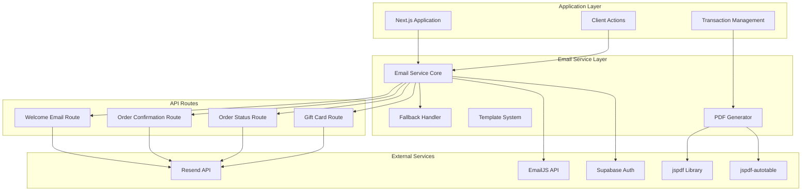
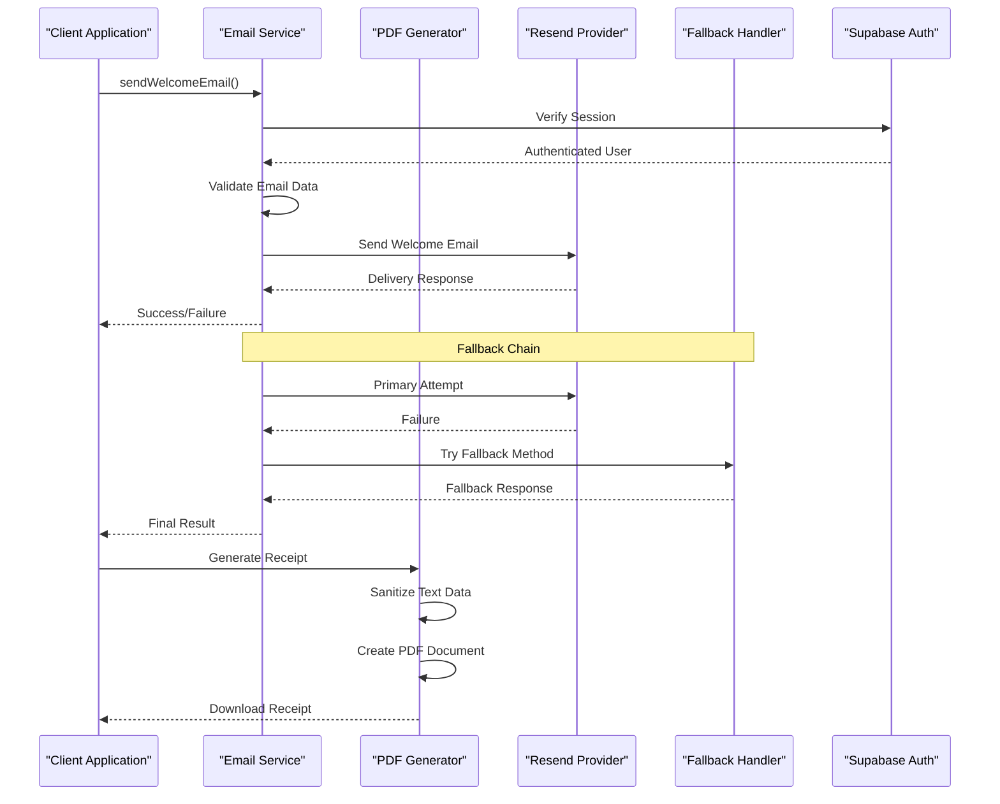
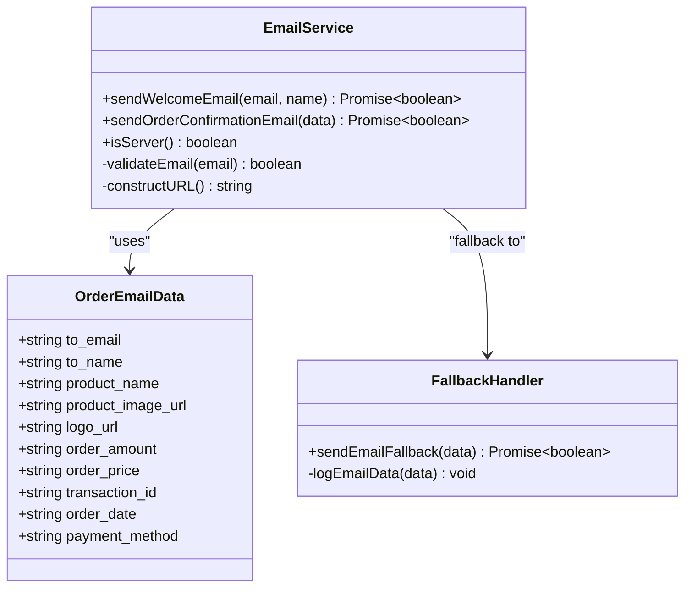
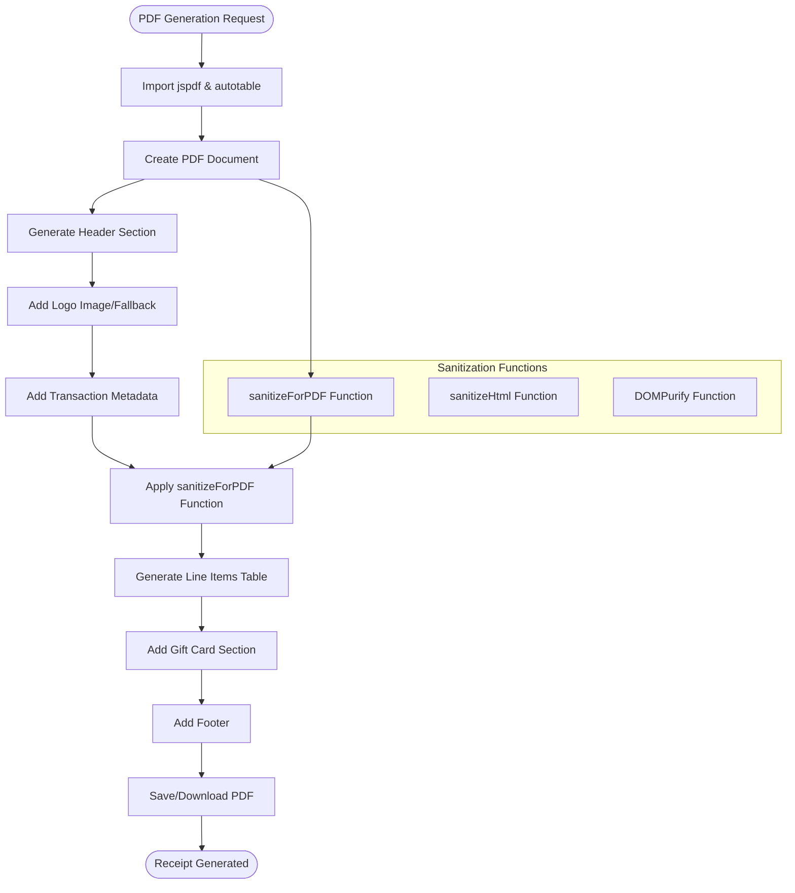
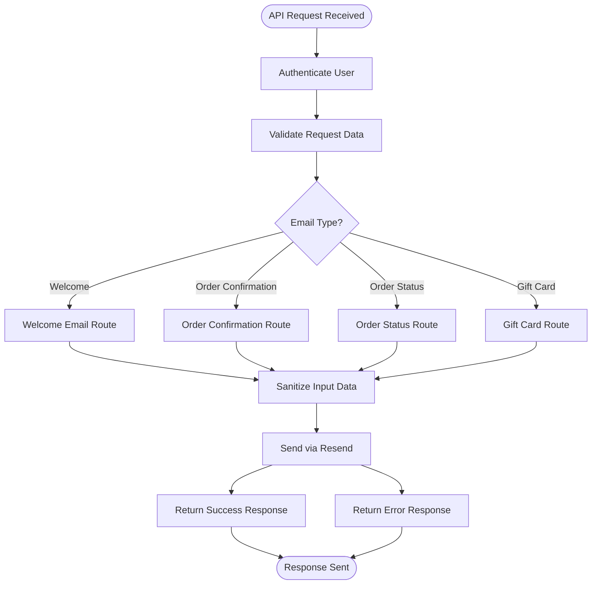
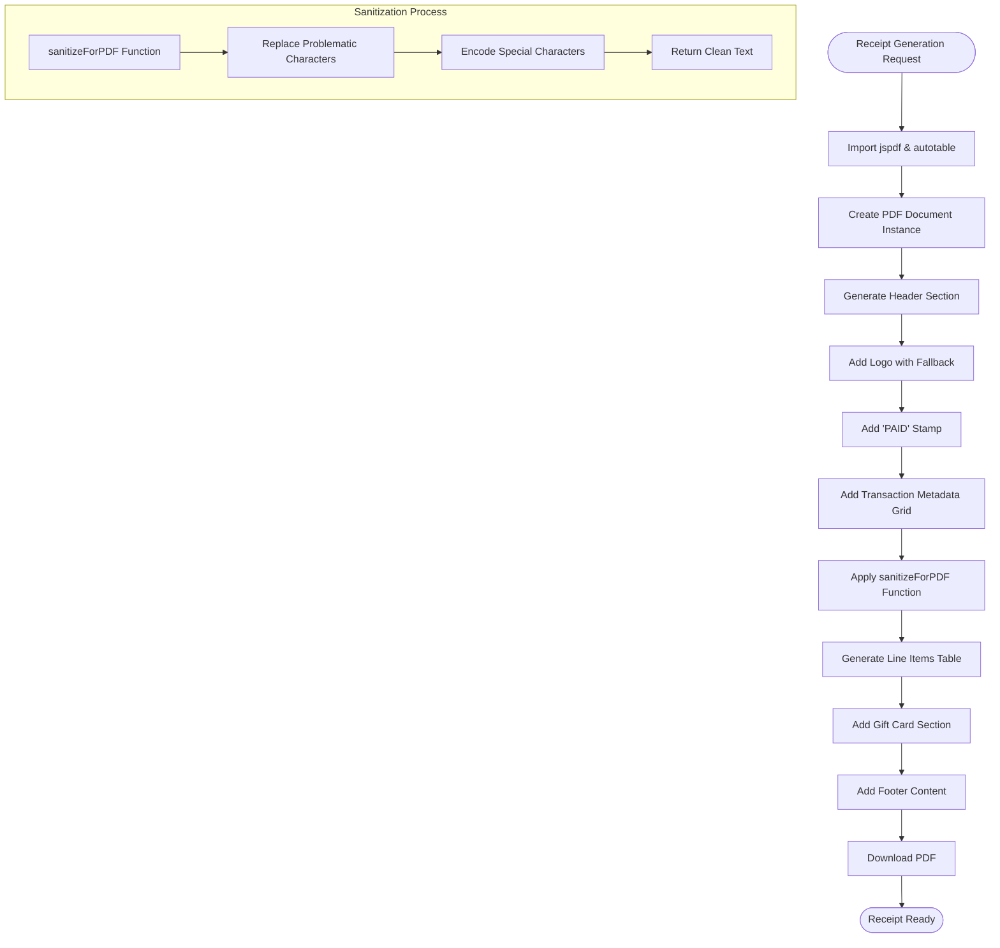
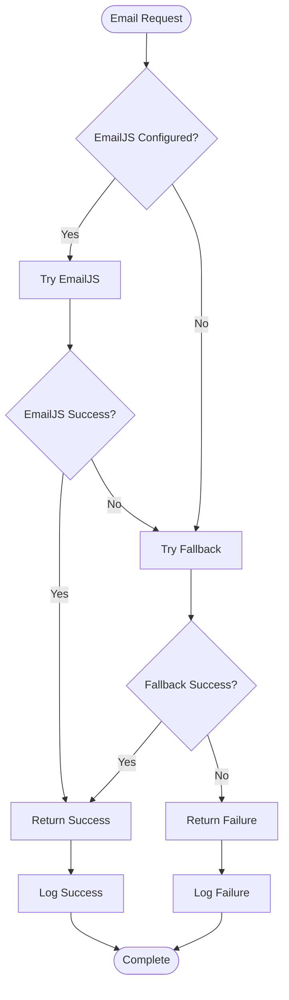
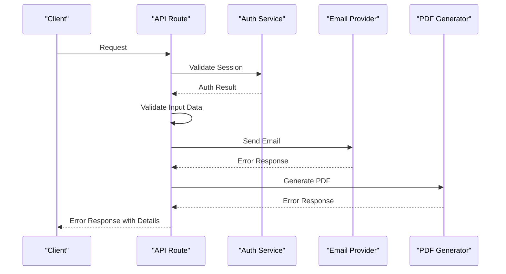
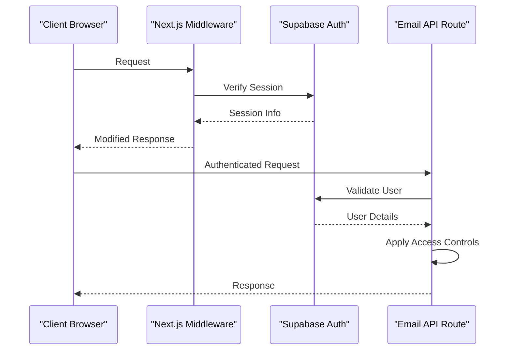

# Email Service System

<cite>
**Referenced Files in This Document**
- [email-service.ts](file://lib/email-service.ts)
- [email-fallback.ts](file://lib/email-fallback.ts)
- [send-welcome/route.ts](file://app/api/send-welcome/route.ts)
- [send-order-placed/route.ts](file://app/api/send-order-placed/route.ts)
- [send-order-status/route.ts](file://app/api/send-order-status/route.ts)
- [send-code/route.ts](file://app/api/send-code/route.ts)
- [transactions/page.tsx](file://app/transactions/page.tsx)
- [server.ts](file://lib/supabase/server.ts)
- [middleware.ts](file://lib/supabase/middleware.ts)
- [middleware.ts](file://middleware.ts)
- [package.json](file://package.json)
- [README.md](file://README.md)
</cite>

## Update Summary
**Changes Made**
- Enhanced email notification templates with improved visual styling and consistent purple color schemes (#6B3FA0)
- Updated failed order email template to use purple gradients instead of red gradients for consistent brand appearance
- Revised template management section to reflect updated color scheme consistency across all notification types
- Added new section on visual design improvements and typography enhancements
- Updated API endpoints section to include enhanced template styling information

## Table of Contents
1. [Introduction](#introduction)
2. [Project Structure](#project-structure)
3. [Core Components](#core-components)
4. [Architecture Overview](#architecture-overview)
5. [Detailed Component Analysis](#detailed-component-analysis)
6. [API Endpoints](#api-endpoints)
7. [Template Management](#template-management)
8. [Visual Design System](#visual-design-system)
9. [PDF Receipt Generation](#pdf-receipt-generation)
10. [Fallback Mechanisms](#fallback-mechanisms)
11. [Error Handling](#error-handling)
12. [Security and Authentication](#security-and-authentication)
13. [Performance Considerations](#performance-considerations)
14. [Implementation Guidelines](#implementation-guidelines)
15. [Troubleshooting Guide](#troubleshooting-guide)
16. [Migration and Compatibility](#migration-and-compatibility)
17. [Conclusion](#conclusion)

## Introduction
This document provides comprehensive API documentation for the email service system that implements a dual-email architecture using EmailJS and Resend. The system supports three primary email workflows: welcome emails for new users, order confirmation emails, and order status update emails. The architecture includes robust fallback mechanisms, template management, and comprehensive error handling strategies.

**Enhanced** The system now features a cohesive visual design system with consistent purple branding (#6B3FA0) across all email templates, providing a professional and recognizable user experience. The enhanced templates include improved typography, visual hierarchy, and responsive design elements optimized for cross-client compatibility. **Updated** The failed order email template has been updated to use purple gradients instead of red gradients for consistent brand appearance across all notification types.

The email service integrates seamlessly with the Next.js application through server-side API routes and provides both client-side and server-side email sending capabilities. The system leverages Supabase for authentication and session management while maintaining flexibility for future email provider integrations.

## Project Structure
The email service system is organized across several key modules within the Next.js application structure:



**Diagram sources**
- [email-service.ts:1-126](file://lib/email-service.ts#L1-L126)
- [send-welcome/route.ts:1-80](file://app/api/send-welcome/route.ts#L1-L80)
- [send-order-placed/route.ts:1-101](file://app/api/send-order-placed/route.ts#L1-L101)
- [transactions/page.tsx:1-200](file://app/transactions/page.tsx#L1-L200)

**Section sources**
- [README.md:1-18](file://README.md#L1-L18)
- [package.json:1-51](file://package.json#L1-L51)

## Core Components
The email service system consists of several interconnected components that work together to provide reliable email delivery:

### Email Service Abstraction
The core email service abstraction provides a unified interface for sending various types of emails while supporting multiple delivery providers. The service handles both client-side and server-side email sending scenarios.

### Fallback Mechanism
A sophisticated fallback mechanism ensures email delivery reliability by automatically switching to alternative providers when primary services fail. The fallback system maintains consistent behavior across different email types.

### Template Management
The system implements a flexible template management system that supports dynamic content generation for different email types. Templates are designed with responsive HTML/CSS for optimal rendering across email clients, featuring a consistent purple color scheme (#6B3FA0) and enhanced visual styling.

### PDF Receipt Generation
**New** The system now includes comprehensive PDF receipt generation capabilities using jspdf and jspdf-autotable libraries. The PDF generation system includes specialized sanitization functions to handle problematic characters and ensure document reliability for print-ready receipts.

### Authentication Integration
Email routes integrate with Supabase authentication to provide secure access control, ensuring that only authorized users can trigger email communications.

**Section sources**
- [email-service.ts:14-126](file://lib/email-service.ts#L14-L126)
- [email-fallback.ts:1-31](file://lib/email-fallback.ts#L1-L31)
- [transactions/page.tsx:153-163](file://app/transactions/page.tsx#L153-L163)

## Architecture Overview
The email service follows a layered architecture pattern with clear separation of concerns:



**Diagram sources**
- [email-service.ts:32-73](file://lib/email-service.ts#L32-L73)
- [send-welcome/route.ts:7-80](file://app/api/send-welcome/route.ts#L7-L80)
- [transactions/page.tsx:46-223](file://app/transactions/page.tsx#L46-L223)

The architecture supports both direct API calls and programmatic email sending through the email service abstraction. The system maintains backward compatibility while providing extensible hooks for additional email providers and document generation capabilities.

## Detailed Component Analysis

### Email Service Core
The email service core provides the primary interface for email operations and implements intelligent provider selection logic.



**Diagram sources**
- [email-service.ts:14-126](file://lib/email-service.ts#L14-L126)
- [email-fallback.ts:3-30](file://lib/email-fallback.ts#L3-L30)

**Section sources**
- [email-service.ts:32-126](file://lib/email-service.ts#L32-L126)

### Fallback Handler Implementation
The fallback handler provides a secondary email delivery mechanism when primary providers fail. It simulates email sending for development environments while maintaining the same interface contract.

**Section sources**
- [email-fallback.ts:3-31](file://lib/email-fallback.ts#L3-L31)

### PDF Receipt Generator
**New** The PDF receipt generator provides comprehensive document creation capabilities with specialized sanitization functions:



**Diagram sources**
- [transactions/page.tsx:46-223](file://app/transactions/page.tsx#L46-L223)
- [send-code/route.ts:7-17](file://app/api/send-code/route.ts#L7-L17)

**Section sources**
- [transactions/page.tsx:153-163](file://app/transactions/page.tsx#L153-L163)

### API Route Architecture
Each email type is implemented as a dedicated Next.js API route with specific authentication and validation requirements:



**Diagram sources**
- [send-welcome/route.ts:7-80](file://app/api/send-welcome/route.ts#L7-L80)
- [send-order-placed/route.ts:8-100](file://app/api/send-order-placed/route.ts#L8-L100)

**Section sources**
- [send-welcome/route.ts:1-80](file://app/api/send-welcome/route.ts#L1-L80)
- [send-order-placed/route.ts:1-101](file://app/api/send-order-placed/route.ts#L1-L101)
- [send-order-status/route.ts:1-192](file://app/api/send-order-status/route.ts#L1-L192)
- [send-code/route.ts:1-153](file://app/api/send-code/route.ts#L1-L153)

## API Endpoints

### Welcome Email Endpoint
The welcome email endpoint sends personalized welcome emails to new users with comprehensive onboarding information and enhanced visual styling.

**Endpoint**: `POST /api/send-welcome`

**Authentication**: No authentication required (public endpoint)

**Request Schema**:
```json
{
  "email": "string",
  "userName": "string"
}
```

**Response Schema**:
```json
{
  "success": "boolean",
  "data": "object"
}
```

**Enhanced Visual Features**:
- Purple gradient header (#6B3FA0) with white branding
- Modern card-based layout with rounded corners and subtle shadows
- Enhanced typography with improved font weights and spacing
- Professional welcome message with feature highlights
- Consistent purple branding throughout the template

**Protocol-Specific Example**:
```javascript
// Client-side usage
await sendWelcomeEmail("user@example.com", "John Doe");

// Direct API call
const response = await fetch('/api/send-welcome', {
  method: 'POST',
  headers: { 'Content-Type': 'application/json' },
  body: JSON.stringify({
    email: "user@example.com",
    userName: "John Doe"
  })
});
```

### Order Confirmation Email Endpoint
The order confirmation endpoint sends detailed order confirmation emails with order specifics and processing status, featuring enhanced purple branding and improved visual hierarchy.

**Endpoint**: `POST /api/send-order-placed`

**Authentication**: Requires authenticated user session

**Request Schema**:
```json
{
  "email": "string",
  "transactionId": "string",
  "userName": "string",
  "productName": "string",
  "denomination": "string"
}
```

**Response Schema**:
```json
{
  "success": "boolean",
  "data": "object"
}
```

**Enhanced Visual Features**:
- Purple-themed header with "Order Placed Successfully" messaging
- Prominent order status display with gradient background
- Enhanced typography for better readability
- Professional purple color scheme (#6B3FA0) throughout
- Improved visual hierarchy with clear status indicators

**Protocol-Specific Example**:
```javascript
const response = await fetch('/api/send-order-placed', {
  method: 'POST',
  headers: { 'Content-Type': 'application/json' },
  body: JSON.stringify({
    email: "customer@example.com",
    transactionId: "TXN001",
    userName: "Jane Smith",
    productName: "Steam Wallet",
    denomination: "$50"
  })
});
```

### Order Status Update Endpoint
The order status endpoint sends status updates for orders, supporting both completion and failure scenarios with enhanced visual design and consistent purple branding.

**Endpoint**: `POST /api/send-order-status`

**Authentication**: Requires admin user session

**Request Schema**:
```json
{
  "email": "string",
  "status": "string",
  "transactionId": "string",
  "userName": "string",
  "productName": "string",
  "denomination": "string",
  "remarks": "string"
}
```

**Response Schema**:
```json
{
  "success": "boolean",
  "data": "object"
}
```

**Enhanced Visual Features**:
- **Completed Orders**: Purple-themed success template with celebratory messaging
- **Failed Orders**: **Updated** Purple-themed failure template with consistent brand appearance
- **Consistent Purple Branding**: Unified color scheme (#6B3FA0) across all templates
- **Enhanced Visual Hierarchy**: Clear status indicators with improved typography
- **Professional Design Elements**: Gradient backgrounds, shadows, and consistent spacing

**Updated** The failed order template now uses purple gradients instead of red gradients for consistent brand appearance across all notification types. The template maintains the same structure but replaces red color accents with purple equivalents:

- **Header Background**: Changed from red to purple gradient (#6B3FA0, #5A3588)
- **Status Display**: Purple gradient background with #6B3FA0 status indicator
- **Border Accents**: Purple borders (#D8CBEB) replacing red borders (#fca5a5)
- **Icon Colors**: Purple icons (#6B3FA0) instead of red (#ef4444)
- **Background Tones**: Purple-toned backgrounds (#F4F0F9) instead of red (#fef2f2)

**Protocol-Specific Example**:
```javascript
const response = await fetch('/api/send-order-status', {
  method: 'POST',
  headers: { 'Content-Type': 'application/json' },
  body: JSON.stringify({
    email: "customer@example.com",
    status: "Completed",
    transactionId: "TXN001",
    userName: "Jane Smith",
    productName: "Steam Wallet",
    denomination: "$50",
    remarks: "Order processed successfully"
  })
});
```

### Gift Card Delivery Endpoint
The gift card endpoint delivers digital gift card codes with secure presentation of sensitive information and enhanced visual styling.

**Endpoint**: `POST /api/send-code`

**Authentication**: Requires authenticated user session with optional admin override

**Request Schema**:
```json
{
  "email": "string",
  "giftcardCode": "string",
  "userName": "string",
  "productName": "string",
  "denomination": "string",
  "subject": "string",
  "isCompletionEmail": "boolean"
}
```

**Response Schema**:
```json
{
  "success": "boolean",
  "data": "object"
}
```

**Enhanced Visual Features**:
- **Standard Gift Card Template**: Purple-themed design with prominent code display
- **Completion Email Template**: Enhanced template for admin-sent gift cards
- **Prominent Code Display**: Large, secure code presentation with visual styling
- **Professional Layout**: Consistent purple branding throughout both templates
- **Enhanced Typography**: Improved readability and visual hierarchy

**Protocol-Specific Example**:
```javascript
const response = await fetch('/api/send-code', {
  method: 'POST',
  headers: { 'Content-Type': 'application/json' },
  body: JSON.stringify({
    email: "customer@example.com",
    giftcardCode: "ABC123XYZ",
    userName: "Jane Smith",
    productName: "Steam Wallet",
    denomination: "$50",
    subject: "Your Steam Wallet Code",
    isCompletionEmail: true
  })
});
```

**Section sources**
- [send-welcome/route.ts:18-80](file://app/api/send-welcome/route.ts#L18-L80)
- [send-order-placed/route.ts:19-101](file://app/api/send-order-placed/route.ts#L19-L101)
- [send-order-status/route.ts:19-192](file://app/api/send-order-status/route.ts#L19-L192)
- [send-code/route.ts:19-153](file://app/api/send-code/route.ts#L19-L153)

## Template Management
The email service implements a comprehensive template management system that supports dynamic content generation and responsive design with enhanced visual styling.

### Template Architecture
Each email type utilizes specialized HTML templates optimized for their specific purpose, featuring a consistent purple color scheme (#6B3FA0) and enhanced visual design:

```mermaid
graph LR
subgraph "Template Types"
WE[Welcome Email Template]
OC[Order Confirmation Template]
OS[Order Status Template]
GC[Gift Card Template]
end
subgraph "Enhanced Design Features"
PURPLE[Purple Color Scheme #6B3FA0]
TYPO[Improved Typography]
VISUAL[Visual Hierarchy]
BRANDING[Consistent Branding]
RESP[Responsive Design]
END
WE --> PURPLE
OC --> PURPLE
OS --> PURPLE
GC --> PURPLE
PURPLE --> TYPO
PURPLE --> VISUAL
PURPLE --> BRANDING
RESP --> VISUAL
RESP --> TYPO
```

**Diagram sources**
- [send-welcome/route.ts:28-65](file://app/api/send-welcome/route.ts#L28-L65)
- [send-order-placed/route.ts:46-85](file://app/api/send-order-placed/route.ts#L46-L85)
- [send-code/route.ts:53-98](file://app/api/send-code/route.ts#L53-L98)
- [send-order-status/route.ts:54-105](file://app/api/send-order-status/route.ts#L54-L105)

### Enhanced Visual Design System
All templates now feature a cohesive design system with consistent visual elements:

**Updated** **Color Scheme Consistency**:
- **Primary Purple**: #6B3FA0 (consistent across all templates)
- **Dark Purple**: #5A3588 (used for headers and accents)
- **Light Purple**: #F4F0F9 (used for backgrounds and cards)
- **Accent Purple**: #D8CBEB (used for borders and subtle elements)
- **Background**: #f3f4f6 (light gray background for page containers)

**Typography Enhancements**:
- Improved font families with system fonts
- Enhanced font weights and sizes
- Better line heights for readability
- Consistent heading hierarchy

**Visual Elements**:
- Rounded corners (12px radius) for modern appearance
- Subtle shadows for depth perception
- Gradient backgrounds for visual interest
- Consistent spacing and alignment

### Content Security
All template content undergoes DOMPurify sanitization to prevent XSS attacks and ensure safe HTML rendering across email clients. The system includes multiple layers of sanitization:

- **DOMPurify**: Comprehensive HTML sanitization for complex content
- **HTML Character Encoding**: Specialized encoding for email-safe characters
- **Custom Sanitization Functions**: Tailored functions for specific use cases

### Responsive Design
Templates are designed with responsive breakpoints and mobile-first principles to ensure optimal viewing experience across different devices and email clients.

**Section sources**
- [send-welcome/route.ts:28-65](file://app/api/send-welcome/route.ts#L28-L65)
- [send-order-placed/route.ts:46-85](file://app/api/send-order-placed/route.ts#L46-L85)
- [send-order-status/route.ts:54-105](file://app/api/send-order-status/route.ts#L54-L105)
- [send-code/route.ts:53-98](file://app/api/send-code/route.ts#L53-L98)

## Visual Design System

### Purple Branding Framework
The email templates now feature a comprehensive purple branding system that creates visual consistency across all communication channels:

```mermaid
graph TB
subgraph "Updated Purple Color Palette"
PRIMARY[#6B3FA0 - Primary Purple]
DARKER[#5A3588 - Darker Purple]
LIGHT[#F4F0F9 - Light Purple]
ACCENT[#D8CBEB - Accent Purple]
END
subgraph "Design Applications"
HEADER[Header Sections]
STATUS[Status Indicators]
BUTTONS[Call-to-Action Buttons]
CODE[Code Display Areas]
FOOTER[Footer Elements]
END
PRIMARY --> HEADER
PRIMARY --> BUTTONS
DARKER --> HEADER
LIGHT --> CODE
ACCENT --> FOOTER
```

**Diagram sources**
- [send-welcome/route.ts:32-35](file://app/api/send-welcome/route.ts#L32-L35)
- [send-order-placed/route.ts:50-53](file://app/api/send-order-placed/route.ts#L50-L53)
- [send-code/route.ts:103-106](file://app/api/send-code/route.ts#L103-L106)
- [send-order-status/route.ts:58-61](file://app/api/send-order-status/route.ts#L58-L61)

### Typography Hierarchy
Enhanced typography improves readability and establishes clear visual hierarchy:

**Headings**:
- H1/H2: 24-28px, bold weight, #4A2A70 (dark purple)
- H3: 18-20px, semi-bold, #6B3FA0 (primary purple)

**Body Text**:
- 15-16px, line height 1.6, #4b5563 (medium gray)
- Strong emphasis: #1E1E1E (dark gray)

**Status Text**:
- Order status: 22-24px, uppercase, #6B3FA0 (primary purple)
- Transaction IDs: 12px, #6b7280 (medium gray)

### Visual Elements and Spacing
Consistent visual elements create a professional appearance:

**Borders and Dividers**:
- Status boxes: 2px dashed #6B3FA0
- Code displays: 1px solid #e2e8f0
- Footer dividers: 1px solid #D8CBEB

**Shadows and Depth**:
- Card shadows: 0 4px 6px rgba(0,0,0,0.05)
- Elevated elements: 0 8px 24px rgba(0,0,0,0.2)
- Button shadows: 0 4px 6px rgba(107, 63, 160, 0.25)

**Spacing Guidelines**:
- Section padding: 40px (outer) / 30px (inner)
- Element margins: 20-35px between major sections
- Code area padding: 30px with 15px internal spacing

### Template Variations
Different email types utilize the design system appropriately:

**Welcome Emails**: Soft purple background (#f3f4f6) with white content cards
**Order Status**: Context-appropriate colors (purple for success, **Updated** purple for failure)
**Gift Cards**: Prominent code display with purple accents
**Order Confirmation**: Professional layout with status indicators

**Section sources**
- [send-welcome/route.ts:28-65](file://app/api/send-welcome/route.ts#L28-L65)
- [send-order-placed/route.ts:46-85](file://app/api/send-order-placed/route.ts#L46-L85)
- [send-order-status/route.ts:54-105](file://app/api/send-order-status/route.ts#L54-L105)
- [send-code/route.ts:53-98](file://app/api/send-code/route.ts#L53-L98)

## PDF Receipt Generation
**New** The system now includes comprehensive PDF receipt generation capabilities with specialized sanitization functions to ensure document reliability and proper character encoding.

### PDF Generation Architecture
The PDF receipt system provides print-ready document generation with the following capabilities:



**Diagram sources**
- [transactions/page.tsx:46-223](file://app/transactions/page.tsx#L46-L223)

### Sanitization Functions
The PDF system includes specialized sanitization functions to handle problematic characters:

#### sanitizeForPDF Function
The primary sanitization function for PDF text content:

```typescript
const sanitizeForPDF = (text: string): string => {
  if (!text) return ""
  // Replace common problematic characters and ensure proper encoding
  return text
    .replace(/&/g, 'and')      // Replace ampersand with 'and'
    .replace(/</g, '<')        // Replace less-than with HTML entity
    .replace(/>/g, '>')        // Replace greater-than with HTML entity
    .replace(/"/g, '"')        // Replace double quotes with HTML entity
    .replace(/'/g, "'")        // Replace single quotes with HTML entity
}
```

#### sanitizeHtml Function
The HTML sanitization function used in email templates:

```typescript
function sanitizeHtml(input: string): string {
  if (!input) return ""
  return input
    .replace(/&/g, '&amp;')    // Replace ampersand with HTML entity
    .replace(/</g, '&lt;')     // Replace less-than with HTML entity
    .replace(/>/g, '&gt;')     // Replace greater-than with HTML entity
    .replace(/"/g, '&quot;')   // Replace double quotes with HTML entity
    .replace(/'/g, '&#x27;')   // Replace single quote with HTML entity
    .replace(/\//g, '&#x2F;')  // Replace forward slash with HTML entity
}
```

### Document Reliability Features
The PDF generation system includes several features to ensure document reliability:

- **Character Encoding**: Proper encoding of special characters for PDF compatibility
- **Fallback Handling**: Graceful handling of missing or corrupted data
- **Error Recovery**: Comprehensive error handling and user feedback
- **Dynamic Imports**: Lazy loading of PDF generation libraries to optimize performance

### PDF Structure Components
The generated PDF documents include the following structured components:

1. **Header Section**: Company branding and "PAID" stamp
2. **Metadata Grid**: Transaction details and customer information
3. **Line Items Table**: Product and pricing information
4. **Gift Card Section**: Conditional display of gift card codes
5. **Footer**: Legal information and company details

**Section sources**
- [transactions/page.tsx:153-163](file://app/transactions/page.tsx#L153-L163)
- [send-code/route.ts:7-17](file://app/api/send-code/route.ts#L7-L17)
- [send-order-placed/route.ts:7-17](file://app/api/send-order-placed/route.ts#L7-L17)
- [send-order-status/route.ts:7-17](file://app/api/send-order-status/route.ts#L7-L17)

## Fallback Mechanisms
The email service implements a robust fallback system to ensure reliable email delivery even when primary providers fail.

### Dual-Provider Architecture
The system supports both EmailJS and Resend providers with automatic failover logic:



**Diagram sources**
- [email-service.ts:77-125](file://lib/email-service.ts#L77-L125)

### Fallback Implementation
The fallback mechanism provides a secondary email delivery channel with consistent behavior and logging.

**Section sources**
- [email-service.ts:77-125](file://lib/email-service.ts#L77-L125)
- [email-fallback.ts:3-31](file://lib/email-fallback.ts#L3-L31)

## Error Handling
The email service implements comprehensive error handling strategies across all components:

### Error Categories
- **Validation Errors**: Invalid email addresses, missing required fields
- **Authentication Errors**: Unauthorized access attempts, invalid sessions
- **Provider Errors**: Network failures, API rate limits, service unavailability
- **Template Errors**: Content sanitization failures, rendering issues
- **PDF Generation Errors**: Document creation failures, library loading issues

### Error Response Patterns
All API endpoints follow consistent error response patterns:



**Diagram sources**
- [send-order-placed/route.ts:13-15](file://app/api/send-order-placed/route.ts#L13-L15)
- [send-order-status/route.ts:13-21](file://app/api/send-order-status/route.ts#L13-L21)
- [transactions/page.tsx:219-222](file://app/transactions/page.tsx#L219-L222)

### Logging Strategy
The system implements structured logging for all error conditions, providing detailed context for debugging and monitoring purposes.

**Section sources**
- [send-welcome/route.ts:76-80](file://app/api/send-welcome/route.ts#L76-L80)
- [send-order-placed/route.ts:97-101](file://app/api/send-order-placed/route.ts#L97-L101)
- [send-order-status/route.ts:188-192](file://app/api/send-order-status/route.ts#L188-L192)
- [send-code/route.ts:149-153](file://app/api/send-code/route.ts#L149-L153)
- [transactions/page.tsx:219-222](file://app/transactions/page.tsx#L219-L222)

## Security and Authentication
The email service integrates with Supabase authentication to provide secure access control for email operations.

### Authentication Flow


**Diagram sources**
- [middleware.ts:4-6](file://middleware.ts#L4-L6)
- [send-order-placed/route.ts:10-15](file://app/api/send-order-placed/route.ts#L10-L15)

### Access Control Policies
- **Public Endpoints**: Welcome emails require no authentication
- **User-Scoped Endpoints**: Order emails require authenticated user sessions
- **Admin-Only Endpoints**: Order status updates require admin privileges
- **Cross-User Protection**: Additional validation prevents unauthorized email sending
- **PDF Generation Security**: Receipt generation requires authenticated user sessions

**Section sources**
- [middleware.ts:1-11](file://middleware.ts#L1-L11)
- [send-order-placed/route.ts:10-31](file://app/api/send-order-placed/route.ts#L10-L31)
- [send-order-status/route.ts:17-21](file://app/api/send-order-status/route.ts#L17-L21)
- [send-code/route.ts:10-35](file://app/api/send-code/route.ts#L10-L35)
- [transactions/page.tsx:22-27](file://app/transactions/page.tsx#L22-L27)

## Performance Considerations
The email service is designed with performance optimization in mind:

### Asynchronous Processing
All email operations are handled asynchronously to prevent blocking the main application thread. The system uses efficient promise-based architectures for optimal performance.

### Caching Strategies
While email content is generated dynamically, the system minimizes unnecessary computations through efficient template rendering and data sanitization processes.

### Resource Management
The service properly manages external API connections and implements appropriate timeout configurations to prevent resource leaks.

### PDF Generation Optimization
**Enhanced** The PDF generation system includes performance optimizations:
- **Lazy Loading**: jspdf and autotable libraries are loaded only when needed
- **Error Recovery**: Graceful degradation if PDF generation fails
- **Memory Management**: Proper cleanup of generated documents

## Implementation Guidelines

### Adding New Email Templates
To add new email templates to the system:

1. **Create API Route**: Implement a new Next.js API route in the `app/api/` directory
2. **Define Request Schema**: Establish clear request/response schemas for the new endpoint
3. **Implement Authentication**: Add appropriate authentication and authorization checks
4. **Create Template**: Develop HTML template with responsive design principles and purple branding
5. **Add Validation**: Implement comprehensive input validation and sanitization
6. **Test Integration**: Verify integration with the email service abstraction

### Integrating Additional Email Providers
To integrate additional email providers:

1. **Create Provider Interface**: Define a consistent interface for email providers
2. **Implement Provider Logic**: Add provider-specific implementation in the email service
3. **Configure Environment Variables**: Set up required configuration parameters
4. **Test Fallback Chain**: Verify proper fallback behavior across providers
5. **Monitor Performance**: Track delivery metrics and provider-specific limitations

### PDF Receipt Generation Guidelines
**New** For implementing PDF receipt generation:

1. **Install Dependencies**: Add jspdf and jspdf-autotable to project dependencies
2. **Create Sanitization Functions**: Implement sanitizeForPDF for character encoding
3. **Design PDF Layout**: Create structured PDF components with proper styling
4. **Handle Dynamic Content**: Support conditional sections like gift cards
5. **Implement Error Handling**: Provide fallbacks for PDF generation failures
6. **Optimize Performance**: Use lazy loading for PDF libraries

### Best Practices
- Always sanitize user-provided content before email generation
- Implement comprehensive error handling and logging
- Use responsive HTML templates with consistent purple branding
- Maintain consistent authentication patterns across all endpoints
- Monitor provider-specific rate limits and adjust accordingly
- **Enhanced** Use specialized sanitization functions for different output formats (HTML vs PDF)
- **Enhanced** Follow the purple color scheme (#6B3FA0) and typography guidelines for all new templates
- **Updated** Ensure consistent color scheme across all template variations, including failed order notifications

**Section sources**
- [email-service.ts:14-25](file://lib/email-service.ts#L14-L25)
- [email-service.ts:77-80](file://lib/email-service.ts#L77-L80)
- [transactions/page.tsx:46-223](file://app/transactions/page.tsx#L46-L223)

## Troubleshooting Guide

### Common Issues and Solutions

#### Email Delivery Failures
- **Symptoms**: Emails not reaching recipients despite successful API responses
- **Causes**: Spam filters, DNS configuration, provider throttling
- **Solutions**: Check email logs, verify DNS records, implement retry logic

#### Authentication Problems
- **Symptoms**: 401/403 errors when sending authenticated emails
- **Causes**: Expired sessions, invalid user permissions
- **Solutions**: Refresh authentication tokens, verify user roles

#### Template Rendering Issues
- **Symptoms**: Poorly formatted emails across different clients
- **Causes**: CSS compatibility issues, unsupported HTML features
- **Solutions**: Test across email clients, use inline styles, validate HTML

#### PDF Generation Issues
**New** - **Symptoms**: PDF receipts not generating or displaying incorrectly
- **Causes**: Missing jspdf libraries, character encoding problems, browser compatibility
- **Solutions**: Verify library imports, check sanitization functions, test across browsers

#### Visual Design Issues
**Updated** - **Symptoms**: Templates not displaying purple branding consistently
- **Causes**: CSS conflicts, email client limitations, missing fallbacks
- **Solutions**: Validate CSS inlining, test across email clients, implement fallback colors

### Debugging Tools
The system provides comprehensive logging capabilities for debugging email delivery issues:

- **Console Logging**: Structured logs for all email operations
- **Error Tracking**: Detailed error messages with stack traces
- **Provider Metrics**: Delivery status and timing information
- **Template Validation**: Input sanitization logs and warnings
- **PDF Generation Logs**: Document creation progress and error details

**Section sources**
- [email-service.ts:61-72](file://lib/email-service.ts#L61-L72)
- [send-welcome/route.ts:76-80](file://app/api/send-welcome/route.ts#L76-L80)
- [transactions/page.tsx:219-222](file://app/transactions/page.tsx#L219-L222)

## Migration and Compatibility

### Provider Migration Guide
When migrating between email providers:

1. **Backup Current Configuration**: Document all current provider settings and credentials
2. **Update Environment Variables**: Configure new provider credentials and settings
3. **Test Fallback Chain**: Verify fallback behavior during migration
4. **Monitor Delivery Metrics**: Track delivery success rates and performance
5. **Gradual Cutover**: Implement staged migration to minimize disruption

### Backward Compatibility
The email service maintains backward compatibility through:

- **Consistent API Contracts**: Stable request/response schemas across all endpoints
- **Fallback Mechanisms**: Automatic provider switching without application changes
- **Versioned Templates**: Template versioning to support gradual updates
- **Deprecation Policies**: Clear migration paths for deprecated features
- **Enhanced** **Visual Design Compatibility**: Maintains consistent purple branding across all templates

### Versioning Strategy
Email templates follow semantic versioning principles:

- **Major Versions**: Breaking changes requiring template redesign
- **Minor Versions**: Feature additions and improvements
- **Patch Versions**: Bug fixes and minor adjustments

**Section sources**
- [email-service.ts:77-80](file://lib/email-service.ts#L77-L80)
- [email-service.ts:114-124](file://lib/email-service.ts#L114-L124)

## Conclusion
The email service system provides a robust, scalable solution for email delivery in the Byiora platform. The dual-provider architecture with comprehensive fallback mechanisms ensures reliable email delivery, while the modular design facilitates easy maintenance and future enhancements. The system's integration with Supabase authentication provides strong security guarantees, and the comprehensive error handling and logging capabilities enable effective troubleshooting and monitoring.

**Enhanced** The recent implementation of a comprehensive visual design system featuring consistent purple branding (#6B3FA0) across all email templates demonstrates the system's commitment to professional presentation and brand consistency. The enhanced templates include improved typography, visual hierarchy, and responsive design elements that provide an optimal user experience across all email clients.

**Updated** The recent update to the failed order email template ensures consistent brand appearance across all notification types by replacing red gradients with purple gradients (#6B3FA0). This change maintains visual consistency while preserving the template's functionality and user experience.

The system now offers both traditional email communication and enhanced visual experiences through consistent purple theming, while maintaining the reliability and security standards established by the core email service infrastructure. The addition of PDF generation capabilities further expands the system's utility for providing print-ready documentation alongside digital communications.

The implementation demonstrates best practices in email service architecture, including responsive template design, content security, and performance optimization. The clear separation of concerns and well-defined interfaces make the system maintainable and extensible for future requirements. The comprehensive visual design system positions the platform to deliver professional, consistent communication experiences across all customer touchpoints.