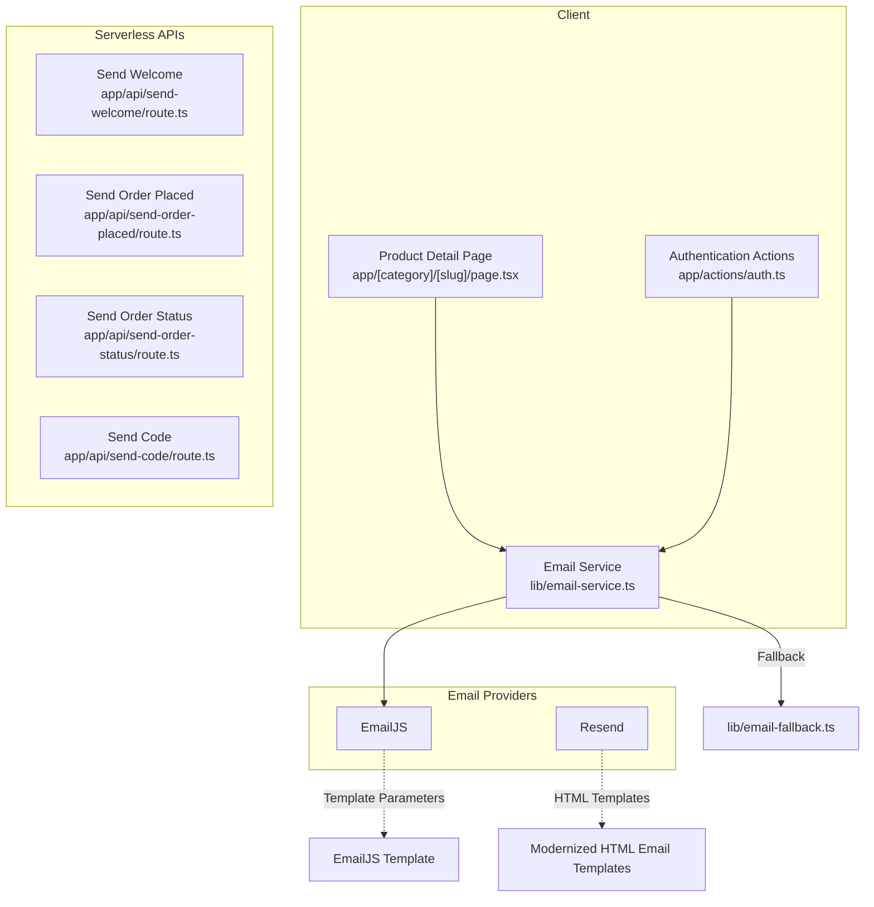
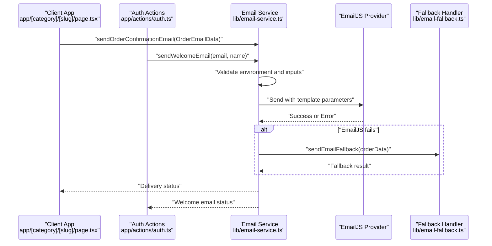
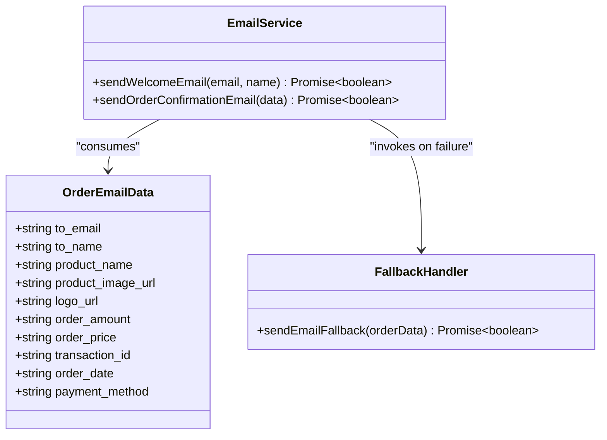
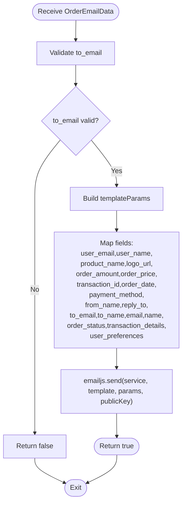
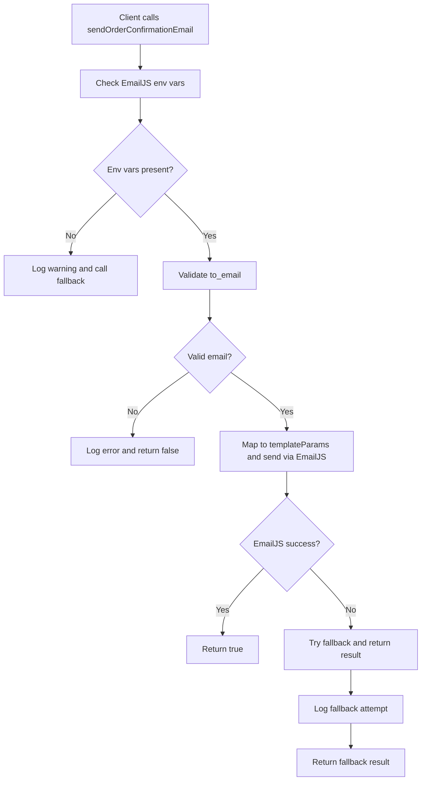
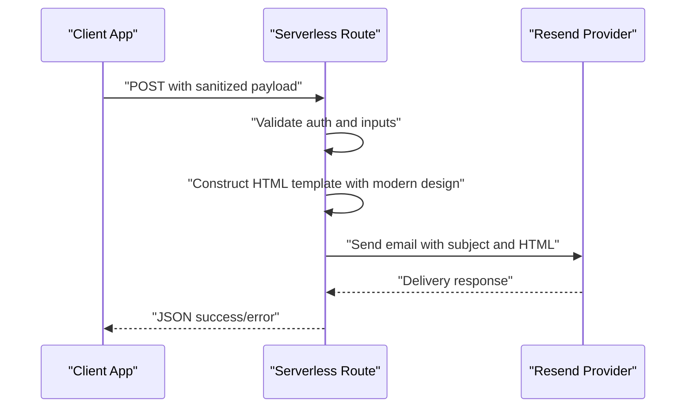
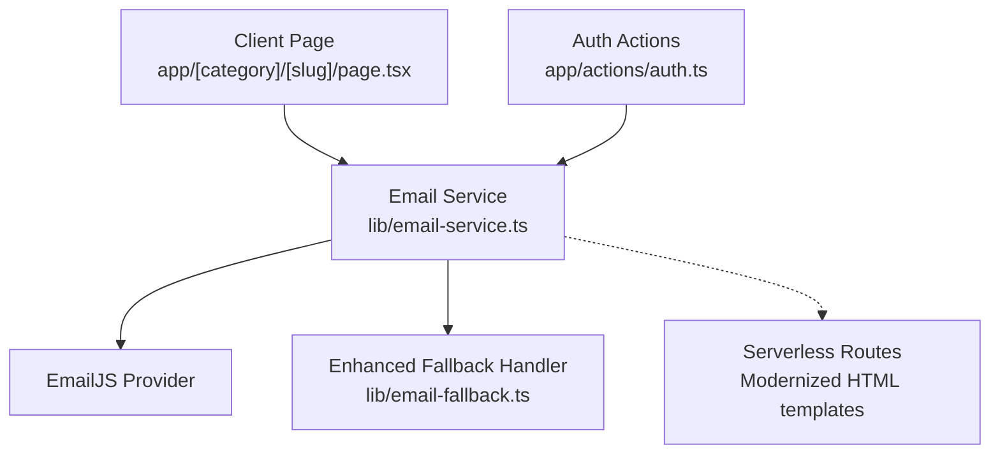
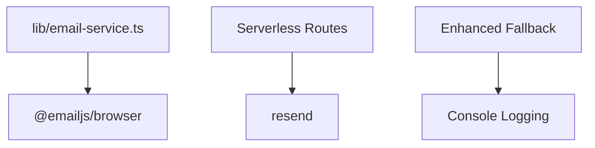

# Email Templates Management

<cite>
**Referenced Files in This Document**
- [email-service.ts](file://lib/email-service.ts)
- [email-fallback.ts](file://lib/email-fallback.ts)
- [send-welcome route.ts](file://app/api/send-welcome/route.ts)
- [send-order-placed route.ts](file://app/api/send-order-placed/route.ts)
- [send-order-status route.ts](file://app/api/send-order-status/route.ts)
- [send-code route.ts](file://app/api/send-code/route.ts)
- [package.json](file://package.json)
- [auth.ts](file://app/actions/auth.ts)
- [category slug page.tsx](file://app/[category]/[slug]/page.tsx)
</cite>

## Update Summary
**Changes Made**
- Updated Order Completed template documentation to reflect the new green success theme with gradient backgrounds
- Enhanced Order Placed template documentation with modernized branding and typography improvements
- Added comprehensive coverage of the enhanced fallback email handling system
- Updated template parameter mapping documentation to include new parameter names
- Expanded template customization guidelines with new design patterns

## Table of Contents
1. [Introduction](#introduction)
2. [Project Structure](#project-structure)
3. [Core Components](#core-components)
4. [Architecture Overview](#architecture-overview)
5. [Detailed Component Analysis](#detailed-component-analysis)
6. [Dependency Analysis](#dependency-analysis)
7. [Performance Considerations](#performance-considerations)
8. [Troubleshooting Guide](#troubleshooting-guide)
9. [Conclusion](#conclusion)
10. [Appendices](#appendices)

## Introduction
This document explains the email template management system with a focus on EmailJS template integration and fallback email handling. The system has been recently overhauled with professional 'Order Completed' templates featuring green success themes with gradient backgrounds, proper spacing, and clear presentation of giftcard PIN codes. Additionally, the order placed email template has been modernized with updated branding and improved typography. The documentation covers template parameter structure, common parameter names, customization options, data mapping from the OrderEmailData interface to EmailJS template parameters, validation and error handling, and guidelines for creating/updating templates while maintaining consistency. It also addresses template versioning, A/B testing approaches, performance optimization, and the relationship between email templates and the overall email delivery workflow.

## Project Structure
The email system spans client-side utilities, serverless API routes, and third-party email providers:
- Client-side email orchestration and fallback logic live in a dedicated library module.
- Serverless API routes handle welcome, order confirmation, order status, and gift card code delivery.
- Third-party providers include EmailJS for transactional templating and Resend for HTML-based templates.

**Diagram sources**
- [email-service.ts:1-126](file://lib/email-service.ts#L1-L126)
- [email-fallback.ts:1-31](file://lib/email-fallback.ts#L1-L31)
- [send-welcome route.ts:1-80](file://app/api/send-welcome/route.ts#L1-L80)
- [send-order-placed route.ts:1-102](file://app/api/send-order-placed/route.ts#L1-L102)
- [send-order-status route.ts:1-199](file://app/api/send-order-status/route.ts#L1-L199)
- [send-code route.ts:1-167](file://app/api/send-code/route.ts#L1-L167)

**Section sources**
- [package.json:11-38](file://package.json#L11-L38)

## Core Components
- Email Service: Provides unified functions to send welcome emails and order confirmation emails, with EmailJS integration and a fallback mechanism.
- Fallback Email Handler: A sophisticated fallback implementation that handles email delivery when primary providers fail.
- Serverless Routes: Handle HTML-based email templates for welcome, order placed, order status, and gift card code delivery via Resend.
- Dependencies: EmailJS browser SDK and Resend SDK are used for provider-specific integrations.

Key responsibilities:
- Validate inputs and construct provider-specific payloads.
- Map domain data to provider parameter names.
- Provide graceful degradation via fallback when primary provider is unavailable.
- Support both EmailJS and Resend-based email delivery systems.

**Section sources**
- [email-service.ts:14-25](file://lib/email-service.ts#L14-L25)
- [email-service.ts:32-73](file://lib/email-service.ts#L32-L73)
- [email-service.ts:75-125](file://lib/email-service.ts#L75-L125)
- [email-fallback.ts:3-30](file://lib/email-fallback.ts#L3-L30)
- [send-welcome route.ts:18-79](file://app/api/send-welcome/route.ts#L18-L79)
- [send-order-placed route.ts:19-100](file://app/api/send-order-placed/route.ts#L19-L100)
- [send-order-status route.ts:19-198](file://app/api/send-order-status/route.ts#L19-L198)
- [send-code route.ts:19-166](file://app/api/send-code/route.ts#L19-L166)

## Architecture Overview
The email delivery workflow integrates client-side orchestration with provider-specific templates and serverless routes. The system now features enhanced fallback mechanisms and modernized HTML templates.

**Diagram sources**
- [email-service.ts:75-125](file://lib/email-service.ts#L75-L125)
- [email-fallback.ts:3-30](file://lib/email-fallback.ts#L3-L30)
- [category slug page.tsx:18](file://app/[category]/[slug]/page.tsx#L18)
- [auth.ts:49-54](file://app/actions/auth.ts#L49-L54)

## Detailed Component Analysis

### Enhanced Email Service and Fallback System
The Email Service has been enhanced with improved fallback mechanisms and comprehensive error handling:

- Environment checks for EmailJS credentials with detailed logging.
- Validation of recipient email addresses with comprehensive error reporting.
- Mapping of OrderEmailData to EmailJS template parameters with enhanced parameter names.
- Sophisticated fallback to secondary delivery mechanisms when EmailJS is unavailable.
- Support for both client-side and server-side email operations.

**Diagram sources**
- [email-service.ts:14-25](file://lib/email-service.ts#L14-L25)
- [email-service.ts:75-125](file://lib/email-service.ts#L75-L125)
- [email-fallback.ts:3-30](file://lib/email-fallback.ts#L3-L30)

**Section sources**
- [email-service.ts:14-25](file://lib/email-service.ts#L14-L25)
- [email-service.ts:75-125](file://lib/email-service.ts#L75-L125)
- [email-fallback.ts:3-30](file://lib/email-fallback.ts#L3-L30)

### Enhanced Template Parameter Mapping from OrderEmailData
The Email Service constructs EmailJS template parameters using enhanced common keys derived from OrderEmailData. The mapping ensures compatibility with typical EmailJS template variable names and includes additional parameters for improved template flexibility.

Common parameter names used across templates:
- Recipient identity: user_email, user_name, to_email, to_name, email, name
- Product and branding: product_name, product_image_url, logo_url
- Order metadata: order_amount, order_price, transaction_id, order_date, payment_method
- Sender identity: from_name, reply_to
- Additional parameters: order_status, transaction_details, user_preferences

**Diagram sources**
- [email-service.ts:88-106](file://lib/email-service.ts#L88-L106)
- [email-service.ts:110](file://lib/email-service.ts#L110)

**Section sources**
- [email-service.ts:88-106](file://lib/email-service.ts#L88-L106)

### Enhanced Template Data Validation and Error Handling
Validation and error handling occur at multiple levels with comprehensive error reporting:

- Client-side Email Service: Validates environment variables and recipient email format; logs detailed errors and attempts fallback.
- Serverless Routes: Validate request bodies, enforce authorization, sanitize inputs, and return structured error responses.
- Enhanced fallback system: Provides detailed logging and graceful degradation when primary email delivery fails.

**Diagram sources**
- [email-service.ts:75-125](file://lib/email-service.ts#L75-L125)

**Section sources**
- [email-service.ts:75-125](file://lib/email-service.ts#L75-L125)

### Modernized Serverless HTML Email Templates (Resend)
The application includes several serverless routes that render modernized HTML email templates via Resend. These templates feature:

- Professional green success theme with gradient backgrounds for 'Order Completed' notifications.
- Enhanced typography and spacing for improved readability.
- Clear presentation of giftcard PIN codes with prominent display areas.
- Consistent branding and visual hierarchy across all email types.
- Responsive design with mobile-optimized layouts.

#### Order Completed Template Features:
- Green gradient header with success indicators
- Prominent gift card PIN display with monospace font for security
- Clear status indicators with visual feedback
- Professional footer with support contact information

#### Order Placed Template Enhancements:
- Modernized branding with updated color schemes
- Improved typography hierarchy for better readability
- Enhanced spacing and visual organization
- Professional layout with consistent margins and padding

**Diagram sources**
- [send-welcome route.ts:18-79](file://app/api/send-welcome/route.ts#L18-L79)
- [send-order-placed route.ts:19-100](file://app/api/send-order-placed/route.ts#L19-L100)
- [send-order-status route.ts:19-198](file://app/api/send-order-status/route.ts#L19-L198)
- [send-code route.ts:19-166](file://app/api/send-code/route.ts#L19-L166)

**Section sources**
- [send-welcome route.ts:18-79](file://app/api/send-welcome/route.ts#L18-L79)
- [send-order-placed route.ts:19-100](file://app/api/send-order-placed/route.ts#L19-L100)
- [send-order-status route.ts:19-198](file://app/api/send-order-status/route.ts#L19-L198)
- [send-code route.ts:19-166](file://app/api/send-code/route.ts#L19-L166)

### Relationship Between Templates and Email Delivery Workflow
The enhanced email system integrates multiple delivery channels with professional template designs:

- Email Service: Centralizes EmailJS integration and sophisticated fallback behavior. It transforms domain data into provider-specific parameters and coordinates delivery.
- Serverless Routes: Encapsulate modernized HTML templates for welcome, order placed, order status, and gift card code delivery. They enforce authorization, sanitize inputs, and return structured responses.
- Client Usage: The product detail page imports and invokes the Email Service to send order confirmation emails after purchase completion.
- Authentication Flow: Server-side authentication actions trigger welcome emails with enhanced error handling.

**Diagram sources**
- [category slug page.tsx:18](file://app/[category]/[slug]/page.tsx#L18)
- [auth.ts:49-54](file://app/actions/auth.ts#L49-L54)
- [email-service.ts:75-125](file://lib/email-service.ts#L75-L125)
- [email-fallback.ts:3-30](file://lib/email-fallback.ts#L3-L30)
- [send-order-placed route.ts:19-100](file://app/api/send-order-placed/route.ts#L19-L100)

**Section sources**
- [category slug page.tsx:18](file://app/[category]/[slug]/page.tsx#L18)
- [auth.ts:49-54](file://app/actions/auth.ts#L49-L54)
- [email-service.ts:75-125](file://lib/email-service.ts#L75-L125)

## Dependency Analysis
External dependencies used for email delivery:
- EmailJS Browser SDK for EmailJS integration.
- Resend SDK for HTML-based email templates.
- Enhanced fallback system for graceful degradation.

**Diagram sources**
- [email-service.ts:1](file://lib/email-service.ts#L1)
- [package.json:12](file://package.json#L12)
- [package.json:35](file://package.json#L35)

**Section sources**
- [package.json:11-38](file://package.json#L11-L38)

## Performance Considerations
- Minimize network calls: Batch related operations and avoid redundant provider calls.
- Optimize template rendering: Keep HTML templates concise and cache static assets (images/logos) where possible.
- Enhanced asynchronous fallback: Ensure fallback does not block the main thread; the current fallback simulates work with a 1-second delay for realistic timing.
- Environment checks: Validate provider credentials early to fail fast and reduce unnecessary retries.
- Client-server symmetry: Use server-side headers to construct absolute URLs for API calls in SSR contexts.
- Template caching: Consider implementing template caching for frequently used email templates.
- Error logging: Comprehensive error logging helps identify performance bottlenecks and delivery issues.

## Troubleshooting Guide
Common issues and resolutions:
- EmailJS not configured: Verify environment variables for EmailJS service ID, template ID, and public key. The service logs detailed warnings and triggers fallback when missing.
- Invalid email address: The service validates the recipient email format before attempting delivery with comprehensive error reporting.
- Provider failures: The service attempts fallback automatically upon EmailJS errors with detailed logging.
- Serverless route errors: Routes return structured JSON errors with appropriate HTTP status codes for unauthorized, forbidden, or internal server errors.
- Template rendering issues: Modernized HTML templates include error handling for missing images and fallback text.
- Enhanced fallback failures: Detailed logging helps identify issues with fallback email delivery mechanisms.

**Section sources**
- [email-service.ts:77-80](file://lib/email-service.ts#L77-L80)
- [email-service.ts:82-86](file://lib/email-service.ts#L82-L86)
- [email-service.ts:114-124](file://lib/email-service.ts#L114-L124)
- [send-order-placed route.ts:24-42](file://app/api/send-order-placed/route.ts#L24-L42)
- [send-order-status route.ts:24-32](file://app/api/send-order-status/route.ts#L24-L32)

## Conclusion
The email system has been significantly enhanced with professional template designs and improved functionality. The overhauled 'Order Completed' template features a green success theme with gradient backgrounds, proper spacing, and clear presentation of giftcard PIN codes. The order placed email template has been modernized with updated branding and improved typography. The system now includes sophisticated fallback mechanisms, comprehensive error handling, and enhanced template parameter mapping. Following the guidelines below will help maintain template consistency, enable safe updates, and optimize performance across the enhanced email delivery workflow.

## Appendices

### Enhanced Template Parameter Reference
Common EmailJS template parameter names mapped from OrderEmailData:
- Recipient: user_email, user_name, to_email, to_name, email, name
- Product: product_name, product_image_url, logo_url
- Order: order_amount, order_price, transaction_id, order_date, payment_method
- Sender: from_name, reply_to
- Additional: order_status, transaction_details, user_preferences

**Section sources**
- [email-service.ts:88-106](file://lib/email-service.ts#L88-L106)

### Creating and Updating Email Templates
Enhanced guidelines for template development:
- Define a canonical parameter list aligned with OrderEmailData to ensure consistency across templates.
- Use semantic names for parameters (e.g., product_name, order_amount) to simplify mapping.
- Maintain backward compatibility when renaming parameters; support both old and new names during transition.
- Version templates by appending suffixes or prefixes to template IDs and update environment variables accordingly.
- Test mapping logic against a representative set of OrderEmailData instances to validate parameter coverage.
- Implement responsive design principles for mobile-optimized email experiences.
- Use consistent color schemes and typography across all template variations.
- Include proper accessibility considerations for screen readers and visual impairments.

### Enhanced Template Versioning and A/B Testing
Advanced strategies for template management:
- Versioning: Use distinct template IDs per version and manage them via environment variables. Rotate traffic gradually to the new template.
- A/B Testing: Randomly route subsets of users to different template IDs and measure engagement metrics (open rates, click-through rates, conversion rates).
- Performance Monitoring: Track delivery times, bounce rates, and user interaction metrics for each template variation.
- Rollout Strategy: Start with a small percentage, monitor outcomes, and scale up if successful.
- Analytics Integration: Implement tracking pixels and UTM parameters to measure template effectiveness.

### Best Practices for Enhanced Template Customization
Professional guidelines for template development:
- Keep HTML templates modular and reusable across different email types.
- Sanitize dynamic content to prevent XSS; the serverless routes include comprehensive sanitization functions.
- Use consistent fonts, colors, and spacing to reinforce brand identity.
- Provide clear CTAs and support contact information for each template type.
- Implement progressive enhancement for older email clients.
- Test templates across multiple email clients and devices.
- Optimize images and assets for fast loading times.
- Include unsubscribe links and privacy policy information where required.

**Section sources**
- [send-welcome route.ts:7-16](file://app/api/send-welcome/route.ts#L7-L16)
- [send-order-placed route.ts:7-17](file://app/api/send-order-placed/route.ts#L7-L17)
- [send-order-status route.ts:7-17](file://app/api/send-order-status/route.ts#L7-L17)
- [send-code route.ts:7-17](file://app/api/send-code/route.ts#L7-L17)