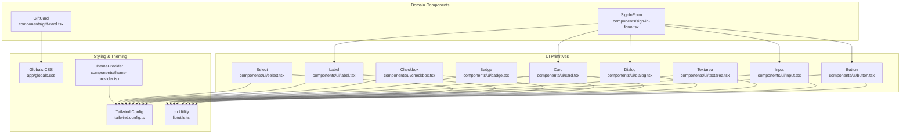
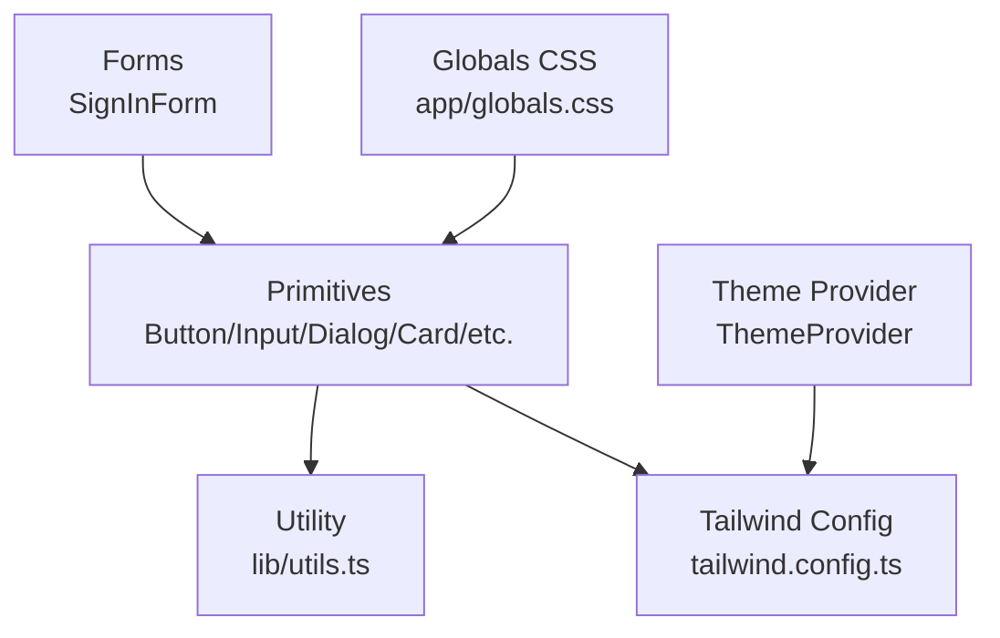
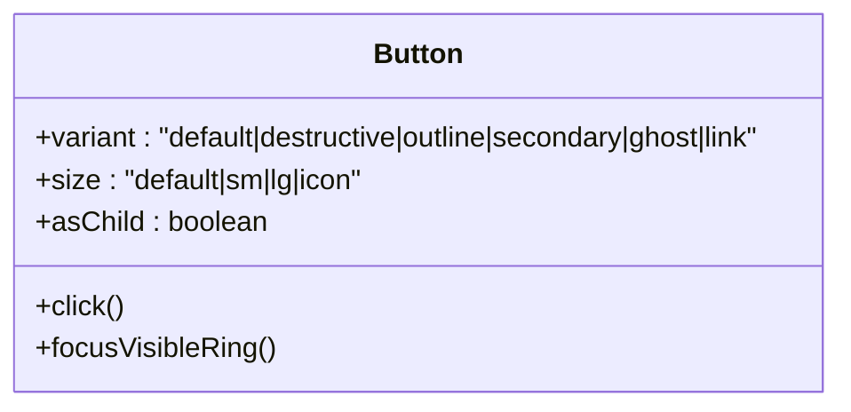
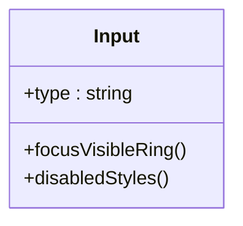
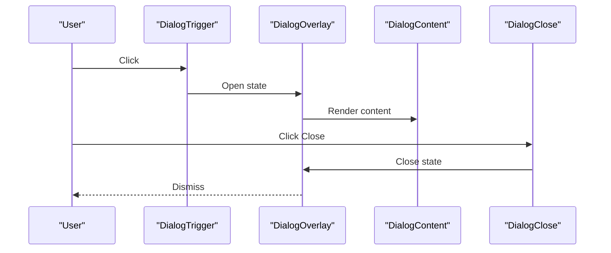
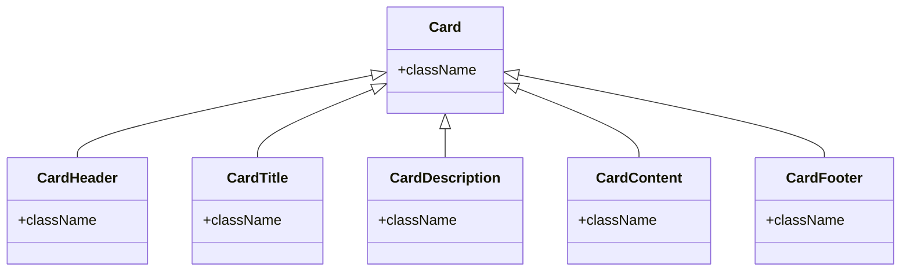
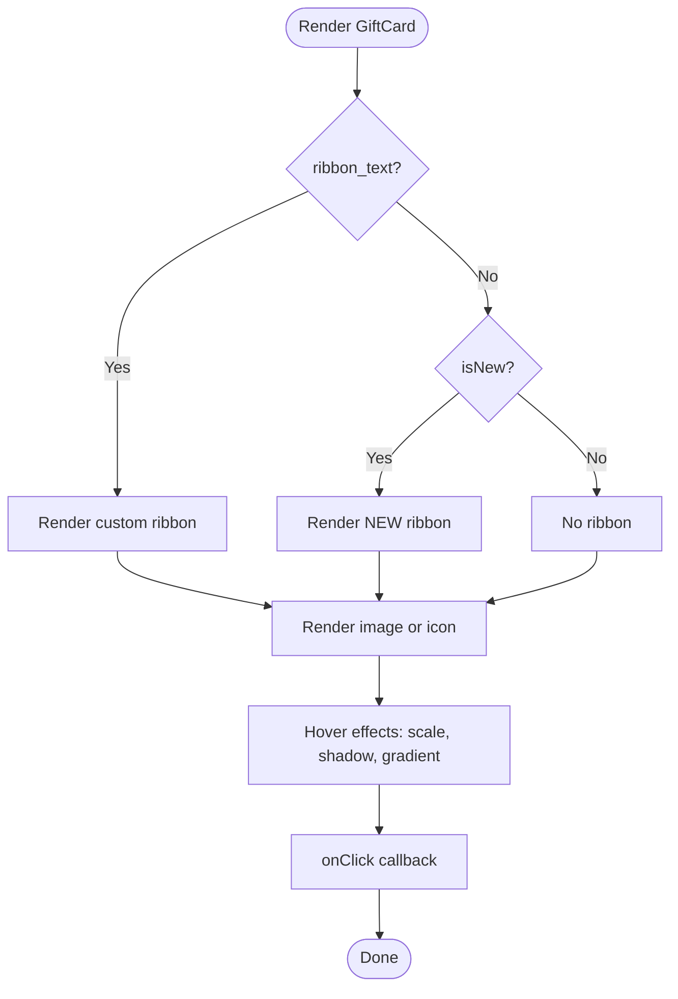
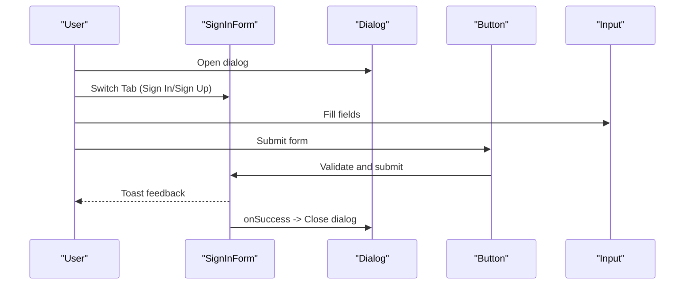
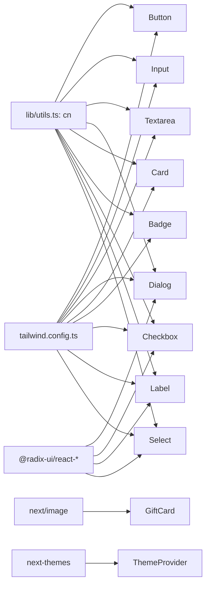

# Frontend Components

<cite>
**Referenced Files in This Document**
- [button.tsx](file://components/ui/button.tsx)
- [input.tsx](file://components/ui/input.tsx)
- [dialog.tsx](file://components/ui/dialog.tsx)
- [card.tsx](file://components/ui/card.tsx)
- [badge.tsx](file://components/ui/badge.tsx)
- [checkbox.tsx](file://components/ui/checkbox.tsx)
- [label.tsx](file://components/ui/label.tsx)
- [select.tsx](file://components/ui/select.tsx)
- [textarea.tsx](file://components/ui/textarea.tsx)
- [gift-card.tsx](file://components/gift-card.tsx)
- [sign-in-form.tsx](file://components/sign-in-form.tsx)
- [theme-provider.tsx](file://components/theme-provider.tsx)
- [tailwind.config.ts](file://tailwind.config.ts)
- [app/globals.css](file://app/globals.css)
- [lib/utils.ts](file://lib/utils.ts)
</cite>

## Table of Contents
1. [Introduction](#introduction)
2. [Project Structure](#project-structure)
3. [Core Components](#core-components)
4. [Architecture Overview](#architecture-overview)
5. [Detailed Component Analysis](#detailed-component-analysis)
6. [Dependency Analysis](#dependency-analysis)
7. [Performance Considerations](#performance-considerations)
8. [Troubleshooting Guide](#troubleshooting-guide)
9. [Conclusion](#conclusion)
10. [Appendices](#appendices)

## Introduction
This document describes the frontend component system built with Radix UI primitives and Tailwind CSS. It focuses on reusable UI components such as Button, Input, Dialog, Card, and specialized form components, along with the gift card component. The guide covers visual appearance, behavior, user interaction patterns, props/attributes, customization options, responsive design, accessibility, animations/transitions, theming, and integration patterns. It also provides usage guidance and troubleshooting tips grounded in the repository’s implementation.

## Project Structure
The component system is organized under components/ui for shared primitives and components/gift-card.tsx for a domain-specific card. Theming and styling are centralized in tailwind.config.ts and app/globals.css, with a shared cn utility for merging Tailwind classes.

**Diagram sources**
- [button.tsx:1-57](file://components/ui/button.tsx#L1-L57)
- [input.tsx:1-26](file://components/ui/input.tsx#L1-L26)
- [dialog.tsx:1-123](file://components/ui/dialog.tsx#L1-L123)
- [card.tsx:1-87](file://components/ui/card.tsx#L1-L87)
- [badge.tsx:1-37](file://components/ui/badge.tsx#L1-L37)
- [checkbox.tsx:1-31](file://components/ui/checkbox.tsx#L1-L31)
- [label.tsx:1-27](file://components/ui/label.tsx#L1-L27)
- [select.tsx:1-161](file://components/ui/select.tsx#L1-L161)
- [textarea.tsx:1-25](file://components/ui/textarea.tsx#L1-L25)
- [gift-card.tsx:1-68](file://components/gift-card.tsx#L1-L68)
- [sign-in-form.tsx:1-208](file://components/sign-in-form.tsx#L1-L208)
- [theme-provider.tsx:1-12](file://components/theme-provider.tsx#L1-L12)
- [tailwind.config.ts:1-113](file://tailwind.config.ts#L1-L113)
- [app/globals.css:1-118](file://app/globals.css#L1-L118)
- [lib/utils.ts:1-7](file://lib/utils.ts#L1-L7)

**Section sources**
- [button.tsx:1-57](file://components/ui/button.tsx#L1-L57)
- [input.tsx:1-26](file://components/ui/input.tsx#L1-L26)
- [dialog.tsx:1-123](file://components/ui/dialog.tsx#L1-L123)
- [card.tsx:1-87](file://components/ui/card.tsx#L1-L87)
- [gift-card.tsx:1-68](file://components/gift-card.tsx#L1-L68)
- [sign-in-form.tsx:1-208](file://components/sign-in-form.tsx#L1-L208)
- [tailwind.config.ts:1-113](file://tailwind.config.ts#L1-L113)
- [app/globals.css:1-118](file://app/globals.css#L1-L118)
- [lib/utils.ts:1-7](file://lib/utils.ts#L1-L7)

## Core Components
This section documents the primary UI primitives and their capabilities.

- Button
  - Purpose: Action trigger with variants and sizes.
  - Variants: default, destructive, outline, secondary, ghost, link.
  - Sizes: default, sm, lg, icon.
  - Props: Inherits button attributes; adds variant, size, asChild.
  - Accessibility: Focus-visible ring and keyboard operable.
  - Customization: Use variant/size classes; override className; integrate with Slot for composition.
  - Example usage: See [button.tsx:36-56](file://components/ui/button.tsx#L36-L56).

- Input
  - Purpose: Single-line text field with focus ring and disabled states.
  - Props: Inherits input attributes; className merged via cn.
  - Accessibility: Focus-visible ring and disabled pointer-events.
  - Customization: Tailwind classes for colors, borders, and focus states.
  - Example usage: See [input.tsx:5-25](file://components/ui/input.tsx#L5-L25).

- Textarea
  - Purpose: Multi-line text area with focus ring and disabled states.
  - Props: Inherits textarea attributes; className merged via cn.
  - Accessibility: Focus-visible ring and disabled pointer-events.
  - Customization: Tailwind classes for colors, borders, and focus states.
  - Example usage: See [textarea.tsx:5-24](file://components/ui/textarea.tsx#L5-L24).

- Dialog
  - Purpose: Modal overlay with animated content and close controls.
  - Parts: Root, Trigger, Portal, Overlay, Content, Header, Footer, Title, Description, Close.
  - Animations: Fade, zoom, slide transitions driven by data-state attributes.
  - Accessibility: Overlay handles focus trapping and Escape key; Close button has screen-reader label.
  - Customization: Override className on Overlay/Content; compose with Header/Footer/Title/Description.
  - Example usage: See [dialog.tsx:9-122](file://components/ui/dialog.tsx#L9-L122).

- Card
  - Purpose: Container with header, title, description, content, and footer.
  - Props: Standard HTML div attributes; className merged via cn.
  - Accessibility: No special ARIA roles; relies on semantic headings and paragraphs.
  - Customization: Use CardHeader/CardTitle/CardDescription/CardContent/CardFooter to structure content.
  - Example usage: See [card.tsx:5-86](file://components/ui/card.tsx#L5-L86).

- Badge
  - Purpose: Label-like indicator with variants.
  - Variants: default, secondary, destructive, outline.
  - Props: Inherits div attributes; variant prop via class variance authority.
  - Accessibility: Stateless; ensure sufficient color contrast.
  - Customization: Use variant to change background/text colors.
  - Example usage: See [badge.tsx:26-36](file://components/ui/badge.tsx#L26-L36).

- Checkbox
  - Purpose: Binary selection with indicator.
  - Props: Inherits Radix checkbox attributes; className merged via cn.
  - Accessibility: Uses Radix UI semantics; supports keyboard and screen reader.
  - Customization: Indicator icon and checked state styling via data-[state=checked].
  - Example usage: See [checkbox.tsx:9-28](file://components/ui/checkbox.tsx#L9-L28).

- Label
  - Purpose: Associates text with form controls.
  - Props: Inherits Radix label attributes; variant via class variance authority.
  - Accessibility: Peer-disabled cursor and opacity states align with control enabled/disabled.
  - Customization: Variant classes for typography and color.
  - Example usage: See [label.tsx:13-24](file://components/ui/label.tsx#L13-L24).

- Select
  - Purpose: Dropdown selection with scrolling, popper positioning, and item indicators.
  - Parts: Root, Group, Value, Trigger, Content, Viewport, Item, Label, Separator, Scroll buttons.
  - Accessibility: Keyboard navigation, ARIA attributes, and focus management.
  - Animations: Fade and directional slide transitions; popper offset adjustments.
  - Customization: Trigger/content classes; viewport sizing via CSS variables.
  - Example usage: See [select.tsx:9-160](file://components/ui/select.tsx#L9-L160).

- GiftCard
  - Purpose: Interactive tile representing a gift card offering.
  - Props: id, name, logo, category, slug, isNew, ribbon_text, onClick; denominations present but unused in component.
  - Behavior: Hover scaling, shadow enhancement, gradient overlay; conditional ribbon rendering.
  - Accessibility: Click handler; ensure onClick is provided for keyboard users (consider adding tabindex and Enter activation).
  - Customization: Tailwind classes for hover effects, image sizing, and text styling.
  - Example usage: See [gift-card.tsx:5-67](file://components/gift-card.tsx#L5-L67).

**Section sources**
- [button.tsx:1-57](file://components/ui/button.tsx#L1-L57)
- [input.tsx:1-26](file://components/ui/input.tsx#L1-L26)
- [textarea.tsx:1-25](file://components/ui/textarea.tsx#L1-L25)
- [dialog.tsx:1-123](file://components/ui/dialog.tsx#L1-L123)
- [card.tsx:1-87](file://components/ui/card.tsx#L1-L87)
- [badge.tsx:1-37](file://components/ui/badge.tsx#L1-L37)
- [checkbox.tsx:1-31](file://components/ui/checkbox.tsx#L1-L31)
- [label.tsx:1-27](file://components/ui/label.tsx#L1-L27)
- [select.tsx:1-161](file://components/ui/select.tsx#L1-L161)
- [gift-card.tsx:1-68](file://components/gift-card.tsx#L1-L68)

## Architecture Overview
The component system follows a layered approach:
- Base primitives (Button, Input, Dialog, Card) encapsulate Radix UI and Tailwind styling.
- Form components (SignInForm) compose primitives to build complex interactions.
- Theming is centralized via Tailwind variables and next-themes.
- Utilities (cn) merge classes deterministically.

**Diagram sources**
- [sign-in-form.tsx:1-208](file://components/sign-in-form.tsx#L1-L208)
- [button.tsx:1-57](file://components/ui/button.tsx#L1-L57)
- [input.tsx:1-26](file://components/ui/input.tsx#L1-L26)
- [dialog.tsx:1-123](file://components/ui/dialog.tsx#L1-L123)
- [card.tsx:1-87](file://components/ui/card.tsx#L1-L87)
- [theme-provider.tsx:1-12](file://components/theme-provider.tsx#L1-L12)
- [tailwind.config.ts:1-113](file://tailwind.config.ts#L1-L113)
- [app/globals.css:1-118](file://app/globals.css#L1-L118)
- [lib/utils.ts:1-7](file://lib/utils.ts#L1-L7)

## Detailed Component Analysis

### Button
- Implementation highlights
  - Uses class variance authority for variants and sizes.
  - Supports asChild to render a Slot for composition.
  - Focus-visible ring and disabled state handled via Tailwind utilities.
- Props
  - variant: default | destructive | outline | secondary | ghost | link
  - size: default | sm | lg | icon
  - asChild: boolean
  - Inherits button HTML attributes.
- Events
  - Standard click and keyboard activation supported.
- Accessibility
  - Focus ring via focus-visible utilities; disabled pointer-events.
- Customization
  - Combine variant/size with className; use Slot for nesting.
- Usage example
  - See [button.tsx:36-56](file://components/ui/button.tsx#L36-L56).

**Diagram sources**
- [button.tsx:36-56](file://components/ui/button.tsx#L36-L56)

**Section sources**
- [button.tsx:1-57](file://components/ui/button.tsx#L1-L57)

### Input
- Implementation highlights
  - Merges className via cn; applies focus-visible ring and disabled styles.
- Props
  - type: string
  - Inherits input HTML attributes.
- Accessibility
  - Focus-visible ring and disabled pointer-events.
- Customization
  - Tailwind classes for colors, borders, and focus states.
- Usage example
  - See [input.tsx:5-25](file://components/ui/input.tsx#L5-L25).

**Diagram sources**
- [input.tsx:5-25](file://components/ui/input.tsx#L5-L25)

**Section sources**
- [input.tsx:1-26](file://components/ui/input.tsx#L1-L26)

### Dialog
- Implementation highlights
  - Composed from @radix-ui/react-dialog primitives.
  - Animated overlay and content using data-state attributes.
  - Close button includes sr-only label for accessibility.
- Props
  - Overlay: className forwarded.
  - Content: className forwarded; children rendered inside portal.
  - Header/Footer: flex layout helpers.
  - Title/Description: typography classes.
- Accessibility
  - Overlay manages focus trapping; Close button has accessible label.
- Customization
  - Animate-in/out classes; adjust max-width and positioning.
- Usage example
  - See [dialog.tsx:9-122](file://components/ui/dialog.tsx#L9-L122).

**Diagram sources**
- [dialog.tsx:9-122](file://components/ui/dialog.tsx#L9-L122)

**Section sources**
- [dialog.tsx:1-123](file://components/ui/dialog.tsx#L1-L123)

### Card
- Implementation highlights
  - Semantic sections: Header, Title, Description, Content, Footer.
  - Merges className via cn.
- Props
  - Inherits div attributes for all parts.
- Accessibility
  - Uses headings and paragraphs; ensure proper hierarchy.
- Customization
  - Compose parts to structure content; apply spacing and typography via className.
- Usage example
  - See [card.tsx:5-86](file://components/ui/card.tsx#L5-L86).

**Diagram sources**
- [card.tsx:5-86](file://components/ui/card.tsx#L5-L86)

**Section sources**
- [card.tsx:1-87](file://components/ui/card.tsx#L1-L87)

### GiftCard
- Implementation highlights
  - Conditional ribbon rendering (priority over isNew).
  - Dynamic image or icon rendering; hover scaling and gradient overlay.
  - onClick callback for user interaction.
- Props
  - id, name, logo, category, slug, isNew, ribbon_text, onClick.
  - denominations array exists but not used in component.
- Accessibility
  - onClick requires external tabIndex/keyboard handling for full keyboard support.
- Customization
  - Tailwind classes for hover effects, scaling, shadows, and text colors.
- Usage example
  - See [gift-card.tsx:5-67](file://components/gift-card.tsx#L5-L67).

**Diagram sources**
- [gift-card.tsx:17-67](file://components/gift-card.tsx#L17-L67)

**Section sources**
- [gift-card.tsx:1-68](file://components/gift-card.tsx#L1-L68)

### SignInForm Composition Pattern
- Implementation highlights
  - Composes DialogHeader/Title/Description, Tabs, Label, Input, Button.
  - Uses form submission handlers with loading states and toast feedback.
  - Integrates with authentication hooks and theme-aware colors.
- Props
  - onSuccess: optional callback invoked on successful sign-in/sign-up.
- Accessibility
  - Labels associated with inputs; focus-visible rings on interactive elements.
- Customization
  - Adjust tab styling, input focus colors, and button branding via className.
- Usage example
  - See [sign-in-form.tsx:18-207](file://components/sign-in-form.tsx#L18-L207).

**Diagram sources**
- [sign-in-form.tsx:18-207](file://components/sign-in-form.tsx#L18-L207)

**Section sources**
- [sign-in-form.tsx:1-208](file://components/sign-in-form.tsx#L1-L208)

## Dependency Analysis
- Internal dependencies
  - All primitives depend on cn utility for class merging.
  - Dialog, Select, and Checkbox depend on Radix UI primitives.
  - GiftCard depends on Next.js Image for optimized media rendering.
- Theming and styling
  - Tailwind variables define brand and semantic colors; globals.css applies base styles and component-level utilities.
  - next-themes provides theme switching; ThemeProvider wraps the app tree.
- External libraries
  - class-variance-authority for variant/sizing systems.
  - lucide-react icons for UI affordances.
  - next-themes for theme provider.

**Diagram sources**
- [lib/utils.ts:1-7](file://lib/utils.ts#L1-L7)
- [button.tsx:1-57](file://components/ui/button.tsx#L1-L57)
- [input.tsx:1-26](file://components/ui/input.tsx#L1-L26)
- [textarea.tsx:1-25](file://components/ui/textarea.tsx#L1-L25)
- [dialog.tsx:1-123](file://components/ui/dialog.tsx#L1-L123)
- [card.tsx:1-87](file://components/ui/card.tsx#L1-L87)
- [badge.tsx:1-37](file://components/ui/badge.tsx#L1-L37)
- [checkbox.tsx:1-31](file://components/ui/checkbox.tsx#L1-L31)
- [label.tsx:1-27](file://components/ui/label.tsx#L1-L27)
- [select.tsx:1-161](file://components/ui/select.tsx#L1-L161)
- [gift-card.tsx:1-68](file://components/gift-card.tsx#L1-L68)
- [theme-provider.tsx:1-12](file://components/theme-provider.tsx#L1-L12)
- [tailwind.config.ts:1-113](file://tailwind.config.ts#L1-L113)

**Section sources**
- [lib/utils.ts:1-7](file://lib/utils.ts#L1-L7)
- [tailwind.config.ts:1-113](file://tailwind.config.ts#L1-L113)
- [app/globals.css:1-118](file://app/globals.css#L1-L118)
- [theme-provider.tsx:1-12](file://components/theme-provider.tsx#L1-L12)

## Performance Considerations
- Class merging
  - Use cn to avoid conflicting Tailwind classes and reduce reflows.
- Animations
  - Prefer CSS transitions and simple keyframes; avoid heavy JS-driven animations.
- Images
  - Use Next.js Image with appropriate sizes and priority for hero or prominent assets.
- Rendering
  - Keep component trees shallow; memoize heavy computations outside components.
- Bundle size
  - Import only necessary Radix UI primitives; avoid unused features.

## Troubleshooting Guide
- Dialog does not close on Escape
  - Ensure Dialog is mounted and Overlay is visible; verify focus trapping is not blocked by external overlays.
- Focus ring not visible
  - Confirm focus-visible utilities are applied; check for overridden focus styles.
- Checkbox or Label not aligned
  - Verify peer/peer-disabled classes and proper association between Label and control.
- GiftCard hover effect not smooth
  - Check for parent transforms; ensure GPU-accelerated properties are used (e.g., transform, opacity).
- Theming inconsistencies
  - Verify Tailwind variables are defined in :root and next-themes is wrapping the app.

**Section sources**
- [dialog.tsx:17-54](file://components/ui/dialog.tsx#L17-L54)
- [button.tsx:7-34](file://components/ui/button.tsx#L7-L34)
- [checkbox.tsx:13-27](file://components/ui/checkbox.tsx#L13-L27)
- [label.tsx:13-24](file://components/ui/label.tsx#L13-L24)
- [gift-card.tsx:20-28](file://components/gift-card.tsx#L20-L28)
- [tailwind.config.ts:6-32](file://tailwind.config.ts#L6-L32)
- [theme-provider.tsx:9-11](file://components/theme-provider.tsx#L9-L11)

## Conclusion
The component system leverages Radix UI for robust accessibility and Tailwind CSS for consistent styling and theming. Primitives like Button, Input, Dialog, and Card provide a solid foundation, while domain components such as GiftCard and SignInForm demonstrate composition patterns. The system emphasizes accessibility, responsive design, and maintainable customization through variants, slots, and theme variables.

## Appendices

### Responsive Design Guidelines
- Use Tailwind responsive prefixes (sm:, md:, lg:) to adapt spacing, typography, and layout.
- Ensure focus-visible rings remain visible on small screens.
- Test hover effects on touch devices; consider pointer-coarse media queries for alternative interactions.

### Accessibility Compliance Checklist
- All interactive elements have visible focus rings and keyboard operability.
- Buttons and links convey purpose; avoid decorative buttons.
- Dialogs manage focus trapping and include Close with accessible label.
- Forms associate labels with inputs; indicate required fields and errors.

### Style Customization and Theming
- Centralized theme variables in Tailwind config and CSS variables in :root.
- Use brand tokens (e.g., brand-sky-blue) and semantic tokens (primary, secondary) consistently.
- Extend animations and keyframes sparingly; reuse existing ones (e.g., float, shimmer).

**Section sources**
- [tailwind.config.ts:11-112](file://tailwind.config.ts#L11-L112)
- [app/globals.css:5-44](file://app/globals.css#L5-L44)
- [theme-provider.tsx:9-11](file://components/theme-provider.tsx#L9-L11)