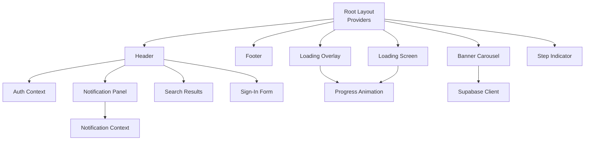
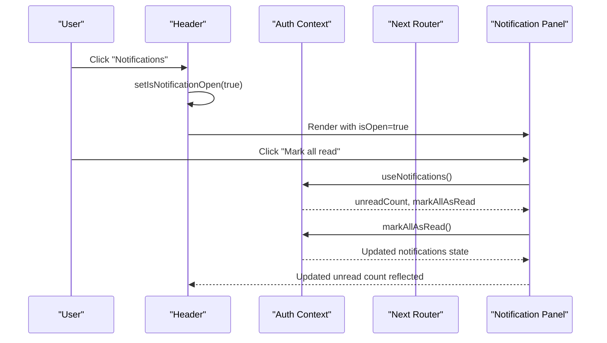
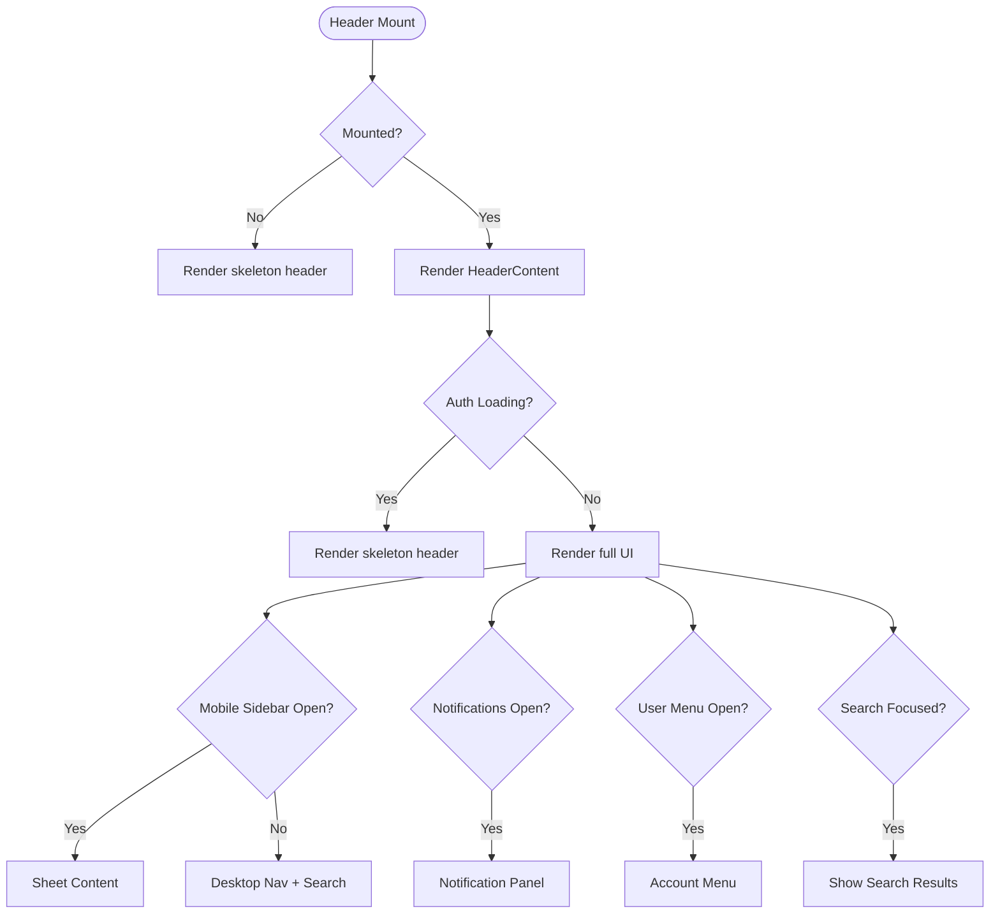
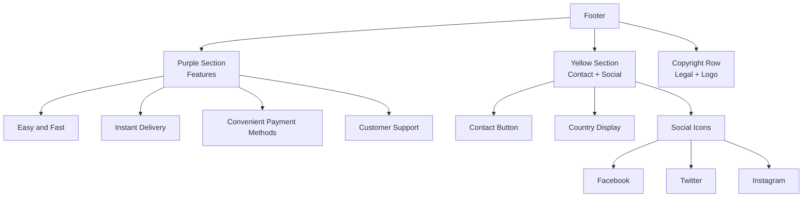
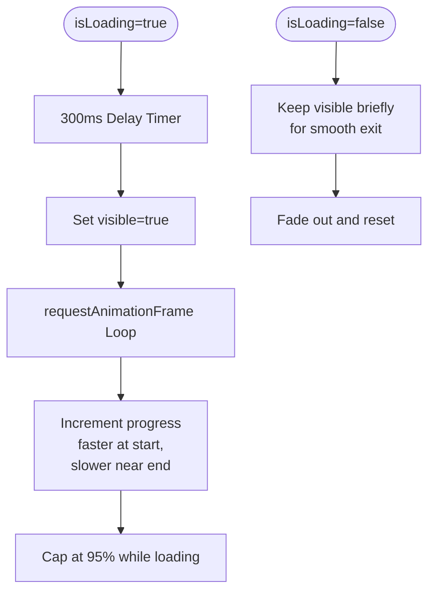
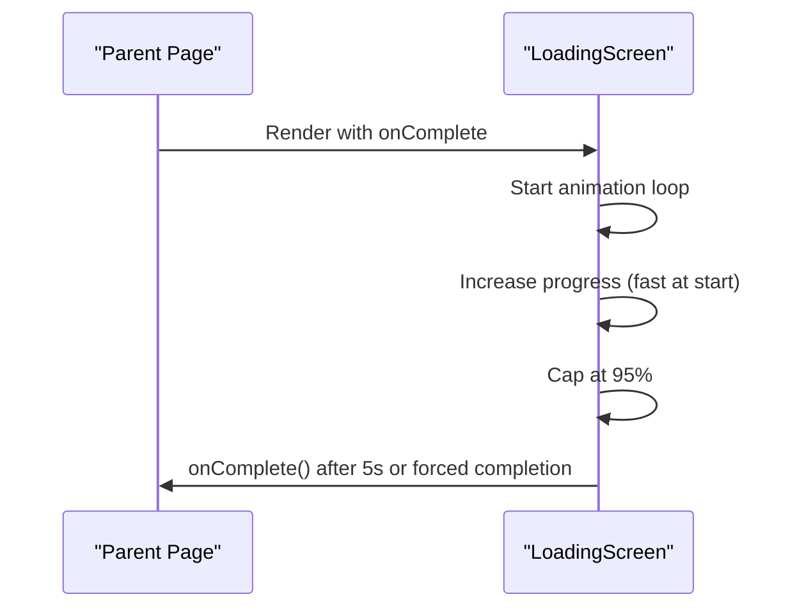
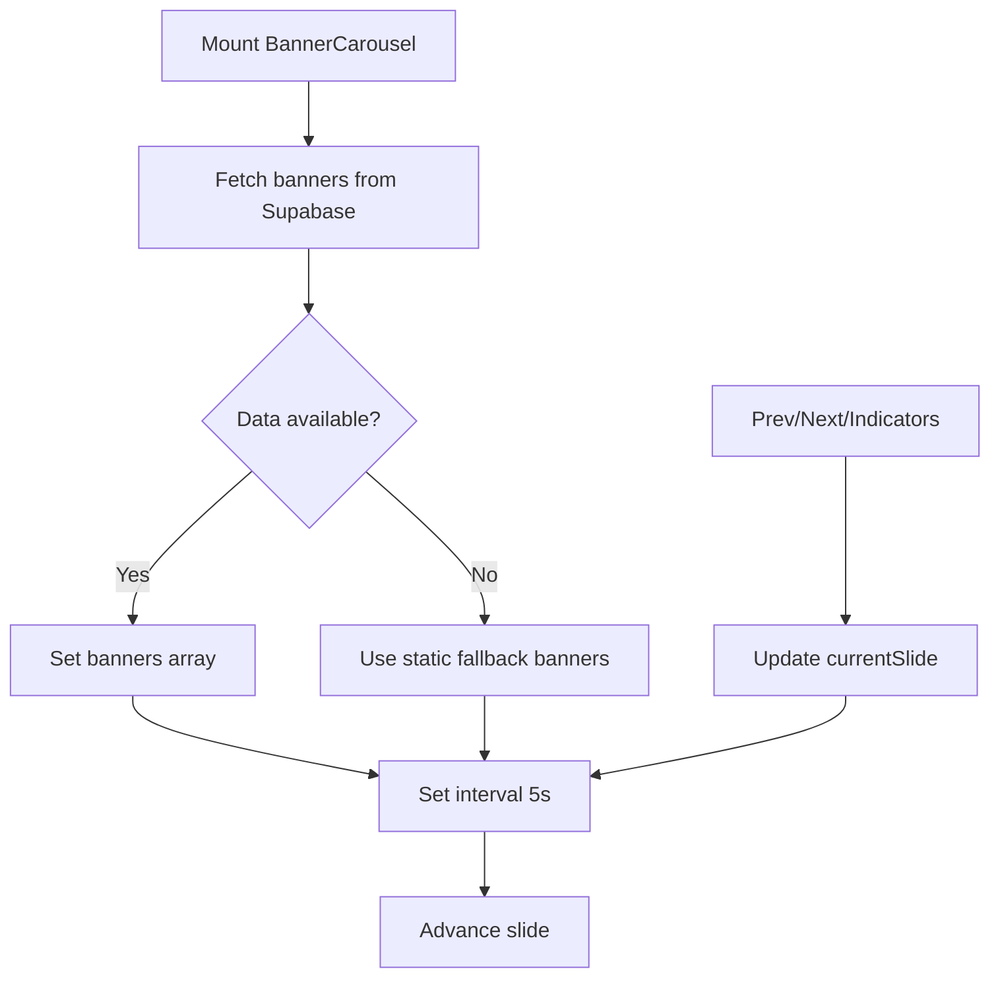
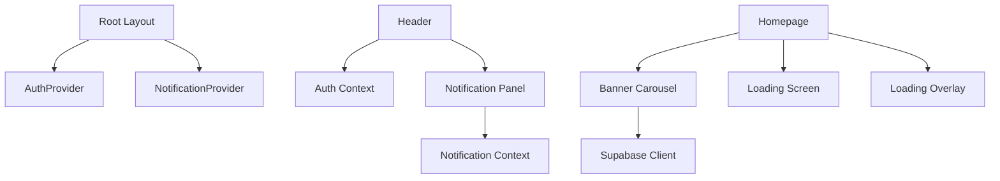

# Layout and Navigation Components

<cite>
**Referenced Files in This Document**
- [header.tsx](file://components/header.tsx)
- [footer.tsx](file://components/footer.tsx)
- [loading-overlay.tsx](file://components/loading-overlay.tsx)
- [loading-screen.tsx](file://components/loading-screen.tsx)
- [banner-carousel.tsx](file://components/banner-carousel.tsx)
- [step-indicator.tsx](file://components/step-indicator.tsx)
- [auth-context.tsx](file://lib/auth-context.tsx)
- [notification-context.tsx](file://lib/notification-context.tsx)
- [notification-panel.tsx](file://components/notification-panel.tsx)
- [search-results.tsx](file://components/search-results.tsx)
- [sign-in-form.tsx](file://components/sign-in-form.tsx)
- [layout.tsx](file://app/layout.tsx)
- [tailwind.config.ts](file://tailwind.config.ts)
- [page.tsx](file://app/(homepage)/page.tsx)
- [admin-dashboard-page.tsx](file://app/admin/dashboard/page.tsx)
- [admin-products-page.tsx](file://app/admin/dashboard/products/page.tsx)
</cite>

## Table of Contents
1. [Introduction](#introduction)
2. [Project Structure](#project-structure)
3. [Core Components](#core-components)
4. [Architecture Overview](#architecture-overview)
5. [Detailed Component Analysis](#detailed-component-analysis)
6. [Dependency Analysis](#dependency-analysis)
7. [Performance Considerations](#performance-considerations)
8. [Troubleshooting Guide](#troubleshooting-guide)
9. [Conclusion](#conclusion)
10. [Appendices](#appendices)

## Introduction
This document explains the layout and navigation components that structure the application interface. It covers the header with responsive navigation, user authentication display, and mobile menu behavior; the footer with links, social media integration, and legal information; loading components (overlay and screen variants) with animation states and user feedback; the banner carousel for promotional content with autoplay and navigation; and the step indicator for multi-step processes. It also documents integration patterns with routing, state management, responsive design, and theming customization.

## Project Structure
The layout and navigation system spans shared UI components, global providers, and page-level integrations:
- Global providers in the root layout wrap the app with authentication and notification contexts.
- Shared components include the header, footer, loading overlays, banner carousel, and step indicator.
- Page-level examples demonstrate how components are composed and driven by routing and state.

**Diagram sources**
- [layout.tsx:25-42](file://app/layout.tsx#L25-L42)
- [header.tsx:19-70](file://components/header.tsx#L19-L70)
- [footer.tsx:5-172](file://components/footer.tsx#L5-L172)
- [loading-overlay.tsx:10-116](file://components/loading-overlay.tsx#L10-L116)
- [loading-screen.tsx:10-94](file://components/loading-screen.tsx#L10-L94)
- [banner-carousel.tsx:15-124](file://components/banner-carousel.tsx#L15-L124)
- [step-indicator.tsx:6-16](file://components/step-indicator.tsx#L6-L16)
- [auth-context.tsx:51-364](file://lib/auth-context.tsx#L51-L364)
- [notification-context.tsx:29-233](file://lib/notification-context.tsx#L29-L233)
- [notification-panel.tsx:13-161](file://components/notification-panel.tsx#L13-L161)
- [search-results.tsx:12-96](file://components/search-results.tsx#L12-L96)
- [sign-in-form.tsx:18-209](file://components/sign-in-form.tsx#L18-L209)

**Section sources**
- [layout.tsx:25-42](file://app/layout.tsx#L25-L42)

## Core Components
- Header: Responsive navigation bar with logo, search, notifications, and user account menu. Integrates authentication state and routes to internal pages.
- Footer: Multi-section footer with feature highlights, contact, country, social links, and legal info.
- Loading Overlay: Non-blocking overlay with progress animation and delayed visibility to prevent flash-of-loading.
- Loading Screen: Fullscreen animated loader with gradient progress and completion callback.
- Banner Carousel: Auto-rotating promotional banners with manual controls and indicators.
- Step Indicator: Minimalist numeric indicator for multi-step flows.

**Section sources**
- [header.tsx:19-416](file://components/header.tsx#L19-L416)
- [footer.tsx:5-172](file://components/footer.tsx#L5-L172)
- [loading-overlay.tsx:10-116](file://components/loading-overlay.tsx#L10-L116)
- [loading-screen.tsx:10-94](file://components/loading-screen.tsx#L10-L94)
- [banner-carousel.tsx:15-124](file://components/banner-carousel.tsx#L15-L124)
- [step-indicator.tsx:6-16](file://components/step-indicator.tsx#L6-L16)

## Architecture Overview
The header integrates with authentication and notifications via React Contexts. The footer is self-contained with external links and branding. Loading components are standalone and controlled by parent pages. The banner carousel fetches data from Supabase and manages its own autoplay lifecycle.

**Diagram sources**
- [header.tsx:332-413](file://components/header.tsx#L332-L413)
- [notification-panel.tsx:13-161](file://components/notification-panel.tsx#L13-L161)
- [notification-context.tsx:29-233](file://lib/notification-context.tsx#L29-L233)

## Detailed Component Analysis

### Header Component
Responsibilities:
- Sticky top navigation with logo and search input.
- Mobile sidebar with Sheet for navigation and authentication prompts.
- Notifications bell with badge for unread count.
- User menu with account actions and logout.
- Integration with routing for internal navigation.

Responsive behavior:
- Uses Tailwind breakpoints to switch between mobile and desktop layouts.
- Mobile menu uses Sheet with controlled open state.

Authentication integration:
- Uses Auth Context to determine login state and user details.
- Opens Sign-In dialog when user is not logged in.
- Shows account menu when logged in.

Search integration:
- Debounced search input with live results panel.
- Routes to product/category pages on selection.

**Diagram sources**
- [header.tsx:19-416](file://components/header.tsx#L19-L416)
- [search-results.tsx:12-96](file://components/search-results.tsx#L12-L96)
- [notification-panel.tsx:13-161](file://components/notification-panel.tsx#L13-L161)
- [auth-context.tsx:51-364](file://lib/auth-context.tsx#L51-L364)

**Section sources**
- [header.tsx:19-416](file://components/header.tsx#L19-L416)
- [search-results.tsx:12-96](file://components/search-results.tsx#L12-L96)
- [notification-panel.tsx:13-161](file://components/notification-panel.tsx#L13-L161)
- [auth-context.tsx:51-364](file://lib/auth-context.tsx#L51-L364)

### Footer Component
Responsibilities:
- Purple feature section with four feature boxes.
- Yellow section with contact CTA, country display, and social media links.
- Copyright row with legal links and logo.

Social media integration:
- Links to Facebook, Twitter, and Instagram profiles.
- Uses Lucide icons styled per brand colors.

Legal information:
- Terms & Conditions and Privacy Policy links.
- Copyright year and company name.

**Diagram sources**
- [footer.tsx:5-172](file://components/footer.tsx#L5-L172)

**Section sources**
- [footer.tsx:5-172](file://components/footer.tsx#L5-L172)

### Loading Components

#### Loading Overlay
Behavior:
- Delayed visibility to avoid brief flashes.
- Animated progress bar with easing and capped completion.
- Backdrop blur and themed color scheme.

Animation states:
- Starts hidden, fades in after a delay.
- Progress increases using requestAnimationFrame with time-based increments.
- Completes to 100% when loading ends.

**Diagram sources**
- [loading-overlay.tsx:10-116](file://components/loading-overlay.tsx#L10-L116)

**Section sources**
- [loading-overlay.tsx:10-116](file://components/loading-overlay.tsx#L10-L116)

#### Loading Screen
Behavior:
- Fullscreen loader with animated gradient progress bar.
- Auto-completes after a maximum timeout.
- Exposes an onComplete callback for parent orchestration.

**Diagram sources**
- [loading-screen.tsx:10-94](file://components/loading-screen.tsx#L10-L94)
- [page.tsx:12-77](file://app/(homepage)/page.tsx#L12-L77)

**Section sources**
- [loading-screen.tsx:10-94](file://components/loading-screen.tsx#L10-L94)
- [page.tsx:12-77](file://app/(homepage)/page.tsx#L12-L77)

### Banner Carousel
Behavior:
- Fetches active banners from Supabase with ordering.
- Falls back to static banners if the table is unavailable.
- Auto-rotates every 5 seconds; supports manual navigation.
- Navigation buttons and indicators appear when multiple slides exist.

**Diagram sources**
- [banner-carousel.tsx:15-124](file://components/banner-carousel.tsx#L15-L124)

**Section sources**
- [banner-carousel.tsx:15-124](file://components/banner-carousel.tsx#L15-L124)

### Step Indicator
Purpose:
- Visual step marker for multi-step forms or checkout flows.
- Active state uses brand sky blue; inactive uses light gray.

Customization:
- Accepts a number or string and toggles active state via props.

**Section sources**
- [step-indicator.tsx:6-16](file://components/step-indicator.tsx#L6-L16)

## Dependency Analysis
Key integration points:
- Providers: Root layout wraps the app with AuthProvider and NotificationProvider.
- Header depends on Auth Context for user state and on Notification Context for unread counts.
- Notification Panel consumes Notification Context for real-time updates and actions.
- Banner Carousel depends on Supabase client for dynamic content.
- Pages coordinate loading screens and overlays for user feedback.

**Diagram sources**
- [layout.tsx:25-42](file://app/layout.tsx#L25-L42)
- [header.tsx:72-416](file://components/header.tsx#L72-L416)
- [notification-panel.tsx:13-161](file://components/notification-panel.tsx#L13-L161)
- [banner-carousel.tsx:15-124](file://components/banner-carousel.tsx#L15-L124)
- [page.tsx:12-77](file://app/(homepage)/page.tsx#L12-L77)

**Section sources**
- [layout.tsx:25-42](file://app/layout.tsx#L25-L42)
- [auth-context.tsx:51-364](file://lib/auth-context.tsx#L51-L364)
- [notification-context.tsx:29-233](file://lib/notification-context.tsx#L29-L233)

## Performance Considerations
- Header rendering avoids hydration mismatches by conditionally rendering a skeleton until mounted.
- Loading Overlay delays appearance to prevent flicker and uses requestAnimationFrame for smooth progress animation.
- Banner Carousel auto-play uses intervals and clears them on unmount to prevent memory leaks.
- Notification Panel lazy-loads content and uses efficient list virtualization via scroll area.
- Theme and animations are configured globally via Tailwind to minimize runtime overhead.

[No sources needed since this section provides general guidance]

## Troubleshooting Guide
Common issues and resolutions:
- Authentication state not reflecting immediately:
  - Ensure AuthProvider is wrapping the app root.
  - Verify useAuth is called within provider scope.
- Notifications not appearing:
  - Confirm NotificationProvider is active and Supabase real-time channel is established.
  - Check unreadCount computation and toast integration.
- Banner carousel not loading:
  - Verify Supabase connection and table existence; fallback images are used when unavailable.
- Loading Overlay not hiding:
  - Ensure isLoading prop is toggled off after data is ready.
  - Confirm completion callback resets progress to 100%.
- Mobile menu not closing:
  - Ensure Sheet open state is controlled and reset on navigation.

**Section sources**
- [layout.tsx:25-42](file://app/layout.tsx#L25-L42)
- [auth-context.tsx:51-364](file://lib/auth-context.tsx#L51-L364)
- [notification-context.tsx:29-233](file://lib/notification-context.tsx#L29-L233)
- [banner-carousel.tsx:15-124](file://components/banner-carousel.tsx#L15-L124)
- [loading-overlay.tsx:10-116](file://components/loading-overlay.tsx#L10-L116)

## Conclusion
The layout and navigation system combines a responsive header, structured footer, robust loading experiences, dynamic banner carousel, and simple step indicators. These components integrate tightly with routing and state management to deliver a cohesive user experience. Theming and responsive behavior are handled consistently through Tailwind configuration and component-level design.

[No sources needed since this section summarizes without analyzing specific files]

## Appendices

### Integration Patterns
- Routing:
  - Header navigates to internal pages using Next.js router.
  - Admin pages demonstrate programmatic navigation and status badges.
- State Management:
  - Auth Context centralizes login, signup, and user data.
  - Notification Context handles real-time updates and read/unread states.
- Responsive Design:
  - Tailwind breakpoints control mobile/desktop layouts.
  - Header uses Sheet for mobile and standard nav for larger screens.

**Section sources**
- [header.tsx:83-95](file://components/header.tsx#L83-L95)
- [admin-dashboard-page.tsx:20-45](file://app/admin/dashboard/page.tsx#L20-L45)
- [admin-products-page.tsx:25-49](file://app/admin/dashboard/products/page.tsx#L25-L49)
- [tailwind.config.ts:1-113](file://tailwind.config.ts#L1-L113)

### Theming and Customization
- Brand palette:
  - Sky blue, mint green, soft yellow, charcoal, and light gray are defined under the brand namespace.
- Typography:
  - Nunito font is globally applied via root layout.
- Animations:
  - Tailwind keyframes and animation utilities are used for floating and shimmer effects.
- Component-level customization:
  - Use Tailwind utilities to adjust colors, spacing, and typography.
  - Override brand tokens by editing the Tailwind theme configuration.

**Section sources**
- [tailwind.config.ts:27-78](file://tailwind.config.ts#L27-L78)
- [layout.tsx:9-14](file://app/layout.tsx#L9-L14)