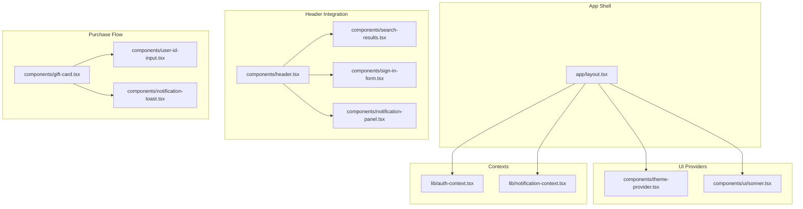
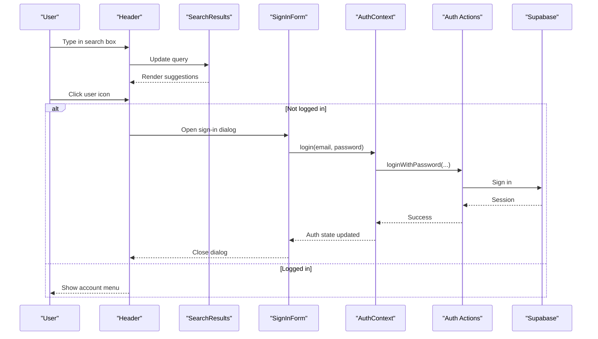
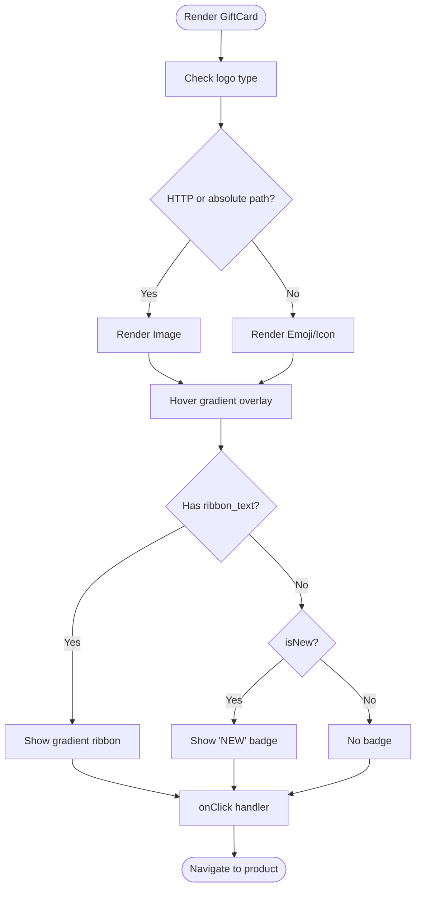
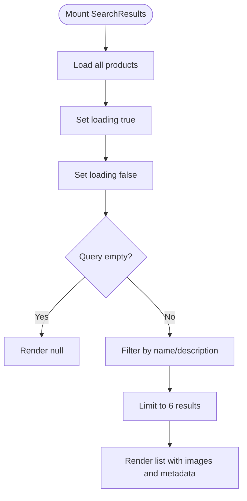
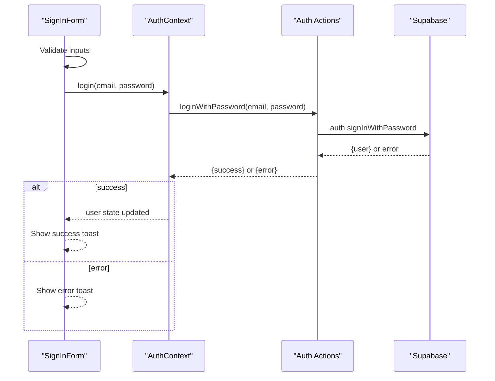
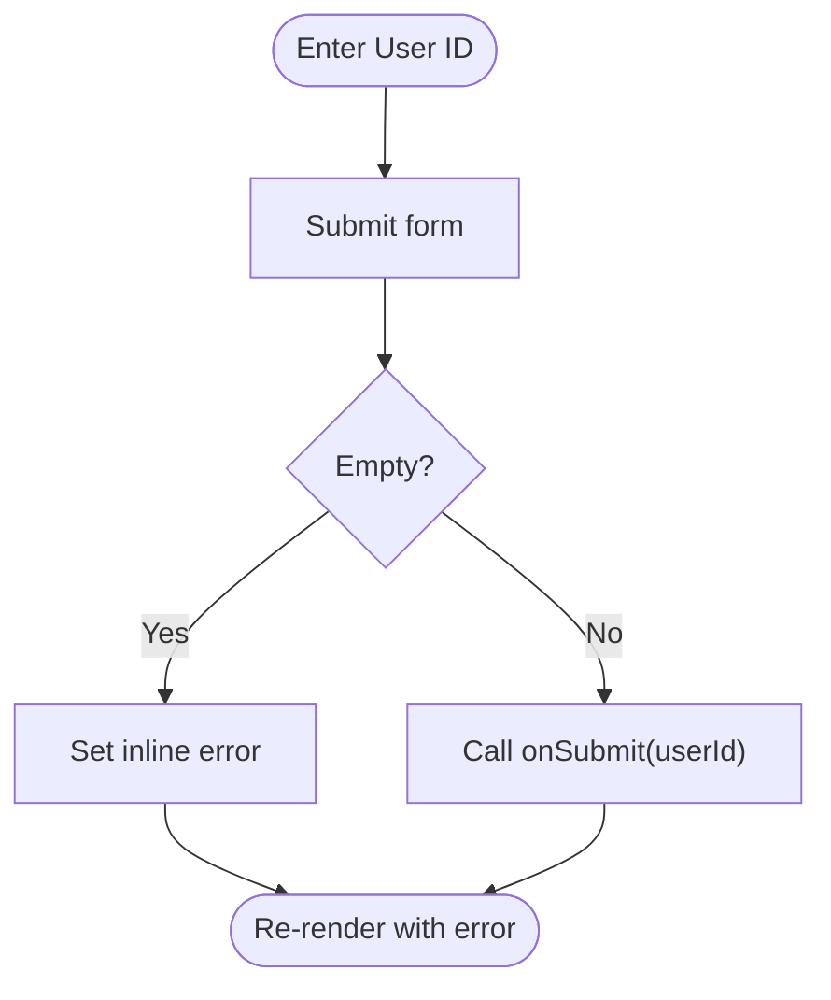
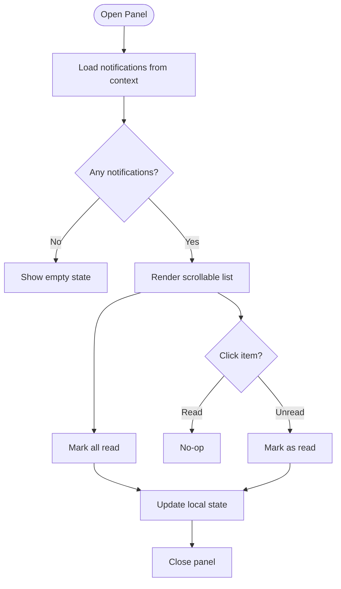
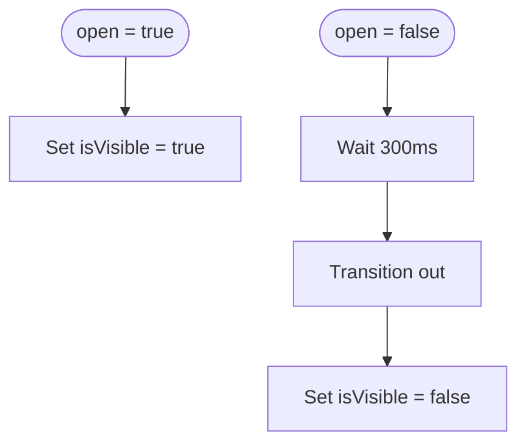
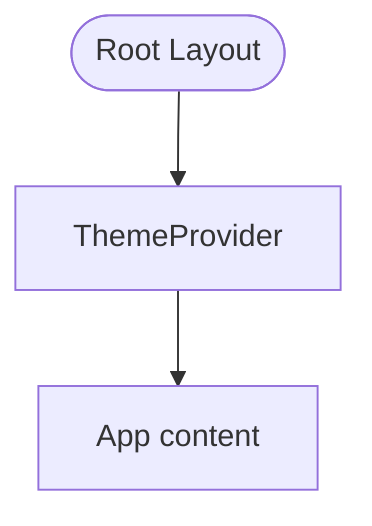
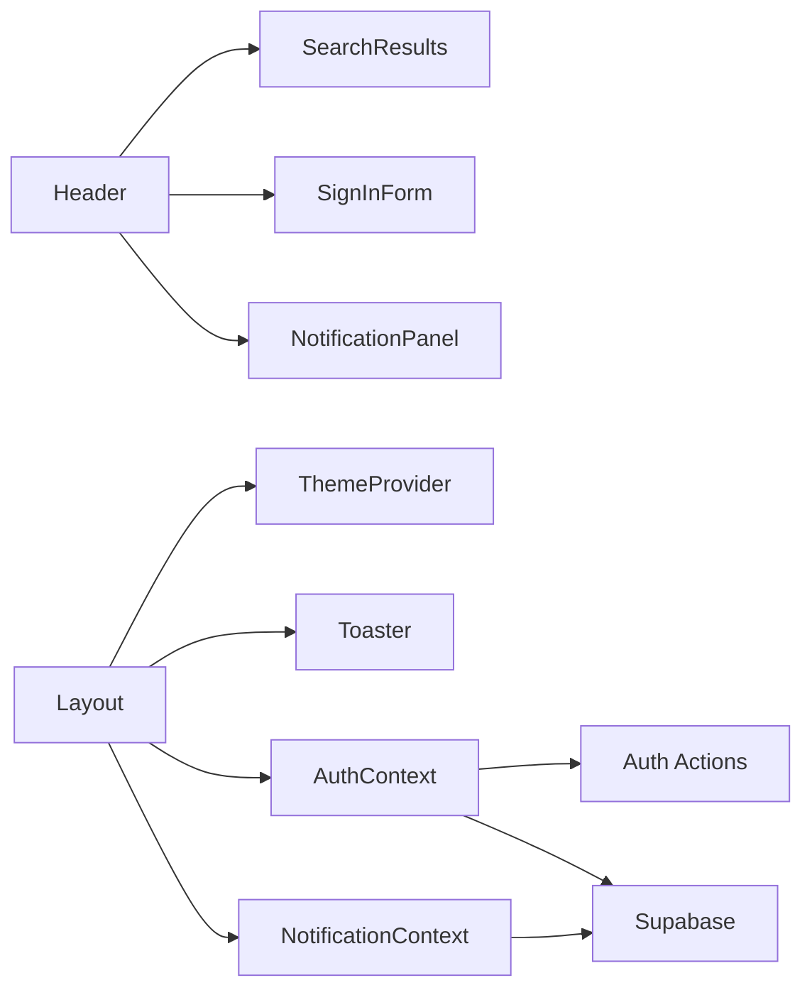

# Specialized and Business Components

<cite>
**Referenced Files in This Document**
- [gift-card.tsx](file://components/gift-card.tsx)
- [search-results.tsx](file://components/search-results.tsx)
- [sign-in-form.tsx](file://components/sign-in-form.tsx)
- [user-id-input.tsx](file://components/user-id-input.tsx)
- [notification-panel.tsx](file://components/notification-panel.tsx)
- [notification-toast.tsx](file://components/notification-toast.tsx)
- [theme-provider.tsx](file://components/theme-provider.tsx)
- [auth-context.tsx](file://lib/auth-context.tsx)
- [notification-context.tsx](file://lib/notification-context.tsx)
- [layout.tsx](file://app/layout.tsx)
- [header.tsx](file://components/header.tsx)
- [auth actions.ts](file://app/actions/auth.ts)
- [supabase.ts](file://lib/supabase.ts)
- [sonner ui.tsx](file://components/ui/sonner.tsx)
</cite>

## Table of Contents
1. [Introduction](#introduction)
2. [Project Structure](#project-structure)
3. [Core Components](#core-components)
4. [Architecture Overview](#architecture-overview)
5. [Detailed Component Analysis](#detailed-component-analysis)
6. [Dependency Analysis](#dependency-analysis)
7. [Performance Considerations](#performance-considerations)
8. [Troubleshooting Guide](#troubleshooting-guide)
9. [Conclusion](#conclusion)
10. [Appendices](#appendices)

## Introduction
This document focuses on specialized and business logic–driven components that power key user journeys: gift card selection, search and discovery, sign-in and registration, user identity input, notifications, and theme management. It explains how these components are structured, how they interact with authentication and notification contexts, and how they integrate with external services such as Supabase. Accessibility and customization guidelines are included to help maintain a consistent, inclusive, and extensible UI.

## Project Structure
The relevant components and contexts are organized under:
- components/: Presentational and composite components (e.g., gift-card, search-results, sign-in-form, notification-panel, notification-toast, theme-provider, user-id-input)
- lib/: Cross-cutting concerns (auth-context, notification-context, supabase client)
- app/: Application shell and providers (layout, actions)

**Diagram sources**
- [layout.tsx:25-42](file://app/layout.tsx#L25-L42)
- [theme-provider.tsx:9-11](file://components/theme-provider.tsx#L9-L11)
- [sonner ui.tsx:8-25](file://components/ui/sonner.tsx#L8-L25)
- [auth-context.tsx:51-364](file://lib/auth-context.tsx#L51-L364)
- [notification-context.tsx:29-233](file://lib/notification-context.tsx#L29-L233)
- [header.tsx:19-416](file://components/header.tsx#L19-L416)
- [search-results.tsx:12-96](file://components/search-results.tsx#L12-L96)
- [sign-in-form.tsx:18-209](file://components/sign-in-form.tsx#L18-L209)
- [notification-panel.tsx:13-161](file://components/notification-panel.tsx#L13-L161)
- [gift-card.tsx:17-67](file://components/gift-card.tsx#L17-L67)
- [user-id-input.tsx:18-73](file://components/user-id-input.tsx#L18-L73)
- [notification-toast.tsx:11-50](file://components/notification-toast.tsx#L11-L50)

**Section sources**
- [layout.tsx:25-42](file://app/layout.tsx#L25-L42)

## Core Components
- Gift Card: Renders a visually appealing card with dynamic styling, optional ribbon badges, and click handling for navigation.
- Search Results: Provides live filtering and presentation of product suggestions with loading and empty states.
- Sign-In Form: Implements tabbed authentication with validation, server action integration, and toast feedback.
- User ID Input: Validates and submits a user identifier for top-up or product flows.
- Notification Panel: Displays user-specific notifications with read/unread states, real-time updates, and batch actions.
- Notification Toast: Lightweight floating toast with controlled visibility and dismissal.
- Theme Provider: Wraps the app with theme switching and persistence via next-themes.
- Auth Context: Centralizes authentication state, transactions, and server action orchestration.
- Notification Context: Manages notifications lifecycle, real-time subscriptions, and database synchronization.

**Section sources**
- [gift-card.tsx:17-67](file://components/gift-card.tsx#L17-L67)
- [search-results.tsx:12-96](file://components/search-results.tsx#L12-L96)
- [sign-in-form.tsx:18-209](file://components/sign-in-form.tsx#L18-L209)
- [user-id-input.tsx:18-73](file://components/user-id-input.tsx#L18-L73)
- [notification-panel.tsx:13-161](file://components/notification-panel.tsx#L13-L161)
- [notification-toast.tsx:11-50](file://components/notification-toast.tsx#L11-L50)
- [theme-provider.tsx:9-11](file://components/theme-provider.tsx#L9-L11)
- [auth-context.tsx:30-47](file://lib/auth-context.tsx#L30-L47)
- [notification-context.tsx:17-25](file://lib/notification-context.tsx#L17-L25)

## Architecture Overview
The components integrate through React contexts and server actions:
- Authentication: AuthProvider wraps the app and exposes login/signup/logout via server actions. The sign-in form consumes useAuth hooks.
- Notifications: NotificationProvider manages notifications, loads from Supabase, and subscribes to real-time events. The header integrates the panel and badge.
- Theming: ThemeProvider enables light/dark mode switching and persistence.
- Purchase flow: Gift card selection leads to user ID input for top-ups or product pages, with toast feedback.

**Diagram sources**
- [header.tsx:105-115](file://components/header.tsx#L105-L115)
- [search-results.tsx:32-47](file://components/search-results.tsx#L32-L47)
- [sign-in-form.tsx:27-45](file://components/sign-in-form.tsx#L27-L45)
- [auth-context.tsx:129-163](file://lib/auth-context.tsx#L129-L163)
- [auth actions.ts:8-23](file://app/actions/auth.ts#L8-L23)
- [supabase.ts:1-7](file://lib/supabase.ts#L1-L7)

## Detailed Component Analysis

### Gift Card Component
- Purpose: Visual product representation with interactive hover effects and optional badges.
- Dynamic styling:
  - Gradient overlay appears on hover.
  - Optional ribbon badge or “NEW” badge depending on props.
  - Conditional image vs. emoji rendering for logos.
- Denomination display: The component receives denomination data via props but does not render it internally; downstream pages or modals consume this data.
- Purchase flow integration: Emits onClick to trigger navigation to product pages or purchase steps.

**Diagram sources**
- [gift-card.tsx:17-67](file://components/gift-card.tsx#L17-L67)

**Section sources**
- [gift-card.tsx:17-67](file://components/gift-card.tsx#L17-L67)

### Search Results Component
- Filtering: Filters products by name or description, case-insensitive, limited to six results.
- Sorting: Not explicitly sorted; results reflect initial order from getAllProducts.
- Presentation: Displays product logo, truncated name/description, and category indicator.
- Loading and empty states: Spinner while loading; renders nothing when query is empty or no results.

**Diagram sources**
- [search-results.tsx:17-47](file://components/search-results.tsx#L17-L47)

**Section sources**
- [search-results.tsx:12-96](file://components/search-results.tsx#L12-L96)

### Sign-In Form Component
- Validation:
  - Password match check on sign-up.
  - Minimum length validation.
- Authentication flow:
  - Uses useAuth(login/signup) from AuthContext.
  - Delegates to server actions (loginWithPassword, signupWithPassword).
- Error handling:
  - Toast notifications for success and failure.
  - Controlled loading states.

**Diagram sources**
- [sign-in-form.tsx:27-82](file://components/sign-in-form.tsx#L27-L82)
- [auth-context.tsx:129-163](file://lib/auth-context.tsx#L129-L163)
- [auth actions.ts:8-23](file://app/actions/auth.ts#L8-L23)

**Section sources**
- [sign-in-form.tsx:18-209](file://components/sign-in-form.tsx#L18-L209)
- [auth-context.tsx:346-364](file://lib/auth-context.tsx#L346-L364)
- [auth actions.ts:8-67](file://app/actions/auth.ts#L8-L67)

### User ID Input Component
- Validation pattern: Ensures non-empty user ID before submission.
- UX enhancements:
  - Conditional background color based on category.
  - Disabled submit button during loading.
  - Inline error messaging.

**Diagram sources**
- [user-id-input.tsx:22-32](file://components/user-id-input.tsx#L22-L32)

**Section sources**
- [user-id-input.tsx:18-73](file://components/user-id-input.tsx#L18-L73)

### Notification Panel Component
- Positioning: Fixed overlay aligned to top-right.
- Content: Scrollable list with type-specific borders/icons and time-ago formatting.
- Interactions:
  - Mark single as read.
  - Mark all as read.
  - Dismiss panel.
- Unread count: Derived from context.

**Diagram sources**
- [notification-panel.tsx:13-161](file://components/notification-panel.tsx#L13-L161)
- [notification-context.tsx:36-118](file://lib/notification-context.tsx#L36-L118)

**Section sources**
- [notification-panel.tsx:13-161](file://components/notification-panel.tsx#L13-L161)
- [notification-context.tsx:29-233](file://lib/notification-context.tsx#L29-L233)

### Notification Toast Component
- Positioning: Top-right fixed position.
- Timing: Controlled visibility with transitions; delayed exit animation.
- Dismissal: Manual close button triggers onOpenChange.

**Diagram sources**
- [notification-toast.tsx:11-50](file://components/notification-toast.tsx#L11-L50)

**Section sources**
- [notification-toast.tsx:11-50](file://components/notification-toast.tsx#L11-L50)

### Theme Provider Component
- Purpose: Wrap the app with next-themes to enable theme switching and persistence.
- Integration: Used in app/layout.tsx alongside other providers.

**Diagram sources**
- [layout.tsx:31-38](file://app/layout.tsx#L31-L38)
- [theme-provider.tsx:9-11](file://components/theme-provider.tsx#L9-L11)

**Section sources**
- [theme-provider.tsx:9-11](file://components/theme-provider.tsx#L9-L11)
- [layout.tsx:31-38](file://app/layout.tsx#L31-L38)

## Dependency Analysis
- Authentication context depends on server actions and Supabase client.
- Notification context depends on Supabase for real-time and persistence.
- Header composes search, sign-in, and notification components and orchestrates routing.
- UI toast is configured globally via app/layout.tsx and components/ui/sonner.tsx.

**Diagram sources**
- [auth-context.tsx:51-364](file://lib/auth-context.tsx#L51-L364)
- [notification-context.tsx:29-233](file://lib/notification-context.tsx#L29-L233)
- [header.tsx:19-416](file://components/header.tsx#L19-L416)
- [layout.tsx:31-38](file://app/layout.tsx#L31-L38)
- [sonner ui.tsx:8-25](file://components/ui/sonner.tsx#L8-L25)

**Section sources**
- [auth-context.tsx:51-364](file://lib/auth-context.tsx#L51-L364)
- [notification-context.tsx:29-233](file://lib/notification-context.tsx#L29-L233)
- [header.tsx:19-416](file://components/header.tsx#L19-L416)
- [layout.tsx:31-38](file://app/layout.tsx#L31-L38)
- [sonner ui.tsx:8-25](file://components/ui/sonner.tsx#L8-L25)

## Performance Considerations
- Gift Card hover animations: Keep transitions lightweight; avoid heavy transforms on deeply nested elements.
- Search Results filtering: Debounce input to reduce filter churn; consider memoizing product lists.
- Notification Panel: Use virtualized scrolling for very large lists; keep icon rendering minimal.
- Auth operations: Batch server action calls; avoid redundant re-renders by normalizing state updates.
- Theme switching: Persist theme preference to localStorage via next-themes to prevent FOUC.

## Troubleshooting Guide
- Authentication failures:
  - Verify server action responses and error messages.
  - Ensure Supabase credentials are set and reachable.
- Notification real-time updates:
  - Confirm Supabase Realtime channel subscription and channel name uniqueness.
  - Check database permissions and row-level security policies.
- Toast visibility:
  - Ensure Toaster is rendered once in the app shell and positioned appropriately.
  - Validate that toasts are dismissed properly to avoid stacking.

**Section sources**
- [auth actions.ts:8-67](file://app/actions/auth.ts#L8-L67)
- [supabase.ts:1-7](file://lib/supabase.ts#L1-L7)
- [notification-context.tsx:172-220](file://lib/notification-context.tsx#L172-L220)
- [layout.tsx:36](file://app/layout.tsx#L36)

## Conclusion
These specialized components form the backbone of user-facing flows: discovery, authentication, purchase completion, and communication. Their integration through contexts and server actions ensures a cohesive, scalable, and accessible experience. Following the customization and accessibility guidelines below will help maintain quality as features evolve.

## Appendices

### Integration Examples
- Authentication context:
  - Consume useAuth in forms and pages to gate features and update UI state.
  - Trigger server actions for login/signup/logout.
- State management:
  - Use AuthContext for user and transaction state; NotificationContext for notification state.
- External services:
  - Supabase client is used for authentication and data operations; ensure environment variables are configured.

**Section sources**
- [auth-context.tsx:367-373](file://lib/auth-context.tsx#L367-L373)
- [notification-context.tsx:235-241](file://lib/notification-context.tsx#L235-L241)
- [supabase.ts:1-7](file://lib/supabase.ts#L1-L7)

### Customization Guidelines
- Gift Card:
  - Adjust colors and gradients via Tailwind classes; ensure contrast for badges and text.
  - Extend props to support denomination rendering in downstream consumers.
- Search Results:
  - Add debouncing to improve responsiveness.
  - Introduce sorting options (e.g., relevance, price).
- Sign-In Form:
  - Add field-level validation helpers and stronger password checks.
  - Localize toast messages and labels.
- User ID Input:
  - Support category-specific validation rules.
  - Provide help text and examples for user ID formats.
- Notification Panel:
  - Customize icon sets and border colors per type.
  - Add pagination for large lists.
- Notification Toast:
  - Configure auto-hide durations and stacking behavior.
- Theme Provider:
  - Define additional themes and ensure CSS variables are supported.

### Accessibility Considerations
- Forms:
  - Ensure labels are associated with inputs; provide visible error messages.
  - Use ARIA attributes for dialogs and panels when needed.
- Keyboard navigation:
  - Panels and dialogs should be navigable via Tab/Shift+Tab and Escape.
- Focus management:
  - Manage focus after opening/closing dialogs and panels.
- Color and contrast:
  - Maintain sufficient contrast for text and interactive elements.
  - Avoid conveying meaning through color alone.