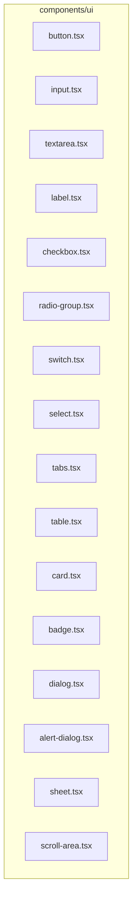
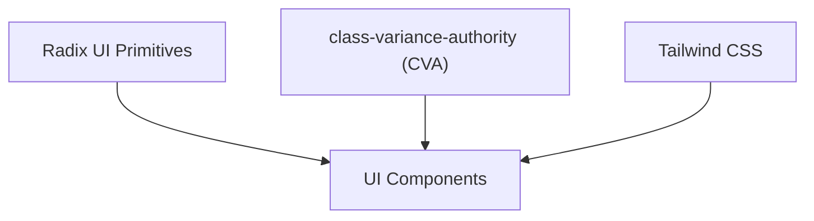
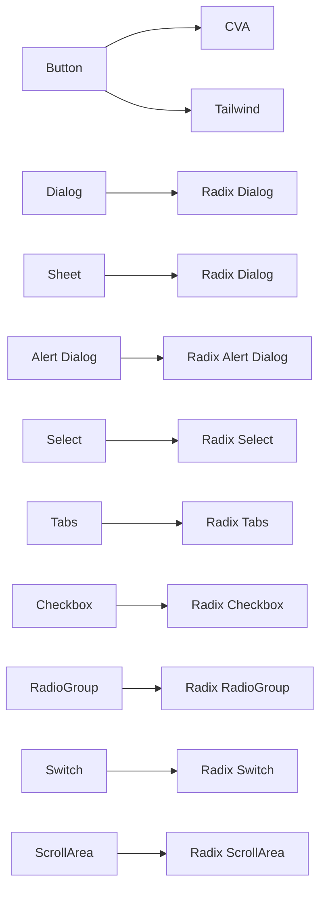

# UI Base Components

<cite>
**Referenced Files in This Document**
- [button.tsx](file://components/ui/button.tsx)
- [input.tsx](file://components/ui/input.tsx)
- [dialog.tsx](file://components/ui/dialog.tsx)
- [card.tsx](file://components/ui/card.tsx)
- [badge.tsx](file://components/ui/badge.tsx)
- [checkbox.tsx](file://components/ui/checkbox.tsx)
- [radio-group.tsx](file://components/ui/radio-group.tsx)
- [select.tsx](file://components/ui/select.tsx)
- [sheet.tsx](file://components/ui/sheet.tsx)
- [switch.tsx](file://components/ui/switch.tsx)
- [table.tsx](file://components/ui/table.tsx)
- [tabs.tsx](file://components/ui/tabs.tsx)
- [textarea.tsx](file://components/ui/textarea.tsx)
- [alert-dialog.tsx](file://components/ui/alert-dialog.tsx)
- [label.tsx](file://components/ui/label.tsx)
- [scroll-area.tsx](file://components/ui/scroll-area.tsx)
</cite>

## Table of Contents
1. [Introduction](#introduction)
2. [Project Structure](#project-structure)
3. [Core Components](#core-components)
4. [Architecture Overview](#architecture-overview)
5. [Detailed Component Analysis](#detailed-component-analysis)
6. [Dependency Analysis](#dependency-analysis)
7. [Performance Considerations](#performance-considerations)
8. [Troubleshooting Guide](#troubleshooting-guide)
9. [Conclusion](#conclusion)
10. [Appendices](#appendices)

## Introduction
This document describes the base UI component library built with Radix UI primitives and styled with Tailwind CSS. It explains each component’s props, attributes, events, and customization options, along with usage patterns, accessibility features, styling via Tailwind, composition patterns, responsiveness, cross-browser compatibility, and extension guidelines.

## Project Structure
The UI components live under components/ui and are thin wrappers around Radix UI primitives. They apply Tailwind utility classes and optional variant systems (via class-variance-authority) to achieve consistent design and behavior.

**Diagram sources**
- [button.tsx](file://components/ui/button.tsx)
- [input.tsx](file://components/ui/input.tsx)
- [textarea.tsx](file://components/ui/textarea.tsx)
- [label.tsx](file://components/ui/label.tsx)
- [checkbox.tsx](file://components/ui/checkbox.tsx)
- [radio-group.tsx](file://components/ui/radio-group.tsx)
- [switch.tsx](file://components/ui/switch.tsx)
- [select.tsx](file://components/ui/select.tsx)
- [tabs.tsx](file://components/ui/tabs.tsx)
- [table.tsx](file://components/ui/table.tsx)
- [card.tsx](file://components/ui/card.tsx)
- [badge.tsx](file://components/ui/badge.tsx)
- [dialog.tsx](file://components/ui/dialog.tsx)
- [alert-dialog.tsx](file://components/ui/alert-dialog.tsx)
- [sheet.tsx](file://components/ui/sheet.tsx)
- [scroll-area.tsx](file://components/ui/scroll-area.tsx)

**Section sources**
- [button.tsx](file://components/ui/button.tsx)
- [input.tsx](file://components/ui/input.tsx)
- [dialog.tsx](file://components/ui/dialog.tsx)

## Core Components
This section summarizes the primary building blocks and their roles.

- Buttons: Variants and sizes with slot composition for semantic flexibility.
- Form Controls: Inputs, text areas, checkboxes, radios, switches, selects, and labels.
- Layout: Cards, tables, badges, scroll areas.
- Overlays: Dialogs, sheets, and alert dialogs.
- Navigation: Tabs.

Each component composes Radix UI primitives with Tailwind classes and optional variant systems.

**Section sources**
- [button.tsx](file://components/ui/button.tsx)
- [input.tsx](file://components/ui/input.tsx)
- [textarea.tsx](file://components/ui/textarea.tsx)
- [label.tsx](file://components/ui/label.tsx)
- [checkbox.tsx](file://components/ui/checkbox.tsx)
- [radio-group.tsx](file://components/ui/radio-group.tsx)
- [switch.tsx](file://components/ui/switch.tsx)
- [select.tsx](file://components/ui/select.tsx)
- [tabs.tsx](file://components/ui/tabs.tsx)
- [table.tsx](file://components/ui/table.tsx)
- [card.tsx](file://components/ui/card.tsx)
- [badge.tsx](file://components/ui/badge.tsx)
- [dialog.tsx](file://components/ui/dialog.tsx)
- [alert-dialog.tsx](file://components/ui/alert-dialog.tsx)
- [sheet.tsx](file://components/ui/sheet.tsx)
- [scroll-area.tsx](file://components/ui/scroll-area.tsx)

## Architecture Overview
The components follow a consistent pattern:
- Use Radix UI primitives for accessibility and behavior.
- Apply Tailwind classes for styling and theme integration.
- Optionally define variants via class-variance-authority for consistent design tokens.
- Support composition via asChild patterns and container/content parts.

[No sources needed since this diagram shows conceptual workflow, not actual code structure]

## Detailed Component Analysis

### Button
- Purpose: Primary action affordance with variants and sizes.
- Props:
  - Inherits standard button attributes.
  - variant: default, destructive, outline, secondary, ghost, link.
  - size: default, sm, lg, icon.
  - asChild: render as a different element via Radix Slot.
- Accessibility: Inherits focus-visible ring and disabled states from Radix.
- Styling: Uses CVA for variants and sizes; integrates with theme tokens.
- Composition: Works inside forms, dialogs, cards, and as standalone controls.

Usage patterns:
- Use destructive for negative actions, outline for secondary actions, link for minimal emphasis.
- Use icon size for compact controls.

**Section sources**
- [button.tsx](file://components/ui/button.tsx)

### Input
- Purpose: Text input field with consistent focus states and placeholder styling.
- Props: Inherits standard input attributes; supports type prop.
- Accessibility: Focus-visible ring and disabled states handled.
- Styling: Tailwind classes applied; integrates with theme tokens.

Usage patterns:
- Combine with Label and Form helpers for accessible forms.
- Use size variants indirectly via wrapper containers.

**Section sources**
- [input.tsx](file://components/ui/input.tsx)

### Textarea
- Purpose: Multi-line text input with consistent focus states.
- Props: Inherits standard textarea attributes.
- Accessibility: Focus-visible ring and disabled states handled.
- Styling: Tailwind classes applied; integrates with theme tokens.

Usage patterns:
- Pair with labels and help text for clarity.
- Use within cards or dialogs for extended content.

**Section sources**
- [textarea.tsx](file://components/ui/textarea.tsx)

### Label
- Purpose: Associates text with form controls for accessibility.
- Props: Inherits standard label attributes; supports variant styling via CVA.
- Accessibility: Built on Radix Label primitive; improves focus and click targets.
- Styling: Variant system for consistent typography and spacing.

Usage patterns:
- Always pair with associated inputs/controls.
- Use for hint text and error messaging contexts.

**Section sources**
- [label.tsx](file://components/ui/label.tsx)

### Checkbox
- Purpose: Binary selection with visual indicator.
- Props: Inherits Radix Checkbox root attributes.
- Accessibility: Focus-visible ring, checked state, disabled state.
- Styling: Tailwind classes; indicator renders a checkmark.

Usage patterns:
- Use within forms and lists.
- Combine with Label for accessible labeling.

**Section sources**
- [checkbox.tsx](file://components/ui/checkbox.tsx)

### Radio Group
- Purpose: Single-selection among multiple options.
- Props: Root and item inherit Radix attributes; items support custom indicators.
- Accessibility: Focus-visible ring, checked state management.
- Styling: Tailwind classes; indicator renders a dot.

Usage patterns:
- Use within forms and settings panels.
- Combine with Label and container layouts.

**Section sources**
- [radio-group.tsx](file://components/ui/radio-group.tsx)

### Switch
- Purpose: Toggle between on/off states.
- Props: Inherits Radix Switch root attributes; thumb positioned via transforms.
- Accessibility: Focus-visible ring, checked/unchecked states.
- Styling: Tailwind classes; transitions for smooth toggling.

Usage patterns:
- Use in settings and preferences.
- Pair with Label for clarity.

**Section sources**
- [switch.tsx](file://components/ui/switch.tsx)

### Select
- Purpose: Dropdown selection with scrolling viewport and keyboard navigation.
- Props:
  - Root, Trigger, Content, Item, Label, Separator, ScrollUp/Down buttons.
  - Positioning and sizing handled by Radix and Tailwind.
- Accessibility: Keyboard navigation, focus management, disabled states.
- Styling: Tailwind classes; popper positioning adjustments.

Usage patterns:
- Use groups and separators for categorized options.
- Combine with ScrollArea for long lists.

**Section sources**
- [select.tsx](file://components/ui/select.tsx)

### Tabs
- Purpose: Organize content into selectable sections.
- Props: Root, List, Trigger, Content; triggers activate content panes.
- Accessibility: Keyboard navigation, focus management, active state indication.
- Styling: Tailwind classes for list and trigger states.

Usage patterns:
- Use within cards or content areas.
- Combine with ScrollArea for tab overflow.

**Section sources**
- [tabs.tsx](file://components/ui/tabs.tsx)

### Table
- Purpose: Present structured data with responsive container.
- Props: Table, TableHeader, TableBody, TableFooter, TableRow, TableHead, TableCell, TableCaption.
- Accessibility: Semantic table structure; focus and hover states.
- Styling: Tailwind classes for borders, padding, and hover effects.

Usage patterns:
- Wrap in ScrollArea for large datasets.
- Use captions for summaries.

**Section sources**
- [table.tsx](file://components/ui/table.tsx)

### Card
- Purpose: Encapsulate content with consistent spacing and shadows.
- Props: Card, CardHeader, CardTitle, CardDescription, CardContent, CardFooter.
- Accessibility: No special behavior; relies on contained controls.
- Styling: Tailwind classes for background, border, and spacing.

Usage patterns:
- Use as dialog or sheet content containers.
- Combine with forms and tables.

**Section sources**
- [card.tsx](file://components/ui/card.tsx)

### Badge
- Purpose: Short status or tag labels.
- Props: Inherits standard div attributes; variant styling via CVA.
- Accessibility: Static label; ensure sufficient color contrast.
- Styling: Variant system for color and border combinations.

Usage patterns:
- Use for status, categories, or metadata.
- Combine with icons for richer meaning.

**Section sources**
- [badge.tsx](file://components/ui/badge.tsx)

### Dialog
- Purpose: Modal overlay for focused tasks or confirmations.
- Props: Root, Trigger, Portal, Overlay, Close, Content, Header/Footer, Title, Description.
- Accessibility: Trap focus, close-on-escape, screen-reader-friendly labels.
- Styling: Tailwind classes; animations via data-state attributes.

Usage patterns:
- Use Header/Footer for structured layouts.
- Combine with Button variants for actions.

**Section sources**
- [dialog.tsx](file://components/ui/dialog.tsx)

### Alert Dialog
- Purpose: Critical confirmations with strong visual emphasis.
- Props: Similar to Dialog but uses Button variants for Action/Cancel.
- Accessibility: Same as Dialog; leverages Button focus states.
- Styling: Tailwind classes; Button variants for primary/secondary actions.

Usage patterns:
- Use for destructive actions or irreversible decisions.
- Combine with Card for content.

**Section sources**
- [alert-dialog.tsx](file://components/ui/alert-dialog.tsx)

### Sheet
- Purpose: Slide-out panel from an edge (commonly right).
- Props: Root, Trigger, Portal, Overlay, Close, Content (with side variant), Header/Footer, Title, Description.
- Accessibility: Focus trap, escape key, screen-reader labels.
- Styling: CVA for side variants; Tailwind classes for slide animations.

Usage patterns:
- Use for filters, drawers, or settings panels.
- Combine with ScrollArea for tall content.

**Section sources**
- [sheet.tsx](file://components/ui/sheet.tsx)

### Scroll Area
- Purpose: Adds native-like scrollbars with custom styling.
- Props: Root, Viewport, Scrollbar, Thumb, Corner; supports vertical/horizontal orientation.
- Accessibility: Inherits native scrolling semantics.
- Styling: Tailwind classes; scrollbar sizing and colors.

Usage patterns:
- Wrap tables, long lists, or content-heavy modals.
- Use with Tabs and Sheets.

**Section sources**
- [scroll-area.tsx](file://components/ui/scroll-area.tsx)

## Dependency Analysis
- Radix UI primitives are the behavioral backbone for overlays, forms, and navigation.
- class-variance-authority provides consistent variants for Button and Badge.
- Tailwind CSS applies theme tokens and responsive utilities.
- Components compose via:
  - Container/content parts (Dialog, Sheet, Alert Dialog).
  - Primitive roots/triggers (Select, Tabs, Checkbox, Radio Group, Switch).
  - Slot composition (Button) for semantic rendering.

**Diagram sources**
- [button.tsx](file://components/ui/button.tsx)
- [dialog.tsx](file://components/ui/dialog.tsx)
- [sheet.tsx](file://components/ui/sheet.tsx)
- [alert-dialog.tsx](file://components/ui/alert-dialog.tsx)
- [select.tsx](file://components/ui/select.tsx)
- [tabs.tsx](file://components/ui/tabs.tsx)
- [checkbox.tsx](file://components/ui/checkbox.tsx)
- [radio-group.tsx](file://components/ui/radio-group.tsx)
- [switch.tsx](file://components/ui/switch.tsx)
- [scroll-area.tsx](file://components/ui/scroll-area.tsx)

**Section sources**
- [button.tsx](file://components/ui/button.tsx)
- [dialog.tsx](file://components/ui/dialog.tsx)
- [sheet.tsx](file://components/ui/sheet.tsx)
- [alert-dialog.tsx](file://components/ui/alert-dialog.tsx)
- [select.tsx](file://components/ui/select.tsx)
- [tabs.tsx](file://components/ui/tabs.tsx)
- [checkbox.tsx](file://components/ui/checkbox.tsx)
- [radio-group.tsx](file://components/ui/radio-group.tsx)
- [switch.tsx](file://components/ui/switch.tsx)
- [scroll-area.tsx](file://components/ui/scroll-area.tsx)

## Performance Considerations
- Prefer lightweight wrappers around Radix primitives to minimize re-renders.
- Use asChild patterns judiciously to avoid unnecessary DOM nodes.
- Keep variant sets concise to reduce CSS bundle size.
- Use Tailwind utilities sparingly; group frequently used combinations into shared classes.
- For large lists (Select, Table), pair with ScrollArea to avoid layout thrashing.

[No sources needed since this section provides general guidance]

## Troubleshooting Guide
- Focus issues:
  - Ensure focus-visible rings are visible and not overridden by custom styles.
  - Verify that overlays properly trap focus and return focus after closing.
- Disabled states:
  - Confirm disabled pointer-events and opacity are applied consistently.
- Accessibility:
  - Provide meaningful aria-labels or sr-only text for icons.
  - Ensure labels are programmatically associated with controls.
- Styling conflicts:
  - Isolate Tailwind utilities; avoid conflicting global resets.
  - Use explicit variant props instead of arbitrary values when possible.

**Section sources**
- [button.tsx](file://components/ui/button.tsx)
- [dialog.tsx](file://components/ui/dialog.tsx)
- [sheet.tsx](file://components/ui/sheet.tsx)
- [alert-dialog.tsx](file://components/ui/alert-dialog.tsx)
- [select.tsx](file://components/ui/select.tsx)
- [tabs.tsx](file://components/ui/tabs.tsx)
- [checkbox.tsx](file://components/ui/checkbox.tsx)
- [radio-group.tsx](file://components/ui/radio-group.tsx)
- [switch.tsx](file://components/ui/switch.tsx)
- [scroll-area.tsx](file://components/ui/scroll-area.tsx)

## Conclusion
The base UI component library combines Radix UI’s robust accessibility and behavior with Tailwind’s utility-first styling and optional variant systems. By composing primitives into cohesive parts and applying consistent design tokens, teams can build accessible, maintainable, and visually coherent interfaces at scale.

[No sources needed since this section summarizes without analyzing specific files]

## Appendices

### Accessibility Features Across Components
- Keyboard navigation: Tabs, Select, RadioGroup, Checkbox, Switch.
- Focus management: All interactive components expose focus-visible rings and manage focus traps in overlays.
- Screen reader support: Proper labeling via Label, DialogTitle/Description, SelectLabel/Item, TabsTrigger.
- ARIA roles: Components rely on Radix defaults; ensure semantic markup and labels.

**Section sources**
- [tabs.tsx](file://components/ui/tabs.tsx)
- [select.tsx](file://components/ui/select.tsx)
- [radio-group.tsx](file://components/ui/radio-group.tsx)
- [checkbox.tsx](file://components/ui/checkbox.tsx)
- [switch.tsx](file://components/ui/switch.tsx)
- [dialog.tsx](file://components/ui/dialog.tsx)
- [sheet.tsx](file://components/ui/sheet.tsx)
- [alert-dialog.tsx](file://components/ui/alert-dialog.tsx)
- [label.tsx](file://components/ui/label.tsx)

### Styling Customization and Theme Integration
- Use Tailwind utilities to override default classes per instance.
- Extend variants via CVA for new component families.
- Integrate with theme tokens by adjusting Tailwind color and spacing scales.
- Maintain consistency by centralizing shared classes and variants.

**Section sources**
- [button.tsx](file://components/ui/button.tsx)
- [badge.tsx](file://components/ui/badge.tsx)
- [dialog.tsx](file://components/ui/dialog.tsx)
- [sheet.tsx](file://components/ui/sheet.tsx)
- [alert-dialog.tsx](file://components/ui/alert-dialog.tsx)
- [select.tsx](file://components/ui/select.tsx)
- [tabs.tsx](file://components/ui/tabs.tsx)
- [card.tsx](file://components/ui/card.tsx)
- [table.tsx](file://components/ui/table.tsx)
- [scroll-area.tsx](file://components/ui/scroll-area.tsx)

### Responsive Design and Cross-Browser Compatibility
- Use responsive utilities (sm:, md:, lg:) for breakpoints.
- Test overlays and scroll areas across browsers; ensure CSS custom properties are supported.
- Validate focus rings and transitions on older browsers.

**Section sources**
- [dialog.tsx](file://components/ui/dialog.tsx)
- [sheet.tsx](file://components/ui/sheet.tsx)
- [alert-dialog.tsx](file://components/ui/alert-dialog.tsx)
- [select.tsx](file://components/ui/select.tsx)
- [tabs.tsx](file://components/ui/tabs.tsx)
- [table.tsx](file://components/ui/table.tsx)
- [scroll-area.tsx](file://components/ui/scroll-area.tsx)

### Extending Components and Creating Variants
- Add new variants via CVA for components that support it (Button, Badge, Label).
- Compose container/content parts for overlays (Dialog, Sheet, Alert Dialog).
- Keep variants minimal and aligned with the design system.

**Section sources**
- [button.tsx](file://components/ui/button.tsx)
- [badge.tsx](file://components/ui/badge.tsx)
- [label.tsx](file://components/ui/label.tsx)
- [dialog.tsx](file://components/ui/dialog.tsx)
- [sheet.tsx](file://components/ui/sheet.tsx)
- [alert-dialog.tsx](file://components/ui/alert-dialog.tsx)