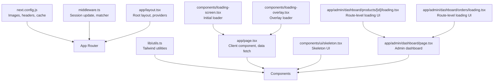
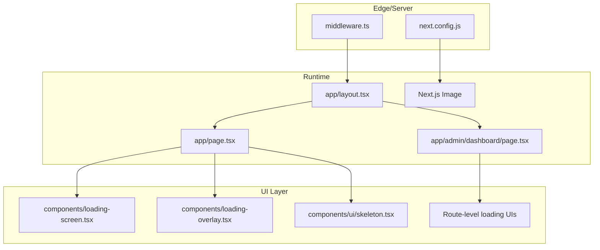
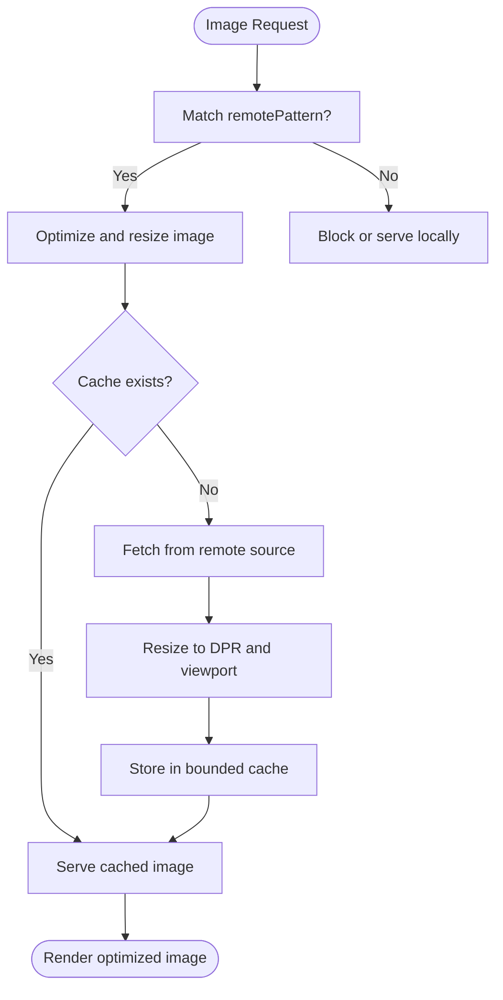
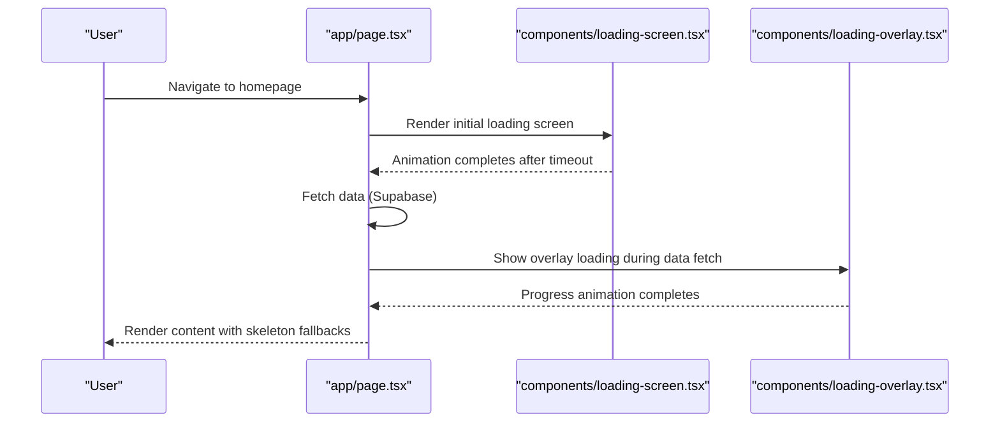
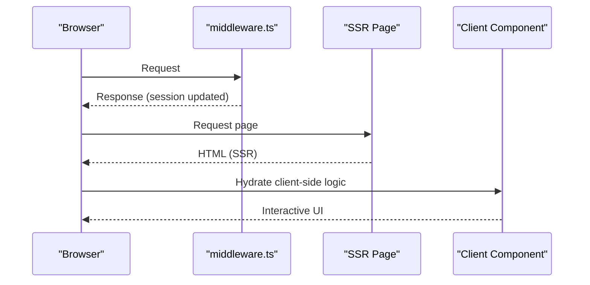
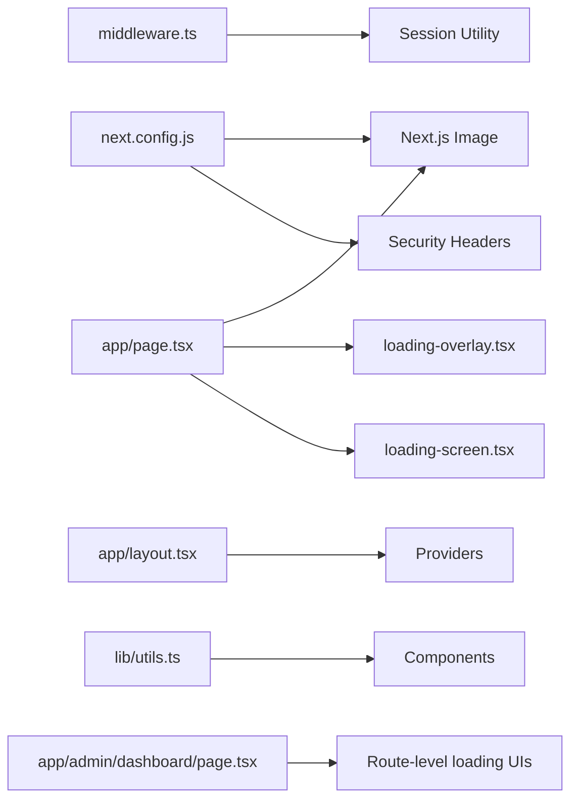

# Performance and Optimization

<cite>
**Referenced Files in This Document**
- [next.config.js](file://next.config.js)
- [package.json](file://package.json)
- [middleware.ts](file://middleware.ts)
- [app/layout.tsx](file://app/layout.tsx)
- [lib/utils.ts](file://lib/utils.ts)
- [app/page.tsx](file://app/page.tsx)
- [components/loading-screen.tsx](file://components/loading-screen.tsx)
- [components/loading-overlay.tsx](file://components/loading-overlay.tsx)
- [components/ui/skeleton.tsx](file://components/ui/skeleton.tsx)
- [app/admin/dashboard/page.tsx](file://app/admin/dashboard/page.tsx)
- [app/admin/dashboard/products/[id]/loading.tsx](file://app/admin/dashboard/products/[id]/loading.tsx)
- [app/admin/dashboard/orders/loading.tsx](file://app/admin/dashboard/orders/loading.tsx)
</cite>

## Table of Contents
1. [Introduction](#introduction)
2. [Project Structure](#project-structure)
3. [Core Components](#core-components)
4. [Architecture Overview](#architecture-overview)
5. [Detailed Component Analysis](#detailed-component-analysis)
6. [Dependency Analysis](#dependency-analysis)
7. [Performance Considerations](#performance-considerations)
8. [Troubleshooting Guide](#troubleshooting-guide)
9. [Conclusion](#conclusion)
10. [Appendices](#appendices)

## Introduction
This document focuses on performance optimization for the Next.js application, covering static generation, server-side rendering, and client-side hydration strategies. It also documents image optimization techniques using the Next.js Image component, responsive images, and lazy-loading strategies. Practical examples demonstrate performance monitoring, bundle analysis, and optimization strategies. The guide includes loading states, skeleton screens, and progressive enhancement techniques, along with best practices for measuring performance, monitoring metrics, and maintaining optimization standards.

## Project Structure
The project follows a conventional Next.js App Router structure with an app/ directory containing routes, layouts, and pages. Performance-related configurations are centralized in next.config.js, while middleware.ts handles session updates and routing. The root layout integrates providers for authentication and notifications, and shared utilities support Tailwind-based styling.

**Diagram sources**
- [next.config.js:1-68](file://next.config.js#L1-L68)
- [middleware.ts:1-11](file://middleware.ts#L1-L11)
- [app/layout.tsx:1-43](file://app/layout.tsx#L1-L43)
- [lib/utils.ts:1-7](file://lib/utils.ts#L1-L7)
- [app/page.tsx:1-164](file://app/page.tsx#L1-L164)
- [components/loading-screen.tsx:1-95](file://components/loading-screen.tsx#L1-L95)
- [components/loading-overlay.tsx:1-117](file://components/loading-overlay.tsx#L1-L117)
- [components/ui/skeleton.tsx:1-16](file://components/ui/skeleton.tsx#L1-L16)
- [app/admin/dashboard/page.tsx:1-286](file://app/admin/dashboard/page.tsx#L1-L286)
- [app/admin/dashboard/products/[id]/loading.tsx:1-20](file://app/admin/dashboard/products/[id]/loading.tsx#L1-L20)
- [app/admin/dashboard/orders/loading.tsx:1-4](file://app/admin/dashboard/orders/loading.tsx#L1-L4)

**Section sources**
- [next.config.js:1-68](file://next.config.js#L1-L68)
- [middleware.ts:1-11](file://middleware.ts#L1-L11)
- [app/layout.tsx:1-43](file://app/layout.tsx#L1-L43)
- [lib/utils.ts:1-7](file://lib/utils.ts#L1-L7)

## Core Components
- Image optimization and caching: next.config.js configures remotePatterns and sets a bounded maximumDiskCacheSize to mitigate cache exhaustion.
- Security and headers: next.config.js injects security headers via the headers() hook.
- Middleware: middleware.ts updates sessions and excludes static assets from middleware processing.
- Root layout: app/layout.tsx defines metadata, fonts, and provider wrappers for authentication and notifications.
- Utilities: lib/utils.ts merges Tailwind classes efficiently.
- Client-side hydration and data fetching: app/page.tsx implements client-side hydration with useEffect and state-driven loading overlays.
- Loading experiences: components/loading-screen.tsx and components/loading-overlay.tsx provide smooth initial and overlay loading states.
- Skeleton UI: components/ui/skeleton.tsx offers a reusable animated skeleton for progressive content rendering.
- Route-level loading UI: app/admin/dashboard/products/[id]/loading.tsx and app/admin/dashboard/orders/loading.tsx define route-level loading skeletons.

**Section sources**
- [next.config.js:22-64](file://next.config.js#L22-L64)
- [middleware.ts:4-10](file://middleware.ts#L4-L10)
- [app/layout.tsx:16-39](file://app/layout.tsx#L16-L39)
- [lib/utils.ts:4-6](file://lib/utils.ts#L4-L6)
- [app/page.tsx:19-85](file://app/page.tsx#L19-L85)
- [components/loading-screen.tsx:10-94](file://components/loading-screen.tsx#L10-L94)
- [components/loading-overlay.tsx:10-116](file://components/loading-overlay.tsx#L10-L116)
- [components/ui/skeleton.tsx:3-12](file://components/ui/skeleton.tsx#L3-L12)
- [app/admin/dashboard/products/[id]/loading.tsx:1-20](file://app/admin/dashboard/products/[id]/loading.tsx#L1-L20)
- [app/admin/dashboard/orders/loading.tsx:1-4](file://app/admin/dashboard/orders/loading.tsx#L1-L4)

## Architecture Overview
The application leverages Next.js’s hybrid rendering model:
- Static generation for content routes (where applicable) and server-side rendering for dynamic routes.
- Client-side hydration for interactive pages such as the homepage and admin dashboards.
- Route-level loading UIs for improved perceived performance during navigation.
- Image optimization through the Next.js Image component with configured remotePatterns and cache limits.

**Diagram sources**
- [middleware.ts:4-10](file://middleware.ts#L4-L10)
- [next.config.js:22-64](file://next.config.js#L22-L64)
- [app/layout.tsx:25-41](file://app/layout.tsx#L25-L41)
- [app/page.tsx:19-85](file://app/page.tsx#L19-L85)
- [app/admin/dashboard/page.tsx:20-130](file://app/admin/dashboard/page.tsx#L20-L130)
- [components/loading-screen.tsx:10-94](file://components/loading-screen.tsx#L10-L94)
- [components/loading-overlay.tsx:10-116](file://components/loading-overlay.tsx#L10-L116)
- [components/ui/skeleton.tsx:3-12](file://components/ui/skeleton.tsx#L3-L12)
- [app/admin/dashboard/products/[id]/loading.tsx:1-20](file://app/admin/dashboard/products/[id]/loading.tsx#L1-L20)
- [app/admin/dashboard/orders/loading.tsx:1-4](file://app/admin/dashboard/orders/loading.tsx#L1-L4)

## Detailed Component Analysis

### Image Optimization and Responsive Images
- Remote image domains: next.config.js defines remotePatterns to allow Next.js Image to optimize images from external CDNs and storage providers.
- Disk cache bounds: maximumDiskCacheSize is set to keep the image cache bounded on disk, preventing excessive disk usage.
- Priority hints: The Next.js Image component is used with priority on critical above-the-fold images to improve Core Web Vitals.
- Lazy loading: The default behavior of Next.js Image is lazy-loading; ensure non-critical images rely on native lazy loading.

**Diagram sources**
- [next.config.js:3-31](file://next.config.js#L3-L31)
- [components/loading-screen.tsx:54-62](file://components/loading-screen.tsx#L54-L62)
- [components/loading-overlay.tsx:92-100](file://components/loading-overlay.tsx#L92-L100)

**Section sources**
- [next.config.js:3-31](file://next.config.js#L3-L31)
- [components/loading-screen.tsx:54-62](file://components/loading-screen.tsx#L54-L62)
- [components/loading-overlay.tsx:92-100](file://components/loading-overlay.tsx#L92-L100)

### Loading States, Skeleton Screens, and Progressive Enhancement
- Initial loading screen: components/loading-screen.tsx animates a progress bar and ensures a minimum completion time to avoid perceived flicker.
- Overlay loading: components/loading-overlay.tsx introduces a delayed visibility threshold to prevent flash-of-unstyled-content and provides smooth transitions.
- Skeleton UI: components/ui/skeleton.tsx provides a reusable animated skeleton for progressive content rendering.
- Route-level loading UI: app/admin/dashboard/products/[id]/loading.tsx and app/admin/dashboard/orders/loading.tsx define route-level loading skeletons for data-intensive pages.

**Diagram sources**
- [app/page.tsx:19-85](file://app/page.tsx#L19-L85)
- [components/loading-screen.tsx:10-94](file://components/loading-screen.tsx#L10-L94)
- [components/loading-overlay.tsx:10-116](file://components/loading-overlay.tsx#L10-L116)

**Section sources**
- [app/page.tsx:19-85](file://app/page.tsx#L19-L85)
- [components/loading-screen.tsx:10-94](file://components/loading-screen.tsx#L10-L94)
- [components/loading-overlay.tsx:10-116](file://components/loading-overlay.tsx#L10-L116)
- [components/ui/skeleton.tsx:3-12](file://components/ui/skeleton.tsx#L3-L12)
- [app/admin/dashboard/products/[id]/loading.tsx:1-20](file://app/admin/dashboard/products/[id]/loading.tsx#L1-L20)
- [app/admin/dashboard/orders/loading.tsx:1-4](file://app/admin/dashboard/orders/loading.tsx#L1-L4)

### Server-Side Rendering and Client-Side Hydration
- Server-side rendering: Dynamic pages like the admin dashboard leverage server-side rendering for initial HTML generation, reducing time-to-first-byte and improving SEO.
- Client-side hydration: app/page.tsx uses "use client" and useEffect to hydrate interactivity after the initial server-rendered HTML is delivered.
- Middleware integration: middleware.ts updates sessions and applies to non-static routes, ensuring SSR benefits for protected or dynamic content.

**Diagram sources**
- [middleware.ts:4-10](file://middleware.ts#L4-L10)
- [app/admin/dashboard/page.tsx:20-130](file://app/admin/dashboard/page.tsx#L20-L130)
- [app/page.tsx:19-85](file://app/page.tsx#L19-L85)

**Section sources**
- [middleware.ts:4-10](file://middleware.ts#L4-L10)
- [app/admin/dashboard/page.tsx:20-130](file://app/admin/dashboard/page.tsx#L20-L130)
- [app/page.tsx:19-85](file://app/page.tsx#L19-L85)

### Code Splitting Strategies
- Route-based code splitting: Next.js automatically splits route code by default. Use dynamic imports for heavy components to reduce initial bundle size.
- Component-level lazy loading: Defer non-critical components using dynamic imports with React.lazy and Suspense boundaries.
- Route-level loading UIs: Implement route-level loading skeletons to maintain perceived performance during navigation.

[No sources needed since this section provides general guidance]

### Data Fetching Optimization
- Minimize payload sizes: Fetch only required fields and apply filters on the server-side (e.g., ordering, equality checks).
- Batch requests: Combine related queries where possible to reduce round-trips.
- Client-side caching: Use React state and local storage judiciously for non-sensitive data to avoid redundant network requests.
- Admin dashboard example: app/admin/dashboard/page.tsx demonstrates structured data fetching with separate counts and lists to balance responsiveness and accuracy.

**Section sources**
- [app/admin/dashboard/page.tsx:47-104](file://app/admin/dashboard/page.tsx#L47-L104)

## Dependency Analysis
- next.config.js depends on environment variables for dynamic remotePatterns and injects security headers globally.
- middleware.ts depends on session utilities and excludes static assets from middleware processing.
- app/layout.tsx integrates providers and global styles/fonts.
- Client components depend on shared utilities for Tailwind class merging.

**Diagram sources**
- [next.config.js:10-20](file://next.config.js#L10-L20)
- [next.config.js:32-64](file://next.config.js#L32-L64)
- [middleware.ts:2-5](file://middleware.ts#L2-L5)
- [app/layout.tsx:33-38](file://app/layout.tsx#L33-L38)
- [lib/utils.ts:4-6](file://lib/utils.ts#L4-L6)
- [app/page.tsx:10-11](file://app/page.tsx#L10-L11)
- [components/loading-overlay.tsx:10-116](file://components/loading-overlay.tsx#L10-L116)
- [components/loading-screen.tsx:10-94](file://components/loading-screen.tsx#L10-L94)
- [app/admin/dashboard/page.tsx:7-8](file://app/admin/dashboard/page.tsx#L7-L8)

**Section sources**
- [next.config.js:10-20](file://next.config.js#L10-L20)
- [next.config.js:32-64](file://next.config.js#L32-L64)
- [middleware.ts:2-5](file://middleware.ts#L2-L5)
- [app/layout.tsx:33-38](file://app/layout.tsx#L33-L38)
- [lib/utils.ts:4-6](file://lib/utils.ts#L4-L6)
- [app/page.tsx:10-11](file://app/page.tsx#L10-L11)
- [components/loading-overlay.tsx:10-116](file://components/loading-overlay.tsx#L10-L116)
- [components/loading-screen.tsx:10-94](file://components/loading-screen.tsx#L10-L94)
- [app/admin/dashboard/page.tsx:7-8](file://app/admin/dashboard/page.tsx#L7-L8)

## Performance Considerations
- Bundle size and code splitting: Prefer route-based splitting and lazy-load heavy components. Monitor bundle composition using Next.js build analyzer.
- Image optimization: Use Next.js Image with configured remotePatterns and bounded cache. Serve appropriately sized images and leverage native lazy loading.
- Rendering strategies: Use server-side rendering for dynamic content and client-side hydration for interactivity. Implement skeleton screens and route-level loading UIs to improve perceived performance.
- Network efficiency: Minimize requests, batch queries, and cache data where appropriate. Leverage middleware for session updates without impacting static assets.
- Monitoring and metrics: Track Core Web Vitals, LCP, FID, and CLS. Use browser devtools and Next.js telemetry to identify regressions.

[No sources needed since this section provides general guidance]

## Troubleshooting Guide
- Large image cache: If encountering cache exhaustion warnings, verify maximumDiskCacheSize and remotePatterns configuration.
- Flash of-unstyled-content: Introduce delayed loading overlays and skeleton screens to stabilize layout shifts.
- Slow initial load: Implement route-level loading UIs and defer non-critical resources. Ensure middleware excludes static assets to reduce overhead.
- Build errors: Review TS strictness settings and ensure environment variables are properly handled in next.config.js.

**Section sources**
- [next.config.js:26-31](file://next.config.js#L26-L31)
- [components/loading-overlay.tsx:15-31](file://components/loading-overlay.tsx#L15-L31)
- [components/ui/skeleton.tsx:3-12](file://components/ui/skeleton.tsx#L3-L12)
- [middleware.ts:8-10](file://middleware.ts#L8-L10)

## Conclusion
By combining Next.js’s static generation, server-side rendering, and client-side hydration with thoughtful image optimization, skeleton screens, and route-level loading UIs, the application achieves strong perceived and actual performance. Centralized configuration in next.config.js and middleware.ts ensures consistent behavior across the application. Adopt continuous monitoring and iterative optimization to maintain high performance standards.

## Appendices
- Practical examples for performance monitoring and bundle analysis:
  - Use Next.js build analyzer to inspect bundle composition and identify oversized dependencies.
  - Measure Core Web Vitals in production and staging environments to track improvements and regressions.
  - Profile long tasks and render durations using browser devtools to locate bottlenecks.
- Best practices checklist:
  - Configure remotePatterns and bounded image cache.
  - Use skeleton screens and route-level loading UIs.
  - Lazy-load heavy components and defer non-critical features.
  - Minimize payload sizes and batch queries.
  - Monitor and iterate on performance metrics regularly.

[No sources needed since this section provides general guidance]