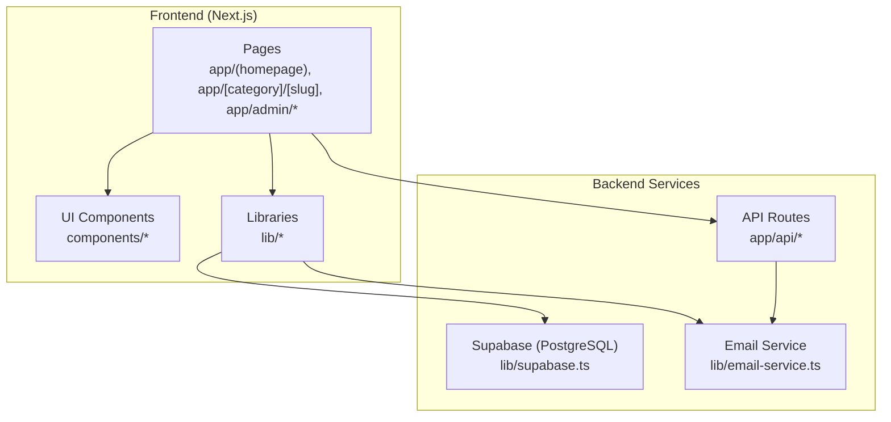
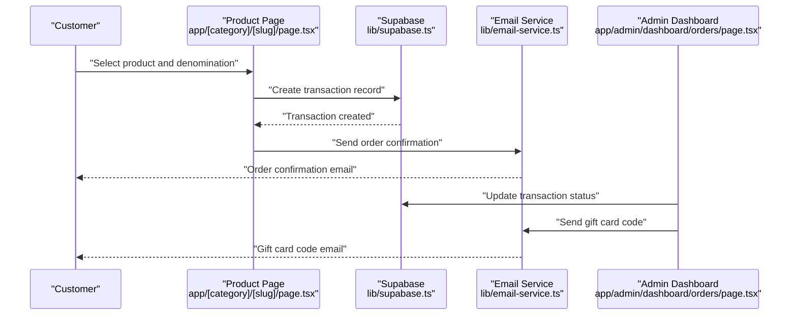
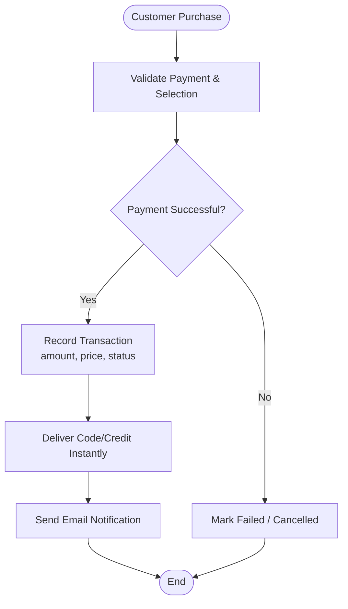
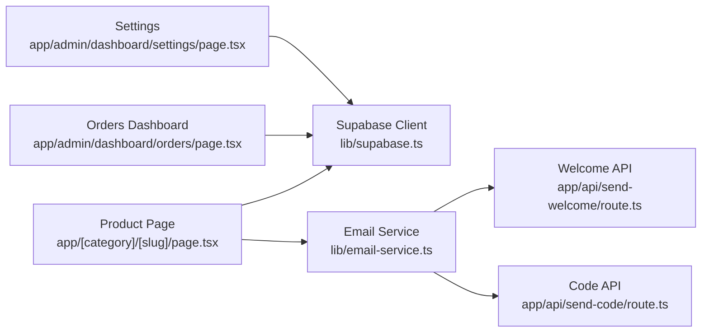
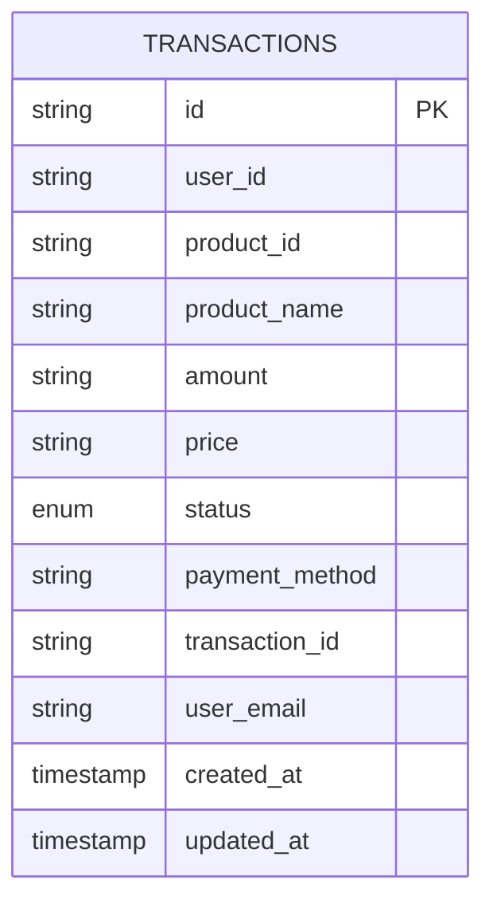

# Business Model

<cite>
**Referenced Files in This Document**
- [README.md](file://README.md)
- [package.json](file://package.json)
- [lib/supabase.ts](file://lib/supabase.ts)
- [lib/product-categories.ts](file://lib/product-categories.ts)
- [lib/email-service.ts](file://lib/email-service.ts)
- [app/[category]/[slug]/page.tsx](file://app/[category]/[slug]/page.tsx)
- [app/admin/dashboard/settings/page.tsx](file://app/admin/dashboard/settings/page.tsx)
- [app/admin/dashboard/orders/page.tsx](file://app/admin/dashboard/orders/page.tsx)
- [app/admin/dashboard/page.tsx](file://app/admin/dashboard/page.tsx)
- [components/footer.tsx](file://components/footer.tsx)
- [app/api/send-welcome/route.ts](file://app/api/send-welcome/route.ts)
- [app/api/send-code/route.ts](file://app/api/send-code/route.ts)
</cite>

## Table of Contents
1. [Introduction](#introduction)
2. [Project Structure](#project-structure)
3. [Core Components](#core-components)
4. [Architecture Overview](#architecture-overview)
5. [Detailed Component Analysis](#detailed-component-analysis)
6. [Dependency Analysis](#dependency-analysis)
7. [Performance Considerations](#performance-considerations)
8. [Troubleshooting Guide](#troubleshooting-guide)
9. [Conclusion](#conclusion)
10. [Appendices](#appendices)

## Introduction
Byiora operates as a marketplace-style digital top-up and gift card platform for Nepal’s gaming and digital goods ecosystem. It acts as an intermediary between gaming platform providers and end customers, enabling instant delivery of digital credits and vouchers without requiring user registration. The platform emphasizes secure payment processing, a streamlined checkout experience, and localized payment methods tailored to the Nepali market.

Key business differentiators include:
- Instant delivery upon payment completion
- No-registration checkout
- Localized payment method support (e.g., eSewa, Khalti, IMEPay, Mobile Banking)
- Secure backend powered by Supabase with row-level security and server-side validations

These capabilities position Byiora to serve both individual consumers and resellers/partners who distribute gaming credits and digital goods.

**Section sources**
- [README.md:1-18](file://README.md#L1-L18)

## Project Structure
The repository is a Next.js application with a clear separation of concerns:
- Frontend pages under app/ handle product browsing, checkout, and admin dashboards
- Shared libraries under lib/ encapsulate Supabase client, product catalog utilities, and email services
- UI primitives under components/ provide reusable elements
- API routes under app/api/ manage automated emails and notifications

**Diagram sources**
- [package.json:11-38](file://package.json#L11-L38)
- [lib/supabase.ts:1-188](file://lib/supabase.ts#L1-L188)
- [lib/email-service.ts:1-126](file://lib/email-service.ts#L1-L126)

**Section sources**
- [package.json:1-51](file://package.json#L1-L51)
- [lib/supabase.ts:1-188](file://lib/supabase.ts#L1-L188)

## Core Components
- Marketplace and Product Catalog
  - Product definitions and categories are managed via Supabase and surfaced to the frontend through a caching utility. The product catalog supports top-ups and digital goods with dynamic denominations and metadata.
- Payment Methods and Checkout
  - Payment methods are centrally managed in Supabase and rendered during checkout. The checkout flow supports guest purchases and integrates QR-based payment instructions for local methods.
- Transactions and Order Management
  - Transactions are persisted with status tracking (Completed, Failed, Processing, Cancelled). Admins can monitor orders, update statuses, and dispatch gift card codes via email.
- Email Automation
  - Automated emails are sent for welcome messages, order confirmations, and gift card delivery. The system falls back to a server-side email route if EmailJS is unavailable.

**Section sources**
- [lib/product-categories.ts:1-300](file://lib/product-categories.ts#L1-L300)
- [lib/supabase.ts:68-184](file://lib/supabase.ts#L68-L184)
- [app/[category]/[slug]/page.tsx:196-200](file://app/[category]/[slug]/page.tsx#L196-L200)
- [app/admin/dashboard/orders/page.tsx:17-37](file://app/admin/dashboard/orders/page.tsx#L17-L37)
- [lib/email-service.ts:75-126](file://lib/email-service.ts#L75-L126)

## Architecture Overview
Byiora’s business architecture centers on a marketplace model:
- Gaming platform providers supply digital credits/vouchers
- Byiora aggregates products and payment methods
- Customers complete purchases with minimal friction
- Upon successful payment, Byiora delivers codes or credits instantly and notifies users via email

**Diagram sources**
- [app/[category]/[slug]/page.tsx:145-200](file://app/[category]/[slug]/page.tsx#L145-L200)
- [lib/supabase.ts:141-184](file://lib/supabase.ts#L141-L184)
- [lib/email-service.ts:75-126](file://lib/email-service.ts#L75-L126)
- [app/admin/dashboard/orders/page.tsx:154-182](file://app/admin/dashboard/orders/page.tsx#L154-L182)

## Detailed Component Analysis

### Marketplace Model and Revenue Streams
- Intermediary Role
  - Byiora acts as a marketplace aggregator, sourcing digital goods and top-ups from platform providers and presenting them to customers.
- Revenue Streams
  - Transaction Fees: A primary revenue lever is a fee taken on successful transactions. The transaction table stores amount and price fields, indicating monetization at the sale level.
  - Premium Features for Sellers: Future enhancements may include optional seller accounts with premium listings, analytics, or promotional tools. These would be introduced via product upgrades and subscription tiers.

**Diagram sources**
- [lib/supabase.ts:141-184](file://lib/supabase.ts#L141-L184)
- [app/admin/dashboard/orders/page.tsx:154-182](file://app/admin/dashboard/orders/page.tsx#L154-L182)

**Section sources**
- [lib/supabase.ts:141-184](file://lib/supabase.ts#L141-L184)
- [app/admin/dashboard/orders/page.tsx:17-37](file://app/admin/dashboard/orders/page.tsx#L17-L37)

### Operational Costs
- Payment Processing Fees
  - Cost of acquiring payments through local methods (e.g., eSewa, Khalti) and international gateways.
- Server Infrastructure
  - Supabase-hosted PostgreSQL and storage, with serverless functions for email automation.
- Customer Support
  - Email-based support and admin-managed notifications for order updates and failures.
- Maintenance and Operations
  - Admin dashboard maintenance, product catalog updates, and payment method management.

Note: Specific cost figures are not present in the repository. Operational budgets and cost breakdowns should be derived from external accounting systems and provider contracts.

**Section sources**
- [lib/supabase.ts:1-188](file://lib/supabase.ts#L1-L188)
- [app/admin/dashboard/settings/page.tsx:78-97](file://app/admin/dashboard/settings/page.tsx#L78-L97)
- [lib/email-service.ts:75-126](file://lib/email-service.ts#L75-L126)

### Target Market and Growth Projections
- Market Focus
  - Nepal’s gaming and digital goods sector, emphasizing mobile gaming top-ups and global platform gift cards.
- Growth Drivers
  - Instant delivery, no-registration checkout, and localized payment methods increase conversion and retention.
- Expansion Opportunities
  - Broaden product categories, introduce seller onboarding, and scale marketing campaigns targeting gamers and resellers.

[No sources needed since this section provides general guidance]

### Partnership Models and Revenue Sharing
- Provider Agreements
  - Providers supply inventory and credentials for credit/voucher issuance. Byiora manages distribution and customer delivery.
- Revenue Sharing
  - Potential arrangement: Byiora retains a fixed or percentage-based fee per transaction, with providers receiving the remainder. This is inferred from the presence of amount and price fields in transactions and the marketplace structure.

[No sources needed since this section analyzes inferred business practices]

### Financial Projections, Break-Even, and Scalability
- Financial Projections
  - Estimate monthly recurring revenue from transaction fees and optional seller subscriptions. Project growth using conversion rate improvements and expanded product catalogs.
- Break-Even Analysis
  - Compute total monthly fixed costs (infrastructure, support, marketing). Divide by average transaction fee margin to estimate units required to break even.
- Scalability
  - Horizontal scaling via Supabase, improved caching for product catalogs, and automated email workflows. Introduce seller accounts and advanced reporting to drive volume.

[No sources needed since this section provides general guidance]

### Competitive Advantages
- Instant Delivery
  - Immediate credit or code delivery post-payment enhances trust and reduces churn.
- No-Registration Checkout
  - Reduces friction and increases conversion rates.
- Local Market Focus
  - Tailored payment methods and messaging improve accessibility and user experience.

**Section sources**
- [README.md:7-10](file://README.md#L7-L10)
- [components/footer.tsx:21-45](file://components/footer.tsx#L21-L45)

### Sustainable Growth and Reinvestment
- Reinvestment Strategy
  - Allocate profits toward platform improvements (UX, payment integrations), customer support, and marketing to acquire new users and providers.
- Examples
  - Enhance product catalog caching, expand payment methods, and automate order notifications to reduce operational overhead while improving reliability.

[No sources needed since this section provides general guidance]

## Dependency Analysis
Byiora’s business logic depends on:
- Supabase for product catalogs, transactions, and payment method configurations
- Email service for customer notifications
- Admin dashboard for order management and operational oversight

**Diagram sources**
- [app/[category]/[slug]/page.tsx:145-200](file://app/[category]/[slug]/page.tsx#L145-L200)
- [app/admin/dashboard/orders/page.tsx:67-103](file://app/admin/dashboard/orders/page.tsx#L67-L103)
- [app/admin/dashboard/settings/page.tsx:78-97](file://app/admin/dashboard/settings/page.tsx#L78-L97)
- [lib/email-service.ts:32-73](file://lib/email-service.ts#L32-L73)
- [app/api/send-welcome/route.ts:43-56](file://app/api/send-welcome/route.ts#L43-L56)
- [app/api/send-code/route.ts:59-66](file://app/api/send-code/route.ts#L59-L66)

**Section sources**
- [lib/supabase.ts:1-188](file://lib/supabase.ts#L1-L188)
- [lib/email-service.ts:1-126](file://lib/email-service.ts#L1-L126)

## Performance Considerations
- Database Efficiency
  - Use indexed queries for transactions and product lookups; leverage caching for product catalogs to minimize latency.
- Email Throughput
  - Batch and queue notifications to avoid timeouts; rely on fallback mechanisms if primary email transport fails.
- Admin Workflows
  - Paginate order lists and apply filters to reduce render time in the admin dashboard.

[No sources needed since this section provides general guidance]

## Troubleshooting Guide
- Transaction Status Updates
  - Admins can update transaction statuses and trigger notifications. Ensure proper permissions and remarks for failed orders.
- Payment Method Management
  - Enable/disable or modify payment methods via the admin settings page. Verify QR uploads and instructions for clarity.
- Email Delivery
  - Confirm EmailJS configuration and fallback routes. Validate recipient addresses and retry mechanisms.

**Section sources**
- [app/admin/dashboard/orders/page.tsx:184-200](file://app/admin/dashboard/orders/page.tsx#L184-L200)
- [app/admin/dashboard/settings/page.tsx:166-181](file://app/admin/dashboard/settings/page.tsx#L166-L181)
- [lib/email-service.ts:75-126](file://lib/email-service.ts#L75-L126)

## Conclusion
Byiora’s business model leverages a marketplace approach to connect gaming platform providers with Nepali customers. Its strengths lie in instant delivery, seamless checkout, and localized payment methods. Revenue primarily derives from transaction fees, with potential for premium seller features. Operational costs are centered around payment processing, infrastructure, and support. Strategic reinvestment in platform improvements and expansion will drive sustainable growth and scalability.

[No sources needed since this section summarizes without analyzing specific files]

## Appendices
- Data Model Overview
  - The transaction table captures sales metadata suitable for revenue tracking and reporting.

**Diagram sources**
- [lib/supabase.ts:141-184](file://lib/supabase.ts#L141-L184)