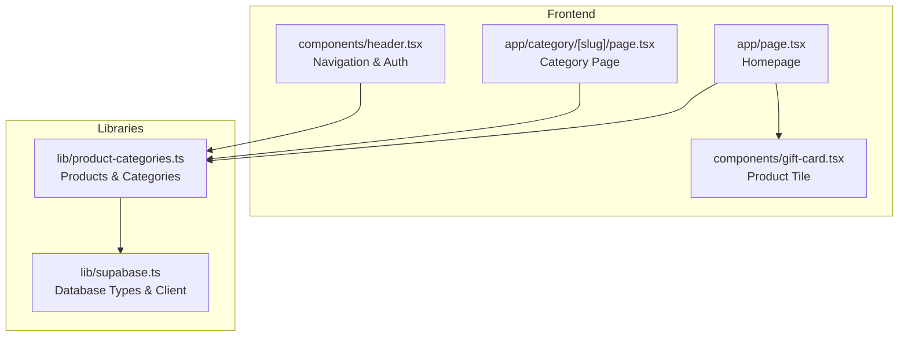
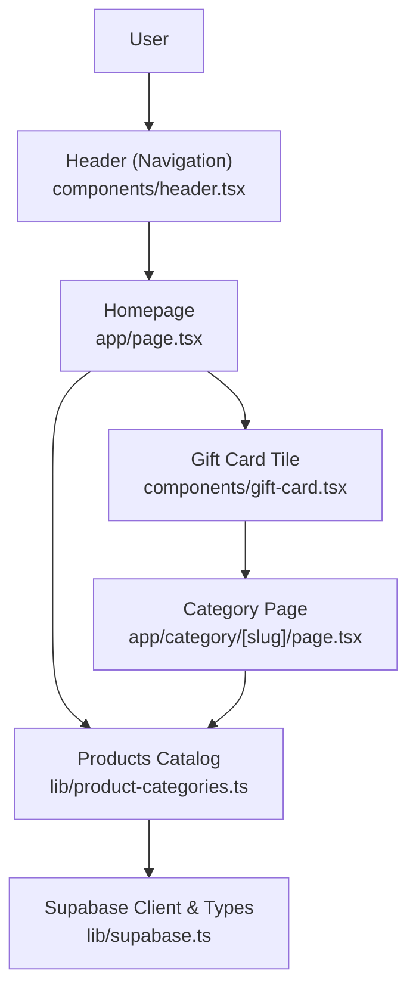
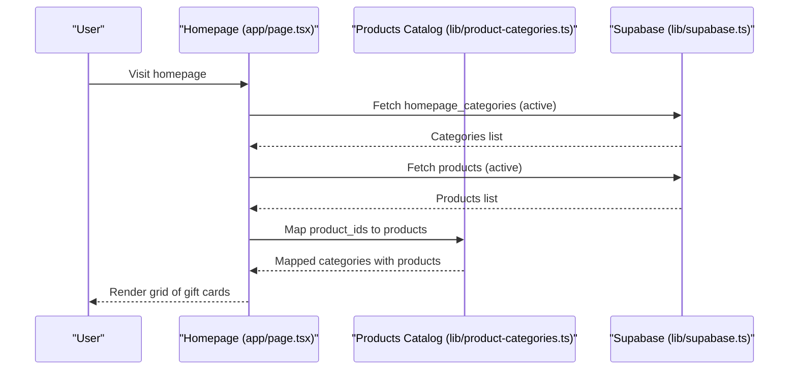
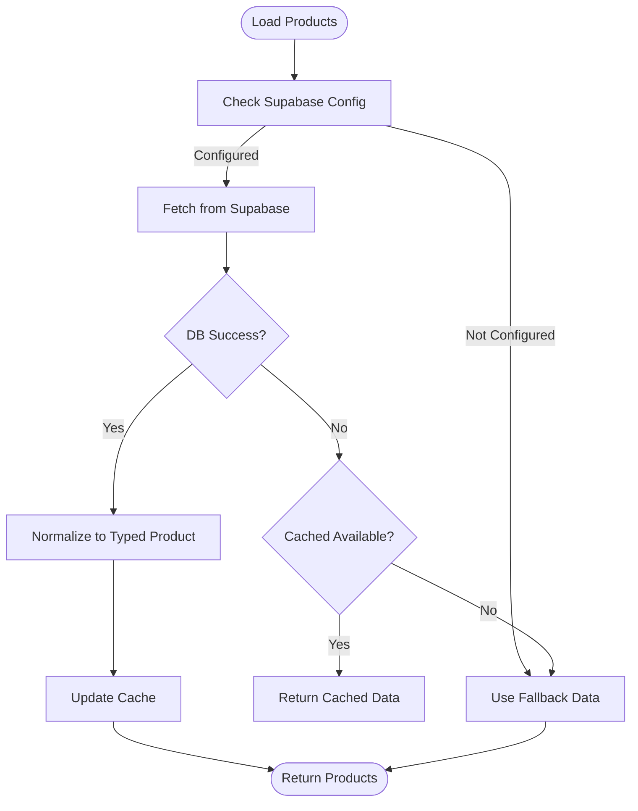
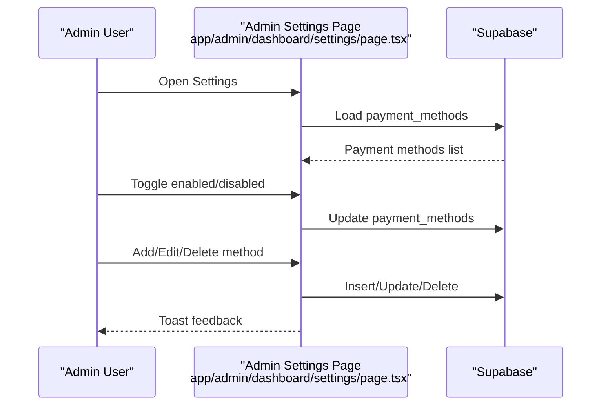
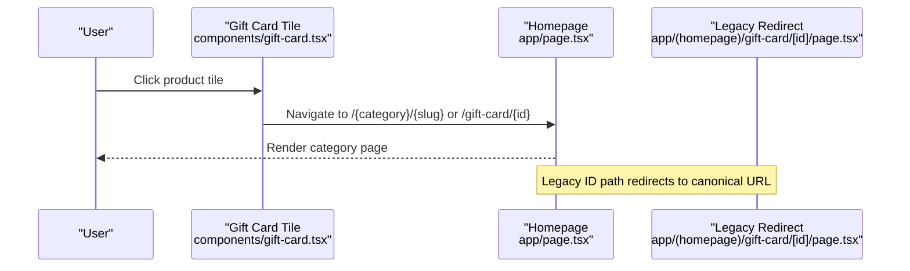
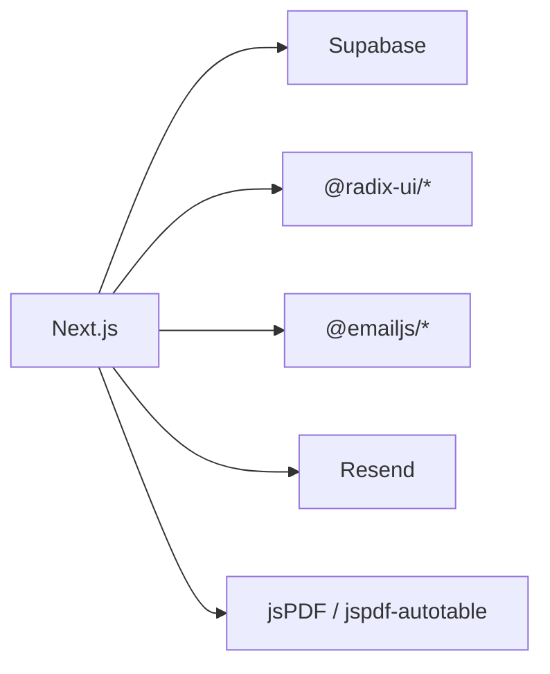

# Introduction

<cite>
**Referenced Files in This Document**
- [README.md](file://README.md)
- [package.json](file://package.json)
- [app/page.tsx](file://app/page.tsx)
- [lib/product-categories.ts](file://lib/product-categories.ts)
- [lib/supabase.ts](file://lib/supabase.ts)
- [components/gift-card.tsx](file://components/gift-card.tsx)
- [components/header.tsx](file://components/header.tsx)
- [app/admin/dashboard/settings/page.tsx](file://app/admin/dashboard/settings/page.tsx)
- [app/(homepage)/gift-card/[id]/page.tsx](file://app/(homepage)/gift-card/[id]/page.tsx)
- [app/category/[slug]/page.tsx](file://app/category/[slug]/page.tsx)
</cite>

## Table of Contents
1. [Introduction](#introduction)
2. [Project Structure](#project-structure)
3. [Core Components](#core-components)
4. [Architecture Overview](#architecture-overview)
5. [Detailed Component Analysis](#detailed-component-analysis)
6. [Dependency Analysis](#dependency-analysis)
7. [Performance Considerations](#performance-considerations)
8. [Troubleshooting Guide](#troubleshooting-guide)
9. [Conclusion](#conclusion)

## Introduction
Byiora is a digital game top-up and gift card platform tailored for gamers in Nepal. Its mission is to deliver game credits and digital vouchers instantly, without requiring user registration, ensuring a frictionless checkout experience powered by secure payment integrations and a modern, responsive frontend.

Key positioning and value:
- Instant delivery of game credits immediately after payment.
- Simple checkout with no login required.
- Secure processing backed by Supabase, Role-Based Security (RLS), and server-side validations.
- Optimized frontend built with Next.js and TypeScript.

Target audience:
- Gamers who want quick access to game credits and gift cards for popular titles in Nepal.

Business model:
- Transaction fee revenue from sales.
- Partnership revenue with gaming platforms and publishers for featured placements and promotional activities.

Supported ecosystems and examples:
- Top-up credits for mobile battle royale titles.
- Gift cards for global platforms.
- Examples visible in the product catalog include Steam, PUBG Mobile, Free Fire, Mobile Legends, and Call of Duty: Mobile Web Store.

Context in the Nepali gaming ecosystem:
- Growing mobile gaming segment with demand for localized, convenient payment methods.
- Byiora bridges the gap by offering instant delivery, convenient payment options, and a streamlined user experience aligned with local preferences.

**Section sources**
- [README.md:1-18](file://README.md#L1-L18)
- [lib/product-categories.ts:123-188](file://lib/product-categories.ts#L123-L188)
- [lib/supabase.ts:10-188](file://lib/supabase.ts#L10-L188)

## Project Structure
High-level structure highlights the frontend pages, shared components, and backend integration via Supabase:
- Pages under app/ define routes for the homepage, categories, gift card redirection, and admin settings.
- Shared UI components under components/ encapsulate reusable elements like the header, gift card tile, and dialogs.
- Business logic for product discovery and caching resides in lib/.

**Diagram sources**
- [app/page.tsx:19-85](file://app/page.tsx#L19-L85)
- [app/category/[slug]/page.tsx:84-192](file://app/category/[slug]/page.tsx#L84-L192)
- [components/header.tsx:19-70](file://components/header.tsx#L19-L70)
- [components/gift-card.tsx:17-67](file://components/gift-card.tsx#L17-L67)
- [lib/product-categories.ts:200-264](file://lib/product-categories.ts#L200-L264)
- [lib/supabase.ts:10-188](file://lib/supabase.ts#L10-L188)

**Section sources**
- [package.json:11-38](file://package.json#L11-L38)
- [app/page.tsx:19-85](file://app/page.tsx#L19-L85)
- [lib/product-categories.ts:200-264](file://lib/product-categories.ts#L200-L264)

## Core Components
- Homepage and product browsing: Loads homepage categories and products, renders tiles, and supports expand/collapse for large categories.
- Product catalog: Centralized product retrieval with caching and fallback logic for offline resilience.
- Header and navigation: Provides site branding, search, notifications, and user/account actions.
- Gift card tile: Renders product tiles with optional ribbon badges and click routing to category/slug-aware URLs.

Practical examples of supported offerings:
- Steam gift cards (multiple denominations).
- PUBG Mobile UC top-ups.
- Free Fire Diamonds.
- Mobile Legends Diamonds.
- Call of Duty: Mobile Web Store credits.

These examples reflect the platform’s focus on popular titles within the Nepali gaming community.

**Section sources**
- [app/page.tsx:26-85](file://app/page.tsx#L26-L85)
- [lib/product-categories.ts:266-283](file://lib/product-categories.ts#L266-L283)
- [lib/product-categories.ts:123-188](file://lib/product-categories.ts#L123-L188)
- [components/gift-card.tsx:17-67](file://components/gift-card.tsx#L17-L67)
- [components/header.tsx:19-70](file://components/header.tsx#L19-L70)

## Architecture Overview
Byiora’s architecture centers on a Next.js frontend with a Supabase backend. The frontend fetches product catalogs and categories, while the backend stores product metadata, payment configurations, and transaction records. Admin settings manage payment methods and QR assets.

**Diagram sources**
- [components/header.tsx:19-70](file://components/header.tsx#L19-L70)
- [app/page.tsx:26-85](file://app/page.tsx#L26-L85)
- [lib/product-categories.ts:200-264](file://lib/product-categories.ts#L200-L264)
- [lib/supabase.ts:10-188](file://lib/supabase.ts#L10-L188)
- [app/category/[slug]/page.tsx:84-192](file://app/category/[slug]/page.tsx#L84-L192)
- [components/gift-card.tsx:17-67](file://components/gift-card.tsx#L17-L67)

## Detailed Component Analysis

### Homepage and Category Browsing
The homepage aggregates active categories and products, maps product IDs to category lists, and renders a grid of gift card tiles. Users can expand to view more items per category. Category pages mirror this pattern with fallbacks when Supabase is unavailable.

**Diagram sources**
- [app/page.tsx:26-58](file://app/page.tsx#L26-L58)
- [lib/product-categories.ts:200-264](file://lib/product-categories.ts#L200-L264)
- [lib/supabase.ts:10-188](file://lib/supabase.ts#L10-L188)

**Section sources**
- [app/page.tsx:26-85](file://app/page.tsx#L26-L85)
- [app/category/[slug]/page.tsx:84-192](file://app/category/[slug]/page.tsx#L84-L192)
- [lib/product-categories.ts:200-264](file://lib/product-categories.ts#L200-L264)

### Product Catalog and Fallback Logic
The product catalog module centralizes product retrieval, caching, and fallback behavior. It normalizes Supabase data into a typed interface and exposes helpers to fetch featured gift cards, web store games, and individual products by ID or slug.

**Diagram sources**
- [lib/product-categories.ts:200-264](file://lib/product-categories.ts#L200-L264)

**Section sources**
- [lib/product-categories.ts:200-264](file://lib/product-categories.ts#L200-L264)

### Payment Methods and Admin Settings
Admin settings manage payment methods and QR assets, enabling dynamic configuration of payment options surfaced to users. Payment method entries include name, logo, instructions, and QR image URLs.

**Diagram sources**
- [app/admin/dashboard/settings/page.tsx:78-97](file://app/admin/dashboard/settings/page.tsx#L78-L97)
- [app/admin/dashboard/settings/page.tsx:166-181](file://app/admin/dashboard/settings/page.tsx#L166-L181)
- [app/admin/dashboard/settings/page.tsx:233-268](file://app/admin/dashboard/settings/page.tsx#L233-L268)

**Section sources**
- [app/admin/dashboard/settings/page.tsx:78-97](file://app/admin/dashboard/settings/page.tsx#L78-L97)
- [app/admin/dashboard/settings/page.tsx:166-181](file://app/admin/dashboard/settings/page.tsx#L166-L181)
- [app/admin/dashboard/settings/page.tsx:233-268](file://app/admin/dashboard/settings/page.tsx#L233-L268)

### Gift Card Tile Routing
The gift card tile component renders product tiles and routes clicks to category-aware URLs. A legacy route handles ID-based URLs and redirects to the canonical category/slug path.

**Diagram sources**
- [components/gift-card.tsx:17-67](file://components/gift-card.tsx#L17-L67)
- [app/page.tsx:99-106](file://app/page.tsx#L99-L106)
- [app/(homepage)/gift-card/[id]/page.tsx:4-13](file://app/(homepage)/gift-card/[id]/page.tsx#L4-L13)

**Section sources**
- [components/gift-card.tsx:17-67](file://components/gift-card.tsx#L17-L67)
- [app/page.tsx:99-106](file://app/page.tsx#L99-L106)
- [app/(homepage)/gift-card/[id]/page.tsx:4-13](file://app/(homepage)/gift-card/[id]/page.tsx#L4-L13)

## Dependency Analysis
Primary dependencies and their roles:
- Next.js: Fullstack React framework powering pages and SSR.
- Supabase: Backend-as-a-service for database, auth, and storage.
- Tailwind CSS: Utility-first styling for responsive UI.
- Radix UI: Accessible, headless UI primitives.
- Email and notification libraries: For automated receipts and alerts.

**Diagram sources**
- [package.json:11-38](file://package.json#L11-L38)

**Section sources**
- [package.json:11-38](file://package.json#L11-L38)

## Performance Considerations
- Client-side caching: Product catalog caches results for a fixed duration to reduce repeated network requests.
- Lazy loading: Images and heavy components are loaded conditionally to improve initial render performance.
- Minimal re-renders: State updates are scoped to necessary components to avoid unnecessary re-computation.

[No sources needed since this section provides general guidance]

## Troubleshooting Guide
Common scenarios and resolutions:
- Supabase not configured: The product catalog falls back to predefined data to keep the UI functional.
- Network errors: On fetch failures, the system attempts to serve cached data; if none exists, it falls back to predefined data.
- Payment method updates: Admin changes propagate to the storefront immediately; verify QR uploads succeeded and URLs are accessible.

**Section sources**
- [lib/product-categories.ts:200-264](file://lib/product-categories.ts#L200-L264)
- [app/admin/dashboard/settings/page.tsx:270-305](file://app/admin/dashboard/settings/page.tsx#L270-L305)

## Conclusion
Byiora delivers on its promise to bring instant, secure, and convenient access to game credits and gift cards for Nepali gamers. Its architecture balances simplicity and scalability, leveraging Supabase for backend needs and a modern frontend for user experience. With a curated selection of popular titles and flexible payment options, Byiora is positioned to serve the growing mobile gaming market in Nepal effectively.

[No sources needed since this section summarizes without analyzing specific files]