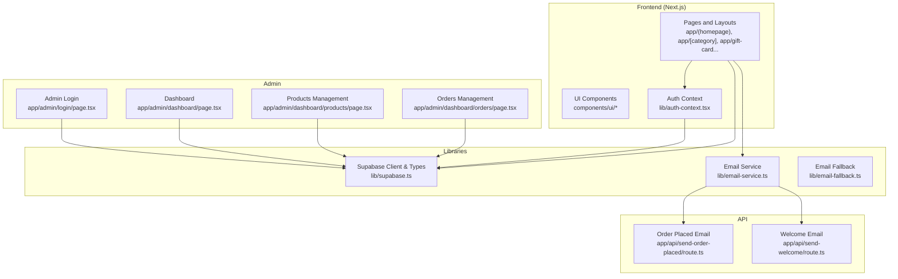
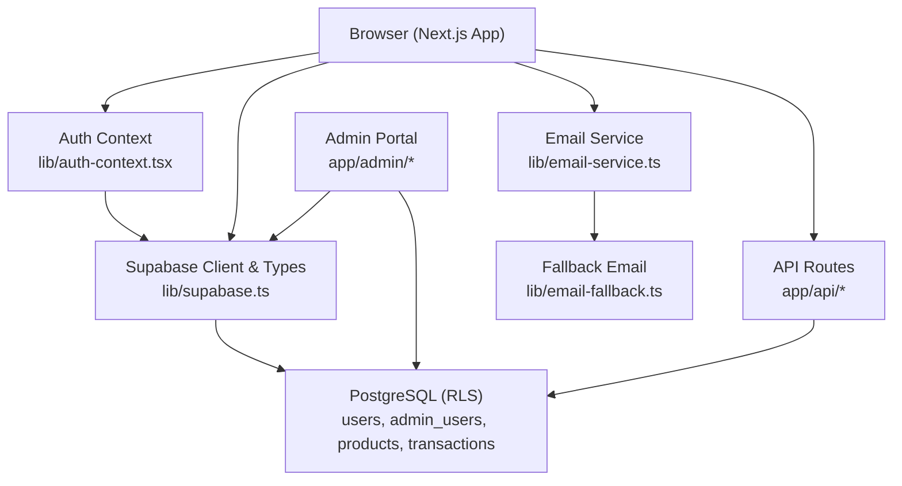
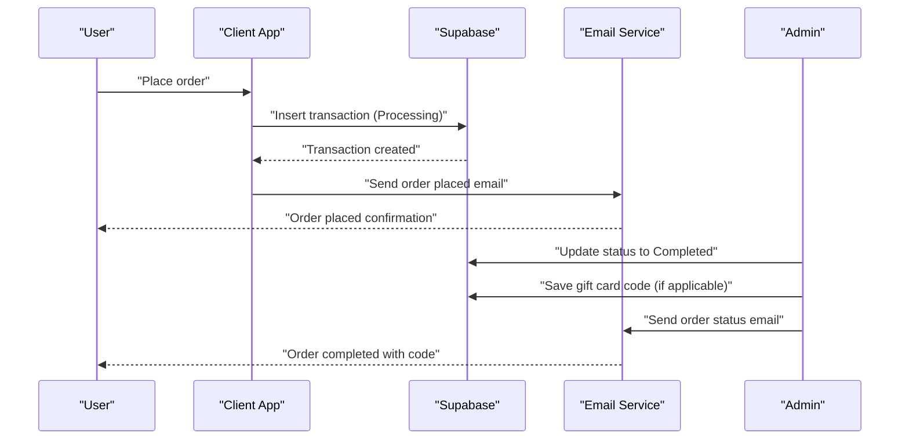
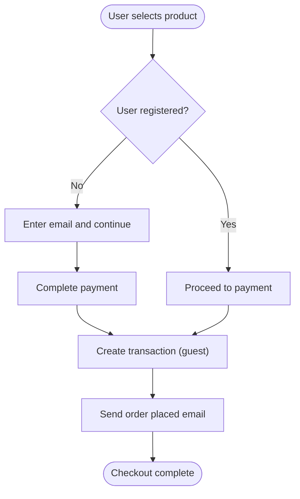
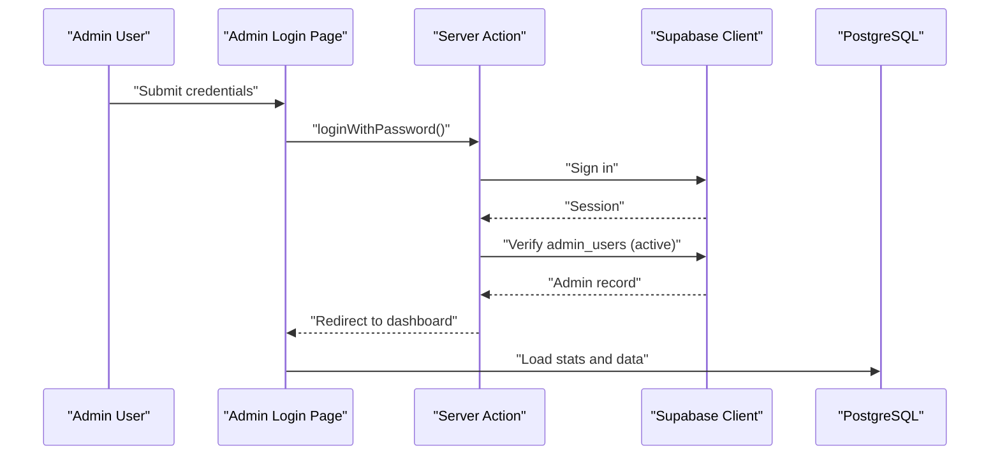
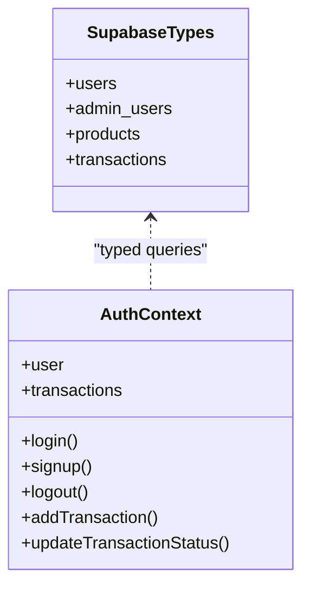
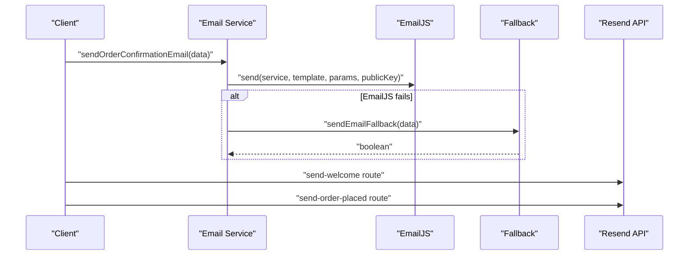
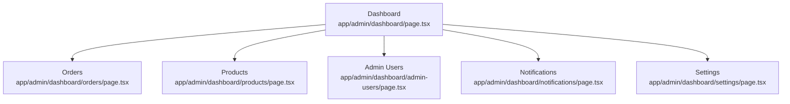
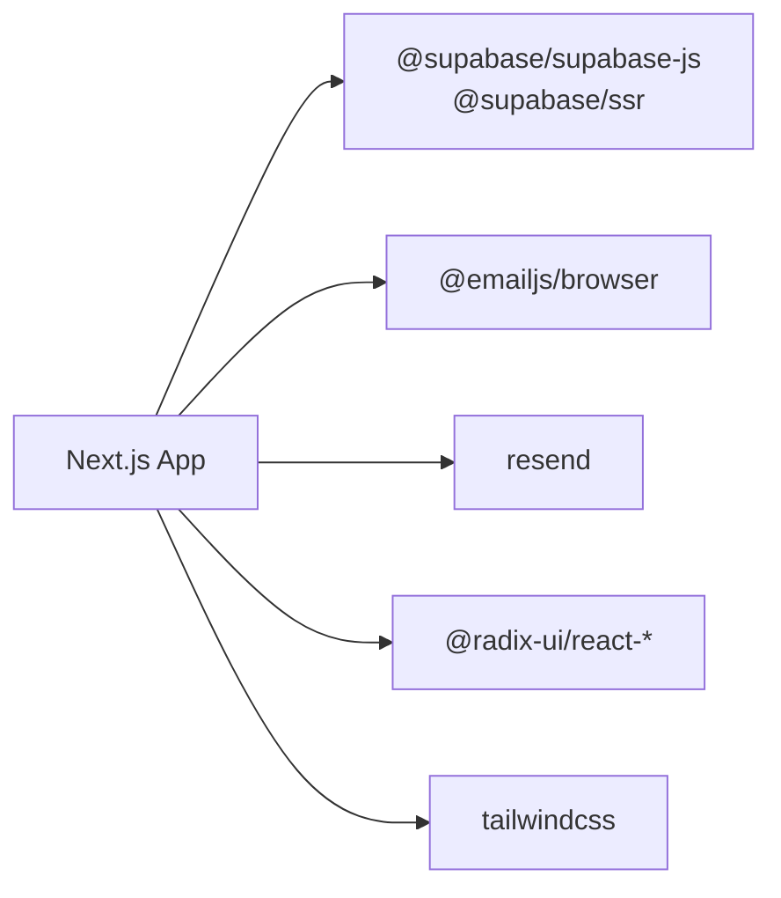

# Key Features

<cite>
**Referenced Files in This Document**
- [README.md](file://README.md)
- [package.json](file://package.json)
- [lib/supabase.ts](file://lib/supabase.ts)
- [lib/email-service.ts](file://lib/email-service.ts)
- [lib/email-fallback.ts](file://lib/email-fallback.ts)
- [lib/auth-context.tsx](file://lib/auth-context.tsx)
- [components/sign-in-form.tsx](file://components/sign-in-form.tsx)
- [app/admin/login/page.tsx](file://app/admin/login/page.tsx)
- [app/admin/dashboard/page.tsx](file://app/admin/dashboard/page.tsx)
- [app/admin/dashboard/products/page.tsx](file://app/admin/dashboard/products/page.tsx)
- [app/admin/dashboard/orders/page.tsx](file://app/admin/dashboard/orders/page.tsx)
- [app/actions/customisation.ts](file://app/actions/customisation.ts)
- [app/api/send-order-placed/route.ts](file://app/api/send-order-placed/route.ts)
- [app/api/send-welcome/route.ts](file://app/api/send-welcome/route.ts)
</cite>

## Table of Contents
1. [Introduction](#introduction)
2. [Project Structure](#project-structure)
3. [Core Components](#core-components)
4. [Architecture Overview](#architecture-overview)
5. [Detailed Component Analysis](#detailed-component-analysis)
6. [Dependency Analysis](#dependency-analysis)
7. [Performance Considerations](#performance-considerations)
8. [Troubleshooting Guide](#troubleshooting-guide)
9. [Conclusion](#conclusion)

## Introduction
Byiora is a digital game top-up and voucher platform for Nepal designed for speed and security. Its key features include:
- Instant delivery of game credits immediately after payment
- No-registration checkout to reduce friction
- Secure processing powered by Supabase, Row Level Security (RLS), and server-side validations
- Optimized frontend built with Next.js and TypeScript
- Dual-service email notification system for reliable delivery
- Admin dashboard for order and product management

These capabilities combine to deliver a seamless gaming experience from selection to credit delivery.

**Section sources**
- [README.md:1-18](file://README.md#L1-L18)

## Project Structure
The project follows a Next.js app directory structure with a clear separation of:
- Frontend pages and components under app/
- Shared libraries under lib/
- Admin dashboard under app/admin/
- API routes under app/api/

**Diagram sources**
- [lib/supabase.ts:1-188](file://lib/supabase.ts#L1-L188)
- [lib/email-service.ts:1-126](file://lib/email-service.ts#L1-L126)
- [lib/email-fallback.ts:1-31](file://lib/email-fallback.ts#L1-L31)
- [lib/auth-context.tsx:1-374](file://lib/auth-context.tsx#L1-L374)
- [app/admin/login/page.tsx:1-145](file://app/admin/login/page.tsx#L1-L145)
- [app/admin/dashboard/page.tsx:1-286](file://app/admin/dashboard/page.tsx#L1-L286)
- [app/admin/dashboard/products/page.tsx:1-254](file://app/admin/dashboard/products/page.tsx#L1-L254)
- [app/admin/dashboard/orders/page.tsx:1-643](file://app/admin/dashboard/orders/page.tsx#L1-L643)
- [app/api/send-order-placed/route.ts:1-101](file://app/api/send-order-placed/route.ts#L1-L101)
- [app/api/send-welcome/route.ts:1-80](file://app/api/send-welcome/route.ts#L1-L80)

**Section sources**
- [README.md:1-18](file://README.md#L1-L18)
- [package.json:1-51](file://package.json#L1-L51)

## Core Components
- Supabase integration for database, auth, and RLS
- Auth context enabling optional user sessions and guest transactions
- Email service with dual delivery (primary and fallback)
- Admin dashboard for managing products, orders, and notifications
- Server actions for secure admin operations

**Section sources**
- [lib/supabase.ts:1-188](file://lib/supabase.ts#L1-L188)
- [lib/auth-context.tsx:1-374](file://lib/auth-context.tsx#L1-L374)
- [lib/email-service.ts:1-126](file://lib/email-service.ts#L1-L126)
- [app/admin/dashboard/page.tsx:1-286](file://app/admin/dashboard/page.tsx#L1-L286)

## Architecture Overview
The system is built on a modern stack with Supabase as the backend foundation. Supabase provides:
- PostgreSQL relational data model
- Authentication and session management
- Real-time subscriptions and Row Level Security (RLS)
- Edge Functions and serverless APIs

**Diagram sources**
- [lib/supabase.ts:1-188](file://lib/supabase.ts#L1-L188)
- [lib/auth-context.tsx:1-374](file://lib/auth-context.tsx#L1-L374)
- [lib/email-service.ts:1-126](file://lib/email-service.ts#L1-L126)
- [lib/email-fallback.ts:1-31](file://lib/email-fallback.ts#L1-L31)
- [app/admin/dashboard/page.tsx:1-286](file://app/admin/dashboard/page.tsx#L1-L286)
- [app/api/send-order-placed/route.ts:1-101](file://app/api/send-order-placed/route.ts#L1-L101)
- [app/api/send-welcome/route.ts:1-80](file://app/api/send-welcome/route.ts#L1-L80)

## Detailed Component Analysis

### Instant Delivery System
Instant delivery ensures users receive credits immediately after payment completion. The flow:
- User selects a product and initiates payment
- Payment provider confirms transaction
- Backend creates a transaction record with status “Processing”
- Admin updates status to “Completed” via the admin portal
- Email confirmation is sent (order placed and order status)
- For digital goods, the admin saves the gift card code and sends it to the user

**Diagram sources**
- [lib/auth-context.tsx:240-323](file://lib/auth-context.tsx#L240-L323)
- [app/admin/dashboard/orders/page.tsx:184-251](file://app/admin/dashboard/orders/page.tsx#L184-L251)
- [app/api/send-order-placed/route.ts:19-101](file://app/api/send-order-placed/route.ts#L19-L101)
- [app/api/send-order-status/route.ts](file://app/api/send-order-status/route.ts)

Practical example:
- A user pays for a digital good and receives an order placed email instantly.
- Admin marks the order as completed and sends the gift card code via email.

**Section sources**
- [lib/auth-context.tsx:240-323](file://lib/auth-context.tsx#L240-L323)
- [app/admin/dashboard/orders/page.tsx:184-251](file://app/admin/dashboard/orders/page.tsx#L184-L251)
- [app/api/send-order-placed/route.ts:19-101](file://app/api/send-order-placed/route.ts#L19-L101)

### No-Registration Checkout
The checkout supports guest purchases without requiring user registration:
- Guest users can place orders with an email and optional metadata
- Transactions are stored with user_email and guest_user_data
- Optional user registration later allows linking past transactions

**Diagram sources**
- [lib/auth-context.tsx:240-323](file://lib/auth-context.tsx#L240-L323)
- [components/sign-in-form.tsx:18-82](file://components/sign-in-form.tsx#L18-L82)

Practical example:
- A guest user enters an email, completes payment, and receives an order confirmation email without signing up.

**Section sources**
- [lib/auth-context.tsx:240-323](file://lib/auth-context.tsx#L240-L323)
- [components/sign-in-form.tsx:18-82](file://components/sign-in-form.tsx#L18-L82)

### Secure Processing with Supabase, RLS, and Server-Side Validations
Security is enforced through:
- Supabase client initialization and typed database interfaces
- Server actions for admin operations
- Admin login checks against admin_users table
- Server-side email routes with input sanitization

**Diagram sources**
- [app/admin/login/page.tsx:23-61](file://app/admin/login/page.tsx#L23-L61)
- [lib/supabase.ts:1-188](file://lib/supabase.ts#L1-L188)
- [app/actions/customisation.ts:6-13](file://app/actions/customisation.ts#L6-L13)

Practical example:
- Admin logs in, and the system verifies their role and active status before granting access.

**Section sources**
- [app/admin/login/page.tsx:23-61](file://app/admin/login/page.tsx#L23-L61)
- [lib/supabase.ts:1-188](file://lib/supabase.ts#L1-L188)
- [app/actions/customisation.ts:6-13](file://app/actions/customisation.ts#L6-L13)

### Optimized Frontend with Next.js and TypeScript
The frontend leverages Next.js features for performance and reliability:
- Strong typing with TypeScript interfaces for Supabase tables
- Client-side auth context for user/session state
- UI components from Radix UI and Tailwind-based design system
- Efficient data fetching and caching patterns

**Diagram sources**
- [lib/supabase.ts:10-188](file://lib/supabase.ts#L10-L188)
- [lib/auth-context.tsx:30-47](file://lib/auth-context.tsx#L30-L47)

Practical example:
- The auth context initializes from Supabase session and loads user transactions for both registered and guest users.

**Section sources**
- [lib/supabase.ts:10-188](file://lib/supabase.ts#L10-L188)
- [lib/auth-context.tsx:51-127](file://lib/auth-context.tsx#L51-L127)

### Email Notification System with Dual-Service Implementation
The email system ensures reliable delivery:
- Primary: EmailJS with a configurable service/template/public key
- Fallback: Local fallback function logging and simulating delivery
- Server-side routes for order placed and welcome emails with basic sanitization

**Diagram sources**
- [lib/email-service.ts:32-125](file://lib/email-service.ts#L32-L125)
- [lib/email-fallback.ts:3-30](file://lib/email-fallback.ts#L3-L30)
- [app/api/send-welcome/route.ts:18-79](file://app/api/send-welcome/route.ts#L18-L79)
- [app/api/send-order-placed/route.ts:19-101](file://app/api/send-order-placed/route.ts#L19-L101)

Practical example:
- On order placement, the system attempts EmailJS; if unavailable, it falls back to the local method and logs the data.

**Section sources**
- [lib/email-service.ts:32-125](file://lib/email-service.ts#L32-L125)
- [lib/email-fallback.ts:3-30](file://lib/email-fallback.ts#L3-L30)
- [app/api/send-welcome/route.ts:18-79](file://app/api/send-welcome/route.ts#L18-L79)
- [app/api/send-order-placed/route.ts:19-101](file://app/api/send-order-placed/route.ts#L19-L101)

### Admin Dashboard: Order and Product Management
The admin dashboard provides:
- Overview statistics (users, products, orders, revenue)
- Order management with filtering, pagination, and status updates
- Product management with add/edit/delete and activation toggles
- Notifications and quick actions for efficient operations

**Diagram sources**
- [app/admin/dashboard/page.tsx:20-286](file://app/admin/dashboard/page.tsx#L20-L286)
- [app/admin/dashboard/orders/page.tsx:39-643](file://app/admin/dashboard/orders/page.tsx#L39-L643)
- [app/admin/dashboard/products/page.tsx:25-254](file://app/admin/dashboard/products/page.tsx#L25-L254)

Practical example:
- Admin reviews recent orders, updates status to Completed or Failed, and sends notifications and emails accordingly.

**Section sources**
- [app/admin/dashboard/page.tsx:20-286](file://app/admin/dashboard/page.tsx#L20-L286)
- [app/admin/dashboard/orders/page.tsx:39-643](file://app/admin/dashboard/orders/page.tsx#L39-L643)
- [app/admin/dashboard/products/page.tsx:25-254](file://app/admin/dashboard/products/page.tsx#L25-L254)

## Dependency Analysis
Key dependencies and their roles:
- Supabase client and JS SDK for database and auth
- EmailJS and Resend for email delivery
- Radix UI primitives for accessible UI components
- Tailwind CSS for styling and responsive design

**Diagram sources**
- [package.json:11-38](file://package.json#L11-L38)

**Section sources**
- [package.json:11-38](file://package.json#L11-L38)

## Performance Considerations
- Use Supabase’s edge functions and server actions to minimize client-side logic
- Optimize database queries with appropriate indexes and RLS policies
- Leverage Next.js static generation and caching for non-sensitive pages
- Minimize payload sizes for email templates and avoid unnecessary re-renders in admin dashboards

## Troubleshooting Guide
Common issues and resolutions:
- EmailJS not configured: The system logs a warning and attempts the fallback method automatically.
- Invalid email addresses: Validation prevents sending to malformed emails.
- Admin login failures: Ensure the user exists in admin_users with active status.
- Transaction status updates: Admin roles restrict certain actions; verify permissions before attempting updates.

**Section sources**
- [lib/email-service.ts:77-80](file://lib/email-service.ts#L77-L80)
- [lib/email-service.ts:82-86](file://lib/email-service.ts#L82-L86)
- [app/admin/login/page.tsx:47-52](file://app/admin/login/page.tsx#L47-L52)
- [app/admin/dashboard/orders/page.tsx:184-189](file://app/admin/dashboard/orders/page.tsx#L184-L189)

## Conclusion
Byiora’s key features—instant delivery, no-registration checkout, secure Supabase-powered processing, optimized Next.js frontend, robust dual-email delivery, and a comprehensive admin dashboard—work together to provide a fast, secure, and user-friendly gaming top-up experience. These components are modular, maintainable, and ready for scaling.