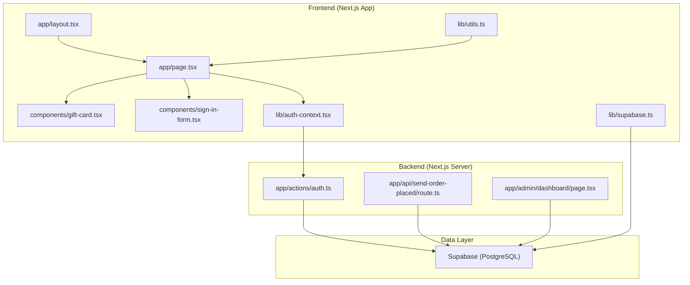
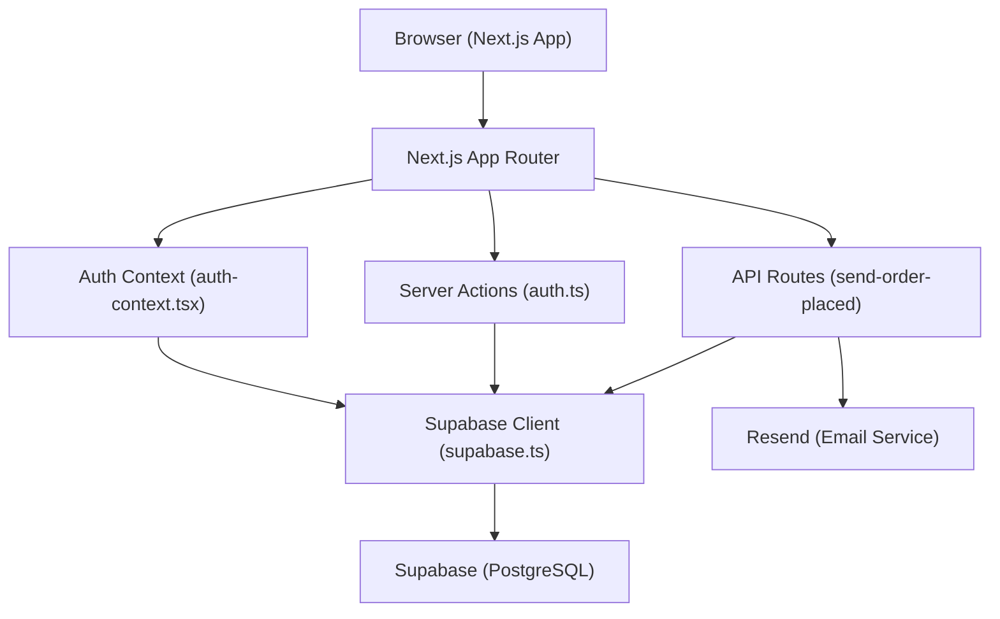
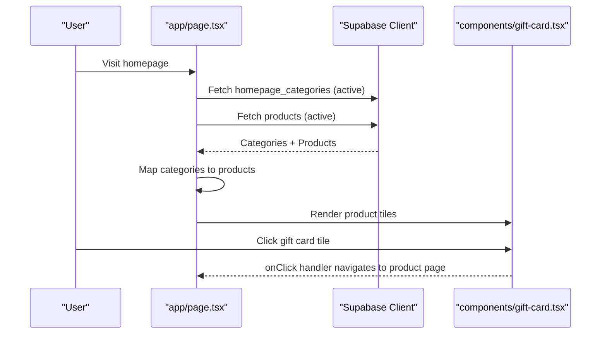
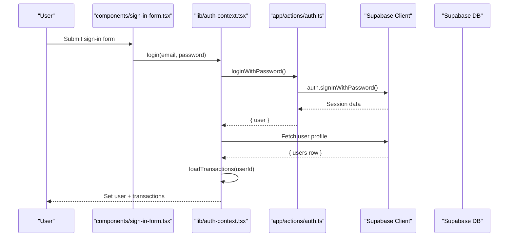
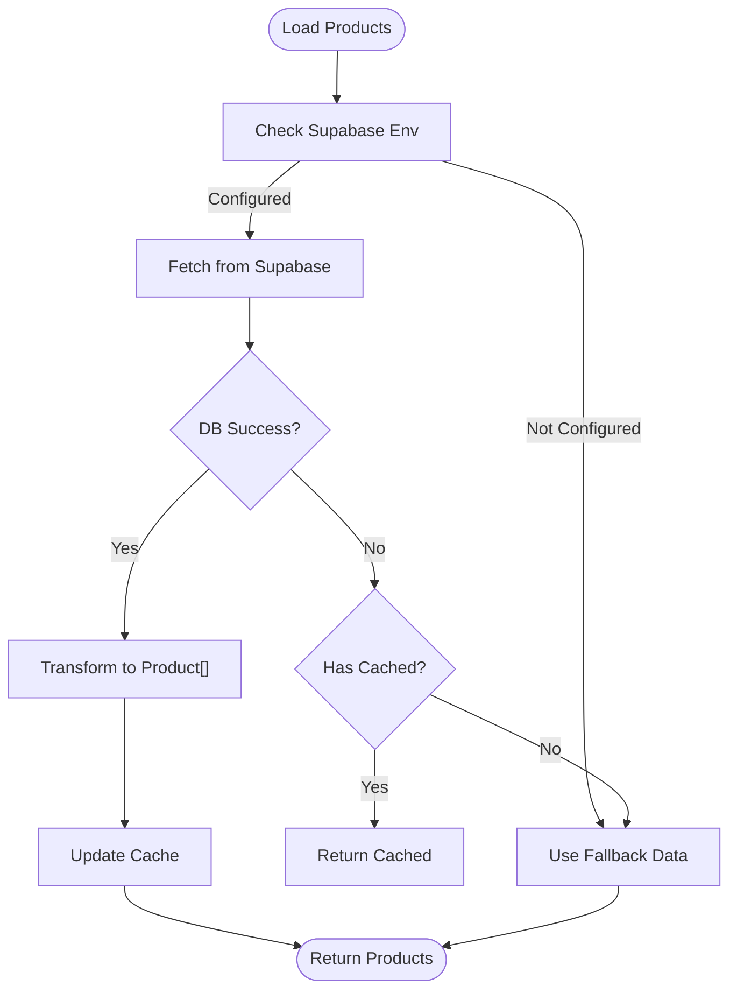
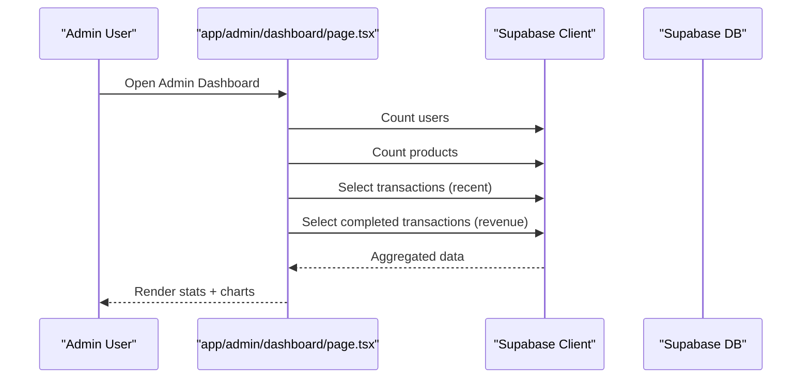
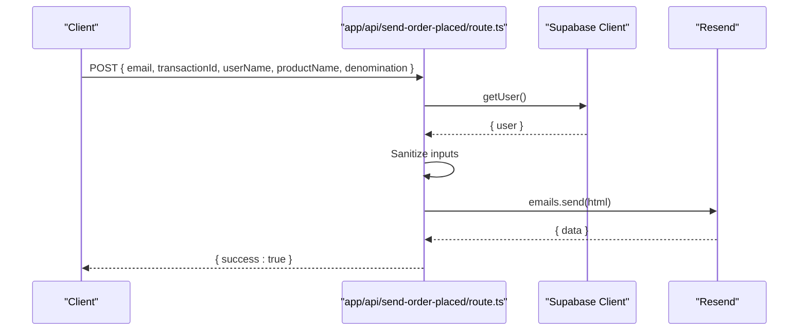
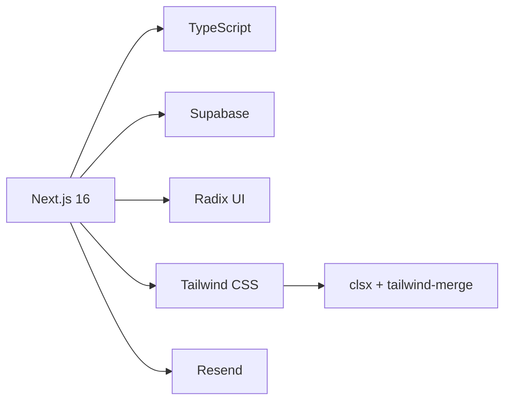
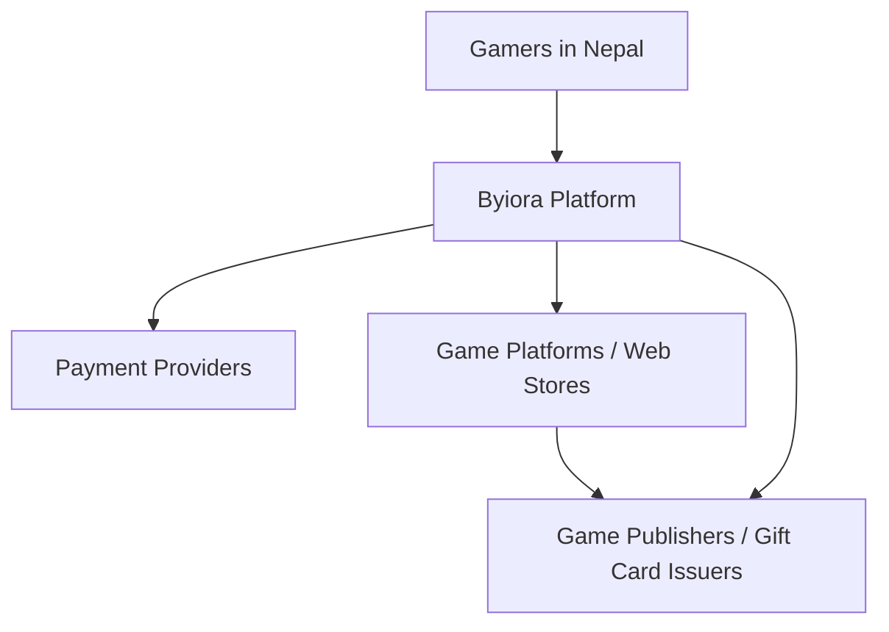

# Project Overview

<cite>
**Referenced Files in This Document**
- [README.md](file://README.md)
- [package.json](file://package.json)
- [next.config.js](file://next.config.js)
- [tailwind.config.ts](file://tailwind.config.ts)
- [lib/supabase.ts](file://lib/supabase.ts)
- [lib/auth-context.tsx](file://lib/auth-context.tsx)
- [lib/product-categories.ts](file://lib/product-categories.ts)
- [lib/utils.ts](file://lib/utils.ts)
- [app/layout.tsx](file://app/layout.tsx)
- [app/page.tsx](file://app/page.tsx)
- [app/(homepage)/gift-card/[id]/page.tsx](file://app/(homepage)/gift-card/[id]/page.tsx)
- [app/api/send-order-placed/route.ts](file://app/api/send-order-placed/route.ts)
- [components/gift-card.tsx](file://components/gift-card.tsx)
- [components/sign-in-form.tsx](file://components/sign-in-form.tsx)
- [app/admin/dashboard/page.tsx](file://app/admin/dashboard/page.tsx)
- [app/actions/auth.ts](file://app/actions/auth.ts)
</cite>

## Table of Contents
1. [Introduction](#introduction)
2. [Project Structure](#project-structure)
3. [Core Components](#core-components)
4. [Architecture Overview](#architecture-overview)
5. [Detailed Component Analysis](#detailed-component-analysis)
6. [Dependency Analysis](#dependency-analysis)
7. [Performance Considerations](#performance-considerations)
8. [Troubleshooting Guide](#troubleshooting-guide)
9. [Conclusion](#conclusion)
10. [Appendices](#appendices)

## Introduction
Byiora is a digital game top-up platform for Nepal designed to deliver digital game credits and vouchers instantly, with no-registration checkout. The platform targets gamers and users who want immediate access to premium game currencies and digital gift cards without the friction of account creation. It positions itself as a voucher marketplace within the broader gaming ecosystem, enabling instant delivery of game credits and digital goods.

Key value propositions:
- Instant delivery of digital game credits and vouchers after payment.
- Simple checkout with no login required for guest purchases.
- Secure processing powered by Supabase, Role-Based Security (RLS), and server-side validations.
- Modern frontend built with Next.js 16 and TypeScript.

The platform’s mission aligns with the Nepali gaming market’s demand for fast, secure, and localized payment experiences, while integrating seamlessly into the global gaming ecosystem through popular platforms and web stores.

**Section sources**
- [README.md:1-18](file://README.md#L1-L18)

## Project Structure
The project follows a Next.js app directory structure with a clear separation of pages, components, libraries, and APIs. The frontend is organized by feature and route groups, while backend logic is encapsulated in server actions and API routes. Supabase is used for database access and authentication, with TypeScript providing strong typing across the stack.

High-level structure highlights:
- Pages and routing under app/
- UI components under components/
- Shared logic under lib/
- API endpoints under app/api/
- Admin dashboard under app/admin/dashboard/
- Global styles and fonts under app/globals.css and Tailwind config

**Diagram sources**
- [app/layout.tsx:1-43](file://app/layout.tsx#L1-L43)
- [app/page.tsx:1-164](file://app/page.tsx#L1-L164)
- [components/gift-card.tsx:1-68](file://components/gift-card.tsx#L1-L68)
- [components/sign-in-form.tsx:1-208](file://components/sign-in-form.tsx#L1-L208)
- [lib/auth-context.tsx:1-374](file://lib/auth-context.tsx#L1-L374)
- [lib/supabase.ts:1-188](file://lib/supabase.ts#L1-L188)
- [app/actions/auth.ts:1-68](file://app/actions/auth.ts#L1-L68)
- [app/api/send-order-placed/route.ts:1-90](file://app/api/send-order-placed/route.ts#L1-L90)
- [app/admin/dashboard/page.tsx:1-286](file://app/admin/dashboard/page.tsx#L1-L286)

**Section sources**
- [package.json:1-51](file://package.json#L1-L51)
- [next.config.js:1-68](file://next.config.js#L1-L68)
- [tailwind.config.ts:1-113](file://tailwind.config.ts#L1-L113)
- [lib/utils.ts:1-7](file://lib/utils.ts#L1-L7)

## Core Components
- Homepage and product browsing: Loads homepage categories and products, renders gift cards, and supports “View All” expansion.
- Gift card component: Renders product tiles with optional ribbons and logos, triggering navigation to product pages.
- Authentication context: Manages user sessions, guest transactions, and profile updates with server actions.
- Product categories library: Centralizes product retrieval, caching, and fallback logic for digital goods and top-ups.
- Admin dashboard: Provides analytics, order management, and administrative controls.
- Email notifications: Sends order confirmation emails via Resend from server actions.

Practical examples:
- A user browses the homepage, selects a digital game credit (e.g., Steam $50), chooses a denomination, and completes payment without registering.
- A guest purchases a PUBG Mobile UC voucher; the system records a transaction and sends an order confirmation email.
- An administrator reviews recent orders, checks revenue, and manages active products.

**Section sources**
- [app/page.tsx:19-164](file://app/page.tsx#L19-L164)
- [components/gift-card.tsx:17-68](file://components/gift-card.tsx#L17-L68)
- [lib/auth-context.tsx:51-374](file://lib/auth-context.tsx#L51-L374)
- [lib/product-categories.ts:200-264](file://lib/product-categories.ts#L200-L264)
- [app/admin/dashboard/page.tsx:20-286](file://app/admin/dashboard/page.tsx#L20-L286)
- [app/api/send-order-placed/route.ts:8-90](file://app/api/send-order-placed/route.ts#L8-L90)

## Architecture Overview
Byiora employs a modern full-stack architecture leveraging Next.js 16 with TypeScript and Supabase for the backend/data layer. The frontend is a client-rendered React application with server actions for authentication and admin operations. Supabase handles authentication, row-level security, and relational data storage. Email notifications are sent server-side via Resend.

**Diagram sources**
- [app/actions/auth.ts:1-68](file://app/actions/auth.ts#L1-L68)
- [app/api/send-order-placed/route.ts:1-90](file://app/api/send-order-placed/route.ts#L1-L90)
- [lib/auth-context.tsx:1-374](file://lib/auth-context.tsx#L1-L374)
- [lib/supabase.ts:1-188](file://lib/supabase.ts#L1-L188)

## Detailed Component Analysis

### Homepage and Product Browsing
The homepage fetches active categories and products, maps them into visible sections, and renders gift cards. It supports lazy loading and a loading overlay to improve perceived performance.

**Diagram sources**
- [app/page.tsx:26-84](file://app/page.tsx#L26-L84)
- [components/gift-card.tsx:17-68](file://components/gift-card.tsx#L17-L68)

**Section sources**
- [app/page.tsx:19-164](file://app/page.tsx#L19-L164)

### Authentication and Guest Transactions
The authentication context integrates with Supabase for session management and user profiles. It supports login, signup, profile updates, and guest transaction recording. Transactions are persisted with a generated transaction_id and categorized status.

**Diagram sources**
- [components/sign-in-form.tsx:18-80](file://components/sign-in-form.tsx#L18-L80)
- [lib/auth-context.tsx:129-181](file://lib/auth-context.tsx#L129-L181)
- [app/actions/auth.ts:8-23](file://app/actions/auth.ts#L8-L23)

**Section sources**
- [lib/auth-context.tsx:51-374](file://lib/auth-context.tsx#L51-L374)
- [app/actions/auth.ts:1-68](file://app/actions/auth.ts#L1-L68)

### Product Catalog and Fallback Logic
The product categories library centralizes product retrieval, caching, and fallback behavior. It ensures resilience when Supabase is unavailable by returning curated fallback products for digital goods and top-ups.

**Diagram sources**
- [lib/product-categories.ts:195-264](file://lib/product-categories.ts#L195-L264)

**Section sources**
- [lib/product-categories.ts:200-264](file://lib/product-categories.ts#L200-L264)

### Admin Dashboard Analytics
The admin dashboard aggregates statistics such as total users, products, orders, and revenue. It queries completed transactions for accurate revenue calculation and displays recent orders and active products.

**Diagram sources**
- [app/admin/dashboard/page.tsx:47-104](file://app/admin/dashboard/page.tsx#L47-L104)

**Section sources**
- [app/admin/dashboard/page.tsx:20-286](file://app/admin/dashboard/page.tsx#L20-L286)

### Email Notifications Workflow
The order placed email endpoint validates the requester, sanitizes inputs, and sends an HTML email via Resend. It constructs a branded template with order details and a call-to-action to check order status.

**Diagram sources**
- [app/api/send-order-placed/route.ts:8-90](file://app/api/send-order-placed/route.ts#L8-L90)

**Section sources**
- [app/api/send-order-placed/route.ts:1-90](file://app/api/send-order-placed/route.ts#L1-L90)

## Dependency Analysis
The project’s dependencies emphasize a modern, secure, and performant stack:
- Next.js 16 for the app router and SSR/SSG capabilities.
- TypeScript for type safety across client and server actions.
- Supabase for authentication, database, and RLS.
- Radix UI and Tailwind for accessible UI primitives and styling.
- Resend for transactional email delivery.
- Tailwind merge and clsx for utility class composition.

**Diagram sources**
- [package.json:11-39](file://package.json#L11-L39)
- [tailwind.config.ts:1-113](file://tailwind.config.ts#L1-L113)

**Section sources**
- [package.json:1-51](file://package.json#L1-L51)
- [tailwind.config.ts:1-113](file://tailwind.config.ts#L1-L113)

## Performance Considerations
- Image optimization: Remote image patterns and cache limits are configured to reduce bandwidth and disk usage.
- Build-time security headers: Strict-transport-security, X-Frame-Options, and others improve security posture.
- Client-side caching: Product catalog caching reduces database load and improves responsiveness.
- Minimal runtime errors: TypeScript and strict mode reduce runtime failures.

Recommendations:
- Monitor Supabase query performance and index hotspots.
- Consider background jobs for heavy tasks (e.g., bulk email generation).
- Enable CDN caching for static assets and images.

**Section sources**
- [next.config.js:22-65](file://next.config.js#L22-L65)
- [lib/product-categories.ts:190-198](file://lib/product-categories.ts#L190-L198)

## Troubleshooting Guide
Common issues and resolutions:
- Supabase not configured: The product library falls back to curated data and logs warnings. Ensure environment variables are set for production.
- Authentication failures: Server actions return serialized error messages; verify credentials and network connectivity.
- Email delivery errors: The order placed endpoint catches exceptions and logs errors; confirm Resend API key and domain configuration.
- Admin session parsing: The admin dashboard parses local storage; clear browser storage if encountering stale sessions.

Operational checks:
- Verify NEXT_PUBLIC_SUPABASE_URL and NEXT_PUBLIC_SUPABASE_ANON_KEY are present.
- Confirm Supabase RLS policies permit read/write access for the intended roles.
- Test email templates and links in staging before production rollout.

**Section sources**
- [lib/product-categories.ts:209-228](file://lib/product-categories.ts#L209-L228)
- [app/actions/auth.ts:16-23](file://app/actions/auth.ts#L16-L23)
- [app/api/send-order-placed/route.ts:85-88](file://app/api/send-order-placed/route.ts#L85-L88)
- [app/admin/dashboard/page.tsx:34-42](file://app/admin/dashboard/page.tsx#L34-L42)

## Conclusion
Byiora delivers a streamlined, secure, and scalable digital game top-up platform tailored to Nepal’s gaming community. Its modern architecture—built on Next.js 16, TypeScript, and Supabase—enables instant delivery of digital game credits and vouchers, supports no-registration checkout, and integrates tightly with the broader gaming ecosystem. The platform’s admin dashboard, robust authentication, and resilient product catalog ensure smooth operations and growth.

[No sources needed since this section summarizes without analyzing specific files]

## Appendices

### Technology Stack
- Frontend: Next.js 16, TypeScript, Tailwind CSS, Radix UI
- Backend: Supabase (PostgreSQL, RLS, Auth)
- Deployment: Vercel
- Email: Resend
- Utilities: clsx, tailwind-merge

**Section sources**
- [README.md:12-16](file://README.md#L12-L16)
- [package.json:11-39](file://package.json#L11-L39)

### Business Model
- Revenue streams: Commissions or margins on digital game credits and vouchers.
- Target market: Gamers in Nepal purchasing game currencies and digital gift cards.
- Value chain: Payment providers, game publishers/web stores, and Byiora’s instant delivery service.

[No sources needed since this section provides general guidance]

### Platform Position in the Gaming Ecosystem
Byiora acts as a voucher marketplace bridging consumers and game platforms. It facilitates instant delivery of game credits and digital goods, enhancing liquidity and accessibility within the gaming ecosystem.

[No sources needed since this diagram shows conceptual workflow, not actual code structure]