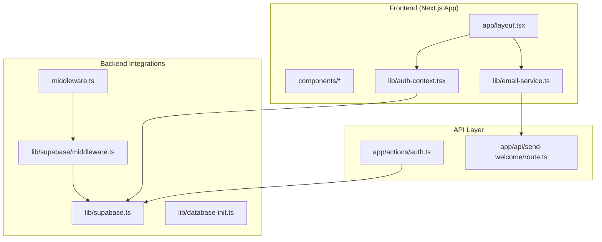
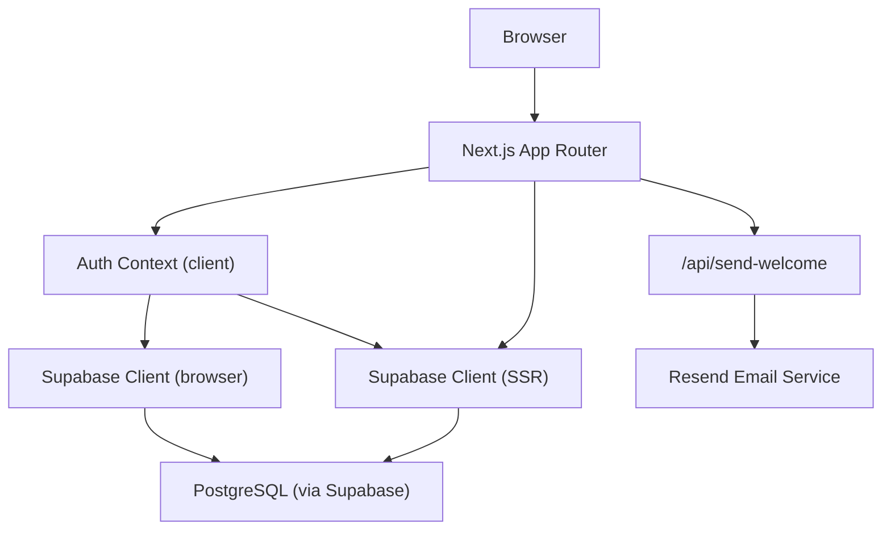
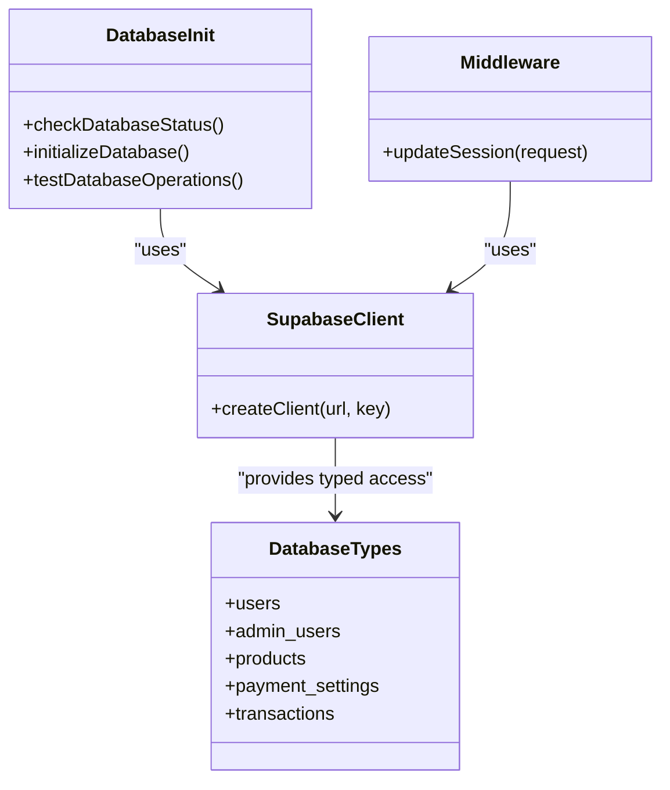
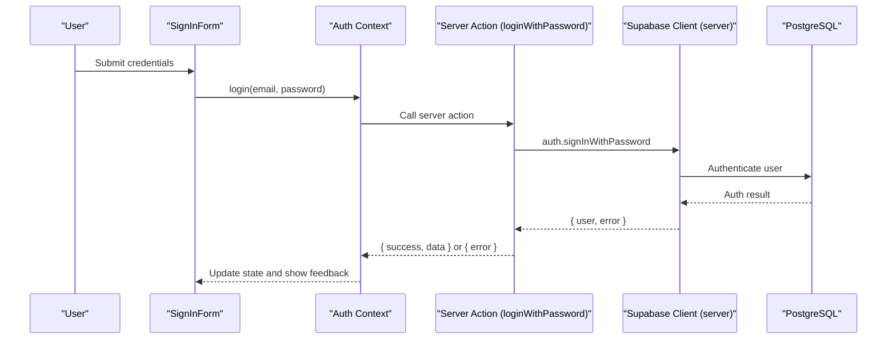
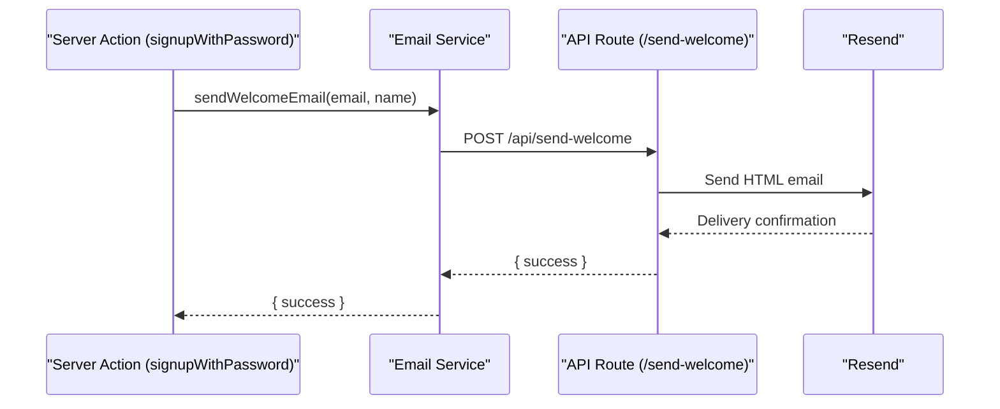
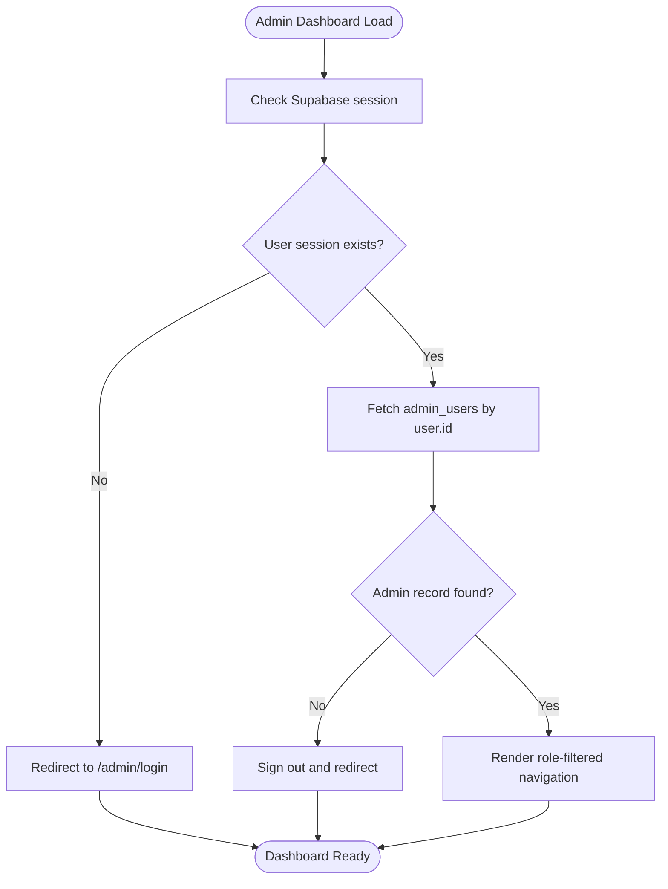
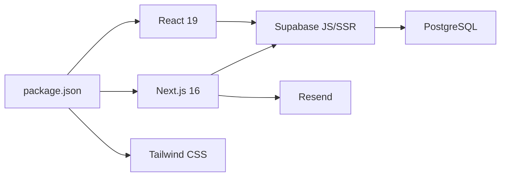

# Technology Stack

<cite>
**Referenced Files in This Document**
- [README.md](file://README.md)
- [package.json](file://package.json)
- [next.config.js](file://next.config.js)
- [tsconfig.json](file://tsconfig.json)
- [tailwind.config.ts](file://tailwind.config.ts)
- [lib/supabase.ts](file://lib/supabase.ts)
- [lib/database-init.ts](file://lib/database-init.ts)
- [middleware.ts](file://middleware.ts)
- [lib/supabase/middleware.ts](file://lib/supabase/middleware.ts)
- [lib/auth-context.tsx](file://lib/auth-context.tsx)
- [app/actions/auth.ts](file://app/actions/auth.ts)
- [lib/email-service.ts](file://lib/email-service.ts)
- [lib/email-fallback.ts](file://lib/email-fallback.ts)
- [app/api/send-welcome/route.ts](file://app/api/send-welcome/route.ts)
- [components/sign-in-form.tsx](file://components/sign-in-form.tsx)
- [app/layout.tsx](file://app/layout.tsx)
- [app/admin/dashboard/layout.tsx](file://app/admin/dashboard/layout.tsx)
</cite>

## Table of Contents
1. [Introduction](#introduction)
2. [Project Structure](#project-structure)
3. [Core Components](#core-components)
4. [Architecture Overview](#architecture-overview)
5. [Detailed Component Analysis](#detailed-component-analysis)
6. [Dependency Analysis](#dependency-analysis)
7. [Performance Considerations](#performance-considerations)
8. [Troubleshooting Guide](#troubleshooting-guide)
9. [Conclusion](#conclusion)

## Introduction
This document describes the modern technology stack powering Byiora, a digital game top-up platform for Nepal. It focuses on the frontend (Next.js 16 with React 19, TypeScript, and Tailwind CSS), the backend (Supabase for authentication and database, PostgreSQL for data storage, and PL/pgSQL for database functions), and the deployment strategy using Vercel. It explains the rationale behind each technology choice, highlights benefits such as server-side rendering, real-time capabilities, and developer experience, and documents configuration files, build processes, and environment requirements. Practical examples demonstrate how technologies work together to enable instant delivery and secure transactions.

## Project Structure
Byiora follows a conventional Next.js 14+ app directory structure with a clear separation of concerns:
- app: Next.js app directory containing pages, layouts, API routes, and server actions
- components: Shared UI components and Radix primitives
- lib: Backend integration libraries (Supabase client/server, auth context, email service)
- public/images: Static assets
- styles/globals.css: Global styles
- Configuration files at the repository root for Next.js, TypeScript, Tailwind CSS, PostCSS, and Vercel

**Diagram sources**
- [app/layout.tsx:25-42](file://app/layout.tsx#L25-L42)
- [lib/auth-context.tsx:51-92](file://lib/auth-context.tsx#L51-L92)
- [lib/email-service.ts:32-73](file://lib/email-service.ts#L32-L73)
- [lib/supabase.ts:1-7](file://lib/supabase.ts#L1-L7)
- [lib/database-init.ts:27-87](file://lib/database-init.ts#L27-L87)
- [lib/supabase/middleware.ts:4-95](file://lib/supabase/middleware.ts#L4-L95)
- [middleware.ts:4-10](file://middleware.ts#L4-L10)
- [app/actions/auth.ts:8-23](file://app/actions/auth.ts#L8-L23)
- [app/api/send-welcome/route.ts:7-68](file://app/api/send-welcome/route.ts#L7-L68)

**Section sources**
- [README.md:12-17](file://README.md#L12-L17)
- [package.json:11-38](file://package.json#L11-L38)
- [next.config.js:22-65](file://next.config.js#L22-L65)
- [tsconfig.json:2-30](file://tsconfig.json#L2-L30)
- [tailwind.config.ts:3-112](file://tailwind.config.ts#L3-L112)

## Core Components
- Next.js 16 with React 19: Provides app directory routing, server-side rendering, static generation, and modern React features. Scripts define development, build, and production commands.
- TypeScript: Enforces type safety across the codebase with strict compiler options and bundler module resolution.
- Tailwind CSS: Utility-first styling with a custom theme, animations, and dark mode support.
- Supabase: Authentication, database, and server-side session management via Supabase client SDKs and SSR helpers.
- PostgreSQL: Relational data storage with typed tables and enums for users, admin users, products, payment settings, and transactions.
- PL/pgSQL: Database functions for stored procedures and triggers (configured via Supabase SQL functions).
- Vercel: Hosting and edge runtime for Next.js app, API routes, and server actions.

Benefits:
- Developer Experience: Fast refresh, type-safe APIs, and modular component architecture.
- Server-Side Rendering: Improved SEO and performance for initial page loads.
- Real-Time Capabilities: Supabase auth and real-time subscriptions enable live updates.
- Security: Supabase Row Level Security (RLS), server actions, and cookie-based sessions.

**Section sources**
- [package.json:5-10](file://package.json#L5-L10)
- [package.json:32-38](file://package.json#L32-L38)
- [tsconfig.json:11-18](file://tsconfig.json#L11-L18)
- [tailwind.config.ts:4-110](file://tailwind.config.ts#L4-L110)
- [lib/supabase.ts:10-187](file://lib/supabase.ts#L10-L187)
- [lib/database-init.ts:27-87](file://lib/database-init.ts#L27-L87)
- [README.md:14-16](file://README.md#L14-L16)

## Architecture Overview
The system integrates a Next.js frontend with Supabase backend services. Authentication flows use Supabase auth with server actions, while the admin dashboard enforces session checks and role-based navigation. Emails are sent via a dedicated API route using Resend, with a fallback mechanism. Middleware ensures session continuity and admin subdomain rewriting.

**Diagram sources**
- [app/layout.tsx:30-40](file://app/layout.tsx#L30-L40)
- [lib/auth-context.tsx:51-92](file://lib/auth-context.tsx#L51-L92)
- [lib/supabase.ts:1-7](file://lib/supabase.ts#L1-L7)
- [lib/supabase/middleware.ts:9-53](file://lib/supabase/middleware.ts#L9-L53)
- [middleware.ts:4-10](file://middleware.ts#L4-L10)
- [app/api/send-welcome/route.ts:5-68](file://app/api/send-welcome/route.ts#L5-L68)

## Detailed Component Analysis

### Frontend Stack: Next.js, React, TypeScript, Tailwind CSS
- Next.js 16 with React 19: Uses the app directory with pages, layouts, and server actions. The root layout wraps providers for authentication and notifications.
- TypeScript: Strict mode, ESNext target, bundler module resolution, and JSX transform configured for optimal DX.
- Tailwind CSS: Dark mode, custom animations, gradients, and theme tokens for consistent UI.

Practical example: The sign-in form component demonstrates client-side form handling, controlled inputs, and toast notifications integrated with the global provider chain.

**Section sources**
- [app/layout.tsx:25-42](file://app/layout.tsx#L25-L42)
- [tsconfig.json:2-30](file://tsconfig.json#L2-L30)
- [tailwind.config.ts:3-112](file://tailwind.config.ts#L3-L112)
- [components/sign-in-form.tsx:18-82](file://components/sign-in-form.tsx#L18-L82)

### Backend Stack: Supabase, PostgreSQL, PL/pgSQL
- Supabase Client Initialization: Centralized client creation with environment variables for URL and keys.
- Database Types: Strongly typed tables and enums for users, admin users, products, payment settings, and transactions.
- Database Status Checks: Connectivity tests, table existence verification, and seed initialization safeguards.
- Middleware Session Management: Server client reads and refreshes user sessions, enforces admin route protection, and handles subdomain rewriting.

**Diagram sources**
- [lib/supabase.ts:1-7](file://lib/supabase.ts#L1-L7)
- [lib/supabase.ts:10-187](file://lib/supabase.ts#L10-L187)
- [lib/database-init.ts:27-87](file://lib/database-init.ts#L27-L87)
- [lib/supabase/middleware.ts:4-95](file://lib/supabase/middleware.ts#L4-L95)

**Section sources**
- [lib/supabase.ts:1-188](file://lib/supabase.ts#L1-L188)
- [lib/database-init.ts:11-111](file://lib/database-init.ts#L11-L111)
- [lib/supabase/middleware.ts:4-95](file://lib/supabase/middleware.ts#L4-L95)

### Authentication and Authorization
- Auth Provider: Manages user session, transactions, login/signup/logout, and profile updates. Integrates with Supabase auth and local state.
- Server Actions: Encapsulate server-side auth operations, including sign-in, sign-up, and logout, with revalidation and redirects.
- Middleware: Ensures session continuity and admin route protection by validating user sessions and rewriting URLs for admin subdomains.

**Diagram sources**
- [components/sign-in-form.tsx:27-45](file://components/sign-in-form.tsx#L27-L45)
- [lib/auth-context.tsx:129-163](file://lib/auth-context.tsx#L129-L163)
- [app/actions/auth.ts:8-23](file://app/actions/auth.ts#L8-L23)
- [lib/supabase.ts:1-7](file://lib/supabase.ts#L1-L7)

**Section sources**
- [lib/auth-context.tsx:51-92](file://lib/auth-context.tsx#L51-L92)
- [app/actions/auth.ts:8-23](file://app/actions/auth.ts#L8-L23)
- [middleware.ts:4-10](file://middleware.ts#L4-L10)
- [lib/supabase/middleware.ts:4-95](file://lib/supabase/middleware.ts#L4-L95)

### Email Delivery Pipeline
- Welcome Email: Server action endpoint sends HTML emails via Resend using a dedicated API route.
- Order Confirmation: Email service attempts EmailJS first, falls back to a logging fallback method if EmailJS is not configured.
- Security: DOM purify sanitization for user-provided content in emails.

**Diagram sources**
- [app/actions/auth.ts:47-55](file://app/actions/auth.ts#L47-L55)
- [lib/email-service.ts:32-73](file://lib/email-service.ts#L32-L73)
- [app/api/send-welcome/route.ts:7-68](file://app/api/send-welcome/route.ts#L7-L68)

**Section sources**
- [lib/email-service.ts:75-125](file://lib/email-service.ts#L75-L125)
- [lib/email-fallback.ts:3-30](file://lib/email-fallback.ts#L3-L30)
- [app/api/send-welcome/route.ts:17-61](file://app/api/send-welcome/route.ts#L17-L61)

### Admin Dashboard and Role-Based Access
- Session Validation: Client-side admin layout validates user session against the admin_users table and filters navigation by role.
- Navigation: Role-aware menu items and logout flow.

**Diagram sources**
- [app/admin/dashboard/layout.tsx:25-77](file://app/admin/dashboard/layout.tsx#L25-L77)
- [app/admin/dashboard/layout.tsx:103-126](file://app/admin/dashboard/layout.tsx#L103-L126)

**Section sources**
- [app/admin/dashboard/layout.tsx:13-101](file://app/admin/dashboard/layout.tsx#L13-L101)

### Configuration Files and Build Processes
- package.json: Defines scripts for dev, build, start, and lint; lists Next.js 16, React 19, Tailwind CSS, and Supabase dependencies.
- next.config.js: Configures remote image patterns, TypeScript build behavior, image cache limits, and security headers.
- tsconfig.json: Enables strict mode, ESNext target, bundler module resolution, and JSX transform.
- tailwind.config.ts: Sets dark mode, content paths, theme tokens, animations, and plugins.

Environment requirements:
- NEXT_PUBLIC_SUPABASE_URL and NEXT_PUBLIC_SUPABASE_ANON_KEY for Supabase client initialization.
- RESEND_API_KEY for email delivery.
- NEXT_PUBLIC_EMAILJS_* for optional EmailJS integration.

**Section sources**
- [package.json:5-49](file://package.json#L5-L49)
- [next.config.js:10-65](file://next.config.js#L10-L65)
- [tsconfig.json:2-41](file://tsconfig.json#L2-L41)
- [tailwind.config.ts:3-112](file://tailwind.config.ts#L3-L112)
- [lib/supabase.ts:3-7](file://lib/supabase.ts#L3-L7)
- [lib/email-service.ts:5-7](file://lib/email-service.ts#L5-L7)
- [app/api/send-welcome/route.ts:5](file://app/api/send-welcome/route.ts#L5)

## Dependency Analysis
The frontend depends on Next.js for routing and SSR, React for UI, and Tailwind for styling. Backend dependencies include Supabase clients for browser and server, with server actions orchestrating auth and database operations. Email delivery relies on Resend with a graceful fallback.

**Diagram sources**
- [package.json:32-38](file://package.json#L32-L38)
- [lib/supabase.ts:1-7](file://lib/supabase.ts#L1-L7)
- [app/api/send-welcome/route.ts:5](file://app/api/send-welcome/route.ts#L5)

**Section sources**
- [package.json:11-49](file://package.json#L11-L49)

## Performance Considerations
- Image Optimization: Remote image patterns and bounded disk cache reduce memory footprint and improve caching behavior.
- Security Headers: Strict Transport Security, X-Frame-Options, X-Content-Type-Options, and Permissions-Policy enhance security and indirectly improve performance by reducing malicious requests.
- Type Checking: Strict TypeScript configuration prevents runtime errors and improves build reliability.
- Tailwind Purge: Content paths ensure unused styles are removed in production builds.

[No sources needed since this section provides general guidance]

## Troubleshooting Guide
Common issues and resolutions:
- Supabase Environment Variables Missing: The database status checker reports missing environment variables and connection failures. Ensure NEXT_PUBLIC_SUPABASE_URL and NEXT_PUBLIC_SUPABASE_ANON_KEY are set.
- Database Not Initialized: If tables do not exist, the status checker returns an explicit message; run the seed scripts to create tables and initial data.
- Email Service Not Configured: If EmailJS is not configured, the email service falls back to a logging fallback; configure NEXT_PUBLIC_EMAILJS_* or rely on the Resend-based welcome email route.
- Middleware Session Issues: The middleware refreshes sessions and enforces admin route protection; verify cookie handling and admin subdomain configuration.

**Section sources**
- [lib/database-init.ts:27-87](file://lib/database-init.ts#L27-L87)
- [lib/email-service.ts:77-80](file://lib/email-service.ts#L77-L80)
- [lib/supabase/middleware.ts:55-76](file://lib/supabase/middleware.ts#L55-L76)

## Conclusion
Byiora’s technology stack combines Next.js 16, React 19, TypeScript, and Tailwind CSS for a modern, type-safe, and performant frontend, backed by Supabase and PostgreSQL for authentication, data, and real-time capabilities. The architecture emphasizes developer experience, security, and scalability, enabling instant delivery and secure transactions. Configuration files and middleware ensure robust session handling, while email services provide reliable communication with graceful fallbacks.

[No sources needed since this section summarizes without analyzing specific files]