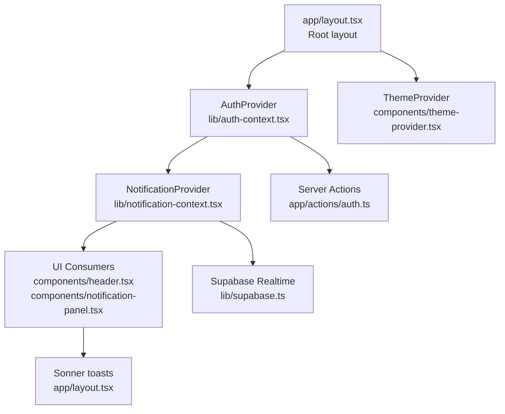
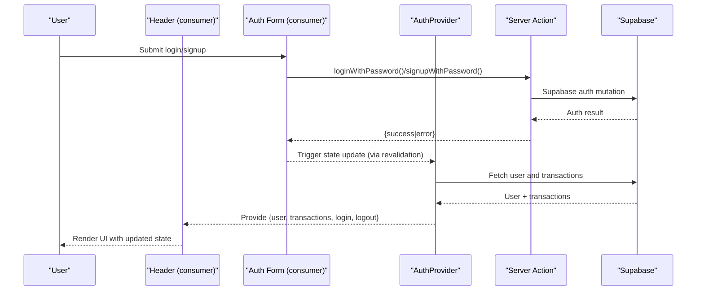
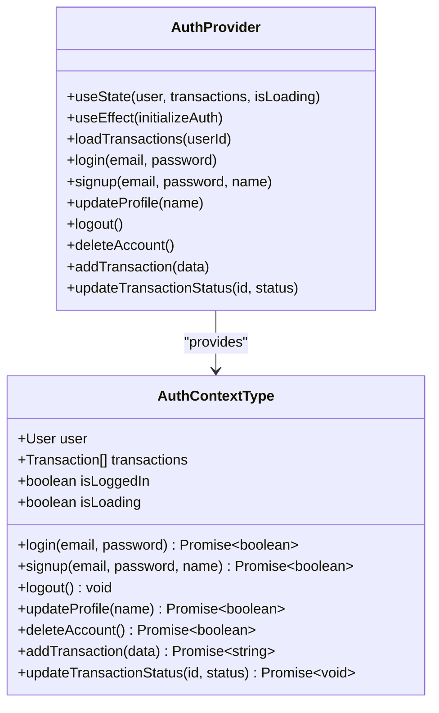
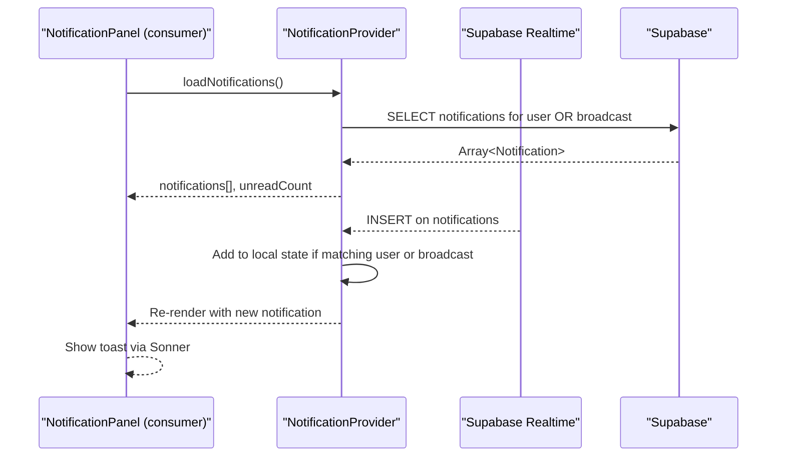
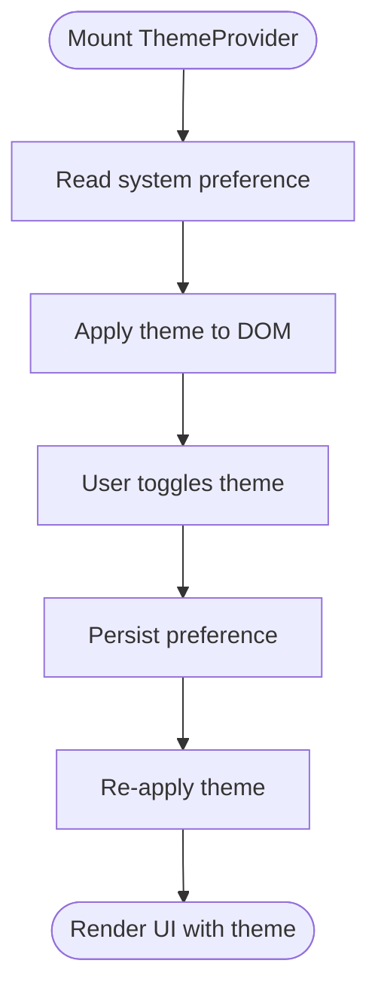
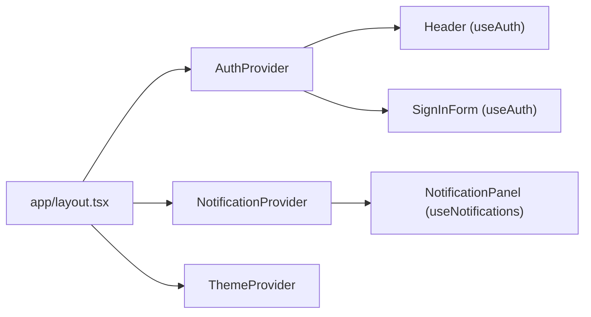
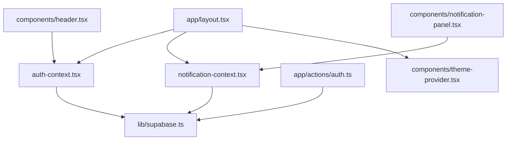

# State Management

<cite>
**Referenced Files in This Document**
- [auth-context.tsx](file://lib/auth-context.tsx)
- [notification-context.tsx](file://lib/notification-context.tsx)
- [theme-provider.tsx](file://components/theme-provider.tsx)
- [supabase.ts](file://lib/supabase.ts)
- [layout.tsx](file://app/layout.tsx)
- [header.tsx](file://components/header.tsx)
- [notification-panel.tsx](file://components/notification-panel.tsx)
- [sign-in-form.tsx](file://components/sign-in-form.tsx)
- [auth.ts](file://app/actions/auth.ts)
- [notification-toast.tsx](file://components/notification-toast.tsx)
- [notifications page.tsx](file://app/admin/dashboard/notifications/page.tsx)
- [admin-dashboard-layout.tsx](file://app/admin/dashboard/layout.tsx)
- [package.json](file://package.json)
</cite>

## Table of Contents
1. [Introduction](#introduction)
2. [Project Structure](#project-structure)
3. [Core Components](#core-components)
4. [Architecture Overview](#architecture-overview)
5. [Detailed Component Analysis](#detailed-component-analysis)
6. [Dependency Analysis](#dependency-analysis)
7. [Performance Considerations](#performance-considerations)
8. [Troubleshooting Guide](#troubleshooting-guide)
9. [Conclusion](#conclusion)
10. [Appendices](#appendices)

## Introduction
This document explains the state management system built with React Context API for authentication, notifications, and theme management. It focuses on the provider pattern architecture using AuthProvider, NotificationProvider, and ThemeProvider components. You will learn how state flows between context providers, state consumers, and state providers; how to implement similar solutions; and how to optimize performance and avoid common pitfalls such as context drilling and state synchronization issues.

## Project Structure
The state management stack is composed of:
- Provider pattern roots in the application layout
- Authentication state via AuthProvider
- Notification state via NotificationProvider
- Theme state via ThemeProvider (delegated to next-themes)
- Backend integration via Supabase client and server actions

**Diagram sources**
- [layout.tsx:25-42](file://app/layout.tsx#L25-L42)
- [auth-context.tsx:51-365](file://lib/auth-context.tsx#L51-L365)
- [notification-context.tsx:29-233](file://lib/notification-context.tsx#L29-L233)
- [theme-provider.tsx:9-11](file://components/theme-provider.tsx#L9-L11)
- [supabase.ts:1-7](file://lib/supabase.ts#L1-L7)
- [auth.ts:8-67](file://app/actions/auth.ts#L8-L67)

**Section sources**
- [layout.tsx:25-42](file://app/layout.tsx#L25-L42)
- [auth-context.tsx:51-365](file://lib/auth-context.tsx#L51-L365)
- [notification-context.tsx:29-233](file://lib/notification-context.tsx#L29-L233)
- [theme-provider.tsx:9-11](file://components/theme-provider.tsx#L9-L11)
- [supabase.ts:1-7](file://lib/supabase.ts#L1-L7)
- [auth.ts:8-67](file://app/actions/auth.ts#L8-L67)

## Core Components
- AuthProvider: Manages user session, transactions, and authentication lifecycle. Exposes login, signup, logout, profile updates, and transaction CRUD operations.
- NotificationProvider: Manages user-specific and broadcast notifications, real-time updates, and read/unread state.
- ThemeProvider: Delegates theme switching to next-themes for light/dark/system preference.
- Server Actions: Encapsulate backend interactions for login, signup, and logout to keep client context lean and secure.

Key responsibilities:
- Provider pattern: Each provider wraps children and exposes a stable context value.
- State consumers: Components call useAuth/useNotifications/useTheme to subscribe to state.
- Synchronization: Providers synchronize local state with Supabase and real-time channels.

**Section sources**
- [auth-context.tsx:30-47](file://lib/auth-context.tsx#L30-L47)
- [notification-context.tsx:17-25](file://lib/notification-context.tsx#L17-L25)
- [theme-provider.tsx:9-11](file://components/theme-provider.tsx#L9-L11)
- [auth.ts:8-67](file://app/actions/auth.ts#L8-L67)

## Architecture Overview
The provider pattern organizes state into three pillars:
- Authentication: Session initialization, user profile, and transaction history
- Notifications: Local state plus Supabase real-time subscriptions
- Theme: UI-level theme preferences managed by next-themes

**Diagram sources**
- [sign-in-form.tsx:25-80](file://components/sign-in-form.tsx#L25-L80)
- [auth.ts:8-67](file://app/actions/auth.ts#L8-L67)
- [auth-context.tsx:129-181](file://lib/auth-context.tsx#L129-L181)
- [auth-context.tsx:94-127](file://lib/auth-context.tsx#L94-L127)

## Detailed Component Analysis

### Authentication State Management (AuthProvider)
AuthProvider centralizes authentication and transaction state:
- Initialization: On mount, fetches session and hydrates user and transactions
- Operations: Login, signup, logout, profile update, account deletion, transaction creation and status updates
- Data model: Strongly typed User and Transaction interfaces
- Persistence: Uses Supabase client for reads/writes and server actions for mutations

**Diagram sources**
- [auth-context.tsx:30-47](file://lib/auth-context.tsx#L30-L47)
- [auth-context.tsx:51-365](file://lib/auth-context.tsx#L51-L365)

**Section sources**
- [auth-context.tsx:51-92](file://lib/auth-context.tsx#L51-L92)
- [auth-context.tsx:94-127](file://lib/auth-context.tsx#L94-L127)
- [auth-context.tsx:129-181](file://lib/auth-context.tsx#L129-L181)
- [auth-context.tsx:204-238](file://lib/auth-context.tsx#L204-L238)
- [auth-context.tsx:240-344](file://lib/auth-context.tsx#L240-L344)

### Notification State Management (NotificationProvider)
NotificationProvider manages notifications with:
- Local state: notifications array and unread count
- Real-time: Supabase realtime channel for live inserts
- Persistence: Supabase storage for user-specific and broadcast notifications
- Consumer integration: Provides add, mark-as-read, mark-all-as-read, and send-notification helpers

**Diagram sources**
- [notification-context.tsx:36-66](file://lib/notification-context.tsx#L36-L66)
- [notification-context.tsx:172-220](file://lib/notification-context.tsx#L172-L220)
- [notification-panel.tsx:14-147](file://components/notification-panel.tsx#L14-L147)

**Section sources**
- [notification-context.tsx:29-170](file://lib/notification-context.tsx#L29-L170)
- [notification-context.tsx:172-220](file://lib/notification-context.tsx#L172-L220)
- [notification-panel.tsx:14-147](file://components/notification-panel.tsx#L14-L147)

### Theme Management (ThemeProvider)
ThemeProvider delegates theme handling to next-themes, enabling system-aware light/dark toggling without managing state internally.

**Diagram sources**
- [theme-provider.tsx:9-11](file://components/theme-provider.tsx#L9-L11)

**Section sources**
- [theme-provider.tsx:9-11](file://components/theme-provider.tsx#L9-L11)

### Provider Composition and Consumers
Provider composition in the root layout ensures all pages receive authentication and notification state. Consumers subscribe via useAuth and useNotifications hooks.

**Diagram sources**
- [layout.tsx:33-38](file://app/layout.tsx#L33-L38)
- [header.tsx:73-74](file://components/header.tsx#L73-L74)
- [sign-in-form.tsx:25](file://components/sign-in-form.tsx#L25)
- [notification-panel.tsx:14](file://components/notification-panel.tsx#L14)

**Section sources**
- [layout.tsx:33-38](file://app/layout.tsx#L33-L38)
- [header.tsx:73-74](file://components/header.tsx#L73-L74)
- [sign-in-form.tsx:25](file://components/sign-in-form.tsx#L25)
- [notification-panel.tsx:14](file://components/notification-panel.tsx#L14)

### Practical Examples and Patterns
- Context usage: Components call useAuth/useNotifications to read state and trigger updates
- State updates: AuthProvider updates user and transactions; NotificationProvider updates local state and persists to Supabase
- Real-time updates: NotificationProvider subscribes to Supabase channel and dispatches UI updates via Sonner

Examples by file path:
- Authentication flow: [auth.ts:8-67](file://app/actions/auth.ts#L8-L67), [auth-context.tsx:129-181](file://lib/auth-context.tsx#L129-L181)
- Notification subscription: [notification-context.tsx:172-220](file://lib/notification-context.tsx#L172-L220)
- UI integration: [header.tsx:73-74](file://components/header.tsx#L73-L74), [notification-panel.tsx:14-147](file://components/notification-panel.tsx#L14-L147)

**Section sources**
- [auth.ts:8-67](file://app/actions/auth.ts#L8-L67)
- [auth-context.tsx:129-181](file://lib/auth-context.tsx#L129-L181)
- [notification-context.tsx:172-220](file://lib/notification-context.tsx#L172-L220)
- [header.tsx:73-74](file://components/header.tsx#L73-L74)
- [notification-panel.tsx:14-147](file://components/notification-panel.tsx#L14-L147)

## Dependency Analysis
- Supabase client and types: Used by providers and server actions
- Sonner: Used for toast notifications in UI and providers
- next-themes: Used by ThemeProvider for theme management

**Diagram sources**
- [auth-context.tsx:3-6](file://lib/auth-context.tsx#L3-L6)
- [notification-context.tsx:3-5](file://lib/notification-context.tsx#L3-L5)
- [supabase.ts:1-7](file://lib/supabase.ts#L1-L7)
- [auth.ts:3](file://app/actions/auth.ts#L3)
- [layout.tsx:5-7](file://app/layout.tsx#L5-L7)
- [theme-provider.tsx:4-7](file://components/theme-provider.tsx#L4-L7)

**Section sources**
- [package.json:11-39](file://package.json#L11-L39)
- [auth-context.tsx:3-6](file://lib/auth-context.tsx#L3-L6)
- [notification-context.tsx:3-5](file://lib/notification-context.tsx#L3-L5)
- [supabase.ts:1-7](file://lib/supabase.ts#L1-L7)
- [auth.ts:3](file://app/actions/auth.ts#L3)
- [layout.tsx:5-7](file://app/layout.tsx#L5-L7)
- [theme-provider.tsx:4-7](file://components/theme-provider.tsx#L4-L7)

## Performance Considerations
- Minimize re-renders by keeping provider values stable and avoiding unnecessary object/array churn
- Use callbacks and memoization for expensive operations (e.g., loadNotifications)
- Debounce or batch UI updates for frequent state changes
- Prefer selective re-renders by consuming only required slices of state (e.g., unreadCount)
- Avoid heavy synchronous work inside providers; defer to server actions or background tasks
- Leverage Supabase real-time efficiently to avoid polling and redundant renders

[No sources needed since this section provides general guidance]

## Troubleshooting Guide
Common issues and resolutions:
- Context not initialized: Ensure components using useAuth/useNotifications are rendered within their respective providers
- Real-time notifications not appearing: Verify Supabase channel subscription and that notifications match current user or are broadcast
- State desynchronization: Confirm that database writes are followed by local state updates and vice versa
- Authentication loops: Check server action redirects and revalidation paths

**Section sources**
- [auth-context.tsx:367-373](file://lib/auth-context.tsx#L367-L373)
- [notification-context.tsx:235-241](file://lib/notification-context.tsx#L235-L241)
- [notification-context.tsx:172-220](file://lib/notification-context.tsx#L172-L220)
- [auth.ts:21](file://app/actions/auth.ts#L21)

## Conclusion
The provider pattern delivers a clean separation of concerns for authentication, notifications, and theme management. By composing AuthProvider and NotificationProvider at the root and consuming state via dedicated hooks, the application achieves predictable state flow, real-time updates, and scalable UI components. Following the best practices outlined here will help maintain performance and reliability as the application grows.

[No sources needed since this section summarizes without analyzing specific files]

## Appendices

### Best Practices for Provider Composition and State Architecture
- Keep provider responsibilities narrow and cohesive
- Expose only the minimal state needed to consumers
- Centralize side effects (e.g., Supabase calls) in providers
- Use server actions for sensitive operations to reduce client-side exposure
- Provide clear error boundaries and user feedback (toasts)
- Avoid deep nesting; compose providers at the root layout level

**Section sources**
- [layout.tsx:33-38](file://app/layout.tsx#L33-L38)
- [auth.ts:8-67](file://app/actions/auth.ts#L8-L67)
- [notification-context.tsx:29-170](file://lib/notification-context.tsx#L29-L170)