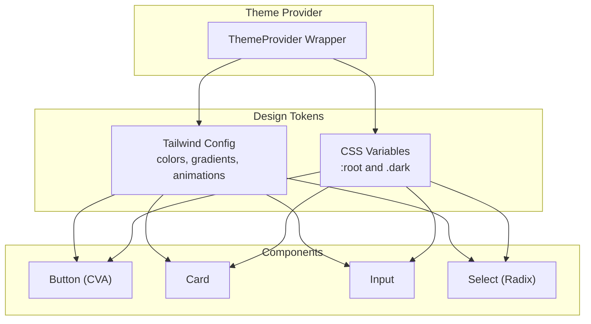
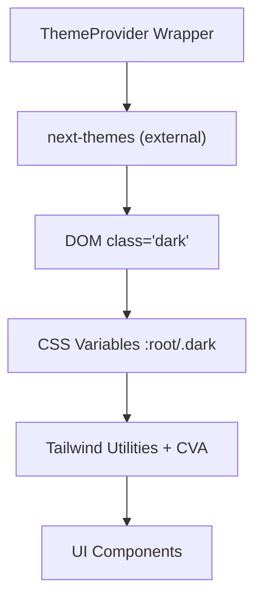
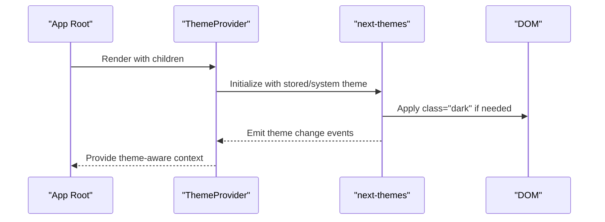
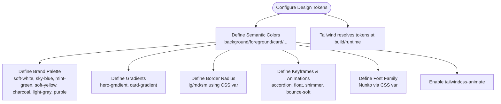
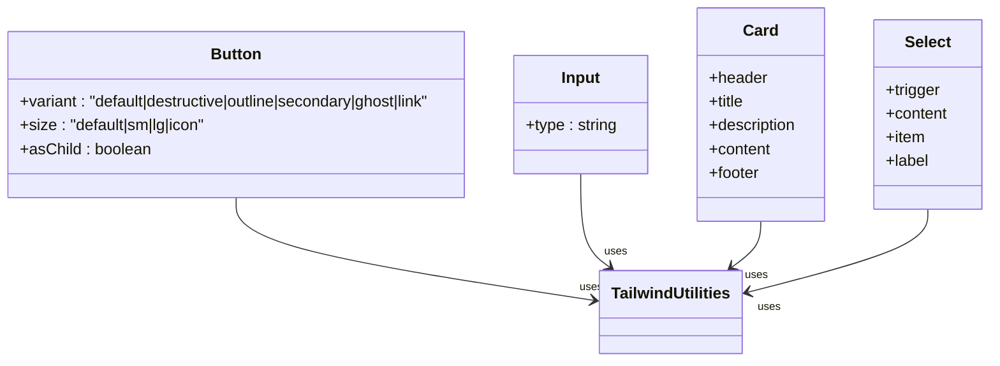
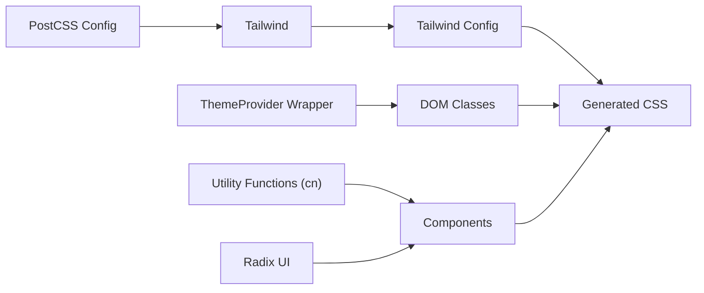

# Styling and Theming

<cite>
**Referenced Files in This Document**
- [tailwind.config.ts](file://tailwind.config.ts)
- [postcss.config.js](file://postcss.config.js)
- [app/layout.tsx](file://app/layout.tsx)
- [components/theme-provider.tsx](file://components/theme-provider.tsx)
- [app/globals.css](file://app/globals.css)
- [styles/globals.css](file://styles/globals.css)
- [lib/utils.ts](file://lib/utils.ts)
- [components/ui/button.tsx](file://components/ui/button.tsx)
- [components/ui/card.tsx](file://components/ui/card.tsx)
- [components/ui/input.tsx](file://components/ui/input.tsx)
- [components/ui/select.tsx](file://components/ui/select.tsx)
</cite>

## Table of Contents
1. [Introduction](#introduction)
2. [Project Structure](#project-structure)
3. [Core Components](#core-components)
4. [Architecture Overview](#architecture-overview)
5. [Detailed Component Analysis](#detailed-component-analysis)
6. [Dependency Analysis](#dependency-analysis)
7. [Performance Considerations](#performance-considerations)
8. [Troubleshooting Guide](#troubleshooting-guide)
9. [Conclusion](#conclusion)
10. [Appendices](#appendices)

## Introduction
This document explains the styling and theming system built with Tailwind CSS, Radix UI components, and a theme provider. It covers the design system using Tailwind utility classes, custom color schemes, and responsive design patterns. It documents the theme provider implementation including theme detection, persistence, and switching. Practical examples demonstrate theme customization, component styling, and responsive design patterns. Cross-browser compatibility, performance optimization for CSS delivery, and accessibility considerations for color contrast and theme switching are addressed alongside guidelines for extending the design system consistently.

## Project Structure
The styling system spans three layers:
- Design tokens and theme definitions: Tailwind configuration and CSS custom properties define the design system.
- Theme provider: A thin wrapper around a third-party library manages theme detection, persistence, and switching.
- Component layer: UI primitives from Radix UI and Tailwind utilities implement the design system in components.

**Diagram sources**
- [tailwind.config.ts:1-113](file://tailwind.config.ts#L1-L113)
- [styles/globals.css:15-94](file://styles/globals.css#L15-L94)
- [components/theme-provider.tsx:1-12](file://components/theme-provider.tsx#L1-L12)
- [components/ui/button.tsx:1-57](file://components/ui/button.tsx#L1-L57)
- [components/ui/card.tsx:1-87](file://components/ui/card.tsx#L1-L87)
- [components/ui/input.tsx:1-26](file://components/ui/input.tsx#L1-L26)
- [components/ui/select.tsx:1-161](file://components/ui/select.tsx#L1-L161)

**Section sources**
- [tailwind.config.ts:1-113](file://tailwind.config.ts#L1-L113)
- [styles/globals.css:15-94](file://styles/globals.css#L15-L94)
- [components/theme-provider.tsx:1-12](file://components/theme-provider.tsx#L1-L12)
- [app/layout.tsx:1-43](file://app/layout.tsx#L1-L43)

## Core Components
- Tailwind configuration defines:
  - Dark mode strategy using the class strategy.
  - Content paths scanned for unused CSS.
  - Extended theme: fonts, gradients, border radius, colors, keyframes, and animations.
  - A plugin for advanced animations.
- CSS custom properties define light and dark tokens mapped to Tailwind’s semantic color variables.
- Theme provider wraps the application to manage theme detection, persistence, and switching.
- Utility functions merge Tailwind classes safely.
- UI components use Tailwind utilities and semantic color variables for consistent styling.

Key implementation references:
- Tailwind configuration and theme extensions: [tailwind.config.ts:1-113](file://tailwind.config.ts#L1-L113)
- Light/dark CSS variables: [styles/globals.css:15-94](file://styles/globals.css#L15-L94)
- Theme provider wrapper: [components/theme-provider.tsx:1-12](file://components/theme-provider.tsx#L1-L12)
- Utility class merging: [lib/utils.ts:1-7](file://lib/utils.ts#L1-L7)
- UI components using semantic tokens: [components/ui/button.tsx:1-57](file://components/ui/button.tsx#L1-L57), [components/ui/card.tsx:1-87](file://components/ui/card.tsx#L1-L87), [components/ui/input.tsx:1-26](file://components/ui/input.tsx#L1-L26), [components/ui/select.tsx:1-161](file://components/ui/select.tsx#L1-L161)

**Section sources**
- [tailwind.config.ts:1-113](file://tailwind.config.ts#L1-L113)
- [styles/globals.css:15-94](file://styles/globals.css#L15-L94)
- [components/theme-provider.tsx:1-12](file://components/theme-provider.tsx#L1-L12)
- [lib/utils.ts:1-7](file://lib/utils.ts#L1-L7)
- [components/ui/button.tsx:1-57](file://components/ui/button.tsx#L1-L57)
- [components/ui/card.tsx:1-87](file://components/ui/card.tsx#L1-L87)
- [components/ui/input.tsx:1-26](file://components/ui/input.tsx#L1-L26)
- [components/ui/select.tsx:1-161](file://components/ui/select.tsx#L1-L161)

## Architecture Overview
The theme provider integrates with Tailwind’s class-based dark mode and CSS custom properties. Components consume semantic tokens and utility classes, ensuring consistent styling across light and dark modes.

**Diagram sources**
- [components/theme-provider.tsx:1-12](file://components/theme-provider.tsx#L1-L12)
- [styles/globals.css:15-94](file://styles/globals.css#L15-L94)
- [tailwind.config.ts:1-113](file://tailwind.config.ts#L1-L113)
- [components/ui/button.tsx:1-57](file://components/ui/button.tsx#L1-L57)

**Section sources**
- [components/theme-provider.tsx:1-12](file://components/theme-provider.tsx#L1-L12)
- [styles/globals.css:15-94](file://styles/globals.css#L15-L94)
- [tailwind.config.ts:1-113](file://tailwind.config.ts#L1-L113)
- [components/ui/button.tsx:1-57](file://components/ui/button.tsx#L1-L57)

## Detailed Component Analysis

### Theme Provider Implementation
The theme provider is a minimal wrapper around a third-party library that:
- Detects the initial theme based on system preference or stored preference.
- Persists the selected theme.
- Switches themes dynamically and updates the document class accordingly.

**Diagram sources**
- [components/theme-provider.tsx:1-12](file://components/theme-provider.tsx#L1-L12)

Practical usage:
- Wrap the application shell with the theme provider to enable theme-aware rendering.
- Use semantic Tailwind classes and CSS variables in components to honor the active theme.

**Section sources**
- [components/theme-provider.tsx:1-12](file://components/theme-provider.tsx#L1-L12)

### Design System: Tailwind Configuration and Tokens
The design system centers on:
- Semantic color tokens mapped to CSS variables for light and dark modes.
- Brand-specific colors and gradients for visual identity.
- Border radius tokens aligned with a shared CSS variable.
- Animations and keyframes integrated with Radix UI components.

**Diagram sources**
- [tailwind.config.ts:11-109](file://tailwind.config.ts#L11-L109)

**Section sources**
- [tailwind.config.ts:11-109](file://tailwind.config.ts#L11-L109)

### Responsive Design Patterns
Responsive breakpoints and patterns are applied through:
- Tailwind’s breakpoint utilities (e.g., md:, lg:).
- Component-level responsive class combinations.
- Layout-level responsive containers and spacing.

Example references:
- Carousel responsive sizing and hover effects: [components/banner-carousel.tsx:58-124](file://components/banner-carousel.tsx#L58-L124)
- Body-level responsive typography and layout: [app/globals.css:40-44](file://app/globals.css#L40-L44)

**Section sources**
- [app/globals.css:40-44](file://app/globals.css#L40-L44)
- [components/banner-carousel.tsx:58-124](file://components/banner-carousel.tsx#L58-L124)

### Component Styling with Tailwind and Radix UI
Components integrate Tailwind utilities and semantic tokens with Radix UI primitives:
- Buttons use class variance authority (CVA) with variant and size scales.
- Inputs, Cards, and Selects apply semantic tokens and focus states.
- Select leverages Radix UI portals and animations while inheriting design tokens.

**Diagram sources**
- [components/ui/button.tsx:1-57](file://components/ui/button.tsx#L1-L57)
- [components/ui/input.tsx:1-26](file://components/ui/input.tsx#L1-L26)
- [components/ui/card.tsx:1-87](file://components/ui/card.tsx#L1-L87)
- [components/ui/select.tsx:1-161](file://components/ui/select.tsx#L1-L161)

**Section sources**
- [components/ui/button.tsx:1-57](file://components/ui/button.tsx#L1-L57)
- [components/ui/input.tsx:1-26](file://components/ui/input.tsx#L1-L26)
- [components/ui/card.tsx:1-87](file://components/ui/card.tsx#L1-L87)
- [components/ui/select.tsx:1-161](file://components/ui/select.tsx#L1-L161)

### Custom Styling Approaches
Custom component styles leverage:
- Layered CSS (@layer base/components/utilities) for global resets and reusable blocks.
- Gradient backgrounds and glassmorphism effects.
- Hover and focus transitions for interactivity.

Examples:
- Gift card hover effect and scaling: [app/globals.css:47-55](file://app/globals.css#L47-L55)
- Banner slide shimmer animation: [app/globals.css:61-65](file://app/globals.css#L61-L65)
- Glassmorphism container: [app/globals.css:67-69](file://app/globals.css#L67-L69)

**Section sources**
- [app/globals.css:47-69](file://app/globals.css#L47-L69)

## Dependency Analysis
The styling pipeline depends on:
- Tailwind CSS for utility-first styling and design tokens.
- PostCSS with Tailwind and Autoprefixer for CSS processing.
- Theme provider for runtime theme management.
- Radix UI for accessible component primitives.
- Utility functions for safe class merging.

**Diagram sources**
- [postcss.config.js:1-7](file://postcss.config.js#L1-L7)
- [tailwind.config.ts:1-113](file://tailwind.config.ts#L1-L113)
- [components/theme-provider.tsx:1-12](file://components/theme-provider.tsx#L1-L12)
- [lib/utils.ts:1-7](file://lib/utils.ts#L1-L7)
- [components/ui/select.tsx:1-161](file://components/ui/select.tsx#L1-L161)

**Section sources**
- [postcss.config.js:1-7](file://postcss.config.js#L1-L7)
- [tailwind.config.ts:1-113](file://tailwind.config.ts#L1-L113)
- [components/theme-provider.tsx:1-12](file://components/theme-provider.tsx#L1-L12)
- [lib/utils.ts:1-7](file://lib/utils.ts#L1-L7)
- [components/ui/select.tsx:1-161](file://components/ui/select.tsx#L1-L161)

## Performance Considerations
- Tree-shaking and purging: Tailwind scans configured paths to remove unused CSS. Keep content globs accurate to avoid bloated CSS.
- CSS custom properties: Using CSS variables reduces repeated color definitions and improves maintainability.
- Animations: Prefer hardware-accelerated properties (transform/opacity) for smooth animations.
- Build pipeline: PostCSS with Tailwind and Autoprefixer ensures modern CSS support and reduced vendor prefixes.

[No sources needed since this section provides general guidance]

## Troubleshooting Guide
Common issues and resolutions:
- Theme not switching: Ensure the theme provider is rendered at the root and that the document class is updated. Verify CSS variables are defined for both light and dark modes.
- Inconsistent colors: Confirm components use semantic tokens (e.g., background/foreground) rather than hardcoded values.
- Animation glitches: Use supported properties for animations and ensure Radix UI animations are enabled.
- Accessibility: Maintain sufficient color contrast in both light and dark modes; test with screen readers and keyboard navigation.

**Section sources**
- [styles/globals.css:15-94](file://styles/globals.css#L15-L94)
- [tailwind.config.ts:11-109](file://tailwind.config.ts#L11-L109)
- [components/ui/select.tsx:70-99](file://components/ui/select.tsx#L70-L99)

## Conclusion
The styling and theming system combines Tailwind’s utility classes, a theme provider for runtime theme management, and Radix UI components to deliver a consistent, accessible, and performant design system. By leveraging semantic tokens, CSS variables, and responsive patterns, developers can customize themes and components while maintaining design consistency across the application.

[No sources needed since this section summarizes without analyzing specific files]

## Appendices

### Practical Examples Index
- Theme customization:
  - Adjust brand palette and gradients in the Tailwind configuration.
  - Extend CSS variables for light/dark tokens.
- Component styling:
  - Use CVA variants for buttons and consistent focus states for inputs.
  - Apply semantic tokens in cards and selects.
- Responsive design:
  - Combine breakpoint utilities with component-level responsive classes.

**Section sources**
- [tailwind.config.ts:27-78](file://tailwind.config.ts#L27-L78)
- [styles/globals.css:15-94](file://styles/globals.css#L15-L94)
- [components/ui/button.tsx:7-34](file://components/ui/button.tsx#L7-L34)
- [components/ui/input.tsx:8-21](file://components/ui/input.tsx#L8-L21)
- [components/ui/card.tsx:5-17](file://components/ui/card.tsx#L5-L17)
- [components/ui/select.tsx:15-33](file://components/ui/select.tsx#L15-L33)