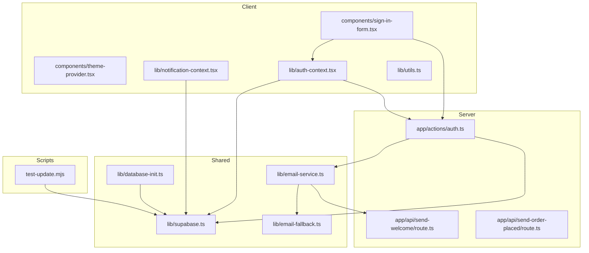
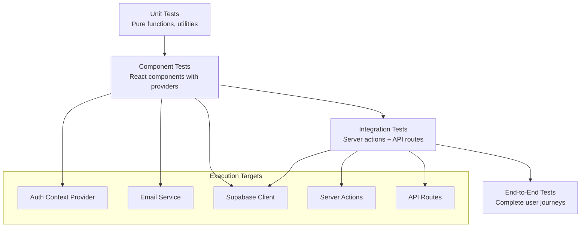
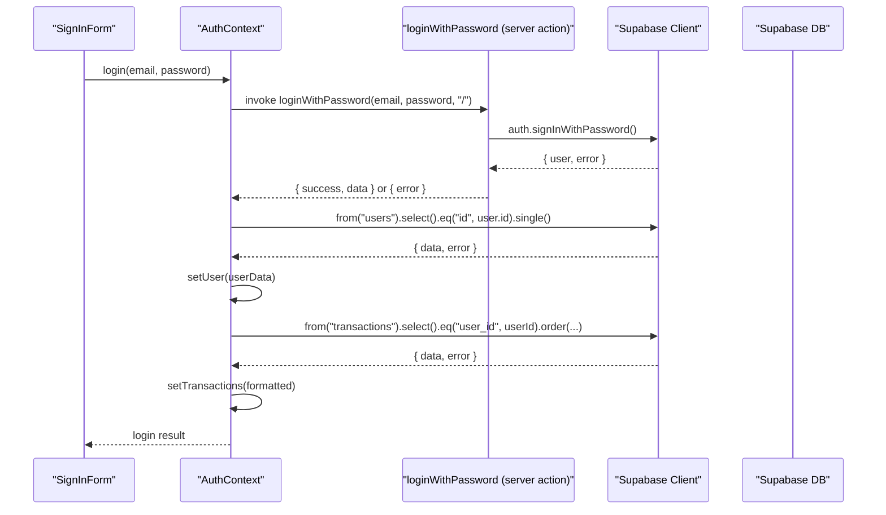
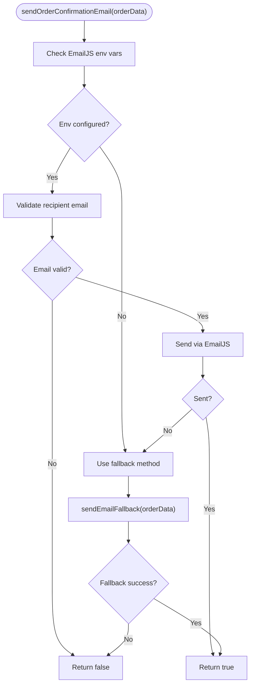
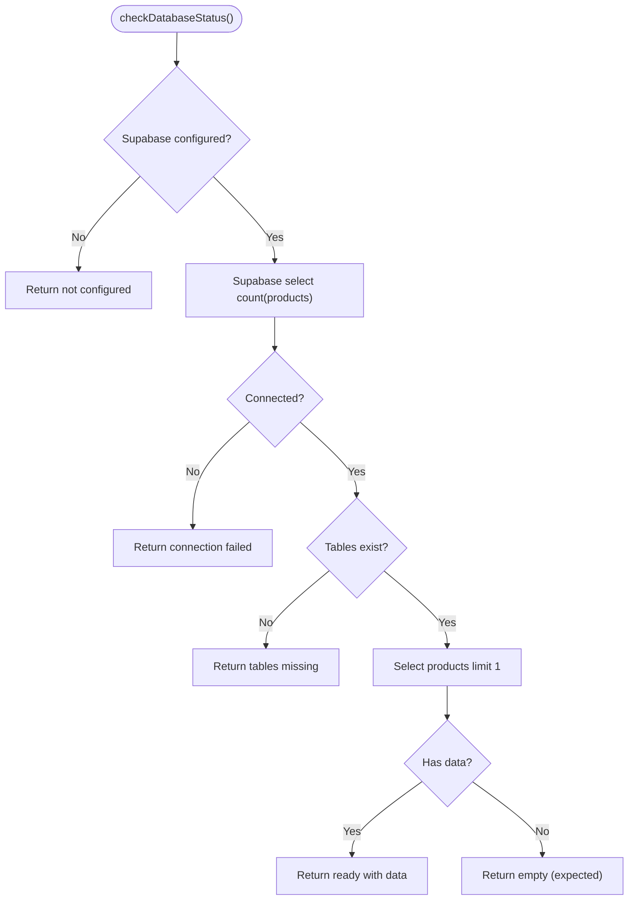
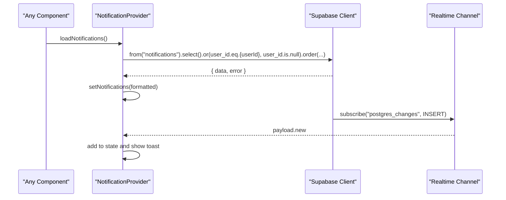
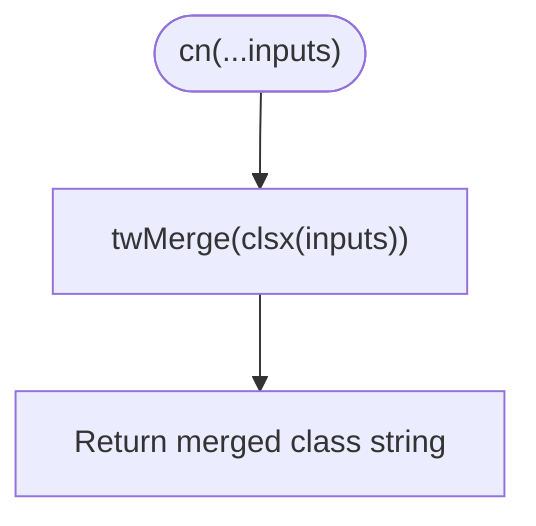
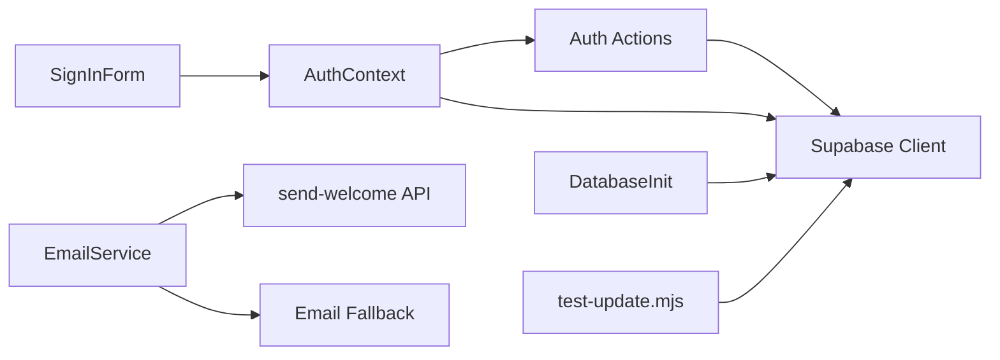

# Testing Strategy

<cite>
**Referenced Files in This Document**
- [test-update.mjs](file://test-update.mjs)
- [auth-context.tsx](file://lib/auth-context.tsx)
- [email-service.ts](file://lib/email-service.ts)
- [email-fallback.ts](file://lib/email-fallback.ts)
- [supabase.ts](file://lib/supabase.ts)
- [database-init.ts](file://lib/database-init.ts)
- [utils.ts](file://lib/utils.ts)
- [notification-context.tsx](file://lib/notification-context.tsx)
- [auth.ts](file://app/actions/auth.ts)
- [send-welcome/route.ts](file://app/api/send-welcome/route.ts)
- [send-order-placed/route.ts](file://app/api/send-order-placed/route.ts)
- [sign-in-form.tsx](file://components/sign-in-form.tsx)
- [theme-provider.tsx](file://components/theme-provider.tsx)
- [package.json](file://package.json)
- [README.md](file://README.md)
</cite>

## Table of Contents
1. [Introduction](#introduction)
2. [Project Structure](#project-structure)
3. [Core Components](#core-components)
4. [Architecture Overview](#architecture-overview)
5. [Detailed Component Analysis](#detailed-component-analysis)
6. [Dependency Analysis](#dependency-analysis)
7. [Performance Considerations](#performance-considerations)
8. [Troubleshooting Guide](#troubleshooting-guide)
9. [Conclusion](#conclusion)
10. [Appendices](#appendices)

## Introduction
This document defines a comprehensive testing strategy for the Byiora platform. It focuses on testing architecture, unit testing approaches, and integration testing across React components, context providers, utility functions, server actions, API routes, and database operations. The strategy leverages JavaScript testing utilities and the existing test-update.mjs script to validate Supabase connectivity and data updates. It provides practical patterns for authentication context, email service functions, and database operations, while addressing asynchronous operations, mock implementations, and test data management. Guidance is included for testing React hooks, async operations, and external service integrations, along with best practices for test organization, continuous integration, and automated testing workflows.

## Project Structure
The project follows a Next.js monorepo-like structure with clear separation of concerns:
- Client-side React components under components/
- Shared libraries under lib/, including Supabase client, authentication, notifications, email services, and utilities
- Server actions under app/actions/ for server-side logic
- API routes under app/api/ for server endpoints
- Scripts under scripts/ (e.g., test-update.mjs)
- Root configuration files for environment, dependencies, and tooling

**Diagram sources**
- [sign-in-form.tsx:1-208](file://components/sign-in-form.tsx#L1-L208)
- [theme-provider.tsx:1-12](file://components/theme-provider.tsx#L1-L12)
- [auth-context.tsx:1-374](file://lib/auth-context.tsx#L1-L374)
- [notification-context.tsx:1-242](file://lib/notification-context.tsx#L1-L242)
- [utils.ts:1-7](file://lib/utils.ts#L1-L7)
- [auth.ts:1-68](file://app/actions/auth.ts#L1-L68)
- [send-welcome/route.ts:1-69](file://app/api/send-welcome/route.ts#L1-L69)
- [send-order-placed/route.ts:1-90](file://app/api/send-order-placed/route.ts#L1-L90)
- [supabase.ts:1-188](file://lib/supabase.ts#L1-L188)
- [email-service.ts:1-126](file://lib/email-service.ts#L1-L126)
- [email-fallback.ts:1-31](file://lib/email-fallback.ts#L1-L31)
- [database-init.ts:1-164](file://lib/database-init.ts#L1-L164)
- [test-update.mjs:1-13](file://test-update.mjs#L1-L13)

**Section sources**
- [README.md:1-18](file://README.md#L1-L18)
- [package.json:1-51](file://package.json#L1-L51)

## Core Components
This section outlines the core components relevant to testing:
- Authentication context provider and hooks for user state, transactions, and auth actions
- Notification context provider for real-time notifications and persistence
- Email service with primary EmailJS integration and fallback mechanism
- Supabase client and typed database interfaces
- Database initialization and health checks
- Utility functions for component composition
- Server actions for authentication flows
- API routes for email delivery
- Client components that consume contexts and trigger actions

Key testing targets include:
- Unit tests for utility functions and pure logic
- Component testing for React components that use hooks and contexts
- Integration tests for server actions and API routes
- End-to-end tests for authentication flows and email delivery
- Database operation tests for connectivity, table presence, and seed checks

**Section sources**
- [auth-context.tsx:1-374](file://lib/auth-context.tsx#L1-L374)
- [notification-context.tsx:1-242](file://lib/notification-context.tsx#L1-L242)
- [email-service.ts:1-126](file://lib/email-service.ts#L1-L126)
- [email-fallback.ts:1-31](file://lib/email-fallback.ts#L1-L31)
- [supabase.ts:1-188](file://lib/supabase.ts#L1-L188)
- [database-init.ts:1-164](file://lib/database-init.ts#L1-L164)
- [utils.ts:1-7](file://lib/utils.ts#L1-L7)
- [auth.ts:1-68](file://app/actions/auth.ts#L1-L68)
- [send-welcome/route.ts:1-69](file://app/api/send-welcome/route.ts#L1-L69)
- [send-order-placed/route.ts:1-90](file://app/api/send-order-placed/route.ts#L1-L90)
- [sign-in-form.tsx:1-208](file://components/sign-in-form.tsx#L1-L208)
- [theme-provider.tsx:1-12](file://components/theme-provider.tsx#L1-L12)

## Architecture Overview
The testing architecture integrates unit, component, and integration layers:
- Unit tests validate pure functions and isolated logic
- Component tests validate React components using context providers and mocked dependencies
- Integration tests validate server actions and API routes against Supabase
- End-to-end tests validate complete flows (authentication, transactions, emails)

[No sources needed since this diagram shows conceptual workflow, not actual code structure]

## Detailed Component Analysis

### Authentication Context Provider
The authentication context orchestrates user sessions, transactions, and auth actions. It interacts with Supabase for session retrieval, user verification, and transaction persistence. It also triggers server actions for login, signup, and logout.

**Diagram sources**
- [sign-in-form.tsx:18-80](file://components/sign-in-form.tsx#L18-L80)
- [auth-context.tsx:129-163](file://lib/auth-context.tsx#L129-L163)
- [auth.ts:8-23](file://app/actions/auth.ts#L8-L23)
- [supabase.ts:1-7](file://lib/supabase.ts#L1-L7)

Practical testing patterns:
- Unit tests for context helper functions (e.g., transaction formatting)
- Component tests for SignInForm validating form submission, loading states, and toast messages
- Integration tests for loginWithPassword ensuring session creation and user/profile retrieval
- Mock Supabase client to isolate network calls and assert expected queries

Common challenges:
- Testing React hooks and context consumers requires wrapping components with AuthProvider
- Async flows require proper promise resolution and error handling assertions
- External service integrations (Supabase) require controlled environments or mocks

**Section sources**
- [auth-context.tsx:1-374](file://lib/auth-context.tsx#L1-L374)
- [auth.ts:1-68](file://app/actions/auth.ts#L1-L68)
- [sign-in-form.tsx:1-208](file://components/sign-in-form.tsx#L1-L208)

### Email Service Functions
The email service supports two paths:
- Primary: EmailJS with graceful degradation to fallback
- Fallback: Console logging and simulated delivery

**Diagram sources**
- [email-service.ts:75-125](file://lib/email-service.ts#L75-L125)
- [email-fallback.ts:3-30](file://lib/email-fallback.ts#L3-L30)

Practical testing patterns:
- Unit tests for email validation and template parameter construction
- Mock EmailJS to simulate success/failure scenarios
- Integration tests for fallback method ensuring logs and timing behavior
- API route tests for server-side email delivery with sanitized inputs

Common challenges:
- Environment variable handling and runtime detection (server vs client)
- Network failures and graceful fallbacks
- Sanitization and HTML generation for email templates

**Section sources**
- [email-service.ts:1-126](file://lib/email-service.ts#L1-L126)
- [email-fallback.ts:1-31](file://lib/email-fallback.ts#L1-L31)
- [send-welcome/route.ts:1-69](file://app/api/send-welcome/route.ts#L1-L69)
- [send-order-placed/route.ts:1-90](file://app/api/send-order-placed/route.ts#L1-L90)

### Database Operations and Initialization
Database initialization validates connectivity, table existence, and data presence. It also exposes helpers to test operations and seed data.

**Diagram sources**
- [database-init.ts:27-87](file://lib/database-init.ts#L27-L87)
- [supabase.ts:1-7](file://lib/supabase.ts#L1-L7)

Practical testing patterns:
- Unit tests for configuration checks and status reporting
- Integration tests for read/write operations across products, users, and transactions
- Script-based tests using test-update.mjs to validate Supabase connectivity and mutations

Common challenges:
- Distinguishing between connection errors and table-not-found errors
- Managing environment variables across development and CI
- Ensuring deterministic test data and cleanup

**Section sources**
- [database-init.ts:1-164](file://lib/database-init.ts#L1-L164)
- [supabase.ts:1-188](file://lib/supabase.ts#L1-L188)
- [test-update.mjs:1-13](file://test-update.mjs#L1-L13)

### Notification Context Provider
The notification context manages notifications, real-time updates via Supabase, and persistence. It depends on authentication context for user-scoped notifications.

**Diagram sources**
- [notification-context.tsx:36-220](file://lib/notification-context.tsx#L36-L220)
- [auth-context.tsx:31-32](file://lib/auth-context.tsx#L31-L32)

Practical testing patterns:
- Unit tests for notification formatting and filtering
- Integration tests for Supabase queries and real-time subscriptions
- Component tests for notification UI rendering and user interactions

Common challenges:
- Real-time subscription lifecycle and cleanup
- User scoping and broadcast notifications
- Toast integration and visibility

**Section sources**
- [notification-context.tsx:1-242](file://lib/notification-context.tsx#L1-L242)
- [auth-context.tsx:1-374](file://lib/auth-context.tsx#L1-L374)

### Utility Functions
Utility functions provide shared logic for component composition and styling.

**Diagram sources**
- [utils.ts:4-6](file://lib/utils.ts#L4-L6)

Practical testing patterns:
- Unit tests for class merging with various input combinations
- Component tests for styled components using cn-generated classes

Common challenges:
- Ensuring deterministic class ordering and overrides
- Cross-platform rendering consistency

**Section sources**
- [utils.ts:1-7](file://lib/utils.ts#L1-L7)

## Dependency Analysis
Testing dependencies and relationships:
- React components depend on context providers and server actions
- Server actions depend on Supabase client and email service
- API routes depend on email providers and DOM sanitization
- Database initialization depends on Supabase client and environment variables
- Email service depends on EmailJS and fallback mechanisms

**Diagram sources**
- [sign-in-form.tsx:1-208](file://components/sign-in-form.tsx#L1-L208)
- [auth-context.tsx:1-374](file://lib/auth-context.tsx#L1-L374)
- [auth.ts:1-68](file://app/actions/auth.ts#L1-L68)
- [email-service.ts:1-126](file://lib/email-service.ts#L1-L126)
- [email-fallback.ts:1-31](file://lib/email-fallback.ts#L1-L31)
- [database-init.ts:1-164](file://lib/database-init.ts#L1-L164)
- [test-update.mjs:1-13](file://test-update.mjs#L1-L13)

**Section sources**
- [sign-in-form.tsx:1-208](file://components/sign-in-form.tsx#L1-L208)
- [auth-context.tsx:1-374](file://lib/auth-context.tsx#L1-L374)
- [auth.ts:1-68](file://app/actions/auth.ts#L1-L68)
- [email-service.ts:1-126](file://lib/email-service.ts#L1-L126)
- [email-fallback.ts:1-31](file://lib/email-fallback.ts#L1-L31)
- [database-init.ts:1-164](file://lib/database-init.ts#L1-L164)
- [test-update.mjs:1-13](file://test-update.mjs#L1-L13)

## Performance Considerations
- Minimize real network calls in unit tests; prefer mocking Supabase and EmailJS
- Use deterministic test data and isolation to avoid flaky tests
- Batch database operations in integration tests to reduce latency
- Leverage caching and memoization in context providers to reduce re-renders during tests
- Profile component tests to identify heavy renders and optimize selectors

[No sources needed since this section provides general guidance]

## Troubleshooting Guide
Common testing challenges and resolutions:
- React hooks and context consumers: Wrap components with appropriate providers (AuthProvider, NotificationProvider) to ensure hooks resolve correctly
- Asynchronous operations: Use async/await patterns and timeouts to stabilize promises; assert state transitions after effects settle
- External service integrations: Mock EmailJS and Supabase clients; simulate success/failure paths to validate error handling
- Environment variables: Configure environment variables for Supabase and email services; validate configuration checks before running tests
- Real-time subscriptions: Unsubscribe channels in teardown; avoid memory leaks and duplicate listeners

**Section sources**
- [auth-context.tsx:1-374](file://lib/auth-context.tsx#L1-L374)
- [notification-context.tsx:1-242](file://lib/notification-context.tsx#L1-L242)
- [email-service.ts:1-126](file://lib/email-service.ts#L1-L126)
- [database-init.ts:1-164](file://lib/database-init.ts#L1-L164)

## Conclusion
Byiora’s testing strategy emphasizes layered validation across unit, component, and integration domains. The authentication context, email service, and database initialization are central to comprehensive test coverage. Using the existing test-update.mjs script, developers can validate Supabase connectivity and mutations. The recommended patterns—mocking external services, isolating async flows, and organizing tests by domain—enable maintainable and reliable test suites that scale with the platform.

[No sources needed since this section summarizes without analyzing specific files]

## Appendices

### Practical Testing Patterns Index
- Authentication context
  - Unit tests: transaction formatting helpers
  - Component tests: SignInForm form validation and submission
  - Integration tests: loginWithPassword and session persistence
- Email service
  - Unit tests: email validation and template params
  - Integration tests: EmailJS success/failure and fallback behavior
  - API route tests: server-side email delivery with sanitization
- Database operations
  - Unit tests: configuration checks and status reporting
  - Integration tests: read/write operations across tables
  - Script tests: connectivity and mutation validation
- Notifications
  - Unit tests: notification formatting and filtering
  - Integration tests: Supabase queries and real-time subscriptions
- Utilities
  - Unit tests: class merging logic
  - Component tests: styled component rendering

[No sources needed since this section provides general guidance]